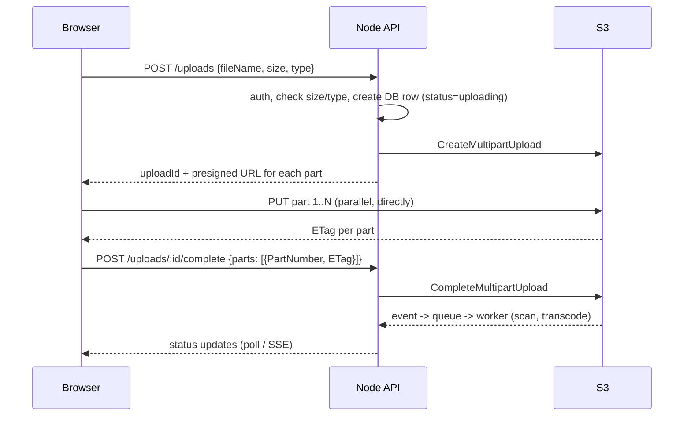

# Upload a 2 GB Video Without It Ever Touching Your Node.js Server

*Same idea as [[49-large-file-upload-with-status]] and [[64-500mb-video-upload-memory]]. This one adds the code for **multipart presigned uploads**, which is what 2 GB files need.*

## 1. The Answer in One Line

> The backend doesn't receive the file. It hands the browser **presigned URLs**, and the browser uploads **directly to S3** - in parts, in parallel, resumable. The backend only deals with small JSON messages.

## 2. Why Routing It Through Node Is Bad

- 2 GB per upload in memory (or disk) - 10 concurrent uploads = 20 GB.
- The request stays open for minutes, tying up connections.
- You pay bandwidth **twice** (client -> you, you -> S3).
- A dropped connection at 95% means starting again.

## 3. The Flow



## 4. Code (Node.js, AWS SDK v3)

```javascript
const { S3Client, CreateMultipartUploadCommand, UploadPartCommand,
        CompleteMultipartUploadCommand } = require('@aws-sdk/client-s3');
const { getSignedUrl } = require('@aws-sdk/s3-request-presigner');
const s3 = new S3Client({ region: process.env.AWS_REGION });
const PART_SIZE = 100 * 1024 * 1024;                          // 100 MB parts -> 21 parts for 2 GB

// 1. Start: validate, create the multipart upload, sign one URL per part
app.post('/api/uploads', authenticate, async (req, res) => {
  const { fileName, size, contentType } = req.body;
  if (size > 5 * 1024 ** 3) return res.status(400).json({ error: 'Max 5 GB' });
  if (!['video/mp4', 'video/quicktime'].includes(contentType)) return res.status(400).json({ error: 'Video only' });

  const key = `uploads/${req.user.id}/${crypto.randomUUID()}.mp4`;   // never trust the client's file name as the key
  const { UploadId } = await s3.send(new CreateMultipartUploadCommand({
    Bucket: process.env.BUCKET, Key: key, ContentType: contentType }));

  const partCount = Math.ceil(size / PART_SIZE);
  const urls = await Promise.all(Array.from({ length: partCount }, (_, i) =>
    getSignedUrl(s3, new UploadPartCommand({
      Bucket: process.env.BUCKET, Key: key, UploadId, PartNumber: i + 1 }), { expiresIn: 3600 })));

  const upload = await db.uploads.create({ userId: req.user.id, key, uploadId: UploadId, status: 'uploading' });
  res.json({ id: upload.id, partSize: PART_SIZE, urls });
});

// 2. Finish: the browser sends back each part's ETag
app.post('/api/uploads/:id/complete', authenticate, async (req, res) => {
  const upload = await db.uploads.findOne({ id: req.params.id, userId: req.user.id });   // ownership check
  if (!upload) return res.sendStatus(404);
  await s3.send(new CompleteMultipartUploadCommand({
    Bucket: process.env.BUCKET, Key: upload.key, UploadId: upload.uploadId,
    MultipartUpload: { Parts: req.body.parts } }));
  await db.uploads.update(upload.id, { status: 'processing' });
  res.json({ status: 'processing' });
});
```

**Browser side (short):** slice the file with `file.slice(start, end)`, `PUT` each slice to its URL (3-4 in parallel), read the `ETag` response header, retry a failed part on its own, and show progress per part. (The bucket's CORS must allow `PUT` and expose `ETag`.)

## 5. After the Upload

- An **S3 event** (via SQS) starts a **worker**: virus scan, transcode (e.g. MediaConvert), thumbnail. The worker updates the DB status (`processing` -> `ready` / `failed`) and the UI shows it.
- A **lifecycle rule** aborts incomplete multipart uploads after a day, so abandoned parts don't cost money.
- Serve the video through **CloudFront with signed URLs**, not a public bucket.

## 6. Why This Is the Right Design

| Concern | Result |
|---|---|
| Server memory / CPU | Only small JSON - the file never passes through Node |
| Bandwidth cost | Paid once (client -> S3) |
| Reliability | A failed part is retried alone; uploads can resume |
| Speed | Parts upload in parallel |
| Security | Short-lived URLs, one key per upload, auth + size/type checks before signing, private bucket |

## 🧠 Remember

> For big files, the backend signs and the browser uploads: presigned multipart URLs straight to S3, parts in parallel and retryable, an S3 event to kick off processing, and a status your UI can track.

## Self-Test

1. Why use multipart upload for a 2 GB file instead of one presigned PUT?
2. What stops a user from uploading a 50 GB file with your presigned URLs?
3. Why add a lifecycle rule for incomplete multipart uploads?

Related: [[49-large-file-upload-with-status]], [[64-500mb-video-upload-memory]], [[48-huge-json-payloads]]
