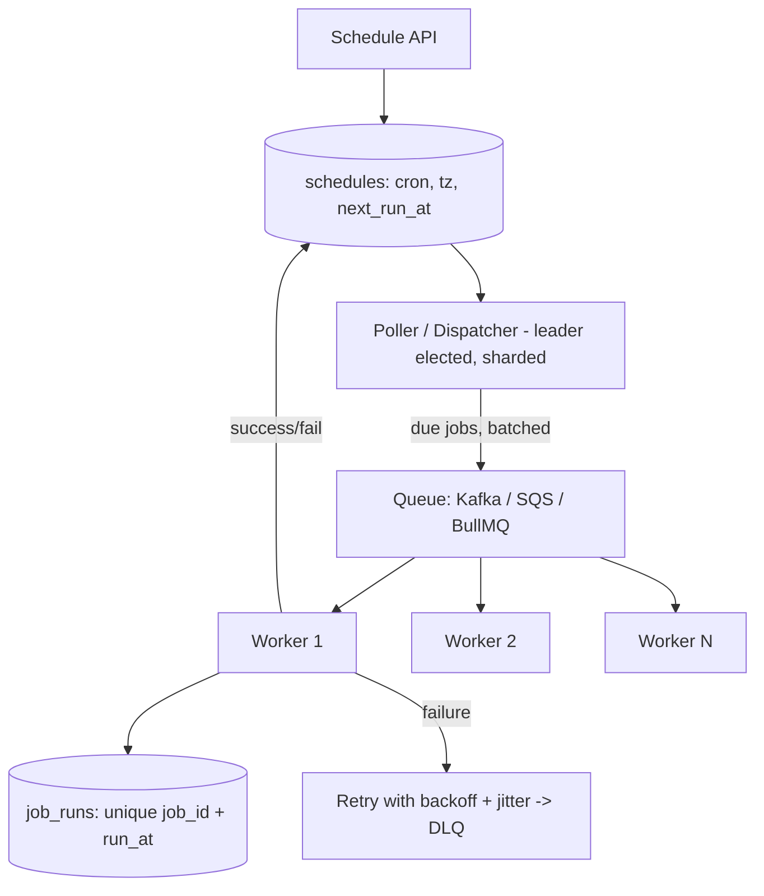

# Job Scheduler Design (Hinglish): "Every Monday 9 AM" x Millions of Jobs

> **Hinglish lesson** - aapne isi tarah maanga tha. Technical terms English mein hain.
> **Connects to**: [[03-ttl-deletion-at-scale]] (delay queue pattern), [[67-dst-scheduled-jobs]] (local time + DST), [[19-idempotent-consumer-duplicate-events]] (duplicate execution), [[65-pagerduty-incident-dedup-paging]] (outbox + leasing), [[14-cascading-failure-recovery]] (retries with backoff).

## 1. Problem Samjho

User bolta hai: "Har Monday 9 AM par mera report job chalao." Millions aise schedules hain. Humein chahiye:

- One-time **aur** recurring jobs
- **No duplicate execution** (ek run exactly ek baar effect kare)
- **Retry** failures
- **Worker crash** ho jaaye to job lost na ho

Naive solution: ek `setInterval` jo har minute poori table scan kare. 10 million rows par ye har minute database ko maar dega, aur agar wo ek server crash ho gaya to **saare** jobs ruk jaayenge. Isliye proper design chahiye.

## 2. Scale Estimate (pehle numbers)

Maan lo 10M schedules, average har schedule roz 1 baar chalta hai:

- `10,000,000 / 86,400` = **~115 jobs/second average**
- Peak bahut zyada, kyunki log round numbers chunte hain: 9:00 AM par lakhs jobs ek saath. Ye **thundering herd** hai ([[16-synchronized-connection-pool-expiry]] wali problem).
- Isliye: due jobs ko **second-level buckets** mein baanto aur execution ko thoda **jitter** do.

## 3. Core Idea: Schedule Store + Due Index + Workers

Teen alag cheezein rakho (ye sabse important design decision hai):

1. **Schedule table** (source of truth): kya chalana hai, kis rule se (cron expression + timezone).
2. **Due index / queue**: *agla* run kab hai - yahin se trigger hota hai (Redis ZSET ya `next_run_at` column with index).
3. **Run table** (execution log): har actual run ka record, jo duplicate rokta hai.



## 4. Trigger Kaise Kare (ye asli sawaal hai)

**Poller approach (simple aur reliable):**

```sql
-- har 1 second: sirf due rows, batch mein, lock ke saath
UPDATE schedules SET status = 'dispatching', locked_by = $worker, locked_at = now()
WHERE id IN (
  SELECT id FROM schedules
  WHERE next_run_at <= now() AND status = 'active'
  ORDER BY next_run_at
  LIMIT 500
  FOR UPDATE SKIP LOCKED          -- do pollers same row na uthayein
)
RETURNING id, cron_expr, timezone;
```

`FOR UPDATE SKIP LOCKED` ki wajah se aap **kai poller** chala sakte ho bina duplicate ke. Index chahiye: `(status, next_run_at)`.

**Redis ZSET approach (bahut fast):** `ZADD due_jobs <next_run_epoch> <jobId>`, phir `ZRANGEBYSCORE due_jobs 0 now LIMIT 0 500` + atomic remove (Lua). Memory mein hone ki wajah se millions par bhi milliseconds. Lekin Redis source of truth nahi - **DB hi truth hai**, Redis sirf index hai, taaki restart par rebuild ho sake.

**Scale karne ke liye sharding:** `shard = hash(job_id) % N`. Har poller instance apna shard dekhta hai. Ek poller mar gaya to uska shard doosre ko mil jaata hai (leader election / consistent hashing). Isse ek hi poller bottleneck nahi banta.

## 5. Duplicate Execution Kaise Roke

Sirf queue par bharosa mat karo - queues **at-least-once** hote hain, exactly-once nahi ([[19-idempotent-consumer-duplicate-events]]).

```sql
-- har run ka unique identity: job + uska scheduled time
CREATE TABLE job_runs (
  job_id bigint, run_at timestamptz, status text, attempt int,
  PRIMARY KEY (job_id, run_at)
);
```

Worker kaam shuru karne se pehle:

```javascript
// DB decide karega, application check nahi - yahi race-free hai
const { rowCount } = await db.query(
  `INSERT INTO job_runs (job_id, run_at, status, attempt)
   VALUES ($1, $2, 'running', 1) ON CONFLICT DO NOTHING`, [jobId, runAt]);
if (rowCount === 0) return;   // koi aur already chala raha hai / chala chuka hai
await doTheWork(jobId, runAt);
```

Ye wahi check-then-act fix hai jo [[26-duplicate-email-race-condition]] mein hai: database uniqueness enforce kare, code nahi.

## 6. Worker Crash Handle Karna (leasing / visibility timeout)

Worker job utha kar mar gaya - ab kya? Har run ke saath ek **lease** do:

- Worker `locked_at` set karta hai aur beech-beech mein **heartbeat** karke lease extend karta hai.
- Ek **reaper** job un rows ko dhoondhta hai jinka `status='running'` hai lekin `locked_at` purana ho gaya (lease expired), aur unhe wapas `pending` kar deta hai.
- SQS mein ye built-in hai (visibility timeout), Kafka mein consumer group rebalance karta hai.

Isliye jobs **idempotent** hone chahiye - kyunki crash ke baad wahi run dobara chalega.

## 7. Recurring Jobs: Agla Run Kab?

Job complete hone ke **baad** next run calculate karo, purane schedule se:

```javascript
const { CronExpressionParser } = require('cron-parser');
// local time + IANA timezone store karo, fixed UTC nahi (DST issue - Lesson 67)
const it = CronExpressionParser.parse('0 9 * * 1', { tz: 'Asia/Kolkata', currentDate: lastRunAt });
await db.query('UPDATE schedules SET next_run_at = $1, status = $2 WHERE id = $3',
  [it.next().toDate(), 'active', jobId]);
```

Do zaroori baatein:
- **Timezone + DST**: "9 AM local" ko har baar fresh calculate karo ([[67-dst-scheduled-jobs]]).
- **Missed runs policy**: agar system 3 ghante down tha, to kya sab missed runs chalayenge (catch-up) ya sirf latest (skip)? Ye business decision hai - interview mein poochho. Reports ke liye aksar "skip, sirf latest chalao" sahi hota hai.

## 8. Retries aur Failures

- **Exponential backoff + jitter** (1m, 5m, 25m...), max attempts ke saath ([[14-cascading-failure-recovery]]).
- Max attempts ke baad **dead letter queue** + alert - silently drop mat karo.
- Ek customer ke jobs baaki sabko block na karein: per-tenant **rate limit** ya alag queue (bulkhead).

## 9. Peak Handling (9 AM problem)

- **Jitter**: `next_run_at + random(0..60s)`, taaki 9:00:00 par sab ek saath na chalein.
- **Bounded worker concurrency** ([[61-1000-requests-10x-faster]]) aur queue depth par autoscaling ([[23-queue-backlog-after-spike]]).
- Poller queue mein daal deta hai - agar workers slow hain to backlog banega, par jobs lost nahi honge.

## 10. Trade-offs (interview mein bolne layak)

| Approach | Plus | Minus |
|---|---|---|
| DB polling (`SKIP LOCKED`) | Simple, ek hi source of truth, crash-safe | Har second query; index aur sharding zaroori |
| Redis ZSET | Bahut fast, millions handle karta hai | Redis restart/failover par rebuild chahiye; truth DB mein hi rakho |
| Kafka delayed topics | High throughput, durable | Arbitrary per-job time set karna awkward |
| Cloud (EventBridge/Cloud Scheduler) | Aapko kuch chalana nahi padta | Per-schedule limits aur cost, vendor lock-in |

## 11. 🧠 Remember

> Schedule (kya chalana hai), due index (kab chalana hai) aur run log (kya chal chuka hai) - teeno alag rakho: DB se due jobs `SKIP LOCKED` se batch mein uthao, `(job_id, run_at)` ke unique constraint se duplicate roko, lease + reaper se crash handle karo, backoff+jitter se retry karo, aur next run hamesha local time + timezone se calculate karo.

## 12. Quick Self-Test

1. Queue "at-least-once" hai - to phir duplicate execution kaunsi cheez rokti hai?
2. Worker crash hone par job wapas kaise aata hai, aur uske liye job mein kya property honi chahiye?
3. 9:00 AM par lakhs jobs ek saath due hain - aap kya badlenge?
