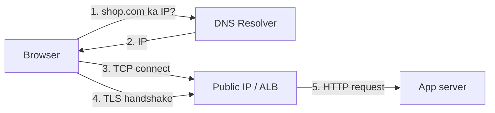

# 1. User -> DNS -> Application

**Ek line mein:** browser ko pehle naam se IP nikalni hoti hai (DNS), phir us IP tak TCP+TLS connection banta hai, tab jaakar aapka app request dekhta hai.



## Steps detail mein

1. **DNS lookup** - browser cache -> OS cache -> resolver (DHCP se mila, ya 8.8.8.8) -> root -> `.com` -> authoritative (Route 53). Resolver ki apni IP lookup nahi hoti, wo pehle se configured hoti hai.
2. **Public IP / endpoint** - aksar IP nahi, ALB ka DNS naam milta hai (`my-alb-123.ap-south-1.elb.amazonaws.com`). Route 53 mein iske liye **ALIAS record** use karo, CNAME nahi (root domain par CNAME allowed nahi hota).
3. **Routing** - packet internet se aapke VPC ke Internet Gateway tak, phir route table + subnet ke through ALB tak.
4. **TLS** - certificate ALB par hota hai (ACM se). Handshake mein **SNI** batata hai ki kaunse domain ka cert chahiye.
5. **App entry point** - ALB listener -> target group -> EC2/ECS ka port.

## Kya-kya toot sakta hai

| Symptom | Asli wajah |
|---|---|
| `DNS_PROBE_FINISHED_NXDOMAIN` | Record hi nahi hai, ya typo |
| Purani IP par ja raha hai | DNS **TTL** - purana record cache mein hai |
| `ERR_CERT_COMMON_NAME_INVALID` | Cert domain match nahi karta (www vs root) |
| Connection timeout | Security group / NACL block, ya galat subnet |

## Debug commands

```bash
dig +short shop.com            # kaunsi IP mil rahi hai
dig shop.com +trace            # poora resolution chain
curl -vI https://shop.com      # TLS + response headers
openssl s_client -connect shop.com:443 -servername shop.com   # cert details
```

## 🧠 Remember

> Naam -> IP (DNS), IP -> connection (TCP), connection -> secure (TLS), secure -> app (listener). "Page load nahi ho raha" hamesha in chaar mein se ek jagah ruka hota hai.

**Aage padho:** [[78-who-resolves-the-dns-server]]
