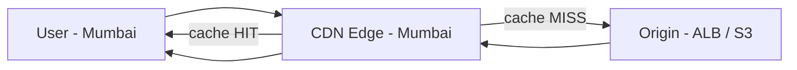

# 2. User -> CDN -> Origin

**Ek line mein:** CDN aapke content ki copy duniya bhar ke edge locations par rakhta hai, taaki zyadatar request aapke server tak pahunche hi na.



## Flow

1. User ka request **nearest edge** par jaata hai (Anycast DNS ki wajah se).
2. Edge apna cache dekhta hai: **HIT** = turant response (10-30ms), origin ko pata bhi nahi chalta.
3. **MISS** = edge origin se maangta hai, response cache karke user ko deta hai.
4. Agli baar usi region ke sab users ko HIT milta hai.

## Cache control (yahi asli kaam hai)

```
Cache-Control: public, max-age=31536000, immutable   # hashed assets: app.a1b2c3.js
Cache-Control: public, max-age=0, s-maxage=300       # HTML: browser fresh, CDN 5 min
Cache-Control: private, no-store                     # user-specific pages
```

- **Cache key** mein kya jaata hai (path, query, kuch headers, cookies) - galat set kiya to ya sab MISS honge, ya ek user ka data doosre ko dikh jaayega.
- **Invalidation**: file ka naam badlo (content hash) - sabse safe. `CreateInvalidation` slow aur costly hai.

## Kya toot sakta hai

- **Hit rate kam** -> har request origin par. Wajah: cookies/query cache key mein, ya `no-cache` headers.
- **Purana content** -> TTL lamba aur asset ka naam nahi badla.
- **Private data cache ho gaya** -> `Cache-Control: private` bhool gaye. Ye security bug hai.
- **CORS error sirf CDN se** -> `Vary: Origin` aur allowed headers forward nahi ho rahe.

## Debug

```bash
curl -I https://cdn.shop.com/app.js | grep -i "x-cache\|age\|cache-control"
# CloudFront: X-Cache: Hit from cloudfront  /  Miss from cloudfront
```

## 🧠 Remember

> CDN tabhi faayda deta hai jab hit rate high ho - asli kaam cache headers aur cache key sahi karna hai, sirf CloudFront on kar dena nahi.

**Aage padho:** [[07-cors-error-fix]] [[38-first-thing-to-scale]]
