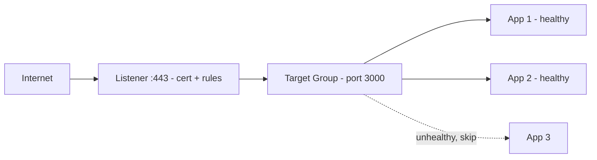

# 3. Internet -> Load Balancer -> App

**Ek line mein:** load balancer magic nahi hai - chaar cheezein sahi honi chahiye: listener, target group, health check, security group.



## Chaar hisse

1. **Listener** - kaunse port par sunna hai (80/443), TLS cert kahan hai, aur rules (path `/api/*` -> API target group).
2. **Target group** - instances/IPs + **backend port**. ALB ka 443 aur app ka 3000 alag hote hain.
3. **Health checks** - path (`/health`), interval, healthy/unhealthy threshold. Yahi decide karta hai ki AZ down hone par kitni jaldi traffic hatega.
4. **Security groups** - do alag: ALB ka SG internet se 443 allow kare; **app ka SG sirf ALB ke SG se** 3000 allow kare (IP range nahi, SG reference).

## Common failures

| Dikhta hai | Wajah |
|---|---|
| 502 Bad Gateway | App crash, galat port, ya app `127.0.0.1` par bind |
| 503 Service Unavailable | Koi healthy target hi nahi |
| 504 Gateway Timeout | App slow, ya ALB idle timeout app se chhota |
| Sab targets unhealthy | `/health` 200 nahi de raha, ya SG ne health check block kiya |

## ALB vs NLB (ek line)

**ALB** = layer 7 (HTTP rules, path routing, cookies). **NLB** = layer 4 (TCP, bahut tez, static IP, non-HTTP protocols).

## Debug

```bash
aws elbv2 describe-target-health --target-group-arn <arn>   # reason code yahin milta hai
curl -I http://<instance-private-ip>:3000/health            # bastion se seedha app
```

## 🧠 Remember

> LB = listener (kahan sunna) + target group (kise bhejna) + health check (kaun zinda hai) + security group (kis se baat karni hai). 502/503/504 inhi chaar ki kahani hai.

**Aage padho:** [[74-ingress-502-bad-gateway]] [[99-az-down-what-to-check-first]]
