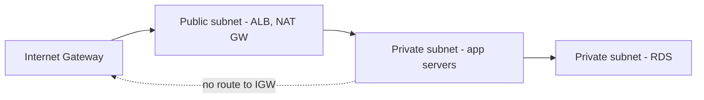

# 4. Public Subnet -> Private Subnet

**Ek line mein:** subnet public ya private uske naam se nahi, uske **route table** se banta hai -- jiska 0.0.0.0/0 Internet Gateway par jaata hai wo public, baaki private.



## Public aur private ka asli farak

Dono subnets ek hi VPC mein hote hain, dono ke paas private IP range hota hai, dono ek dusre se by-default baat kar sakte hain (VPC ka local route). Farak sirf do jagah hai:

1. **Route table** -- public subnet ke route table mein `0.0.0.0/0 -> igw-xxxx` hota hai. Private subnet mein wo entry hoti hi nahi (ya NAT Gateway par jaati hai, lesson 5).
2. **Public IP** -- public subnet mein instance ko public IPv4 milta hai (auto-assign ya Elastic IP). Bina public IP ke IGW route bekaar hai -- IGW 1:1 NAT karta hai private IP <-> public IP, IP hi nahi to translate kya kare.

Isiliye **production layout** hamesha ye hota hai: internet-facing cheezein (ALB, NAT Gateway, bastion) public subnet mein, aur app + database private subnet mein. App ka koi public IP hi nahi -- internet se usko dial karna possible hi nahi.

## Public se private tak traffic kaise pahunchta hai

User -> ALB (public subnet) -> ALB naya connection kholta hai app ke **private IP** par (private subnet) -> app -> RDS. Beech mein internet kahin nahi hai. ALB ke paas dono subnets mein ENI hote hain? Nahi -- ALB apne public subnets mein hota hai aur VPC ke andar private IP par target se baat karta hai, kyunki VPC ka `local` route sab subnets ko jodta hai.

Security groups yahan chain banate hain: `alb-sg` internet se 443 leta hai, `app-sg` sirf `alb-sg` se 3000 leta hai, `db-sg` sirf `app-sg` se 5432 leta hai.

## Kya-kya tootta hai

| Dikhta hai | Asli wajah |
|---|---|
| "Public subnet" mein instance internet se reachable nahi | Instance ko public IP assign hi nahi hua (auto-assign off) |
| Instance ke paas public IP hai, phir bhi nahi chalta | Subnet ke route table mein IGW route missing |
| ALB targets private subnet mein register nahi ho rahe | ALB ke liye kam se kam 2 AZ ke subnets chahiye, aur target same VPC mein hona chahiye |
| App se DB connect nahi ho raha (same VPC) | SG chain galat -- db-sg mein app-sg allow nahi kiya |
| SSH kaam karta hai par kuch bhi return nahi hota | NACL stateless hai -- outbound/ephemeral ports (1024-65535) block ho gaye |

**Yaad rakho:** security group **stateful** hai (reply apne aap allow), NACL **stateless** hai (dono direction alag likhni padti hai). Zyadatar log NACL ko default hi chhodte hain, aur yahi sahi default hai.

## Debug

```bash
# subnet kis route table se juda hai
aws ec2 describe-route-tables --filters "Name=association.subnet-id,Values=subnet-abc123"

# subnet public hai ya nahi (auto-assign public IP)
aws ec2 describe-subnets --subnet-ids subnet-abc123 \
  --query "Subnets[].[SubnetId,AvailabilityZone,MapPublicIpOnLaunch,CidrBlock]"

# instance ke paas public IP hai kya
aws ec2 describe-instances --instance-ids i-0abc --query \
  "Reservations[].Instances[].[PrivateIpAddress,PublicIpAddress,SubnetId]"

# private subnet ke instance se, bastion ke through
nc -zv 10.0.2.15 5432
```

## 🧠 Remember

> Subnet ko public uska naam nahi, uska route table banata hai -- `0.0.0.0/0 -> igw` + public IP. Dono na ho to wo private hai, chaahe tag kuch bhi kaho.

**Aage padho:** [[08-ec2-no-internet-troubleshooting]] [[12-multi-az-availability]]
