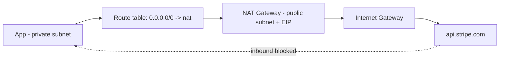

# 5. Private Subnet -> Internet

**Ek line mein:** private instance ko internet chahiye (apt update, Stripe API) par internet ko wo instance nahi milna chahiye -- yahi one-way darwaza NAT Gateway hai.



## NAT ka kaam kya hai

NAT Gateway **source NAT** karta hai. App ka packet nikalta hai `10.0.2.15:51234 -> 34.x.x.x:443`. NAT us packet ka source apne Elastic IP se badal deta hai, connection ka mapping table mein rakhta hai, aur reply aane par wapas usi instance ko de deta hai.

Isliye **outbound-initiated** connections chalte hain, **inbound-initiated** nahi. Stripe apne aap tumhare app ko call nahi kar sakta -- mapping table mein uski entry hi nahi hai.

Setup ke teen tukde, teeno chahiye:

1. NAT Gateway **public subnet** mein banao (usko khud IGW route chahiye), Elastic IP attach karo.
2. **Private** subnet ke route table mein `0.0.0.0/0 -> nat-xxxx`.
3. App ka SG outbound 443 allow kare (default outbound allow-all hota hai, log isko tighten karke bhool jaate hain).

## Public IP kyun nahi de dete?

Tempting shortcut: instance ko public IP de do aur IGW route laga do -- outbound chal jayega. Problem ye hai ki public IP **do-tarfa** hai. Ab wo instance poori duniya ko dikhta hai, aur bachav sirf security group par tikta hai. Ek galat SG rule (`0.0.0.0/0` par 22 ya 5432) aur database internet par hai.

NAT ke saath instance ka koi public IP hai hi nahi -- misconfigure karne ke liye kuch bacha hi nahi. Ye **defence in depth** hai: SG galat ho bhi jaye to routing tumhe bacha legi.

## IPv6 -- egress-only IGW

IPv6 mein NAT ka concept hi nahi hai (addresses itne hain ki sharing ki zaroorat nahi). IPv6 addresses globally routable hote hain, matlab public IP wali hi problem wapas.

Iska jawab **Egress-Only Internet Gateway** hai. Ye stateful hai: outbound IPv6 allow, inbound initiate block -- bilkul NAT jaisa behaviour, bina address translation ke. Route aisa hota hai: `::/0 -> eigw-xxxx`.

| Kya chahiye | IPv4 | IPv6 |
|---|---|---|
| Outbound only | NAT Gateway | Egress-Only IGW |
| Two-way public | IGW + public IP | IGW + IPv6 address |
| Charge | per hour + per GB | free |

## Kya-kya tootta hai

| Dikhta hai | Asli wajah |
|---|---|
| `apt update` hang, timeout | Private route table mein NAT route missing |
| AZ down hote hi aadha fleet ka outbound band | NAT Gateway **AZ-scoped** hai -- har AZ mein alag NAT chahiye |
| Bill mein surprise, NAT data processing bahut zyada | S3/ECR ka traffic NAT se ja raha hai, VPC endpoint chahiye (lesson 6) |
| `ErrorPortAllocation` / random connection fail | Ek hi destination IP+port par 55k se zyada concurrent connections -- connections reuse karo |
| NAT Gateway hi nahi ban raha | Public subnet mein nahi banaya, ya EIP attach nahi kiya |

Cross-AZ cost ka point important hai: agar AZ-b ka instance AZ-a ke NAT ko use karega to cross-AZ data transfer charge bhi lagega **aur** AZ-a girne par AZ-b ka outbound bhi mar jayega. Per-AZ NAT = availability + cost dono.

## Debug

```bash
# private subnet ka route table -- nat target dikhna chahiye
aws ec2 describe-route-tables --filters "Name=association.subnet-id,Values=subnet-priv-1" \
  --query "RouteTables[].Routes[]"

# NAT gateway ki state aur uska subnet
aws ec2 describe-nat-gateways \
  --query "NatGateways[].[NatGatewayId,State,SubnetId,NatGatewayAddresses[0].PublicIp]"

# instance se: bahar kaunsa IP dikh raha hai (NAT ka EIP aana chahiye)
curl -s https://checkip.amazonaws.com

# DNS theek hai par TCP nahi -- ye farak saaf karta hai
dig +short api.stripe.com
curl -sv --max-time 5 https://api.stripe.com/v1 2>&1 | head -20
```

## 🧠 Remember

> NAT Gateway ek one-way darwaza hai: andar se bahar jaa sakte ho, bahar se andar nahi. IPv6 mein wahi kaam Egress-Only IGW karta hai -- aur dono per-AZ hone chahiye.

**Aage padho:** [[08-ec2-no-internet-troubleshooting]] [[99-az-down-what-to-check-first]]
