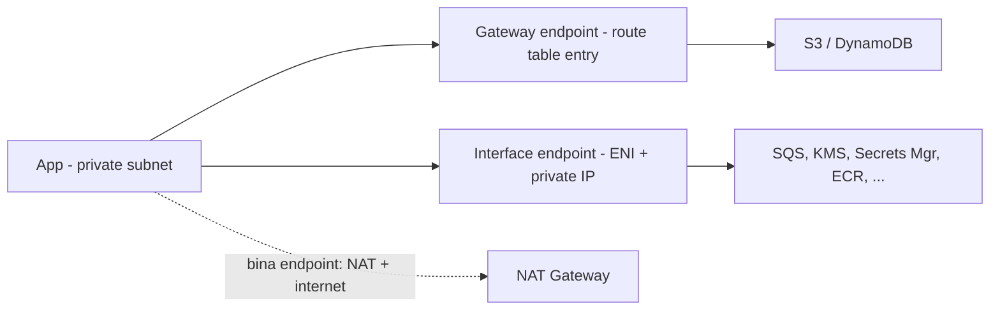

# 6. Private Resource -> AWS Service

**Ek line mein:** S3, SQS, Secrets Manager -- ye sab **public endpoints** hain, to private app inse baat karne ke liye by default NAT + internet se hokar jaata hai; VPC endpoint us traffic ko VPC ke andar hi rakh deta hai.



## Problem pehle samjho

`s3.ap-south-1.amazonaws.com` ek public DNS naam hai jo public IP deta hai. Tumhara app private subnet mein hai, to uska S3 call `0.0.0.0/0` route pakadta hai -> NAT Gateway -> IGW -> AWS ka public network -> S3. Traffic AWS network se bahar shayad na jaye, par:

- NAT ka **per-GB data processing charge** lagta hai. Roz 500 GB backup S3 par bhejte ho? Sirf NAT processing ka bill hi mahine ka acchha khasa ban jaata hai.
- App ko **internet route chahiye** hi rahega. Fully air-gapped subnet banana possible nahi.
- Audit mein jawab dena mushkil: "data internet par gaya ya nahi?"

VPC endpoint teeno theek karta hai -- traffic AWS ke private network par rehta hai, NAT bypass ho jaata hai.

## Do type hote hain -- yahi asli exam question hai

| | **Gateway endpoint** | **Interface endpoint (PrivateLink)** |
|---|---|---|
| Services | Sirf **S3 aur DynamoDB** | Baaki lagbhag sab (SQS, SNS, KMS, Secrets Manager, ECR, SSM, CloudWatch...) |
| Kaise kaam karta hai | **Route table** mein prefix-list entry | Subnet mein **ENI** with private IP |
| Cost | **Free** | Per-ENI per-hour + per-GB |
| DNS | Public naam hi rehta hai, routing badalti hai | Private DNS on karo to wahi naam ENI ke private IP par resolve hota hai |
| On-prem (VPN/Direct Connect) se | **Nahi** chalta | Chalta hai |
| Cross-region | Nahi | Nahi |

Gateway endpoint ka mental model: "route table mein likha hai ki S3 ke IP range ke liye internet mat jao, is endpoint se jao." Isliye jis **route table** se subnet juda hai usmein endpoint associate karna zaroori hai -- bhool gaye to traffic chupchaap NAT se jaata rahega aur kuch fail nahi hoga, sirf bill aayega.

Interface endpoint ka mental model: "service ka ek chhota sa darwaza meri subnet ke andar hi rakh do." Uska apna **security group** hota hai -- app-sg se 443 allow karna padta hai, warna timeout.

## Private DNS ka jaadu

Interface endpoint banate waqt `PrivateDnsEnabled` on karo, to Route 53 ke private hosted zone se `sqs.ap-south-1.amazonaws.com` ab public IP ki jagah endpoint ENI ka private IP deta hai. Iska matlab: **code badalna nahi padta**. SDK wahi purana naam call karta rahega, traffic chupchaap private ho jayega.

Off rakhoge to har endpoint ka apna DNS naam (`vpce-xxxx...`) code mein daalna padega -- ye sirf tab karo jab tum jaan-bujhkar kuch traffic public rakhna chahte ho.

## Endpoint policy -- security angle

Endpoint par ek **resource policy** lagti hai jo us darwaze se jaane wale har call par apply hoti hai. IAM policy kehti hai "ye principal kya kar sakta hai"; endpoint policy kehti hai "is raaste se kya guzar sakta hai".

Classic use case -- data exfiltration rokna: endpoint policy mein sirf apne buckets allow karo. Ab agar koi compromised process kisi attacker ke S3 bucket mein data upload karne ki koshish kare, endpoint use denied kar dega. Dusri taraf S3 bucket policy mein `aws:SourceVpce` condition lagao -- bucket sirf tumhare endpoint se hi accessible.

## Kya-kya tootta hai

| Dikhta hai | Asli wajah |
|---|---|
| Endpoint bana diya, phir bhi NAT bill same | Gateway endpoint galat/kam route tables se associated hai |
| Interface endpoint par har call timeout | Endpoint ke SG mein app-sg se 443 allow nahi |
| `AccessDenied` sirf VPC ke andar se, bahar se theek | Endpoint policy bahut tight (default `*` ko badla hoga) |
| On-prem server se S3 endpoint kaam nahi karta | Gateway endpoint VPN/DX se reachable hi nahi -- interface endpoint chahiye |
| Endpoint hai par DNS abhi bhi public IP de raha | Private DNS disabled, ya VPC mein `enableDnsHostnames`/`enableDnsSupport` off |

## Debug

```bash
# saare endpoints, type aur state
aws ec2 describe-vpc-endpoints --query \
  "VpcEndpoints[].[VpcEndpointId,ServiceName,VpcEndpointType,State,PrivateDnsEnabled]"

# gateway endpoint kaunse route tables se juda hai
aws ec2 describe-vpc-endpoints --vpc-endpoint-ids vpce-0abc \
  --query "VpcEndpoints[].RouteTableIds"

# is region mein kaunsi service ka endpoint available hai
aws ec2 describe-vpc-endpoint-services --query "ServiceNames" | grep -i secretsmanager

# instance se: private IP (10.x / 100.x) aana chahiye, public nahi
dig +short sqs.ap-south-1.amazonaws.com
dig +short s3.ap-south-1.amazonaws.com    # gateway endpoint mein ye PUBLIC IP hi dega -- normal hai

# call actually chal raha hai ya nahi
aws s3 ls s3://my-bucket --debug 2>&1 | grep -i "endpoint\|connection"
```

Note: gateway endpoint ke case mein DNS public IP hi dikhayega -- wo galat nahi hai. Routing route table mein badalti hai, DNS mein nahi. Verify karne ke liye VPC Flow Logs dekho ya NAT ke bytes gir rahe hain ya nahi.

## 🧠 Remember

> S3/DynamoDB = free **Gateway** endpoint (route table entry). Baaki sab = paid **Interface** endpoint (subnet mein ENI) + private DNS on, taki code same rahe. Endpoint policy = "is raaste se kya guzar sakta hai".

**Aage padho:** [[46-build-vs-rent-infrastructure]] [[08-ec2-no-internet-troubleshooting]]
