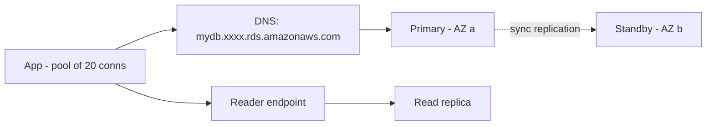

# 7. App -> Database

**Ek line mein:** DB connection sasta nahi hota -- isliye hamesha **DNS endpoint** se connect karo (IP se kabhi nahi), pool banao, aur har request mein round trips ginna seekho.



## Hamesha DNS endpoint, kabhi IP nahi

RDS ka endpoint (`mydb.abc123.ap-south-1.rds.amazonaws.com`) ek **CNAME** hai jo current primary ke IP par point karta hai. Multi-AZ failover ke waqt AWS us DNS record ko standby ke IP par ghuma deta hai -- instance badal jaata hai, naam wahi rehta hai.

Agar tumne config mein IP hardcode kiya, failover ke baad app purane (ab dead) instance ko dial karta rahega. Isliye rule: **connection string mein hamesha endpoint naam.**

Ek aur trap: JVM jaise runtimes DNS ko forever cache kar lete hain (`networkaddress.cache.ttl`). Node/Python mein OS resolver ka TTL chalta hai. RDS DNS ka TTL chhota (~5s) hai -- app ko usko respect karna chahiye, warna failover hone ke baad bhi app 10 minute tak purane IP par atka rahega.

## Connection pool -- kyun aur kab phategi

Har nayi Postgres connection mahangi hai: TCP handshake + TLS handshake + auth + server side process/memory. Isliye app startup par N connections khol ke rakh leta hai aur reuse karta hai. Yahi **pool** hai.

Math simple hai aur log yahin galti karte hain:

```
total DB connections = app instances x pool size per instance
```

10 pods x pool 20 = 200 connections. Agar RDS ka `max_connections` 200 hai to autoscaling ka 11th pod aate hi `FATAL: too many connections` aayega -- **DB par load kam hone par bhi**.

| Dikhta hai | Asli wajah |
|---|---|
| `too many connections` | pods x pool size > max_connections |
| Request timeout, DB CPU sirf 10% | **Pool exhaustion** -- sab connections ek slow query par atki hain |
| Failover ke baad 10 min tak error | DNS caching, ya pool mein dead connections pade hain |
| Random `connection reset by peer` | Idle connection ko NAT/firewall ne kaat diya, pool ko pata nahi |
| Har deploy par DB connection spike | Saare pods ek saath connect kar rahe hain |
| Har ~1 hour par ek saath sab reconnect | Pool ka `maxLifetime` sab connections mein same, jitter nahi |

Pool exhaustion sabse zyada confuse karta hai: **database bilkul idle dikhta hai**, phir bhi app 504 de raha hai. Kyunki bottleneck DB ka CPU nahi, pool ka free slot hai. Pool size badhana usually galat ilaaj hai -- slow query theek karo.

## Security group chain + TLS

DB ko kabhi IP CIDR se allow mat karo. `db-sg` ka inbound rule aisa ho: **port 5432, source = `app-sg`** (security group reference). Ab app kitne bhi scale ho, IP kuch bhi ho, rule badalna nahi padta -- aur koi doosra instance galti se DB tak nahi pahunch sakta.

TLS: RDS in-transit encryption support karta hai. Client ko RDS CA bundle chahiye aur `sslmode=verify-full` (Postgres) -- `require` sirf encrypt karta hai, server verify nahi karta, matlab MITM ke against poora bachav nahi. Production mein `verify-full` + CA bundle.

## Read replica routing

Writes hamesha primary par. Reads replica par bhej sakte ho -- par replica **asynchronously** lag karta hai. Matlab: user ne profile update kiya (primary), turant page refresh kiya (replica), aur purana data dikha. Isko "read your own writes" problem kehte hain.

Practical rule: analytics/reports/search -> replica. User ka apna data jo usne abhi likha -> primary. Aurora reader endpoint multiple replicas par load balance karta hai, par lag ka problem wahi rehta hai.

## Latency aur N+1

Har query ka cost = network round trip + query execution. Same-AZ mein RTT ~0.5ms, cross-AZ ~1-2ms. Chhota lagta hai, lekin:

- 1 query lene wala endpoint: ~2ms network
- ORM ka N+1 (1 list query + 100 child queries): ~200ms sirf network mein, DB dashboard par har query "0.3ms fast" dikhegi

Isliye **query count** dekho, sirf query time nahi. Fix: JOIN, `IN (...)` batch, ya ORM ka eager loading (`include` / `preload`).

## Debug

```bash
# RDS endpoint, Multi-AZ, kaunsa AZ primary hai
aws rds describe-db-instances --db-instance-identifier mydb \
  --query "DBInstances[].[Endpoint.Address,Endpoint.Port,MultiAZ,AvailabilityZone,DBInstanceStatus]"

# endpoint abhi kis IP par point kar raha hai (failover ke pehle/baad chalao)
dig +short mydb.abc123.ap-south-1.rds.amazonaws.com

# app host se reachability -- SG chain test
nc -zv mydb.abc123.ap-south-1.rds.amazonaws.com 5432

# TLS ke saath connect
psql "host=mydb.abc123.ap-south-1.rds.amazonaws.com dbname=app user=app sslmode=verify-full"

# kaun kitni connections khaye baitha hai
psql -c "SELECT state, count(*) FROM pg_stat_activity GROUP BY state;"
psql -c "SELECT count(*) FROM pg_stat_activity;"
psql -c "SHOW max_connections;"

# lambi chal rahi queries (pool exhaustion ka culprit)
psql -c "SELECT pid, now()-query_start AS age, state, left(query,60)
         FROM pg_stat_activity WHERE state <> 'idle' ORDER BY age DESC LIMIT 10;"

# replica lag (seconds)
psql -h reader-endpoint -c "SELECT EXTRACT(EPOCH FROM (now() - pg_last_xact_replay_timestamp()));"
```

## 🧠 Remember

> DB connection ek scarce resource hai, request nahi. Endpoint naam se connect karo, pool ka size `pods x pool <= max_connections` rakho, aur jab DB idle ho par app slow -- to pool dekho, DB nahi.

**Aage padho:** [[16-synchronized-connection-pool-expiry]] [[28-scaling-database-reads]]
