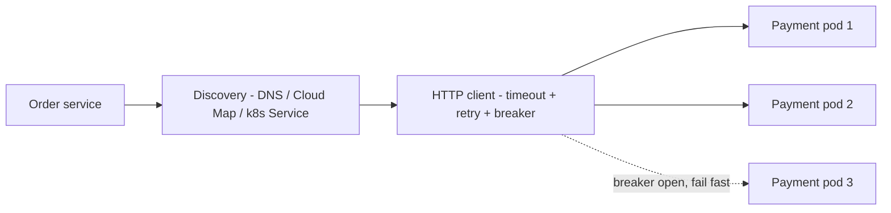

# 8. Service -> Service

**Ek line mein:** east-west call mein do sawaal hai -- "doosri service kahan hai" (discovery) aur "wo slow/down ho to main kya karunga" (timeout, retry, breaker).



## Pehle: doosri service kahan hai?

- **Private DNS (Route 53 private hosted zone)** - `payments.internal` ek record. Simple, par IP change hone par TTL tak stale rehta hai.
- **AWS Cloud Map** - ECS tasks khud register/deregister hote hain; DNS ya API dono se discover kar sakte ho.
- **Kubernetes Service** - `payments.prod.svc.cluster.local` -> ClusterIP. CoreDNS resolve karta hai, kube-proxy load balance karta hai. Pod die -> Endpoints se nikal jata hai.
- **Internal ALB** - ek stable DNS name, health check built-in, par har call mein ek extra hop aur uska apna cost/latency. Direct (DNS/ClusterIP) faster hai, lekin health checking ki zimmedari tumhare client par aa jati hai.

Rule of thumb: **HTTP routing/health chahiye -> internal ALB. Pure internal, high call volume -> direct discovery.**

## Phir: failure handling (asli kaam yahan hai)

1. **Timeout** - har call par `connect` aur `request` dono par. Default "infinite" wait sabse bada production killer hai.
2. **Retry with exponential backoff + jitter** - sirf **idempotent** calls par (GET, ya idempotency key wali POST). Jitter na ho to saare clients ek saath retry karke thundering herd bana dete hain.
3. **Retry budget** - max 2 retries. 3 services ki chain mein 3 retries = 27x load downstream.
4. **Circuit breaker** - N consecutive failures -> breaker open -> fail fast bina call kiye, thodi der baad half-open. Ye cascading failure rokta hai.
5. **mTLS** - dono taraf certificate. Service Mesh (App Mesh / Istio) ya ACM Private CA se issue hota hai. Fayda: network par koi bhi service kisi ko bhi call nahi kar sakti -- identity proven hai.

```js
// ek call, saare guardrails ke saath
const res = await fetch(url, { signal: AbortSignal.timeout(800) }); // hard timeout
// retry: 100ms, 200ms, 400ms + Math.random()*100 ka jitter, sirf GET/idempotent par
```

## Shared client library kyun

Har team apna axios wrapper likhegi to timeouts alag, retry alag, tracing header koi bhaijega koi nahi. Ek internal `@company/http-client` package do: usme default timeout, backoff+jitter, breaker, trace-id propagation aur metrics pehle se ho. **Ek jagah fix, sab jagah fix.**

## Kya tootta hai

| Dikhta hai | Asli wajah |
|---|---|
| Random 5xx sirf deploy ke waqt | DNS/Endpoints mein purana pod, ya client connection pooling stale |
| Ek service slow -> poora system down | Timeout nahi laga, threads/sockets block ho gaye |
| Downstream par 10x spike | Retry storm, jitter missing |
| `ECONNREFUSED` sirf kabhi kabhi | Target group/Endpoints mein unhealthy instance abhi tak registered |
| Cross-service 403 after mesh rollout | mTLS cert expire, ya authorization policy miss |

## Debug

```bash
dig +short payments.internal                                   # private zone resolve ho raha hai?
kubectl get endpoints payments -n prod                         # k8s: kaunse pods actually attached hain
aws servicediscovery discover-instances --namespace-name internal --service-name payments
curl -sv -m 2 http://payments.internal:8080/health             # seedha call, 2s timeout
ss -tn state established '( dport = :8080 )' | head            # kitne open connections hain
```

## 🧠 Remember

> Service-to-service call network call hai, function call nahi -- isliye har call ko timeout, bounded retry with jitter, aur circuit breaker chahiye; aur ye teeno ek shared client library mein hone chahiye, har team ke code mein alag-alag nahi.

**Aage padho:** [[14-cascading-failure-recovery]] [[13-hidden-latency-bottleneck]]
