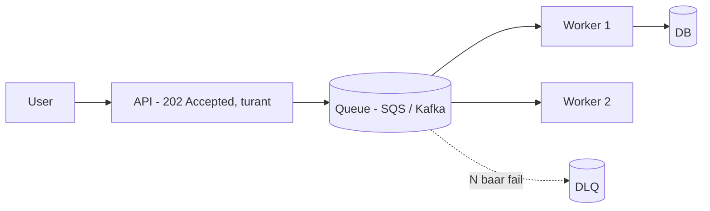

# 9. App -> Queue -> Worker

**Ek line mein:** queue lagane ka matlab hai "user ko turant jawab do, kaam baad mein karo" -- par uske badle mein duplicate messages aur backlog tumhari zimmedari ban jate hain.



## Flow kaise chalta hai

1. API sirf message **enqueue** karta hai aur `202` return kar deta hai -- email, PDF, invoice ke liye user ko wait karane ki zarurat nahi.
2. Queue message ko **durably** store karta hai (SQS multi-AZ, Kafka `replication.factor` ke hisaab se). Worker crash ho jaye to message zinda rehta hai -- **yahi queue ka asli value hai**, speed nahi.
3. Worker apni speed se consume karta hai. Spike hua -> queue lamba hua -> DB par sudden 10x load nahi padta. Queue = **shock absorber**.

## SQS vs Kafka (mental model)

| | SQS | Kafka |
|---|---|---|
| Message lene ka tarika | Worker receive karta hai, message **invisible** ho jata hai | Consumer group partition se offset padhta hai |
| Safety knob | **Visibility timeout** -- itni der mein delete na kiya to message wapas queue mein | **Offset commit** -- commit na hua to rebalance par dobara milega |
| Parallelism | Jitne workers chahiye utne, koi limit nahi | Max parallelism = **partition count** |
| Replay | Delete hone ke baad gaya | Retention ke andar offset reset karke replay |

Dono **at-least-once** hain. Iska seedha matlab: **duplicate aayega hi**, design mein maan ke chalo.

## Idempotency (skip mat karna)

Har message par ek stable `eventId` bhejo aur worker use processed-table/Redis mein record kare:

```js
const first = await db.query(
  'INSERT INTO processed_events(event_id) VALUES ($1) ON CONFLICT DO NOTHING RETURNING event_id',
  [msg.eventId]);
if (first.rowCount === 0) return ack(msg);   // pehle ho chuka, chup-chaap ack
await chargeCustomer(msg);                    // asli kaam
```

**Visibility timeout ka rule:** wo tumhare worst-case processing time se zyada hona chahiye. Warna worker abhi kaam kar hi raha hota hai aur message doosre worker ko dikh jata hai -> double charge.

## DLQ aur backlog

- **DLQ** -- SQS mein redrive policy: `maxReceiveCount` (jaise 5) ke baad message DLQ mein chala jata hai. Iske bina ek poison message infinite loop mein queue ko block-ish kar deta hai. DLQ par **alarm lagao** -- silent DLQ ka koi matlab nahi.
- **Scaling** -- CloudWatch `ApproximateNumberOfMessagesVisible` par target tracking. Behtar metric: **backlog per worker** = visible messages / running workers. Isse target "har worker ke paas max 100 pending" ban jata hai.
- **Backlog drain** -- 1 lakh backlog aur 100 msg/sec drain rate = ~17 min. Pehle **drain rate** naapo (consumed/sec), phir decide karo: workers badhao, ya batch size badhao, ya non-critical messages alag low-priority queue mein daalo.

## Kya tootta hai

| Dikhta hai | Asli wajah |
|---|---|
| Customer ko do baar email | Idempotency nahi, at-least-once delivery |
| Message baar-baar reprocess | Visibility timeout processing time se chhota |
| Queue badh raha hai, workers idle | DB/downstream bottleneck, ya Kafka mein partitions kam |
| Workers scale ho gaye, drain fir bhi slow | Kafka: consumers > partitions, extra consumers idle baithe hain |
| DLQ silently bhara hua | Redrive to hai, alarm nahi |

## Debug

```bash
aws sqs get-queue-attributes --queue-url <url> \
  --attribute-names ApproximateNumberOfMessages ApproximateNumberOfMessagesNotVisible VisibilityTimeout
aws sqs receive-message --queue-url <dlq-url> --max-number-of-messages 5 --visibility-timeout 0
aws sqs get-queue-attributes --queue-url <url> --attribute-names RedrivePolicy   # maxReceiveCount
kafka-consumer-groups.sh --bootstrap-server <broker:9092> --describe --group order-workers  # LAG
```

## 🧠 Remember

> Queue request ko delete nahi karti, sirf use time ke saath faila deti hai -- aur uski keemat hai duplicate messages, isliye at-least-once + idempotent consumer + DLQ ek hi package hain.

**Aage padho:** [[19-idempotent-consumer-duplicate-events]] [[23-queue-backlog-after-spike]]
