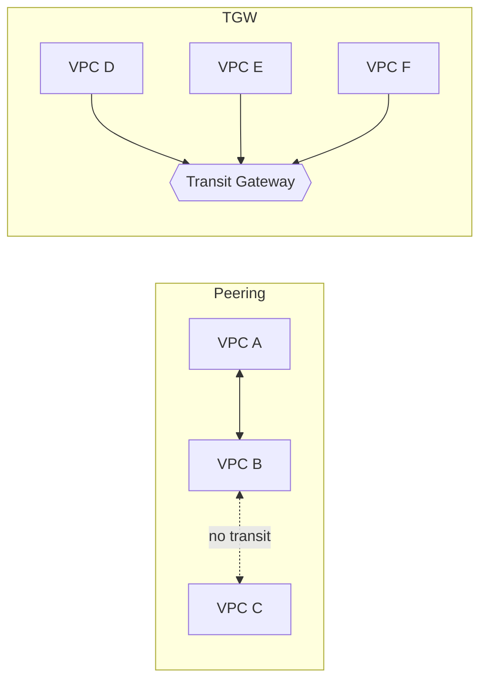

# 10. VPC -> VPC

**Ek line mein:** do VPC jodne ke teen tareeke hain -- peering (sasta, 1-to-1, non-transitive), Transit Gateway (hub, scale karta hai, paisa lagta hai), PrivateLink (ek service expose karo, poora network nahi).



## Teeno ka farq

| | Peering | Transit Gateway | PrivateLink |
|---|---|---|---|
| Shape | Point-to-point mesh | Hub and spoke | Service endpoint |
| Transitive? | **Nahi** | Haan (route tables se control) | N/A |
| Overlapping CIDR? | Nahi chalega | Nahi chalega | **Chalega** |
| Direction | Dono taraf | Dono taraf | **Ek taraf** -- consumer -> provider |
| Kab chuno | 2-3 VPC, sasta | 5+ VPC, hybrid, central inspection | Vendor/team ki ek service share karni hai |

## Peering ke 4 gotchas (interview + prod dono)

1. **Non-transitive** - A<->B aur B<->C hai, to A se C nahi pahunchega. A-C ka apna peering chahiye. N VPC ke liye N(N-1)/2 connections -- yahi par TGW jeet jata hai.
2. **Overlapping CIDR** - dono VPC `10.0.0.0/16` hain to peering **ban hi nahi sakta**. Isiliye din 1 se ek IPAM plan banao (prod 10.10/16, stage 10.20/16, dev 10.30/16). Baad mein VPC ka CIDR badalna matlab re-launch.
3. **Route table dono taraf** - sabse common bug. A mein B ka route daal diya, B mein A ka bhool gaye -> packet jata hai, reply nahi aata. Aur route sirf us **subnet ke route table** mein chahiye jahan se traffic chal raha hai, main route table mein nahi.
4. **No edge-to-edge routing** - peer VPC tumhara Internet Gateway, NAT Gateway, VPN ya VPC endpoint use nahi kar sakta. "Ek VPC mein central NAT rakh lenge" -- peering se nahi hoga, TGW se hoga.

## Security group referencing

Same-region peering mein tum **peer VPC ke SG ID ko apne rule mein reference kar sakte ho** (`10.20.0.0/16` likhne ke bajaye `sg-abc123`). Zyada precise hai -- IP badle to rule wahi rehta hai. Do limits yaad rakho:

- SG referencing **Transit Gateway par kaam nahi karta** -- wahan CIDR hi likhna padega.
- Cross-region setup mein CIDR-based rules safe default hai.

## PrivateLink kab better hai

Tumhe pura network nahi jodna, sirf **ek service** dikhani hai. Provider apne NLB ke saamne ek *endpoint service* banata hai; consumer apne VPC mein ek **interface endpoint (ENI, private IP)** banata hai aur usi IP par call karta hai. Fayde: CIDR overlap ho to bhi chalta hai, traffic sirf ek direction mein initiate hota hai, aur consumer ka baaki network provider ko dikhta hi nahi. Yahi model AWS khud S3/SQS/Secrets Manager endpoints ke liye use karta hai.

## Kya tootta hai

| Dikhta hai | Asli wajah |
|---|---|
| Ping timeout, peering "active" | Ek taraf ka route table missing |
| A -> C fail, A -> B theek | Transitive routing expect kar liya |
| Peering request hi reject | Overlapping CIDR |
| TGW ke baad bhi traffic block | SG mein sg-id reference likha hai (TGW par support nahi) |
| Connect hota hai, reply nahi | NACL ne return traffic (ephemeral ports) block kiya |

## Debug

```bash
aws ec2 describe-vpc-peering-connections --query 'VpcPeeringConnections[].[VpcPeeringConnectionId,Status.Code]'
aws ec2 describe-route-tables --filters Name=vpc-id,Values=vpc-aaa --query 'RouteTables[].Routes'
aws ec2 describe-transit-gateway-route-tables
# Reachability Analyzer -- guess band, AWS khud batayega kahan block hua
aws ec2 create-network-insights-path --source <eni-a> --destination <eni-b> --protocol tcp --destination-port 443
aws ec2 start-network-insights-analysis --network-insights-path-id <nip-id>
```

## 🧠 Remember

> Peering ek seedhi taar hai -- non-transitive, overlapping CIDR se allergic, aur dono taraf route chahiye; jaise hi VPC 4-5 se upar jayein, taar ki jagah Transit Gateway lo, aur agar sirf ek service share karni hai to poora network mat jodo, PrivateLink lo.

**Aage padho:** [[08-ec2-no-internet-troubleshooting]] [[77-blog-microservices-are-a-tax]]
