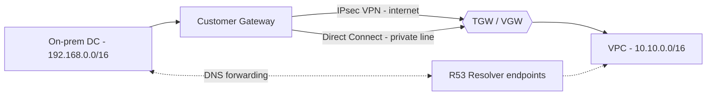

# 11. On-Prem -> Cloud

**Ek line mein:** hybrid connectivity ke teen hisse hain -- pipe (VPN ya Direct Connect), routing (BGP), aur DNS (Route 53 Resolver) -- aur teenon mein se koi ek toota to "network down" jaisa lagta hai.



## Pipe: VPN vs Direct Connect

| | Site-to-Site VPN | Direct Connect |
|---|---|---|
| Path | Public internet, IPsec encrypted | Dedicated private circuit (partner/AWS facility) |
| Setup time | Ghante | Hafte se mahine (cross-connect, LOA-CFA) |
| Bandwidth | Per tunnel ~1.25 Gbps cap | 1/10/100 Gbps dedicated, ya hosted 50 Mbps se upar |
| Latency | Variable -- internet jitter | Consistent, predictable |
| Encryption | Built-in | **By default nahi** -- DX par VPN chalao ya MACsec use karo |
| Cost | Sasta, per hour + data | Port + data, mehnga |

Har VPN connection mein **do tunnels** hote hain (alag AWS endpoints). Dono configure karo -- ek tunnel AWS maintenance mein bhi down ho sakta hai, tab doosra sambhalta hai. Production pattern: **DX primary + VPN backup**, dono BGP par.

## Routing: BGP ka minimum

**BGP** = do networks ek doosre ko batate hain "mere paas ye prefixes hain". Static route ki tarah manually likhna nahi padta, aur link toot-ne par path apne aap hat jata hai.

- Dono side ka ek **ASN** hota hai. On-prem par private ASN (64512-65534), AWS side VGW/TGW ka Amazon ASN.
- On-prem `192.168.0.0/16` advertise karta hai, AWS `10.10.0.0/16` advertise karta hai.
- Route selection: **longest prefix match pehle jeetta hai**. Same prefix par AWS Direct Connect ko VPN se prefer karta hai -- isiliye DX+VPN failover apne aap kaam karta hai.
- Apne DX path ko failover ke liye kam preferred banana ho to **AS path prepending** karte ho.
- Advertised prefixes par limit hoti hai, to on-prem se 500 chhote routes bhejne ke bajaye **summarize** karo.

## DNS: hybrid resolution (yahan sabse zyada log phaste hain)

VPN up hai, ping chal raha hai, phir bhi app `db.internal` resolve nahi kar pa rahi -- kyunki **routing aur DNS alag cheezein hain**.

- **Inbound endpoint** -- on-prem servers ko AWS ke private names chahiye. Resolver inbound endpoint VPC mein ENIs banata hai; on-prem DNS server par conditional forwarder lagao: `internal.company.com -> <inbound endpoint IPs>`.
- **Outbound endpoint + Resolver rule** -- AWS ke EC2/Lambda ko on-prem naam chahiye (`corp.local`). Ek forwarding rule banao: `corp.local -> <on-prem DNS IPs>`, aur rule ko VPC se **associate** karo. Associate bhoolna sabse common miss hai.

Dono direction chahiye ho to dono endpoints banao -- ek se dusra nahi chalta.

## Overlapping IP range

On-prem bhi `10.0.0.0/8` use kar raha hai aur VPC bhi -- to BGP wo prefix advertise hi nahi kar payega saaf se. Options: VPC ko naye non-overlapping CIDR par le jao (best, par mehnga), ya customer gateway / firewall par **NAT** karke overlapping subnet ko ek alag range mein translate karo. Naye environments mein hamesha pehle **IP allocation plan** banao -- ye baad mein fix karne wali cheez nahi hai.

## Kya tootta hai

| Dikhta hai | Asli wajah |
|---|---|
| Tunnel UP, traffic nahi | VPC route table mein on-prem prefix ka route missing, ya route propagation off |
| Ek taraf se ping, doosri se nahi | On-prem firewall ne return traffic block kiya, ya SG mein on-prem CIDR nahi |
| Tunnel baar-baar flap | Internet path issue, ya DPD/IKE lifetime mismatch |
| Ping chalta hai, naam resolve nahi | Resolver endpoint/rule missing ya VPC se associated nahi |
| Failover par traffic wapas nahi aaya | Static routes use kiye, BGP nahi |

## Debug

```bash
aws ec2 describe-vpn-connections --query 'VpnConnections[].VgwTelemetry[].[OutsideIpAddress,Status,StatusMessage]'
aws directconnect describe-virtual-interfaces --query 'virtualInterfaces[].[virtualInterfaceId,virtualInterfaceState,bgpPeers[].bgpPeerState]'
aws ec2 describe-route-tables --filters Name=vpc-id,Values=vpc-xxxx   # on-prem prefix dikh raha hai?
aws route53resolver list-resolver-endpoints
aws route53resolver list-resolver-rule-associations                    # rule VPC se juda hai?
dig @<inbound-endpoint-ip> db.internal.company.com                     # on-prem se chalao
mtr -n <aws-private-ip>                                                # packet loss kis hop par
```

## 🧠 Remember

> Hybrid connectivity = pipe + route + DNS. VPN sasta aur turant hai par internet par chalta hai; Direct Connect predictable hai par hafte lagta hai; BGP failover khud sambhalta hai; aur jab "network down" lage to pehle check karo ki masla routing ka hai ya sirf DNS resolution ka.

**Aage padho:** [[08-ec2-no-internet-troubleshooting]] [[13-hidden-latency-bottleneck]]
