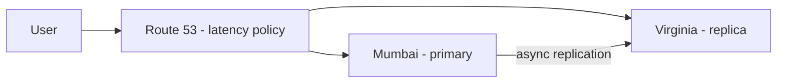

# 12. Region -> Region

**Ek line mein:** doosri region mein data bhejna network ka nahi, physics ka problem hai -- light ki speed fix hai, isliye cross-region replication hamesha async hoti hai aur lag ke saath jeena padta hai.



## Physics pehle, AWS baad mein

Mumbai se Virginia roughly 13,000 km hai. Fibre mein light ~200,000 km/s chalti hai, plus routers aur hops. Practically round trip **~200-250 ms** dikhta hai (Mumbai-Singapore ~60-80 ms, Mumbai-Frankfurt ~110-130 ms). Ye rough ranges hain, exact path par depend karta hai.

Matlab: cross-region **synchronous write** karoge to har request mein 200 ms+ baith jayega. Isliye AWS ke cross-region features almost hamesha asynchronous hain.

| Service | Cross-region kaise | Lag |
|---|---|---|
| S3 | Cross-Region Replication, versioning zaroori | seconds se minutes |
| RDS / Aurora | cross-region read replica, Aurora Global Database | usually ~1s, load par zyada |
| DynamoDB | Global Tables -- multi-region read **aur** write | usually ~1s, last-writer-wins |

## Traffic kaun bhejega -- Route 53

- **Latency-based** -- user ko sabse kam latency wali region. Multi-region app ka default.
- **Geolocation / Geoproximity** -- user ke location par, data residency ke liye useful.
- **Failover** -- primary/secondary, health check fail hone par secondary. Active-passive ka backbone.
- **Weighted** -- 90/10 split, region migration ya canary ke liye.

Yaad rakho: Route 53 DNS hai aur DNS **cached** hota hai. TTL 300s hai to failover ke baad bhi kuch clients 5 min tak purani region par jayenge.

## Active-active vs active-passive

**Active-passive** -- sirf ek region likhti hai, doosri standby. Simple, koi conflict nahi, lekin failover par RTO aur thoda data loss (RPO) accept karna padta hai.

**Active-active** -- dono regions likhti hain. Latency best, lekin ab **conflict resolution** tumhara problem hai: ek hi item do regions mein same second mein update hua to kaun jeeta? DynamoDB last-writer-wins karta hai -- yaani ek write chupchap gayab ho sakta hai. Isliye active-active tab lo jab data naturally partitioned ho (user ka data uski home region mein).

## Paisa aur kya tootega

Cross-region data transfer **free nahi** hai -- per GB charge (region pair ke hisab se alag). Rule: cross-region par **data** bhejo, chit-chat nahi.

Tootne wali cheezein: **replication lag** (user Mumbai mein likhta hai, Virginia se padhta hai, apna order nahi dikhta), **backlog** (replication atke to failover par utna data gaya), aur **clock skew** (last-writer-wins timestamps par chalta hai, cross-region clocks same nahi hote).

## Debug

```bash
aws s3api head-object --bucket <dest-bucket> --key <key>   # ReplicationStatus
aws rds describe-db-instances --db-instance-identifier <replica-id>
aws cloudwatch get-metric-statistics --namespace AWS/RDS \
  --metric-name ReplicaLag --period 60 --statistics Average \
  --start-time <iso> --end-time <iso> \
  --dimensions Name=DBInstanceIdentifier,Value=<replica-id>

dig +short api.example.com                                 # kaunsi region mil rahi hai
curl -s -o /dev/null -w '%{time_total}\n' https://api.example.com/health
```

## 🧠 Remember

> Cross-region latency physics hai, bug nahi -- isliye replication async hoti hai; async ka matlab lag, aur lag ka matlab ya stale reads ya conflicts. Dono mein se ek chunna padega.

**Aage padho:** [[10-clock-skew-last-write-wins]] [[12-multi-az-availability]]
