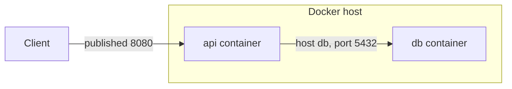

# 13. Container -> Container

**Ek line mein:** container ke andar `localhost` ka matlab "yahi container" hota hai -- isliye container-to-container ka 90% problem sirf naam, port aur bind address ka hota hai.



## Docker: bridge vs host

**bridge** (default) -- har container ko apna private IP, host par ek virtual switch. Bahar se pahunchne ke liye `-p 8080:3000` chahiye. Yahi default aur usually sahi choice hai.

**host** (Linux only) -- container host ka network stack seedha use karta hai, `-p` ka matlab nahi rehta, port conflict ho sakta hai. Thoda tez, lekin isolation gaya.

Compose mein containers ek user-defined network par hote hain aur Docker ka **embedded DNS** service name resolve karta hai -- `api` container seedha `postgres://db:5432/...` likh sakta hai. IP hardcode karne ki zaroorat nahi.

Important: container-to-container baat **internal port** (3000) par hoti hai, published port (8080) par nahi. Published port sirf host se entry ke liye hai.

## Kubernetes: flat network

K8s ka model simple hai -- **har pod ko apna IP milta hai aur har pod har pod se NAT ke bina baat kar sakta hai**, node alag ho tab bhi. Ye CNI plugin (VPC CNI, Calico, etc.) implement karta hai.

Lekin pod IP cattle hai, restart par badal jata hai. Isliye seedha pod IP kabhi mat likho. **Service** stable naam + ClusterIP deta hai aur label selector se matching pods ko traffic bhejta hai. Cluster DNS (CoreDNS, purane naam se kube-dns) `<service>.<namespace>.svc.cluster.local` resolve karta hai -- same namespace mein sirf `payments` kaafi hai.

## ECS Fargate: awsvpc mode

Fargate mein har **task** ko apna **ENI** milta hai -- apna VPC private IP aur apna **Security Group**. Ab rules EC2 instance ke SG par nahi, task ke SG par likhne hote hain: API task ke SG se DB task ke SG par 5432 allow karo (SG reference, IP nahi). awsvpc mode mein host port = container port hota hai.

## Kya tootata hai

| Symptom | Asli wajah |
|---|---|
| `connection refused` | app `127.0.0.1` par bind hai -- `0.0.0.0` chahiye |
| `-p` diya phir bhi fail | published port use kiya, internal port chahiye tha |
| Service ka endpoint khaali | selector labels pod labels se match nahi kar rahe |
| DNS resolve nahi hota | galat namespace, ya containers alag docker network par |
| Service jawab nahi deta | `targetPort` app ke actual port se alag hai |

## Debug

```bash
docker network inspect <network>            # kaun kis network par hai
docker exec -it api sh -c 'getent hosts db' # DNS chal raha hai?
docker exec -it api sh -c 'nc -vz db 5432'  # reachability

kubectl get endpoints <svc>                 # khaali = selector mismatch
kubectl describe svc <svc>                  # selector aur targetPort
kubectl exec -it <pod> -- nslookup <svc>.<ns>.svc.cluster.local
ss -lntp                                    # 0.0.0.0 par hai ya 127.0.0.1 par
```

## 🧠 Remember

> Teen sawaal poochho: naam resolve ho raha hai? sahi (internal) port par ja rahe ho? app `0.0.0.0` par bind hai? Teeno haan ho gaye to sirf firewall/SG bacha hai.

**Aage padho:** [[24-kubernetes-pets-vs-cattle]] [[74-ingress-502-bad-gateway]]
