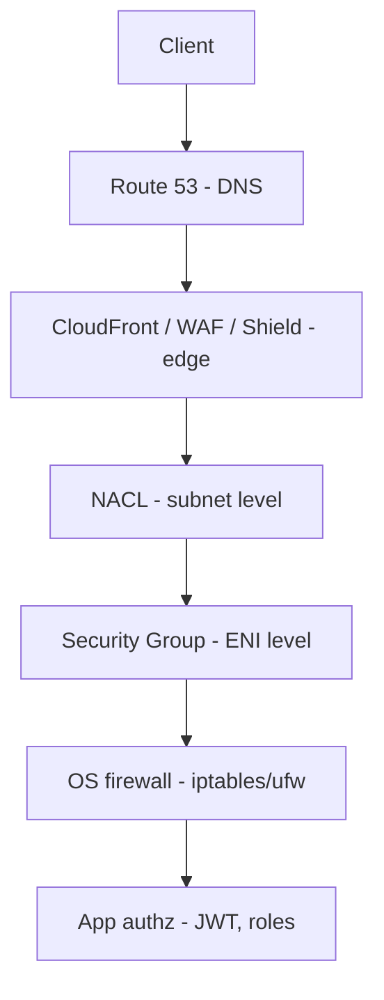

# 14. Request -> Firewall Rules

**Ek line mein:** ek packet app tak pahunchne se pehle kai layers se guzarta hai, aur har layer alag cheez dekh pati hai -- isliye "block kyun hua" ka jawab layer ke hisab se badalta hai.



## Har layer kya dekh sakti hai

| Layer | Kahan lagti hai | Kya dekh sakti hai | Kya nahi dekh sakti |
|---|---|---|---|
| Shield | AWS edge | volumetric L3/L4 flood | HTTP body |
| WAF | ALB / CloudFront / API GW | HTTP method, path, headers, body, IP | TLS se pehle ka kuch nahi (WAF decrypt ke baad chalta hai) |
| NACL | subnet boundary | source/dest IP, port, protocol | user kaun hai, path kya hai |
| Security Group | ENI (instance/task/LB) | source IP **ya source SG**, port | HTTP path, payload |
| OS firewall | host kernel | IP, port, process | business rules |
| App authz | code | user, role, tenant, resource | kuch nahi chhootta -- sabse zyada context yahin hai |

Neeche jate jate **context badhta hai, throughput kam hota hai**. Isliye sasta filtering upar (WAF, SG) aur mehenga decision neeche (app) karte hain.

## Stateful vs stateless -- sabse bada trap

**Security Group = stateful.** Tumne inbound 443 allow kiya, to uska response apne aap bahar ja sakta hai. Outbound rule likhne ki zaroorat nahi.

**NACL = stateless.** Har direction alag evaluate hoti hai. Inbound 443 allow kiya lekin outbound **ephemeral ports (1024-65535)** allow nahi kiye to request andar aayegi aur response bahar nahi ja payega -- connection hang, phir timeout. Classic "sab sahi lag raha hai phir bhi timeout" ka reason.

## Allow vs deny

**SG mein sirf allow rules hote hain.** Deny likh hi nahi sakte. Default: sab inbound band, sab outbound khula. Matlab SG "kis ko andar aane du" ki list hai.

**NACL mein allow aur deny dono**, aur rules **number order mein** evaluate hote hain -- pehla match jeet jata hai, baaki rules dekhe hi nahi jate. Isliye `100 DENY 0.0.0.0/0` likh diya to neeche ka koi allow kaam nahi karega. Ek specific IP block karni ho -- wo NACL ka kaam hai, SG ka nahi.

## WAF rate-based rules

WAF ka rate-based rule ek rolling window mein **per source IP** requests count karta hai aur threshold cross hone par block/count karta hai. Do baatein: (1) agar sab traffic ek proxy/NAT se aa raha hai to ek hi IP dikhegi aur pura traffic block ho sakta hai -- tab header-based key configure karo; (2) naya rule pehle **Count mode** mein chalao, CloudWatch mein match dekho, tab Block karo.

WAF DDoS ka pura jawab nahi hai -- volumetric attack edge par Shield rokta hai, WAF application-layer abuse (SQLi, bot, scraping, brute force) rokta hai.

## Debug

```bash
# SG kya allow kar raha hai
aws ec2 describe-security-groups --group-ids <sg-id>

# NACL -- rule number order aur dono directions dekho
aws ec2 describe-network-acls --network-acl-ids <acl-id>

# kaun sa layer maar raha hai: connection refused = app/OS, timeout = SG ya NACL
nc -vz <private-ip> 3000
sudo iptables -L -n -v        # OS firewall
sudo ufw status verbose

# WAF kya block kar raha hai
aws wafv2 get-sampled-requests --web-acl-arn <arn> --rule-metric-name <name> \
  --scope REGIONAL --time-window StartTime=<t1>,EndTime=<t2> --max-items 100
```

## 🧠 Remember

> Timeout = kisi ne chupchap drop kiya (SG ya NACL). Connection refused = packet pahunch gaya, sunne wala koi nahi (app/OS). Aur NACL stateless hai -- ephemeral ports ka return path bhi allow karna padta hai.

**Aage padho:** [[79-blog-rate-limiting]] [[27-cia-triad]]
