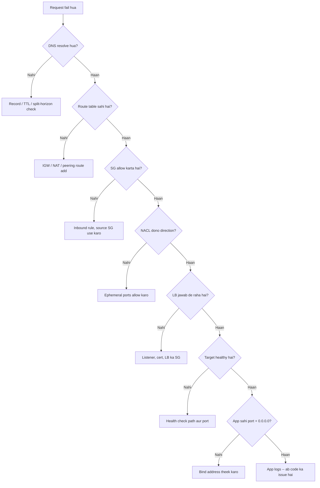

# 15. Failed Request -> Debugging Path

**Ek line mein:** random jagah mat kudo -- packet ke raaste par upar se neeche ek-ek layer check karo, aur har layer ke liye ek hi command chalao.



## Order kyun yahi hai

Har step ka matlab hai "kya mera packet yahan tak pahunch bhi raha hai". Neeche wale step ko tab hi check karo jab upar wala pass ho gaya ho -- warna tum app logs mein baithe rahoge aur asal mein DNS galat tha. Error message khud bata deta hai kahan se shuru karna hai:

- **NXDOMAIN / unknown host** -> DNS layer
- **Timeout / hang** -> koi chupchap **drop** kar raha hai: SG, NACL, ya route missing
- **Connection refused** -> packet pahunch gaya, us port par koi sun nahi raha: app down, galat port, ya `127.0.0.1` bind
- **TLS error** -> cert, SNI ya hostname mismatch; network theek hai
- **HTTP 5xx** -> network paar ho chuka, ab app ya LB-to-target ka issue hai

## Step-by-step, command ke saath

```bash
# 1. DNS -- naam sahi IP de raha hai?
dig +short api.example.com
dig api.example.com @8.8.8.8          # apne resolver ka cache bypass

# 2. Route table -- is subnet se bahar/andar ka raasta hai?
aws ec2 describe-route-tables --filters Name=association.subnet-id,Values=<subnet-id>
#    public subnet ko 0.0.0.0/0 -> igw-..., private ko -> nat-...

# 3. Security Group -- inbound allow hai? (stateful, outbound auto)
aws ec2 describe-security-groups --group-ids <sg-id>

# 4. NACL -- stateless, dono direction dekho (ephemeral 1024-65535)
aws ec2 describe-network-acls --filters Name=association.subnet-id,Values=<subnet-id>

# 5. Load balancer -- listener hai, SG khula hai?
aws elbv2 describe-listeners --load-balancer-arn <lb-arn>
curl -I https://api.example.com/health

# 6. Target health -- reason code yahin milta hai
aws elbv2 describe-target-health --target-group-arn <tg-arn>

# 7. App port aur bind address -- 0.0.0.0 hona chahiye, 127.0.0.1 nahi
ss -lntp
curl -I http://<private-ip>:3000/health     # bastion/peer host se
nc -vz <private-ip> 3000

# 8. App logs
journalctl -u myapp -n 200 --no-pager
docker logs --tail 200 <container>
kubectl logs deploy/<name> --tail=200
```

Note: AWS mein ICMP aksar block hota hai, isliye `ping` ka fail hona proof nahi hai. `nc -vz` zyada bharosemand signal deta hai.

## Symptom -> sabse sambhavit layer

| Dikhta hai | Sabse pehle kahan dekho |
|---|---|
| `could not resolve host` | DNS -- record, TTL, private hosted zone |
| Browser hang, phir timeout | SG inbound, ya NACL outbound ephemeral |
| Private subnet se package install fail | NAT gateway / route table |
| `connection refused` | app down ya `127.0.0.1` par bind |
| `certificate mismatch` | ACM cert ka SAN, ya galat hostname |
| 502 / 503 / 504 | target crash ya galat port / koi healthy target nahi / app slow |
| Kabhi chalta hai kabhi nahi | ek target unhealthy, ya ek AZ kharab |
| Ek hi client ko fail | uska DNS cache, ya WAF rate-based block |

## Do galtiyan jo sab karte hain

1. **Seedha app logs se shuru karna** -- packet pahunch hi nahi raha to logs khaali honge; khaali log ek clue hai, bug nahi.
2. **Ek saath teen cheezein badalna** -- SG kholo, NACL badlo, app restart karo, ab chal gaya to pata hi nahi kis se chala. Ek baar mein ek change, phir retest.

## 🧠 Remember

> Packet ke raaste par upar se neeche chalo: DNS -> route -> SG -> NACL -> LB -> target health -> app port -> logs. Timeout ka matlab "drop", refused ka matlab "koi sun nahi raha" -- ye do shabd aadha debugging khatam kar dete hain.

**Aage padho:** [[08-ec2-no-internet-troubleshooting]] [[20-sudden-latency-spike-checklist]]
