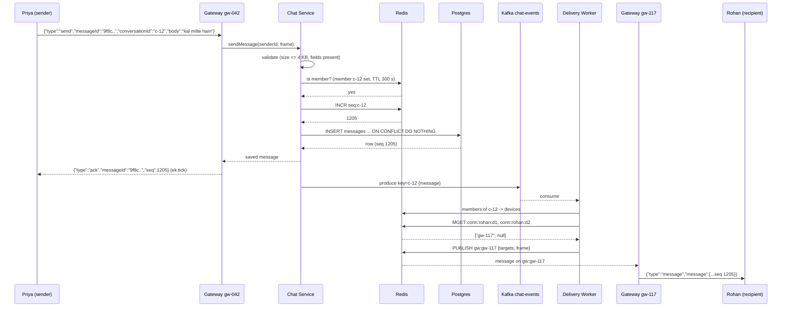

# Chat System -- HLD + LLD (Part 2: Request Flow -> Protocol + API -> Database -> LLD -> Code)

> Is file mein prompt ke **Parts 7-12** hain: paanch request flows (connect, send, offline, receipts, resume), WebSocket frame protocol + REST API design, database design (Postgres v1 + Cassandra v3), LLD folder structure, aur Node.js/TypeScript code line-by-line.
> Part 1 ka 3-line recap: **(1)** Chat hamara pehla **stateful** system hai -- server ko client ko bina poochhe message bhejna padta hai, isliye WebSocket connection khula rehta hai aur "user kis gateway node par hai" ek asli design problem ban jaati hai. **(2)** Numbers: 50M DAU, **10M concurrent connections** (250 gateway nodes x 50K), 2B messages/day = 23K msg/sec, par group amplification ki wajah se **153K deliveries/sec average, 460K peak** -- capacity hamesha deliveries par plan karo. **(3)** Architecture decide ho chuki hai: L4 LB -> stateful WS Gateway -> stateless Chat Service -> Redis (`seq`, sessions, presence) + Postgres/Cassandra (messages) + Kafka `chat-events` -> Delivery Workers -> Redis Pub/Sub `gw:<nodeId>` -> recipient ka socket.
> Part 3 mein: WebSocket internals byte level par, connection routing ke saare options ka comparison, `seq` vs timestamp vs Snowflake, delivery semantics + tick state machine, presence ka N-squared problem, concurrency aur Redis state.

---

## PART 7 -- Request Flow (step by step)

Pichhle systems (URL Shortener, Rate Limiter) mein **ek** flow hota tha: request aayi, response gaya, khatam. Chat mein aisa nahi hai. Yahan **paanch alag flows** hain aur har ek ka apna raasta hai:

```
Flow 1: connect + auth        -- socket banta hai, server ko pata chalta hai "ye kaun hai aur kahan hai"
Flow 2: send a message        -- sabse important flow, poora system isme dikhta hai
Flow 3: recipient offline     -- socket hai hi nahi -> push notification ka raasta
Flow 4: receipts              -- delivered/read wapas sender tak (ulta flow)
Flow 5: reconnect + resume    -- 3 din baad app khula, ab kya missing hai?
```

Inko ek-ek karke dekhte hain.

---

### Flow 1 -- Connect + Auth (socket banna aur "bind" hona)

Scenario: Priya subah 9 baje apna phone kholti hai. App background se foreground mein aata hai aur server se connection banata hai.

```
Priya ka phone
  |
  |  1. TCP handshake (SYN, SYN-ACK, ACK)        -> ~1 RTT
  |  2. TLS handshake (wss://)                    -> ~1-2 RTT (TLS 1.3 = 1 RTT)
  |  3. HTTP GET /ws + "Upgrade: websocket"       -> 101 Switching Protocols
  |  4. { "type": "auth", "token": "...", "deviceId": "d-77aa" }   <-- pehla frame
  |
  v
Gateway node gw-042
  5. JWT verify (signature + exp)  -> userId nikla
  6. socket ko userId + deviceId se BIND karo (process memory)
  7. Redis: SET conn:<userId>:d-77aa = "gw-042"  EX 90
  8. Redis: SET presence:<userId> = "1"  EX 90
  9. subscribe gw:gw-042  (agar pehle se subscribed nahi hai -- ye per-node hota hai, per-connection nahi)
 10. { "type": "auth_ok", "userId": "..." }  -> Priya ko wapas
```

**Step by step (Hinglish mein):**

1. **TCP connection** -- L4 load balancer (`least-connections`, round-robin **nahi**) Priya ko kisi ek healthy gateway node par bhej deta hai. Round-robin kyun nahi? Kyunki connections **long-lived** hain. Round-robin "kitni requests" barabar baantta hai, "kitne open connections" nahi. Ek node restart hua aur wapas aaya toh round-robin usko utne hi naye connections dega jitne baaki ko -- par baaki nodes ke paas already 50,000 connections hain aur naye node ke paas 0. `least-connections` ye sahi karta hai.
2. **TLS** -- `wss://` = WebSocket over TLS. Handshake yahan **ek baar** hota hai aur phir ghanton chalta hai. Ye plain HTTPS se ulta hai jahan har naya connection (ya connection pool ka slot) TLS repeat karta hai. Chat mein TLS ka cost **amortize** ho jaata hai -- accha hai.
3. **HTTP Upgrade** -- WebSocket ek normal HTTP GET se shuru hota hai jisme `Upgrade: websocket`, `Connection: Upgrade`, `Sec-WebSocket-Key: <base64>` headers hote hain. Server `101 Switching Protocols` bhejta hai. Uske baad **wahi TCP connection** ab frames bolta hai, HTTP nahi. (Byte-level detail Part 3 mein.)
4. **Pehla frame = `auth`** -- token URL mein **nahi** bhejte (kyun, ye Part 8 mein deep dive hai). Socket khul chuka hai par abhi **kuch bhi karne ki permission nahi** hai. Gateway ek 10-second `authTimeout` chalata hai: itni der mein `auth` frame nahi aaya toh socket close code `4001` ke saath band. Warna ek attacker laakhon sockets khol ke chhod dega (memory exhaustion, bina kisi valid account ke).
5. **JWT verify** -- signature check + `exp` check. Ye **sirf CPU** hai, koi DB call nahi. 10M connections x reconnect storms ke time DB call hota toh DB mar jaata. Token se `userId` milta hai.
6. **Bind** -- socket object ko process memory mein `userId` + `deviceId` ke saath jod do. Ab is socket par aane wale har frame ka sender pata hai. **Client jo `senderId` bheje usko kabhi mat maano** -- sender hamesha bound `userId` se aata hai, warna koi bhi kisi ke naam par message bhej dega.
7. **Session registry** -- `SET conn:<userId>:<deviceId> gw-042 EX 90`. Ye **poore system ka sabse important state** hai: "ye device abhi gw-042 par baitha hai." Delivery worker isi ko padh ke decide karta hai kaunse node par publish karna hai. TTL 90 s isliye ki node achanak mar jaaye (kill -9, EC2 terminate) toh entry apne aap saaf ho jaaye -- warna registry mein zombie entries bharti rahengi aur worker un par publish karta rahega.
8. **Presence** -- `SET presence:<userId> 1 EX 90`. Key exist karti hai = online. Expire ho gayi = offline. Koi "offline event" bhejne ki zarurat hi nahi -- TTL khud batata hai.
9. **Subscribe `gw:gw-042`** -- ye **per node** hai, per connection nahi. Node start hote hi apne channel par subscribe kar leta hai. 50,000 users ke liye 50,000 subscriptions nahi -- **ek**. Ye design ki asli khoobsurti hai: Redis Pub/Sub ko sirf 250 channels dekhne padte hain, 10M nahi.
10. **`auth_ok`** -- client ko confirmation. Iske baad hi client `send` / `resume` bhej sakta hai.

> **Ek line mein:** Connect ka poora kaam hai "socket ko ek identity do, aur us identity ka pata (`nodeId`) sabko dikhne wali jagah (Redis) par likh do."

---

### Flow 2 -- Send a message (sabse important flow)

Scenario: Priya "kal milte hain" type karke send dabati hai. Ye message Rohan ko jaana hai, jiska socket **doosre node** `gw-117` par hai.



**Step by step:**

1. **Client `send` frame bhejta hai** -- `{ type: 'send', messageId: '<client UUID v4>', conversationId, body, mediaKey? }`. `messageId` **client banata hai**, server nahi. Ye idempotency key hai (Payment system wali seedhi soch): network toota aur client ne retry kiya toh server ko pata chalega ki ye wahi message hai.
2. **Gateway frame ko route karta hai** -- gateway **business logic nahi** karta. Woh sirf JSON parse karta hai, `type` dekhta hai, aur `ChatService.sendMessage(boundUserId, frame)` call karta hai. `boundUserId` step 6 (Flow 1) wala hai -- frame ke andar se nahi.
3. **Validation** -- `body` ka UTF-8 size <= 4096 bytes, `messageId` valid UUID, `conversationId` valid UUID, `body` ya `mediaKey` mein se kam se kam ek ho. Fail -> `error` frame with code `MESSAGE_TOO_LARGE` / `BAD_FRAME`. Socket band **nahi** karte -- ek galat frame se poora connection todna client ke liye bahut bura experience hai.
4. **Authorization (`isMember`)** -- "kya Priya `c-12` ki member hai?" Redis set `member:c-12` se check (TTL 300 s), miss par Postgres se load karke cache. **Ye check skip karna is poore system ka sabse bada security hole hai** -- warna koi bhi random `conversationId` guess karke kisi ke group mein message daal sakta hai.
5. **`INCR seq:c-12`** -- Redis se per-conversation monotonic number. Redis `INCR` **atomic** hai, isliye 10 log ek saath bhejein toh bhi sabko alag number milega. Ye number hi ordering ka source of truth hai -- timestamp nahi (client ki ghadi galat ho sakti hai, servers mein clock skew hota hai).
6. **Persist** -- Postgres mein `INSERT ... ON CONFLICT (conversation_id, message_id) DO NOTHING RETURNING *`, saath mein `conversations.last_message_seq` update, **ek hi transaction** mein. Conflict hua = ye retry hai -> existing row wapas do, naya message mat banao.
7. **Ack (`sent` tick)** -- ab, **persist ke baad**, sender ko `{ type: 'ack', messageId, seq, serverTs }` jaata hai. Client ki UI mein message "clock icon" se **ek grey tick** ban jaata hai.
   - **Ack pehle kyun nahi?** Agar hum INCR ke turant baad ack de dete aur phir Postgres insert fail ho jaata (DB down, disk full), toh Priya ko tick dikh chuka hota par message duniya mein exist hi nahi karta. Ye **durability requirement ka concrete roop** hai: "accepted message kabhi na khoye" ka matlab hi yahi hai ki accept tabhi bolo jab sach mein accept kar liya ho.
8. **Kafka produce** -- ack ke **baad** `chat-events` topic par produce, `key = conversationId`. Key isliye ki ek conversation ke saare events **ek hi partition** mein jaayein -> per-conversation ordering delivery mein bhi bani rahe. 64 partitions hain, toh 64 workers parallel chal sakte hain.
   - **Ack ke baad produce kyun?** Kafka produce ~3-15 ms leta hai. Usko ack se pehle rakhoge toh sender ka tick utna hi late dikhega. Sender ko bas ye jaanna hai ki message **safe** hai; delivery uske baad ka kaam hai.
   - **Iska honest risk:** process persist aur produce ke beech mar gaya toh message DB mein hai par Kafka mein nahi -> recipient ko real-time nahi mila. Woh reconnect/sync par mil jaayega (Flow 5), aur production mein ek chhota **outbox reconciler** ("jo messages 10 s purane hain par unka Kafka event nahi gaya") isko pakad leta hai. Interview mein ye trade-off khud bolna chahiye.
9. **Delivery worker consume karta hai** -- consumer group `delivery`. Ye **stateless** hai aur horizontally scale hota hai (max 64 instances = partitions).
10. **Members -> devices** -- `c-12` ke members nikalo (Redis cached), sender ko hatao, phir har member ke **saare devices** (phone + web + tablet). Multi-device ka matlab yahi hai: ek user = N sockets.
11. **Session lookup (batched)** -- saare devices ke liye **ek `MGET`**: `MGET conn:rohan:d1 conn:rohan:d2 conn:amit:d1 ...`. 30-member group x 2 devices = 60 keys = **1 round trip**, 60 nahi. Ye seedhi baat production mein sabse bada farak daalti hai.
12. **Group by node, phir PUBLISH** -- jawab aaya `["gw-117", null, "gw-117", "gw-203", ...]`. Ab node ke hisaab se group karo aur har node par **ek** `PUBLISH gw:<nodeId>` karo jisme us node ke **saare targets** ek hi envelope mein hon. 30-member group jo 8 nodes par phaila hai = **8 publishes**, 30 nahi.
13. **Gateway receives** -- `gw-117` apne channel par message paata hai, envelope ke `targets` mein se apne local `Map` se sockets dhoondhta hai, aur `ws.send(...)` karta hai. Bhejne se pehle **backpressure check** (`bufferedAmount`).
14. **Rohan ki screen par message** -- aur turant Flow 4 shuru hota hai (delivered receipt).

> **Interview line:** "Send ka flow do hisson mein hai -- **synchronous** hissa (validate, authorize, seq, persist, ack) jo sender ki latency hai, aur **asynchronous** hissa (Kafka -> fan-out -> publish) jo recipient ki latency hai. Sender ko deliveries ka intezaar kabhi nahi karna chahiye, kyunki ek 256-member group mein 255 deliveries hain."

#### Latency budget -- p95 < 500 ms sach mein ban raha hai?

North Star SLI: `message_delivery_latency_seconds` = server ne message accept kiya se lekar recipient ke socket par byte likhe jaane tak.

| # | Step | p50 | p95 | Kyun itna |
|---|---|---|---|---|
| 1 | Priya ka phone -> gateway (4G/WiFi) | 25 ms | 90 ms | Mobile network ka RTT, hamare haath mein nahi |
| 2 | Frame parse + validate | 0.1 ms | 0.3 ms | Chhota JSON, `JSON.parse` microseconds mein |
| 3 | Membership check (Redis cached) | 0.4 ms | 1.5 ms | Same-AZ Redis `SISMEMBER` |
| 4 | `INCR seq:c-12` | 0.3 ms | 1.0 ms | Single Redis op |
| 5 | Postgres insert + `last_message_seq` (1 tx) | 3 ms | 12 ms | WAL write + fsync; yahi sabse bhaari sync step hai |
| 6 | `ack` sender ke socket par | 0.1 ms | 0.3 ms | Memory write, network step 1 ka ulta |
| 7 | Kafka produce (`acks=1`) | 3 ms | 15 ms | Leader broker ko write, ISR ka wait nahi |
| 8 | Kafka consume lag (batch + poll) | 8 ms | 40 ms | Worker ka poll interval + batch fill |
| 9 | Members -> devices expand (cached) | 1 ms | 5 ms | Redis; cache miss par Postgres |
| 10 | `MGET` sessions (batched) | 0.4 ms | 2 ms | 1 round trip, chahe 60 keys hon |
| 11 | `PUBLISH gw:<nodeId>` | 0.3 ms | 1.5 ms | Redis Pub/Sub fire-and-forget |
| 12 | Gateway B: receive + serialize + `ws.send` | 0.3 ms | 1.5 ms | `JSON.stringify` + socket write |
| 13 | Gateway -> Rohan ka phone | 25 ms | 90 ms | Phir se mobile network |
| | **Total (server-side only, 2-12)** | **~17 ms** | **~80 ms** | Ye hamara control mein hai |
| | **Total end to end (1-13)** | **~67 ms** | **~260 ms** | Budget 500 ms, **headroom ~240 ms** |

**Do imaandaar baatein is table ke baare mein:**

- **p95 column ka sum lena jaan-boojh kar pessimistic hai.** Asli p95 in sab p95 ka sum nahi hota (sab steps ek saath slow nahi hote). Real p95 ~180-220 ms milega. Hum upar wala number isliye rakhte hain ki agar **pessimistic sum bhi budget ke andar hai**, toh design safe hai.
- **Network (step 1 + 13) = 50-180 ms, yaani budget ka aadha se zyada.** Iska matlab: latency ki ladai server mein nahi, **geography** mein jeeti jaati hai. India ke user ko Mumbai gateway par terminate karo, us-east-1 par nahi. Yahi wajah hai ki chat companies edge PoPs lagati hain.

**Budget kahan toot sakta hai?**

| Kya galat kiya | Kitna mehenga |
|---|---|
| Har device ke liye alag `GET conn:...` (MGET nahi) | 60 devices = +60 round trips = +25-40 ms |
| Membership check har baar Postgres se | +3-8 ms **aur** Postgres par 70K QPS |
| Ack ko Kafka produce ke baad rakha | Sender ka tick +3-15 ms late |
| Kafka `acks=all` | +10-30 ms per message; durability DB se already hai, yahan zarurat nahi |
| Gateway Mumbai mein, Redis Virginia mein | +200 ms per hop, **design mar gaya** |
| Fan-out synchronously send path mein (Kafka ke bina) | 256-member group = sender 255 deliveries ka intezaar karega |

---

### Flow 3 -- Recipient offline (push notification hand-off)

Scenario: Priya ne message bheja, par Rohan ka phone jeb mein hai, app band hai, socket hai hi nahi.

```
Delivery worker
  |
  |  MGET conn:rohan:d1  conn:rohan:d2
  |  -> [null, null]          <-- ek bhi device online nahi
  |
  +--> Kafka par kuch mat karo; seedha push path:
  |      devices table se push_token nikalo (FCM / APNs)
  |      Notification Service ko event bhejo  [Notification System lesson]
  |          { userId, title: "Priya", body: preview, data: { conversationId, seq } }
  |
  +--> unread:<rohan>:<c-12>  INCR   (badge count ke liye)
  |
  +--> message DB mein already hai -- reconnect par Flow 5 se mil jaayega
```

**Step by step:**

1. **Worker ko `null` milta hai** -- `MGET` ne us user ke saare devices ke liye `null` diya. Matlab: koi session registry entry nahi, yaani koi gateway us user ko nahi jaanta.
2. **Per-device nahi, per-user decision** -- Rohan ke paas phone (offline) aur web (online) dono ho sakte hain. Tab push **nahi** bhejte -- web par message dikh gaya, phone par notification aana annoying hai (aur WhatsApp bhi aisa hi karta hai). Push tabhi jab **user ke saare devices offline** hon.
3. **`push_token` lookup** -- `devices` table se. Token platform-specific hai (`ios` -> APNs, `android` -> FCM, `web` -> Web Push).
4. **Notification System ko hand-off** -- hum FCM/APNs se khud baat **nahi** karte. Woh poora system (retries, token invalidation, rate limits, batching, provider outages) pehle hi bana chuke hain. Yahan bas ek event bhejte hain. Interview mein ye bolna strong signal hai: "main existing system ko call karunga, dobara nahi banaunga."
5. **Preview mein kya bheja jaaye?** -- Yahan ek privacy decision hai: notification body mein message ka text bhejein ya sirf "New message"? Text bhejne se push provider (Google/Apple) ke paas content jaata hai. WhatsApp E2EE ki wajah se sirf encrypted payload bhejta hai aur device par decrypt karta hai. Hamare v1 (no E2EE) mein preview bhejna theek hai, par **user setting** honi chahiye.
6. **Unread counter** -- `INCR unread:rohan:c-12`. Ye app icon ka badge aur conversation list ka number hai. (Ye alag consumer group `unread-counter` bhi kar sakta hai -- spec mein wahi hai.)
7. **Message kho nahi raha** -- important baat: push notification **delivery mechanism nahi hai**, sirf ek **wake-up tap** hai. Asli message DB mein baitha hai. Rohan app khole -> Flow 5 (resume) -> message mil gaya. Agar push fail bhi ho jaaye, message tab bhi milega -- bas late.
8. **`delivered` receipt nahi jaata** -- Priya ko abhi bhi **ek** tick dikhta hai, do nahi. Do tick tabhi jab Rohan ka device sach mein frame receive kare.

> **Common mistake:** "Offline user ke liye message ek 'offline queue' mein daal do." Ye galat isliye hai ki aapka `messages` table **already** woh queue hai -- `seq` ke saath ordered. Alag queue banana matlab do jagah same data, aur sync bug ki guarantee.

---

### Flow 4 -- Receipts (delivered aur read, ulta flow)

Ab tak sab kuch sender -> recipient tha. Receipts **ulta** chalte hain.

```
Rohan ka device                          Priya ka device
      |                                        ^
      | 1. frame receive hua                   |
      | {"type":"receipt","conversationId":"c-12","seq":1205,"state":"delivered"}
      v                                        |
 Gateway gw-117                                |
      |                                        |
      v                                        |
 ReceiptService                                |
   - member check                              |
   - UPDATE conversation_members               |
       SET last_delivered_seq = GREATEST(last_delivered_seq, 1205)   <-- monotonic
     WHERE conversation_id='c-12' AND user_id='rohan'
   - produce to chat-events (type: 'receipt')  |
      |                                        |
      v                                        |
 Delivery worker -> conversation ke baaki members ke sessions -> PUBLISH gw:<node>
      |                                        |
      +----------------------------------------+
        {"type":"receipt","conversationId":"c-12","seq":1205,"userId":"rohan","state":"delivered"}
                     -> Priya ki UI: do grey tick
```

**Step by step:**

1. **`delivered` kab bhejta hai client?** -- Jaise hi frame socket se receive hua aur **local DB mein likh diya** (SQLite/IndexedDB). "Receive kiya" nahi, "safe kar liya" -- warna app crash hone par message gaya aur sender ko do tick bhi mil gaya.
2. **Batching** -- 10 messages ek saath aaye toh 10 receipt frames mat bhejo. Client `seq` ka **maximum** bhejta hai: `{ seq: 1205, state: 'delivered' }` ka matlab hai "1205 tak sab mila." Yahi `seq` ka ek aur bada fayda hai -- receipts **cumulative** ho jaate hain. 13.2B deliveries ke liye 13.2B receipt frames nahi, bahut kam.
3. **`GREATEST(...)` kyun?** -- Network par frames out of order pahunch sakte hain (do alag devices se, ya retry se). Agar `last_delivered_seq = 1205` ke baad `1198` wala purana frame aa jaaye aur hum blindly `SET` kar dein, toh counter **peeche** chala jaayega aur unread count galat ho jaayega. `GREATEST` isko monotonic banata hai.
4. **`read` alag event hai** -- `delivered` = device tak pahuncha. `read` = user ne chat **kholi** aur woh message screen par **dikha**. Client `read` tab bhejta hai jab conversation foreground mein ho aur scroll position us message tak ho. `last_read_seq` update hota hai -> **unread count automatically** `last_message_seq - last_read_seq` ban jaata hai.
5. **Sender tak wapas** -- receipt bhi `chat-events` se hi hoke jaata hai, wahi delivery machinery reuse hoti hai. Koi alag raasta nahi banaya -- ek hi fan-out path, do tarah ke frames.
6. **Group mein tick ka matlab** -- 1:1 mein seedha hai. Group mein WhatsApp ka rule: **do tick tabhi jab sabhi members ko deliver ho**, blue tick tabhi jab **sabne padha**. Server side par iska matlab: `MIN(last_delivered_seq)` aur `MIN(last_read_seq)` across all members (sender chhod ke). 256-member group mein ek banda hafte bhar offline = group ko kabhi blue tick nahi. Ye **product decision** hai, bug nahi.
7. **Multi-device ka pech** -- Priya ke phone par read kiya, web par bhi read dikhna chahiye. Isliye `read` receipt **user-level** hai (`conversation_members` row par), device-level nahi. Aur receipt frame Priya ke **apne baaki devices** ko bhi jaata hai (self-fan-out), taaki web ka unread badge bhi saaf ho jaaye.
8. **Kya receipts ko fail hone dena chahiye?** -- Haan. Receipt ek **best-effort** signal hai. Woh kho gaya toh sender ko ek tick dikhega jab ki message pahunch chuka hai -- cosmetically galat, par data safe hai. Isliye receipts par retry/ack ka poora tamasha nahi karte.

---

### Flow 5 -- Reconnect + resume (3 din baad app khula)

Scenario: Priya 3 din baad app kholti hai. Ya uska gateway node deploy ki wajah se restart ho gaya. Dono case ka raasta ek hi hai.

```
Client (local DB se):
  lastSeqByConversation = { "c-12": 1204, "c-77": 88, "c-91": 4021 }
      |
      |  reconnect with FULL JITTER backoff:
      |    wait = random(0, min(30s, 2^attempt * 1s))
      v
Gateway (naya node, ho sakta hai koi aur)
  -> auth frame -> auth_ok
  -> { "type": "resume", "lastSeqByConversation": { ... } }
      |
      v
SyncService
  for each conversation jisme user member hai:
      missing = conversations.last_message_seq - client ka lastSeq
      missing <= 0   -> kuch nahi bhejna
      missing <= 200 -> SELECT ... WHERE conversation_id=? AND seq > ? ORDER BY seq LIMIT 200
      missing > 200  -> "truncated" mark karo, client REST se history laaye
  poora total 2000 frames par capped
      |
      v
Client ko frames: message, message, message, ... + (zarurat pade toh) SYNC_TRUNCATED hint
```

**Step by step:**

1. **Client apna `lastSeq` yaad rakhta hai** -- har conversation ka. Ye client ke local DB (SQLite / IndexedDB) mein hai. Server ko client ka state yaad **nahi** rakhna padta -- ye design ko bahut simple karta hai.
2. **Reconnect backoff = full jitter** -- `random(0, min(30s, 2^attempt))`. Plain exponential backoff (`1s, 2s, 4s...`) kaafi **nahi** hai: agar ek gateway node marta hai toh uske 50,000 clients ne **ek hi second** mein disconnect dekha, aur sab **ek hi second** baad wapas aayenge -- agla node bhi mar jaayega. Ye **thundering herd** is system ka signature failure hai. Full jitter 50,000 reconnects ko 0-30 second mein faila deta hai.
3. **Auth pehle, resume baad mein** -- reconnect ka matlab naya socket, naya auth. `resume` ek authenticated frame hai.
4. **Server per-conversation delta nikalta hai** -- `conversations.last_message_seq` (ek column) se pata chal jaata hai ki kuch missing hai ya nahi, **bina messages table ko chhue**. 200 conversations mein se sirf 5 mein naya kuch hai -> sirf 5 queries. Ye `last_message_seq` column ka asli fayda hai.
5. **Gap detection free milti hai** -- client ke paas 1204 hai, server ke paas 1209. `1205..1209` bhej do. Agar client ko baad mein 1211 mila aur uske paas 1209 tak hai, toh usko **khud pata chal jaayega** ki 1210 missing hai (metric `seq_gap_detected_total`) aur woh `afterSeq=1209` se maang lega. Timestamp-based system mein ye impossible hai -- "kya main kuch miss kar gaya?" ka jawab hi nahi milta.
6. **Cap lagana zaruri hai** -- user ek mahine baad aaya aur ek busy group mein 10,000 unread hain. Sab ek saath socket par bhejoge toh: (a) gateway ki memory mein 10,000 frames buffer honge, (b) `bufferedAmount` 1 MB cross karega, (c) backpressure logic usi client ko **drop** kar dega, (d) woh reconnect karega, (e) phir wahi 10,000 -- **infinite reconnect loop**. Isliye per-conversation 200 aur total 2000 ka cap, aur client ko bolo "baaki REST se le lo."
7. **Truncated hone par kya?** -- Client ko hint jaata hai; woh `GET /api/v1/conversations/:id/messages?afterSeq=1204&limit=50` se page-by-page le leta hai (HTTP, jo backpressure aur retry ache se handle karta hai). Chat screen sirf last 50 messages dikhati hai -- 10,000 turant chahiye hi nahi.
8. **Resume idempotent hai** -- client do baar `resume` bheje toh wahi messages dobara aayenge. Koi problem nahi: client `messageId` se dedup karta hai. Ye **at-least-once + client-side dedup** wali decision ka seedha faayda hai.

---

## PART 8 -- Protocol + API Design

Is system ki "API" do bilkul alag cheezein hain:

| | WebSocket frames | REST endpoints |
|---|---|---|
| Kaam | Real-time: send, receive, receipts, typing, presence | Non-realtime: history, conversation list, create group, presign media |
| Connection | Ek, lamba chalne wala | Har call par naya (ya keep-alive pool) |
| Kisne shuru kiya | **Dono taraf se** | Hamesha client |
| Kab use karein | "Abhi ho raha hai" | "Pehle ho chuka tha" |

Yahi batwara samajhna Part 8 ka core hai. **Real-time WebSocket par, history HTTP par.** History ko WebSocket par kheenchna ek classic galti hai (upar Flow 5 point 6 dekho -- backpressure).

---

### 8.1 WebSocket frame protocol (spec se, verbatim)

```ts
// client -> server
type ClientFrame =
  | { type: 'auth'; token: string; deviceId: string }
  | { type: 'send'; messageId: string; conversationId: string; body: string; mediaKey?: string }
  | { type: 'receipt'; conversationId: string; seq: number; state: 'delivered' | 'read' }
  | { type: 'typing'; conversationId: string }
  | { type: 'resume'; lastSeqByConversation: Record<string, number> }
  | { type: 'ping' };
// server -> client
type ServerFrame =
  | { type: 'auth_ok'; userId: string }
  | { type: 'ack'; messageId: string; seq: number; serverTs: string }      // 'sent' tick
  | { type: 'message'; message: ChatMessage }
  | { type: 'receipt'; conversationId: string; seq: number; userId: string; state: 'delivered' | 'read' }
  | { type: 'presence'; userId: string; status: 'online' | 'offline'; lastSeenAt?: string }
  | { type: 'typing'; conversationId: string; userId: string }
  | { type: 'error'; code: string; message: string }
  | { type: 'pong' };
interface ChatMessage {
  messageId: string;        // client UUID = idempotency key
  conversationId: string;
  seq: number;              // server assigned, per conversation
  senderId: string;
  body: string;
  mediaKey?: string;
  createdAt: string;        // display only, NEVER used for ordering
}
```

**Code Explanation:**

- `type ClientFrame = | {...} | {...}` -- ye TypeScript ka **discriminated union** hai. Har member mein ek common field `type` hai jiski value ek literal string hai. Jab aap `if (frame.type === 'send')` likhte ho, TypeScript compiler **khud samajh jaata hai** ki is branch mein `frame.messageId` exist karta hai aur `frame.token` nahi. Ye compile-time par hi bahut saare bugs pakad leta hai.
- `mediaKey?: string` -- optional. Text message mein nahi hoga, image message mein hoga (aur tab `body` caption ban jaata hai).
- `state: 'delivered' | 'read'` -- `sent` yahan **nahi** hai. Kyun? `sent` client nahi bhejta -- woh server ka `ack` frame hai. Type system hi galat cheez likhne se rok raha hai.
- `lastSeqByConversation: Record<string, number>` -- conversationId -> last seq ka map. Ek hi frame mein poora sync state.
- `{ type: 'ping' }` -- client-initiated heartbeat. **Note:** WebSocket protocol mein already binary ping/pong control frames hote hain (opcode `0x9` / `0xA`), aur hamara server wahi use karta hai. Ye JSON wala `ping` un browsers/clients ke liye hai jo protocol-level ping nahi bhej sakte (browser JS API mein `ws.ping()` hota hi nahi). Isliye dono rakhe hain.
- `serverTs: string` -- ISO timestamp, sirf **display** ke liye.
- `createdAt: string; // display only, NEVER used for ordering` -- ye comment poore design ka ek zaruri rule hai. Ordering `seq` se, hamesha.
- `seq: number` -- JavaScript ka `number` IEEE-754 double hai, safe integer 2^53 tak. Per-conversation counter kabhi utna nahi jaayega (2^53 messages ek conversation mein), toh `number` safe hai. **Par dhyan:** agar kabhi global Snowflake ID (64-bit) use karein toh `number` **toot jaayega** -- wahan `string` ya `BigInt` chahiye. (Part 3 mein.)

#### Har frame type: kyun hai, kya hai, validation, error cases

**Client -> server**

| Frame | Kyun exist karta hai | Kya andar hai | Validation | Error cases |
|---|---|---|---|---|
| `auth` | Socket bana toh hai par abhi gumnaam hai. Isse socket ko identity milti hai. Poore connection mein **pehla** frame yahi hona chahiye | `token` (JWT), `deviceId` | JWT signature + `exp`; `deviceId` valid UUID; connection already authed nahi hona chahiye | Bad/expired token -> close `4001`; 10 s mein na aaya -> close `4001`; dobara `auth` -> `error` code `ALREADY_AUTHED` |
| `send` | Naya message | `messageId` (client UUID), `conversationId`, `body`, optional `mediaKey` | `messageId`/`conversationId` UUID v4; `body` UTF-8 <= 4096 B; `body` ya `mediaKey` mein se ek zaruri; `mediaKey` hamare S3 prefix se shuru ho | `> 4 KB` -> `error` `MESSAGE_TOO_LARGE` (HTTP 413 ka jodidar); member nahi -> `NOT_A_MEMBER` (403); rate limit -> `RATE_LIMITED` (429); malformed -> `BAD_FRAME` |
| `receipt` | Sender ko tick dikhane ke liye | `conversationId`, `seq`, `state` | `seq` positive integer; `seq <= conversations.last_message_seq`; user us conversation ka member ho | Member nahi -> `NOT_A_MEMBER`; `seq` future ka -> **chupchaap ignore** (client buggy ho sakta hai, socket todne layak baat nahi) |
| `typing` | "Priya typing..." | `conversationId` | Member check; server side 3 s throttle | Throttle cross -> **silently drop**, koi error nahi (typing best-effort hai) |
| `resume` | Reconnect ke baad "main kya miss kar gaya?" | `lastSeqByConversation` map | Keys count <= 500; har value non-negative integer; sirf un conversations ke liye jinka user member hai | 500 se zyada keys -> `error` `TOO_MANY_CONVERSATIONS`, client ko REST se sync karne bolo |
| `ping` | Client ko pata chale ki connection zinda hai (mobile networks chupchaap connection mar deti hain) | -- | Rate limit: 1 per 10 s | Zyada tez -> ignore (ya abuse counter) |

**Server -> client**

| Frame | Kyun exist karta hai | Client ka reaction |
|---|---|---|
| `auth_ok` | Confirmation ki identity ban gayi | Ab `send`/`resume` bhej sakte ho; UI "connected" |
| `ack` | `sent` tick + **server-assigned `seq`** | Local message ka status `pending -> sent`, aur us message ko apne local DB mein `seq` ke saath fix kar do (ordering ke liye) |
| `message` | Naya message aaya | `messageId` se dedup -> local DB -> UI -> `delivered` receipt bhejo |
| `receipt` | Kisi aur ne receive/read kiya | Us `seq` tak ke apne bheje huye messages ke ticks update karo |
| `presence` | Contact online/offline hua | Chat header mein "online" / "last seen ..." |
| `typing` | Koi type kar raha hai | 5 s ka indicator dikhao phir hata do (server dobara nahi bhejega toh bhi UI saaf ho) |
| `error` | Kuch galat hua par connection theek hai | Code ke hisaab se: `MESSAGE_TOO_LARGE` -> UI error, `RATE_LIMITED` -> ruk jao, `NOT_A_MEMBER` -> conversation list refresh |
| `pong` | `ping` ka jawab | Connection zinda hai; timer reset |

> **Design rule:** `error` frame connection ko **band nahi** karta. Close tabhi jab connection ka identity hi invalid ho (`4001`) ya server hi kharab ho (`1011`). Ek bada message bhejne par poora chat toot jaana bahut kharab UX hai.

#### `type`-tagged JSON envelope hi kyun sahi shape hai?

Ek WebSocket connection par **kai alag tarah ke** messages aate-jaate hain: naya message, receipt, typing, presence, error. Raw TCP ki tarah yahan koi "URL" nahi hai jo bataye ki ye kya hai. Toh envelope ko khud batana padta hai.

```
HTTP:       POST /messages       <- raasta hi batata hai kya karna hai
WebSocket:  {"type":"send",...}  <- payload ke andar hi batana padta hai
```

Isko **self-describing envelope** kehte hain. Fayde:

- **Ek single dispatcher** -- `switch (frame.type)`, bas. Naya feature = ek naya `type`, purane clients usko `default:` mein ignore kar dete hain. **Forward compatible.**
- **TypeScript discriminated union** -- upar dekha, compile-time safety free.
- **Debuggable** -- Chrome DevTools ke Network tab mein WS frames seedhe padhe jaate hain. Production incident ke time ye sona hai.
- **Versioning aasan** -- `{"type":"send","v":2,...}` ya naya type `send_v2`.

#### Binary (protobuf / MessagePack) par kab switch karein? -- size math

Ek typical message frame JSON mein:

```json
{"type":"message","message":{"messageId":"9f8c1d2e-4b5a-4c6d-8e7f-0a1b2c3d4e5f","conversationId":"c1a2b3c4-d5e6-4f70-8a9b-0c1d2e3f4a5b","seq":1205,"senderId":"7e6d5c4b-3a29-4180-9f7e-6d5c4b3a2918","body":"kal milte hain","createdAt":"2026-09-18T09:14:02.331Z"}}
```

| Hissa | JSON bytes | Protobuf bytes | Kyun |
|---|---|---|---|
| Field names (`"messageId":` etc.) | ~95 | **0** | Protobuf mein field **number** hota hai (1 byte tag), naam nahi |
| 3 UUIDs (36-char strings) | 108 + 6 quotes | 3 x (16 + 2 tag) = **54** | UUID asal mein 16 raw bytes hai, 36-char hex sirf uska likhne ka tareeka |
| `seq` (1205) | 4 | **2** | Varint |
| `createdAt` (ISO string) | 24 + 2 | **9** | int64 millis |
| `body` ("kal milte hain") | 14 + 2 | 14 + 2 | Text toh text hi rehta hai |
| Braces, commas, `type` tag | ~30 | ~2 | -- |
| **Total** | **~285 bytes** | **~83 bytes** | **~3.4x chhota** |

Ab is 3.4x ko hamare numbers par chadhao:

```
Peak deliveries          = 460,000 / sec
JSON par egress          = 460,000 x 285 B  = 131 MB/s  = ~1.05 Gbps  (poore fleet ka total)
Protobuf par egress      = 460,000 x  83 B  =  38 MB/s  = ~0.31 Gbps
Bachat                   = ~0.74 Gbps

Per gateway node (250 nodes):
JSON     = 131 MB/s / 250 = ~525 KB/s per node
Protobuf =  38 MB/s / 250 = ~152 KB/s per node
```

**Imaandaar nateeja:** 525 KB/s per node **kuch bhi nahi** hai (1 Gbps NIC ka 0.4%). Is scale par JSON bilkul theek hai, aur JSON ki readability/debuggability ki keemat network bachat se zyada hai.

**Toh binary kab?**

| Trigger | Kyun |
|---|---|
| **Mobile data bill** (users ka, hamara nahi) | Emerging markets mein users data ka hisaab rakhte hain. 3.4x kam data = product advantage. **Ye asli reason hai, server bandwidth nahi.** |
| **Per-node frame rate 20-50x badh jaaye** | `JSON.stringify` per frame ~1-3 microseconds. 1,840 frames/s/node par ye ~0.3% CPU hai. 50,000 frames/s/node par ~10-15% CPU -- tab matter karta hai |
| **Typing + presence chalu hon** | Presence 333,000 heartbeats/sec hai -- messaging se 14x zyada. Chhote frames par JSON ka **overhead ratio** sabse bura hota hai (30-byte payload, 100-byte envelope) |
| **Media thumbnails inline** | Base64 JSON mein 33% inflate karta hai. Binary frames mein raw bytes |

**Beech ka raasta (aksar best):** `permessage-deflate` (WebSocket ka built-in compression extension) chalu kar do. JSON text bahut achha compress hota hai (~4-5x), protobuf jaisa hi result, aur code mein **zero** badlav. Trade-off: per-connection compression context ~10-30 KB memory leta hai -- 50,000 connections x 20 KB = **1 GB extra per node**. Isi wajah se hamare gateway mein `perMessageDeflate: false` hai: hamari asli constraint **memory** hai, bandwidth nahi. Ye ek achha interview point hai -- "compression on karna free nahi hota, memory ka trade-off hai."

#### Auth pehle frame mein kyun, URL query string mein kyun nahi?

Bahut saare tutorials ye likhte hain: `wss://chat.example.com/ws?token=eyJhbGci...`. **Ye production mein galat hai.**

| Problem | Detail |
|---|---|
| **Access logs** | LB (ALB/nginx) har request ka **full path including query string** log karta hai. Aapka token ab S3 access logs mein, CloudWatch mein, aur log aggregator (Datadog/ELK) mein permanently baitha hai -- jahan poori company ke logs dekhne wale log hain |
| **Proxies aur CDN** | Beech ke har hop ke paas URL hai. Corporate MITM proxies bhi |
| **Browser history + Referer** | Browser URL yaad rakhta hai; kuch cases mein `Referer` header mein leak hota hai |
| **Error tracking** | Sentry/Bugsnag exception ke saath request URL bhejte hain -> token third party ke paas |
| **URL length limits** | Bade JWT (claims ke saath) 8 KB URL limit tak pahunch sakte hain |

**Sahi options, behtar se kam behtar ke order mein:**

1. **Pehla frame `auth`** (hamari choice) -- token kabhi URL/header mein nahi jaata, sirf frame body mein jo kahin log nahi hota. Bonus: token **rotate** karna aasan hai bina reconnect ke (naya `auth` frame).
2. **`Authorization: Bearer` header on the upgrade request** -- secure hai, par **browser ka native `WebSocket` API custom headers set hi nahi karne deta.** Sirf mobile/server clients ke liye kaam karta hai. Isliye hamari choice #1 hai -- ek hi raasta sab platforms par.
3. **`Sec-WebSocket-Protocol` header ka hack** -- token ko subprotocol ki tarah bhejna. Browser mein chalta hai, par ye field ka galat istemaal hai aur kuch proxies isko todte hain.
4. **Short-lived ticket** -- pehle `POST /api/v1/ws-ticket` se ek 30-second, one-time ticket lo aur usko query string mein bhejo. Leak ho bhi gaya toh bekaar. Ye bhi valid design hai, par ek extra round trip hai.

**Iska cost:** socket auth se pehle kuch second tak "khula par bekaar" rehta hai. Isliye `authTimeout` (10 s) aur pre-auth par **koi bhi frame accept mat karo** -- warna DoS.

#### WebSocket close codes -- kaunsa kab

| Code | Naam | Hum kab bhejte hain | Client ko kya karna chahiye |
|---|---|---|---|
| `1000` | Normal closure | User ne logout kiya; app ne khud band kiya; server graceful shutdown | **Reconnect mat karo** (logout), ya deploy ke case mein normal backoff se karo |
| `1001` | Going away | Server shutdown / deploy | Full-jitter backoff se reconnect |
| `1011` | Internal error | Server side exception jisse connection ka state bharosa layak nahi raha | Backoff se reconnect |
| `1013` | Try again later | **Slow client drop** (`bufferedAmount > 1 MB`) | Reconnect **lamba** wait karke (client hi slow hai, turant wapas aake wahi hoga), phir `resume` |
| `4001` | (custom) Auth failed | Bad/expired token, auth timeout, ya post-auth token expire | **Pehle naya token lo** (refresh flow), phir reconnect. Bina naye token ke reconnect = infinite loop |
| `4029` | (custom) Rate limited | Client abuse kar raha hai | Lamba backoff |

**Custom codes `4000-4999` range mein kyun?** WebSocket spec (RFC 6455) ne ye range **application ke liye reserved** rakhi hai. `1000-2999` protocol ke apne hain, `3000-3999` IANA registry ke. Apna code `1000` range mein daaloge toh browsers/proxies use galat samajh sakte hain.

**Sabse zaruri client rule:** close code **decide karta hai ki reconnect karna hai ya nahi.** `4001` par blindly reconnect karna = 10M clients ka infinite loop = self-DDoS. Ye production mein sach mein hota hai.

#### `413 MESSAGE_TOO_LARGE` aur `403 NOT_A_MEMBER`

Ye do errors WebSocket par **`error` frame** ki tarah aate hain (HTTP status nahi), par hum inko HTTP codes ke naam se hi bulate hain taaki REST aur WS mein ek hi vocabulary rahe.

**`413 MESSAGE_TOO_LARGE` (body > 4 KB):**

```json
{ "type": "error", "code": "MESSAGE_TOO_LARGE", "message": "Message body exceeds 4096 bytes" }
```

- Check **UTF-8 bytes** par hai, characters par nahi. `"नमस्ते"` mein 6 characters hain par 18 bytes. Emoji ek character par 4 bytes. `body.length` (JS mein UTF-16 code units) galat jawab dega -- `Buffer.byteLength(body, 'utf8')` sahi hai.
- **Do jagah defence:** (a) `ws` server option `maxPayload: 8192` -- protocol level par hi bade frames reject, socket mein kabhi aate hi nahi. (b) Application check 4096 par. Pehla DoS se bachata hai (attacker 10 MB frame bheje toh memory), doosra product rule enforce karta hai.
- **4 KB hi kyun?** 200-byte average message ka 20x headroom. Isse bada text message chahiye toh woh **file attachment** hai -- media path (presigned S3) se jaana chahiye, message body se nahi.

**`403 NOT_A_MEMBER`:**

```json
{ "type": "error", "code": "NOT_A_MEMBER", "message": "You are not a member of this conversation" }
```

- Har `send`, `receipt`, `typing` par check hota hai. Har `GET /conversations/:id/messages` par bhi.
- **Timing par dhyan:** `403 NOT_A_MEMBER` aur `404 CONVERSATION_NOT_FOUND` mein farak batana ek chhota information leak hai (attacker conversation IDs enumerate kar sakta hai). UUIDs guess karna practically impossible hai, isliye hum saaf error dete hain -- par agar IDs sequential hote toh dono case par ek hi `404` dena chahiye tha.

---

### 8.2 REST endpoints (non-realtime)

Base: `https://api.chat.example.com`. Sab par `Authorization: Bearer <jwt>`.

```
GET  /api/v1/conversations?cursor=            -> list with lastMessage + unreadCount
GET  /api/v1/conversations/:id/messages?afterSeq=1200&limit=50   -> delta sync
GET  /api/v1/conversations/:id/messages?beforeSeq=900&limit=50   -> scroll back (history)
POST /api/v1/conversations                    { type, memberIds } -> 201
POST /api/v1/conversations/:id/members        (admin only)
POST /api/v1/media/presign                    { contentType, sizeBytes } -> { uploadUrl, mediaKey }
GET  /api/v1/users/:id/presence               -> { status, lastSeenAt }
GET  /health  /ready
```

#### `GET /api/v1/conversations` -- chat list screen

App khulte hi yahi pehla call hai. Ek screen, ek request.

```http
GET /api/v1/conversations?limit=30 HTTP/1.1
Authorization: Bearer eyJhbGciOi...
```

```json
{
  "items": [
    {
      "conversationId": "c1a2b3c4-d5e6-4f70-8a9b-0c1d2e3f4a5b",
      "type": "direct",
      "title": null,
      "members": [{ "userId": "7e6d...", "displayName": "Rohan" }],
      "lastMessage": {
        "messageId": "9f8c1d2e-4b5a-4c6d-8e7f-0a1b2c3d4e5f",
        "seq": 1205,
        "senderId": "3b2a...",
        "body": "kal milte hain",
        "createdAt": "2026-09-18T09:14:02.331Z"
      },
      "lastMessageSeq": 1205,
      "lastReadSeq": 1199,
      "unreadCount": 6,
      "muted": false
    }
  ],
  "nextCursor": "eyJzZXEiOjEyMDUsImlkIjoiYzFhMmIzYzQifQ=="
}
```

- **Kyun ye endpoint?** Chat list mein har conversation ka **aakhri message** aur **unread count** chahiye. Ye N conversations ke liye N alag calls nahi ho sakte.
- **`unreadCount` kahan se?** Pehle Redis `unread:<userId>:<conversationId>` se (fast path). Redis miss/wipe par `lastMessageSeq - lastReadSeq` se compute -- dono numbers already is response mein hain. **Yahi wajah hai ki `last_message_seq` conversations table par denormalized rakha hai.**
- **`nextCursor`** -- base64 encoded `{ lastActivityAt, conversationId }`. Offset nahi (neeche deep dive).
- **Validation:** `limit` 1-100 (default 30), `cursor` decode ho sake warna `400 INVALID_CURSOR`.
- **Auth:** JWT se `userId`; query hamesha `WHERE cm.user_id = <jwt userId>` -- client se `userId` kabhi mat lo.
- **Errors:** `401 UNAUTHENTICATED`, `400 INVALID_CURSOR`, `429 RATE_LIMITED`.

#### `GET /api/v1/conversations/:id/messages?afterSeq=1200&limit=50` -- delta sync

```json
{
  "conversationId": "c1a2b3c4-d5e6-4f70-8a9b-0c1d2e3f4a5b",
  "messages": [
    { "messageId": "...", "seq": 1201, "senderId": "...", "body": "aa raha hoon", "createdAt": "..." },
    { "messageId": "...", "seq": 1202, "senderId": "...", "mediaKey": "m/2026/09/18/ab12.jpg", "body": "", "createdAt": "..." }
  ],
  "fromSeq": 1201,
  "toSeq": 1205,
  "hasMore": false
}
```

- **Kyun?** WebSocket `resume` ka cap (200 per conversation) cross ho gaya, ya user ne naya device login kiya. Ye **aage badhne** wali direction hai (purane se naye ki taraf), `ASC` order mein.
- **`hasMore`** -- `messages.length === limit` toh `true`. Client agle page ke liye `afterSeq = toSeq` bhejta hai.
- **Validation:** `afterSeq` non-negative integer; `limit` 1-100; `afterSeq` aur `beforeSeq` **dono ek saath nahi** (-> `400 INVALID_RANGE`).
- **Auth:** membership check zaruri (`403 NOT_A_MEMBER`). Aur ek sookshma baat: user jab group mein **join** hua tha, uske pehle ke messages usko milne chahiye? WhatsApp mein nahi milte. Iske liye query mein `AND seq > (SELECT joined_at_seq ...)` chahiye -- hamare schema mein `joined_at` timestamp hai, production mein iska `joined_at_seq` version behtar hai. (Honest gap, Part 5 mein.)

#### `GET /api/v1/conversations/:id/messages?beforeSeq=900&limit=50` -- history scroll

```json
{
  "conversationId": "c1a2b3c4-...",
  "messages": [ { "seq": 899, "...": "..." }, { "seq": 898, "...": "..." } ],
  "fromSeq": 850,
  "toSeq": 899,
  "hasMore": true
}
```

- **Kyun alag param?** Yahi endpoint hai, par **direction ulti** hai. User upar scroll kar raha hai = purane messages chahiye = `seq < 900 ORDER BY seq DESC LIMIT 50`.
- **Same index, dono kaam** -- PK `(conversation_id, seq)` dono directions ka range scan deta hai. Ek hi index, do access patterns.

#### `POST /api/v1/conversations` -- naya chat/group

```http
POST /api/v1/conversations
Content-Type: application/json

{ "type": "direct", "memberIds": ["7e6d5c4b-3a29-4180-9f7e-6d5c4b3a2918"] }
```

```json
HTTP/1.1 201 Created
{
  "conversationId": "c1a2b3c4-d5e6-4f70-8a9b-0c1d2e3f4a5b",
  "type": "direct",
  "members": ["3b2a...", "7e6d..."],
  "created": false,
  "createdAt": "2026-09-01T11:02:44.010Z"
}
```

- **`created: false` ka matlab kya?** Direct chat pehle se exist karti thi -- humne wahi wapas di. Ye `direct_pairs` wali trick hai (Part 9 mein). **Idempotent create**: same do logon ke liye 10 baar call karo, ek hi conversation milega.
- **Validation:** `type` `direct`/`group`; `direct` mein exactly 1 member id (caller ke alawa); `group` mein 1-255 (caller mila ke max 256); `title` group ke liye 1-100 chars; saare `memberIds` valid UUID aur existing users.
- **Errors:** `400 INVALID_MEMBERS`, `403` (block list par), `409` nahi (kyunki hum duplicate ko success maante hain), `413`/`400 GROUP_TOO_LARGE` (> 256).

#### `POST /api/v1/media/presign` -- media upload

```http
POST /api/v1/media/presign
{ "contentType": "image/jpeg", "sizeBytes": 284193 }
```

```json
{
  "uploadUrl": "https://chat-media.s3.ap-south-1.amazonaws.com/m/2026/09/18/ab12ef.jpg?X-Amz-Signature=...",
  "mediaKey": "m/2026/09/18/ab12ef.jpg",
  "expiresInSec": 300,
  "maxBytes": 16777216
}
```

- **Kyun?** 30 TB/day media hamare gateways se **hoke nahi guzarna chahiye**. Client seedha S3 par `PUT` karta hai, phir sirf `mediaKey` ko `send` frame mein bhejta hai.
- **Validation:** `contentType` allowlist se (`image/jpeg`, `image/png`, `image/webp`, `video/mp4`, `application/pdf`); `sizeBytes <= 16 MB`. Presigned URL mein `Content-Length` aur `Content-Type` **conditions ke saath** sign karo, warna client 500 MB kuch bhi daal dega.
- **`mediaKey` ka format** -- server banata hai (`m/YYYY/MM/DD/<random>.<ext>`), client nahi. Client banata toh woh `../../` daal ke doosre ka file overwrite karne ki koshish karta.
- **Download kaise?** `mediaKey` se server ek **short-lived presigned GET URL** deta hai (ya CloudFront signed URL). Bucket kabhi public nahi. Warna ek leaked key duniya bhar ke liye khul jaayega.
- **Errors:** `415 UNSUPPORTED_MEDIA_TYPE`, `413 FILE_TOO_LARGE`, `429`.

#### `GET /api/v1/users/:id/presence`

```json
{ "userId": "7e6d5c4b-...", "status": "offline", "lastSeenAt": "2026-09-18T08:51:10.220Z" }
```

- **Kyun REST par, WebSocket par kyun nahi?** Ye **pull on demand** hai -- chat kholte waqt ek baar. Push model (har contact ke online hone par sabko batao) = 10M users x 200 contacts = **2B notifications per presence flip**. Ye presence ka N-squared problem hai (Part 3).
- **Implementation:** `EXISTS presence:<userId>` -> online. Nahi -> `users.last_seen_at`.
- **Auth + privacy:** last-seen dikhana ek **privacy setting** hai. Bina check ke dena galat hai: "kya mujhe is user ki presence dekhne ki ijaazat hai?" (mutual contact + uski setting).
- **Staleness imaandaari se:** TTL 90 s ki wajah se status 90 second tak purana ho sakta hai. Ye bug nahi hai -- "last seen 2 minutes ago" ka matlab hi yahi hai.

---

### 8.3 Deep dive: pagination keyset se, offset se kabhi nahi

```sql
-- [X] KABHI MAT KARO
SELECT * FROM messages WHERE conversation_id = $1 ORDER BY seq DESC OFFSET 10000 LIMIT 50;

-- [OK] HAMESHA
SELECT * FROM messages WHERE conversation_id = $1 AND seq < $2 ORDER BY seq DESC LIMIT 50;
```

**Teen kaaran:**

1. **Performance -- `OFFSET` linear hai.** Database ko 10,000 rows padhni **padti** hain aur phir phenk deni padti hain. Page 1 = 1 ms, page 200 = 200 ms. Ye "deep pagination" problem har system mein aati hai. Keyset mein page 200 bhi **exactly utna hi tez** hai, kyunki index par seedha `seq = 9550` par jump karke 50 rows padh li.

```
OFFSET 10000:   [read][read][read]...10,000 baar...[read][KEEP 50]   O(offset + limit)
seq < 9550:     index seek -> [KEEP 50]                              O(log n + limit)
```

2. **Correctness -- chat mein data ke beech naya data aata hai.** User history scroll kar raha hai aur usi waqt 3 naye messages aa gaye. `OFFSET` "shuru se ginti" karta hai, toh sab kuch 3 se shift ho jaata hai -- user ko kuch messages **do baar** dikhenge aur kuch **bilkul nahi**. Keyset ek fixed point (`seq < 900`) se ginta hai, isliye naye messages history scroll ko chhoote hi nahi.

3. **`seq` already ek perfect cursor hai.** Usually keyset pagination mein cursor banana mehnat ka kaam hota hai (timestamp + tie-breaker id, base64 encode...). Yahan `seq` **already** per-conversation unique, monotonic, aur gap-detectable hai. Iske liye alag cursor banane ki zarurat hi nahi -- ye `seq` design ka ek muft mein milne wala fayda hai.

> **Note:** Conversation **list** (`GET /conversations`) mein `seq` nahi hai (woh cross-conversation hai), isliye wahan cursor `{ lastActivityAt, conversationId }` ka base64 hai -- timestamp plus ek tie-breaker, taaki ek hi millisecond par do conversations hon toh bhi order deterministic rahe.

---

## PART 9 -- Database Design

Chat mein **teen bilkul alag** tarah ka data hai, aur teeno ki zarurat alag hai:

| | Identity + membership | Messages | Ephemeral state |
|---|---|---|---|
| Example | users, devices, conversations, members | 2B rows/day | sessions, seq, presence, typing, unread |
| Size | 50M users, ~500M memberships | **219 TB/year** (RF 3 -> 657 TB) | ~10M keys, few GB |
| Write rate | Kam (signup, group banna) | **23K/s avg, 70K/s peak** | 333K/s (presence heartbeats) |
| Kya chahiye | Joins, transactions, FK, constraints | Append-only, per-partition range read | Speed + TTL |
| Durability | Zaruri | **Sabse zyada zaruri** | **Bilkul nahi** (rebuild ho sakta hai) |
| Store | **Postgres** | **Postgres (v1) -> Cassandra (v3)** | **Redis** |

Yahi tabla poore Part 9 ka naksha hai.

---

### 9.1 Postgres DDL (spec se, verbatim + WHY)

#### `users`

```sql
CREATE TABLE users (
  id UUID PRIMARY KEY, phone TEXT UNIQUE, display_name TEXT,
  last_seen_at TIMESTAMPTZ, created_at TIMESTAMPTZ NOT NULL DEFAULT now()
);
```

| Column | Kyun |
|---|---|
| `id UUID PRIMARY KEY` | UUID isliye ki ye ID har jagah jaati hai -- Redis keys mein, Kafka payload mein, client ke local DB mein. Auto-increment integer hota toh (a) **enumerable** ho jaata (attacker 1,2,3... se sab users nikal leta), (b) client-side generation possible nahi hota, (c) future sharding mushkil |
| `phone TEXT UNIQUE` | Chat apps phone-number identity par chalte hain. `UNIQUE` = ek number, ek account. `TEXT` isliye ki phone number **number nahi hai** -- leading zero, `+91`, country codes. Integer mein daala toh `+91` khatam |
| `display_name TEXT` | Nullable -- user ne naam set na kiya ho |
| `last_seen_at TIMESTAMPTZ` | Presence ka **durable** hissa. Redis `presence:<userId>` expire ho gayi = offline, par "kab tak online tha" yahan se aata hai. **Har heartbeat par ye update mat karo** -- 333K UPDATE/sec Postgres ko maar dega. Batch mein, har 30-60 s, aur sirf disconnect par (code Part 11 mein) |
| `TIMESTAMPTZ`, `TIMESTAMP` nahi | `TIMESTAMPTZ` UTC mein store karta hai aur timezone-aware hai. Plain `TIMESTAMP` mein server ka timezone badla toh saara data galat. Global chat app mein ye non-negotiable hai |

#### `devices`

```sql
CREATE TABLE devices (
  id UUID PRIMARY KEY, user_id UUID NOT NULL REFERENCES users(id),
  platform TEXT NOT NULL CHECK (platform IN ('ios','android','web')),
  push_token TEXT, last_active_at TIMESTAMPTZ,
  UNIQUE (user_id, id)
);
```

| Column | Kyun |
|---|---|
| Table hi kyun? | **Multi-device requirement.** Ek user = N devices = N sockets = N session registry entries. Delivery worker ko har device alag se dhoondhna padta hai. Ye table hi "multi-device" ko sach banata hai |
| `user_id REFERENCES users(id)` | FK -- orphan device row na bane |
| `platform CHECK (...)` | Push provider isi se choose hota hai: `ios` -> APNs, `android` -> FCM, `web` -> Web Push. `CHECK` isliye ki application code mein bug ho toh bhi DB galat value na le |
| `push_token TEXT` | Nullable -- web device par push na ho, ya user ne notifications band ki hon. Ye token **rotate** hota rehta hai (OS decide karta hai), toh app har launch par isko refresh karti hai |
| `last_active_at` | Dead device cleanup ke liye. 90 din se inactive device ki row hatao -- warna 50M users x purane phone = karodon bekaar rows aur bekaar push attempts |
| `UNIQUE (user_id, id)` | `id` already PK hai toh ye technically redundant hai, **par** ye ek **composite index** bhi bana deta hai jo `WHERE user_id = ?` queries (delivery worker ka hot path: "is user ke saare devices do") ko serve karta hai. Index ka leading column `user_id` hai -- yahi kaam ka hissa hai |

#### `conversations`

```sql
CREATE TABLE conversations (
  id UUID PRIMARY KEY,
  type TEXT NOT NULL CHECK (type IN ('direct','group')),
  title TEXT,                                  -- groups only
  last_message_seq BIGINT NOT NULL DEFAULT 0,
  created_at TIMESTAMPTZ NOT NULL DEFAULT now()
);
```

| Column | Kyun |
|---|---|
| `type CHECK ('direct','group')` | Do alag behaviours: `direct` mein title nahi, members fixed 2, duplicate nahi banne chahiye; `group` mein title, admin, add/remove members |
| `title TEXT` | Sirf groups ke liye. Direct chat ka "title" client side par banta hai ("Rohan") -- kyunki Priya ko "Rohan" dikhna chahiye aur Rohan ko "Priya" |
| **`last_message_seq BIGINT`** | **Ye column is schema ka sabse kaam ka trick hai.** Ye ek **denormalization** hai (derived data, `MAX(seq)` se nikal sakta tha). Iske teen fayde: **(1)** `resume` par "kya kuch naya hai?" ka jawab **bina messages table chhue** mil jaata hai -- 200 conversations ka check = ek chhoti query, 200 range scans nahi. **(2)** `unreadCount = last_message_seq - last_read_seq` ek subtraction hai, `COUNT(*)` nahi -- 2B row table par `COUNT` disaster hota. **(3)** Redis wipe ho jaaye toh `seq:<conversationId>` isi se rebuild hota hai |
| `BIGINT`, `INT` nahi | `INT` ki limit 2.1 billion hai. Ek conversation itni badi nahi hogi, **par** ye counter Redis se aata hai aur gaps hote hain (failed inserts, retries). Safe rehna sasta hai -- 4 extra bytes per conversation |
| `DEFAULT 0` | Khaali conversation ka `last_message_seq = 0`. Client ka `lastSeq` bhi 0 se shuru hota hai, toh `0 - 0 = 0` missing -- sahi |

#### `conversation_members`

```sql
CREATE TABLE conversation_members (
  conversation_id UUID NOT NULL REFERENCES conversations(id),
  user_id         UUID NOT NULL REFERENCES users(id),
  role            TEXT NOT NULL DEFAULT 'member' CHECK (role IN ('member','admin')),
  joined_at       TIMESTAMPTZ NOT NULL DEFAULT now(),
  last_read_seq   BIGINT NOT NULL DEFAULT 0,
  last_delivered_seq BIGINT NOT NULL DEFAULT 0,
  muted           BOOLEAN NOT NULL DEFAULT false,
  PRIMARY KEY (conversation_id, user_id)
);
CREATE INDEX conversation_members_by_user ON conversation_members (user_id);
-- direct chat ke duplicate rokne ke liye: normalized pair index
CREATE UNIQUE INDEX direct_pair_uniq ON direct_pairs (user_a, user_b);  -- user_a < user_b (sorted)
```

| Cheez | Kyun |
|---|---|
| Ye table hi kyun? | Ye **many-to-many** join table hai: ek user kai conversations mein, ek conversation mein kai users. Ye **authorization ka source of truth** hai -- har `send` par yahi check hota hai |
| `PRIMARY KEY (conversation_id, user_id)` | (a) Ek user ek conversation mein do baar nahi; (b) **leading column `conversation_id`** ki wajah se "is conversation ke saare members do" (delivery worker ka hot path) ek range scan hai |
| `CREATE INDEX ... (user_id)` | **Ulta sawaal:** "is user ki saari conversations do" (chat list screen). PK is direction mein kaam nahi karta kyunki `user_id` uska **second** column hai -- index ka leading column na ho toh seek nahi hota. Isliye ye alag index chahiye. **Ye do queries hi is table ka poora traffic hain** |
| `role CHECK ('member','admin')` | Group mein "kaun members add/remove kar sakta hai". `POST /conversations/:id/members` ka authorization isi se |
| `joined_at` | "Join karne se pehle ke messages nahi dikhne chahiye" ke liye. (Honestly, iska behtar roop `joined_at_seq BIGINT` hota -- timestamp se `seq` par map karna extra kaam hai. Part 5 ka follow-up) |
| **`last_read_seq` + `last_delivered_seq`** | Receipts ka **poora** system in do columns mein hai. Neeche deep dive |
| `muted BOOLEAN` | Push notification bhejne se pehle check. Ye **membership** ki property hai, user ki nahi -- ek user ek group mute kar sakta hai aur doosra nahi |

#### `messages`

```sql
CREATE TABLE messages (
  conversation_id UUID   NOT NULL,
  seq             BIGINT NOT NULL,             -- per-conversation monotonic
  message_id      UUID   NOT NULL,             -- client generated, idempotency
  sender_id       UUID   NOT NULL,
  type            TEXT   NOT NULL DEFAULT 'text' CHECK (type IN ('text','media','system')),
  body            TEXT,
  media_key       TEXT,
  created_at      TIMESTAMPTZ NOT NULL DEFAULT now(),
  deleted_at      TIMESTAMPTZ NULL,
  PRIMARY KEY (conversation_id, seq)
);
CREATE UNIQUE INDEX messages_msgid_uniq ON messages (conversation_id, message_id);  -- idempotency
-- Read pattern: "last N messages of a conversation" and "everything after seq X".
-- PK (conversation_id, seq) serves both with a range scan. No other index needed on the hot path.
```

| Column | Kyun |
|---|---|
| **Koi `id` column nahi** | PK `(conversation_id, seq)` hi identity hai. Ek extra surrogate `id` = 16 extra bytes x 2B rows/day = **32 GB/day sirf bekaar column ke** |
| `type CHECK ('text','media','system')` | `system` = "Priya added Rohan", "Group name changed". Ye bhi messages hain (timeline mein dikhte hain, `seq` lete hain) par alag render hote hain |
| `body TEXT` nullable | Pure media message mein body khaali. Postgres `TEXT` ki koi length limit nahi -- 4 KB rule **application** enforce karta hai (aur `ws maxPayload`) |
| `media_key TEXT` | Sirf key, poora URL nahi. URL time ke saath badal sakta hai (bucket migrate, CDN domain badla), key nahi badalti |
| `created_at TIMESTAMPTZ` | **Sirf display.** Ordering `seq` se. Ye column milte hi log ordering ke liye use karne lagte hain -- isliye spec mein capital letters mein likha hai |
| `deleted_at TIMESTAMPTZ NULL` | **Soft delete.** "Delete for everyone" par row hatate nahi, `deleted_at` set karte hain aur `body` NULL. Kyun? (a) `seq` mein hole ho jaata toh gap detection confuse hoti (client sochta "1205 kahan gaya?"); (b) doosre devices ko "ye message delete ho gaya" **batana** hai, chupchaap gayab nahi karna |
| `PRIMARY KEY (conversation_id, seq)` | Poore design ka dil. Neeche deep dive |

---

### 9.2 Deep dive: composite PK `(conversation_id, seq)`

Postgres mein PRIMARY KEY ek **B-tree index** banata hai jo dono columns par, **isi order** mein sorted hota hai:

```
Index ka layout (conceptually):

  (c-11, 1) (c-11, 2) (c-11, 3) ... (c-11, 998) (c-11, 999)
  (c-12, 1) (c-12, 2) ... (c-12, 1203) (c-12, 1204) (c-12, 1205)
  (c-13, 1) (c-13, 2) ...
   ^^^^^^   ^^^
   pehle    phir
   group    sort
```

Matlab: **ek conversation ke saare messages index mein ek saath, `seq` se sorted pade hain.** Ab dono hot queries dekho:

**Query 1 -- "last 50 messages" (chat khulti hai):**

```sql
SELECT * FROM messages WHERE conversation_id = 'c-12' ORDER BY seq DESC LIMIT 50;
```
Index par `(c-12, +infinity)` par seek karo, phir **peeche ki taraf 50 entries** padh lo. Cost: `O(log n + 50)`. 2 billion rows ho ya 2 billion x 365 -- **farak nahi padta**.

**Query 2 -- "everything after seq 1200" (delta sync):**

```sql
SELECT * FROM messages WHERE conversation_id = 'c-12' AND seq > 1200 ORDER BY seq ASC LIMIT 200;
```
Index par `(c-12, 1201)` par seek karo, **aage ki taraf** padhte jao. Cost: same `O(log n + k)`.

**Query 3 -- history scroll:** `seq < 900 ORDER BY seq DESC LIMIT 50` -- phir wahi seek + scan.

> **Teen alag product features, teen alag directions, ek hi index.** Spec ka comment yahi keh raha hai: "No other index needed on the hot path."

**Agar PK `(seq, conversation_id)` hota toh?** Disaster. Index `seq` se group hota, matlab ek conversation ke messages poore index mein **bikhre** hote. "c-12 ke last 50" ke liye poora index scan karna padta. **Composite index mein column ka order hi sab kuch hai.**

**Agar PK `message_id` hota toh?** Har message ek random jagah par (UUID v4 random hai) -> "last 50 of c-12" ke liye alag index chahiye hi hota -> aur random UUID PK ka matlab har insert B-tree ke random page par = **page splits, poor cache locality, index bloat**. `(conversation_id, seq)` ke saath inserts har conversation ke **end** mein jaate hain -- yaani ~append. Ye bahut zyada disk-friendly hai.

---

### 9.3 Deep dive: `messages_msgid_uniq` aur idempotency

```sql
CREATE UNIQUE INDEX messages_msgid_uniq ON messages (conversation_id, message_id);
```

**Scenario:** Priya ne message bheja. Server ne persist bhi kar liya, `ack` bhi bhej diya -- par uski lift mein network cut gaya aur `ack` frame kho gaya. Priya ka client 3 second baad **wahi frame dobara** bhejta hai (same `messageId`, kyunki client ne usko generate karke local DB mein save kiya tha).

**Is index ke BINA:**

```
Attempt 1: INCR seq -> 1205, INSERT -> row (c-12, 1205)   [ack kho gaya]
Attempt 2: INCR seq -> 1206, INSERT -> row (c-12, 1206)   [ack mil gaya]

Nateeja:
  - DB mein message DO BAAR hai (1205 aur 1206), dono ka messageId same
  - Rohan ko message DO BAAR dikha (delivery worker dono events bhejega)
  - Group mein 30 log, sabko duplicate
  - Priya ki UI mein bhi ek hi message do baar (usne ack 1206 se match kiya,
    par 1205 bhi to server se message frame ban ke aa sakta hai)
```

**Index ke SAATH:**

```
Attempt 1: INCR seq -> 1205, INSERT -> row (c-12, 1205)   [ack kho gaya]
Attempt 2: INCR seq -> 1206,
           INSERT ... ON CONFLICT (conversation_id, message_id) DO NOTHING
             -> unique index ne pakad liya -> 0 rows inserted
           -> SELECT ... WHERE message_id = '9f8c...' -> existing row (seq 1205)
           -> ack { messageId: '9f8c...', seq: 1205 }

Nateeja:
  - DB mein message EK hi baar
  - Priya ko wahi original seq 1205 wapas mila -- uska local order sahi
  - Kafka par event dobara produce hi nahi hua (duplicate flag dekh ke skip)
  - seq 1206 "jal gaya" -- ek GAP ban gaya
```

**Gap ka kya?** Spec bilkul saaf hai: **"Sequence mein gap ho jaana acceptable hai, par reuse kabhi nahi."** Kyun acceptable? Kyunki `seq` ka kaam **order** batana hai, **ginti** nahi. Client ko `..., 1204, 1205, 1207, 1208` dikhe toh usko sirf order chahiye -- woh 1206 ke liye hamesha nahi ruk sakta. (Isiliye client ki gap detection thodi smart honi chahiye: gap dikhe toh thoda wait karo, phir `afterSeq` se poochh lo; agar server kahe "kuch nahi hai" toh gap permanent hai, aage badho.)

**Reuse kyun kabhi nahi?** Do alag messages ko ek hi `seq` mil gaya = PK conflict = ek message ka insert **fail**. Ya (agar PK na hoti) do messages ek hi slot par -> sync mein ek permanently kho jaata. Isliye `INCR` hi sahi hai -- woh kabhi wapas nahi jaata.

**Ye index mehenga hai?** Haan, ye hot path par **doosra** index hai: 2B rows/day x (16 B UUID + 16 B UUID + overhead) ~ **100+ GB/day sirf is index ka**. Kya iske bina kaam chal sakta hai? Chal sakta hai agar client duplicate handle kare -- par tab duplicate **DB mein** reh jaate hain aur naye device par sync karne par phir dikhte hain. **Correctness ke liye ye keemat theek hai.** (Cassandra v3 mein ye alag problem hai -- wahan unique index hota hi nahi; neeche.)

---

### 9.4 Deep dive: `last_read_seq` / `last_delivered_seq` -- 660 GB/day ka jugaad

**Seedha (aur galat) tareeka:** har delivery/read ka apna row.

```sql
-- MAT BANAO
CREATE TABLE message_receipts (
  conversation_id UUID, seq BIGINT, user_id UUID,
  state TEXT, at TIMESTAMPTZ,
  PRIMARY KEY (conversation_id, seq, user_id, state)
);
```

**Arithmetic (spec ke numbers):**

```
Deliveries per day            = 13.2 billion
Har delivery = kam se kam 1 'delivered' receipt row
Row ka size (PK + state + ts) ~ 50 bytes

13.2e9 x 50 B = 660,000,000,000 bytes = 660 GB/day   <-- sirf 'delivered'
'read' bhi jodo -> ~1.3 TB/day
Messages khud     = 2e9 x 300 B = 600 GB/day

=> RECEIPTS MESSAGES SE ZYADA STORAGE KHAA RAHE HAIN.
   Aur write rate bhi: 153,000 receipt writes/sec average, peak 460,000/sec.
```

Ye poori tarah bekaar hai -- kyunki **koi bhi product feature "kaunse exact message par kab tick laga" nahi poochhta.** UI ko sirf itna chahiye: "is user ne kahan tak padha hai."

**Hamara tareeka -- do integers per membership row:**

```
conversation_members (conversation_id, user_id) row par:
   last_delivered_seq = 1205
   last_read_seq      = 1199

Storage: 16 bytes per membership row, HAMESHA (badhta nahi).
Total memberships ~500M -> 500M x 16 B = 8 GB. Poore system ke liye. Ek baar.
660 GB/day vs 8 GB total -- lagbhag 80,000x ka farak (pehle saal mein).
```

**Ye kaam kaise karta hai?**

- Receipt **cumulative** hai: `last_read_seq = 1199` ka matlab "1199 tak sab padh liya". Isliye 200 messages padhne par 200 writes nahi, **ek** write (`GREATEST(last_read_seq, 1399)`).
- Unread count = `last_message_seq - last_read_seq`. Ek subtraction, koi `COUNT(*)` nahi.
- Group mein "sabne padh liya?" = `MIN(last_read_seq) >= message.seq` across members. Ek aggregate ek chhoti table par (max 256 rows).
- Write rate bhi gir jaata hai: client receipts ko batch karta hai (max seq bhejta hai), toh 153K/s nahi, uska ek chhota hissa.

**Kya khoya?** Per-message audit trail: "Rohan ne message 1187 ko exactly 10:02:33 par padha." WhatsApp ka "Message info" screen (per-member delivered/read time) isi ki demand karta hai. Hamara compromise: **per-member last_read_seq + uska `updated_at`** -- yaani "Rohan ne aakhri baar 10:02:33 tak ka padha". 95% product value, 0.001% storage. Agar sach mein per-message audit chahiye (compliance), toh usko **alag, short-retention (7 din) table** ya event log (S3/Kafka) mein rakho, hot DB mein nahi.

> **Interview line:** "Receipts ko main per-message rows ki tarah store nahi karunga. 13.2 billion deliveries/day x 50 bytes = 660 GB/day, jo messages se bhi zyada hai. Kyunki receipts **cumulative** hain, main membership row par do integers rakhunga -- `last_delivered_seq` aur `last_read_seq`. Isse unread count ek subtraction ban jaata hai aur storage constant ho jaata hai."

---

### 9.5 Deep dive: `direct_pairs` -- duplicate 1:1 chat rokna

**Problem:** Priya aur Rohan dono ek hi waqt ek doosre ko pehla message bhejte hain. Dono ke clients `POST /conversations { type: 'direct', memberIds: [...] }` call karte hain. Result: **do alag conversations** ban gayin. Ab Priya ke messages ek mein hain aur Rohan ke doosri mein -- dono ko lagta hai saamne wala jawab nahi de raha. Ye real production bug hai aur bahut confusing hota hai.

**Kya `conversation_members` se rok sakte hain?** Nahi. "Aisi conversation dhoondho jisme exactly ye do log hain" ek **set-equality query** hai, jo SQL mein na toh aasan hai na uspar unique constraint lag sakti hai. Race condition bhi nahi rukti.

**Solution -- normalized pair:** dono user IDs ko **sort** karo aur unhe ek alag table mein unique bana do.

```sql
CREATE UNIQUE INDEX direct_pair_uniq ON direct_pairs (user_a, user_b);  -- user_a < user_b (sorted)
```

Spec mein sirf index line hai; poora table aisa banta hai:

```sql
CREATE TABLE direct_pairs (
  user_a          UUID NOT NULL REFERENCES users(id),   -- hamesha chhota UUID
  user_b          UUID NOT NULL REFERENCES users(id),   -- hamesha bada UUID
  conversation_id UUID NOT NULL REFERENCES conversations(id),
  CHECK (user_a < user_b)
);
CREATE UNIQUE INDEX direct_pair_uniq ON direct_pairs (user_a, user_b);
```

**`user_a < user_b` ka jaadu:**

```
Priya = 3b2a...,  Rohan = 7e6d...

Priya ka client bolta hai: pair(3b2a, 7e6d) -> sort -> (3b2a, 7e6d)
Rohan ka client bolta hai: pair(7e6d, 3b2a) -> sort -> (3b2a, 7e6d)
                                                        ^^^^^^^^^^^ EK HI KEY
```

Chahe request kis taraf se aaye, key **hamesha same** banti hai. Ab race condition ka jawab database deta hai:

```sql
-- Dono requests ek saath:
INSERT INTO direct_pairs (user_a, user_b, conversation_id)
VALUES ($a, $b, $newConvId)
ON CONFLICT (user_a, user_b) DO NOTHING
RETURNING conversation_id;

-- rowCount = 1 -> maine jeeta, meri nayi conversation chalegi     -> { created: true }
-- rowCount = 0 -> koi aur pehle aa gaya, uski conversation lo:
SELECT conversation_id FROM direct_pairs WHERE user_a=$a AND user_b=$b;  -> { created: false }
```

- `CHECK (user_a < user_b)` -- database khud galat order wali row reject kar dega. Application mein sort karna bhool jao toh bhi safe. **Constraint ko application ke bharose mat chhodo.**
- Loser wali `conversations` row jo ban gayi thi? Usko same transaction mein rollback karo (behtar), ya ek chhota cleanup job hata de.
- **Groups par ye lagu nahi** -- do same-members wale groups banana bilkul valid hai ("Office" aur "Office fun").

---

### 9.6 Cassandra (v3) -- jab Postgres nikal jaaye

Spec ka Cassandra version, verbatim:

```sql
-- v3 Cassandra equivalent (parts must show this and explain the difference):
--   CREATE TABLE messages (
--     conversation_id uuid, seq bigint, message_id uuid, sender_id uuid,
--     body text, media_key text, created_at timestamp,
--     PRIMARY KEY ((conversation_id), seq)
--   ) WITH CLUSTERING ORDER BY (seq DESC);
--   partition key = conversation_id -> ek conversation ki saari rows ek node par, seq se sorted.
--   Gotcha: ek bahut badi group (lakhs messages) = ek fat partition. Fix: bucket by month ->
--   PRIMARY KEY ((conversation_id, month_bucket), seq).
```

**Kab switch karein?** Spec bolta hai: jab `messages` ka write volume (23K/s) aur size (**219 TB/year**, RF 3 ke saath **657 TB**) ek Postgres primary se nikal jaaye. Ek Postgres primary 23K sustained write/sec kar toh sakta hai (achhe hardware par), par:

- 219 TB single-node par backup, restore, `VACUUM`, aur index maintenance **impossible** ho jaate hain.
- Ek primary = ek failure domain. 657 TB ko replicas par rakhna, failover karna, ye sab operationally bhaari hai.
- Sharding by `conversation_id` karoge toh aap **khud Cassandra bana rahe ho** -- toh Cassandra hi le lo.

**`PRIMARY KEY ((conversation_id), seq)` ko padhna:**

```
PRIMARY KEY (( partition key ), clustering columns)
              ^^^^^^^^^^^^^^^   ^^^^^^^^^^^^^^^^^^
              kis NODE par      us node par KIS ORDER mein
```

- **Partition key `conversation_id`** -- Cassandra iska hash lekar decide karta hai ki ye data kis node par jaayega. Ek conversation ka **saara** data ek hi partition mein, ek hi node par (plus replicas).
- **Clustering column `seq DESC`** -- us partition ke andar rows disk par `seq` ke ulte order mein **physically sorted** pade hain.

**Ye textbook Cassandra fit kyun hai?** Cassandra ka data model query-first hai, aur uske teen natural fits hamare paas teeno hain:

| Cassandra ko kya pasand hai | Hamara `messages` |
|---|---|
| **Append-only writes** | Message kabhi update nahi hota (sirf soft delete, jo bhi rare hai). Cassandra ka LSM-tree engine append par hi banaya gaya hai -- writes memtable mein jaate hain, sequential flush hota hai. `UPDATE`-heavy workload par Cassandra kharab hai, hamara `UPDATE`-heavy hai hi nahi |
| **Koi join nahi** | Hamari read query hai: "is conversation ke seq X ke baad ke messages." Ek partition, ek range scan. Kabhi `JOIN users ON ...` nahi -- sender ka naam client apne local contacts se leta hai |
| **Partition ke andar sorted range read** | `WHERE conversation_id = ? AND seq > ?` -- ye **exactly** woh query shape hai jiske liye Cassandra bana hai. Disk par contiguous rows, ek sequential read |
| **Horizontal write scale** | 70K peak writes/sec ko 10-20 nodes par barabar baant do. Nayi capacity chahiye = naya node jodo, koi resharding drama nahi |
| **Multi-DC replication built-in** | 99.99% availability aur geo-distribution ke liye |

**`CLUSTERING ORDER BY (seq DESC)` kyun DESC?** Kyunki sabse common query "last N messages" hai. `DESC` rakhne se woh rows partition ke **shuru** mein hain -- Cassandra ko reverse scan nahi karna padta (jo usmein thoda mehenga hai). "Sabse common query ko disk order mein sabse aage rakho" -- ye Cassandra modeling ka core rule hai.

#### Fat partition ka problem (aur `month_bucket` fix)

```
Ek bahut active group: 256 members, 5,000 messages/day
   1 saal   = 1.8M rows in ONE partition
   Row ~300 B -> ~550 MB ek partition mein

Cassandra ke practical limits:
   - partition size:  < 100 MB theek, < 1 GB bardasht, usse upar dard
   - partition rows:  < 100,000 achha, 2 billion hard limit (par bahut pehle hi dukhta hai)

Kya toot-ta hai:
   - Compaction ko poori partition memory mein sambhalni padti hai -> GC pauses, OOM
   - Repair (anti-entropy) us partition par bahut slow
   - Us ek partition ka node ek HOTSPOT ban jaata hai -- baaki cluster khaali baitha hai
     jab ki ek node saari traffic kha raha hai
   - Ek row bhi padhni ho toh bade SSTable index ko traverse karna padta hai
```

**Fix -- partition key mein ek aur cheez jodo:**

```sql
CREATE TABLE messages (
  conversation_id uuid, month_bucket int,      -- e.g. 202609
  seq bigint, message_id uuid, sender_id uuid,
  body text, media_key text, created_at timestamp,
  PRIMARY KEY ((conversation_id, month_bucket), seq)
) WITH CLUSTERING ORDER BY (seq DESC);
```

Ab ek partition = **ek conversation ka ek mahina**. 5,000 msg/day x 30 = 150,000 rows ~ 45 MB. Comfortable.

**Iski keemat (imaandaari se):** har read ko ab pata hona chahiye **kaunsa bucket**. "Last 50 messages" ke liye current month se shuru karo; 50 na mile toh pichhla mahina bhi padho. Ye application-level logic hai -- ek chhota loop jo buckets peeche jaata hai. Aur ek fayda muft mein milta hai: **purana data delete karna trivial ho jaata hai** -- 2 saal purane buckets ki poori partition ek `DELETE` (ya TTL) se gayi.

**Cassandra ke saath do cheezein khoti hain (ye interview mein khud bolna chahiye):**

1. **`ON CONFLICT` / unique index nahi hai.** Idempotency ka wo saaf raasta gaya. Options: (a) `INSERT ... IF NOT EXISTS` (lightweight transaction) -- ye Paxos chalata hai, ~4x slow, hot path par bura; (b) idempotency **Redis** mein: `SET msgdedup:<conversationId>:<messageId> <seq> NX EX 86400` -- agar `NX` fail hua toh duplicate hai, stored `seq` wapas do. **Yahi practical choice hai**; (c) duplicate ko accept karo aur client par `messageId` se dedup (at-least-once ka natural extension).
2. **Transactions nahi.** `messages` insert aur `conversations.last_message_seq` update ek saath atomic nahi ho sakte. Isliye **membership aur conversations Postgres mein hi rehte hain** (spec ka bold statement), sirf `messages` Cassandra mein jaata hai. Ye "polyglot persistence" hai -- har data ko uska sahi ghar.

#### `messages` ke liye comparison table

| Store | Fit | Kab choose karun | Kyun nahi |
|---|---|---|---|
| **PostgreSQL** | **v1 ki choice** | Day 1 se lekar tab tak jab tak `messages` ~5-10 TB aur ~10K sustained writes/sec ke andar hai | Ek primary par 219 TB/year + 23K writes/s: backup/restore, `VACUUM`, index maintenance sab tootne lagta hai. Manual sharding karoge toh Cassandra hi banaoge |
| **Cassandra / ScyllaDB** | **v3 ki choice** | Jab upar wala threshold cross ho. Append-only + no joins + per-partition range read = textbook fit. Multi-DC replication built-in | Din 1 par overkill: 6+ nodes minimum, koi transactions nahi, koi unique constraint nahi, operationally bhaari (repair, compaction tuning). ScyllaDB = same model, C++ mein, kam nodes mein utna hi throughput |
| **MongoDB** | Chal jaayega, best nahi | Agar company ka poora stack already Mongo par hai aur team usko ache se jaanti hai. Sharded on `conversationId` + compound index `{conversationId: 1, seq: -1}` woh dono queries de deta hai | B-tree engine LSM se writes mein slow hai is pattern par; shard balancing bada data move karta hai; chunk migration ke time latency spikes. Cassandra is **exact** shape ke liye bana hai, Mongo general purpose hai |
| **DynamoDB** | Model perfect, bill nahi | Agar aap AWS-only hain aur ops team nahi chahiye. PK `conversationId`, SK `seq` -- **bilkul** hamara model, aur `Query` + `ScanIndexForward=false` = "last N" | Cost: 2B writes/day. 1 KB item = 1 WCU; 2e9 WCU/day on-demand par hazaaron dollars/day. Aur 400 KB item limit, 10 GB partition limit (fat partition problem yahan bhi, same `month_bucket` fix) |
| **Redis** | Bilkul nahi | -- | 219 TB RAM mein? Aur durability primary concern hai. Redis yahan sirf ephemeral state ke liye hai |
| **S3 + Parquet** | Archive ke liye haan | 1 saal se purana data `archiver` consumer se S3 par. Analytics aur compliance ke liye | Real-time read latency (seconds) -- chat ke liye nahi |

> **Interview line:** "Main v1 Postgres se shuru karunga -- `(conversation_id, seq)` composite PK dono hot queries ko ek range scan se serve karta hai, aur mujhe transactions, FK aur `ON CONFLICT` idempotency muft mein milti hai. Jab messages 219 TB/year aur 23K writes/sec par pahunchenge, main sirf `messages` table ko Cassandra par le jaunga -- `PRIMARY KEY ((conversation_id, month_bucket), seq)` with `seq DESC`. Users, conversations aur membership Postgres mein hi rahenge, kyunki wahan mujhe joins aur transactions chahiye."

---

## PART 10 -- LLD: Node.js project structure

Spec ka tree, waisa hi:

```
src/
  gateway/        ws-server.ts, connection-manager.ts, frame-router.ts, heartbeat.ts, backpressure.ts
  services/       chat.service.ts, presence.service.ts, receipt.service.ts,
                  conversation.service.ts, sync.service.ts, typing.service.ts
  repositories/   message.repository.ts, conversation.repository.ts, device.repository.ts,
                  session.repository.ts (Redis), receipt.repository.ts
  workers/        delivery.worker.ts, unread.worker.ts, push-notifier.worker.ts, archiver.worker.ts
  routes/         conversations.routes.ts, sync.routes.ts, media.routes.ts   (plain REST, non-realtime)
  middleware/     auth.ts, rate-limit.ts, validate.ts
  infra/          redis.ts, kafka.ts, postgres.ts, s3.ts, logger.ts, metrics.ts
  app.ts  server.ts
```

**Har folder ka kaam:**

| Folder | Kaam (Hinglish) | Kya yahan NAHI hona chahiye |
|---|---|---|
| `gateway/` | **Sockets ki duniya.** Connection banana, auth frame handle karna, heartbeat, backpressure, socket ko `userId`/`deviceId` se bind karna, Redis session registry likhna, `gw:<nodeId>` par subscribe karna, aur aaye hue frames ko sahi service tak pahunchana | Business rules: "kaun member hai", "seq kaise milega", "kaunse messages missing hain" -- kuch bhi nahi |
| `services/` | **Business rules.** Authorization, `seq` assign, persist, receipts ka `GREATEST` logic, sync ka delta + cap, typing throttle, presence TTL | `ws` object. Ek bhi `ws.send()` nahi. Ye rule pura file ka sabse important architectural point hai (neeche) |
| `repositories/` | **Sirf storage.** SQL queries, Redis commands, row -> object mapping. `session.repository.ts` Redis hai, `message.repository.ts` Postgres | Business decisions ("member hai ya nahi"), HTTP/WS objects |
| `workers/` | **Kafka consumers.** Har ek ka apna consumer group aur apna kaam: `delivery` (fan-out), `unread-counter`, `push-notifier`, `archiver` (S3) | Synchronous request path ka code. Ye alag processes hain, alag deploy hote hain, alag scale karte hain |
| `routes/` | **REST layer.** Express handlers -- history, conversation list, group banana, media presign | WebSocket. Business logic (woh services mein) |
| `middleware/` | JWT verify (REST + WS dono is auth ko share karte hain), rate limit, request validation (zod) | Domain logic |
| `infra/` | Connections aur singletons: Redis clients, Kafka client, `pg` Pool, S3 client, pino logger, prom-client metrics | Chat ka koi bhi rule |
| `app.ts` / `server.ts` | **Composition root.** Sab objects yahan bante hain aur ek doosre mein inject hote hain. `server.ts` listen + graceful shutdown | Logic |

### Sabse important architectural point: gateway aur services ki deewar

```
+---------------------------- gateway/ ----------------------------+
|  Sockets jaanta hai. Business rules NAHI jaanta.                  |
|  - ws.on('message') -> JSON.parse -> frame-router                 |
|  - ws.send(...) / ws.ping() / ws.close()                          |
|  - Map<userId, Set<WebSocket>>, bufferedAmount, heartbeat         |
|  - Redis: conn:<userId>:<deviceId> likhna, gw:<nodeId> sunna      |
+-------------------------------+-----------------------------------+
                                |  plain objects (frames), kabhi ws nahi
                                v
+---------------------------- services/ ---------------------------+
|  Business rules jaanta hai. Socket ka naam tak nahi jaanta.       |
|  - "member hai?"  "seq kya?"  "persist ho gaya?"  "delta kya hai?"|
|  - Doosre users tak pahunchana ho toh Kafka par PRODUCE karta hai |
|  - Return value deta hai; gateway usko frame bana ke bhejta hai   |
+-------------------------------------------------------------------+
```

**Kyun? Teen bade kaaran:**

**1. Do tiers alag-alag scale karte hain.** Gateway ka bottleneck **memory aur file descriptors** hai (50,000 connections x 20 KB = ~1 GB per node). Chat service ka bottleneck **CPU aur DB connections** hai. Agar ye ek hi process mein hote, toh "zyada log online hain" ki wajah se aapko chat service bhi scale karni padti -- jabki message rate badla hi nahi. Alag rakhne se: 250 gateway nodes (memory-heavy, 8 GB RAM), 40 chat service nodes (CPU-heavy). **Do alag dials.**

**2. Business logic bina WebSocket ke test hota hai.**

```ts
// Aisa test likhna possible hai kyunki ChatService ko ws ka pata hi nahi:
const svc = new ChatService(fakeMembers, fakeRedis, fakeRepo, fakeProducer);
await expect(svc.sendMessage('mallory', { conversationId: 'c-12', ... }))
  .rejects.toThrow('NOT_A_MEMBER');
```
Agar `ChatService` ke andar `ws.send()` hota, toh is ek line ke test ke liye aapko ek asli WebSocket server chalana padta, client connect karna padta, frames ka intezaar karna padta. **Aisa test koi nahi likhta, aur phir authorization untested reh jaata hai** -- jo is system ka sabse bada security hole hai.

**3. Services ko pata hi nahi ki recipient kahan hai -- aur yahi sahi hai.** Priya ka message Rohan tak jaana hai, par Rohan ka socket kisi **doosre process** par hai. `ChatService` usko `ws.send()` kar hi nahi sakta. Toh woh Kafka par produce karta hai aur bhool jaata hai. Delivery worker dhoondhta hai. Gateway bhejta hai. **Isi majboori ne architecture ko sahi shape diya** -- ek stateless service jo kabhi kisi ek socket se bandhi nahi hai, aur isliye kahin bhi, kitni bhi chalayi ja sakti hai.

**Dependency direction (arrows sirf ek taraf):**

```
gateway/ws-server.ts
   |-- gateway/connection-manager.ts --> Redis (conn:*, gw:* Pub/Sub)
   |-- gateway/backpressure.ts       --> ws.bufferedAmount
   |-- gateway/frame-router.ts
          |-- services/chat.service.ts
          |      |-- services/conversation.service.ts --> repositories (Redis + Postgres)
          |      |-- repositories/message.repository.ts --> Postgres
          |      |-- infra/kafka.ts (produce)
          |-- services/sync.service.ts     --> repositories
          |-- services/receipt.service.ts  --> repositories
          |-- services/presence.service.ts --> Redis

workers/delivery.worker.ts  (ALAG PROCESS)
   |-- Kafka consume -> repositories (members, devices, sessions) -> Redis PUBLISH gw:<nodeId>
```

Dekho ki `services/` se koi arrow **wapas** `gateway/` ki taraf nahi jaata. Ye deewar ek taraf se hi paar hoti hai.

> **Interview tip:** "Main gateway aur chat service ko alag rakhunga. Gateway stateful hai (sockets uske paas hain) aur memory par bound hai; chat service stateless hai aur CPU/DB par bound hai. Services kabhi socket ko touch nahi karti -- woh Kafka par event daalti hai aur delivery worker + Redis Pub/Sub usko sahi gateway tak pahunchate hain. Isse dono tier alag scale hote hain aur business logic bina WebSocket ke unit-test hota hai."

---

## PART 11 + 12 -- Node.js / TypeScript Code (line-by-line)

Stack: **`ws`** (raw WebSocket, Socket.IO nahi -- per-connection memory kam), **`ioredis`**, **`kafkajs`**, **`pg`**, **Express 5** (sirf REST ke liye), **pino**, **prom-client**.

Order: pehle gateway (sockets), phir services (rules), phir repository (storage), phir worker (fan-out), phir sync aur presence. Yahi order bahar se andar ka hai.

### 1. `gateway/ws-server.ts` -- socket server, heartbeat, clean close

```ts
import { createServer } from 'node:http';
import { WebSocketServer, WebSocket } from 'ws';
import { ConnectionManager } from './connection-manager';
import { routeFrame } from './frame-router';
import { canWrite } from './backpressure';
import { logger } from '../infra/logger';
import { wsConnectionsActive, wsConnectTotal, wsDisconnectTotal } from '../infra/metrics';

const NODE_ID = process.env.NODE_ID!;          // e.g. 'gw-042' (pod name se)
const HEARTBEAT_MS = 30_000;                   // spec: server har 30 s ping
const AUTH_TIMEOUT_MS = 10_000;
const MAX_FRAME_BYTES = 8 * 1024;              // 4 KB body ka 2x headroom

export interface ConnState {
  userId?: string;
  deviceId?: string;
  authed: boolean;
  isAlive: boolean;                            // pichhle ping ka pong aaya tha?
}

export function startGateway(connections: ConnectionManager) {
  const httpServer = createServer((req, res) => {
    if (req.url === '/health') { res.writeHead(200); res.end('ok'); return; }
    res.writeHead(404); res.end();
  });

  const wss = new WebSocketServer({
    server: httpServer,
    path: '/ws',
    maxPayload: MAX_FRAME_BYTES,
    perMessageDeflate: false,                  // memory > bandwidth (Part 8 ka math)
    clientTracking: true,
  });

  wss.on('connection', (ws: WebSocket) => {
    const state: ConnState = { authed: false, isAlive: true };
    (ws as any).state = state;
    wsConnectionsActive.inc();
    wsConnectTotal.inc();

    const authTimer = setTimeout(() => {
      if (!state.authed) ws.close(4001, 'auth timeout');
    }, AUTH_TIMEOUT_MS);

    ws.on('message', async (raw: Buffer) => {
      let frame: unknown;
      try {
        frame = JSON.parse(raw.toString('utf8'));
      } catch {
        ws.send(JSON.stringify({ type: 'error', code: 'BAD_FRAME', message: 'invalid json' }));
        return;
      }
      try {
        await routeFrame(ws, state, frame, connections);
        if (state.authed) clearTimeout(authTimer);
      } catch (err) {
        logger.error({ err, userId: state.userId }, 'frame handling failed');
        ws.send(JSON.stringify({ type: 'error', code: 'INTERNAL', message: 'try again' }));
      }
    });

    ws.on('pong', () => {
      state.isAlive = true;
      if (state.userId && state.deviceId) {
        void connections.refresh(state.userId, state.deviceId);
      }
    });

    ws.on('close', (code: number) => {
      clearTimeout(authTimer);
      wsConnectionsActive.dec();
      wsDisconnectTotal.inc({ reason: String(code) });
      if (state.userId && state.deviceId) {
        void connections.remove(state.userId, state.deviceId, ws);
      }
    });

    ws.on('error', (err) => logger.warn({ err, userId: state.userId }, 'socket error'));
  });

  const sweeper = setInterval(() => {
    for (const ws of wss.clients) {
      const state = (ws as any).state as ConnState | undefined;
      if (!state) continue;
      if (!state.isAlive) { ws.terminate(); continue; }   // 2 miss = 60 s -> dead
      state.isAlive = false;
      if (canWrite(ws)) ws.ping();
    }
  }, HEARTBEAT_MS);
  sweeper.unref();

  httpServer.listen(8080, () => logger.info({ nodeId: NODE_ID }, 'gateway listening'));

  return {
    async stop() {
      clearInterval(sweeper);
      for (const ws of wss.clients) ws.close(1001, 'server shutting down');
      await new Promise((r) => setTimeout(r, 2_000));     // clients ko close frame padhne do
      wss.close();
      httpServer.close();
    },
  };
}
```

**Code Explanation:**

- `const NODE_ID = process.env.NODE_ID!` -- har gateway ki apni pehchaan (`gw-042`). Kubernetes mein ye pod ka naam hota hai (downward API se). Yahi `conn:<userId>:<deviceId>` ki value banti hai aur yahi `gw:<nodeId>` channel ka naam. **Do nodes ka same NODE_ID = messages galat node par jaayenge** -- isliye ise env se lo, hardcode nahi.
- `createServer(...)` + `new WebSocketServer({ server: httpServer })` -- WebSocket ek HTTP server par "chadhta" hai kyunki handshake HTTP hai. Isi HTTP server par `/health` bhi de diya -- load balancer ko ek plain HTTP endpoint chahiye hota hai.
- `path: '/ws'` -- sirf `/ws` par upgrade allow. Baaki paths par upgrade request aaye toh `ws` khud reject kar dega.
- **`maxPayload: 8 * 1024`** -- **protocol level ki defence.** Isse bada frame aaya toh `ws` socket ko turant band kar deta hai, poora frame memory mein buffer kiye bina. Ye application ke 4 KB check se **pehle** aata hai. Iske bina ek attacker 100 MB ka frame bhej ke node ki memory kha sakta hai.
- `perMessageDeflate: false` -- compression band. Part 8 mein math kiya tha: compression per-connection ~20 KB context leta hai, 50,000 connections par **+1 GB per node**. Hamari asli constraint memory hai, bandwidth nahi.
- `clientTracking: true` -- `wss.clients` set maintain karo. Heartbeat sweeper aur graceful shutdown dono ko poore connection list par chalna hai.
- `const state: ConnState = { authed: false, isAlive: true }` -- **per-connection state.** Socket khula hai par abhi `authed: false` -- yaani `send`/`resume` allowed nahi. `(ws as any).state = state` ek shortcut hai; production mein `WeakMap<WebSocket, ConnState>` zyada saaf hai (koi `any` nahi, aur socket GC hone par entry apne aap saaf).
- `setTimeout(() => { if (!state.authed) ws.close(4001, ...) }, 10_000)` -- **auth timeout.** Bina iske attacker laakhon TCP+TLS connections khol ke chhod sakta hai. Har connection ~20 KB memory + 1 file descriptor -- 50,000 free connections = node dead. Close code `4001` = "auth failed", jisse client jaanta hai ki naya token lena hai, blindly reconnect nahi karna.
- `JSON.parse(raw.toString('utf8'))` **`try/catch` mein** -- malformed JSON par `JSON.parse` throw karta hai. Bina catch ke poora Node process crash ho jaata aur uske saath **50,000 logon ke connections** -- ek galat byte, 50,000 users offline.
- **Parse fail par `error` frame, close nahi** -- ek kharab frame connection todne ki wajah nahi. Client ka koi ek feature buggy ho sakta hai; baaki chat chalti rehni chahiye.
- `await routeFrame(ws, state, frame, connections)` -- gateway ka kaam yahin khatam. Aage ka sab `frame-router` -> services. **Yahan koi business logic nahi** (Part 10 wali deewar).
- `if (state.authed) clearTimeout(authTimer)` -- auth ho gaya toh timer ki zarurat nahi.
- **Outer `try/catch` around `routeFrame`** -- `ws.on('message', async ...)` mein async function ka rejected promise ko koi nahi pakadta -> Node 15+ mein **unhandled rejection = process crash**. Yahan catch karna mandatory hai, optional nahi.
- `ws.on('pong', ...)` -- client ne hamare ping ka jawab diya. Do kaam: (a) `isAlive = true` (zinda hai), (b) **Redis session TTL refresh** (`EXPIRE conn:... 90`). Har 30 s ek `EXPIRE` = 10M/30 = ~333K Redis ops/sec poore fleet mein. Yahi spec ka "presence messaging se mehenga hai" wala number hai.
- `void connections.refresh(...)` -- `void` ka matlab: "ye promise jaan-boojh kar ignore kar raha hoon." Yahan `await` nahi kar sakte (event handler sync hai) aur `refresh` andar apni error handle karta hai. `void` ke bina ESLint `no-floating-promises` warning deta hai -- aur woh warning sahi hai, isliye intention explicitly likhte hain.
- `ws.on('close', ...)` -- **cleanup ki sabse zaruri jagah.** `connections.remove()` local `Map` se socket hataata hai **aur** Redis se `conn:<userId>:<deviceId>` delete karta hai. Ye na karo toh: delivery worker us stale entry ko padh ke is node par publish karta rahega, aur node ko pata hi nahi ki kiske liye -- message **chupchaap kho jaayega** (user offline hai par push bhi nahi gaya, kyunki registry ne kaha "online hai"). Ye production ka ek bahut tedha bug hai.
- `wsDisconnectTotal.inc({ reason: String(code) })` -- close code ke hisaab se metric. Dashboard par `1013` (slow clients) ya `4001` (auth) achanak badhe toh turant pata chal jaata hai.
- `ws.on('error', ...)` -- `ws` ka `error` event agar handle na karo toh Node usko **uncaught exception** bana deta hai -> process crash. Ek user ka TCP reset poore node ko nahi giraana chahiye.

**Heartbeat sweeper (`setInterval`) ka poora logic:**

- `if (!state.isAlive) { ws.terminate(); continue; }` -- pichhle round mein humne `isAlive = false` kiya tha aur ping bheja tha. Agar 30 s mein pong nahi aaya toh abhi bhi `false` hai -> connection **dead**. `terminate()` (not `close()`) -- `close()` handshake ki koshish karta hai aur dead connection par woh kabhi complete nahi hoga.
- `state.isAlive = false; ws.ping();` -- pehle "abhi main maanta hoon ye dead hai" set karo, phir ping bhejo. Pong aaya toh `true` ho jaayega.
- **Timing:** 30 s par ping #1, 60 s par (pong nahi aaya) terminate. Yaani **2 missed heartbeats = 60 s**, bilkul spec ke mutabik. Redis TTL 90 s isse **thoda zyada** hai jaan-boojh kar: agar TTL 60 s hota toh slow network par pong late aane par session entry pehle expire ho jaati aur user "offline" dikhne lagta jabki connection zinda tha. **30 second ka buffer race condition ko marta hai.**
- **`ping()` kyun zaruri hai jab TCP ke paas keepalive hai?** TCP keepalive ka default 2 **ghante** hai. Mobile networks (NAT, carrier-grade NAT) idle connections ko 5-10 minute mein chupchaap maar dete hain -- **bina FIN bheje**. Server ko lagta rehta hai connection zinda hai. Application-level heartbeat hi sach batata hai.
- `if (canWrite(ws)) ws.ping()` -- slow client ke socket par ping bhi mat thoonso; uska buffer already bhara hua hai.
- `sweeper.unref()` -- active `setInterval` Node process ko exit nahi karne deta. `unref()` = "sirf is timer ki wajah se zinda mat raho." Graceful shutdown aur tests dono hang nahi hote.
- **`stop()` mein `close(1001, 'server shutting down')`** -- deploy ke waqt. `1001` = "going away", jispar client normal (jittered) backoff se reconnect karta hai. `terminate()` karoge toh clients ko "network error" dikhega aur kai clients aggressive retry karenge -> thundering herd. **2 second ka wait** isliye ki close frames network par nikal jaayein. Ye deploy ko civilized banata hai: 250 nodes ko ek saath nahi, rolling mein restart karo, aur har node apne 50,000 clients ko tameez se vidaa kare.

### 2. `gateway/connection-manager.ts` -- local Map + Redis registry + Pub/Sub

```ts
import type { WebSocket } from 'ws';
import type { Redis } from 'ioredis';
import { canWrite, dropSlowClient } from './backpressure';
import { logger } from '../infra/logger';
import { deliveriesTotal } from '../infra/metrics';

const SESSION_TTL_SEC = 90;                    // heartbeat 30 s, dead at 60 s -> 90 s safe

export interface GatewayEnvelope {
  targets: Array<{ userId: string; deviceId: string }>;
  frame: unknown;                              // ServerFrame
}

export class ConnectionManager {
  private readonly sockets = new Map<string, Set<WebSocket>>();   // userId -> uske saare sockets
  private readonly deviceOf = new WeakMap<WebSocket, string>();   // socket -> deviceId

  constructor(
    private readonly redis: Redis,     // normal commands
    private readonly sub: Redis,       // ALAG connection: subscriber mode
    private readonly nodeId: string,
  ) {}

  async start(): Promise<void> {
    await this.sub.subscribe('gw:' + this.nodeId);
    this.sub.on('message', (_channel: string, payload: string) => {
      let env: GatewayEnvelope;
      try { env = JSON.parse(payload); } catch { return; }
      const text = JSON.stringify(env.frame);
      for (const t of env.targets) this.deliverLocal(t.userId, t.deviceId, text);
    });
    logger.info({ channel: 'gw:' + this.nodeId }, 'subscribed to delivery channel');
  }

  async add(userId: string, deviceId: string, ws: WebSocket): Promise<void> {
    let set = this.sockets.get(userId);
    if (!set) { set = new Set(); this.sockets.set(userId, set); }
    set.add(ws);
    this.deviceOf.set(ws, deviceId);
    await this.redis.set('conn:' + userId + ':' + deviceId, this.nodeId, 'EX', SESSION_TTL_SEC);
  }

  async refresh(userId: string, deviceId: string): Promise<void> {
    const key = 'conn:' + userId + ':' + deviceId;
    const ok = await this.redis.expire(key, SESSION_TTL_SEC);
    if (ok === 0) await this.redis.set(key, this.nodeId, 'EX', SESSION_TTL_SEC);
  }

  async remove(userId: string, deviceId: string, ws: WebSocket): Promise<void> {
    const set = this.sockets.get(userId);
    set?.delete(ws);
    if (set && set.size === 0) this.sockets.delete(userId);

    const key = 'conn:' + userId + ':' + deviceId;
    const owner = await this.redis.get(key);
    if (owner === this.nodeId) await this.redis.del(key);
  }

  private deliverLocal(userId: string, deviceId: string, text: string): void {
    const set = this.sockets.get(userId);
    if (!set) { deliveriesTotal.inc({ result: 'no_local_socket' }); return; }
    for (const ws of set) {
      if (this.deviceOf.get(ws) !== deviceId) continue;
      if (ws.readyState !== ws.OPEN) continue;
      if (!canWrite(ws)) { dropSlowClient(ws); deliveriesTotal.inc({ result: 'slow_drop' }); continue; }
      ws.send(text);
      deliveriesTotal.inc({ result: 'sent' });
    }
  }
}
```

**Code Explanation:**

- `private readonly sockets = new Map<string, Set<WebSocket>>()` -- **process memory mein** "is node par kaun-kaun baitha hai". `Set` isliye ki ek user ke **kai devices** ho sakte hain, aur kabhi-kabhi ek device ke do sockets bhi (purana socket abhi tak close nahi hua aur naya aa gaya -- reconnect race). 50,000 entries ka Map = kuch MB, koi problem nahi.
- **Do levels ka lookup kyun?** Redis (`conn:*`) batata hai **kaunsa node**, local `Map` batata hai **kaunsa socket**. Redis mein socket object rakhna possible hi nahi -- woh ek live TCP handle hai, sirf usi process mein exist karta hai. **Yahi wajah hai ki chat system stateful hai.**
- `deviceOf = new WeakMap<WebSocket, string>()` -- socket se uska `deviceId`. **`WeakMap` isliye** ki socket close hone par entry apne aap garbage collect ho jaati hai; normal `Map` mein aap `delete` bhoole toh 10M connections ke jeevan kaal mein **memory leak**.
- `constructor(redis, sub, nodeId)` -- **do alag Redis connections.** Ye Redis Pub/Sub ka hard rule hai: jo connection `SUBSCRIBE` kar leta hai, woh uske baad `GET`/`SET` jaisi normal commands **le hi nahi sakta** (subscriber mode). Ek hi client use karoge toh production mein error milega: "only (P)SUBSCRIBE / (P)UNSUBSCRIBE / PING / QUIT allowed in this context".
- `this.sub.subscribe('gw:' + this.nodeId)` -- **poore node ke liye ek** subscription, per-user nahi. 250 nodes = Redis ko sirf 250 channels dekhne hain. Agar hum `user:<userId>` channels banate toh 10M channels -- Redis Pub/Sub us scale par bilkul alag (aur bura) behave karta.
- `this.sub.on('message', ...)` -- Redis se aaya envelope. `try/catch` around `JSON.parse` -- kharab payload par poora gateway crash nahi hona chahiye.
- `const text = JSON.stringify(env.frame)` -- **loop ke bahar, ek baar.** Ek envelope mein is node ke 40 targets ho sakte hain (ek bade group ke woh members jo isi node par hain). 40 baar `stringify` karna 40x CPU hai for identical output. Ye chhoti si line 460K deliveries/sec par sach mein dikhti hai.
- `add()` -- do jagah likhta hai: local `Map` (socket dhoondhne ke liye) aur Redis (`conn:<userId>:<deviceId> = nodeId`, TTL 90 s). **Order matter karta hai:** pehle local Map, phir Redis. Ulta karoge toh ek chhoti window mein Redis kehta hai "ye user gw-042 par hai" par gw-042 ke Map mein socket abhi aaya hi nahi -> us window ka message kho jaayega.
- `'EX', SESSION_TTL_SEC` -- **TTL ke bina ye key kabhi nahi hatti.** Node `kill -9` hua ya EC2 instance achanak gaya toh `close` handler chalta hi nahi -- cleanup code kabhi nahi chala. TTL hi woh cheez hai jo aise crash ke baad registry ko apne aap saaf karti hai. **Distributed systems mein TTL hi asli garbage collector hai.**
- `refresh()` -- heartbeat par `EXPIRE`. `EXPIRE` `SET` se sasta hai (value dobara nahi likhni padti).
- `if (ok === 0) ... set again` -- `EXPIRE` `0` return karta hai jab key **exist hi nahi karti**. Aisa kab hoga? Redis failover hua aur thoda data kho gaya, ya koi race mein key delete ho gayi. Tab hum key ko dobara bana dete hain -- **self-healing**. Iske bina user online hote hue bhi registry se gayab ho jaata aur uske messages push path par chale jaate.
- `remove()` -- `set.delete(ws)` local se hatao; `set.size === 0` par poori entry hatao (warna khaali `Set` objects jama hote rahenge -- slow memory leak).
- **`if (owner === this.nodeId)` -- ye check poore file ka sabse sookshm bug-fix hai.** Scenario: Priya ka phone network badalta hai (WiFi -> 4G). Naya socket `gw-117` par ban jaata hai aur Redis mein `conn:priya:d-77aa = gw-117` likh deta hai. **Uske baad** purane socket ka `close` event `gw-042` par fire hota hai. Agar `gw-042` blindly `DEL` kar deta, toh woh **abhi-abhi bani** valid entry mita deta -- aur Priya ke saare messages "offline" path par chale jaate jabki woh bilkul online hai. Ye bug intermittent hota hai, reproduce karna mushkil hai, aur "kabhi-kabhi messages late aate hain" jaisa dikhta hai. Ye **check-and-delete** usko rokta hai.
  - **Poori imaandaari:** `GET` phir `DEL` atomic nahi hai -- inke beech mein bhi race possible hai. Bilkul sahi karna ho toh ek chhoti Lua script chahiye: "agar value meri hai tabhi delete karo". Ye wahi pattern hai jo distributed lock release mein use hota hai. Hamare case mein window microseconds ki hai aur TTL 90 s waise bhi safety net hai, par production mein Lua hi likhni chahiye.
- `deliverLocal()` -- Redis se aaye envelope ko asli sockets par bhejna.
  - `if (!set) { ...no_local_socket...; return; }` -- registry ne kaha ye user yahan hai, par yahan hai nahi. Matlab stale entry. Ye metric **badhna nahi chahiye**; badhe toh cleanup path mein bug hai.
  - `if (this.deviceOf.get(ws) !== deviceId) continue;` -- envelope ek **specific device** ke liye hai. Priya ke phone ka message web par dobara nahi bhejna (web ke liye alag target entry hai).
  - `if (ws.readyState !== ws.OPEN) continue;` -- socket band ho raha hai. `CLOSING` state par `send()` throw karta hai.
  - `if (!canWrite(ws)) { dropSlowClient(ws); ... }` -- **backpressure**, agla section.
  - `ws.send(text)` -- **yahi woh ek line hai jahan message asal mein user tak pahunchta hai.** Poora system -- Kafka, workers, Redis, registry -- sirf is line tak pahunchne ke liye hai.
