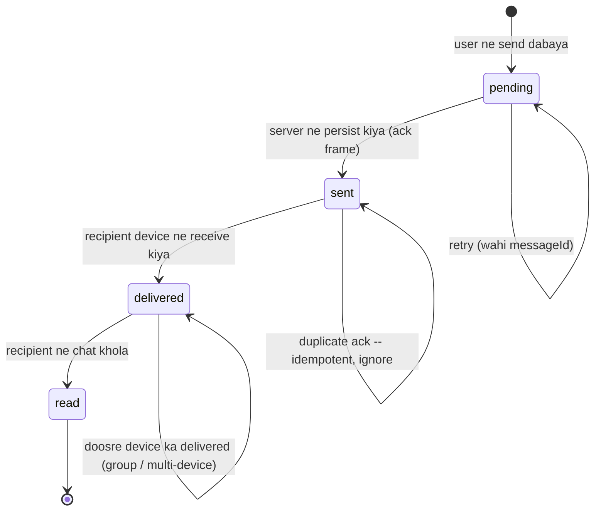

# Chat System -- HLD + LLD (Part 3: WebSocket Internals -> Ordering -> Delivery -> Presence -> Concurrency)

> Is file mein prompt ke **Parts 13-15** hain, par chat ke hisaab se: **mechanisms zero se** (WebSocket ka handshake aur frame format, connection routing, message ID vs seq, delivery ke tick, reconnect storm), **concurrency** (ek hi conversation par do sender, ek user teen device par, Kafka rebalance, receipt out of order), aur **Redis state ka deep dive** (har key, presence ka N-squared problem, memory math, failover).
> **Part 1-2 recap (3 lines):** Part 1 mein humne polling se WebSocket tak ki seedhi chadhi aur decide kiya ki gateway tier **stateful** hoga -- 250 nodes x 50,000 connections = 10M concurrent sockets, aur "kaun kis node par hai" ye Redis `conn:<userId>:<deviceId>` batayega. Part 2 mein flow, frame protocol (`send` / `ack` / `message` / `receipt` / `typing` / `resume`), Postgres schema (`messages` PK `(conversation_id, seq)`), APIs (`afterSeq` keyset sync) aur LLD classes (`gateway/`, `services/`, `workers/`) likhe. Rule ye tha: **`sent` ack tabhi jab message persist ho chuka ho**, aur fan-out Kafka `chat-events` (64 partitions, key = `conversationId`) ke through Delivery Workers karte hain.
> **Part 4 mein kya hai:** scaling 1x -> 1000x, failure scenarios (gateway crash, Redis down, Kafka lag, reconnect storm), consistency, security, observability.

---

## PART 13 -- Important Mechanisms (zero se)

Chat mein "algorithm" wali baat kam hai (koi Base62, koi token bucket nahi). Yahan **mechanisms** hain -- aise machine ke purze jinke bina system chalta hi nahi. Paanch hain:

1. WebSocket khud (transport)
2. Connection routing (message sahi node tak kaise pahunche)
3. Message ID + ordering (do alag cheezein, log inhe mila dete hain)
4. Delivery semantics + tick state machine
5. Reconnect + thundering herd

Har ek ko zero se kholte hain.

---

### 13.1 -- WebSocket internals: ek connection jo khula rehta hai

#### Pehle recap: hum yahan kaise pahunche

Part 1 ki seedhi ek line mein:

```
Short polling   har 2 s GET /messages  -> 10M x 0.5 rps = 5M rps, 99% khaali jawab, phir bhi 2 s lag
Long polling    server request rok ke rakhta hai -> better, par har message par naya HTTP request + headers
SSE             server -> client one-way, text only -> client -> server ke liye alag HTTP call chahiye
WebSocket       ek TCP connection, dono taraf, text + binary, HTTP Upgrade se shuru
```

Ab WebSocket ko kholte hain -- kyunki "10M connections" ka poora budget isi ke internals se nikalta hai.

#### Handshake -- byte by byte

WebSocket **HTTP se shuru hota hai**. Ye design choice jaan-boojh kar hai: duniya ke saare firewall, proxy aur load balancer HTTP port 80/443 ko already samajhte hain. Agar WebSocket apna naya port maangta toh corporate network mein kabhi na chalta.

Client bhejta hai (ye ek **normal HTTP GET** hai):

```
GET /ws HTTP/1.1
Host: chat.example.com
Upgrade: websocket
Connection: Upgrade
Sec-WebSocket-Key: dGhlIHNhbXBsZSBub25jZQ==
Sec-WebSocket-Version: 13
Sec-WebSocket-Protocol: chat.v1
Sec-WebSocket-Extensions: permessage-deflate
Origin: https://chat.example.com
```

Line by line:

| Header | Matlab | Agar galat ho toh |
|---|---|---|
| `GET /ws HTTP/1.1` | Normal HTTP request. Method **GET hi hona chahiye**, HTTP/1.1 hi (HTTP/1.0 mein Upgrade nahi) | Server 400 dega |
| `Upgrade: websocket` | "Is TCP connection ka protocol badalna hai" | Server normal HTTP response de dega, socket nahi khulega |
| `Connection: Upgrade` | Hop-by-hop header. Ye proxy ko batata hai ki `Upgrade` header **forward karo, kha mat jao** | Beech ka proxy Upgrade nigal jaata hai -- classic "local par chalta hai, prod mein nahi" bug (nginx mein `proxy_set_header Upgrade $http_upgrade; proxy_set_header Connection "upgrade";` isliye likhna padta hai) |
| `Sec-WebSocket-Key` | 16 random bytes, base64 mein (24 chars). **Har connection par naya** | Missing -> 400 |
| `Sec-WebSocket-Version: 13` | RFC 6455 wala version. Aaj sirf 13 zinda hai | Server `Sec-WebSocket-Version: 13` ke saath 426 Upgrade Required bhejta hai |
| `Sec-WebSocket-Protocol` | Subprotocol negotiation -- "main `chat.v1` bolta hoon". Hamare kaam ka: `chat.v2` deploy karte waqt purane clients ko `chat.v1` par serve kar sakte ho | Server ignore kar sakta hai |
| `Sec-WebSocket-Extensions` | Frame-level extensions, jaise compression | Server chup rahe = extension off |

Server jawab deta hai:

```
HTTP/1.1 101 Switching Protocols
Upgrade: websocket
Connection: Upgrade
Sec-WebSocket-Accept: s3pPLMBiTxaQ9kYGzzhZRbK+xOo=
Sec-WebSocket-Protocol: chat.v1
```

**`101 Switching Protocols`** -- ye HTTP ka sabse kam dikhne wala status code hai. Iske baad us TCP connection par **HTTP bacha hi nahi**. Koi `Content-Length` nahi, koi response body nahi, koi "request khatam" nahi. Ab dono taraf se WebSocket frames chalenge, jab tak koi close na kare.

#### `Sec-WebSocket-Key` / `Accept` asal mein kya prove karte hain?

Sabse common galatfehmi: "ye security ke liye hai". **Nahi hai.** Key random hai par **secret nahi** -- wire par plaintext jaati hai (TLS ke andar TLS ki wajah se safe hai, is header ki wajah se nahi).

Formula:

```
Sec-WebSocket-Accept = base64( SHA1( Sec-WebSocket-Key + "258EAFA5-E914-47DA-95CA-C5AB0DC85B11" ) )
```

Woh lamba GUID RFC 6455 mein **hard-coded** hai -- duniya ke har WebSocket server mein wahi string hai.

Verify karke dekho (RFC ka hi example):

```js
const crypto = require('crypto');
const GUID = '258EAFA5-E914-47DA-95CA-C5AB0DC85B11';
crypto.createHash('sha1').update('dGhlIHNhbXBsZSBub25jZQ==' + GUID).digest('base64');
// -> 's3pPLMBiTxaQ9kYGzzhZRbK+xOo='
```

**Code Explanation:**

- `'dGhlIHNhbXBsZSBub25jZQ=='` -- client ka `Sec-WebSocket-Key`, **base64 string ke roop mein hi** (decode nahi karna). Ye RFC 6455 ka official test vector hai.
- `+ GUID` -- concatenation, koi separator nahi.
- `SHA1` -- haan, SHA1. Purana aur cryptographically kamzor hai, par yahan security ke liye use hi nahi ho raha, sirf "tumne protocol samjha ya nahi" ka proof hai.
- `digest('base64')` -- 20 bytes ka hash -> 28-char base64 string.
- Client isi calculation ko dobara karke server ke `Sec-WebSocket-Accept` se match karta hai. Match nahi hua -> connection band.

**Toh ye prove kya karta hai?** Sirf ek baat: **"jisne jawab diya woh WebSocket bolta hai, koi confused HTTP server ya cache nahi hai."**

Attack jise ye rokta hai: socho ek purana caching proxy hai jo `GET /ws` ko normal GET samajh kar uska response **cache** kar leta hai. Attacker apni site se `new WebSocket("ws://internal-proxy/some/path")` chalata hai. Agar server random echo kar deta ya koi cached 200 aa jaata, toh browser ko lagta "socket khul gaya" aur attacker proxy ke through raw bytes bhej pata. Accept header ye pakka karta hai ki jawab **specifically is request ke liye, is key par calculate karke** bana hai -- cached ya pre-recorded response kabhi match nahi karega.

> **Interview line:** "`Sec-WebSocket-Key`/`Accept` authentication nahi hai -- ye proof hai ki responder ne handshake actually samjha, taaki koi cache ya confused intermediary galti se WebSocket connection na khulwa de. Auth main handshake ke baad `auth` frame mein JWT se karta hoon, ya `Sec-WebSocket-Protocol` header mein token bhejta hoon, kyunki browser WebSocket API custom headers allow nahi karta."

#### Frame format

Handshake ke baad har byte ek **frame** ka hissa hai. Format (RFC 6455):

```
 0                   1                   2                   3
 0 1 2 3 4 5 6 7 8 9 0 1 2 3 4 5 6 7 8 9 0 1 2 3 4 5 6 7 8 9 0 1
+-+-+-+-+-------+-+-------------+-------------------------------+
|F|R|R|R| opcode|M| Payload len |   Extended payload length     |
|I|S|S|S|  (4)  |A|     (7)     |          (16 / 64)            |
|N|V|V|V|       |S|             | (agar payload len == 126/127) |
| |1|2|3|       |K|             |                               |
+-+-+-+-+-------+-+-------------+ - - - - - - - - - - - - - - - +
|     Extended payload length continued, agar payload len == 127 |
+ - - - - - - - - - - - - - - - +-------------------------------+
|                               | Masking-key, agar MASK set hai |
+-------------------------------+-------------------------------+
|    Masking-key (continued)    |          Payload Data         |
+-------------------------------- - - - - - - - - - - - - - - - +
```

Har field ka kaam:

| Field | Bits | Kaam | Chat mein hamare liye |
|---|---|---|---|
| `FIN` | 1 | "Ye message ka aakhri frame hai" | Hamare frames chhote hain (~300 B), hamesha FIN = 1 |
| `RSV1/2/3` | 3 | Reserved. `permessage-deflate` on ho toh RSV1 = "ye frame compressed hai" | Hum compression off rakhenge (neeche) -> hamesha 0 |
| `opcode` | 4 | Frame ka type | `0x1` (text JSON) |
| `MASK` | 1 | Payload masked hai ya nahi | client -> server: **hamesha 1**, server -> client: **hamesha 0** |
| `Payload len` | 7 | 0-125 = asli length. 126 = "agle 2 bytes padho". 127 = "agle 8 bytes padho" | Hamara 300-byte message -> `126` + 2 bytes = 4 byte header |
| `Masking-key` | 0 ya 32 | 4 random bytes | Sirf client -> server frames mein |

Opcodes:

```
0x0  continuation   (fragmented message ka agla tukda)
0x1  text           (payload valid UTF-8 hona chahiye)
0x2  binary
0x8  close
0x9  ping
0xA  pong
```

**Overhead ka hisaab (ye important hai):**

```
Hamara avg message = 300 bytes JSON

Server -> client frame:  2 byte header (len < 126) ya 4 byte (len 126-65535)
                         + 0 byte mask
                         = 300 + 4 = 304 bytes on the wire

Wahi cheez HTTP long-polling se:
  HTTP response line + Date + Content-Type + Content-Length + Connection + ...
  = ~200-500 bytes headers, HAR message par
  + request bhejne ka bhi ~300-800 bytes (cookies, User-Agent, Authorization)

=> WebSocket per message ~4 bytes overhead, HTTP polling ~700+ bytes.
=> 460,000 deliveries/sec par: WebSocket ~1.8 MB/s of overhead,
   polling ~322 MB/s of overhead. Yahi WebSocket ka asli fayda hai.
```

#### Client-to-server frames masked kyun hote hain?

Ye sawaal interview mein achha lagta hai kyunki jawab **security** hai, performance nahi.

**Mask ka matlab:** client 4 random bytes chunta hai (`masking-key`), aur payload ke har byte ko un 4 bytes se XOR kar deta hai (byte `i` -> `payload[i] XOR key[i % 4]`). Server wahi XOR dobara lagakar original nikal leta hai (XOR apna hi ulta hota hai).

**Encryption nahi hai** -- key toh frame mein hi saath jaa rahi hai! Koi bhi unmask kar sakta hai. Toh fayda kya?

Problem ye thi: internet par lakhs purane **transparent proxies** hain jo TCP stream ko dekh kar "HTTP request jaisa dikh raha hai" guess karte hain aur usko cache/forward kar dete hain. Attacker ki website ka JavaScript `new WebSocket(...)` khol kar payload mein **jaan-boojh kar ek poora HTTP request** likh sakta tha:

```
GET /jquery.js HTTP/1.1
Host: cdn.example.com

```

Purana proxy stream mein ye bytes dekhta, sochta "ye toh naya HTTP request hai", aur uska response `cdn.example.com/jquery.js` ke naam se **cache** kar deta -- yaani attacker ne proxy ka cache poison kar diya, aur us proxy ke peeche ke saare users ko attacker ka JS milne laga. Isko **cache poisoning via WebSocket** kehte hain.

**Masking isko kaise rokta hai:** masking key **har frame par naya random** hai aur browser generate karta hai -- JavaScript usko na set kar sakta hai, na padh sakta hai. Toh attacker ka JS chahe kuch bhi bheje, wire par jo bytes jaate hain woh har baar alag aur unpredictable hote hain. Attacker wire par apni marzi ke bytes **likh hi nahi sakta**.

Hamare liye 2 practical natije:

1. **Server -> client frames masked NAHI hote.** Aur hamara traffic bahut asymmetric hai: 70,000 msg/sec andar, **460,000 deliveries/sec bahar**. Matlab hamara bada wala traffic masking ka CPU cost **deta hi nahi**. Ye achhi khabar hai.
2. **Server ko har incoming frame unmask karna padta hai** -- 70,000 frames/sec x 300 bytes = 21 MB/s ka XOR. 250 nodes par baanto toh per node 84 KB/s. Bilkul negligible. (`ws` library ye kaam native C++ addon `bufferutil` se karti hai agar install ho -- 10M connections wale system par `bufferutil` aur `utf-8-validate` install karna ek chhota par asli optimization hai.)

#### Control frames: ping, pong, close

Teen frames aise hain jo **data nahi, protocol** hain:

```
0x9 ping   -> doosri taraf ko 0xA pong bhejna hi padta hai (RFC requirement), usi payload ke saath
0xA pong   -> ping ka jawab, ya bina maange "main zinda hoon"
0x8 close  -> 2-byte close code + optional UTF-8 reason
```

Teen niyam jo yaad rakhne layak hain:

- **Control frame ka payload max 125 bytes.** Isliye length field ka extended form inpe lagta hi nahi.
- **Control frames fragment nahi ho sakte** (FIN hamesha 1).
- **Control frame ek bade fragmented message ke BEECH mein aa sakta hai.** Yaani aap 10 fragments ka bada message bhej rahe ho, beech mein ping aa sakta hai. Isiliye heartbeat kabhi block nahi hota.

Hamara heartbeat (spec):

```
Server har 30 s   -> ping bhejta hai
Client            -> pong (ws library automatic bhejti hai, app code likhna hi nahi padta)
2 miss (60 s)     -> server socket close karta hai + `conn:<userId>:<deviceId>` DEL karta hai
Redis TTL 90 s    -> 60 s se thoda zyada, taaki close aur TTL expiry mein race na ho
```

Close codes jo hum use karte hain (spec):

| Code | Kab | Client kya kare |
|---|---|---|
| `1000` | Normal close (user ne logout kiya) | Reconnect **mat** karo |
| `1001` | Going away (deploy, node drain) | Reconnect karo, backoff ke saath |
| `1011` | Internal server error | Reconnect karo, backoff ke saath |
| `1013` | Try again later -- **slow client drop** (`bufferedAmount > 1 MB`) | Reconnect karo, **lamba** backoff |
| `4001` | Custom: auth failure | Token refresh karo, tabhi reconnect |

`4001` custom hai kyunki 4000-4999 range application ke liye reserved hai. **Zaroori baat:** auth failure par client ko reconnect loop **nahi** chalana chahiye -- warna ek expired token wala client hamesha ke liye connect-fail-connect ka infinite loop chalayega aur 10M mein se 1% aise clients bhi 100,000 wasted connects/sec bana denge.

#### Fragmentation

Ek bade message ko kai frames mein toda ja sakta hai:

```
frame 1:  FIN=0  opcode=0x1 (text)          "Bahut bada "
frame 2:  FIN=0  opcode=0x0 (continuation)  "message ka "
frame 3:  FIN=1  opcode=0x0 (continuation)  "doosra hissa"
```

Kyun exist karta hai? Taaki sender ko **poora message pehle se buffer na karna pade** -- streaming ke liye (jaise ek badi file bhejni ho). Receiver tab tak tukde jodta rehta hai jab tak FIN=1 na aaye.

**Hamare liye ye ek khatra hai, feature nahi.** Kyun? Kyunki `ws` library default se saare fragments **memory mein jod kar** tabhi `message` event deti hai. Agar koi malicious client FIN=0 wale 1000 frames bheje, toh server unhe jodta rahega -> memory. Isliye:

```ts
const wss = new WebSocketServer({
  noServer: true,
  maxPayload: 8 * 1024,          // 8 KB -- spec ka message limit 4 KB hai, do guna headroom
  perMessageDeflate: false,      // neeche wajah
  skipUTF8Validation: false,
});
```

**Code Explanation:**

- `noServer: true` -- `ws` khud HTTP server nahi banayega; hum apne Node HTTP server ke `upgrade` event par manually handle karenge. Isse handshake se pehle JWT check aur rate limit lag sakti hai (poora connection banne se pehle reject karna sasta hai).
- `maxPayload: 8 * 1024` -- **ye line ek DoS ko rokti hai.** Iske bina ek client 100 MB ka frame bhej kar node ko OOM kar sakta hai. `ws` assembled message size is limit se upar jaate hi connection ko 1009 (Message Too Big) ke saath close kar deta hai -- aur zaroori baat ye hai ki woh **bytes aate hi** check karta hai, poora message banne ka intezaar nahi karta.
- `perMessageDeflate: false` -- compression band. Wajah neeche.
- `skipUTF8Validation: false` -- text frames mein invalid UTF-8 aaya toh reject. Skip karne se thodi CPU bachti hai par phir aapka `JSON.parse` garbage par crash karega.

#### `permessage-deflate` -- aur 10M connections par usko band kyun karte hain

**`permessage-deflate` kya hai:** ek WebSocket extension jo har message ko **zlib (DEFLATE)** se compress karta hai. JSON text 60-80% tak chhota ho jaata hai. Sunne mein free win lagta hai.

Ab memory ka hisaab karo. zlib ka har stream ek **sliding window** rakhta hai:

```
Default windowBits = 15  ->  2^15 = 32 KB window
Ek connection ke liye deflate (bhejne ka)  ~ 32 KB window + internal buffers
Ek connection ke liye inflate (padhne ka)  ~ 32 KB window + internal buffers
zlib ke internal state + Node ke Buffers   ~ baaki

ws library ki apni documentation kehti hai: ~300 KB per connection (default settings)
```

Hamare node par:

```
50,000 connections x 300 KB = 15,000,000 KB = ~15 GB

Node ko spec mein 8 GB RAM diya hai.
=> Compression ON karte hi node boot hote hi mar jaayega.
```

Aur fayda? Hamara avg message **300 bytes** hai. 300 bytes ko DEFLATE karo toh:

- Itne chhote payload par compression ratio bekaar hota hai (dictionary bharti hi nahi).
- Har message par deflate ka CPU (per message ~10-50 microseconds) x 460,000 deliveries/sec = **5-23 CPU-seconds har second**. 250 nodes par bhi ye 2-9% CPU sirf 300-byte JSON ko compress karne mein.

**Faisla: `perMessageDeflate: false`.** Spec ka "per connection ~20 KB" budget hi tabhi sahi hai jab compression off ho.

**Kab ON karte?** Agar aapke messages bade hote (jaise 50 KB ke JSON documents, collaborative editor ke diffs), tab. Aur tab bhi tuning ke saath:

```ts
perMessageDeflate: {
  threshold: 4096,                          // 4 KB se chhote message compress hi mat karo
  zlibDeflateOptions: { level: 1, memLevel: 4, windowBits: 10 },  // ~12 KB/conn
  clientMaxWindowBits: 10,                  // client ko bhi chhota window maango
  concurrencyLimit: 10,                     // ek saath 10 se zyada zlib job nahi
}
```

**Code Explanation:**

- `threshold: 4096` -- isse chhote messages seedhe bina compress ke jaayenge. Hamare 300-byte messages waise bhi skip ho jaate.
- `level: 1` -- zlib ka sabse tez (aur sabse kam) compression. Chat mein latency > bandwidth.
- `memLevel: 4` aur `windowBits: 10` -- window 32 KB se ghata kar **1 KB**. Per connection memory ~300 KB se ~12 KB par aa jaati hai. Compression ratio girta hai, par 25x memory bachti hai.
- `clientMaxWindowBits: 10` -- browser ko bhi chhota window use karne ko bolo, warna **server ko inflate ke liye bada window** rakhna padega.
- `concurrencyLimit: 10` -- zlib Node ke **threadpool** (default 4 threads) par chalta hai. Bina limit ke 50,000 pending zlib jobs threadpool ko jaam kar denge -- aur wahi threadpool DNS lookups aur `fs` ke liye bhi hai. Ye ek bahut chupa hua production bug hai.

#### Ek khuli connection ki asli keemat

Ab spec ka `~20 KB per connection` kahan se aata hai, ye kholte hain. Ek connection chaar jagah memory khaati hai:

| Kya | Kahan rehta hai | Kitna | Kaise kam karein |
|---|---|---|---|
| File descriptor + epoll entry | Kernel | ~0.5 KB (`struct file` + epoll ka rbtree node) | Kam nahi hota. Bas `ulimit -n` badhao |
| Socket buffers (`sk_buff` + rcv/snd queue) | Kernel | Default autotune se 16-64 KB+; tuned par **~8-10 KB** | `net.ipv4.tcp_rmem = 4096 16384 262144`, `tcp_wmem` same. Idle socket ko minimum hi milta hai |
| TLS session state | LB par (hamara case) ya OpenSSL mein | LB par: **0** gateway ke liye. Gateway par terminate karo toh OpenSSL default **~32 KB** (16 KB read + 16 KB write buffer) | Spec ka L4 LB **TLS terminate** karta hai -> gateway ko plain TCP milta hai. Yahi 20 KB budget ko possible banata hai |
| `ws` ka JS object + app state | Node ka V8 heap | `WebSocket` + `Receiver` + `Sender` + hamara `{ userId, deviceId, subscribedConversations, lastHeartbeatAt }` = **~5 KB** | Per-socket par Map/Array mat rakho; jitna chhota object utna achha |

```
Total per connection:  0.5 + 9 + 0 (TLS at LB) + 5  =  ~15-20 KB
50,000 connections x 20 KB = ~1 GB   <- spec ka number
Node ko 8 GB: 1 GB connections + V8 heap + message churn + headroom
```

**Do production traps jo yahin marte hain:**

1. **`ulimit -n`** -- Linux ka default **1024** hai. Aapka node 1024 connections ke baad `EMFILE: too many open files` dega aur naye connect chup-chaap fail honge. Spec: har node par `>= 200,000`. (Systemd unit mein `LimitNOFILE=200000`, Docker mein `--ulimit nofile=200000:200000`.) Ye is system ka **sabse classic** production trap hai -- load test 500 connections par pass ho jaata hai aur prod 1024 par girta hai.

2. **TLS gateway par terminate kar diya** -- OpenSSL har `SSL` object ke liye 16 KB read + 16 KB write buffer allocate karta hai. 50,000 x 32 KB = **1.6 GB sirf TLS buffers**. Budget 20 KB se 50 KB par chala jaata hai. Fix: TLS ko LB par rakho (hamara design), ya connections ghata kar 20,000 per node karo.

**Ek aur number jo perspective deta hai:** 460,000 deliveries/sec peak / 250 nodes = **~1,840 socket writes/sec per node**. Yaani connections ka problem **memory ka hai, CPU ka nahi**. 1,840 writes/sec ek Node process ke liye kuch bhi nahi -- par 50,000 objects ko zinda rakhna hai.

> **Interview line:** "WebSocket HTTP Upgrade se shuru hota hai taaki port 443 par firewall aur proxy usko guzar jaane dein; `Sec-WebSocket-Accept` ek fixed GUID ke saath SHA1 hai jo sirf ye prove karta hai ki jawab dene wale ne handshake samjha, security nahi deta. Client-to-server frames isliye masked hote hain ki attacker ka JavaScript wire par predictable bytes likh kar purane proxies ka cache poison na kar sake -- aur hamare liye achhi baat ye hai ki server-to-server... server-to-client frames masked nahi hote, aur hamara 460K/sec wala traffic wahi hai. 10M connections ke liye main `permessage-deflate` off rakhunga kyunki har connection par ~300 KB zlib state = 15 GB per node, aur hamare 300-byte messages compress karne layak hain hi nahi."

---

### 13.2 -- Connection routing: "B ka socket kisi aur node par hai, message wahan kaise pahunche?"

#### Problem

```
Alice ka phone  -> L4 LB -> Gateway node N12   (socket yahan khula hai)
Bob ka phone    -> L4 LB -> Gateway node N87   (socket yahan khula hai)

Alice N12 par message bhejti hai: "aaj shaam milte hain"
N12 ke paas Bob ka socket HAI HI NAHI.
```

Pichhle saare systems mein ye problem thi hi nahi. URL Shortener mein koi bhi API node koi bhi request handle kar sakta tha. **Stateless tha.** Yahan socket ek **specific process ki memory** mein ek `WebSocket` object hai. Us object tak pahunchne ka koi tarika chahiye.

Ye is poore lesson ka dil hai. Paanch tarike hain.

#### Paanchon options -- poora comparison

| # | Approach | Kaise kaam karta | Lookup cost | Node fail hone par | Rebalance par | Kab sahi hai |
|---|---|---|---|---|---|---|
| **a** | **Broadcast to all nodes** | Chat Service har message ko saare 250 nodes ko bhejta hai; har node dekhta hai "mere paas ye user hai kya?" | 0 lookup, par **250x network amplification** | Kuch nahi bigadta (message waise bhi sabko jaa raha tha) | Kuch nahi | **10-20 nodes tak**, chhoti team, v0 prototype. 250 nodes x 460K deliveries/sec = 115M messages/sec network par -- bilkul bekaar |
| **b** | **Consistent hashing: user -> fixed node** | `nodeId = hashRing(userId)`. Sabko pata hai Bob hamesha N87 par hoga; LB bhi user ko wahin bhejta hai | **0 lookup** -- pure math, koi network call nahi | **Bura:** us node ke saare users ko dobara connect karna padta hai, aur ring badalne se "Bob kahan hai" ka jawab **turant** badal jaata hai jabki uska socket abhi purani jagah hai | **Sabse bada dard:** node add/remove par ring badalti hai -> hazaron users ka mapping badalta hai -> forced disconnects. Autoscaling practically band | Jab connections hi aapka partition key ho aur aap nodes kabhi na badlein (bahut rare). Gaming / stateful simulation servers mein dikhta hai |
| **c** | **Session registry + Pub/Sub (HAMARI CHOICE)** | Gateway connect par Redis mein likhta hai `conn:<userId>:<deviceId> = nodeId` (TTL 90 s), aur `gw:<nodeId>` channel par SUBSCRIBE karta hai. Delivery worker registry padhta hai, phir us channel par PUBLISH karta hai | **1 Redis GET/MGET (~0.3 ms)** + 1 PUBLISH | Us node ke users ke liye `conn:` keys 90 s mein TTL se khud mar jaati hain; users kahin bhi reconnect kar sakte hain -- **koi fixed mapping nahi** | **Zero.** Naya node add karo, LB usko traffic dena shuru kar de, registry apne aap update ho jaati hai | **Hamara** -- 250 nodes, autoscaling, stateless-jaisa operations |
| **d** | **Kafka topic per node** | Har gateway node apne naam ka Kafka topic consume karta hai | 1 registry lookup + Kafka produce | Durable! Node wapas aake purane messages padh lega (par woh users ab kahin aur hain -- bekaar) | -- | **Partition explosion:** 250 nodes x kam se kam 1 partition = 250 partitions sirf routing ke liye, aur har node add par naya topic banao. Kafka ka broker metadata phat jaata hai. Latency bhi Redis se zyada (~5-20 ms vs 0.3 ms) |
| **e** | **Direct gRPC node-to-node** | Delivery worker registry se `nodeId` -> service discovery se `nodeId` ka IP:port -> seedha gRPC call `PushFrame(deviceId, frame)` | 1 registry lookup + 1 direct RPC (**sabse kam latency**, Redis hop bachta hai) | Call fail hoti hai -> turant pata chal jaata hai (Redis Pub/Sub mein pata hi nahi chalta) | Zero | **v3 option.** Sabse tez aur **delivery confirm** deta hai. Par chahiye: service discovery, gRPC connection pool (250 nodes x 250 = 62,500 possible connections -- mesh), health checking, retries, circuit breakers. Complexity bahut badh jaati hai |

#### Hamari choice kyun (c)

```
Delivery Worker                              Gateway N87
     |                                            |
     | MGET conn:bob:d1  conn:bob:d2              | (boot par) SUBSCRIBE gw:N87
     |   -> "N87"          -> "N12"               |
     |                                            |
     | PUBLISH gw:N87  {deviceId:"d1", frame}  -->|  socket = connections.get("bob:d1")
     | PUBLISH gw:N12  {deviceId:"d2", frame}     |  socket.send(frame)
     v                                            v
```

Teen wajah:

1. **Operations simple hain.** Node marta hai -> uski `conn:` keys 90 s mein khud expire -> users kisi bhi node par reconnect -> nayi keys. Koi rebalance, koi ring, koi manual step nahi.
2. **Lookup sasta hai.** Ek `MGET` se ek user ke saare devices ek saath. Redis ~0.3 ms.
3. **Fan-out natural hai.** 30 members wale group mein, delivery worker sab devices ke nodeIds nikal kar **nodeId ke hisaab se group** kar leta hai. Agar 30 devices sirf 12 alag nodes par hain toh 30 PUBLISH nahi, **12 PUBLISH** (har ek mein deviceIds ki list). Ye batching option (b), (d), (e) mein bhi possible hai par yahan sabse saaf hai.

> **Redis Cluster note:** `MGET conn:bob:d1 conn:bob:d2` tabhi chalega jab dono keys ek hi slot mein hon. Isliye Cluster mein key par **hash tag** lagao: `conn:{bob}:d1`, `conn:{bob}:d2` -- `{}` ke andar ka hissa hi slot decide karta hai, toh ek user ke saare devices ek shard par. (Rate Limiter Part 14 mein yahi trick seekhi thi.) Naam wahi `conn:<userId>:<deviceId>` hai, bas userId braces mein.

#### Redis Pub/Sub ki asli mechanics (aur ye kyun "kamzor" hai)

Ye hisso sabse zyada log galat samajhte hain. Redis Pub/Sub:

| Property | Sach |
|---|---|
| Delivery guarantee | **At-most-once.** Fire and forget. Koi ack nahi, koi retry nahi |
| Persistence | **Zero.** `PUBLISH` sirf un clients ko bhejta hai jo **us exact pal** subscribed hain. Message kahin store nahi hota |
| Subscriber offline | Message **chup-chaap gir jaata hai.** `PUBLISH` ka return value = kitne subscribers ko bheja gaya (0 aa sakta hai, aur koi error nahi) |
| Slow subscriber | Redis uska output buffer bharta dekhta hai aur `client-output-buffer-limit pubsub 32mb 8mb 60` par **connection kill kar deta hai** |
| Replication | Pub/Sub messages replicas tak jaate hain, par **subscriptions replicate nahi hoti** -- failover par har subscriber ko dobara SUBSCRIBE karna padta hai |
| Cluster mein | Normal `PUBLISH` **poore cluster bus par broadcast** hota hai -- har node ko. Redis 7 ka `SPUBLISH`/`SSUBSCRIBE` (sharded pub/sub) isko ek shard tak seemit rakhta hai |

**Ab soch ke dekho, hamare case mein kya-kya gir sakta hai:**

```
Case 1: Gateway N87 restart ho raha hai (deploy)
  t=0.0   N87 SIGTERM par sockets band kar raha hai, Redis subscriber bhi disconnect
  t=0.1   Delivery worker ne conn:bob:d1 padha -> "N87"   (key abhi TTL par zinda hai)
  t=0.1   PUBLISH gw:N87 {...}  -> Redis: "0 subscribers"  -> message GAYAB
  t=0.2   Bob ka client reconnect kar raha hai N43 par

Case 2: N87 zinda hai par event loop 300 ms ke liye atka (bada GC)
  Redis ka output buffer bhar raha hai. Agar 8 MB 60 s tak bhara raha -> Redis N87 ka
  subscriber connection KILL kar dega -> N87 ko kuch nahi milega jab tak resubscribe na ho.

Case 3: Redis Pub/Sub instance ka failover
  Subscriptions replicate nahi hoti. Naya primary ko pata hi nahi kaun subscribed tha.
  ioredis (autoResubscribe) dobara SUBSCRIBE karti hai, par beech ke ~1-2 s ke saare
  PUBLISH gayab.
```

#### Toh ye acceptable kyun hai? (Sabse important paragraph)

Kyunki **socket push hamari delivery ka guarantee nahi hai.**

```
Message ka asli safar:

1. Client -> Chat Service -> INCR seq -> INSERT into messages (Postgres/Cassandra)  <-- DURABLE
2. Chat Service -> ack {seq}  -> sender ko ek grey tick                             <-- WAADA POORA
3. Chat Service -> Kafka chat-events (replication factor 3)                         <-- DURABLE
4. Delivery Worker -> Redis PUBLISH -> gateway -> socket.send()                      <-- BEST EFFORT
```

Step 1 ke baad hamara **durability ka waada poora ho chuka hai** ("accepted message kabhi na khoye"). Step 4 sirf ek **optimization** hai -- "message turant dikh jaaye" ke liye. Woh gir jaaye toh kya hoga?

Teen recovery raste hain, aur teeno already design mein hain:

1. **`resume` on reconnect** -- client reconnect par `{"type":"resume","lastSeqByConversation":{...}}` bhejta hai. Server har conversation ke `seq > lastSeq` wale saare messages bhej deta hai. Case 1 aur Case 3 isse automatic fix ho jaate hain.
2. **Client-side gap detection** -- client ke paas C9 ka `lastSeq = 500` hai. Agla message `seq = 502` aata hai. Client dekhta hai "501 kahan gaya?" -> `GET /api/v1/conversations/C9/messages?afterSeq=500&limit=50` maar kar hole bhar leta hai. Metric: `seq_gap_detected_total`. Case 2 isse fix hota hai (client connected hi raha, par ek push gir gaya).
3. **Push notification fallback** -- delivery worker ko koi session nahi mili toh Notification service ko bolta hai. Aur agar mili thi par `delivered` receipt N seconds mein nahi aayi, toh bhi push bhej sakte ho.

> **Isko ek line mein yaad rakho:** *socket push ko reliable banane ki koshish mat karo. **Store ko reliable banao aur client ko resumable.*** Phir har dropped push sirf "thoda late dikha" ban jaata hai, "message kho gaya" nahi. Yahi wajah hai ki hum Redis Pub/Sub (jo at-most-once hai) ko chat delivery ke liye use kar sakte hain bina raat ko jaage.

**Pub/Sub ka load:** 460,000 deliveries/sec peak = 460,000 `PUBLISH`/sec. Ek Redis instance ke liye ye bahut hai (aur SPOF bhi). Isliye **8 dedicated standalone Redis instances** sirf pub/sub ke liye, `hash(nodeId) % 8` se shard. Har instance ~57,500 PUBLISH/sec -- comfortable. Ye instances **koi key store nahi karte**, sirf routing karte hain, toh inme memory ka sawaal hi nahi (sirf client output buffers). Aur standalone isliye ki Cluster mein plain `PUBLISH` poore bus par broadcast hota hai.

---

### 13.3 -- Message IDs aur Ordering (do alag cheezein hain)

Ye woh section hai jahan sabse zyada confusion hoti hai. Ek line mein farak:

> **`messageId` ka kaam "ye message pehle aa chuka hai kya?" hai. `seq` ka kaam "ye message kis number par aata hai?" hai. Dono ka kaam bilkul alag hai aur ek doosre ki jagah nahi le sakte.**

| | `messageId` | `seq` |
|---|---|---|
| Kaun banata hai | **Client** | **Server** |
| Kya hai | UUID v4 (random 128-bit) | Per-conversation monotonic integer |
| Kab banta hai | User ke "send" dabate hi, **offline mein bhi** | Server par persist hone ke waqt (`INCR seq:<conversationId>`) |
| Kaam | **Idempotency** -- retry par duplicate insert/render na ho | **Ordering + gap detection + delta sync** |
| Sortable? | Bilkul nahi (random hai) | Haan, wahi iska poora point hai |
| Kahan enforce hota | `UNIQUE (conversation_id, message_id)` index | `PRIMARY KEY (conversation_id, seq)` |
| Client ise | Send karta hai | Sirf padhta hai (ack/message frame se) |

#### Worked example: retry, idempotency index ke saath aur bina

Scene: Priya metro mein hai. 4G se WiFi par switch hua theek send ke waqt.

**Bina `messages_msgid_uniq` index ke (BUGGY):**

```
t=0.000  Client -> {"type":"send","messageId":"a1b2c3","conversationId":"C9","body":"nikal rahi hoon"}
t=0.400  Server  INCR seq:C9         -> 501
t=0.410  Server  INSERT messages (C9, 501, a1b2c3, "nikal rahi hoon")   [OK]
t=0.415  Server  -> ack {messageId:"a1b2c3", seq:501}
t=0.416  *** network switch, ack wire par hi mar gaya ***
t=5.000  Client timeout -> WAHI frame dobara bhejta hai (same messageId a1b2c3)
t=5.400  Server  INCR seq:C9         -> 502
t=5.410  Server  INSERT messages (C9, 502, a1b2c3, "nikal rahi hoon")   [OK]  <-- PK (C9,502) free tha!
t=5.415  Server  -> ack {messageId:"a1b2c3", seq:502}

Natija:
  Conversation C9:
    seq 501: "nikal rahi hoon"   (Priya)
    seq 502: "nikal rahi hoon"   (Priya)
  Recipient ko DO message dikhe. Priya ko bhi, jab uska laptop sync karega.
  Aur Priya ko yaad bhi nahi ki usne do baar bheja.
```

`PRIMARY KEY (conversation_id, seq)` ne kuch nahi roka -- kyunki `seq` alag tha! **Duplicate rokne ke liye PK kaafi nahi, `message_id` par alag unique index chahiye.**

**`messages_msgid_uniq` index ke saath (SAHI):**

```sql
CREATE UNIQUE INDEX messages_msgid_uniq ON messages (conversation_id, message_id);
```

```
t=5.000  Client retry (same messageId a1b2c3)
t=5.400  Server  INCR seq:C9         -> 502            <-- 502 "burn" ho gaya
t=5.410  Server  INSERT ... ON CONFLICT (conversation_id, message_id) DO NOTHING
                 -> 0 rows affected  (index ne pakad liya)
t=5.412  Server  SELECT seq FROM messages WHERE conversation_id='C9' AND message_id='a1b2c3'
                 -> 501
t=5.415  Server  -> ack {messageId:"a1b2c3", seq:501}   <-- WAHI PURANA seq

Natija:
  Conversation C9:
    seq 501: "nikal rahi hoon"
    seq 502: (kabhi kisi ka nahi)   <-- GAP
  Client ko wahi seq 501 mila -> uski local row update ho gayi -> ek grey tick.
  Ek hi message. [OK]
```

Code:

```ts
// message.repository.ts
async function insertIdempotent(m: ChatMessage): Promise<number> {
  const { rows } = await pg.query(
    `INSERT INTO messages (conversation_id, seq, message_id, sender_id, type, body, media_key, created_at)
     VALUES ($1, $2, $3, $4, $5, $6, $7, now())
     ON CONFLICT (conversation_id, message_id) DO NOTHING
     RETURNING seq`,
    [m.conversationId, m.seq, m.messageId, m.senderId, m.type, m.body, m.mediaKey],
  );
  if (rows.length > 0) return rows[0].seq;               // naya message, assign kiya hua seq

  const existing = await pg.query(
    `SELECT seq FROM messages WHERE conversation_id = $1 AND message_id = $2`,
    [m.conversationId, m.messageId],
  );
  return existing.rows[0].seq;                           // retry tha -- purana seq wapas do
}
```

**Code Explanation:**

- `ON CONFLICT (conversation_id, message_id) DO NOTHING` -- ye **exactly** hamare unique index ko target karta hai. `ON CONFLICT DO NOTHING` bina column list ke bhi likh sakte the, par tab PK conflict bhi chup-chaap nigal jaata -- aur PK conflict ka matlab hai **seq reuse**, jo ek serious bug hai aur usko chhupana nahi chahiye. Isliye conflict target explicitly likho.
- `RETURNING seq` -- insert hua toh `rows.length === 1`. Conflict hua toh `rows.length === 0`. Ye ek hi query mein "naya tha ya purana" bata deta hai.
- `rows.length > 0` -> naya message. Yahin se aage `sent` ack bhejenge aur Kafka par event daalenge.
- Doosri query sirf **retry path** par chalti hai (bahut rare -- sirf tab jab client ne dobara bheja). Happy path par ek hi round trip.
- **Zaroori:** retry path par hum Kafka par event dobara **nahi** daalte. Warna delivery workers doosri baar sab ko push kar denge. (Client dedup bacha lega, par extra kaam kyun karna.)
- `INCR` retry par bhi chalta hai, toh **har retry ek seq jala deta hai**. Alternative: pehle `SELECT ... WHERE message_id = $1` karke dekho, phir INCR karo. Par woh happy path (70,000/sec) par ek extra DB read jod dega sirf ek rare case ke liye. **Gap sasta hai, extra read mehnga hai.** Isliye hum burn karte hain.

#### Timestamps se ordering kyun NAHI ho sakti

`ChatMessage.createdAt` field spec mein hai, par comment saaf likha hai: `// display only, NEVER used for ordering`. Ab do worked examples se dekho kyun.

**Example 1: Client clock skew.**

```
Alice ka phone:  ghadi 2 second AAGE hai (user ne khud time set kiya tha, ya NTP off hai)
Bob ka phone:    ghadi sahi hai

Asli duniya ka time     Kya hua                      client createdAt
---------------------   --------------------------   ----------------
10:00:00.000            Alice: "Kahan ho?"           10:00:02.000
10:00:01.000            Bob:   "Ghar par"            10:00:01.000

createdAt se sort karo:
   10:00:01.000  Bob:   "Ghar par"
   10:00:02.000  Alice: "Kahan ho?"

Chat screen par dikhega:
   Bob:   Ghar par
   Alice: Kahan ho?

Bob ne sawaal se PEHLE jawab de diya.
```

"Toh server ka time use kar lo" -- chalo dekhte hain.

**Example 2: Do servers ka clock skew.**

Hamare paas bahut saare Chat Service pods hain, sabki ghadiyaan NTP se sync hoti hain -- par NTP bhi **10-100 ms** ka skew chhod deta hai (aur ek bigde hue node par seconds).

```
Pod A ki ghadi:  10:00:00.000  (sahi)
Pod B ki ghadi:  09:59:59.970  (30 ms PEECHE)

Asli time      Kis pod par        serverTs jo likha gaya
-----------    ---------------    ----------------------
10:00:00.000   Alice -> Pod A     10:00:00.000
10:00:00.010   Bob   -> Pod B     09:59:59.980        <-- 10 ms BAAD aaya par time PEECHE hai

serverTs se sort:
   09:59:59.980  Bob
   10:00:00.000  Alice

Phir se ulta.
```

**Example 3: Ties (sabse bura).** Do messages ka timestamp **bilkul same millisecond** ho gaya. Ab sort ka natija **undefined** hai -- Alice ka phone ek order dikhayega, Bob ka doosra, kyunki dono ka sort algorithm ties ko alag handle kar sakta hai.

Yahi asli requirement hai jo timestamp kabhi de hi nahi sakta:

> Ordering ko **total** aur **sab par ek jaisa** hona chahiye. Har device ko **bilkul wahi** kram dikhna chahiye. "Lagbhag sahi time" kaafi nahi hai.

`INCR seq:<conversationId>` ye deta hai, kyunki **ek hi jagah (ek Redis key)** faisla kar rahi hai. Do messages ko kabhi same number nahi milta, aur number hamesha badhta hai.

#### Ordering ke 4 alternatives -- poora comparison

| Approach | Kaun assign karta | Total order? | Gap detect kar sakte? | Cost per message | Kab tootta hai | Kab ye sahi choice hai |
|---|---|---|---|---|---|---|
| **Per-conversation `INCR seq:<cid>` (hamara)** | Redis (ek key) | **Haan**, per conversation. Global nahi -- aur hamein global chahiye bhi nahi | **Haan** -- numbers dense hain, 501 ke baad 502 expect karo | 1 Redis round trip (~0.3 ms) | Redis down -> send band. Ek bahut busy conversation = hot key (256 members ka group bhi max ~10 msg/sec) | **Chat** -- per-conversation ordering + `afterSeq` delta sync dono ek hi number se mil jaate hain |
| **Snowflake ID** (41-bit timestamp + 10-bit machineId + 12-bit counter) | Har server **apne aap**, bina kisi se poochhe | Approximate -- server ki ghadi par nirbhar. Do servers ke IDs ka relative order utna hi galat hoga jitni unki clock skew | **Nahi** -- IDs mein bade bade jumps hain, "agla kaun sa number hoga" pata hi nahi | **0 network calls** (yahi iski khoobi hai) | Clock peeche chali jaaye -> duplicate ID ya out-of-order. Isliye implementations clock backward par **ruk jaati hain** | Jab ID globally sortable chahiye aur koi coordination nahi ho sakti: tweets, feed posts, events. (URL Shortener lesson se link.) **Chat mein isse `afterSeq` sync mushkil ho jaata hai** kyunki "kitne messages miss hue" ka jawab nahi milta |
| **Lamport clock** (`counter = max(local, received) + 1`, tie-break by nodeId) | Har participant apna counter carry karta hai | **Haan** (tie-break ke saath), par ye **causal** order hai, real-time order nahi | Nahi -- counters dense nahi | 0 network, par har message ke saath counter carry karna padta hai | Ek participant bahut peeche chhoot jaaye toh uske messages purane dikhne lagte hain | **Offline-first ya E2EE** systems, jahan server content dekh hi nahi sakta aur ordering clients ko khud karni hai. Agar hum v3 mein E2EE karein toh ye seriously dekhna padega |
| **Vector clock** (har participant ka counter, sabke paas sabka) | Har participant | **Nahi -- partial order.** Ye batata hai ki do messages **concurrent** the (kisi ne doosre ko dekha hi nahi) | Nahi | **O(members)** har message par -- 256-member group = 256 entries har message ke saath | Group bada hote hi message se bada uska vector clock ho jaata hai | **Conflict detect** karna ho: Dynamo, CRDT, collaborative editing. Chat mein "kaun pehle" nahi, "ye clash hai" batata hai -- hamari zarurat nahi |
| **Database sequence / `BIGSERIAL`** | Postgres | Haan | Haan (par gaps hote hain -- Postgres sequences rollback par bhi aage badhte hain) | DB round trip + WAL write | **70,000/sec par ek hi sequence poore DB ki bottleneck** ban jaati hai; aur sharding par sequence saath nahi jaati | Single-database system, kam write rate. v1 mein bilkul chal sakta tha; v3 Cassandra mein sequence hoti hi nahi -- isliye humne shuru se Redis chuna |

**Ek ghalatfehmi jo saaf karni hai:** "global monotonic ID chahiye" -- **nahi chahiye.** Requirement kehti hai: *"ek conversation ke messages har device par same order mein dikhein (global order ki zarurat nahi)"*. Per-conversation counter isliye perfect hai: hazaron conversations ke counters **parallel** mein chal sakte hain (alag Redis keys, alag shards), koi global bottleneck nahi. Agar hum global sequence maangte toh 70,000/sec ek hi counter par -- aur uska koi fayda bhi nahi hota.

#### Gaps theek hain, reuse ek correctness bug hai

**Gap** = koi seq number kisi message ko mila hi nahi (jaise upar ka 502).

Gaps kahan se aate hain:
- Idempotent retry ne ek `INCR` jala diya (upar ka example).
- `INCR` ho gaya par `INSERT` fail ho gaya (DB timeout, validation error, `MESSAGE_TOO_LARGE`).
- Redis rebuild ke waqt humne jaan-boojh kar aage jump maara (Part 14 mein).

**Gap se kya bigadta hai? Kuch nahi.**
- Ordering: 501, 503, 504 -- phir bhi perfectly ordered.
- Delta sync: client `afterSeq=501` maangta hai, server `seq > 501` sab bhej deta hai. 502 exist hi nahi karta toh kuch nahi bhejta. Sahi.
- Unread count: `last_message_seq - last_read_seq` thoda zyada bata sakta hai agar gaps bahut hon. Practically gaps bahut kam hain (sirf retries/errors par). Agar exact chahiye toh `SELECT count(*) FROM messages WHERE conversation_id = $1 AND seq > $2` -- par ye mehnga hai, toh hum approximation lete hain.

**Reuse** = do alag messages ko ek hi seq mil gaya. **Ye catastrophe hai:**

```
seq:C9 kho gaya (Redis wipe) -> INCR se 1 mila
INSERT messages (C9, 1, <naya messageId>, "hi")
   PRIMARY KEY (conversation_id, seq) = (C9, 1) already exists  (2 saal purana message)

Postgres mein:  duplicate key error -> agar aapne `ON CONFLICT DO NOTHING` (bina target ke)
                likha hai toh message CHUP-CHAAP GAYAB. User ko ek grey tick bhi dikh jaayega.
Cassandra mein: koi error nahi -- Cassandra upsert karta hai. Purana message
                CHUP-CHAAP OVERWRITE ho jaayega. 2 saal purana message delete.
```

Cassandra wala case dara dene wala hai: **koi error nahi milega, koi alert nahi bajegi, bas purana data chala jaayega.**

> **Rule (yaad rakho):** ***Gap free hai. Reuse fatal hai. Jab bhi doubt ho, seq ko aage kood jao, kabhi peeche nahi.***

#### Client gaps se missing messages kaise pakadta hai

```ts
// client side -- har conversation ka apna reorder buffer
const lastSeq = new Map<string, number>();          // conversationId -> aakhri contiguous seq
const pending = new Map<string, Map<number, ChatMessage>>();  // out-of-order messages

function onMessageFrame(msg: ChatMessage) {
  const last = lastSeq.get(msg.conversationId) ?? 0;

  if (msg.seq <= last) return;                      // purana ya duplicate -- ignore

  if (msg.seq === last + 1) {
    render(msg);
    lastSeq.set(msg.conversationId, msg.seq);
    drainPending(msg.conversationId);               // buffer mein agla number pada ho toh
    return;
  }

  // gap: msg.seq > last + 1
  bufferPending(msg.conversationId, msg);
  scheduleGapFill(msg.conversationId, last, msg.seq);
}

function scheduleGapFill(conversationId: string, after: number, upto: number) {
  if (gapTimers.has(conversationId)) return;        // ek hi timer, baar baar nahi
  const t = setTimeout(async () => {
    gapTimers.delete(conversationId);
    const still = lastSeq.get(conversationId) ?? 0;
    if (still >= upto - 1) return;                  // itni der mein apne aap bhar gaya
    metrics.seqGapDetected(conversationId, upto - still - 1);
    const missing = await http.get(
      `/api/v1/conversations/${conversationId}/messages?afterSeq=${still}&limit=50`);
    for (const m of missing) onMessageFrame(m);
  }, 300);
  gapTimers.set(conversationId, t);
}
```

**Code Explanation:**

- `lastSeq` -- har conversation ka **aakhri contiguous** seq. "Contiguous" zaroori hai: agar 501 aaya aur 503 aaya, toh `lastSeq` **501** rahega, 503 nahi. Warna 502 hamesha ke liye kho jaayega.
- `msg.seq <= last` -> **duplicate ya purana.** Ye hamara at-least-once delivery ka dedup hai (Kafka rebalance, resume overlap, sab yahin filter ho jaate hain). Note: dedup `messageId` se bhi hota hai, par `seq` se karna sasta hai -- ek number comparison.
- `msg.seq === last + 1` -> **exactly agla.** Render karo aur aage badho.
- `drainPending` -- ho sakta hai 503, 504 pehle se buffer mein pade hon aur ab 502 aane se teeno render ho jaayein.
- `bufferPending` + `scheduleGapFill` -- gap dikha, par **turant REST call mat maaro.** 300 ms ruk jao, kyunki 502 network par bas thoda peeche ho sakta hai (do delivery workers, do alag Kafka partitions, alag speed). 300 ms mein aa gaya toh timer khaali ghoom kar chala jaayega.
- `if (still >= upto - 1) return` -- timer chalte waqt dobara check. Isse bekaar ke REST calls nahi hote. 10M clients par ye "bekaar calls" hi aapka REST tier gira sakte hain.
- `metrics.seqGapDetected(...)` -- spec ka `seq_gap_detected_total`. Ye metric **aapke Redis Pub/Sub ke health ka asli thermometer** hai. Ye chadhna shuru ho toh matlab push path messages gira raha hai (ya Kafka lag hai), aur tab Streams par jaane ki baat sochni chahiye (Part 15).
- `limit=50` -- gap bada ho sakta hai (client 10 minute ke liye ek dark tunnel mein tha). Pagination `afterSeq` keyset se, offset kabhi nahi.

---

### 13.4 -- Delivery semantics aur tick state machine

#### Char states, char alag events

WhatsApp ke ticks dekh kar log sochte hain ye ek cheez hai. Asal mein **char alag events** hain jo char alag jagah se aate hain:



| Transition | Kaun emit karta hai | Kis exact event par | Sender ki UI | Kahan store hota hai | Kitna reliable |
|---|---|---|---|---|---|
| `[*] -> pending` | **Sender ka apna client** | Send button dabate hi, **offline mein bhi** | Ghadi ka icon | Sirf client ki local SQLite | 100% (local) |
| `pending -> sent` | **Chat Service** | `messages` row commit hone ke **baad** (pehle kabhi nahi) | **Ek grey tick** | `messages` row + `ack` frame | Durable. Ack kho jaaye toh client retry karega, idempotency bacha legi |
| `sent -> delivered` | **Recipient ka device** | Frame mila aur local DB mein likh diya -- **UI par dikhne ka intezaar nahi** | **Do grey tick** | `conversation_members.last_delivered_seq` (recipient ki row) | At-least-once. Receipt kho gayi toh agla receipt (higher seq) usko cover kar lega |
| `delivered -> read` | **Recipient ka device** | Chat screen khuli aur message actually screen par dikha | **Do blue tick** | `conversation_members.last_read_seq` | At-least-once. Privacy setting off ho toh **kabhi emit hi nahi hota** |

**Do cheezein jo log galat karte hain:**

1. **`sent` ack persist se pehle bhej dena.** "Redis mein daal diya, Kafka par bhi daal denge, ack bhej do." Phir Kafka produce fail ho gaya -- user ko ek tick dikh chuka hai (waada ho chuka), par message kahin nahi hai. Spec ka rule: **`sent` ack tabhi jab message persist ho chuka ho.** Ye "durability" requirement ka concrete roop hai.
2. **Har receipt ko alag row banana.** 13.2B deliveries/day x ~50 bytes = **660 GB/day sirf receipts** -- messages (600 GB/day) se **zyada**! Isliye hum **watermark** rakhte hain: per (conversation, user) do numbers, `last_delivered_seq` aur `last_read_seq`. Ek receipt 50 messages ko cover kar deti hai. Row count 13.2B/day se ghat kar "members ki table" jitna ho jaata hai (jo waise bhi exist karti hai).

#### At-least-once + client dedup

Hamara contract (spec): **at-least-once delivery, client-side dedup by `messageId`.**

```
Duplicate message dikhna   = galat hai, par recoverable (client filter kar deta hai)
Message kho jaana          = galat hai aur NON-recoverable (user ka trust gaya)

=> Hamesha duplicate ke taraf jhuko.
```

Practical natija: **kabhi bhi offsets/acks kaam se PEHLE commit mat karo.**

```
[X]  Kafka offset commit karo -> phir push karo     (at-most-once: crash = message gaya)
[OK] Push karo -> phir offset commit karo           (at-least-once: crash = dobara push)
```

#### Exactly-once kyun impossible hai

Ye **Two Generals Problem** hai, aur ye ek theorem hai, koi implementation ki kami nahi.

```
Server ne message bheja. Ab do hi possibilities hain:

  (A) Message pahuncha hi nahi
  (B) Message pahuncha, par uska "mil gaya" wala ack raste mein mar gaya

Server ke liye (A) aur (B) BILKUL EK JAISE dikhte hain -- dono mein usko kuch wapas nahi mila.

Ab server ke paas do hi choices hain:
  - Dobara bhejo  -> (B) wale case mein DUPLICATE
  - Mat bhejo     -> (A) wale case mein LOSS

Aur "ack ka ack" bhejne se problem hal nahi hoti -- ab woh ack kho sakta hai.
Infinite regress. Network par exactly-once possible hi nahi.
```

**Toh Stripe/Kafka "exactly-once" kaise bolte hain?** Woh asal mein **"at-least-once + idempotent processing"** hai, jiska result exactly-once jaisa dikhta hai. Hamara system bhi wahi karta hai:

```
Transport:     at-least-once  (Kafka, Redis Pub/Sub, socket, sab)
Idempotency:   messageId ka unique index (server) + client ka seq/messageId dedup
Dikhta hai:    exactly-once
```

Yahi Payment/Idempotency lesson ka `Idempotency-Key` hai, bas naam `messageId` hai.

> **Interview line:** "Main exactly-once ka waada nahi karta, kyunki network par woh possible hi nahi -- Two Generals. Main at-least-once deta hoon aur har jagah idempotency key rakhta hoon: server par `UNIQUE (conversation_id, message_id)`, client par `seq` ka contiguous watermark. User ko exactly-once dikhta hai."

#### Group mein blue tick kab?

1:1 mein simple: recipient ne padha -> blue.

Group mein WhatsApp ka rule: **tabhi blue jab SAB members ne padha.**

```
Group G3, 30 members (Alice sender + 29 baaki)
Alice ka message seq = 88

delivered (do grey tick):  min(last_delivered_seq) over 29 baaki members >= 88
read      (do blue tick):  min(last_read_seq)      over 29 baaki members >= 88
```

Naive implementation ka disaster:

```
Har member ka har receipt Alice tak broadcast karo:
  400M group messages/day x 29 members x 2 receipts (delivered + read)
  = 23.2B receipt frames/day = ~268,000 receipt pushes/sec average
  ... sirf ticks ke liye, message delivery (153K/sec) se BHI ZYADA.
```

**Hamara fix, teen parts:**

1. **Receipt sirf sender ko jaata hai**, group ke baaki 28 logon ko nahi. (Kisko parwah hai ki Ramesh ne Suresh ka message padha.)
2. **Receipt tabhi jab watermark actually aage badhe.** Bob ne 50 messages ek saath padhe -> ek hi receipt (`seq = 88`), 50 nahi.
3. **Group mein aggregate on demand.** Har member ka individual receipt Alice tak mat bhejo. Jab Alice message par tap kare ("Info" screen), tab ek REST call:

```sql
SELECT
  count(*) FILTER (WHERE last_delivered_seq >= $2) AS delivered_count,
  count(*) FILTER (WHERE last_read_seq      >= $2) AS read_count,
  count(*) - 1                                     AS total_others
FROM conversation_members
WHERE conversation_id = $1 AND user_id <> $3;
```

**Code Explanation:**

- `count(*) FILTER (WHERE ...)` -- Postgres ka conditional aggregate. Ek hi table scan mein dono counts.
- Group max **256** members hai (spec), toh ye query max 256 rows chhuegi -- index `PRIMARY KEY (conversation_id, user_id)` par range scan, sub-millisecond.
- `user_id <> $3` -- sender ko count se nikalo.
- **Ye query har message par nahi chalti.** Sirf jab user "Message Info" khole. Alice ki chat list mein tick ke liye hum ek sasta signal use karte hain: jab kisi member ka `last_read_seq` badhe aur woh conversation ka **naya minimum** ban jaaye, tabhi ek `receipt` frame Alice ko. Group mein ye average 1 baar per message hota hai (jab aakhri aadmi padhe), 29 baar nahi.
- **256 ka limit yahin se justify hota hai.** 1000-member group mein ye query 1000 rows chhuegi aur "sabne padha" kabhi hoga hi nahi (koi na koi ek aadmi hamesha chhutti par hai). Isiliye bade groups ke liye alag design (broadcast channel, read-only announcements) chahiye -- Part 5.

---

### 13.5 -- Reconnect aur Thundering Herd

Ye is system ka **signature failure** hai. Sabse pehle situation:

```
Gateway node N87 mar gaya. Kyun? Kuch bhi:
  - OOM (kisi slow client ne buffer bhar diya)
  - Deploy / rolling restart
  - EC2 instance retired
  - Kernel panic

Us par 50,000 open sockets the.
50,000 clients ko EK HI PAL mein TCP FIN / RST milta hai.
50,000 clients ke reconnect logic EK SAATH trigger hote hain.
```

Ab `onclose` handler mein aapne kya likha hai, uspar sab kuch nirbhar hai.

#### Naya connection kitna mehnga hai?

Ek reconnect free nahi hota:

```
1. TCP 3-way handshake                        LB par
2. TLS handshake (RSA-2048 sign)              LB par, ~1-2 ms CPU
3. HTTP Upgrade handshake                     gateway par, SHA1 + parse
4. JWT verify (RS256)                          gateway par, ~0.3-1 ms CPU
5. SET conn:<u>:<d> = nodeId EX 90            Redis write
6. SET presence:<u> = online EX 90            Redis write
7. `resume` frame ka processing:
     har conversation ke liye seq > lastSeq wale messages                DB read
     (user 3 din baad aaya -> 200 conversations x range scan)
8. Un saare messages ko serialize karke bhejna                            CPU + bandwidth
```

Step 7 sabse khatarnak hai: **reconnect sirf ek connection nahi, ek sync bhi hai.**

Normal steady-state connect rate kitna hai? Maan lo har user din mein ~10 baar connect/disconnect karta hai:

```
50M DAU x 10 = 500M connects/day = 500e6 / 86400 = ~5,787 connects/sec  (poori fleet)
250 nodes par = ~23 connects/sec per node
```

Ab ek node marne par **50,000 connects** ek saath. Ye **normal rate ka 8.6x poori fleet ka, ek second mein.**

#### Char strategies, numbers ke saath

Maan lo 50,000 clients disconnect hue. Dekho har strategy mein **kitne reconnects per second** LB par aate hain:

| Strategy | `onclose` par kya | Attempt 1 ka peak rate | Attempt 3 ka peak rate | Attempt 5 ka peak rate | Kya hota hai |
|---|---|---|---|---|---|
| **Immediate retry** | `connect()` turant | **50,000/sec**, aur fail hone par har ~100 ms RTT mein phir se -> effectively **500,000/sec** | wahi | wahi | **Cluster mar jaata hai.** Har node par CPU TLS handshakes mein chala jaata hai, health check timeout hota hai, LB woh node bhi nikaal deta hai, uske users bhi reconnect karte hain -> **cascading failure**. Ye "retry storm" hai |
| **Fixed delay (5 s)** | `setTimeout(connect, 5000)` | **50,000/sec** at t = 5 s | 50,000/sec at t = 15 s | 50,000/sec at t = 25 s | Spike bilkul utna hi bada, bas 5 second late. Sab clients ek hi ghadi dekh rahe hain toh sab ek saath aate hain. **Zero fayda** |
| **Exponential, bina jitter** | `delay = 2^attempt seconds` | 50,000/sec at t = 2 s | 50,000/sec at t = 8 s | 50,000/sec at t = 32 s | Spikes **kam** hote hain (rare), par har spike **utna hi bada**. Aur ab sab clients lockstep mein hain -- ek hi ghadi par sab. Iska naam hi hai: synchronized retries |
| **Exponential + FULL JITTER (hamara)** | `delay = random(0, min(30s, 2^attempt))` | **~25,000/sec**, 2 s mein spread | **~6,250/sec**, 8 s mein spread | **~1,667/sec**, 30 s mein spread | Spike **flat** ho jaata hai aur har attempt ke saath **aur flat** hota jaata hai. Ye self-healing hai |

Full jitter ka math (uniform distribution over `[0, W]` seconds):

```
Peak rate = 50,000 / W

Attempt 1:  W = min(30, 2^1) = 2 s    -> 50,000 / 2  = 25,000/sec
Attempt 2:  W = min(30, 2^2) = 4 s    -> 50,000 / 4  = 12,500/sec
Attempt 3:  W = min(30, 2^3) = 8 s    -> 50,000 / 8  =  6,250/sec
Attempt 4:  W = min(30, 2^4) = 16 s   -> 50,000 / 16 =  3,125/sec
Attempt 5:  W = min(30, 2^5) = 30 s   -> 50,000 / 30 =  1,667/sec  (cap lag gaya)
```

**Asli baat samjho:** attempt 1 ka 25,000/sec abhi bhi bada hai. Par ab uspar do cheezein kaam karti hain:

1. **Ye 25,000/sec baaki 249 healthy nodes par baant jaata hai** = ~100 connects/sec per node. Normal 23/sec ka 4x -- survivable.
2. **Agar phir bhi fail hua** (matlab cluster sach mein beemar hai), toh rate **apne aap gir jaata hai**: 25K -> 12.5K -> 6.25K -> 1.67K. Ye system ko saans lene ka time deta hai. Bina jitter wala exponential ye **nahi** karta -- uska rate hamesha 50,000/sec hi rehta hai, bas kam baar.

Client code:

```ts
const MAX_BACKOFF_MS = 30_000;
let attempt = 0;

function scheduleReconnect(closeCode: number) {
  if (closeCode === 1000) return;                 // normal logout -- reconnect mat karo
  if (closeCode === 4001) { refreshTokenThenConnect(); return; }  // auth -- token lo, phir

  const ceiling = Math.min(MAX_BACKOFF_MS, 2 ** attempt * 1000);
  const delay = Math.floor(Math.random() * ceiling);   // FULL jitter: 0 se ceiling ke beech
  attempt += 1;
  setTimeout(connect, delay);
}

function onOpen() {
  attempt = 0;                                    // safal -> counter reset
  ws.send(JSON.stringify({ type: 'resume', lastSeqByConversation: localLastSeqMap() }));
}
```

**Code Explanation:**

- `closeCode === 1000` -- normal close. User ne logout kiya ya app band kiya. **Reconnect karna galat hoga** aur woh 10M-user scale par ek permanent parasitic load ban jaata.
- `closeCode === 4001` -- auth fail. Yahan bhi seedha reconnect **nahi** karna: wahi expired token dobara bhejoge toh infinite loop. Pehle token refresh.
- `2 ** attempt * 1000` -- exponential ceiling. `attempt = 0` par 1 s, phir 2, 4, 8, 16, 32 -> capped at 30.
- `Math.random() * ceiling` -- **yahi "full" jitter hai.** "Equal jitter" (`ceiling/2 + random(0, ceiling/2)`) bhi ek option hai, par full jitter sabse achha spread deta hai (AWS ka "Exponential Backoff And Jitter" paper yahi conclude karta hai). Full jitter ka ek side-effect: kabhi kabhi delay bahut chhota aa jaata hai -- ek client ke liye bura nahi, aur 50,000 clients ke liye average halfway aata hai.
- `attempt = 0` in `onOpen` -- reset zaroori hai. Bina iske ek raat mein network flap hone ke baad client hamesha 30 s wait karega.
- `resume` frame **`onOpen` mein turant** -- socket khulte hi. Warna beech ke messages miss hote rahenge.

#### Server side par bhi do layers chahiye (client par bharosa mat karo)

Client code purane app versions mein hota hai jinhe aap update nahi kar sakte. Isliye **server ko apni raksha khud karni hai:**

1. **LB par connection rate limit.** L4 LB ya edge par per-source-IP naye connections ki limit. Ye bhi poora nahi bachata (50,000 alag IPs hain), par botnet-type storms rok deta hai.

2. **Gateway par admission control.** Har gateway ek **local token bucket** rakhta hai naye connections ke liye (Rate Limiter lesson ka token bucket, yahin reuse):

```ts
// gateway/ws-server.ts -- upgrade handler mein, handshake se PEHLE
const acceptBucket = { tokens: 500, ts: Date.now(), capacity: 500, refillPerSec: 200 };

httpServer.on('upgrade', (req, socket, head) => {
  if (!takeToken(acceptBucket)) {
    socket.write('HTTP/1.1 503 Service Unavailable\r\nRetry-After: 7\r\n\r\n');
    socket.destroy();
    metrics.connectRejected.inc();
    return;
  }
  wss.handleUpgrade(req, socket, head, (ws) => wss.emit('connection', ws, req));
});
```

**Code Explanation:**

- Bucket `upgrade` event par check hota hai -- **WebSocket handshake se pehle, JWT verify se pehle, Redis write se pehle.** Reject karna jitna jaldi ho utna sasta.
- `capacity: 500, refillPerSec: 200` -- normal rate 23/sec hai, toh 200/sec ka steady limit 8x headroom deta hai, aur 500 ka burst ek chhoti spike ko guzar jaane deta hai.
- `503` + `Retry-After: 7` -- plain HTTP response, kyunki abhi WebSocket bana hi nahi. Achha client `Retry-After` maanega; buri client apne backoff par jaayegi. Dono theek.
- `socket.destroy()` -- socket turant band. Isko bhoolna matlab fd leak, aur `ulimit` bharna.
- `metrics.connectRejected.inc()` -- ye metric **reconnect storm ka alarm** hai (spec ka `reconnect_storm_rate`).
- **Trade-off:** hum jaan-boojh kar kuch honest users ko bhi reject kar rahe hain. Sahi hai -- 500 users ko 7 second ki der karna, poore node ko girane se behtar hai. Ye **load shedding** hai.

3. **Planned restarts ko drain karo, kaato mat.** Deploy ke waqt 50,000 sockets ek saath band mat karo:

```ts
async function drain() {
  removeFromLoadBalancer();                     // naye connections aana band
  const sockets = [...connections.values()];
  const perSecond = 500;                        // 50,000 / 500 = 100 second mein drain
  for (let i = 0; i < sockets.length; i += perSecond) {
    for (const ws of sockets.slice(i, i + perSecond)) {
      ws.close(1001, 'going away');             // client turant, bina lambe backoff ke, reconnect karega
    }
    await sleep(1000);
  }
}
```

**Code Explanation:**

- `removeFromLoadBalancer()` -- pehle `/ready` ko fail karo taaki LB naye connections na bheje. Warna hum jinhe band kar rahe hain woh wapas isi node par aa sakte hain.
- `perSecond = 500` -- 50,000 sockets 100 second mein. 500/sec poori fleet ke 5,787/sec normal rate ka ~9% extra hai -- kisi ko pata bhi nahi chalega.
- `ws.close(1001, 'going away')` -- **close code matter karta hai.** `1001` par client ko pata hai ki server jaan-boojh kar ja raha hai, toh woh chhote backoff ke saath turant reconnect kare. `1011` (error) par lamba backoff. Client ko ye farak batana hi is code ka fayda hai.
- **Ye ek strategy nahi, ek requirement hai.** Bina drain ke har deploy ek self-inflicted thundering herd hai, aur aap din mein 5 baar deploy karte ho.

> **Interview line:** "Reconnect storm chat system ka signature failure hai -- ek gateway node 50,000 sockets ke saath marta hai aur woh 50,000 clients milkar agle node ko maar dete hain. Client par full jitter backoff `random(0, min(30s, 2^attempt))` lagata hoon: ye spike ko flat karta hai aur har attempt par aur flat karta jaata hai, 25K/sec se 1.6K/sec tak. Par client par bharosa nahi karta -- gateway par ek accept-rate token bucket rakhta hoon jo handshake se pehle hi 503 de deta hai, aur deploys mein 500 sockets/sec ke rate se drain karta hoon taaki har deploy khud ek storm na ban jaaye."

---
