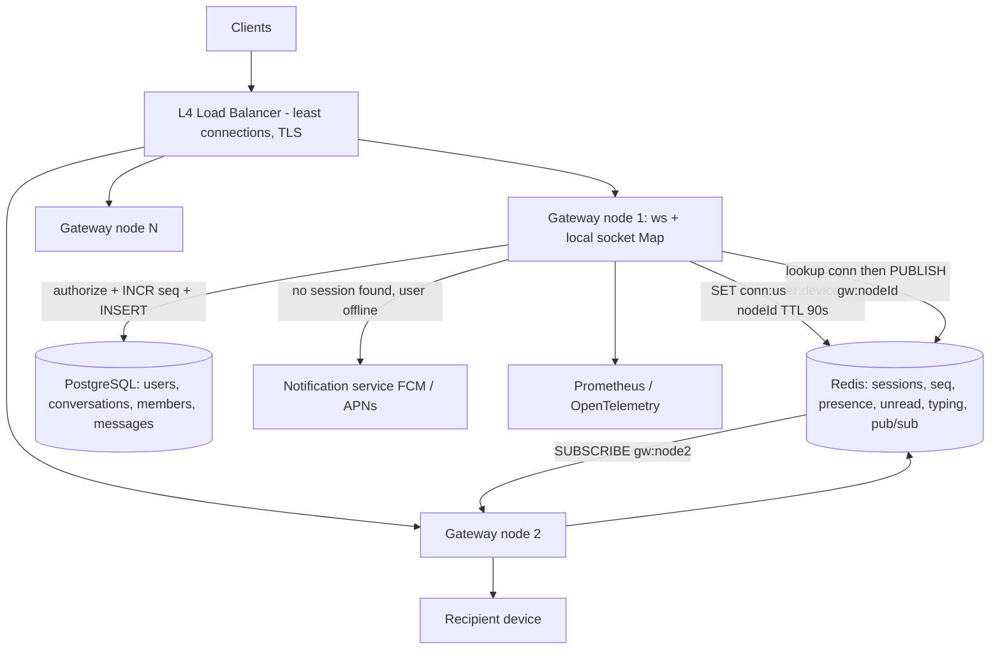
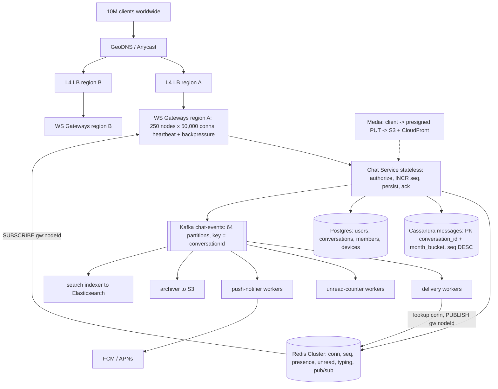

# Chat System -- HLD + LLD (Part 5: Trade-offs -> 3 Versions -> Follow-ups -> Node.js Questions)

> Is file mein prompt ke **Parts 21-25** hain: chat system ke har bade decision ka trade-off ("kyun ye, kyun woh nahi"), MVP -> Scalable -> Highly Scalable teen versions, 24 interviewer follow-up questions, 13 requirement-change ("What if...") questions, aur Node.js specific questions -- sab isi chat system ke numbers par.
> Part 4 recap: humne dekha ki 1x se 100x tak sabse pehle **connections aur memory** tootti hain (CPU nahi), ek gateway node marne par 50,000 clients ka **reconnect storm** kaise poore fleet ko gira sakta hai (full-jitter backoff + waves), aur consistency mein humne saaf bola ki **ordering per conversation strong hai, presence eventual hai, delivery at-least-once hai**. Security mein connect par JWT, har `send` par membership authorization, media presigned URL; observability mein North Star SLI `message_delivery_latency_seconds` (server accept -> recipient socket write) plus `ws_connections_active`, `ws_buffered_amount_bytes`, `slow_client_drops_total`, `kafka_consumer_lag{group}`.
> Part 6 mein: zero se ek chhota TypeScript chat server, 30-second answer, 5-minute answer, whiteboard drawing order, aur final cheat sheet.

Ek line mein hamara system yaad kar lo, kyunki Part 21 ka har answer isi par tika hai:

```
Client (mobile / web)
  |  WebSocket wss://, heartbeat 30 s, reconnect full-jitter, resume with lastSeq
  v
L4 Load Balancer (TCP/TLS, least-connections)
  v
WS Gateway nodes (250 x 50,000 conns, STATEFUL)
  |-- Redis session registry  conn:<userId>:<deviceId> = nodeId (TTL 90 s)
  |-- subscribe Redis Pub/Sub channel  gw:<nodeId>
  v
Chat Service (stateless) -- authorize -> INCR seq:<conversationId> -> persist -> ack 'sent'
  v
Kafka chat-events (64 partitions, key = conversationId)
  v
Delivery Workers -> session lookup -> PUBLISH gw:<nodeId>  |  offline -> Notification service (FCM/APNs)
  v
Recipient device -> 'delivered' receipt -> sender ko do tick
```

Numbers jo baar baar aayenge: **50M DAU, 10M concurrent connections, 2B messages/day (23,148 msg/sec avg, ~70,000 peak), 13.2B deliveries/day (~153,000/sec avg, ~460,000 peak), 50,000 connections per node x 250 nodes, ~20 KB per connection, 600 GB/day messages, 660 GB/day receipts (agar per-message store karein), 333,000 presence heartbeats/sec, group max 256, p95 delivery < 500 ms.**

---

## PART 21 -- Trade-offs: har decision ka "kyun ye, kyun woh nahi"

### Pehle rule samjho

Chat ke interview mein sabse common galti: "WebSocket use karenge" bol ke aage badh jaana. Interviewer ye sunna chahta hai:

```
Requirement kya hai  ->  Options kya hain  ->  Har option ki keemat kya hai  ->  Is requirement par kaunsi keemat chalegi
```

Hamari requirements yaad rakho: **server ko khud se client tak push karna hai, p95 < 500 ms, 10M concurrent connections, accepted message kabhi na khoye, per-conversation ordering strong, presence eventual chalegi.** Har table ke end mein **hamare system ka decision** hai.

### 1. WebSocket vs SSE vs Long polling vs Short polling vs Push-only

Ye is poore system ka pehla aur sabse bada decision hai, isliye ek hi table mein saare axes:

| | Short polling | Long polling | SSE (Server-Sent Events) | **WebSocket (hamara)** | Push-only (FCM/APNs) |
|---|---|---|---|---|---|
| **Direction** | Client -> server only (server jawab mein deta hai) | Client -> server, server ka reply "rok ke" | **Server -> client one-way**; client -> server ke liye alag HTTP call | **Full duplex** -- dono taraf, kabhi bhi | Server -> device only, aur woh bhi OS ke through |
| **Latency** | Poll interval jitna (2 s poll = avg 1 s lag) | Near real-time (~ms), par har message ke baad naya request setup | Near real-time; client -> server leg par HTTP overhead | **Sabse kam** -- connection pehle se khula, bas ek frame | Seconds se minutes; OS batch aur throttle karta hai |
| **Proxy / firewall friendliness** | Sabse zyada -- plain HTTP GET | Bahut achhi, par kuch proxies 30-60 s par request kaat dete hain | Achhi -- plain HTTP response stream, par buffering proxies (nginx `proxy_buffering on`) sab rok lete hain | Achhi, kyunki HTTP `Upgrade` se shuru hoti hai aur 443 par TLS ke andar hai; kuch corporate proxies phir bhi Upgrade block karte hain | N/A (OS ka apna channel) |
| **Mobile battery** | Sabse bura -- har poll radio jagaata hai | Bura -- baar baar naya request | Theek -- ek connection, par one-way | Achha *agar* heartbeat lamba ho; 30 s heartbeat par radio baar baar jaagta hai (ye asli cost hai) | **Sabse achha** -- OS ka ek shared connection sab apps ke liye |
| **Complexity** | Almost zero | Kam | Kam (`EventSource` browser mein built-in, auto reconnect + `Last-Event-ID`) | **Sabse zyada** -- stateful server, session registry, heartbeat, backpressure, reconnect + resume protocol | Kam for you, par delivery guarantee tumhare haath mein nahi |
| **Binary support** | Haan (HTTP body) | Haan | **Nahi** -- text only (UTF-8), binary ko base64 karna padega (+33%) | Haan -- text + binary frames | Payload chhota (~4 KB) |

**Hamare numbers par kya hota hai:**

- Short polling: 10M users x har 2 s = **5M requests/sec**, jisme 99% khaali jawab. 23K msg/sec ke system ke liye 5M rps ka infra -- ye bilkul bewakoofi hai. Aur phir bhi 2 second lag.
- Long polling: 10M open requests -- connections toh utne hi khule hain jitne WebSocket mein! Fayda kya mila? Bas ye ki har message par request cycle dobara chalti hai (headers, auth, logging middleware). 153K deliveries/sec x ~800 bytes headers = bekaar bandwidth.
- SSE: sirf ek taraf ka kaam karta hai. Chat mein client bhi bhejta hai (`send`, `receipt`, `typing`) -- toh SSE + POST ka jugaad banega, matlab **do** connections per user. 10M users = 10M SSE + POST traffic.
- WebSocket: ek connection, dono taraf, ek handshake, chhote frames (2-14 byte header).

**Decision:** "WebSocket, kyunki mera core requirement hi server-initiated push hai aur client bhi continuously bhejta hai (typing, receipts). SSE tab lunga jab traffic sach mein one-way ho -- live cricket score, stock ticker, order tracking, AI token streaming. Long polling ab bhi ek achha **fallback** hai un networks ke liye jahan Upgrade block hai."

> **Honest note (ye line interview mein badi lagti hai):** har "real-time" app ko socket nahi chahiye. Agar product sirf **notification-style** hai -- "order shipped", "someone liked your post", din mein 5-10 events, user ko turant chahiye bhi nahi -- toh **push-only (FCM/APNs) + app khulne par ek REST sync call** poora kaam kar deta hai, aur tumhara server stateless rehta hai. 10M sockets ka poora dard tab uthao jab (a) user actively screen dekh raha ho, (b) do-taraf ka traffic ho, (c) sub-second matter karta ho. Chat mein teeno sach hain, isliye socket. Notification system mein teeno sach nahi, isliye wahan socket **nahi** lagate.

### 2. Raw `ws` vs Socket.IO

| | Raw `ws` (hamari v3 choice) | Socket.IO |
|---|---|---|
| **Pros** | Bahut patla -- per connection sirf socket + thoda JS object (~20 KB with TLS buffers). 50,000 conns per node realistic. Protocol tumhara (hamara JSON frame spec). Koi hidden magic nahi -- debugging seedhi | **Built-in reconnect** with backoff, **fallback to HTTP long polling** jab Upgrade block ho, **rooms** (`io.to('conv:123').emit(...)`), acknowledgements callbacks, **Redis adapter** jo multi-node broadcast khud kar deta hai, client libraries har platform ke liye |
| **Cons** | Reconnect, backoff, heartbeat, rooms, multi-node routing -- **sab khud likhna** (yahi Part 2/3 ka LLD hai) | Per connection zyada memory aur CPU (engine.io session state, packet encoding layer, upgrade ke baad bhi polling session metadata). Apna protocol hai (`42["event",{...}]`), toh non-JS clients ko official client chahiye. Redis adapter har broadcast ko **har node** par bhejta hai (pub/sub fan-out), 250 nodes par ye waste hai |
| **Kab use karunga** | Jab connections lakhon mein hon aur per-connection memory hi bottleneck ho; jab protocol/versioning par poora control chahiye | **V1 aur V2 mein** -- jab connections hazaaron mein hain, team chhoti hai, aur reconnect/fallback khud likhna time waste hai. Startup ke pehle saal ke liye ye bilkul sahi choice hai |

**Decision:** "V1/V2 mein Socket.IO -- reconnect aur fallback free milte hain, aur 50,000 connections tak ye koi problem nahi. V3 mein raw `ws`, kyunki 250 nodes x 50,000 = memory per connection hi hamara cost driver ban jaata hai, aur Socket.IO ka Redis adapter broadcast model hamare targeted `gw:<nodeId>` routing se mehenga hai. Ye migration sasta nahi hai (client protocol badalta hai), isliye ise **planned** karna padta hai, achanak nahi."

### 3. Routing: Session registry + Redis Pub/Sub vs Consistent hashing vs Direct gRPC node-to-node

Problem ek hi hai: **user A ka message user B tak kaise pahunche jab B ka socket kisi doosre gateway node par pada hai.**

| | Broadcast to all nodes | Consistent hashing (user -> fixed node) | **Session registry + Redis Pub/Sub (hamara)** | Direct gRPC node-to-node |
|---|---|---|---|---|
| **Kaise** | Har delivery har node ko; jiske paas socket hai woh bhej de | `nodeId = hashRing(userId)`; LB bhi usi node par bhejta hai | Redis `conn:<userId>:<deviceId> = nodeId`; worker lookup karke sirf `gw:<nodeId>` par publish karta hai | Worker registry se nodeId nikaal ke us node ko seedha gRPC call |
| **Pros** | Zero lookup, zero state | Koi registry hi nahi -- lookup ek hash function hai, zero network. Deterministic | Ek Redis lookup (~0.3 ms) aur ek targeted publish. Node kahin bhi ho sakta hai, LB ko kuch pata nahi. Multi-device natural (`conn:*` ke multiple keys) | **Sabse kam latency** -- ek hop, Redis beech mein nahi. Backpressure aur delivery failure ka seedha signal milta hai |
| **Cons** | 460K deliveries/sec x 250 nodes = **115M messages/sec** pub/sub par. Bekaar. N^2 | Node add/remove par users ka **rebalance** -- un users ke sockets todne padenge (mass reconnect = wahi storm). Client ko us exact node par pahunchana LB ke liye mushkil (DNS/ip per node). Hot node ka koi ilaaj nahi | Redis ab critical path par hai; Redis Pub/Sub **fire and forget** hai (subscriber down = message gaya); registry stale ho sakti hai (node mara, TTL 90 s baaki hai) | Service discovery chahiye, mesh chahiye, 250 nodes x 250 nodes = **62,500 potential connections**; connection management khud ek project |
| **Kab use karunga** | Kabhi nahi (sirf jab nodes < 5 aur traffic khilona ho) | Jab node count sthir ho aur tum rebalance ka dard uthaa sakte ho | **Default** -- 250 nodes tak ye simple aur predictable hai | V3 optimization jab p99 delivery latency mein Redis hop dikhne lage, ya jab per-delivery Redis ops budget cross ho |

**Decision:** "Session registry + pub/sub, kyunki ye **routing ko LB se decouple** kar deta hai -- client kisi bhi node par land kare, hum use dhoond lenge. Stale registry ka ilaaj TTL 90 s + heartbeat refresh + disconnect par explicit `DEL` hai. gRPC V3 ka optimization hai (Redis hop bachta hai) par tab service mesh aur connection pooling ka kharcha uthana padega."

### 4. Redis Pub/Sub vs Redis Streams vs Kafka -- delivery fan-out ke liye

Dhyaan do: hamare design mein **dono** hain. Kafka `chat-events` (durable pipeline) aur Redis Pub/Sub `gw:<nodeId>` (last hop). Interviewer poochhega "ek hi kyun nahi?"

| | Redis Pub/Sub | Redis Streams | **Kafka (hamara pipeline)** |
|---|---|---|---|
| **Durability** | **Zero.** Subscriber offline = message gaya, koi trace nahi | Stream mein rehta hai (`XADD`), consumer group + `XACK`, pending entries list se retry | Disk par, replicated, retention (7 din), offset se replay |
| **Latency** | **Sabse kam** (~0.2-0.5 ms) | Kam (~0.5-1 ms), par `XREADGROUP` + `XACK` = zyada ops | ~2-10 ms (batching, acks) |
| **Ordering** | Per publisher, best effort | Per stream, strict | **Per partition strict** -- key `conversationId` se ek conversation ke saare messages ek partition mein, isliye order guaranteed |
| **Consumers** | Sab subscribers ko copy (fan-out) | Consumer group -> kaam bat-ta hai | Multiple **independent** consumer groups: `delivery`, `unread-counter`, `push-notifier`, `archiver` -- sab apne offset par |
| **Cons** | Fire and forget; Redis Cluster mein pub/sub sab nodes tak jaata hai (shard channels se hi bachta hai) | Trimming (`XTRIM`) khud manage karo warna memory phatti hai; Kafka jaisi retention/replay nahi | Ek aur bada system; 64 partitions ka ops; latency Redis se zyada |
| **Kab use karunga** | **Last hop** jahan message pehle se durable ho chuka hai aur receiver (gateway) live hai. Miss ho gaya toh client reconnect par `resume` se sync kar lega -- **yahi hamara safety net hai** | Chhota-medium scale, jab Kafka nahi chahiye par durability chahiye. V2 ke liye achha middle ground | **Pipeline** jahan multiple consumers chahiye, replay chahiye, aur ordering per conversation guarantee chahiye |

**Decision:** "Kafka durable spine ke liye, Redis Pub/Sub sirf last hop ke liye. Pub/Sub ka message kho jaana **acceptable** hai kyunki message pehle hi persist ho chuka hai aur client ka `resume` protocol usse pakad lega. Agar mere paas Kafka nahi hota (V2), main Redis Streams lunga -- kyunki wahan mujhe retry chahiye hoti hai."

> Key insight: **jo cheez pehle se durable store mein hai, uske transport ko durable hone ki zarurat nahi.** Chat ka asli safety net storage + `resume` hai, pub/sub nahi.

### 5. `messages` table ke liye: Postgres vs Cassandra vs DynamoDB vs MongoDB

| | Postgres (v1/v2) | **Cassandra / ScyllaDB (v3)** | DynamoDB | MongoDB |
|---|---|---|---|---|
| **Pros** | Ek hi DB mein users + members + messages; transactions; `ON CONFLICT` se idempotency free; joins se authorization query; sab jaante hain | Write-optimized (LSM tree), linear scale, `PRIMARY KEY ((conversation_id), seq)` + `CLUSTERING ORDER BY (seq DESC)` hamare exact read pattern se match; multi-DC replication built-in; TTL per row | Zero ops (managed), predictable latency, auto-scale, TTL, streams. `PK = conversationId`, `SK = seq` -- same shape | Flexible schema, sharding on `conversationId`, decent range scans, aggregation |
| **Cons** | Ek primary par write ceiling (~10-20K simple inserts/sec on good NVMe); 219 TB/year ek machine par nahi aata; vacuum + index bloat; sharding khud karna padega | **Koi join nahi, koi transaction nahi** (membership phir bhi Postgres mein); eventual consistency samajhni padti hai (`QUORUM` reads); wide partition problem; ops heavy (repair, compaction) | Cost item-writes par hai: 2B writes/day ka bill bada hota hai; 400 KB item limit; query flexibility kam; vendor lock-in | Write throughput Cassandra se kam; shard key galat chuna toh hotspot; large scale par ops Cassandra jitna hi mushkil, faayde kam |
| **Kab use karunga** | **Shuru mein hamesha** -- V1, V2, aur tab tak jab tak numbers na bolein | Jab numbers bolein (neeche) | Jab team chhoti ho aur AWS par ho, aur predictable per-request cost chal jaaye | Jab team already Mongo par hai aur scale medium hai |

**Switch trigger, numbers mein (ye poochha jaata hai):**

| Signal | Threshold | Hamara number |
|---|---|---|
| Sustained insert rate on one primary | > ~10,000 inserts/sec | **23,148/sec avg, 70,000 peak** -> cross |
| `messages` table size | > ~5-10 TB (backup, vacuum, restore sab dard ban jaate hain) | **600 GB/day -> 219 TB/year** -> cross |
| p99 insert latency | > 20 ms sustained | budget hi 500 ms end-to-end hai, DB ko 10 ms se kam chahiye |
| Restore time | > few hours | 219 TB restore = din -- unacceptable |

**Decision:** "V1 Postgres, aur main is par proud hoon -- ek DB mein sab, transactions, idempotency `ON CONFLICT`. Jab messages ka write rate ~10K/sec aur size ~10 TB cross kare, tab `messages` (aur sirf `messages`) Cassandra par jaata hai, kyunki woh **append-only, time-ordered, no-join** data hai -- Cassandra ka perfect shape. `users`, `conversations`, `conversation_members` Postgres mein hi rehte hain, kyunki wahan relational integrity aur authorization queries chahiye. Cassandra ka gotcha: ek bahut badi group ka poora itihaas ek partition mein -- isliye `PRIMARY KEY ((conversation_id, month_bucket), seq)`."

### 6. Store-once per conversation (fan-out on read) vs Per-recipient inbox (fan-out on write)

**Ye is system ka sabse important trade-off hai, aur yahi News Feed se ulta hai.**

| | **Store once per conversation (hamara)** | Per-recipient inbox (har member ki copy) |
|---|---|---|
| **Write cost** | 1 row per message = **2B rows/day, 600 GB/day** | 1 row per recipient = **13.2B rows/day, ~4 TB/day** (6.6x) |
| **Read cost** | Ek partition se range scan: `WHERE conversation_id = ? AND seq > ?` -- ek query, sorted | Har user ka apna inbox -- bhi ek query, aur "unread" seedha inbox se |
| **Delete for everyone** | Ek row update (`deleted_at`) -- **sab ko turant lagta hai** | 30 rows update karni padengi, aur kuch miss ho sakti hain |
| **Edit message** | Ek row | N rows |
| **Group size ka asar** | Zero -- 256 member group bhi 1 row | Linear -- 256 rows per message |
| **Kab use karunga** | Jab **recipients per item kam hon** (chat mein avg 30) aur read hamesha "us conversation ka" ho | Jab read pattern "mere saare sources ka merged stream" ho, aur read time par merge karna mehenga ho |

**News Feed se contrast (yahi interviewer sunna chahta hai):**

| | Chat | News Feed |
|---|---|---|
| Read query | "Ek conversation ke last 50 messages" -- **ek hi partition** | "Mere 500 followees ke latest posts, merged aur sorted" -- **500 partitions** |
| Fan-out size | avg 30, max 256 | avg 500 followers, celebrity par 100M |
| Isliye kya jeetta | **Fan-out on read** (store once) -- read already sasta hai, write ko 6.6x mat karo | **Fan-out on write** (push into each follower's timeline) -- warna har feed open par 500-way merge |
| Ulta case | Broadcast channel (1 lakh members) mein chat bhi feed jaisa ban jaata hai -> read-time fetch | Celebrity post par feed bhi chat jaisa ban jaata hai -> hybrid: pull celebrity posts at read time |

**Decision:** "Chat mein message **ek hi baar conversation ke against** store hota hai; jo cheez fan out hoti hai woh **delivery** hai (ek transient socket write), **storage** nahi. News Feed mein ulta -- wahan storage fan out hoti hai kyunki read ek 500-way merge hai. Dono jagah shabd 'fan-out' hai par matlab alag; ye farak pakadna hi is sawaal ka asli jawab hai."

### 7. Per-message receipt rows vs `last_read_seq` watermarks

| | Per-message receipt row (`message_receipts`) | **Watermark (`last_read_seq`, `last_delivered_seq`) -- hamara** |
|---|---|---|
| **Storage** | 13.2B deliveries/day x ~50 B = **660 GB/day** -- messages (600 GB/day) se **zyada**! 1 saal = 240 TB, x3 replication = 720 TB | Ek row per (conversation, user) -- 2 columns update. Chat kitna bhi ho, size **constant** |
| **Writes** | 153,000 receipt inserts/sec avg, 460,000 peak -- ek aur pura write pipeline | Har receipt = ek `UPDATE ... SET last_read_seq = GREATEST(last_read_seq, $1)` -- aur clients batch karke bhejte hain (10 messages padhe -> ek update) |
| **Kya kho jaata hai** | -- | "Kaunsa **exact** message kab deliver hua" ka history nahi bachta -- sirf "is seq tak sab ho gaya". Non-contiguous read (user ne beech ka message padha) express nahi hota | 
| **Group receipts** | Har member x har message = poora matrix | `last_read_seq >= seq` wale members gino -> "Read by 12 of 30" seedha nikal jaata hai |
| **Kab use karunga** | Jab compliance ya legal proof chahiye ki kis banda ne kis message ko kab dekha (enterprise/regulated); ya jab per-message analytics product feature ho | **Default** -- WhatsApp/Slack jaisa product behaviour isse poora ban jaata hai |

**Decision:** "Watermark. `conversation_members.last_read_seq` aur `last_delivered_seq` monotonic hain -- `GREATEST()` se out-of-order receipts bhi safe hain, aur unread count `last_message_seq - last_read_seq` se free mein mil jaata hai. 660 GB/day bachana ek single design decision se -- interview mein ye line bahut strong lagti hai. Agar product 'kis member ne kab padha' ka full matrix maange toh main us feature ko sirf **groups <= 256** ke liye aur **90 din retention** ke saath dunga, unlimited nahi."

### 8. JSON frames vs Protobuf / MessagePack

| | **JSON (hamara)** | Protobuf | MessagePack |
|---|---|---|---|
| **Size** | ~300 bytes typical frame (field names repeat hote hain) | ~40-50% chhota (field numbers, varint) | ~20-30% chhota (JSON jaisa model, binary encoding) |
| **CPU** | `JSON.parse`/`stringify` C++ mein hai aur bahut fast, par **synchronous aur blocking** | Encode/decode fast, par JS implementations ka overhead real hai | Fast, par JSON.parse se hamesha tez nahi (V8 bahut optimized hai) |
| **Debugging** | **Chrome DevTools mein frame khol ke padh lo** -- ye badi baat hai | Binary; tooling chahiye | Binary |
| **Schema evolution** | Koi schema nahi -- naya field add karna free, par galti bhi free | Strong: field numbers, `reserved`, backward compatible by design | Koi schema nahi |
| **Kab use karunga** | Default. Jab tak bandwidth bill ya mobile data complaint na aaye | Jab bandwidth sach mein bottleneck ho: 460K deliveries/sec x 150 bytes bachaye = ~70 MB/s bacha; ya jab typed contract cross-team zaroori ho | Jab minimum badlav mein size chahiye (drop-in, schema nahi) |

**Hamara number:** 460,000 deliveries/sec x 300 bytes = **~138 MB/sec** egress peak. Protobuf se ~60-70 MB/sec. Bandwidth bill ke hisaab se ye matter karta hai, par **development speed** shuruaat mein zyada matter karti hai.

**Decision:** "JSON, kyunki debuggability aur iteration speed chahiye aur `JSON.parse` sach mein fast hai. Optimization jo main **pehle** karunga woh encoding nahi hai: (1) frames chhote rakho (field names chhote), (2) `permessage-deflate` **soch samajh ke** -- ye CPU aur per-connection ~300 KB memory maangta hai, toh 50,000 connections par 15 GB! Isliye hum ise **off** rakhte hain. Protobuf tab jab bandwidth graph bole."

### 9. Stateful gateways (build) vs Fully managed service (buy)

Ye asli build-vs-buy baat hai, aur iska jawab **scale par palat jaata hai**.

| | **Apne gateway nodes (build)** | AWS API Gateway WebSocket | Ably / Pusher / PubNub |
|---|---|---|---|
| **Kya milta hai** | Poora control: memory per connection, backpressure policy, routing, close codes, protocol | Managed sockets; connection ko Lambda/HTTP backend se jodta hai; `@connections` API se push | Managed sockets + channels/rooms + presence + history + client SDKs + global edge |
| **Ops** | Tumhare paas 250 stateful nodes hain: deploy, drain, ulimit, OOM, reconnect storms. **Ek team chahiye** | Lambda concurrency, cold start, 29 s limits, payload limits | Lagbhag zero |
| **Cost (order of magnitude, list price, rough)** | 250 nodes x 8 GB ~ **$30-50K/month** socket tier ke liye | ~$1 per million connection-minutes + ~$1 per million messages. 10M conns x 43,200 min/month = **432,000 million connection-minutes = ~$430K/month**, plus 13.2B deliveries/day x 30 = ~396,000 million messages = **~$400K/month**. Total **~$800K+/month** | Peak-connection + message based; enterprise pricing par bhi 10M connections ka bill **6-7 figures/month** hota hai |
| **Kab use karunga** | Jab connections **~1M+** ho jaayein, ya jab protocol/latency par control product ka differentiator ho | **Chhote se medium** (10K-100K connections), serverless stack, team chhoti -- yahan ye clearly jeetta hai | Jab socket tumhara core product **nahi** hai (dashboard live updates, collaborative cursor, live scores) aur time-to-market matter karta hai |

**Break-even ka mental model:**

```
< 50K concurrent      -> buy. Ek engineer ki salary > pura managed bill.
50K - 500K            -> depends. Bill vs ek dedicated platform engineer ka cost compare karo.
> 1M concurrent       -> build. Managed bill itna hai ki poori team afford ho jaati hai.
```

**Decision:** "Hamare 10M connections par managed service ka bill hamare poore socket tier se **15-20x** mehenga hai, aur usme backpressure policy, close codes, ya per-connection memory par control bhi nahi milta. Isliye build. Lekin agar interviewer ne bola 'startup hai, 6 mahine mein launch karo' -- toh main **Ably/Pusher se shuru** karunga aur socket layer ko apne code mein ek interface ke peeche rakhunga, taaki baad mein swap ho sake. Ye bolna kamzori nahi, maturity hai."

### 10. E2EE (end-to-end encryption) vs Server-side plaintext

**Term:** *E2EE* matlab message sirf sender aur recipient ke devices par padha ja sakta hai -- server ke paas sirf encrypted blob hota hai, chaabi nahi.

| | **Server-side plaintext (hamara v1)** | E2EE (Signal protocol style) |
|---|---|---|
| **Kya milta hai** | Server-side search, server-side group fan-out of content, easy multi-device, spam/abuse moderation, rich previews, server-side backup/restore, compliance export | Server breach par bhi messages nahi padhe ja sakte; insider risk khatam; legal demands par "hamare paas hai hi nahi" |
| **Kya kho jaata hai** | Privacy guarantee -- server (aur uska admin, aur uska subpoena) sab padh sakta hai | **Server-side search** (index encrypted text par nahi ban sakta -> search device par, aur naye device par purana history searchable nahi). **Server-side group fan-out of content** (server content dekh nahi sakta; sender ko har recipient device ke liye alag encrypt karna padta hai -- 256 member group x 3 devices = 768 encryptions per message, sender ke phone par). **Multi-device** (har device ki apni identity key; naye device par purana history transfer karna alag protocol hai). **Moderation** (server spam/CSAM detect nahi kar sakta -> user reporting par shift). Link previews, server-side backups |
| **Kya nahi badalta** | -- | **Metadata phir bhi server ke paas hai**: kaun kisko, kab, kitna, kitni baar. Ye chhota nahi hai |
| **Kab use karunga** | Enterprise/team chat jahan compliance, eDiscovery, aur admin search product requirement hi hain (Slack ka default) | Consumer messaging jahan privacy hi product hai (WhatsApp, Signal) |

**Decision:** "V1 mein E2EE nahi -- aur ye kaayarta nahi hai, ye ek **product decision** hai: mujhe server-side search, easy multi-device, aur moderation chahiye. Agar privacy core requirement ban jaaye toh Part 24 #3 mein main poora migration path deta hoon. Beech ka raasta bhi hai jo log bhool jaate hain: **encryption at rest + strict access control + audit logs** -- ye server breach ka 80% risk bina E2EE ke dard ke kam kar deta hai."

### 11. Presence always-on (push) vs Presence on-demand (pull + subscribe)

| | Always-on push (sabko batao) | **On-demand (hamara)** |
|---|---|---|
| **Kaise** | User online hua -> uske saare contacts ko `presence` frame | `presence:<userId>` Redis key TTL 90 s (heartbeat se refresh). Client jo chat **abhi khuli hai** sirf unke liye poochhta/subscribe karta hai |
| **Cost** | 10M users x avg 200 contacts = **2B notifications per presence flip**. Aur log din mein 20-50 baar flip karte hain (metro, lift, network switch) -> arbon events | Chat list khuli = ~20 lookups; chat khuli = 1 subscribe. Redis `MGET presence:<a> presence:<b> ...` ek round trip |
| **Accuracy** | Near instant | **30-90 s tak stale** -- key expire hone par hi "offline" pata chalta hai |
| **Kab use karunga** | Chhoti team apps (Slack workspace mein 50 log) jahan contacts kam hain | Consumer scale jahan contact graph bada hai |

**Decision:** "On-demand + scoped subscribe. Aur main confidently bolunga: **presence eventual hai aur 30-90 s stale ho sakti hai -- 'last seen 2 minutes ago' ka matlab hi yahi hai.** Yaad rakho: presence heartbeats 333,000/sec hain jabki messages 23,000/sec -- **presence messaging se 14x mehenga hai.** Isliye presence ko throttle karo, scope karo, aur last-seen ko batch mein persist karo (har heartbeat par Postgres update = suicide)."

### 12. Sticky sessions (LB affinity) vs Session registry

| | Sticky sessions / session affinity | **Session registry (hamara)** |
|---|---|---|
| **Kaise** | LB cookie ya source-IP hash se user ko hamesha usi node par bhejta hai | LB jahan chahe bheje; node connect par Redis mein `conn:<userId>:<deviceId> = nodeId` likh deta hai |
| **Pros** | Reconnect par wahi node, wahi warm state; koi registry nahi | Node kabhi bhi mar sakta hai, deploy ho sakta hai, scale ho sakta hai -- client kisi bhi naye node par reconnect karega aur sab kaam karega. Multi-device natural. Node count badalne se kuch nahi tootta |
| **Cons** | Node restart/deploy par us node ke **saare** sessions ka state bekaar; affinity source-IP par ho toh ek NAT ke peeche wale saare log ek node par; scale-in par bade chunks migrate; aur ye **problem solve hi nahi karta** -- B ka socket phir bhi doosre node par ho sakta hai | Ek Redis dependency; stale entries (TTL se handle); ek extra lookup per delivery |
| **Kab use karunga** | Legacy apps jinke paas in-memory session hai aur shared store nahi | **Hamesha, is system mein** |

**Decision:** "Sticky sessions yahan **anti-pattern** hain -- woh routing problem ko solve nahi karte (message kisi aur user ko jaana hai, wapas usi user ko nahi), aur deploy/restart ko mushkil bana dete hain. Isliye LB par sirf **least-connections** (round-robin nahi, kyunki connections long-lived hain -- naya node round-robin par bhi khaali reh jaayega), aur routing ka jawab session registry deta hai."

### 13. Prompt ke generic pairs -- chat par kya lagta hai, kya nahi

| Pair | Chat par? | Decision |
|---|---|---|
| **SQL vs NoSQL** | Haan, aur jawab **dono** hai | `users`, `conversations`, `conversation_members` -> Postgres (relational, authorization, transactions). `messages` -> v1 Postgres, v3 Cassandra (append-only time series). "Ek hi DB sab ke liye" is scale par galat hai |
| **Sync vs Async** | Haan, aur ye line bahut zaroori hai | **Sync (client ruk ke wait karta hai):** authorize -> `INCR seq` -> persist -> `ack`. Yahi durability requirement hai. **Async (Kafka ke baad):** delivery fan-out, unread counters, push notifications, search indexing, archival. Sender ko recipients ka wait nahi karna chahiye |
| **Cache vs no cache** | Haan, selective | Cache: membership (`TTL 300 s` -- har send par authorization check), session registry (woh khud Redis hai), presence, unread. **Messages ko cache mat karo** -- read pattern already "last N by PK" hai jo DB ke liye sasta hai, aur cache invalidation (delete for everyone, edit) dard hai |
| **Kafka vs RabbitMQ** | Haan | Kafka, kyunki chahiye **per-key ordering** (`conversationId`), **multiple independent consumer groups** (delivery, unread, push, archive), aur **replay** (delivery worker ka bug -> offset reset). RabbitMQ per-message routing aur complex topologies mein better hai, par ordering + replay + multi-consumer fan-out par Kafka jeetta hai |
| **REST vs WebSocket** | Dono, aur ye batna important hai | **WebSocket:** send, receipt, typing, presence, incoming messages -- sab real-time. **REST:** conversation list, history scroll (`beforeSeq`), delta sync (`afterSeq`), create conversation, add member, media presign, health. Rule: jo cheez **server se bina poochhe aa sakti hai** woh socket par; jo **user ke action par ek baar** chahiye woh REST par (cacheable, retryable, debuggable) |
| **Polling vs WebSocket** | Solved in #1 | WebSocket; polling ke numbers upar hain |
| **UUID vs Snowflake** | Haan, aur ye **do alag cheezein** hain | `messageId` = **client-generated UUID v4** -> idempotency key (retry par duplicate nahi). `seq` = **server-assigned per-conversation integer** (`INCR seq:<conversationId>`) -> ordering + gap detection + delta sync. Snowflake tab jab globally sortable ID chahiye bina per-conversation counter ke -- hamein per-conversation ordering chahiye, global nahi, toh `INCR` simple aur sasta hai. **Timestamp se ordering kabhi nahi** -- client clocks jhoot bolti hain aur servers mein bhi skew hota hai; `createdAt` sirf display ke liye |

### Summary: ek table mein saare decisions

| Decision | Humne kya chuna | Kab badlenge |
|---|---|---|
| Transport | WebSocket | One-way traffic -> SSE; Upgrade blocked -> long-poll fallback; notification-style app -> push only |
| Library | Socket.IO (V1/V2) -> raw `ws` (V3) | Per-connection memory bottleneck bane tab |
| Routing | Session registry + Redis Pub/Sub | p99 mein Redis hop dikhe -> direct gRPC |
| Pipeline | Kafka (64 partitions, key `conversationId`) | Chhota scale -> Redis Streams |
| Last hop | Redis Pub/Sub `gw:<nodeId>` | -- (loss OK, `resume` safety net) |
| Message store | Postgres -> Cassandra | > ~10K inserts/sec ya > ~10 TB |
| Storage model | Store once per conversation | Broadcast channels (100K members) -> read-time fetch |
| Receipts | `last_read_seq` / `last_delivered_seq` watermarks | Compliance chahiye -> per-message rows, bounded retention |
| Encoding | JSON | Bandwidth bill bole -> protobuf |
| Gateways | Build (apne nodes) | < 100K connections -> buy (managed) |
| Encryption | Server-side plaintext + at-rest encryption | Privacy product requirement bane -> E2EE |
| Presence | On-demand + scoped subscribe, TTL 90 s | Chhoti team app -> push to all contacts |
| LB | Least-connections, **no** sticky | -- |

> Interview line: "Chat mein har decision do cheezon ke beech hai -- **latency/simplicity** aur **durability/control**. Mera requirement 'accepted message kabhi na khoye, par presence aur typing kho sakte hain' hai, isliye main durability sirf message path par kharch karta hoon aur baaki sab jagah sasta transient path leta hoon."

---

## PART 22 -- Minimum -> Scalable -> Highly Scalable (3 versions)

Interviewer 3 versions isliye maangta hai taaki dekhe ki tum **Day 1 par Kafka + Cassandra + 250 nodes nahi laga doge**, aur tumhe pata hai ki **kaunsa metric** tumhe agle version par le jaayega.

### Version 1 -- Simple MVP (ek Node process, `ws`, in-memory Map, Postgres)

```
Browser / App
  |  wss://
  v
+-------------------------------------------------------------+
|  ONE Node.js process                                        |
|                                                             |
|   ws.Server  -->  connections: Map<userId, Set<WebSocket>>  |  <-- yahi "session registry" hai
|                                                             |
|   on 'send' -> authorize -> seq++ -> INSERT -> ack          |
|             -> members nikalo -> Map se sockets -> write    |
+-------------------------------------------------------------+
  |
  v
PostgreSQL (users, conversations, conversation_members, messages)
```

Asli code shape jo interview mein draw karna hai -- poora "routing layer" bas itna hai:

```ts
// v1: ek process, isliye session registry ek Map hai. Ye jugaad NAHI hai -- ek process par
// yahi correct design hai, kyunki "kaun kahan juda hai" ka jawab isi process ke paas hai.
const connections = new Map<string, Set<WebSocket>>();   // userId -> uske devices ke sockets

function register(userId: string, ws: WebSocket) {
  let set = connections.get(userId);
  if (!set) { set = new Set(); connections.set(userId, set); }
  set.add(ws);
  ws.once("close", () => {                 // <-- ye line bhoolna = memory leak (Part 25 Q12)
    set.delete(ws);
    if (set.size === 0) connections.delete(userId);
  });
}

function deliver(userId: string, frame: ServerFrame): boolean {
  const set = connections.get(userId);
  if (!set || set.size === 0) return false;              // offline -> push notification path
  const payload = JSON.stringify(frame);                 // ek baar stringify, sab devices ko wahi
  for (const ws of set) if (ws.readyState === WebSocket.OPEN) ws.send(payload);
  return true;
}
```

**Code Explanation:**

- `connections` ek `Map<userId, Set<WebSocket>>` hai -- `Set` isliye ki ek user ke multiple devices (phone + web) ho sakte hain. Ye V3 wali Redis key `conn:<userId>:<deviceId> -> nodeId` ka chhota bhai hai.
- `register()` auth ke baad chalta hai. `ws.once("close", ...)` mein cleanup -- **ye chhoot gaya toh har disconnect ek dead socket object memory mein chhod jaayega** aur process kuch ghanton mein OOM ho jaayega. Ye V1 ka classic bug hai (Part 25 Q12 mein bug + fix dono).
- `set.size === 0` par `connections.delete(userId)` -- warna khaali `Set` objects jama hote rahenge (slow leak).
- `deliver()` mein `JSON.stringify` **ek baar** -- har socket ke liye alag stringify karna teen guna CPU waste hai.
- `readyState === OPEN` check -- closing/closed socket par `send()` throw karta hai ya chupchap drop.
- Yahan koi network hop nahi: message aate hi recipient ko `deliver()`. **Latency ~1 ms.** V3 mein yahi kaam Kafka + worker + Redis publish se hota hai aur ~50 ms leta hai. Ye honest trade hai: simplicity vs scale.

**Kitna traffic sambhalta hai (honest number):** ek 4-core, 8 GB box par `ws` ke saath (`permessage-deflate` off, `ulimit -n` badha hua) **~5,000-20,000 concurrent connections** realistic hain. 10,000 x ~20 KB = ~200 MB sirf sockets ke liye -- aaram se. Message rate kuch hazaar msg/sec.

**Aur ye V1 galat nahi hai -- ye correct pehla build hai.** Kisi bhi chat product ke pehle mahine isi par nikalte hain. Interview mein seedha Kafka se shuru karna red flag hai.

- **Kya jaan-boojh ke NAHI hai:** Redis (ek process mein registry Map hi hai), Kafka (delivery synchronous hai), Cassandra (Postgres mein karodon messages aaram se), load balancer (ek node hai), presence service (Map se hi pata hai kaun online hai).
- **Rough monthly cost:** ek app server + ek managed Postgres -> **order of magnitude: $100-300/month**.
- **Kya abhi bhi missing hai:** HA bilkul nahi (process gira = app down), deploy = sab disconnect, offline push notification, media pipeline, backpressure handling, delta-sync protocol.

**Exactly kya tootta hai jab doosra node aata hai (chahe sirf HA ke liye ho):**

| Problem | Kyun |
|---|---|
| **Message deliver hi nahi hota** | A node-1 par hai, B node-2 par. node-1 ke `connections` Map mein B hai hi nahi -> `deliver()` `false` -> B ko live message nahi milega (reconnect par sync se milega, par "real-time chat" khatam) |
| **Presence jhooth bolti hai** | Har node ko sirf apne connected users dikhte hain -> "B offline hai" galat |
| **Typing indicator kabhi nahi dikhta** | Wahi routing problem, aur typing persist bhi nahi hoti toh recover bhi nahi hoti |
| **`seq` race** | Do nodes ek hi conversation par `MAX(seq)+1` karein -> duplicate seq -> do messages ek hi slot par. Isliye `INCR seq:<conversationId>` Redis mein chahiye |
| **Deploy = total outage** | Ek hi process -- restart par saare sockets toot-te hain aur sab ek saath reconnect (mini storm) |

**Next version par kab jaayenge? (signals)**

| Metric | Threshold (rough) | Matlab |
|---|---|---|
| Nodes | > 1 (HA ke liye bhi zaroori) | In-memory Map ab galat hai -> shared session registry |
| `ws_connections_active` | > ~10,000 per process | Memory aur file descriptor limits paas aa rahi hain |
| Event loop lag p99 | > 50 ms | Ek process sockets + fan-out + JSON sab kar raha hai |
| "Message late aaya" complaints | koi bhi | Delivery DB ke saath synchronously bandhi hui hai |

### Version 2 -- Scalable (multiple gateways + Redis session registry + pub/sub)



- **Kitna traffic?** ~10-25 gateway nodes x 20,000-50,000 connections = **~200K-1M concurrent connections**, ~5-10K msg/sec. Ek Redis primary (+ replica) 50-100K ops/sec deta hai; Postgres 5-10K inserts/sec.
- **Har naya component -- "humne ye abhi kyun add kiya?"**
  - **L4 Load Balancer, least-connections (round-robin NAHI)** -- connections yahan **long-lived** hain. Round-robin naye connections barabar baant-ta hai, toh naya node utne hi naye connections paata hai jitne purane bhare hue nodes -- woh kabhi catch up nahi karega. Least-connections se naya node tezi se bharta hai. L4 (TCP passthrough) isliye ki L7 proxy har frame ko chhoo kar overhead badhata hai.
  - **Redis session registry `conn:<userId>:<deviceId> = nodeId` (TTL 90 s)** -- V1 ka Map ab poore fleet ke liye chahiye. TTL heartbeat (30 s) ka 3x rakha hai taaki normal jitter par entry na ude; disconnect par explicit `DEL` bhi.
  - **Redis Pub/Sub `gw:<nodeId>`** -- har gateway sirf **apne ek** channel ko subscribe karta hai, aur delivery sirf us node ko publish hoti hai. Isliye pub/sub traffic = deliveries, na ki deliveries x nodes.
  - **Redis `INCR seq:<conversationId>`** -- per-conversation monotonic sequence, ab jab kai nodes likh rahe hain. Redis wipe ho toh `conversations.last_message_seq` se rebuild. **Gap acceptable hai, reuse kabhi nahi.**
  - **`presence:<userId>` (TTL 90 s) aur `unread:<userId>:<conversationId>`** -- presence ab kisi ek node ko nahi pata; unread har device ke liye chahiye.
  - **Notification service call** -- registry mein entry nahi mili = user offline = push bhejo. Ye hamara purana Notification system hai, dobara nahi bana rahe.
  - **Metrics** -- `ws_connections_active{node}`, `message_delivery_latency_seconds`, `ws_disconnect_total{reason}`.
- **Kaunsa dard is version par le aaya:** "doosre node wale user ko message nahi pahunchta" (routing), "deploy par sab disconnect" (ab ek-ek node drain karo), "duplicate seq" (Redis INCR), "offline user ko kuch pata hi nahi chalta" (push).
- **Delivery path abhi bhi seedha hai:** chat service persist karke khud members ka lookup karke publish kar deta hai. **Koi Kafka nahi.** Iska matlab: bada group bhejne par fan-out sender ke `ack` ko slow kar sakta hai -- isliye kam se kam `ack` pehle bhejo, fan-out uske baad.
- **Rough monthly cost:** ~15-25 app nodes + Redis (primary + replica) + managed Postgres (+ replica) + LB + egress -> **order of magnitude: $3K-10K/month**.
- **Kya abhi bhi NAHI hai:** Kafka aur delivery workers, Cassandra, multi-region, search index, S3 archival, sophisticated backpressure.

**Next version par kab jaayenge? (signals)**

| Metric | Threshold (rough) | Matlab |
|---|---|---|
| `ws_connections_active` total | > ~1M | 25+ nodes; ek node ka failure ab 50K clients ka storm hai -> drain in waves + jitter |
| Postgres `messages` insert rate | > ~10,000/sec sustained | Cassandra ka time |
| `messages` table size | > ~5-10 TB | Backup, restore, vacuum ab operational risk hain |
| `fanout_size` p99 vs send latency | Bade group par sender ka ack slow | Fan-out async karo -> Kafka + delivery workers |
| Naye consumers ki demand | Search index, analytics, archival, unread worker | Ek event stream, multiple independent consumers -> Kafka |
| Replay ki zarurat | "Delivery worker ka bug tha, kal ke events dobara process karo" | Kafka offsets |
| p95 latency by region | Doosre continent se > 500 ms | Multi-region |

### Version 3 -- Highly Scalable (full spec: Kafka, delivery workers, Cassandra, multi-region)



- **Kitna traffic?** Poore spec ke numbers: **10M concurrent connections, 70,000 msg/sec peak, 460,000 deliveries/sec peak, 600 GB/day messages, 30 TB/day media.**
- **Har naya component -- "humne ye abhi kyun add kiya?"**
  - **Chat Service gateways se alag (stateless)** -- gateway ka kaam ab sirf **sockets sambhalna** hai (memory-bound), business logic CPU-bound hai. Alag karne se dono alag scale karte hain, aur business logic deploy karne ke liye 10M sockets todne ki zarurat nahi padti. **Ye V3 ka sabse under-rated decision hai.**
  - **Kafka `chat-events` (64 partitions, key `conversationId`)** -- fan-out ab sender ke `ack` se poori tarah alag. Key `conversationId` isliye ki ek conversation ke saare messages **ek hi partition** mein jaayein -> per-conversation ordering worker level par bhi bani rahe. 64 partitions = ek group mein 64 tak parallel consumers.
  - **Delivery workers (consumer group `delivery`)** -- members -> devices -> har device ka `conn:` lookup -> `PUBLISH gw:<nodeId>`. Ye 460K/sec ka kaam hai; gateway par rakhte toh gateway ka event loop mar jaata.
  - **Alag consumer groups (`unread-counter`, `push-notifier`, `archiver`, search indexer)** -- har ek apne offset par; ek slow ho toh baaki nahi rukte. Yahi Kafka ka asli fayda hai.
  - **Cassandra for `messages`** -- 219 TB/year (x3 replication = 657 TB) Postgres par nahi aata. `PRIMARY KEY ((conversation_id, month_bucket), seq) WITH CLUSTERING ORDER BY (seq DESC)` -- "last 50 messages" aur "seq > X" dono ek partition ka range scan hain. `month_bucket` isliye ki ek bahut purani badi group ka fat partition na bane.
  - **Redis Cluster** -- ab keys crore mein hain (10M `conn:` + 10M `presence:` + unread) aur ops 460K+/sec. Gotcha: Cluster mein plain Pub/Sub har node tak jaata hai -- isliye **sharded pub/sub (`SSUBSCRIBE`/`SPUBLISH`)** use karo ya pub/sub ke liye alag Redis fleet rakho.
  - **S3 + CloudFront for media** -- 30 TB/day gateways se **bilkul nahi** guzarta; client presigned URL se seedha S3 par daalta hai, message mein sirf `mediaKey`.
  - **Multi-region** -- har region ke apne gateways aur apna Redis (sessions region-local hain), Kafka cross-region mirroring. Sabse saaf model: **conversation ka ek home region** jahan `seq` assign hota hai, taaki ordering ek jagah decide ho; baaki regions delivery endpoints ki tarah kaam karte hain. Cross-region delivery = extra ~80-150 ms, isliye "dono users same region" wala common case fast rehta hai.
- **Kaunsa dard is version par le aaya:** bade group par sender ka ack slow (fan-out sync tha), Postgres ka write ceiling aur restore time, ek hi event ke kai consumers ki demand, 50K sockets ka reconnect storm, aur global users ki latency.
- **Rough monthly cost (order of magnitude, motta andaaza):**

| Cheez | Rough |
|---|---|
| 250 gateway nodes (8 GB) | ~$30-50K |
| Chat service + workers (~200 nodes) | ~$25-40K |
| Redis Cluster (sessions/presence/unread) | ~$50-100K |
| Kafka (64 partitions, RF 3, high throughput) | ~$40-80K |
| Cassandra (657 TB with replication) | ~$200-400K |
| S3 (30 TB/day growth) + CDN + egress | ~$100K+ aur har mahine badhta hua |
| **Total order of magnitude** | **~$0.5M-1M+ per month** |

  Comparison ke liye: wahi 10M connections ek managed WebSocket service par sirf **socket + message billing** mein hi ~$800K/month le lete hain, aur usme storage, Kafka, Cassandra kuch bhi nahi hai. **Isi liye is scale par build karte hain.**
- **Kya abhi bhi missing hai (honest list):** E2EE, poora search UX (index hai, par ranking + permissions apna project hai), voice/video calls (WebRTC signalling -- Part 24 #5), compliance retention/export pipeline, active-active multi-region jahan ek conversation do regions mein likhi ja sake, aur bots/webhooks platform.

### Concurrent connections -> kaunsa version

| Concurrent connections | Version | Kya chahiye |
|---|---|---|
| < 5,000 | **V1** | Ek Node process, `ws`, in-memory `Map`, Postgres. Bas. |
| 5,000 - 50,000 | **V1.5** | 2-3 nodes + Redis session registry + pub/sub. Kafka abhi bhi nahi. |
| 50,000 - 1M | **V2** | 10-25 gateways, Redis Cluster, alag stateless chat service, Postgres partitioning |
| 1M - 10M | **V3** | Kafka + delivery workers + Cassandra + proper backpressure + drain in waves |
| > 10M / global | **V3 + multi-region** | Region-local sessions, conversation home region, Kafka mirroring, GeoDNS |

### Teeno versions side by side

| | V1 MVP | V2 Scalable | V3 Highly Scalable |
|---|---|---|---|
| Connections | ~5-20K (ek process) | ~200K-1M | 10M |
| Routing | In-memory `Map` | Redis registry + Pub/Sub | Same + sharded pub/sub (ya direct gRPC) |
| Fan-out | Synchronous, inline | Synchronous, ack pehle | Kafka -> delivery workers (async) |
| Message store | Postgres | Postgres (+ replica, partitioning) | Cassandra (Postgres for metadata) |
| Seq | `MAX(seq)+1` in a transaction | Redis `INCR` | Redis Cluster `INCR` |
| Presence | Map se free | Redis TTL 90 s | Same + throttle + batched last-seen |
| Offline | (kuch nahi) | Push notification | Kafka `push-notifier` group |
| Media | (mat karo: DB mein base64) | S3 presigned | S3 + CloudFront, 30 TB/day |
| Library | `ws` ya Socket.IO | Socket.IO | raw `ws` |
| Cost order | ~$100s | ~$1000s | ~$1M/month |

> Interview line: "Ek process par in-memory `Map` bilkul sahi session registry hai. Doosra node aate hi routing ek asli problem ban jaati hai -- wahi Redis registry ka signal hai. Kafka tab jab fan-out sender ke ack ko slow kare ya multiple consumers chahiye hon. Cassandra tab jab Postgres ka write rate ya table size bole. Main components **signals** par add karta hoon, shauk par nahi."

---

## PART 23 -- Interview Follow-up Questions (24)

> Tip: har answer mein teen cheezein -- **seedha answer, reason, aur end mein trade-off wali line**. Numbers hamesha hamare design ke.

### Scaling connections

**1. Interviewer:** "10M concurrent connections. Kitne servers, aur ye number kaise nikala?"

**My Answer:** "Main connections se shuru karta hoon, CPU se nahi. Ek gateway node par ~50,000 connections rakhta hoon -- per connection ~20 KB (kernel socket buffers + TLS state + JS object), toh 50,000 x 20 KB = **~1 GB sirf connections ke liye**; node ko 8 GB doonga taaki message buffers, GC headroom aur spikes ke liye jagah rahe. 10M / 50,000 = **200 nodes**, aur headroom + ek AZ girne ki gunjaish ke liye **250**. Har node par `ulimit -n` kam se kam 200,000 -- default 1024 par server 1024 connections ke baad hi mar jaata hai. Trade-off: node par zyada connections thoonso toh cost girti hai par ek node ke marne ka blast radius badhta hai -- 50,000 mera blast radius ka comfortable number hai."

**2. Interviewer:** "Ek box par 50,000 nahi, 500,000 connections kyun nahi? Exactly kya rok raha hai?"

**My Answer:** "Teen cheezein rokti hain, aur CPU unme nahi hai. (1) **Memory** -- 500K x 20 KB = 10 GB sirf sockets; kernel buffers alag se. (2) **File descriptors aur ephemeral ports** -- har connection ek FD hai; `ulimit -n`, `fs.file-max`, aur agar node outbound bhi karta hai toh ~28K ephemeral ports per destination IP. (3) **Single event loop** -- 500K sockets ka matlab ek tick mein bahut saare socket events; ek bhi synchronous kaam (bada `JSON.stringify`) sab ko rok deta hai, aur GC pause bhi 500K clients ko ek saath chubhta hai. Iske upar **blast radius**: ek node gira toh 500,000 log ek saath reconnect karenge. Trade-off: uWebSockets.js par per-connection memory kai guna kam hai toh 200K+ possible hai, par blast radius wali baat phir bhi bani rehti hai."

**3. Interviewer:** "Naya gateway node add kiya, par uspar traffic hi nahi aa raha. Kyun?"

**My Answer:** "Kyunki connections long-lived hain. Load balancer agar **round-robin** par hai toh woh sirf **naye** connections baant-ta hai -- purane nodes par jo 50,000 pehle se baithe hain woh hilte nahi, toh naya node bharne mein ghante lagenge. Fix: **least-connections** balancing, taaki naya connection hamesha sabse khaali node ko mile. Aggressive chahiye toh **connection max-age** (har socket ko 4-6 ghante baad polite close code ke saath band karo, client jitter ke saath reconnect kare) -- isse fleet dheere dheere rebalance hota rehta hai. Trade-off: max-age se background mein constant reconnect churn rehta hai, isliye jitter aur waves zaroori hain."

### Routing

**4. Interviewer:** "User A ne message bheja. B ka socket kisi aur node par hai. Poora raasta batao."

**My Answer:** "A ka frame uske gateway par aaya. Gateway chat service ko deta hai: membership check (Redis cache, miss par Postgres), `INCR seq:<conversationId>`, message persist, phir A ko `ack` (yahi 'sent' tick hai). Uske baad event Kafka `chat-events` par (key `conversationId`). Delivery worker use uthata hai, conversation ke members nikalta hai, har member ke devices nikalta hai, har device ke liye Redis se `conn:<userId>:<deviceId>` padhta hai -> `nodeId` milta hai -> `PUBLISH gw:<nodeId>` karta hai. Wo gateway apne subscription par frame paata hai, apne local Map se socket uthata hai, aur `ws.send()` kar deta hai. Session nahi mili toh user offline hai -> push notification. Trade-off: Redis ek extra hop hai (~0.5 ms), lekin isi ki wajah se LB ko routing ka kuch pata rakhne ki zarurat nahi."

**5. Interviewer:** "Session registry mein entry stale ho gayi -- node mar gaya par key TTL 90 s tak zinda hai. Message ka kya hoga?"

**My Answer:** "Delivery worker us dead node ke channel par publish karega aur woh message **gir jaayega** -- kyunki Redis Pub/Sub fire-and-forget hai. Aur ye **theek hai**, kyunki message already persist ho chuka hai: client jab naye node par reconnect karega toh `resume` frame mein `lastSeqByConversation` bhejega aur hum `seq > lastSeq` wale saare messages bhej denge. Fir bhi hum stale window chhoti rakhte hain: graceful shutdown par node khud `DEL conn:*` karta hai, aur TTL 90 s hai jo 30 s heartbeat se refresh hoti rehti hai. Trade-off: durable last hop (Redis Streams / Kafka per node) lagane se ye drop bach jaata, par har delivery mehengi ho jaati -- aur `resume` protocol toh phir bhi chahiye hi, toh usi ko safety net maan lena sasta hai."

### Ordering

**6. Interviewer:** "Do log ek hi second mein message bhejte hain. Ordering kaise guarantee karoge, aur kya sab ko same order dikhega?"

**My Answer:** "Order ka faisla ek jagah hota hai: `INCR seq:<conversationId>` -- Redis single-threaded hai, toh do concurrent sends ko 41 aur 42 milta hai, dono ko kabhi ek hi number nahi. Sab clients messages ko `seq` se sort karke dikhate hain, isliye **har device par same order**. Timestamps ordering ke liye kabhi nahi use karte -- client ki clock user badal sakta hai aur do servers mein bhi skew hota hai; `createdAt` sirf display ke liye hai. Aur pipeline mein ordering bachi rehti hai kyunki Kafka key `conversationId` hai, toh ek conversation ke events ek hi partition mein hain. Trade-off: mujhe sirf **per-conversation** ordering chahiye, global nahi -- global ordering ke liye ek central sequencer chahiye hota jo scale nahi karta."

**7. Interviewer:** "Client ko seq 41 aur 43 mila, 42 kahan gaya?"

**My Answer:** "Client gap detect karta hai (`seq_gap_detected_total` metric bhi isi par hai) aur `GET /api/v1/conversations/:id/messages?afterSeq=41` maar ke missing bhar leta hai. Gap ke do kaaran ho sakte hain: (a) 42 ka delivery frame kho gaya (pub/sub drop) -- sync se mil jaayega; (b) `INCR` toh hua par persist fail ho gaya -- toh 42 ka koi message hai hi nahi, aur ye **allowed** hai: **sequence mein gap acceptable hai, reuse kabhi nahi.** Isliye client ko gap par hamesha ek baar server se poochhna chahiye, phir aage badh jaana chahiye -- warna ek permanent gap client ko hamesha ke liye atka dega. Trade-off: gap-free sequence chahiye toh seq allocation aur persist ek hi transaction mein karni padegi (Postgres sequence), jo Redis `INCR` se dhima hai."

### Duplicates

**8. Interviewer:** "Client ne network timeout par message do baar bhej diya. Do baar dikhega?"

**My Answer:** "Nahi. `messageId` **client-generated UUID v4** hai aur wahi hamari idempotency key hai. Server par `messages` mein `UNIQUE (conversation_id, message_id)` hai -- doosra insert conflict karega, hum us conflict par **purani row ka `seq` padh ke wahi `ack` wapas** bhej dete hain, naya message nahi banate. Client side par bhi dedup hai: render se pehle `messageId` check. Isi liye hum honestly bolte hain ki hamari delivery **at-least-once + client-side dedup** hai -- network par exactly-once possible hi nahi hai. Trade-off: duplicate dikh jaana galat par recoverable hai; message kho jaana recoverable nahi -- isliye hum hamesha duplicate ki taraf jhukte hain."

### Offline delivery

**9. Interviewer:** "Recipient offline hai. Kya hota hai, aur push notification kaun bhejta hai?"

**My Answer:** "Delivery worker ko `conn:<userId>:<deviceId>` par kuch nahi milta -- matlab koi live session nahi. Message toh already store ho chuka hai, toh ab bas notify karna hai: `push-notifier` consumer group event uthata hai, `devices` table se us user ke push tokens leta hai, aur hamare purane **Notification system** ko call karta hai (FCM/APNs) -- hum woh system dobara nahi bana rahe. Jab user app kholta hai, socket connect hota hai aur `resume` frame se `afterSeq` delta sync ho jaata hai. Do dhyaan ki baatein: muted conversations ke liye push skip, aur group mein 30 messages aane par 30 push nahi -- coalesce karke '5 new messages' bhejo. Trade-off: push OS ke haath mein hai, uski delivery guaranteed nahi -- isliye reconnect-sync hi asli guarantee hai, push sirf ek nudge hai."

**10. Interviewer:** "User 3 din baad app kholta hai aur uske paas 2,000 unread messages hain. Socket par sab ek saath bhej doge?"

**My Answer:** "Nahi -- 2,000 frames ek saath bhejna client ka socket buffer bhar dega aur mera backpressure rule (`bufferedAmount > 1 MB`) usi ko drop kar dega, jo ek loop ban jaayega. Initial sync REST se hota hai: `GET /api/v1/conversations` (list + unread counts) aur phir jo chat khuli hai uske liye `?afterSeq=...&limit=50` -- **pages mein, keyset pagination se**, offset kabhi nahi. Socket sirf **ab se aage** ke live messages ke liye hai. Trade-off: do raaste (REST history + socket live) maintain karna padta hai, par isi se sync ka bada kaam socket ke real-time path se alag rehta hai."

### Multi-device

**11. Interviewer:** "User ke paas phone aur laptop dono khule hain. Message dono par kaise, aur read receipt ka kya?"

**My Answer:** "Session registry ki key hi `conn:<userId>:<deviceId>` hai, toh ek user ke multiple entries hoti hain -- delivery worker sabhi devices ke liye lookup karta hai aur har device ke gateway par publish karta hai. Sender ke apne dusre devices ko bhi apna hi bheja hua message milta hai (**self-echo**), taaki laptop par likha message phone par bhi dikhe. Read receipt user-level hai, device-level nahi: `conversation_members.last_read_seq` ek hi row hai, toh phone par padha toh laptop ka badge bhi saaf ho jaata hai -- iske liye hum `read` event ko user ke **baaki devices** ko bhi echo karte hain. Trade-off: fan-out ab devices se multiply hota hai (3 devices = 3x deliveries), isliye per-user device limit (e.g. 5 active) rakhni padti hai."

### Group size

**12. Interviewer:** "Group limit 256 kyun? 10,000 kyun nahi?"

**My Answer:** "Do cheezein phat-ti hain. (1) **Fan-out:** 10,000 members ka ek message = 10,000 deliveries; agar aise 100 groups active hon aur har ek mein 1 msg/sec ho toh 1M deliveries/sec ek hi feature se. (2) **Receipts:** har member ka `delivered`/`read` wapas sender tak -- ek message par 10,000 receipt events, aur UI 'read by 9,842' dikhaane ke liye poora matrix maangega. 256 par avg group 30 hai aur hamara amplification 6.6x rehta hai (13.2B deliveries/day) -- ye handle ho jaata hai. Trade-off: bade groups ke liye alag product hi chahiye -- broadcast channel, jahan (a) sirf admins likhte hain, (b) receipts off hote hain, (c) delivery push ki jagah pull/read-time hoti hai. Ye Part 24 #2 mein detail mein hai."

### Receipts at scale

**13. Interviewer:** "Read receipts sabse zyada traffic banate hain. Kaise sambhaloge?"

**My Answer:** "Teen cheezein. (1) **Store watermark, rows nahi** -- `last_read_seq` aur `last_delivered_seq` per (conversation, user). Per-message receipt rows 13.2B/day x 50 B = **660 GB/day** hote, jo messages ke 600 GB/day se bhi zyada hai. (2) **Client par batch** -- user ne 20 messages padhe toh ek hi receipt frame `seq = highest`; monotonic hai toh `GREATEST()` se apply hota hai aur out-of-order bhi safe hai. (3) **Receipts ko message path se sasta rakho** -- receipt ka apna ack nahi, retry nahi, aur group mein sender ko aggregate bhejo ('read by 12 of 30') na ki 30 alag events. Trade-off: exact 'kisne kab padha' history nahi bachti -- agar compliance ko chahiye toh per-message rows sirf enterprise plan par aur 90 din retention ke saath."

### Presence

**14. Interviewer:** "Presence sabse mehenga hissa kyun hai? Numbers do."

**My Answer:** "10M connections x har 30 s ek heartbeat = **333,000 heartbeats/sec** -- ye hamare message traffic (23,000/sec) se **14x zyada** hai. Aur agar har presence flip par uske saare contacts ko batayein toh 10M x avg 200 contacts = **2B notifications per flip**, jabki log din mein darjanon baar flip karte hain (lift, metro, wifi-to-4G). Isliye: presence Redis key `presence:<userId>` TTL 90 s hai (heartbeat refresh, expire = offline), notify sirf un logon ko jinki **chat abhi khuli hai**, aur `last_seen_at` ko Postgres mein batch mein likhte hain -- har heartbeat par DB update suicide hai. Trade-off: presence 30-90 s stale ho sakti hai, aur main ye confidently bolta hoon -- 'last seen 2 minutes ago' ka matlab hi yahi hai."

**15. Interviewer:** "Typing indicator ka kya plan hai?"

**My Answer:** "Typing sabse sasta aur sabse 'lapar' feature hai: **kabhi persist nahi, kabhi retry nahi, koi guarantee nahi.** Client 3 second ka throttle rakhta hai (har keystroke par frame nahi), server sirf us conversation ke **currently connected** members ko forward karta hai, aur Redis `typing:<conversationId>` key ka TTL 5 s hai taaki 'X is typing' apne aap gayab ho jaaye agar user aage kuch na kare. Kho gaya toh kho gaya. Trade-off: 1:1 mein ye sasta hai, par 256-member group mein har keystroke burst 255 deliveries ban sakta hai -- isliye bade groups mein typing indicator disable karna ek bilkul valid product decision hai."

### History aur retention

**16. Interviewer:** "History kahan rehti hai aur purani history ka kya karte ho?"

**My Answer:** "Hot store mein 1 saal: 600 GB/day x 365 = **219 TB**, replication 3 ke saath **657 TB** -- isi liye v3 mein Cassandra hai, Postgres nahi. Read pattern hamesha ek hi hai -- 'is conversation ka last N' ya 'seq > X' -- toh `PRIMARY KEY ((conversation_id, month_bucket), seq) CLUSTERING ORDER BY (seq DESC)` sab kuch ek partition ke range scan mein de deta hai. Usse purana data `archiver` consumer S3 par Parquet/compressed batch mein daal deta hai -- sasta, aur zaroorat par restore ya export. Trade-off: archived history ka access dhima hota hai (seconds), toh UI ko 'loading older messages' dikhana padega; ye 99.9% users ke liye kabhi nahi hota kyunki log 2 saal purana scroll nahi karte."

**17. Interviewer:** "'Delete for everyone' asli mein karta kya hai?"

**My Answer:** "Sach bolun toh ye **'tombstone' hai, asli delete nahi.** Hum `messages.deleted_at` set karte hain aur body/media_key hata dete hain, phir ek `message_deleted` event fan out hota hai taaki sab clients apne local DB se row hata dein aur 'This message was deleted' dikhayein. Jo device offline tha use reconnect par sync mein tombstone milta hai. Lekin **jo device message pehle hi receive kar chuka hai uspar hamara control nahi hai** -- screenshot ho chuka, notification mein text dikh chuka, user ne backup le liya. Isliye WhatsApp ka 'delete for everyone' time-limited hai. Media ke liye S3 object bhi delete karna padta hai (aur CDN cache invalidate). Trade-off: agar hum row ko sach mein `DELETE` karein toh `seq` mein permanent gap ban jaata hai aur clients ko har baar gap-fill karna padta hai -- isliye tombstone better hai."

### Search

**18. Interviewer:** "Message search kaise karoge? 2B messages/day."

**My Answer:** "Cassandra search ke liye nahi bana -- wahan koi secondary index nahi jo full-text kar sake. Toh `chat-events` par ek **search indexer** consumer group lagta hai jo Elasticsearch/OpenSearch mein index likhta hai. Do cheezein critical hain: (1) **authorization** -- index mein `conversationId` hona chahiye aur har query ko user ki membership list se filter karna padega, warna log dusron ke messages dhoond lenge; (2) **scope** -- default 'meri conversations mein search', global nahi. Cost bachane ke liye main sirf last 90 din index karunga (purana on-demand). Trade-off: index eventual hai (kuch second peeche), aur E2EE aate hi ye poora feature server par assambhav ho jaata hai -- tab search client-side ho jaati hai. Search ka deep design apna alag system hai (Search System lesson)."

### E2EE

**19. Interviewer:** "E2EE add karne par tumhare design ka kaunsa hissa marta hai?"

**My Answer:** "Transport, session registry, seq, ordering, receipts, presence -- ye sab **waise ke waise chalte hain**, kyunki ye metadata par kaam karte hain, content par nahi. Jo marta hai: (1) **server-side search** (index encrypted blob par nahi ban sakta), (2) **server-side fan-out of content** (server encrypt nahi kar sakta, toh sender ko har recipient **device** ke liye alag encrypt karna padta hai -- 256 members x 3 devices = 768 encryptions sender ke phone par), (3) **multi-device history** (naye device ko purana history dene ka apna protocol chahiye), (4) **moderation aur spam detection**, (5) **link previews aur server-side backup**. Trade-off honest hai: main privacy ke badle product features de raha hoon, aur metadata (kaun-kisko-kab) phir bhi mere paas hai -- toh 'full privacy' bolna galat hoga."

### Media

**20. Interviewer:** "Ek 50 MB video chat mein bheja gaya. Woh tumhare gateway se kaise guzarta hai?"

**My Answer:** "Guzarta hi nahi -- aur yahi poora point hai. Client pehle `POST /api/v1/media/presign` karta hai, hum ek **presigned S3 URL** dete hain (content-type aur size limit ke saath), client seedha S3 par `PUT` karta hai, aur phir sirf `mediaKey` wala ek normal message frame bhejta hai (~300 bytes). Recipient download ke liye short-lived signed URL (CloudFront) leta hai. Agar media hamare gateways se guzarta toh **30 TB/day** hamare socket tier se bahta -- ek 50 MB upload ek event loop ko lamba block karta aur 50,000 baaki connections ko chubhta. Trade-off: presigned URL ka leak matter karta hai, isliye TTL chhoti (minutes), `mediaKey` random, aur download par bhi membership check; aur thumbnail/transcode ke liye ek alag S3-event-driven worker chahiye."

### Cost

**21. Interviewer:** "Is system ka sabse bada cost kaunsa hai, aur kahan kaatoge?"

**My Answer:** "Cost ka order: **storage aur bandwidth pehle, compute baad mein.** Cassandra par 657 TB aur S3 par 30 TB/day roz badhta hai -- isliye pehla cut retention hai (hot 1 saal, phir S3 archive), doosra media (server-side compression, thumbnails, aur duplicate media ko content-hash se dedupe). Socket tier (250 nodes) us tulna mein chhota hai. Phir presence -- 333K heartbeats/sec ko 30 s se 60 s karne se woh aadha ho jaata hai (par offline detection dheemi ho jaati hai). Aur receipts pehle hi watermark model se 660 GB/day bacha rahe hain. Trade-off: har cut product quality se paisa nikalta hai -- lambi heartbeat = dhimi presence, kam retention = purana history slow, compression = image quality."

### Multi-region

**22. Interviewer:** "Users 3 continents par hain. Design kaise badlega?"

**My Answer:** "Har region ke apne gateways, apna Redis (sessions **region-local** hain -- user jis region se juda hai wahi uska session hai), aur GeoDNS se nearest region par connect. Sabse saaf model: **har conversation ka ek home region** jahan `seq` assign hota hai aur write jaata hai -- isse ordering ek hi jagah decide hoti hai. Doosre region ka recipient cross-region delivery se milta hai (Kafka mirroring ya direct call), jo ~80-150 ms extra leta hai. Common case (dono users India mein) poori tarah local aur fast rehta hai. Trade-off: active-active likhna (dono regions ek hi conversation mein seq de rahe hain) ordering tod deta hai -- uske liye Lamport/hybrid clocks aur conflict resolution chahiye, aur main woh complexity tabhi lunga jab product sach mein maange."

### Disaster recovery

**23. Interviewer:** "Poora region gir gaya. RPO/RTO kya hai aur users ko kya dikhega?"

**My Answer:** "Data ke hisaab se: `messages` ka RPO cross-region replication lag jitna hai (Cassandra multi-DC ya Kafka mirroring -- seconds), aur main durability yahin kharch karta hoon kyunki 'accepted message kabhi na khoye' core requirement hai. Ephemeral cheezein (sessions, presence, typing, unread cache) ka **RPO don't care** hai -- woh reconnect par khud ban jaati hain. RTO = GeoDNS failover + doosre region ka scale-up, matlab minutes. Users ko dikhega: socket toota, client full-jitter backoff se reconnect karega, `resume` se missed messages sync honge, aur us beech presence/typing galat rahenge. Sabse bada asli risk failover **nahi** hai -- risk ye hai ki bachi hui region par achanak **2x connections** aa jaayein, isliye wahan headroom aur gradual admission (connect rate limit) pehle se tayyar hona chahiye."

### Testing

**24. Interviewer:** "10M sockets wale system ko test kaise karoge? Laptop par toh nahi hoga."

**My Answer:** "Layer by layer. (1) **Unit/integration:** frame router, seq, idempotency, resume logic -- do fake WebSocket clients aur ek real Redis (testcontainers) se; yahan main correctness dekhta hoon, scale nahi. (2) **Load test with synthetic clients:** ek chhota Node/Go program jo har process se 30-50K sockets kholta hai (`ws` client, `ulimit -n` badha ke, source IPs/ports ka dhyaan rakh ke) -- 200 aise load-generator boxes se 10M sockets. Realistic pattern: 95% idle + heartbeat, 5% actively typing/sending, aur ek 'thundering herd' scenario jahan 50,000 clients ek saath reconnect karte hain. (3) **Jo main measure karunga:** `message_delivery_latency_seconds` p95 (North Star), `ws_connections_active` per node, event loop lag, `ws_buffered_amount_bytes`, `slow_client_drops_total`, memory slope over 2 ghante (leak dhoondhne ke liye). (4) **Chaos:** ek gateway node ko `kill -9` karo aur dekho ki 50K clients waapas aane par baaki fleet zinda rehta hai ya nahi -- ye sabse valuable test hai. Trade-off: poora 10M test mehenga hai (ek raat ka bada bill), isliye main usually **ek node ko 100% tak** test karta hoon aur fleet-level behaviour (storm, drain) ko chhote scale par verify karke extrapolate karta hoon -- aur ye extrapolation honestly bolta hoon."

**Bonus. Interviewer:** "User bolta hai 'mera message nahi pahuncha'. Tum kaise debug karoge? Kaunsa data hai tumhare paas?"

**My Answer:** "Main `messageId` (client UUID) se chalta hoon, kyunki wahi har hop par same rehta hai -- structured logs mein `messageId`, `conversationId`, `senderId`, `seq`, `nodeId` hone chahiye. Sawal ek-ek karke: (1) Kya server ne accept kiya? `messages` mein row hai? Nahi toh client ne bheja hi nahi ya gateway ne reject kiya (`error` frame, rate limit, `NOT_A_MEMBER`, 4 KB limit). (2) Kya Kafka par gaya? `chat-events` mein us partition ka record aur `kafka_consumer_lag{group=delivery}` dekho -- lag bada hai toh message 'kho' nahi gaya, bas **late** hai. (3) Kya delivery worker ko session mili? `deliveries_total{result="no_session"}` aur us waqt ka `conn:` lookup -- agar nahi mili toh push notification ka path check karo. (4) Kya gateway ne socket par likha? `message_delivery_latency_seconds` ka trace + `slow_client_drops_total` -- ho sakta hai recipient slow client tha aur hum ne use drop kiya. (5) Kya client ne render kiya? Client-side telemetry aur uska `lastSeq` -- gap hai toh sync bug hai. Trade-off: itna trace rakhna logging cost badhata hai, isliye main **sampling** karta hoon (1%) plus ek targeted 'debug mode' jo ek user ke liye full trace on kar deta hai."

---
