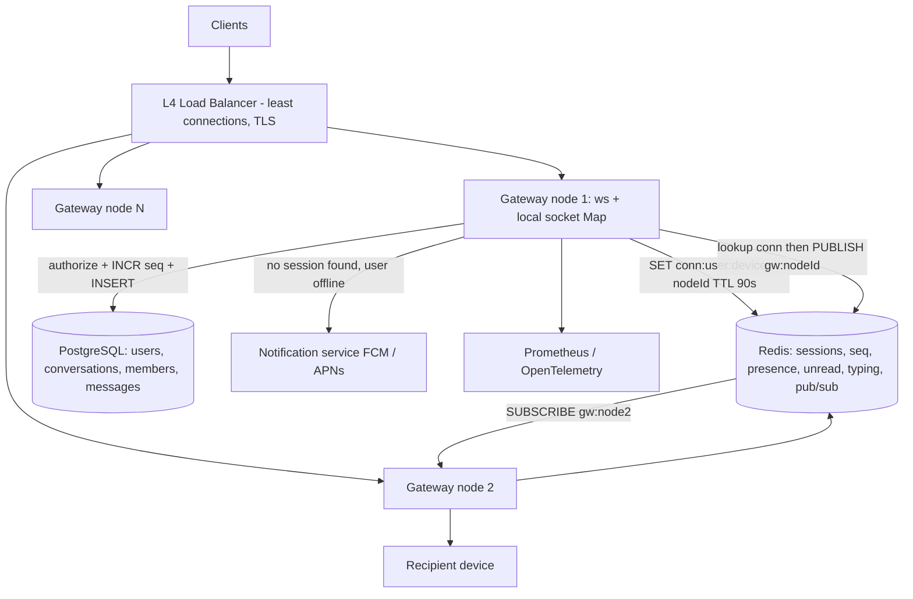
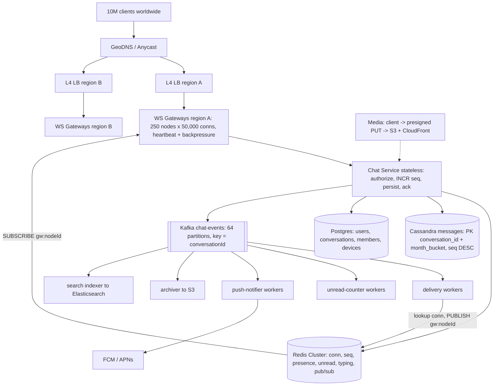

# Chat System -- HLD + LLD (Part 5: Trade-offs -> 3 Versions -> Follow-ups -> Node.js Questions)

> Is file mein prompt ke **Parts 21-25** hain: chat system ke har bade decision ka trade-off ("kyun ye, kyun woh nahi"), MVP -> Scalable -> Highly Scalable teen versions, 24 interviewer follow-up questions, 13 requirement-change ("What if...") questions, aur Node.js specific questions -- sab isi chat system ke numbers par.
> Part 4 recap: humne dekha ki 1x se 100x tak sabse pehle **connections aur memory** tootti hain (CPU nahi), ek gateway node marne par 50,000 clients ka **reconnect storm** kaise poore fleet ko gira sakta hai (full-jitter backoff + waves), aur consistency mein humne saaf bola ki **ordering per conversation strong hai, presence eventual hai, delivery at-least-once hai**. Security mein connect par JWT, har `send` par membership authorization, media presigned URL; observability mein North Star SLI `message_delivery_latency_seconds` (server accept -> recipient socket write) plus `ws_connections_active`, `ws_buffered_amount_bytes`, `slow_client_drops_total`, `kafka_consumer_lag{group}`.
> Part 6 mein: zero se ek chhota TypeScript chat server, 30-second answer, 5-minute answer, whiteboard drawing order, aur final cheat sheet.

Ek line mein hamara system yaad kar lo, kyunki Part 21 ka har answer isi par tika hai:

```
Client (mobile / web)
  |  WebSocket wss://, heartbeat 30 s, reconnect full-jitter, resume with lastSeq
  v
L4 Load Balancer (TCP/TLS, least-connections)
  v
WS Gateway nodes (250 x 50,000 conns, STATEFUL)
  |-- Redis session registry  conn:<userId>:<deviceId> = nodeId (TTL 90 s)
  |-- subscribe Redis Pub/Sub channel  gw:<nodeId>
  v
Chat Service (stateless) -- authorize -> INCR seq:<conversationId> -> persist -> ack 'sent'
  v
Kafka chat-events (64 partitions, key = conversationId)
  v
Delivery Workers -> session lookup -> PUBLISH gw:<nodeId>  |  offline -> Notification service (FCM/APNs)
  v
Recipient device -> 'delivered' receipt -> sender ko do tick
```

Numbers jo baar baar aayenge: **50M DAU, 10M concurrent connections, 2B messages/day (23,148 msg/sec avg, ~70,000 peak), 13.2B deliveries/day (~153,000/sec avg, ~460,000 peak), 50,000 connections per node x 250 nodes, ~20 KB per connection, 600 GB/day messages, 660 GB/day receipts (agar per-message store karein), 333,000 presence heartbeats/sec, group max 256, p95 delivery < 500 ms.**

---

## PART 21 -- Trade-offs: har decision ka "kyun ye, kyun woh nahi"

### Pehle rule samjho

Chat ke interview mein sabse common galti: "WebSocket use karenge" bol ke aage badh jaana. Interviewer ye sunna chahta hai:

```
Requirement kya hai  ->  Options kya hain  ->  Har option ki keemat kya hai  ->  Is requirement par kaunsi keemat chalegi
```

Hamari requirements yaad rakho: **server ko khud se client tak push karna hai, p95 < 500 ms, 10M concurrent connections, accepted message kabhi na khoye, per-conversation ordering strong, presence eventual chalegi.** Har table ke end mein **hamare system ka decision** hai.

### 1. WebSocket vs SSE vs Long polling vs Short polling vs Push-only

Ye is poore system ka pehla aur sabse bada decision hai, isliye ek hi table mein saare axes:

| | Short polling | Long polling | SSE (Server-Sent Events) | **WebSocket (hamara)** | Push-only (FCM/APNs) |
|---|---|---|---|---|---|
| **Direction** | Client -> server only (server jawab mein deta hai) | Client -> server, server ka reply "rok ke" | **Server -> client one-way**; client -> server ke liye alag HTTP call | **Full duplex** -- dono taraf, kabhi bhi | Server -> device only, aur woh bhi OS ke through |
| **Latency** | Poll interval jitna (2 s poll = avg 1 s lag) | Near real-time (~ms), par har message ke baad naya request setup | Near real-time; client -> server leg par HTTP overhead | **Sabse kam** -- connection pehle se khula, bas ek frame | Seconds se minutes; OS batch aur throttle karta hai |
| **Proxy / firewall friendliness** | Sabse zyada -- plain HTTP GET | Bahut achhi, par kuch proxies 30-60 s par request kaat dete hain | Achhi -- plain HTTP response stream, par buffering proxies (nginx `proxy_buffering on`) sab rok lete hain | Achhi, kyunki HTTP `Upgrade` se shuru hoti hai aur 443 par TLS ke andar hai; kuch corporate proxies phir bhi Upgrade block karte hain | N/A (OS ka apna channel) |
| **Mobile battery** | Sabse bura -- har poll radio jagaata hai | Bura -- baar baar naya request | Theek -- ek connection, par one-way | Achha *agar* heartbeat lamba ho; 30 s heartbeat par radio baar baar jaagta hai (ye asli cost hai) | **Sabse achha** -- OS ka ek shared connection sab apps ke liye |
| **Complexity** | Almost zero | Kam | Kam (`EventSource` browser mein built-in, auto reconnect + `Last-Event-ID`) | **Sabse zyada** -- stateful server, session registry, heartbeat, backpressure, reconnect + resume protocol | Kam for you, par delivery guarantee tumhare haath mein nahi |
| **Binary support** | Haan (HTTP body) | Haan | **Nahi** -- text only (UTF-8), binary ko base64 karna padega (+33%) | Haan -- text + binary frames | Payload chhota (~4 KB) |

**Hamare numbers par kya hota hai:**

- Short polling: 10M users x har 2 s = **5M requests/sec**, jisme 99% khaali jawab. 23K msg/sec ke system ke liye 5M rps ka infra -- ye bilkul bewakoofi hai. Aur phir bhi 2 second lag.
- Long polling: 10M open requests -- connections toh utne hi khule hain jitne WebSocket mein! Fayda kya mila? Bas ye ki har message par request cycle dobara chalti hai (headers, auth, logging middleware). 153K deliveries/sec x ~800 bytes headers = bekaar bandwidth.
- SSE: sirf ek taraf ka kaam karta hai. Chat mein client bhi bhejta hai (`send`, `receipt`, `typing`) -- toh SSE + POST ka jugaad banega, matlab **do** connections per user. 10M users = 10M SSE + POST traffic.
- WebSocket: ek connection, dono taraf, ek handshake, chhote frames (2-14 byte header).

**Decision:** "WebSocket, kyunki mera core requirement hi server-initiated push hai aur client bhi continuously bhejta hai (typing, receipts). SSE tab lunga jab traffic sach mein one-way ho -- live cricket score, stock ticker, order tracking, AI token streaming. Long polling ab bhi ek achha **fallback** hai un networks ke liye jahan Upgrade block hai."

> **Honest note (ye line interview mein badi lagti hai):** har "real-time" app ko socket nahi chahiye. Agar product sirf **notification-style** hai -- "order shipped", "someone liked your post", din mein 5-10 events, user ko turant chahiye bhi nahi -- toh **push-only (FCM/APNs) + app khulne par ek REST sync call** poora kaam kar deta hai, aur tumhara server stateless rehta hai. 10M sockets ka poora dard tab uthao jab (a) user actively screen dekh raha ho, (b) do-taraf ka traffic ho, (c) sub-second matter karta ho. Chat mein teeno sach hain, isliye socket. Notification system mein teeno sach nahi, isliye wahan socket **nahi** lagate.

### 2. Raw `ws` vs Socket.IO

| | Raw `ws` (hamari v3 choice) | Socket.IO |
|---|---|---|
| **Pros** | Bahut patla -- per connection sirf socket + thoda JS object (~20 KB with TLS buffers). 50,000 conns per node realistic. Protocol tumhara (hamara JSON frame spec). Koi hidden magic nahi -- debugging seedhi | **Built-in reconnect** with backoff, **fallback to HTTP long polling** jab Upgrade block ho, **rooms** (`io.to('conv:123').emit(...)`), acknowledgements callbacks, **Redis adapter** jo multi-node broadcast khud kar deta hai, client libraries har platform ke liye |
| **Cons** | Reconnect, backoff, heartbeat, rooms, multi-node routing -- **sab khud likhna** (yahi Part 2/3 ka LLD hai) | Per connection zyada memory aur CPU (engine.io session state, packet encoding layer, upgrade ke baad bhi polling session metadata). Apna protocol hai (`42["event",{...}]`), toh non-JS clients ko official client chahiye. Redis adapter har broadcast ko **har node** par bhejta hai (pub/sub fan-out), 250 nodes par ye waste hai |
| **Kab use karunga** | Jab connections lakhon mein hon aur per-connection memory hi bottleneck ho; jab protocol/versioning par poora control chahiye | **V1 aur V2 mein** -- jab connections hazaaron mein hain, team chhoti hai, aur reconnect/fallback khud likhna time waste hai. Startup ke pehle saal ke liye ye bilkul sahi choice hai |

**Decision:** "V1/V2 mein Socket.IO -- reconnect aur fallback free milte hain, aur 50,000 connections tak ye koi problem nahi. V3 mein raw `ws`, kyunki 250 nodes x 50,000 = memory per connection hi hamara cost driver ban jaata hai, aur Socket.IO ka Redis adapter broadcast model hamare targeted `gw:<nodeId>` routing se mehenga hai. Ye migration sasta nahi hai (client protocol badalta hai), isliye ise **planned** karna padta hai, achanak nahi."

### 3. Routing: Session registry + Redis Pub/Sub vs Consistent hashing vs Direct gRPC node-to-node

Problem ek hi hai: **user A ka message user B tak kaise pahunche jab B ka socket kisi doosre gateway node par pada hai.**

| | Broadcast to all nodes | Consistent hashing (user -> fixed node) | **Session registry + Redis Pub/Sub (hamara)** | Direct gRPC node-to-node |
|---|---|---|---|---|
| **Kaise** | Har delivery har node ko; jiske paas socket hai woh bhej de | `nodeId = hashRing(userId)`; LB bhi usi node par bhejta hai | Redis `conn:<userId>:<deviceId> = nodeId`; worker lookup karke sirf `gw:<nodeId>` par publish karta hai | Worker registry se nodeId nikaal ke us node ko seedha gRPC call |
| **Pros** | Zero lookup, zero state | Koi registry hi nahi -- lookup ek hash function hai, zero network. Deterministic | Ek Redis lookup (~0.3 ms) aur ek targeted publish. Node kahin bhi ho sakta hai, LB ko kuch pata nahi. Multi-device natural (`conn:*` ke multiple keys) | **Sabse kam latency** -- ek hop, Redis beech mein nahi. Backpressure aur delivery failure ka seedha signal milta hai |
| **Cons** | 460K deliveries/sec x 250 nodes = **115M messages/sec** pub/sub par. Bekaar. N^2 | Node add/remove par users ka **rebalance** -- un users ke sockets todne padenge (mass reconnect = wahi storm). Client ko us exact node par pahunchana LB ke liye mushkil (DNS/ip per node). Hot node ka koi ilaaj nahi | Redis ab critical path par hai; Redis Pub/Sub **fire and forget** hai (subscriber down = message gaya); registry stale ho sakti hai (node mara, TTL 90 s baaki hai) | Service discovery chahiye, mesh chahiye, 250 nodes x 250 nodes = **62,500 potential connections**; connection management khud ek project |
| **Kab use karunga** | Kabhi nahi (sirf jab nodes < 5 aur traffic khilona ho) | Jab node count sthir ho aur tum rebalance ka dard uthaa sakte ho | **Default** -- 250 nodes tak ye simple aur predictable hai | V3 optimization jab p99 delivery latency mein Redis hop dikhne lage, ya jab per-delivery Redis ops budget cross ho |

**Decision:** "Session registry + pub/sub, kyunki ye **routing ko LB se decouple** kar deta hai -- client kisi bhi node par land kare, hum use dhoond lenge. Stale registry ka ilaaj TTL 90 s + heartbeat refresh + disconnect par explicit `DEL` hai. gRPC V3 ka optimization hai (Redis hop bachta hai) par tab service mesh aur connection pooling ka kharcha uthana padega."

### 4. Redis Pub/Sub vs Redis Streams vs Kafka -- delivery fan-out ke liye

Dhyaan do: hamare design mein **dono** hain. Kafka `chat-events` (durable pipeline) aur Redis Pub/Sub `gw:<nodeId>` (last hop). Interviewer poochhega "ek hi kyun nahi?"

| | Redis Pub/Sub | Redis Streams | **Kafka (hamara pipeline)** |
|---|---|---|---|
| **Durability** | **Zero.** Subscriber offline = message gaya, koi trace nahi | Stream mein rehta hai (`XADD`), consumer group + `XACK`, pending entries list se retry | Disk par, replicated, retention (7 din), offset se replay |
| **Latency** | **Sabse kam** (~0.2-0.5 ms) | Kam (~0.5-1 ms), par `XREADGROUP` + `XACK` = zyada ops | ~2-10 ms (batching, acks) |
| **Ordering** | Per publisher, best effort | Per stream, strict | **Per partition strict** -- key `conversationId` se ek conversation ke saare messages ek partition mein, isliye order guaranteed |
| **Consumers** | Sab subscribers ko copy (fan-out) | Consumer group -> kaam bat-ta hai | Multiple **independent** consumer groups: `delivery`, `unread-counter`, `push-notifier`, `archiver` -- sab apne offset par |
| **Cons** | Fire and forget; Redis Cluster mein pub/sub sab nodes tak jaata hai (shard channels se hi bachta hai) | Trimming (`XTRIM`) khud manage karo warna memory phatti hai; Kafka jaisi retention/replay nahi | Ek aur bada system; 64 partitions ka ops; latency Redis se zyada |
| **Kab use karunga** | **Last hop** jahan message pehle se durable ho chuka hai aur receiver (gateway) live hai. Miss ho gaya toh client reconnect par `resume` se sync kar lega -- **yahi hamara safety net hai** | Chhota-medium scale, jab Kafka nahi chahiye par durability chahiye. V2 ke liye achha middle ground | **Pipeline** jahan multiple consumers chahiye, replay chahiye, aur ordering per conversation guarantee chahiye |

**Decision:** "Kafka durable spine ke liye, Redis Pub/Sub sirf last hop ke liye. Pub/Sub ka message kho jaana **acceptable** hai kyunki message pehle hi persist ho chuka hai aur client ka `resume` protocol usse pakad lega. Agar mere paas Kafka nahi hota (V2), main Redis Streams lunga -- kyunki wahan mujhe retry chahiye hoti hai."

> Key insight: **jo cheez pehle se durable store mein hai, uske transport ko durable hone ki zarurat nahi.** Chat ka asli safety net storage + `resume` hai, pub/sub nahi.

### 5. `messages` table ke liye: Postgres vs Cassandra vs DynamoDB vs MongoDB

| | Postgres (v1/v2) | **Cassandra / ScyllaDB (v3)** | DynamoDB | MongoDB |
|---|---|---|---|---|
| **Pros** | Ek hi DB mein users + members + messages; transactions; `ON CONFLICT` se idempotency free; joins se authorization query; sab jaante hain | Write-optimized (LSM tree), linear scale, `PRIMARY KEY ((conversation_id), seq)` + `CLUSTERING ORDER BY (seq DESC)` hamare exact read pattern se match; multi-DC replication built-in; TTL per row | Zero ops (managed), predictable latency, auto-scale, TTL, streams. `PK = conversationId`, `SK = seq` -- same shape | Flexible schema, sharding on `conversationId`, decent range scans, aggregation |
| **Cons** | Ek primary par write ceiling (~10-20K simple inserts/sec on good NVMe); 219 TB/year ek machine par nahi aata; vacuum + index bloat; sharding khud karna padega | **Koi join nahi, koi transaction nahi** (membership phir bhi Postgres mein); eventual consistency samajhni padti hai (`QUORUM` reads); wide partition problem; ops heavy (repair, compaction) | Cost item-writes par hai: 2B writes/day ka bill bada hota hai; 400 KB item limit; query flexibility kam; vendor lock-in | Write throughput Cassandra se kam; shard key galat chuna toh hotspot; large scale par ops Cassandra jitna hi mushkil, faayde kam |
| **Kab use karunga** | **Shuru mein hamesha** -- V1, V2, aur tab tak jab tak numbers na bolein | Jab numbers bolein (neeche) | Jab team chhoti ho aur AWS par ho, aur predictable per-request cost chal jaaye | Jab team already Mongo par hai aur scale medium hai |

**Switch trigger, numbers mein (ye poochha jaata hai):**

| Signal | Threshold | Hamara number |
|---|---|---|
| Sustained insert rate on one primary | > ~10,000 inserts/sec | **23,148/sec avg, 70,000 peak** -> cross |
| `messages` table size | > ~5-10 TB (backup, vacuum, restore sab dard ban jaate hain) | **600 GB/day -> 219 TB/year** -> cross |
| p99 insert latency | > 20 ms sustained | budget hi 500 ms end-to-end hai, DB ko 10 ms se kam chahiye |
| Restore time | > few hours | 219 TB restore = din -- unacceptable |

**Decision:** "V1 Postgres, aur main is par proud hoon -- ek DB mein sab, transactions, idempotency `ON CONFLICT`. Jab messages ka write rate ~10K/sec aur size ~10 TB cross kare, tab `messages` (aur sirf `messages`) Cassandra par jaata hai, kyunki woh **append-only, time-ordered, no-join** data hai -- Cassandra ka perfect shape. `users`, `conversations`, `conversation_members` Postgres mein hi rehte hain, kyunki wahan relational integrity aur authorization queries chahiye. Cassandra ka gotcha: ek bahut badi group ka poora itihaas ek partition mein -- isliye `PRIMARY KEY ((conversation_id, month_bucket), seq)`."

### 6. Store-once per conversation (fan-out on read) vs Per-recipient inbox (fan-out on write)

**Ye is system ka sabse important trade-off hai, aur yahi News Feed se ulta hai.**

| | **Store once per conversation (hamara)** | Per-recipient inbox (har member ki copy) |
|---|---|---|
| **Write cost** | 1 row per message = **2B rows/day, 600 GB/day** | 1 row per recipient = **13.2B rows/day, ~4 TB/day** (6.6x) |
| **Read cost** | Ek partition se range scan: `WHERE conversation_id = ? AND seq > ?` -- ek query, sorted | Har user ka apna inbox -- bhi ek query, aur "unread" seedha inbox se |
| **Delete for everyone** | Ek row update (`deleted_at`) -- **sab ko turant lagta hai** | 30 rows update karni padengi, aur kuch miss ho sakti hain |
| **Edit message** | Ek row | N rows |
| **Group size ka asar** | Zero -- 256 member group bhi 1 row | Linear -- 256 rows per message |
| **Kab use karunga** | Jab **recipients per item kam hon** (chat mein avg 30) aur read hamesha "us conversation ka" ho | Jab read pattern "mere saare sources ka merged stream" ho, aur read time par merge karna mehenga ho |

**News Feed se contrast (yahi interviewer sunna chahta hai):**

| | Chat | News Feed |
|---|---|---|
| Read query | "Ek conversation ke last 50 messages" -- **ek hi partition** | "Mere 500 followees ke latest posts, merged aur sorted" -- **500 partitions** |
| Fan-out size | avg 30, max 256 | avg 500 followers, celebrity par 100M |
| Isliye kya jeetta | **Fan-out on read** (store once) -- read already sasta hai, write ko 6.6x mat karo | **Fan-out on write** (push into each follower's timeline) -- warna har feed open par 500-way merge |
| Ulta case | Broadcast channel (1 lakh members) mein chat bhi feed jaisa ban jaata hai -> read-time fetch | Celebrity post par feed bhi chat jaisa ban jaata hai -> hybrid: pull celebrity posts at read time |

**Decision:** "Chat mein message **ek hi baar conversation ke against** store hota hai; jo cheez fan out hoti hai woh **delivery** hai (ek transient socket write), **storage** nahi. News Feed mein ulta -- wahan storage fan out hoti hai kyunki read ek 500-way merge hai. Dono jagah shabd 'fan-out' hai par matlab alag; ye farak pakadna hi is sawaal ka asli jawab hai."

### 7. Per-message receipt rows vs `last_read_seq` watermarks

| | Per-message receipt row (`message_receipts`) | **Watermark (`last_read_seq`, `last_delivered_seq`) -- hamara** |
|---|---|---|
| **Storage** | 13.2B deliveries/day x ~50 B = **660 GB/day** -- messages (600 GB/day) se **zyada**! 1 saal = 240 TB, x3 replication = 720 TB | Ek row per (conversation, user) -- 2 columns update. Chat kitna bhi ho, size **constant** |
| **Writes** | 153,000 receipt inserts/sec avg, 460,000 peak -- ek aur pura write pipeline | Har receipt = ek `UPDATE ... SET last_read_seq = GREATEST(last_read_seq, $1)` -- aur clients batch karke bhejte hain (10 messages padhe -> ek update) |
| **Kya kho jaata hai** | -- | "Kaunsa **exact** message kab deliver hua" ka history nahi bachta -- sirf "is seq tak sab ho gaya". Non-contiguous read (user ne beech ka message padha) express nahi hota | 
| **Group receipts** | Har member x har message = poora matrix | `last_read_seq >= seq` wale members gino -> "Read by 12 of 30" seedha nikal jaata hai |
| **Kab use karunga** | Jab compliance ya legal proof chahiye ki kis banda ne kis message ko kab dekha (enterprise/regulated); ya jab per-message analytics product feature ho | **Default** -- WhatsApp/Slack jaisa product behaviour isse poora ban jaata hai |

**Decision:** "Watermark. `conversation_members.last_read_seq` aur `last_delivered_seq` monotonic hain -- `GREATEST()` se out-of-order receipts bhi safe hain, aur unread count `last_message_seq - last_read_seq` se free mein mil jaata hai. 660 GB/day bachana ek single design decision se -- interview mein ye line bahut strong lagti hai. Agar product 'kis member ne kab padha' ka full matrix maange toh main us feature ko sirf **groups <= 256** ke liye aur **90 din retention** ke saath dunga, unlimited nahi."

### 8. JSON frames vs Protobuf / MessagePack

| | **JSON (hamara)** | Protobuf | MessagePack |
|---|---|---|---|
| **Size** | ~300 bytes typical frame (field names repeat hote hain) | ~40-50% chhota (field numbers, varint) | ~20-30% chhota (JSON jaisa model, binary encoding) |
| **CPU** | `JSON.parse`/`stringify` C++ mein hai aur bahut fast, par **synchronous aur blocking** | Encode/decode fast, par JS implementations ka overhead real hai | Fast, par JSON.parse se hamesha tez nahi (V8 bahut optimized hai) |
| **Debugging** | **Chrome DevTools mein frame khol ke padh lo** -- ye badi baat hai | Binary; tooling chahiye | Binary |
| **Schema evolution** | Koi schema nahi -- naya field add karna free, par galti bhi free | Strong: field numbers, `reserved`, backward compatible by design | Koi schema nahi |
| **Kab use karunga** | Default. Jab tak bandwidth bill ya mobile data complaint na aaye | Jab bandwidth sach mein bottleneck ho: 460K deliveries/sec x 150 bytes bachaye = ~70 MB/s bacha; ya jab typed contract cross-team zaroori ho | Jab minimum badlav mein size chahiye (drop-in, schema nahi) |

**Hamara number:** 460,000 deliveries/sec x 300 bytes = **~138 MB/sec** egress peak. Protobuf se ~60-70 MB/sec. Bandwidth bill ke hisaab se ye matter karta hai, par **development speed** shuruaat mein zyada matter karti hai.

**Decision:** "JSON, kyunki debuggability aur iteration speed chahiye aur `JSON.parse` sach mein fast hai. Optimization jo main **pehle** karunga woh encoding nahi hai: (1) frames chhote rakho (field names chhote), (2) `permessage-deflate` **soch samajh ke** -- ye CPU aur per-connection ~300 KB memory maangta hai, toh 50,000 connections par 15 GB! Isliye hum ise **off** rakhte hain. Protobuf tab jab bandwidth graph bole."

### 9. Stateful gateways (build) vs Fully managed service (buy)

Ye asli build-vs-buy baat hai, aur iska jawab **scale par palat jaata hai**.

| | **Apne gateway nodes (build)** | AWS API Gateway WebSocket | Ably / Pusher / PubNub |
|---|---|---|---|
| **Kya milta hai** | Poora control: memory per connection, backpressure policy, routing, close codes, protocol | Managed sockets; connection ko Lambda/HTTP backend se jodta hai; `@connections` API se push | Managed sockets + channels/rooms + presence + history + client SDKs + global edge |
| **Ops** | Tumhare paas 250 stateful nodes hain: deploy, drain, ulimit, OOM, reconnect storms. **Ek team chahiye** | Lambda concurrency, cold start, 29 s limits, payload limits | Lagbhag zero |
| **Cost (order of magnitude, list price, rough)** | 250 nodes x 8 GB ~ **$30-50K/month** socket tier ke liye | ~$1 per million connection-minutes + ~$1 per million messages. 10M conns x 43,200 min/month = **432,000 million connection-minutes = ~$430K/month**, plus 13.2B deliveries/day x 30 = ~396,000 million messages = **~$400K/month**. Total **~$800K+/month** | Peak-connection + message based; enterprise pricing par bhi 10M connections ka bill **6-7 figures/month** hota hai |
| **Kab use karunga** | Jab connections **~1M+** ho jaayein, ya jab protocol/latency par control product ka differentiator ho | **Chhote se medium** (10K-100K connections), serverless stack, team chhoti -- yahan ye clearly jeetta hai | Jab socket tumhara core product **nahi** hai (dashboard live updates, collaborative cursor, live scores) aur time-to-market matter karta hai |

**Break-even ka mental model:**

```
< 50K concurrent      -> buy. Ek engineer ki salary > pura managed bill.
50K - 500K            -> depends. Bill vs ek dedicated platform engineer ka cost compare karo.
> 1M concurrent       -> build. Managed bill itna hai ki poori team afford ho jaati hai.
```

**Decision:** "Hamare 10M connections par managed service ka bill hamare poore socket tier se **15-20x** mehenga hai, aur usme backpressure policy, close codes, ya per-connection memory par control bhi nahi milta. Isliye build. Lekin agar interviewer ne bola 'startup hai, 6 mahine mein launch karo' -- toh main **Ably/Pusher se shuru** karunga aur socket layer ko apne code mein ek interface ke peeche rakhunga, taaki baad mein swap ho sake. Ye bolna kamzori nahi, maturity hai."

### 10. E2EE (end-to-end encryption) vs Server-side plaintext

**Term:** *E2EE* matlab message sirf sender aur recipient ke devices par padha ja sakta hai -- server ke paas sirf encrypted blob hota hai, chaabi nahi.

| | **Server-side plaintext (hamara v1)** | E2EE (Signal protocol style) |
|---|---|---|
| **Kya milta hai** | Server-side search, server-side group fan-out of content, easy multi-device, spam/abuse moderation, rich previews, server-side backup/restore, compliance export | Server breach par bhi messages nahi padhe ja sakte; insider risk khatam; legal demands par "hamare paas hai hi nahi" |
| **Kya kho jaata hai** | Privacy guarantee -- server (aur uska admin, aur uska subpoena) sab padh sakta hai | **Server-side search** (index encrypted text par nahi ban sakta -> search device par, aur naye device par purana history searchable nahi). **Server-side group fan-out of content** (server content dekh nahi sakta; sender ko har recipient device ke liye alag encrypt karna padta hai -- 256 member group x 3 devices = 768 encryptions per message, sender ke phone par). **Multi-device** (har device ki apni identity key; naye device par purana history transfer karna alag protocol hai). **Moderation** (server spam/CSAM detect nahi kar sakta -> user reporting par shift). Link previews, server-side backups |
| **Kya nahi badalta** | -- | **Metadata phir bhi server ke paas hai**: kaun kisko, kab, kitna, kitni baar. Ye chhota nahi hai |
| **Kab use karunga** | Enterprise/team chat jahan compliance, eDiscovery, aur admin search product requirement hi hain (Slack ka default) | Consumer messaging jahan privacy hi product hai (WhatsApp, Signal) |

**Decision:** "V1 mein E2EE nahi -- aur ye kaayarta nahi hai, ye ek **product decision** hai: mujhe server-side search, easy multi-device, aur moderation chahiye. Agar privacy core requirement ban jaaye toh Part 24 #3 mein main poora migration path deta hoon. Beech ka raasta bhi hai jo log bhool jaate hain: **encryption at rest + strict access control + audit logs** -- ye server breach ka 80% risk bina E2EE ke dard ke kam kar deta hai."

### 11. Presence always-on (push) vs Presence on-demand (pull + subscribe)

| | Always-on push (sabko batao) | **On-demand (hamara)** |
|---|---|---|
| **Kaise** | User online hua -> uske saare contacts ko `presence` frame | `presence:<userId>` Redis key TTL 90 s (heartbeat se refresh). Client jo chat **abhi khuli hai** sirf unke liye poochhta/subscribe karta hai |
| **Cost** | 10M users x avg 200 contacts = **2B notifications per presence flip**. Aur log din mein 20-50 baar flip karte hain (metro, lift, network switch) -> arbon events | Chat list khuli = ~20 lookups; chat khuli = 1 subscribe. Redis `MGET presence:<a> presence:<b> ...` ek round trip |
| **Accuracy** | Near instant | **30-90 s tak stale** -- key expire hone par hi "offline" pata chalta hai |
| **Kab use karunga** | Chhoti team apps (Slack workspace mein 50 log) jahan contacts kam hain | Consumer scale jahan contact graph bada hai |

**Decision:** "On-demand + scoped subscribe. Aur main confidently bolunga: **presence eventual hai aur 30-90 s stale ho sakti hai -- 'last seen 2 minutes ago' ka matlab hi yahi hai.** Yaad rakho: presence heartbeats 333,000/sec hain jabki messages 23,000/sec -- **presence messaging se 14x mehenga hai.** Isliye presence ko throttle karo, scope karo, aur last-seen ko batch mein persist karo (har heartbeat par Postgres update = suicide)."

### 12. Sticky sessions (LB affinity) vs Session registry

| | Sticky sessions / session affinity | **Session registry (hamara)** |
|---|---|---|
| **Kaise** | LB cookie ya source-IP hash se user ko hamesha usi node par bhejta hai | LB jahan chahe bheje; node connect par Redis mein `conn:<userId>:<deviceId> = nodeId` likh deta hai |
| **Pros** | Reconnect par wahi node, wahi warm state; koi registry nahi | Node kabhi bhi mar sakta hai, deploy ho sakta hai, scale ho sakta hai -- client kisi bhi naye node par reconnect karega aur sab kaam karega. Multi-device natural. Node count badalne se kuch nahi tootta |
| **Cons** | Node restart/deploy par us node ke **saare** sessions ka state bekaar; affinity source-IP par ho toh ek NAT ke peeche wale saare log ek node par; scale-in par bade chunks migrate; aur ye **problem solve hi nahi karta** -- B ka socket phir bhi doosre node par ho sakta hai | Ek Redis dependency; stale entries (TTL se handle); ek extra lookup per delivery |
| **Kab use karunga** | Legacy apps jinke paas in-memory session hai aur shared store nahi | **Hamesha, is system mein** |

**Decision:** "Sticky sessions yahan **anti-pattern** hain -- woh routing problem ko solve nahi karte (message kisi aur user ko jaana hai, wapas usi user ko nahi), aur deploy/restart ko mushkil bana dete hain. Isliye LB par sirf **least-connections** (round-robin nahi, kyunki connections long-lived hain -- naya node round-robin par bhi khaali reh jaayega), aur routing ka jawab session registry deta hai."

### 13. Prompt ke generic pairs -- chat par kya lagta hai, kya nahi

| Pair | Chat par? | Decision |
|---|---|---|
| **SQL vs NoSQL** | Haan, aur jawab **dono** hai | `users`, `conversations`, `conversation_members` -> Postgres (relational, authorization, transactions). `messages` -> v1 Postgres, v3 Cassandra (append-only time series). "Ek hi DB sab ke liye" is scale par galat hai |
| **Sync vs Async** | Haan, aur ye line bahut zaroori hai | **Sync (client ruk ke wait karta hai):** authorize -> `INCR seq` -> persist -> `ack`. Yahi durability requirement hai. **Async (Kafka ke baad):** delivery fan-out, unread counters, push notifications, search indexing, archival. Sender ko recipients ka wait nahi karna chahiye |
| **Cache vs no cache** | Haan, selective | Cache: membership (`TTL 300 s` -- har send par authorization check), session registry (woh khud Redis hai), presence, unread. **Messages ko cache mat karo** -- read pattern already "last N by PK" hai jo DB ke liye sasta hai, aur cache invalidation (delete for everyone, edit) dard hai |
| **Kafka vs RabbitMQ** | Haan | Kafka, kyunki chahiye **per-key ordering** (`conversationId`), **multiple independent consumer groups** (delivery, unread, push, archive), aur **replay** (delivery worker ka bug -> offset reset). RabbitMQ per-message routing aur complex topologies mein better hai, par ordering + replay + multi-consumer fan-out par Kafka jeetta hai |
| **REST vs WebSocket** | Dono, aur ye batna important hai | **WebSocket:** send, receipt, typing, presence, incoming messages -- sab real-time. **REST:** conversation list, history scroll (`beforeSeq`), delta sync (`afterSeq`), create conversation, add member, media presign, health. Rule: jo cheez **server se bina poochhe aa sakti hai** woh socket par; jo **user ke action par ek baar** chahiye woh REST par (cacheable, retryable, debuggable) |
| **Polling vs WebSocket** | Solved in #1 | WebSocket; polling ke numbers upar hain |
| **UUID vs Snowflake** | Haan, aur ye **do alag cheezein** hain | `messageId` = **client-generated UUID v4** -> idempotency key (retry par duplicate nahi). `seq` = **server-assigned per-conversation integer** (`INCR seq:<conversationId>`) -> ordering + gap detection + delta sync. Snowflake tab jab globally sortable ID chahiye bina per-conversation counter ke -- hamein per-conversation ordering chahiye, global nahi, toh `INCR` simple aur sasta hai. **Timestamp se ordering kabhi nahi** -- client clocks jhoot bolti hain aur servers mein bhi skew hota hai; `createdAt` sirf display ke liye |

### Summary: ek table mein saare decisions

| Decision | Humne kya chuna | Kab badlenge |
|---|---|---|
| Transport | WebSocket | One-way traffic -> SSE; Upgrade blocked -> long-poll fallback; notification-style app -> push only |
| Library | Socket.IO (V1/V2) -> raw `ws` (V3) | Per-connection memory bottleneck bane tab |
| Routing | Session registry + Redis Pub/Sub | p99 mein Redis hop dikhe -> direct gRPC |
| Pipeline | Kafka (64 partitions, key `conversationId`) | Chhota scale -> Redis Streams |
| Last hop | Redis Pub/Sub `gw:<nodeId>` | -- (loss OK, `resume` safety net) |
| Message store | Postgres -> Cassandra | > ~10K inserts/sec ya > ~10 TB |
| Storage model | Store once per conversation | Broadcast channels (100K members) -> read-time fetch |
| Receipts | `last_read_seq` / `last_delivered_seq` watermarks | Compliance chahiye -> per-message rows, bounded retention |
| Encoding | JSON | Bandwidth bill bole -> protobuf |
| Gateways | Build (apne nodes) | < 100K connections -> buy (managed) |
| Encryption | Server-side plaintext + at-rest encryption | Privacy product requirement bane -> E2EE |
| Presence | On-demand + scoped subscribe, TTL 90 s | Chhoti team app -> push to all contacts |
| LB | Least-connections, **no** sticky | -- |

> Interview line: "Chat mein har decision do cheezon ke beech hai -- **latency/simplicity** aur **durability/control**. Mera requirement 'accepted message kabhi na khoye, par presence aur typing kho sakte hain' hai, isliye main durability sirf message path par kharch karta hoon aur baaki sab jagah sasta transient path leta hoon."

---

## PART 22 -- Minimum -> Scalable -> Highly Scalable (3 versions)

Interviewer 3 versions isliye maangta hai taaki dekhe ki tum **Day 1 par Kafka + Cassandra + 250 nodes nahi laga doge**, aur tumhe pata hai ki **kaunsa metric** tumhe agle version par le jaayega.

### Version 1 -- Simple MVP (ek Node process, `ws`, in-memory Map, Postgres)

```
Browser / App
  |  wss://
  v
+-------------------------------------------------------------+
|  ONE Node.js process                                        |
|                                                             |
|   ws.Server  -->  connections: Map<userId, Set<WebSocket>>  |  <-- yahi "session registry" hai
|                                                             |
|   on 'send' -> authorize -> seq++ -> INSERT -> ack          |
|             -> members nikalo -> Map se sockets -> write    |
+-------------------------------------------------------------+
  |
  v
PostgreSQL (users, conversations, conversation_members, messages)
```

Asli code shape jo interview mein draw karna hai -- poora "routing layer" bas itna hai:

```ts
// v1: ek process, isliye session registry ek Map hai. Ye jugaad NAHI hai -- ek process par
// yahi correct design hai, kyunki "kaun kahan juda hai" ka jawab isi process ke paas hai.
const connections = new Map<string, Set<WebSocket>>();   // userId -> uske devices ke sockets

function register(userId: string, ws: WebSocket) {
  let set = connections.get(userId);
  if (!set) { set = new Set(); connections.set(userId, set); }
  set.add(ws);
  ws.once("close", () => {                 // <-- ye line bhoolna = memory leak (Part 25 Q12)
    set.delete(ws);
    if (set.size === 0) connections.delete(userId);
  });
}

function deliver(userId: string, frame: ServerFrame): boolean {
  const set = connections.get(userId);
  if (!set || set.size === 0) return false;              // offline -> push notification path
  const payload = JSON.stringify(frame);                 // ek baar stringify, sab devices ko wahi
  for (const ws of set) if (ws.readyState === WebSocket.OPEN) ws.send(payload);
  return true;
}
```

**Code Explanation:**

- `connections` ek `Map<userId, Set<WebSocket>>` hai -- `Set` isliye ki ek user ke multiple devices (phone + web) ho sakte hain. Ye V3 wali Redis key `conn:<userId>:<deviceId> -> nodeId` ka chhota bhai hai.
- `register()` auth ke baad chalta hai. `ws.once("close", ...)` mein cleanup -- **ye chhoot gaya toh har disconnect ek dead socket object memory mein chhod jaayega** aur process kuch ghanton mein OOM ho jaayega. Ye V1 ka classic bug hai (Part 25 Q12 mein bug + fix dono).
- `set.size === 0` par `connections.delete(userId)` -- warna khaali `Set` objects jama hote rahenge (slow leak).
- `deliver()` mein `JSON.stringify` **ek baar** -- har socket ke liye alag stringify karna teen guna CPU waste hai.
- `readyState === OPEN` check -- closing/closed socket par `send()` throw karta hai ya chupchap drop.
- Yahan koi network hop nahi: message aate hi recipient ko `deliver()`. **Latency ~1 ms.** V3 mein yahi kaam Kafka + worker + Redis publish se hota hai aur ~50 ms leta hai. Ye honest trade hai: simplicity vs scale.

**Kitna traffic sambhalta hai (honest number):** ek 4-core, 8 GB box par `ws` ke saath (`permessage-deflate` off, `ulimit -n` badha hua) **~5,000-20,000 concurrent connections** realistic hain. 10,000 x ~20 KB = ~200 MB sirf sockets ke liye -- aaram se. Message rate kuch hazaar msg/sec.

**Aur ye V1 galat nahi hai -- ye correct pehla build hai.** Kisi bhi chat product ke pehle mahine isi par nikalte hain. Interview mein seedha Kafka se shuru karna red flag hai.

- **Kya jaan-boojh ke NAHI hai:** Redis (ek process mein registry Map hi hai), Kafka (delivery synchronous hai), Cassandra (Postgres mein karodon messages aaram se), load balancer (ek node hai), presence service (Map se hi pata hai kaun online hai).
- **Rough monthly cost:** ek app server + ek managed Postgres -> **order of magnitude: $100-300/month**.
- **Kya abhi bhi missing hai:** HA bilkul nahi (process gira = app down), deploy = sab disconnect, offline push notification, media pipeline, backpressure handling, delta-sync protocol.

**Exactly kya tootta hai jab doosra node aata hai (chahe sirf HA ke liye ho):**

| Problem | Kyun |
|---|---|
| **Message deliver hi nahi hota** | A node-1 par hai, B node-2 par. node-1 ke `connections` Map mein B hai hi nahi -> `deliver()` `false` -> B ko live message nahi milega (reconnect par sync se milega, par "real-time chat" khatam) |
| **Presence jhooth bolti hai** | Har node ko sirf apne connected users dikhte hain -> "B offline hai" galat |
| **Typing indicator kabhi nahi dikhta** | Wahi routing problem, aur typing persist bhi nahi hoti toh recover bhi nahi hoti |
| **`seq` race** | Do nodes ek hi conversation par `MAX(seq)+1` karein -> duplicate seq -> do messages ek hi slot par. Isliye `INCR seq:<conversationId>` Redis mein chahiye |
| **Deploy = total outage** | Ek hi process -- restart par saare sockets toot-te hain aur sab ek saath reconnect (mini storm) |

**Next version par kab jaayenge? (signals)**

| Metric | Threshold (rough) | Matlab |
|---|---|---|
| Nodes | > 1 (HA ke liye bhi zaroori) | In-memory Map ab galat hai -> shared session registry |
| `ws_connections_active` | > ~10,000 per process | Memory aur file descriptor limits paas aa rahi hain |
| Event loop lag p99 | > 50 ms | Ek process sockets + fan-out + JSON sab kar raha hai |
| "Message late aaya" complaints | koi bhi | Delivery DB ke saath synchronously bandhi hui hai |

### Version 2 -- Scalable (multiple gateways + Redis session registry + pub/sub)


```mermaid
flowchart TD
    C1[Clients] --> LB[L4 Load Balancer - least connections, TLS]
    LB --> G1[Gateway node 1: ws + local socket Map]
    LB --> G2[Gateway node 2]
    LB --> G3[Gateway node N]
    G1 -- SET conn:user:device = nodeId TTL 90s --> R[(Redis: sessions, seq, presence, unread, typing, pub/sub)]
    G2 --> R
    G1 -- authorize + INCR seq + INSERT --> PG[(PostgreSQL: users, conversations, members, messages)]
    G1 -- lookup conn then PUBLISH gw:nodeId --> R
    R -- SUBSCRIBE gw:node2 --> G2
    G2 --> C2[Recipient device]
    G1 -- no session found, user offline --> NS[Notification service FCM / APNs]
    G1 --> PR[Prometheus / OpenTelemetry]
```

- **Kitna traffic?** ~10-25 gateway nodes x 20,000-50,000 connections = **~200K-1M concurrent connections**, ~5-10K msg/sec. Ek Redis primary (+ replica) 50-100K ops/sec deta hai; Postgres 5-10K inserts/sec.
- **Har naya component -- "humne ye abhi kyun add kiya?"**
  - **L4 Load Balancer, least-connections (round-robin NAHI)** -- connections yahan **long-lived** hain. Round-robin naye connections barabar baant-ta hai, toh naya node utne hi naye connections paata hai jitne purane bhare hue nodes -- woh kabhi catch up nahi karega. Least-connections se naya node tezi se bharta hai. L4 (TCP passthrough) isliye ki L7 proxy har frame ko chhoo kar overhead badhata hai.
  - **Redis session registry `conn:<userId>:<deviceId> = nodeId` (TTL 90 s)** -- V1 ka Map ab poore fleet ke liye chahiye. TTL heartbeat (30 s) ka 3x rakha hai taaki normal jitter par entry na ude; disconnect par explicit `DEL` bhi.
  - **Redis Pub/Sub `gw:<nodeId>`** -- har gateway sirf **apne ek** channel ko subscribe karta hai, aur delivery sirf us node ko publish hoti hai. Isliye pub/sub traffic = deliveries, na ki deliveries x nodes.
  - **Redis `INCR seq:<conversationId>`** -- per-conversation monotonic sequence, ab jab kai nodes likh rahe hain. Redis wipe ho toh `conversations.last_message_seq` se rebuild. **Gap acceptable hai, reuse kabhi nahi.**
  - **`presence:<userId>` (TTL 90 s) aur `unread:<userId>:<conversationId>`** -- presence ab kisi ek node ko nahi pata; unread har device ke liye chahiye.
  - **Notification service call** -- registry mein entry nahi mili = user offline = push bhejo. Ye hamara purana Notification system hai, dobara nahi bana rahe.
  - **Metrics** -- `ws_connections_active{node}`, `message_delivery_latency_seconds`, `ws_disconnect_total{reason}`.
- **Kaunsa dard is version par le aaya:** "doosre node wale user ko message nahi pahunchta" (routing), "deploy par sab disconnect" (ab ek-ek node drain karo), "duplicate seq" (Redis INCR), "offline user ko kuch pata hi nahi chalta" (push).
- **Delivery path abhi bhi seedha hai:** chat service persist karke khud members ka lookup karke publish kar deta hai. **Koi Kafka nahi.** Iska matlab: bada group bhejne par fan-out sender ke `ack` ko slow kar sakta hai -- isliye kam se kam `ack` pehle bhejo, fan-out uske baad.
- **Rough monthly cost:** ~15-25 app nodes + Redis (primary + replica) + managed Postgres (+ replica) + LB + egress -> **order of magnitude: $3K-10K/month**.
- **Kya abhi bhi NAHI hai:** Kafka aur delivery workers, Cassandra, multi-region, search index, S3 archival, sophisticated backpressure.

**Next version par kab jaayenge? (signals)**

| Metric | Threshold (rough) | Matlab |
|---|---|---|
| `ws_connections_active` total | > ~1M | 25+ nodes; ek node ka failure ab 50K clients ka storm hai -> drain in waves + jitter |
| Postgres `messages` insert rate | > ~10,000/sec sustained | Cassandra ka time |
| `messages` table size | > ~5-10 TB | Backup, restore, vacuum ab operational risk hain |
| `fanout_size` p99 vs send latency | Bade group par sender ka ack slow | Fan-out async karo -> Kafka + delivery workers |
| Naye consumers ki demand | Search index, analytics, archival, unread worker | Ek event stream, multiple independent consumers -> Kafka |
| Replay ki zarurat | "Delivery worker ka bug tha, kal ke events dobara process karo" | Kafka offsets |
| p95 latency by region | Doosre continent se > 500 ms | Multi-region |

### Version 3 -- Highly Scalable (full spec: Kafka, delivery workers, Cassandra, multi-region)


```mermaid
flowchart TD
    U[10M clients worldwide] --> GEO[GeoDNS / Anycast]
    GEO --> LB1[L4 LB region A]
    GEO --> LB2[L4 LB region B]
    LB1 --> GWA[WS Gateways region A: 250 nodes x 50,000 conns, heartbeat + backpressure]
    LB2 --> GWB[WS Gateways region B]
    GWA --> CS[Chat Service stateless: authorize, INCR seq, persist, ack]
    CS --> RD[(Redis Cluster: conn, seq, presence, unread, typing, pub/sub)]
    CS --> CAS[(Cassandra messages: PK conversation_id + month_bucket, seq DESC)]
    CS --> PGM[(Postgres: users, conversations, members, devices)]
    CS --> K[[Kafka chat-events: 64 partitions, key = conversationId]]
    K --> DW[delivery workers]
    K --> UW[unread-counter workers]
    K --> PN[push-notifier workers]
    K --> AR[archiver to S3]
    K --> SI[search indexer to Elasticsearch]
    DW -- lookup conn, PUBLISH gw:nodeId --> RD
    RD -- SUBSCRIBE gw:nodeId --> GWA
    PN --> FCM[FCM / APNs]
    MED[Media: client -> presigned PUT -> S3 + CloudFront] -.-> CS
```

- **Kitna traffic?** Poore spec ke numbers: **10M concurrent connections, 70,000 msg/sec peak, 460,000 deliveries/sec peak, 600 GB/day messages, 30 TB/day media.**
- **Har naya component -- "humne ye abhi kyun add kiya?"**
  - **Chat Service gateways se alag (stateless)** -- gateway ka kaam ab sirf **sockets sambhalna** hai (memory-bound), business logic CPU-bound hai. Alag karne se dono alag scale karte hain, aur business logic deploy karne ke liye 10M sockets todne ki zarurat nahi padti. **Ye V3 ka sabse under-rated decision hai.**
  - **Kafka `chat-events` (64 partitions, key `conversationId`)** -- fan-out ab sender ke `ack` se poori tarah alag. Key `conversationId` isliye ki ek conversation ke saare messages **ek hi partition** mein jaayein -> per-conversation ordering worker level par bhi bani rahe. 64 partitions = ek group mein 64 tak parallel consumers.
  - **Delivery workers (consumer group `delivery`)** -- members -> devices -> har device ka `conn:` lookup -> `PUBLISH gw:<nodeId>`. Ye 460K/sec ka kaam hai; gateway par rakhte toh gateway ka event loop mar jaata.
  - **Alag consumer groups (`unread-counter`, `push-notifier`, `archiver`, search indexer)** -- har ek apne offset par; ek slow ho toh baaki nahi rukte. Yahi Kafka ka asli fayda hai.
  - **Cassandra for `messages`** -- 219 TB/year (x3 replication = 657 TB) Postgres par nahi aata. `PRIMARY KEY ((conversation_id, month_bucket), seq) WITH CLUSTERING ORDER BY (seq DESC)` -- "last 50 messages" aur "seq > X" dono ek partition ka range scan hain. `month_bucket` isliye ki ek bahut purani badi group ka fat partition na bane.
  - **Redis Cluster** -- ab keys crore mein hain (10M `conn:` + 10M `presence:` + unread) aur ops 460K+/sec. Gotcha: Cluster mein plain Pub/Sub har node tak jaata hai -- isliye **sharded pub/sub (`SSUBSCRIBE`/`SPUBLISH`)** use karo ya pub/sub ke liye alag Redis fleet rakho.
  - **S3 + CloudFront for media** -- 30 TB/day gateways se **bilkul nahi** guzarta; client presigned URL se seedha S3 par daalta hai, message mein sirf `mediaKey`.
  - **Multi-region** -- har region ke apne gateways aur apna Redis (sessions region-local hain), Kafka cross-region mirroring. Sabse saaf model: **conversation ka ek home region** jahan `seq` assign hota hai, taaki ordering ek jagah decide ho; baaki regions delivery endpoints ki tarah kaam karte hain. Cross-region delivery = extra ~80-150 ms, isliye "dono users same region" wala common case fast rehta hai.
- **Kaunsa dard is version par le aaya:** bade group par sender ka ack slow (fan-out sync tha), Postgres ka write ceiling aur restore time, ek hi event ke kai consumers ki demand, 50K sockets ka reconnect storm, aur global users ki latency.
- **Rough monthly cost (order of magnitude, motta andaaza):**

| Cheez | Rough |
|---|---|
| 250 gateway nodes (8 GB) | ~$30-50K |
| Chat service + workers (~200 nodes) | ~$25-40K |
| Redis Cluster (sessions/presence/unread) | ~$50-100K |
| Kafka (64 partitions, RF 3, high throughput) | ~$40-80K |
| Cassandra (657 TB with replication) | ~$200-400K |
| S3 (30 TB/day growth) + CDN + egress | ~$100K+ aur har mahine badhta hua |
| **Total order of magnitude** | **~$0.5M-1M+ per month** |

  Comparison ke liye: wahi 10M connections ek managed WebSocket service par sirf **socket + message billing** mein hi ~$800K/month le lete hain, aur usme storage, Kafka, Cassandra kuch bhi nahi hai. **Isi liye is scale par build karte hain.**
- **Kya abhi bhi missing hai (honest list):** E2EE, poora search UX (index hai, par ranking + permissions apna project hai), voice/video calls (WebRTC signalling -- Part 24 #5), compliance retention/export pipeline, active-active multi-region jahan ek conversation do regions mein likhi ja sake, aur bots/webhooks platform.

### Concurrent connections -> kaunsa version

| Concurrent connections | Version | Kya chahiye |
|---|---|---|
| < 5,000 | **V1** | Ek Node process, `ws`, in-memory `Map`, Postgres. Bas. |
| 5,000 - 50,000 | **V1.5** | 2-3 nodes + Redis session registry + pub/sub. Kafka abhi bhi nahi. |
| 50,000 - 1M | **V2** | 10-25 gateways, Redis Cluster, alag stateless chat service, Postgres partitioning |
| 1M - 10M | **V3** | Kafka + delivery workers + Cassandra + proper backpressure + drain in waves |
| > 10M / global | **V3 + multi-region** | Region-local sessions, conversation home region, Kafka mirroring, GeoDNS |

### Teeno versions side by side

| | V1 MVP | V2 Scalable | V3 Highly Scalable |
|---|---|---|---|
| Connections | ~5-20K (ek process) | ~200K-1M | 10M |
| Routing | In-memory `Map` | Redis registry + Pub/Sub | Same + sharded pub/sub (ya direct gRPC) |
| Fan-out | Synchronous, inline | Synchronous, ack pehle | Kafka -> delivery workers (async) |
| Message store | Postgres | Postgres (+ replica, partitioning) | Cassandra (Postgres for metadata) |
| Seq | `MAX(seq)+1` in a transaction | Redis `INCR` | Redis Cluster `INCR` |
| Presence | Map se free | Redis TTL 90 s | Same + throttle + batched last-seen |
| Offline | (kuch nahi) | Push notification | Kafka `push-notifier` group |
| Media | (mat karo: DB mein base64) | S3 presigned | S3 + CloudFront, 30 TB/day |
| Library | `ws` ya Socket.IO | Socket.IO | raw `ws` |
| Cost order | ~$100s | ~$1000s | ~$1M/month |

> Interview line: "Ek process par in-memory `Map` bilkul sahi session registry hai. Doosra node aate hi routing ek asli problem ban jaati hai -- wahi Redis registry ka signal hai. Kafka tab jab fan-out sender ke ack ko slow kare ya multiple consumers chahiye hon. Cassandra tab jab Postgres ka write rate ya table size bole. Main components **signals** par add karta hoon, shauk par nahi."

---

## PART 23 -- Interview Follow-up Questions (24)

> Tip: har answer mein teen cheezein -- **seedha answer, reason, aur end mein trade-off wali line**. Numbers hamesha hamare design ke.

### Scaling connections

**1. Interviewer:** "10M concurrent connections. Kitne servers, aur ye number kaise nikala?"

**My Answer:** "Main connections se shuru karta hoon, CPU se nahi. Ek gateway node par ~50,000 connections rakhta hoon -- per connection ~20 KB (kernel socket buffers + TLS state + JS object), toh 50,000 x 20 KB = **~1 GB sirf connections ke liye**; node ko 8 GB doonga taaki message buffers, GC headroom aur spikes ke liye jagah rahe. 10M / 50,000 = **200 nodes**, aur headroom + ek AZ girne ki gunjaish ke liye **250**. Har node par `ulimit -n` kam se kam 200,000 -- default 1024 par server 1024 connections ke baad hi mar jaata hai. Trade-off: node par zyada connections thoonso toh cost girti hai par ek node ke marne ka blast radius badhta hai -- 50,000 mera blast radius ka comfortable number hai."

**2. Interviewer:** "Ek box par 50,000 nahi, 500,000 connections kyun nahi? Exactly kya rok raha hai?"

**My Answer:** "Teen cheezein rokti hain, aur CPU unme nahi hai. (1) **Memory** -- 500K x 20 KB = 10 GB sirf sockets; kernel buffers alag se. (2) **File descriptors aur ephemeral ports** -- har connection ek FD hai; `ulimit -n`, `fs.file-max`, aur agar node outbound bhi karta hai toh ~28K ephemeral ports per destination IP. (3) **Single event loop** -- 500K sockets ka matlab ek tick mein bahut saare socket events; ek bhi synchronous kaam (bada `JSON.stringify`) sab ko rok deta hai, aur GC pause bhi 500K clients ko ek saath chubhta hai. Iske upar **blast radius**: ek node gira toh 500,000 log ek saath reconnect karenge. Trade-off: uWebSockets.js par per-connection memory kai guna kam hai toh 200K+ possible hai, par blast radius wali baat phir bhi bani rehti hai."

**3. Interviewer:** "Naya gateway node add kiya, par uspar traffic hi nahi aa raha. Kyun?"

**My Answer:** "Kyunki connections long-lived hain. Load balancer agar **round-robin** par hai toh woh sirf **naye** connections baant-ta hai -- purane nodes par jo 50,000 pehle se baithe hain woh hilte nahi, toh naya node bharne mein ghante lagenge. Fix: **least-connections** balancing, taaki naya connection hamesha sabse khaali node ko mile. Aggressive chahiye toh **connection max-age** (har socket ko 4-6 ghante baad polite close code ke saath band karo, client jitter ke saath reconnect kare) -- isse fleet dheere dheere rebalance hota rehta hai. Trade-off: max-age se background mein constant reconnect churn rehta hai, isliye jitter aur waves zaroori hain."

### Routing

**4. Interviewer:** "User A ne message bheja. B ka socket kisi aur node par hai. Poora raasta batao."

**My Answer:** "A ka frame uske gateway par aaya. Gateway chat service ko deta hai: membership check (Redis cache, miss par Postgres), `INCR seq:<conversationId>`, message persist, phir A ko `ack` (yahi 'sent' tick hai). Uske baad event Kafka `chat-events` par (key `conversationId`). Delivery worker use uthata hai, conversation ke members nikalta hai, har member ke devices nikalta hai, har device ke liye Redis se `conn:<userId>:<deviceId>` padhta hai -> `nodeId` milta hai -> `PUBLISH gw:<nodeId>` karta hai. Wo gateway apne subscription par frame paata hai, apne local Map se socket uthata hai, aur `ws.send()` kar deta hai. Session nahi mili toh user offline hai -> push notification. Trade-off: Redis ek extra hop hai (~0.5 ms), lekin isi ki wajah se LB ko routing ka kuch pata rakhne ki zarurat nahi."

**5. Interviewer:** "Session registry mein entry stale ho gayi -- node mar gaya par key TTL 90 s tak zinda hai. Message ka kya hoga?"

**My Answer:** "Delivery worker us dead node ke channel par publish karega aur woh message **gir jaayega** -- kyunki Redis Pub/Sub fire-and-forget hai. Aur ye **theek hai**, kyunki message already persist ho chuka hai: client jab naye node par reconnect karega toh `resume` frame mein `lastSeqByConversation` bhejega aur hum `seq > lastSeq` wale saare messages bhej denge. Fir bhi hum stale window chhoti rakhte hain: graceful shutdown par node khud `DEL conn:*` karta hai, aur TTL 90 s hai jo 30 s heartbeat se refresh hoti rehti hai. Trade-off: durable last hop (Redis Streams / Kafka per node) lagane se ye drop bach jaata, par har delivery mehengi ho jaati -- aur `resume` protocol toh phir bhi chahiye hi, toh usi ko safety net maan lena sasta hai."

### Ordering

**6. Interviewer:** "Do log ek hi second mein message bhejte hain. Ordering kaise guarantee karoge, aur kya sab ko same order dikhega?"

**My Answer:** "Order ka faisla ek jagah hota hai: `INCR seq:<conversationId>` -- Redis single-threaded hai, toh do concurrent sends ko 41 aur 42 milta hai, dono ko kabhi ek hi number nahi. Sab clients messages ko `seq` se sort karke dikhate hain, isliye **har device par same order**. Timestamps ordering ke liye kabhi nahi use karte -- client ki clock user badal sakta hai aur do servers mein bhi skew hota hai; `createdAt` sirf display ke liye hai. Aur pipeline mein ordering bachi rehti hai kyunki Kafka key `conversationId` hai, toh ek conversation ke events ek hi partition mein hain. Trade-off: mujhe sirf **per-conversation** ordering chahiye, global nahi -- global ordering ke liye ek central sequencer chahiye hota jo scale nahi karta."

**7. Interviewer:** "Client ko seq 41 aur 43 mila, 42 kahan gaya?"

**My Answer:** "Client gap detect karta hai (`seq_gap_detected_total` metric bhi isi par hai) aur `GET /api/v1/conversations/:id/messages?afterSeq=41` maar ke missing bhar leta hai. Gap ke do kaaran ho sakte hain: (a) 42 ka delivery frame kho gaya (pub/sub drop) -- sync se mil jaayega; (b) `INCR` toh hua par persist fail ho gaya -- toh 42 ka koi message hai hi nahi, aur ye **allowed** hai: **sequence mein gap acceptable hai, reuse kabhi nahi.** Isliye client ko gap par hamesha ek baar server se poochhna chahiye, phir aage badh jaana chahiye -- warna ek permanent gap client ko hamesha ke liye atka dega. Trade-off: gap-free sequence chahiye toh seq allocation aur persist ek hi transaction mein karni padegi (Postgres sequence), jo Redis `INCR` se dhima hai."

### Duplicates

**8. Interviewer:** "Client ne network timeout par message do baar bhej diya. Do baar dikhega?"

**My Answer:** "Nahi. `messageId` **client-generated UUID v4** hai aur wahi hamari idempotency key hai. Server par `messages` mein `UNIQUE (conversation_id, message_id)` hai -- doosra insert conflict karega, hum us conflict par **purani row ka `seq` padh ke wahi `ack` wapas** bhej dete hain, naya message nahi banate. Client side par bhi dedup hai: render se pehle `messageId` check. Isi liye hum honestly bolte hain ki hamari delivery **at-least-once + client-side dedup** hai -- network par exactly-once possible hi nahi hai. Trade-off: duplicate dikh jaana galat par recoverable hai; message kho jaana recoverable nahi -- isliye hum hamesha duplicate ki taraf jhukte hain."

### Offline delivery

**9. Interviewer:** "Recipient offline hai. Kya hota hai, aur push notification kaun bhejta hai?"

**My Answer:** "Delivery worker ko `conn:<userId>:<deviceId>` par kuch nahi milta -- matlab koi live session nahi. Message toh already store ho chuka hai, toh ab bas notify karna hai: `push-notifier` consumer group event uthata hai, `devices` table se us user ke push tokens leta hai, aur hamare purane **Notification system** ko call karta hai (FCM/APNs) -- hum woh system dobara nahi bana rahe. Jab user app kholta hai, socket connect hota hai aur `resume` frame se `afterSeq` delta sync ho jaata hai. Do dhyaan ki baatein: muted conversations ke liye push skip, aur group mein 30 messages aane par 30 push nahi -- coalesce karke '5 new messages' bhejo. Trade-off: push OS ke haath mein hai, uski delivery guaranteed nahi -- isliye reconnect-sync hi asli guarantee hai, push sirf ek nudge hai."

**10. Interviewer:** "User 3 din baad app kholta hai aur uske paas 2,000 unread messages hain. Socket par sab ek saath bhej doge?"

**My Answer:** "Nahi -- 2,000 frames ek saath bhejna client ka socket buffer bhar dega aur mera backpressure rule (`bufferedAmount > 1 MB`) usi ko drop kar dega, jo ek loop ban jaayega. Initial sync REST se hota hai: `GET /api/v1/conversations` (list + unread counts) aur phir jo chat khuli hai uske liye `?afterSeq=...&limit=50` -- **pages mein, keyset pagination se**, offset kabhi nahi. Socket sirf **ab se aage** ke live messages ke liye hai. Trade-off: do raaste (REST history + socket live) maintain karna padta hai, par isi se sync ka bada kaam socket ke real-time path se alag rehta hai."

### Multi-device

**11. Interviewer:** "User ke paas phone aur laptop dono khule hain. Message dono par kaise, aur read receipt ka kya?"

**My Answer:** "Session registry ki key hi `conn:<userId>:<deviceId>` hai, toh ek user ke multiple entries hoti hain -- delivery worker sabhi devices ke liye lookup karta hai aur har device ke gateway par publish karta hai. Sender ke apne dusre devices ko bhi apna hi bheja hua message milta hai (**self-echo**), taaki laptop par likha message phone par bhi dikhe. Read receipt user-level hai, device-level nahi: `conversation_members.last_read_seq` ek hi row hai, toh phone par padha toh laptop ka badge bhi saaf ho jaata hai -- iske liye hum `read` event ko user ke **baaki devices** ko bhi echo karte hain. Trade-off: fan-out ab devices se multiply hota hai (3 devices = 3x deliveries), isliye per-user device limit (e.g. 5 active) rakhni padti hai."

### Group size

**12. Interviewer:** "Group limit 256 kyun? 10,000 kyun nahi?"

**My Answer:** "Do cheezein phat-ti hain. (1) **Fan-out:** 10,000 members ka ek message = 10,000 deliveries; agar aise 100 groups active hon aur har ek mein 1 msg/sec ho toh 1M deliveries/sec ek hi feature se. (2) **Receipts:** har member ka `delivered`/`read` wapas sender tak -- ek message par 10,000 receipt events, aur UI 'read by 9,842' dikhaane ke liye poora matrix maangega. 256 par avg group 30 hai aur hamara amplification 6.6x rehta hai (13.2B deliveries/day) -- ye handle ho jaata hai. Trade-off: bade groups ke liye alag product hi chahiye -- broadcast channel, jahan (a) sirf admins likhte hain, (b) receipts off hote hain, (c) delivery push ki jagah pull/read-time hoti hai. Ye Part 24 #2 mein detail mein hai."

### Receipts at scale

**13. Interviewer:** "Read receipts sabse zyada traffic banate hain. Kaise sambhaloge?"

**My Answer:** "Teen cheezein. (1) **Store watermark, rows nahi** -- `last_read_seq` aur `last_delivered_seq` per (conversation, user). Per-message receipt rows 13.2B/day x 50 B = **660 GB/day** hote, jo messages ke 600 GB/day se bhi zyada hai. (2) **Client par batch** -- user ne 20 messages padhe toh ek hi receipt frame `seq = highest`; monotonic hai toh `GREATEST()` se apply hota hai aur out-of-order bhi safe hai. (3) **Receipts ko message path se sasta rakho** -- receipt ka apna ack nahi, retry nahi, aur group mein sender ko aggregate bhejo ('read by 12 of 30') na ki 30 alag events. Trade-off: exact 'kisne kab padha' history nahi bachti -- agar compliance ko chahiye toh per-message rows sirf enterprise plan par aur 90 din retention ke saath."

### Presence

**14. Interviewer:** "Presence sabse mehenga hissa kyun hai? Numbers do."

**My Answer:** "10M connections x har 30 s ek heartbeat = **333,000 heartbeats/sec** -- ye hamare message traffic (23,000/sec) se **14x zyada** hai. Aur agar har presence flip par uske saare contacts ko batayein toh 10M x avg 200 contacts = **2B notifications per flip**, jabki log din mein darjanon baar flip karte hain (lift, metro, wifi-to-4G). Isliye: presence Redis key `presence:<userId>` TTL 90 s hai (heartbeat refresh, expire = offline), notify sirf un logon ko jinki **chat abhi khuli hai**, aur `last_seen_at` ko Postgres mein batch mein likhte hain -- har heartbeat par DB update suicide hai. Trade-off: presence 30-90 s stale ho sakti hai, aur main ye confidently bolta hoon -- 'last seen 2 minutes ago' ka matlab hi yahi hai."

**15. Interviewer:** "Typing indicator ka kya plan hai?"

**My Answer:** "Typing sabse sasta aur sabse 'lapar' feature hai: **kabhi persist nahi, kabhi retry nahi, koi guarantee nahi.** Client 3 second ka throttle rakhta hai (har keystroke par frame nahi), server sirf us conversation ke **currently connected** members ko forward karta hai, aur Redis `typing:<conversationId>` key ka TTL 5 s hai taaki 'X is typing' apne aap gayab ho jaaye agar user aage kuch na kare. Kho gaya toh kho gaya. Trade-off: 1:1 mein ye sasta hai, par 256-member group mein har keystroke burst 255 deliveries ban sakta hai -- isliye bade groups mein typing indicator disable karna ek bilkul valid product decision hai."

### History aur retention

**16. Interviewer:** "History kahan rehti hai aur purani history ka kya karte ho?"

**My Answer:** "Hot store mein 1 saal: 600 GB/day x 365 = **219 TB**, replication 3 ke saath **657 TB** -- isi liye v3 mein Cassandra hai, Postgres nahi. Read pattern hamesha ek hi hai -- 'is conversation ka last N' ya 'seq > X' -- toh `PRIMARY KEY ((conversation_id, month_bucket), seq) CLUSTERING ORDER BY (seq DESC)` sab kuch ek partition ke range scan mein de deta hai. Usse purana data `archiver` consumer S3 par Parquet/compressed batch mein daal deta hai -- sasta, aur zaroorat par restore ya export. Trade-off: archived history ka access dhima hota hai (seconds), toh UI ko 'loading older messages' dikhana padega; ye 99.9% users ke liye kabhi nahi hota kyunki log 2 saal purana scroll nahi karte."

**17. Interviewer:** "'Delete for everyone' asli mein karta kya hai?"

**My Answer:** "Sach bolun toh ye **'tombstone' hai, asli delete nahi.** Hum `messages.deleted_at` set karte hain aur body/media_key hata dete hain, phir ek `message_deleted` event fan out hota hai taaki sab clients apne local DB se row hata dein aur 'This message was deleted' dikhayein. Jo device offline tha use reconnect par sync mein tombstone milta hai. Lekin **jo device message pehle hi receive kar chuka hai uspar hamara control nahi hai** -- screenshot ho chuka, notification mein text dikh chuka, user ne backup le liya. Isliye WhatsApp ka 'delete for everyone' time-limited hai. Media ke liye S3 object bhi delete karna padta hai (aur CDN cache invalidate). Trade-off: agar hum row ko sach mein `DELETE` karein toh `seq` mein permanent gap ban jaata hai aur clients ko har baar gap-fill karna padta hai -- isliye tombstone better hai."

### Search

**18. Interviewer:** "Message search kaise karoge? 2B messages/day."

**My Answer:** "Cassandra search ke liye nahi bana -- wahan koi secondary index nahi jo full-text kar sake. Toh `chat-events` par ek **search indexer** consumer group lagta hai jo Elasticsearch/OpenSearch mein index likhta hai. Do cheezein critical hain: (1) **authorization** -- index mein `conversationId` hona chahiye aur har query ko user ki membership list se filter karna padega, warna log dusron ke messages dhoond lenge; (2) **scope** -- default 'meri conversations mein search', global nahi. Cost bachane ke liye main sirf last 90 din index karunga (purana on-demand). Trade-off: index eventual hai (kuch second peeche), aur E2EE aate hi ye poora feature server par assambhav ho jaata hai -- tab search client-side ho jaati hai. Search ka deep design apna alag system hai (Search System lesson)."

### E2EE

**19. Interviewer:** "E2EE add karne par tumhare design ka kaunsa hissa marta hai?"

**My Answer:** "Transport, session registry, seq, ordering, receipts, presence -- ye sab **waise ke waise chalte hain**, kyunki ye metadata par kaam karte hain, content par nahi. Jo marta hai: (1) **server-side search** (index encrypted blob par nahi ban sakta), (2) **server-side fan-out of content** (server encrypt nahi kar sakta, toh sender ko har recipient **device** ke liye alag encrypt karna padta hai -- 256 members x 3 devices = 768 encryptions sender ke phone par), (3) **multi-device history** (naye device ko purana history dene ka apna protocol chahiye), (4) **moderation aur spam detection**, (5) **link previews aur server-side backup**. Trade-off honest hai: main privacy ke badle product features de raha hoon, aur metadata (kaun-kisko-kab) phir bhi mere paas hai -- toh 'full privacy' bolna galat hoga."

### Media

**20. Interviewer:** "Ek 50 MB video chat mein bheja gaya. Woh tumhare gateway se kaise guzarta hai?"

**My Answer:** "Guzarta hi nahi -- aur yahi poora point hai. Client pehle `POST /api/v1/media/presign` karta hai, hum ek **presigned S3 URL** dete hain (content-type aur size limit ke saath), client seedha S3 par `PUT` karta hai, aur phir sirf `mediaKey` wala ek normal message frame bhejta hai (~300 bytes). Recipient download ke liye short-lived signed URL (CloudFront) leta hai. Agar media hamare gateways se guzarta toh **30 TB/day** hamare socket tier se bahta -- ek 50 MB upload ek event loop ko lamba block karta aur 50,000 baaki connections ko chubhta. Trade-off: presigned URL ka leak matter karta hai, isliye TTL chhoti (minutes), `mediaKey` random, aur download par bhi membership check; aur thumbnail/transcode ke liye ek alag S3-event-driven worker chahiye."

### Cost

**21. Interviewer:** "Is system ka sabse bada cost kaunsa hai, aur kahan kaatoge?"

**My Answer:** "Cost ka order: **storage aur bandwidth pehle, compute baad mein.** Cassandra par 657 TB aur S3 par 30 TB/day roz badhta hai -- isliye pehla cut retention hai (hot 1 saal, phir S3 archive), doosra media (server-side compression, thumbnails, aur duplicate media ko content-hash se dedupe). Socket tier (250 nodes) us tulna mein chhota hai. Phir presence -- 333K heartbeats/sec ko 30 s se 60 s karne se woh aadha ho jaata hai (par offline detection dheemi ho jaati hai). Aur receipts pehle hi watermark model se 660 GB/day bacha rahe hain. Trade-off: har cut product quality se paisa nikalta hai -- lambi heartbeat = dhimi presence, kam retention = purana history slow, compression = image quality."

### Multi-region

**22. Interviewer:** "Users 3 continents par hain. Design kaise badlega?"

**My Answer:** "Har region ke apne gateways, apna Redis (sessions **region-local** hain -- user jis region se juda hai wahi uska session hai), aur GeoDNS se nearest region par connect. Sabse saaf model: **har conversation ka ek home region** jahan `seq` assign hota hai aur write jaata hai -- isse ordering ek hi jagah decide hoti hai. Doosre region ka recipient cross-region delivery se milta hai (Kafka mirroring ya direct call), jo ~80-150 ms extra leta hai. Common case (dono users India mein) poori tarah local aur fast rehta hai. Trade-off: active-active likhna (dono regions ek hi conversation mein seq de rahe hain) ordering tod deta hai -- uske liye Lamport/hybrid clocks aur conflict resolution chahiye, aur main woh complexity tabhi lunga jab product sach mein maange."

### Disaster recovery

**23. Interviewer:** "Poora region gir gaya. RPO/RTO kya hai aur users ko kya dikhega?"

**My Answer:** "Data ke hisaab se: `messages` ka RPO cross-region replication lag jitna hai (Cassandra multi-DC ya Kafka mirroring -- seconds), aur main durability yahin kharch karta hoon kyunki 'accepted message kabhi na khoye' core requirement hai. Ephemeral cheezein (sessions, presence, typing, unread cache) ka **RPO don't care** hai -- woh reconnect par khud ban jaati hain. RTO = GeoDNS failover + doosre region ka scale-up, matlab minutes. Users ko dikhega: socket toota, client full-jitter backoff se reconnect karega, `resume` se missed messages sync honge, aur us beech presence/typing galat rahenge. Sabse bada asli risk failover **nahi** hai -- risk ye hai ki bachi hui region par achanak **2x connections** aa jaayein, isliye wahan headroom aur gradual admission (connect rate limit) pehle se tayyar hona chahiye."

### Testing

**24. Interviewer:** "10M sockets wale system ko test kaise karoge? Laptop par toh nahi hoga."

**My Answer:** "Layer by layer. (1) **Unit/integration:** frame router, seq, idempotency, resume logic -- do fake WebSocket clients aur ek real Redis (testcontainers) se; yahan main correctness dekhta hoon, scale nahi. (2) **Load test with synthetic clients:** ek chhota Node/Go program jo har process se 30-50K sockets kholta hai (`ws` client, `ulimit -n` badha ke, source IPs/ports ka dhyaan rakh ke) -- 200 aise load-generator boxes se 10M sockets. Realistic pattern: 95% idle + heartbeat, 5% actively typing/sending, aur ek 'thundering herd' scenario jahan 50,000 clients ek saath reconnect karte hain. (3) **Jo main measure karunga:** `message_delivery_latency_seconds` p95 (North Star), `ws_connections_active` per node, event loop lag, `ws_buffered_amount_bytes`, `slow_client_drops_total`, memory slope over 2 ghante (leak dhoondhne ke liye). (4) **Chaos:** ek gateway node ko `kill -9` karo aur dekho ki 50K clients waapas aane par baaki fleet zinda rehta hai ya nahi -- ye sabse valuable test hai. Trade-off: poora 10M test mehenga hai (ek raat ka bada bill), isliye main usually **ek node ko 100% tak** test karta hoon aur fleet-level behaviour (storm, drain) ko chhote scale par verify karke extrapolate karta hoon -- aur ye extrapolation honestly bolta hoon."

**Bonus. Interviewer:** "User bolta hai 'mera message nahi pahuncha'. Tum kaise debug karoge? Kaunsa data hai tumhare paas?"

**My Answer:** "Main `messageId` (client UUID) se chalta hoon, kyunki wahi har hop par same rehta hai -- structured logs mein `messageId`, `conversationId`, `senderId`, `seq`, `nodeId` hone chahiye. Sawal ek-ek karke: (1) Kya server ne accept kiya? `messages` mein row hai? Nahi toh client ne bheja hi nahi ya gateway ne reject kiya (`error` frame, rate limit, `NOT_A_MEMBER`, 4 KB limit). (2) Kya Kafka par gaya? `chat-events` mein us partition ka record aur `kafka_consumer_lag{group=delivery}` dekho -- lag bada hai toh message 'kho' nahi gaya, bas **late** hai. (3) Kya delivery worker ko session mili? `deliveries_total{result="no_session"}` aur us waqt ka `conn:` lookup -- agar nahi mili toh push notification ka path check karo. (4) Kya gateway ne socket par likha? `message_delivery_latency_seconds` ka trace + `slow_client_drops_total` -- ho sakta hai recipient slow client tha aur hum ne use drop kiya. (5) Kya client ne render kiya? Client-side telemetry aur uska `lastSeq` -- gap hai toh sync bug hai. Trade-off: itna trace rakhna logging cost badhata hai, isliye main **sampling** karta hoon (1%) plus ek targeted 'debug mode' jo ek user ke liye full trace on kar deta hai."

---

## PART 24 -- Requirement Change ("What if...") Questions

> Format: **Current Design -> New Problem -> Change -> Trade-off.**

### 1. What if concurrent connections become 10x (100M)?

- **Current Design:** 250 gateway nodes x 50,000 connections = 10M; Redis Cluster session registry; Kafka 64 partitions; 460K deliveries/sec peak.
- **New Problem:** 100M connections = **2,500 gateway nodes** raw `ws` par. Session registry mein 100M+ keys (x devices) aur har delivery par lookup -> Redis ops crore mein. Deliveries ~4.6M/sec peak. Aur sabse bura: ek deploy mein 2,500 nodes drain karna matlab **ghanton ka reconnect churn**.
- **Change:**
  - **uWebSockets.js** par gateway shift karo -- per-connection memory kai guna kam, ek node par 150-250K connections realistic -> nodes ~500-700, 2,500 nahi.
  - **Session registry ko shard karo** aur lookup batch karo: ek group message ke 30 members ke liye 30 alag `GET` nahi, ek `MGET`/pipeline.
  - **Delivery worker ko gateway ke paas le jao** -- worker sirf `nodeId` par group karke ek frame mein multiple recipients bheje (per-node batching), taaki pub/sub messages deliveries se kam hon.
  - Kafka partitions 64 -> 512+ (rebalance planning ke saath), aur delivery consumer group ko partition count ke barabar scale karo.
  - Regions badhao -- ek region mein 100M sockets rakhna operational suicide hai.
- **Trade-off:** uWebSockets.js par ecosystem chhota hai aur API alag hai (migration cost); per-node batching latency thodi badhati hai (batch window); zyada partitions = zyada rebalance dard. Honest baat: 100M par **blast radius** hi asli design problem ban jaata hai, throughput nahi.

### 2. What if groups can have 100,000 members (broadcast channels)?

- **Current Design:** group max 256; message ek baar store; delivery har member ke har device tak push.
- **New Problem:** ek message = **100,000 deliveries**. 10 aise channels ek saath post karein toh 1M deliveries ek second mein, ek hi conversation par -- aur Kafka mein woh sab **ek partition** mein hai (key `conversationId`), toh ek partition hot ho jaata hai. Receipts ('read by 98,231') ka matrix bhi assambhav.
- **Change:** ise **alag product** maano, group nahi:
  - **Push se pull par shift:** message store karo, par sabko push mat karo. Members ko ek halka "new content" signal jaaye (ya kuch bhi na jaaye) aur client app khulne par `afterSeq` se fetch kare. Ye News Feed ka model hai.
  - **Sirf admins likh sakte hain** -- write rate ko naturally bound karo.
  - **Receipts aur typing off**, unread ko approximate count se dikhao.
  - Fan-out ko **tiered** karo: jo members abhi online hain unhe push (woh 5-10% hain), baaki ke liye kuch nahi.
  - Cassandra mein `month_bucket` toh pehle se hai -- ek bahut active channel ke liye chhota bucket (day) chuno.
- **Trade-off:** ab do delivery models maintain karne padenge (chat ke liye push, channel ke liye pull), aur channel ke messages "instant" feel nahi karenge. Lekin yahi sahi hai -- 100K logon ko sub-second delivery ka product matlab hi nahi banta.

### 3. What if end-to-end encryption becomes mandatory?

- **Current Design:** server plaintext dekhta hai; server-side search index; server group fan-out; multi-device history server se.
- **New Problem:** server ke paas sirf ciphertext hoga. Search index bekaar, group fan-out of content assambhav (server encrypt nahi kar sakta), naye device ko purana history nahi de sakte, moderation blind ho jaayegi, link previews aur server-side backup khatam.
- **Change:**
  - **Key management** sabse pehle: har device ki identity key + prekeys server par (public keys, ek "key directory"), session establishment client-to-client (Signal-style double ratchet).
  - **Sender-side fan-out of ciphertext:** sender har recipient **device** ke liye alag encrypt karke ek envelope bhejta hai. 256 members x 3 devices = 768 encryptions. Isliye "sender keys" (group key jo ek baar har device ko bheji jaati hai, phir message ek baar encrypt) use hoti hain -- warna mobile battery khatam.
  - **Server ka role badalta hai, marta nahi:** routing, session registry, seq, ordering, receipts, presence -- sab waise hi chalte hain, kyunki woh metadata par hain.
  - **Search client-side** -- device par local index; naye device par purana history searchable nahi.
  - **Backup** user ke password/recovery key se encrypted, server par sirf blob.
- **Trade-off:** product features jaate hain (search, moderation, previews, easy multi-device), support "mera message nahi dikh raha" debug nahi kar sakta, aur **metadata phir bhi server ke paas hai** -- toh privacy claim honest rakhna padega. Migration bhi bada hai: purana plaintext history convert nahi hota, ek cut-off date rakhni padti hai.

### 4. What if message search is required?

- **Current Design:** Cassandra `PRIMARY KEY ((conversation_id, month_bucket), seq)` -- sirf conversation + seq se access.
- **New Problem:** "sab chats mein 'invoice' dhoondo" -- Cassandra mein ye query hai hi nahi; full scan 219 TB par joke hai.
- **Change:** `chat-events` par ek **search indexer** consumer group -> Elasticsearch/OpenSearch. Document mein `conversationId`, `senderId`, `seq`, `createdAt`, `body`. Query par **hamesha** user ki membership list se filter (`conversationId IN (...)`), warna ye system ka sabse bada privacy bug ban jaayega. Index sirf last 90 din (cost), purana on-demand restore. Media ke liye filename/caption index karo, content nahi.
- **Trade-off:** ek aur bada stateful system (index size ~messages ke barabar ya zyada), eventual consistency (naya message search mein kuch second baad), aur delete/edit par index update karna padega warna deleted message search se dikh jaayega. Aur E2EE ke saath ye poora feature server par assambhav hai.

### 5. What if we must support voice/video calls?

- **Current Design:** WebSocket par JSON frames, message persistence, presence, delivery receipts.
- **New Problem:** call ka **media** (audio/video) TCP par nahi jaa sakta -- ek packet ka retransmit wait poore call ko lag kar deta hai. Media ko UDP chahiye, aur peer-to-peer ya media server ke through.
- **Change:** **Hamara chat system media nahi bhejta -- woh WebRTC ka signalling channel banta hai**, aur ye distinction hi answer hai:
  - **Jo hum dete hain:** ek reliable, authenticated, low-latency, bidirectional channel jispar do clients `offer` / `answer` (SDP) aur `ice-candidate` frames exchange kar sakte hain; presence (banda online hai ya nahi); multi-device routing (kis device par ring karein); offline par push notification (incoming call alert); aur call ka **record** (missed call, duration) ek system message ki tarah.
  - **Jo hum NAHI dete:** audio/video packets. Unke liye chahiye **STUN** (apna public IP pata karna), **TURN** (jab NAT ki wajah se direct connection na bane -- ye media relay karta hai aur **bandwidth-mehenga** hai), aur group calls ke liye **SFU** (Selective Forwarding Unit -- ek media server jo har participant ka stream baaki sabko forward karta hai, taaki har client ko N-1 uploads na karne padein).
  - Naye frame types: `call_offer`, `call_answer`, `ice_candidate`, `call_end` -- inka `type` wahi frame router handle karega, par inhe **persist nahi** karna (typing jaisa ephemeral), sirf call summary persist hoti hai.
- **Trade-off:** signalling sasta hai, media mehenga -- TURN relay ka bandwidth bill aur SFU ka CPU bill chat se bada ho sakta hai. Aur call ka latency budget 150 ms hai, chat ka 500 ms -- toh media path ke liye alag regional infra chahiye. Isliye main saaf bolunga: "chat system signalling deta hai; calls ek alag system hai jo iske upar baithta hai."

### 6. What if messages must disappear after 24 hours?

- **Current Design:** messages hot store mein 1 saal, phir S3 archive; delete = tombstone.
- **New Problem:** 24 ghante baad message sach mein har jagah se jaana chahiye -- server, sab devices, backups, search index, push notification history.
- **Change:**
  - Server side sabse aasaan: Cassandra mein **per-row TTL** (`USING TTL 86400`) -- row apne aap tombstone hokar compaction mein nikal jaati hai. Postgres mein ek partitioned table + `DROP PARTITION` (row-by-row `DELETE` 2B rows/day par kaam nahi karega).
  - `archiver` consumer ko in messages ko **skip** karna hoga, warna S3 par permanent copy bach jaayegi. Search indexer ko bhi TTL ke saath index karna hoga.
  - Client side par expiry client ka kaam hai (local DB se hataana) -- aur yahi kamzor kadi hai.
  - `seq` phir bhi aage badhta hai; purane seq gayab honge, toh client ka gap-fill logic "ye message expire ho gaya" ko gap se alag samajhna chahiye.
- **Trade-off:** ye **soft guarantee** hai, cryptographic nahi -- screenshot, notification preview, aur ek modified client sab bach sakte hain. Cassandra mein bahut zyada TTL rows compaction pressure aur tombstone problem banati hain. Product ko honestly batana chahiye: "disappearing" matlab "hamare server aur normal clients se gayab", "duniya se gayab" nahi.

### 7. What if we need message editing and delete-for-everyone?

- **Current Design:** `messages` append-only, `deleted_at` column already hai, clients `seq` se sorted list rakhte hain.
- **New Problem:** ek purana message badalna matlab **har device par** badalna, un devices par bhi jo abhi offline hain, aur un par bhi jinhone use notification mein dekh liya hai. Aur sync protocol `afterSeq` par bana hai -- purane seq ka update `afterSeq` query mein aayega hi nahi!
- **Change:**
  - Edit/delete ko **naya event** banao, purani row ka silent update nahi: ek `message_edited` / `message_deleted` event jiska apna **naya `seq`** hai aur jo `targetSeq` point karta hai. Isse delta sync automatically kaam karta hai -- offline client `afterSeq` se sync karega aur use edit event mil jaayega.
  - Storage mein: `messages` row ka `body` update + `edited_at`, aur delete par `deleted_at` + body/media clear (tombstone, row delete nahi -- warna permanent gap).
  - Edit window limit (e.g. 15 min) aur edit history rakhna hai ya nahi -- product decision (compliance ke liye rakhna padta hai).
  - Search index aur `last_message` preview dono ko update karna mat bhoolo.
- **Trade-off:** "message list" ab pure append-only nahi rahi -- client ko mutation apply karni padti hai, jo local DB logic ko kaafi complex banata hai. Aur jaisa #17 mein bola: jo device message pehle dekh chuka hai uspar hamara koi control nahi.

### 8. What if users are spread across 3 continents?

- **Current Design:** ek region: gateways, Redis, Kafka, Cassandra sab ek jagah.
- **New Problem:** Mumbai se us-east tak RTT ~200 ms. Ek message ka raasta (client -> server -> worker -> gateway -> client) do baar samundar paar karega -> p95 500 ms ka budget aaram se toot jaayega. Aur TLS handshake bhi 2-3 RTT hai, toh har reconnect painful.
- **Change:** GeoDNS/Anycast se nearest region par connect; har region ke apne gateways aur **region-local session registry**; **conversation ka home region** (jahan seq assign hota hai aur write jaata hai) taaki ordering ek jagah decide ho; Kafka cross-region mirroring; Cassandra multi-DC replication (`LOCAL_QUORUM` reads). Sabse common case -- dono users ek hi region mein -- poori tarah local rehta hai.
- **Trade-off:** cross-region conversations ko ~80-150 ms extra milta hai (acceptable, kyunki budget 500 ms hai), aur home region gira toh us conversation ke writes tab tak nahi honge jab tak home region failover na ho. Active-active writes (dono regions seq de rahe hain) ordering tod dete hain -- woh complexity tabhi loon jab product maange.

### 9. What if delivery latency must be under 100 ms (p95), not 500 ms?

- **Current Design:** client -> gateway -> chat service -> Redis INCR -> persist -> Kafka -> delivery worker -> Redis lookup + publish -> gateway -> client. Har hop 2-15 ms, plus network.
- **New Problem:** 100 ms mein Kafka ka round trip (produce + consume, batching ke saath ~10-30 ms), Cassandra write (~5-15 ms), aur do Redis hops fit karna mushkil hai -- aur internet ka RTT toh aapke haath mein hai hi nahi (Delhi-Mumbai ~30 ms, cross-continent ~200 ms, matlab **cross-continent 100 ms possible hi nahi**).
- **Change:**
  - Pehla sawaal: **"100 ms kiske beech?"** Server accept se recipient socket write tak? Toh possible hai. Sender ke keypress se recipient screen tak, cross-continent? Nahi.
  - **Fast path bypass:** agar recipient ka session **usi gateway node** par hai (1:1 chat mein ye common hai), toh message ko persist ke saath saath seedha uske socket par likh do -- Kafka ka intezaar mat karo. Kafka par event phir bhi jaayega (unread, push, archive ke liye).
  - **Delivery ko Kafka se nikaal ke direct path par lao** (delivery worker gateway ke andar, ya direct gRPC node-to-node) -- Kafka sirf side consumers ke liye rahe.
  - Persist aur deliver ko **parallel** karo, aur sender ko `ack` persist ke baad do (durability requirement nahi todni).
  - Regional deployment, TLS session resumption (0-RTT), connection pehle se warm.
- **Trade-off:** fast path delivery ko Kafka ki ordering guarantee se bahar le jaata hai -- agar dono raaste chalein toh client ko dedup (`messageId`) aur seq-sorting par aur bharosa karna padega. Aur "persist se pehle deliver" ka shortcut main **nahi** lunga: durability requirement uske liye nahi hai.

### 10. What if compliance requires 7-year retention and export?

- **Current Design:** hot store 1 saal, S3 archive, watermark receipts, delete = tombstone.
- **New Problem:** 7 saal x 219 TB/saal = **~1.5 PB** (replication ke bina). Aur "delete for everyone" ab legal hold ke saath takraata hai. Plus regulator kehta hai "is user ka poora data 30 din mein export karo".
- **Change:**
  - **Tiering:** hot (Cassandra, 1 saal) -> warm (S3 Standard-IA) -> cold (Glacier, 6 saal). Format: compressed Parquet, conversation + month se partitioned.
  - **Immutable archive:** S3 Object Lock / WORM, taaki koi (hum bhi) badal na sake -- yahi compliance ka asli matlab hai.
  - **Export pipeline:** ek async job (`202 Accepted` + job id) jo user/conversation ke saare messages Glacier se restore karke ek signed zip banata hai. Ye ghanton ka kaam hai, real-time API nahi.
  - **Legal hold** flag: jis conversation par hold hai wahan delete/TTL apply nahi hoti (tombstone dikhao par archive mein data raho) -- ye product aur legal ka faisla hai, engineering ka nahi.
  - Receipts par bhi asar: agar compliance "kisne kab padha" maangti hai toh watermark kaafi nahi, per-message rows chahiye -- tab 660 GB/day ka bill lena padega, kam se kam enterprise plan par.
- **Trade-off:** privacy vs compliance ka seedha takraav -- "right to be forgotten" aur "7-year retention" dono ek hi system mein lagana product/legal ka kaam hai. Aur Glacier restore ghanton ka hai, toh SLA mein ye likhna padega.

### 11. What if the client is a browser tab that goes to sleep?

- **Current Design:** 30 s server ping, 2 miss (60 s) par connection close + session registry se entry hataao.
- **New Problem:** browser background tab ko throttle karta hai (timers 1/min tak dhime, aur mobile par tab pura freeze ho sakta hai); laptop sleep mein jaata hai; tab kabhi kabhi bina `close` frame ke gayab ho jaata hai (half-open TCP -- server ko lagta hai connection zinda hai). Result: registry mein zombie sessions aur "message deliver ho gaya" ka jhoot.
- **Change:**
  - Server-driven `ping` par bharosa karo, client ke `setInterval` par nahi -- browser server ke WebSocket `ping` ka `pong` **automatically** bhejta hai, throttled JS ke bina bhi. (Client-side heartbeat timer background tab mein dhima ho jaayega.)
  - 2 missed pongs par `terminate()` -- `close()` nahi, kyunki dead peer close handshake ka jawab kabhi nahi dega.
  - Browser ke `visibilitychange` par: tab hidden -> presence ko "away" maano aur typing/presence subscriptions band karo; tab visible -> turant `resume` bhejo (`lastSeqByConversation`) aur missed messages sync karo.
  - Web ke liye **Service Worker + Web Push** rakho taaki tab band hone par bhi notification pahunche.
  - `ws_disconnect_total{reason="heartbeat_timeout"}` ko alag metric rakho -- ye number achanak badhna network ya client bug ka sabse pehla signal hai.
- **Trade-off:** timeout chhota (60 s) rakhoge toh laptop lid band karne par bhi user "offline" dikhega aur reconnect churn badhega; bada rakhoge toh zombie sessions mein messages drop honge (aur unhe sync se recover karna padega). 60-90 s ek practical beech ka raasta hai.

### 12. What if bots and webhooks must post into conversations?

- **Current Design:** har `send` ek authenticated user ke socket se aata hai, rate limits per user, membership check per send.
- **New Problem:** bot ke paas socket nahi hota -- woh HTTP se post karega. Aur ek CI bot ek second mein 500 messages bhej sakta hai (deploy failures), jo ek conversation ke sab members ko 500 notifications de dega.
- **Change:**
  - **REST ingress:** `POST /api/v1/conversations/:id/messages` with a **bot token** (scoped: kaunse conversations, read ya write). Bot bhi `conversation_members` mein ek row hai -- toh authorization ka code wahi rehta hai, naya code nahi.
  - **Idempotency:** bot ko bhi `messageId` (UUID) bhejna padega -- webhook retries (at-least-once) is system mein duplicate na banayein. Yahi `ON CONFLICT` path reuse hota hai.
  - **Alag rate limits** (per bot, per conversation) aur **coalescing**: 500 messages ki jagah ek updated message (edit) ya digest. Bade bots ke liye `silent: true` flag (message dikhe par push na jaaye).
  - **Outgoing webhooks:** ek alag `webhook-dispatcher` consumer group jo `chat-events` se subscribe karke bot ke URL par POST kare -- retries with backoff, HMAC signature, aur circuit breaker (bot ka server down ho toh hamara worker na atke).
  - Bot messages ka `type: 'system'` ya sender par ek `isBot` flag -- taaki UI aur unread logic inhe alag treat kar sake.
- **Trade-off:** ab ek non-socket write path hai, matlab authorization aur rate limiting **do jagah** maintain karni hai (socket handler aur REST route) -- isliye dono ko ek hi `ChatService.send()` call karna chahiye, logic duplicate nahi. Aur outgoing webhooks ek naya reliability domain khol dete hain (kisi ka slow server tumhare consumer lag ka kaaran ban sakta hai).

### 13. What if a single celebrity user is in 5,000 conversations and is always typing?

- **Current Design:** typing 3 s throttle, sirf connected members ko, `typing:<conversationId>` TTL 5 s.
- **New Problem:** presence aur typing dono is user par multiply hote hain: uske online/offline flip ko 5,000 conversations ke members tak pahunchana, aur uska har typing burst hazaaron deliveries. Ye "hot user" problem hai -- News Feed ka celebrity problem, chat version.
- **Change:** presence ko **pull-on-demand** rakho (jo uski chat khol ke baitha hai wahi poochhega, hum broadcast nahi karenge); typing ko sirf **us conversation** tak seemit rakho jisme woh sach mein type kar raha hai; aur is user ke liye per-user outbound rate limit. Agar ye ek support/business account hai toh use alag product surface do (inbox/queue model, jahan 5,000 conversations ek agent pool mein bat-te hain).
- **Trade-off:** pull model se presence thodi stale dikhegi, aur business inbox banana ek naya product hai -- par alternative (broadcast) ka math kaam hi nahi karta.

---

## PART 25 -- Node.js Specific Interview Questions

> Ab tak sab architecture tha. Ye section **implementation ka dard** hai: wahi jagahein jahan Node.js ka chat gateway production mein sach mein marta hai. Yaad rakho hamara gateway kya hai -- **250 nodes x 50,000 connections, ~20 KB per connection (~1 GB sirf sockets ke liye), 8 GB RAM per node, 460,000 deliveries/sec peak.** Har answer inhi numbers par tika hai.

### Q1 -- Event loop aur 50,000 sockets

**Interviewer:** "Ek Node process mein 50,000 WebSocket connections hain. Event loop ke hisaab se wahan andar ho kya raha hai? Aur agar main ek bade payload par `JSON.stringify` synchronously chala doon toh kya hoga?"

**My Answer:** "Pehle ek cheez clear kar doon: 50,000 sockets ka matlab 50,000 threads nahi hai. Node ke andar **ek hi JS thread** hai, aur neeche libuv `epoll` se OS ko poochta hai 'in 50,000 file descriptors mein se kis-kis par data aaya hai?'. OS sirf **ready** sockets ki list wapas deta hai -- maan lo 300. Toh ek event loop tick mein JS thread 300 callbacks chalata hai, baaki 49,700 sockets bas kernel ke paas padi hain aur **zero CPU** le rahi hain.

Isliye idle connections sasti hain (woh **memory** ka problem hain, CPU ka nahi) -- aur yahi wajah hai ki hamara bottleneck `ws_connections_active` aur RSS hai, CPU utilization nahi.

Ab aapka doosra sawaal, aur yahi asli dard hai: JS thread **ek** hai, toh jo bhi synchronous kaam main us thread par karunga, us dauraan **baaki 49,999 sockets ke liye duniya ruk jaati hai**. `JSON.stringify` ek 2 MB object par ~15-30 ms le sakta hai. Us 20 ms mein koi frame read nahi hoga, koi frame write nahi hoga, heartbeat timers late chalenge, aur agar ye har fan-out par ho raha hai toh event loop lag badh ke 100 ms+ chala jaayega. Metric mein ye dikhega: `message_delivery_latency_seconds` p95 achanak upar, aur `ws_disconnect_total{reason="heartbeat_timeout"}` bhi upar -- kyunki hamara apna server ping late bhej raha hai, client ka network bilkul theek hai.

Isliye mere do niyam hain: **(1) payload ko spec se bound rakho** -- message body max 4 KB, aur `ws` par `maxPayload` set karke bade frames server tak aane hi mat do. **(2) Fan-out mein serialize ek hi baar karo.** Ek group message 256 members ko jaa raha hai toh 256 baar `JSON.stringify` mat karo -- ek baar string banao aur wahi string 256 sockets par likho."

```ts
// src/gateway/fanout.ts
import type { WebSocket } from 'ws';
import type { ServerFrame } from '../protocol';

export function broadcast(sockets: Iterable<WebSocket>, frame: ServerFrame): number {
  const payload = JSON.stringify(frame);   // ek hi baar, N baar nahi
  let written = 0;
  for (const ws of sockets) {
    if (ws.readyState !== ws.OPEN) continue;
    ws.send(payload);                      // same string, N sockets
    written++;
  }
  return written;
}
```

**Code Explanation:**

- `JSON.stringify(frame)` loop ke **bahar** -- 256 member group par ye 256 stringify ko 1 bana deta hai. Yahi ek line fan-out ka CPU ~99% kam kar deti hai.
- `for (const ws of sockets)` -- ye loop synchronous hai, par har iteration bahut chhota (ek `send` jo kernel buffer mein likhta hai aur turant lautta hai). 256 iterations ~0.1 ms, acceptable.
- `ws.readyState !== ws.OPEN` -- socket closing/closed ho toh `send` throw karta ya silently drop karta hai; pehle hi skip kar do.
- `ws.send(payload)` ko **string** do, object nahi -- `ws` object ko khud stringify nahi karta, par agar hum Buffer banate toh har socket ke liye alag allocation hoti.
- `written` return -- isi se `fanout_size` histogram bharta hai (spec ka metric).
- Dhyaan: agar fan-out 50,000 sockets ka hota (broadcast channel), toh ye loop bhi lamba ho jaata -- tab use `setImmediate` se **chunks** mein todna padta hai (1,000 sockets per tick), warna wahi event loop block wapas aa jaata hai.

```ts
// src/infra/metrics.ts -- event loop lag ko maapo, warna pata hi nahi chalega
import { monitorEventLoopDelay } from 'node:perf_hooks';

const h = monitorEventLoopDelay({ resolution: 10 });
h.enable();

setInterval(() => {
  metrics.eventLoopLagP99.set(h.percentile(99) / 1e6);   // ns -> ms
  h.reset();
}, 10_000).unref();
```

**Code Explanation:**

- `monitorEventLoopDelay` libuv ke andar se lag maapta hai -- `setInterval` se khud maapne se zyada sahi, kyunki wahi timer bhi toh block ho sakta hai.
- `resolution: 10` -- har 10 ms sample.
- `percentile(99) / 1e6` -- nanoseconds ko milliseconds mein. Gateway par mera alert yahan hai: **p99 lag > 50 ms matlab koi sync kaam JS thread kha raha hai.**
- `h.reset()` -- har scrape ke baad window saaf, warna purana spike hamesha dikhta rahega.
- `.unref()` -- ye timer process ko zinda na rakhe shutdown ke waqt.

> **Interview line:** "50,000 idle sockets CPU nahi khate -- woh memory khate hain. CPU tab marta hai jab main ek synchronous kaam JS thread par kar deta hoon, aur tab **sab** 50,000 ek saath slow ho jaate hain. Isliye gateway par koi bhi lambi synchronous cheez allowed nahi."

### Q2 -- `ws` vs `uWebSockets.js`: memory kahan jaati hai

**Interviewer:** "Aapne spec mein ~20 KB per connection likha hai. Woh 20 KB jaata kahan hai? Aur `uWebSockets.js` usko kaise kam karta hai?"

**My Answer:** "Ye sawaal mujhe pasand hai kyunki log '20 KB' ratt lete hain par breakdown nahi bata paate. Ek `ws` connection par memory roughly teen jagah jaati hai:

| Kahan | Kitna (approx) | Kyun |
|---|---|---|
| **Kernel socket buffers** (send + receive) | 8-12 KB | Har TCP socket ke do buffers hote hain. Ye **Node ke heap mein nahi** hain, par node ki RSS/machine memory mein count hote hain |
| **TLS state** (OpenSSL per-connection) | 4-8 KB | `wss://` hai, toh har connection ka apna cipher state + read/write BIO buffer. Plain `ws://` hota toh ye bachta |
| **JS objects** (`ws` instance, `Sender`, `Receiver`, `net.Socket`, hamara session object) | 3-6 KB | Har socket ke liye kai JS objects, unke hidden classes, aur hamara apna `{ userId, deviceId, subscriptions, isAlive }` |

Jod do toh **~20 KB**, aur 50,000 x 20 KB = **~1 GB per node sirf connections ke liye**. Isiliye spec mein node ko 8 GB diya hai -- 1 GB baseline, baaki message buffers, V8 heap, GC headroom aur spikes ke liye.

`uWebSockets.js` C++ mein likha hai aur JS objects ki jagah native structs rakhta hai. Woh **kernel buffers aur TLS ko nahi mita sakta** (woh OS/OpenSSL ka hissa hai), par JS wala hissa aur per-socket overhead bahut chhota kar deta hai -- aur yahi wajah hai ki wahan ek node par **150,000-250,000 connections** realistic ho jaate hain, 50,000 nahi. Part 24 ke #1 mein maine yahi bola tha: 100M connections par raw `ws` 2,500 nodes maangta hai, uWS ~500-700 par nipta deta hai.

**Par main v1-v3 mein `ws` hi rakhunga**, aur wajah honest hai: 250 nodes manageable hain, `ws` ka ecosystem/debugging seedha hai, aur uWS ka API alag hai (Express/middleware ka poora stack badalna padta hai). uWS tab jab per-connection memory **sach mein** hamara cost driver ban jaaye -- matlab jab node count 1,000 paar karne lage."

```ts
// src/gateway/ws-server.ts -- memory ko config se control karna
import { WebSocketServer } from 'ws';

export const wss = new WebSocketServer({
  noServer: true,                 // HTTP server ka upgrade hum khud handle karenge (auth ke liye)
  maxPayload: 64 * 1024,          // 64 KB; message body spec mein 4 KB hai, ye uska safety margin
  perMessageDeflate: false,       // << sabse bada memory switch
  clientTracking: false,          // wss.clients Set hum nahi chahte, apna registry hai
});
```

**Code Explanation:**

- `noServer: true` -- `ws` apna HTTP server na banaye; hum `server.on('upgrade')` par pehle JWT verify karenge, phir `wss.handleUpgrade()` call karenge. Fayda: bina auth wale connection ke liye WebSocket object banta hi nahi.
- `maxPayload: 64 * 1024` -- isse bada frame aaya toh `ws` khud connection close kar deta hai (code 1009). Ye Q1 wale "bada payload = event loop block" attack ko **protocol level par** rok deta hai. Spec ka message limit 4 KB hai; 64 KB isliye rakha ki `resume` frame mein bahut saari conversations ka map aa sakta hai.
- `perMessageDeflate: false` -- **ye line hazaaron MB bachati hai.** Compression on karne par zlib har connection ke liye ek context allocate karta hai, jo ~300 KB tak ja sakta hai. 50,000 x 300 KB = 15 GB. Hamare messages 300 bytes ke hain -- compress karne ka fayda hi nahi. Bade payload wale systems mein on karo, chat mein kabhi nahi.
- `clientTracking: false` -- `ws` ka apna `Set` of clients disable; hum `connection-manager.ts` mein apna `Map<userId, Set<WebSocket>>` rakhte hain (Q11), do copies memory mein nahi chahiye.

> **Interview line:** "20 KB mein se zyadatar kernel buffers aur TLS hai -- woh library badalne se nahi jaata. uWS JS-side overhead khatam karta hai. Aur sabse sasta optimization library switch nahi, `perMessageDeflate: false` hai."

### Q3 -- Saare cores kaise use karoge? `cluster` + `SO_REUSEPORT`

**Interviewer:** "Node single-threaded hai, par aapki machine 8-core hai. Ek node par 50,000 connections ek hi core par? Baaki 7 core khaali?"

**My Answer:** "Nahi. Ek **node** matlab ek machine, aur us machine par main `cluster` se **8 worker processes** chalata hoon -- har worker ko ~6,250 connections. Har worker ka apna V8 instance, apna event loop, apna core. Memory thodi duplicate hoti hai (har worker ka apna heap) par ye theek hai.

Asli sawaal ye hai: ek hi port 8080 par 8 processes kaise sunenge? Do tareeke:

1. **Classic `cluster` (SCHED_RR):** primary process port kholta hai aur har naye connection ko round-robin se kisi worker ko handover karta hai. Problem: **primary har connection ke liye ek hop ban jaata hai**, aur 50,000 long-lived connections ke accept storm mein (deploy ke baad reconnect wave) ye primary hi bottleneck hai.
2. **`SO_REUSEPORT`:** har worker **khud** usi port par listen karta hai, aur **kernel** decide karta hai ki naya SYN kis worker ko jaaye. Koi userland hop nahi, accept load kernel mein distribute hota hai. Node 22 se ye `server.listen({ port, reusePort: true })` se seedha milta hai. Purane Node par `cluster.schedulingPolicy = cluster.SCHED_NONE` se OS ko decide karne do.

Long-lived sockets ke liye main **`reusePort` wala raasta** lunga."

```ts
// src/server.ts
import cluster from 'node:cluster';
import { availableParallelism } from 'node:os';
import http from 'node:http';
import { attachGateway } from './gateway/ws-server';

const PORT = Number(process.env.PORT ?? 8080);

if (cluster.isPrimary) {
  const workers = Number(process.env.WORKERS ?? availableParallelism());
  for (let i = 0; i < workers; i++) cluster.fork();

  cluster.on('exit', (worker, code, signal) => {
    logger.error({ pid: worker.process.pid, code, signal }, 'worker died, forking replacement');
    if (!shuttingDown) cluster.fork();
  });
} else {
  const server = http.createServer();
  attachGateway(server);                             // 'upgrade' handler + auth
  server.listen({ port: PORT, reusePort: true });    // Node >= 22: kernel load balances
  logger.info({ pid: process.pid }, 'gateway worker listening');
}
```

**Code Explanation:**

- `cluster.isPrimary` -- primary sirf workers ko fork aur supervise karta hai; usmein koi socket handling nahi.
- `availableParallelism()` -- `os.cpus().length` se behtar, kyunki container ke cgroup CPU limit ko respect karta hai. Kubernetes mein 2 CPU limit par 64 workers fork karna classic blunder hai.
- `cluster.on('exit')` -- ek worker mara toh uske saare (~6,250) clients disconnect ho gaye; replacement turant fork karo, warna baaki workers par load aur reconnect dono badh jaate hain. `if (!shuttingDown)` -- graceful shutdown ke dauraan naya worker mat banao (Q7).
- `server.listen({ port, reusePort: true })` -- har worker apna listening socket banata hai; kernel SYN distribute karta hai. Agar aapka Node 22 se purana hai toh primary mein `cluster.schedulingPolicy = cluster.SCHED_NONE` set karo.
- Ek important consequence: ab "50,000 connections per node" asal mein "8 workers x ~6,250" hai, aur hamari **session registry mein `nodeId` ko worker-level hona chahiye** (`node-17-w3`), process-level, machine-level nahi. Warna `gw:<nodeId>` par publish karne par galat worker sunega jiske paas socket hai hi nahi.

**Aur worker threads kyun nahi:**

"Worker threads **CPU-bound** kaam ke liye hain -- image resize, crypto, bada parse. Gateway **I/O-bound** hai: socket se bytes padho, JSON parse (microseconds), Redis par bhejo, wapas likho. Agar main socket ko worker thread mein daalun toh:

- Socket (file descriptor) ek hi thread ka hai -- har frame ko main thread se worker tak bhejna padega, aur `postMessage` **structured clone** karta hai (copy). Ye copy khud frame handling se mehenga hai.
- Workers memory share nahi karte -- mera `Map<userId, Set<WebSocket>>` har worker mein alag hoga, matlab fan-out ke liye intra-process routing ka ek aur layer.
- Ek machine par 8 worker threads aur 8 cluster processes dono 8 core use karte hain -- par processes **isolated** hain (ek crash hua toh baaki zinda), threads nahi (ek thread ka OOM poora process le jaata hai).

Toh: **cluster/processes for I/O-bound scaling, worker threads for CPU-bound work.** Gateway par worker thread ka ek hi sahi use-case ho sakta hai -- agar hum message body par koi heavy CPU kaam kar rahe hote (E2EE re-encryption, image thumbnail), par hamare design mein media chat server se hoke jaata hi nahi."

### Q4 -- Backpressure aur `socket.bufferedAmount`

**Interviewer:** "Ek user 2G network par hai aur aap use 460K deliveries/sec wale system se messages bhej rahe hain. `ws.send()` toh turant return kar deta hai. Woh data kahan jaa raha hai?"

**My Answer:** "Ye is poore system ka sabse important Node sawaal hai, aur **gateway OOM ka asli kaaran** yahi hai.

`ws.send()` ka return 'bhej diya' ka matlab nahi hai. Flow aisa hai: `send()` bytes ko pehle kernel ke socket send buffer mein likhne ki koshish karta hai. Kernel buffer bhar gaya (kyunki receiver slow hai aur TCP ka receive window chhota ho gaya), toh baaki bytes **Node ke andar, process ki memory mein, ek queue mein** pade rehte hain. `ws` us queue ka size `socket.bufferedAmount` mein batata hai.

Ab picture dekho: ek slow client 50 conversations mein hai, 460K deliveries/sec wale system mein uske paas 2,000 messages/minute aa rahe hain, aur uska socket 20 KB/sec drain kar pa raha hai. Us ek client ka buffer badhta jaayega -- 1 MB, 10 MB, 100 MB. Ek client. Ab **200 aise clients** ek node par -- 20 GB. Node ka 8 GB RAM khatam, OOM kill, aur uske saath **50,000 bilkul healthy connections bhi mar gaye.**

Isiliye spec ka rule hai: **`bufferedAmount > 1 MB` par us client ko drop kar do, close code `1013` (try again later) ke saath.** Woh reconnect karega aur `resume` se `lastSeqByConversation` bhej ke missed messages sync kar lega -- matlab hum **kuch kho nahi rahe**, hum sirf us client ko 'batch mode' par bhej rahe hain. Ek slow client ko sacrifice karna poore node ko girane se hamesha behtar hai."

```ts
// src/gateway/backpressure.ts
import type { WebSocket } from 'ws';

const MAX_BUFFERED_BYTES = 1024 * 1024;   // 1 MB -- spec ka threshold
const SLOW_CLIENT_CLOSE  = 1013;          // "try again later"

export function safeSend(ws: WebSocket, payload: string, ctx: { userId: string; deviceId: string }): boolean {
  if (ws.readyState !== ws.OPEN) return false;

  metrics.wsBufferedAmountBytes.observe(ws.bufferedAmount);

  if (ws.bufferedAmount > MAX_BUFFERED_BYTES) {
    metrics.slowClientDropsTotal.inc({ reason: 'buffered_amount' });
    logger.warn({ ...ctx, buffered: ws.bufferedAmount }, 'slow client dropped');
    ws.close(SLOW_CLIENT_CLOSE, 'slow consumer');
    return false;                          // caller ko pata chale: ye frame gaya nahi
  }

  ws.send(payload);
  return true;
}
```

**Code Explanation:**

- `metrics.wsBufferedAmountBytes.observe(...)` -- spec ka `ws_buffered_amount_bytes` histogram. Ye metric **pehle se** dekhna hota hai; p99 ka dheere dheere upar jaana OOM ka sabse pehla warning hai.
- `ws.bufferedAmount > MAX_BUFFERED_BYTES` -- check **send se pehle**, send ke baad nahi. Baad mein check karoge toh ek aur MB chadh chuka hoga.
- `ws.close(1013, ...)` -- `close()` (`terminate()` nahi) isliye ki client zinda hai, bas slow hai; use proper close frame milega aur woh `1013` dekh ke **backoff ke saath** reconnect karega. `terminate()` karte toh client ko network error lagta aur woh aggressive retry karta.
- `return false` -- delivery worker/caller ko ye batana zaruri hai, taaki `deliveries_total{result="dropped"}` sahi count ho. "Bhej diya" maan lena hi woh jhooth hai jisse debugging asambhav ho jaati hai.
- Jo yahan **nahi** hai: koi retry, koi per-user outbound queue. Queue banaoge toh wahi memory problem aapke code mein aa jaayegi -- bas jagah badlegi. **Durable queue hamara message store hai, aur recovery ka tareeka `resume` protocol hai.**

> **Interview line:** "`bufferedAmount` production mein chat gateway ka blood pressure hai. Jo use nahi dekhta, uska node slow clients ki memory se marta hai -- aur crash dump mein kuch bhi galat nahi dikhta."

### Q5 -- Binary frames, Buffers aur streams

**Interviewer:** "WebSocket binary frames support karta hai. Aap JSON bhej rahe ho -- kyun? Aur agar binary bhejna pade toh Node mein kya dhyaan rakhoge?"

**My Answer:** "Hum JSON text frames bhejte hain kyunki hamare messages chhote hain (~300 bytes), protocol debuggable rehta hai (`wscat` se dekh lo), aur har platform ka client bina library ke parse kar leta hai. 23K msg/sec par JSON parse ka CPU hamara bottleneck nahi hai -- memory hai.

Binary (MessagePack/protobuf) ka fayda tab hai jab payload bada ho ya rate bahut high ho. Hamare 300-byte message par binary ~30-40% bytes bachayega par debuggability khatam kar dega -- v1 mein ye trade galat hai.

Jahan binary sach mein aata hai: **media**. Aur hamara design mein media **gateway se hoke jaata hi nahi** -- client S3 par presigned URL se direct upload karta hai aur message mein sirf `mediaKey` jaata hai. Ye decision hi hamein 30 TB/day gateways se bachata hai. Agar hum galti se media socket par leta, toh har upload ek **stream** banta aur Node mein uska sahi handling yeh hoti:"

```ts
// agar kabhi binary frame handle karna pada -- do raaste
const MAX_BINARY_BYTES = 64 * 1024;

ws.on('message', (data: Buffer | Buffer[], isBinary: boolean) => {
  if (!isBinary) {
    handleTextFrame(data.toString('utf8'));        // hamara normal JSON path
    return;
  }
  // ws fragmented frame par Buffer[] de sakta hai
  const buf = Array.isArray(data) ? Buffer.concat(data) : data;
  if (buf.length > MAX_BINARY_BYTES) {
    ws.close(1009, 'message too big');             // 1009 = Message Too Big
    return;
  }
  handleBinaryFrame(buf);
});
```

**Code Explanation:**

- `ws.on('message', (data, isBinary))` -- `ws` v8+ mein doosra argument batata hai ki frame text tha ya binary. **`data.toString()` ko blindly mat karo**: binary frame par woh garbage string banata hai aur memory bhi double.
- `Array.isArray(data)` -- jab client ne message ko fragments mein bheja ho, `ws` aapko chunks ka array de sakta hai. `Buffer.concat` unhe jodta hai -- aur yahi line khatarnak hai, kyunki concat ek **nayi allocation** hai.
- `buf.length > MAX_BINARY_BYTES` -- concat ke **baad** check karna der ho chuki hoti hai; asli protection `WebSocketServer({ maxPayload })` hai (Q2) jo frame ko accept hi nahi karta. Ye check second line of defence hai.
- `ws.close(1009)` -- standard "Message Too Big" close code.
- **Streams kab:** jab data itna bada ho ki poora memory mein lena hi galat ho (file upload). Tab pattern hota hai `pipeline(socketStream, hashCheck, s3Upload)` -- aur Node streams ka asli fayda built-in backpressure hai (slow S3 khud-ba-khud read slow kar deta hai). Par hamare design mein ye poora code **hai hi nahi**, kyunki presigned S3 upload client ko seedha S3 se baat karwa deta hai. Jo code nahi likha, wahi sabse reliable code hai.

> **Interview line:** "Chat ke liye JSON text frames sahi hain. Binary ka asli case media hai, aur media ko humne design se hi gateway se bahar rakha hai -- isliye streams ka dard hamare gateway par aata hi nahi."

### Q6 -- Heartbeat: `ping`/`pong`, aur `terminate()` vs `close()`

**Interviewer:** "Client ka laptop ka lid band ho gaya. TCP connection ko ye pata kaise chalega? Aur aap `close()` karoge ya `terminate()`?"

**My Answer:** "TCP ko pata **nahi** chalega -- yahi poori problem hai. Lid band hone par koi FIN packet nahi jaata, koi RST nahi aata. Server ke liye connection bilkul zinda dikhti hai (**half-open connection**). Agar main kuch na karun toh:

- Session registry mein `conn:<userId>:<deviceId>` zinda rahegi,
- Delivery worker us node par publish karta rahega,
- Hum `delivered` maan lenge jo kabhi hua hi nahi,
- Aur woh socket apni 20 KB memory hamesha ke liye roke rahegi.

Isliye spec ka rule: **server har 30 s `ping` bhejta hai, 2 miss (60 s) par connection band + registry se entry delete.** Dhyaan do -- ye **WebSocket protocol-level ping** hai, hamara JSON `{type:'ping'}` frame nahi. Protocol-level ping ka fayda ye hai ki **browser uska `pong` apne aap bhejta hai**, JavaScript chale ya na chale. Background tab mein `setInterval` throttle ho jaata hai (Part 24 ka #11), par protocol pong phir bhi aata hai."

```ts
// src/gateway/heartbeat.ts
import type { WebSocket, WebSocketServer } from 'ws';

const PING_INTERVAL_MS = 30_000;   // spec: 30 s
type Live = WebSocket & { isAlive?: boolean; ctx?: { userId: string; deviceId: string } };

export function startHeartbeat(wss: WebSocketServer, sessions: SessionRepository) {
  wss.on('connection', (ws: Live) => {
    ws.isAlive = true;
    ws.on('pong', () => { ws.isAlive = true; });     // protocol pong, browser auto-bhejta hai
  });

  const timer = setInterval(() => {
    for (const ws of connectionManager.allSockets() as Iterable<Live>) {
      if (ws.isAlive === false) {                     // pichhla ping ka pong nahi aaya
        metrics.wsDisconnectTotal.inc({ reason: 'heartbeat_timeout' });
        void sessions.remove(ws.ctx!.userId, ws.ctx!.deviceId);
        ws.terminate();                               // close() NAHI
        continue;
      }
      ws.isAlive = false;
      ws.ping();
    }
  }, PING_INTERVAL_MS);

  timer.unref();
  return () => clearInterval(timer);
}
```

**Code Explanation:**

- `ws.isAlive = true` connection par, aur har `pong` par wapas `true`. Ye classic `ws` heartbeat pattern hai.
- `ws.on('pong', ...)` -- protocol-level pong. Isme koi application code client par nahi chahiye; browser aur `ws` client dono apne aap jawab dete hain.
- Loop mein pehle **check** phir `isAlive = false` phir `ping()` -- matlab har socket ke paas jawab dene ke liye poora 30 s window hai. `isAlive` do baar `false` milna = 60 s chup = spec ka "2 miss".
- `sessions.remove(...)` -- **registry se entry hatana ping timeout par sabse zaruri kaam hai.** Nahi hataoge toh TTL 90 s tak delivery worker is mare hue socket par publish karta rahega aur messages chup-chaap gir jaayenge.
- `ws.terminate()` aur `ws.close()` ka farak -- yahi asli sawaal hai:

| | `ws.close(code, reason)` | `ws.terminate()` |
|---|---|---|
| **Kya karta hai** | Close frame bhejta hai aur peer ke close frame ka **intezaar** karta hai (graceful handshake) | TCP socket ko turant phaad deta hai, koi handshake nahi |
| **Client ko kya dikhta hai** | `onclose` with `event.code` aur `event.wasClean = true` -- woh code dekh ke decide kar sakta hai | Network error jaisa close, `wasClean = false` |
| **Kab sahi hai** | Jab peer **zinda** hai: slow client drop (`1013`), auth fail (`4001`), graceful drain (Q7). Hum chahte hain client ko reason mile taaki woh sahi backoff kare | Jab peer **mar chuka hai**: heartbeat timeout. Dead peer close frame ka jawab kabhi nahi dega -- `close()` karoge toh socket 30 s ke timeout tak **latki rahegi**, memory roke hue |

- Isliye niyam: **"Zinda client ko `close()` ek code ke saath; mare hue client ko `terminate()`."** Heartbeat timeout matlab client already mar chuka hai -- wahan `close()` ka matlab hi nahi.
- `timer.unref()` -- shutdown par ye akela timer process ko zinda na rakhe.

### Q7 -- Graceful shutdown jo reconnect storm na banaye

**Interviewer:** "Deploy ke liye aapko 250 nodes restart karne hain. Har node par 50,000 connections hain. `process.exit()` kyun nahi?"

**My Answer:** "Kyunki `process.exit()` 50,000 TCP connections ko ek **hi instant** mein RST ke saath maar deta hai. 50,000 clients ko ek saath network error dikhta hai, aur woh sab **ek saath** reconnect karte hain -- woh bhi bina kisi code ke jo unhe batata ki thoda ruk jao. Load balancer un 50,000 ko baaki 249 nodes par daal deta hai, jo ek achanak accept + TLS handshake spike hai. Aur TLS handshake CPU-heavy hai, toh agla node bhi slow hota hai, uske heartbeats late hote hain, uske clients bhi reconnect karte hain -- **yahi hamara signature failure, thundering herd hai** (spec ka `reconnect_storm_rate` metric isi ke liye hai).

Aur ek rolling deploy mein ye 250 baar hota hai.

Isliye mera shutdown **waves** mein hota hai: readiness fail karo, LB naye connections bhejna band kare, phir connections ko **batches mein, gaps ke saath** close karo -- har close par code `1013` ('try again later') taaki client ka backoff logic trigger ho, na ki aggressive retry."

```ts
// src/gateway/shutdown.ts
const DRAIN_CLOSE_CODE = 1013;          // "try again later" -- client full-jitter backoff kare
const WAVE_SIZE = 2_000;                // 50,000 / 2,000 = 25 waves
const WAVE_GAP_MS = 2_000;              // 25 x 2 s = ~50 s drain

export async function gracefulShutdown(server: http.Server) {
  shuttingDown = true;
  readiness.setReady(false);                        // /ready -> 503, LB is node ko hata dega
  await sleep(5_000);                               // LB ko health check fail dekhne ka time

  server.close();                                   // naye HTTP/upgrade requests band

  const sockets = [...connectionManager.allSockets()];
  for (let i = 0; i < sockets.length; i += WAVE_SIZE) {
    for (const ws of sockets.slice(i, i + WAVE_SIZE)) {
      void sessions.remove(ws.ctx.userId, ws.ctx.deviceId);   // registry pehle saaf
      ws.close(DRAIN_CLOSE_CODE, 'server draining');
    }
    metrics.wsDisconnectTotal.inc({ reason: 'drain' }, Math.min(WAVE_SIZE, sockets.length - i));
    await sleep(WAVE_GAP_MS);
  }

  await Promise.allSettled([kafka.disconnect(), redis.quit(), pg.end()]);
  process.exit(0);
}

process.on('SIGTERM', () => void gracefulShutdown(server));
```

**Code Explanation:**

- `readiness.setReady(false)` **sabse pehle** -- `/ready` 503 dene lagta hai, LB is node ko rotation se nikaal deta hai. Agar ye na karein toh jin clients ko hum abhi drop kar rahe hain, LB unhe wapis **isi marte hue node** par bhej dega.
- `await sleep(5_000)` -- LB ke health check interval ko hisaab mein lo (usually 2-5 s, 2 fail par remove). Ye paanch second ignore karna sabse common production bug hai.
- `server.close()` -- naye connections band, purane chalte rahenge. Ye aur `process.exit()` ka farak hi poora answer hai.
- `WAVE_SIZE = 2_000` aur `WAVE_GAP_MS = 2_000` -- 50,000 clients 25 waves mein, ~50 s mein. Reconnect rate ab 50,000/instant ki jagah **1,000/sec** hai, jise baaki fleet aaram se absorb kar leti hai. Ye numbers tune karne layak hain: `drainTime = (conns / waveSize) * gap`, aur ise Kubernetes ke `terminationGracePeriodSeconds` se **kam** rakho (warna k8s beech mein `SIGKILL` de dega aur poora fayda khatam).
- `sessions.remove(...)` close se **pehle** -- warna us chhote window mein delivery worker is node par publish karega aur message gir jaayega. (At-least-once + `resume` usse bacha lega, par `deliveries_total{result="no_session"}` kyun badhaana.)
- `ws.close(1013, 'server draining')` -- `terminate()` **nahi**, kyunki client zinda hai aur hum chahte hain use saaf close code mile. Client side par `1013` ka matlab hai: full-jitter backoff `random(0, min(30s, 2^attempt))` se reconnect karo -- wahi formula jo spec mein hai.
- `Promise.allSettled([...])` -- Kafka/Redis/PG ko band karo, par ek ke fail hone par baaki na rukein. `allSettled`, `all` nahi.
- `process.on('SIGTERM')` -- Kubernetes/systemd pehle SIGTERM bhejta hai; agar handler nahi hai toh Node default behaviour = turant exit = wahi storm jo hum rok rahe the.

> **Interview line:** "Shutdown ek rate-limiting problem hai, cleanup problem nahi. 50,000 clients ko ek saath nahi, 1,000 per second ke hisaab se jaane do -- aur unhe close code se batao ki backoff karein."

### Q8 -- `ulimit -n` aur `net.core.somaxconn`

**Interviewer:** "Aapne likha hai har node par `ulimit -n >= 200,000`. 50,000 connections ke liye 200,000 kyun? Aur OS level par aur kya tune karoge?"

**My Answer:** "Pehle basic: Linux mein har cheez file descriptor hai -- har TCP socket, har file, har pipe. `ulimit -n` ek process ke liye max open fd ka cap hai. **Default aksar 1024 hota hai**, aur yahi is poore system ka sabse classic production trap hai: aapka server 1,024 connections tak bilkul theek chalega, aur 1,025th par `EMFILE: too many open files` phenk ke naye connections lena band kar dega. Load test chhota tha toh kabhi pata hi nahi chalega.

200,000 kyun jab connections 50,000 hain? Kyunki fd sirf client sockets ke liye nahi hain:

| Kaun fd leta hai | Kitne |
|---|---|
| Client WebSocket connections | 50,000 |
| Redis Cluster connections (session registry + pub/sub, har worker se) | ~100 |
| Kafka broker connections | ~50 |
| Postgres pool connections | ~50 |
| Outbound HTTP (notification service, metrics push), log files, DNS sockets | ~100 |
| **TIME_WAIT / closing sockets** jo reconnect churn ke dauraan jama hote hain | **yahi sabse bada buffer** |

Aakhri row hi 4x headroom ki asli wajah hai: ek reconnect storm ke dauraan purane 50,000 sockets abhi `TIME_WAIT`/`FIN_WAIT` mein hain aur naye 50,000 aa rahe hain. Us pal fd count dogna ho jaata hai. 4x rakhna sasta hai (fd ek integer hai, memory nahi khata), aur kam rakhne ka nateeja outage hai.

OS level par main teen cheezein aur tune karta hoon:
- **`net.core.somaxconn`** -- accept queue ki lambai. Default 128 (ya 4096 naye kernels par). 50,000 clients ek saath reconnect karein aur meri app accept karne mein ek pal bhi lagaye, toh queue bhar jaati hai aur kernel **SYN chup-chaap drop** kar deta hai -- client ko lagta hai network kharab hai. Main ise 65535 karta hoon **aur** `server.listen({ backlog })` bhi badhata hoon, kyunki Node ka default backlog 511 hai -- sysctl badalne se Node ka apna backlog nahi badalta. Ye do-jagah wali galti bahut common hai.
- **`net.ipv4.ip_local_port_range`** -- ye gateway par nahi, hamare **load balancer aur load-generator** par matter karta hai (outbound ports khatam ho jaate hain).
- **`net.ipv4.tcp_tw_reuse`** -- `TIME_WAIT` sockets ka reuse, reconnect churn mein madad karta hai."

```ts
// src/infra/fd-guard.ts -- startup par verify karo, chalu hone ke baad discover mat karo
import { execFileSync } from 'node:child_process';
import { readdirSync } from 'node:fs';

const REQUIRED_FDS = 200_000;

export function assertFdLimit() {
  const hard = Number(execFileSync('sh', ['-c', 'ulimit -n']).toString().trim());
  if (!Number.isFinite(hard) || hard < REQUIRED_FDS) {
    logger.error({ current: hard, required: REQUIRED_FDS },
      'fd limit too low -- gateway will fail with EMFILE under load');
    process.exit(1);                      // boot hi mat ho
  }
}

export function openFdCount(): number {
  return readdirSync('/proc/self/fd').length;      // abhi kitne fd khule hain
}
```

**Code Explanation:**

- `ulimit -n` ko startup par padho aur **kam ho toh process ko boot hi mat hone do**. Ye "fail fast" hai: ek pod jo start hi nahi hua woh CI/deploy mein turant dikh jaata hai; ek pod jo 1,024 connections par chup-chaap fail karta hai woh raat 2 baje pata chalta hai.
- `process.exit(1)` -- Kubernetes ise CrashLoopBackOff dikhayega with a clear log line. Ye silent degradation se hamesha behtar hai.
- `readdirSync('/proc/self/fd').length` -- abhi kitne fd khule hain. Main ise ek gauge metric banata hoon (`process_open_fds`) aur alert lagata hoon **80% par** -- warna `EMFILE` bina kisi warning ke aata hai.
- Dhyaan: container mein limit **Dockerfile ya Kubernetes se** aati hai, Node se set nahi hoti. Docker: `--ulimit nofile=200000:200000`. Kubernetes mein ye node-level sysctl/kubelet config hai, pod spec mein seedha nahi milta -- isliye infra team se baat karni padti hai. Interview mein ye bolna ki "ye app ka setting nahi, platform ka setting hai" maturity dikhata hai.
- Aur `server.listen({ port, backlog: 65535, reusePort: true })` -- sysctl ke saath Node ka backlog bhi.

> **Interview line:** "Default `ulimit -n` 1024 hai. Jo engineer ye nahi jaanta, uska chat server exactly 1,024 users par marta hai -- aur CPU, memory, latency sab graph par green dikhte hain."

### Q9 -- Postgres connections, 250 gateway nodes, aur pgBouncer

**Interviewer:** "250 gateway nodes hain. Har node Postgres se baat karega. Connection pool ka size kya rakhoge? Math karo."

**My Answer:** "Pehle ek design point jo is sawaal ka aadha jawab hai: **hamare gateway nodes Postgres se seedha baat nahi karte.** Gateway ka kaam socket terminate karna, auth, frame routing aur Redis session registry hai. Postgres ko **Chat Service** (stateless tier) aur workers touch karte hain. Ye separation hi connection count ko kaabu mein rakhta hai.

Par math phir bhi karte hain, kyunki sawaal yahi hai:

```
Agar har gateway node Postgres se baat kare:
  250 nodes x 8 cluster workers          = 2,000 processes
  har process mein pool max 10           = 20,000 Postgres connections
  Postgres default max_connections       = 100
  Aggressive tuned max_connections       = 500 (iske upar jaana ulta nuksan hai)
  20,000 / 500                           = 40x oversubscribed  [X]
```

**Code Explanation:**

- `250 nodes x 8 cluster workers` -- har cluster worker ek **alag process** hai jiska apna pool hai. Log yahan 250 gin ke ruk jaate hain; asli multiplier workers ka hai.
- `pool max 10` -> 20,000 -- pool ka `max` hamesha **per process** hota hai, fleet-wide nahi. Yahi is poore calculation ki jaan hai.
- `max_connections = 100 / 500` -- Postgres mein har connection ek **alag OS process** hai (thread nahi), jiska apna ~5-10 MB footprint hai, aur sab ek shared lock/snapshot structure par compete karte hain. 500 ke upar jaake throughput badhta nahi, **girta** hai -- context switching aur lock contention mein. Ye 'bas `max_connections` badha do' wali galti ka seedha jawab hai.
- `40x oversubscribed [X]` -- matlab ye design chalega hi nahi: app start hote hi `FATAL: sorry, too many clients already` milega, aur woh bhi deploy ke beech mein jab aadhe pods purane aur aadhe naye connections pakde baithe hain.

Isliye do cheezein:

1. **Sahi architecture:** gateways ko Postgres se door rakho. Chat Service ke ~50 instances x 4 workers x pool 10 = **2,000 connections** -- abhi bhi zyada.
2. **pgBouncer** (transaction pooling mode): app 2,000 client connections pgBouncer se banata hai; pgBouncer Postgres se sirf **~100-200 server connections** rakhta hai aur unhe **transaction ke hisaab se** reuse karta hai. Jab tak 2,000 mein se sirf ~100 ek pal mein sach mein query chala rahe hain (aur chat mein yahi sach hai -- queries ~2 ms ki hain), ye aaram se chalta hai."

```ts
// src/infra/postgres.ts
import { Pool } from 'pg';

export const pg = new Pool({
  host: config.pgBouncerHost,            // app -> pgBouncer, Postgres se seedha NAHI
  port: 6432,                            // pgBouncer ka default port
  max: 10,                               // per process; 4 workers = 40 per instance
  min: 2,
  idleTimeoutMillis: 30_000,
  connectionTimeoutMillis: 2_000,        // pool khaali -> 2 s mein fail, hamesha ke liye wait nahi
  statement_timeout: 3_000,              // ek slow query poora pool na roke
  application_name: `chat-service-${process.env.POD_NAME}`,
});
```

**Code Explanation:**

- `host: config.pgBouncerHost`, `port: 6432` -- app ke liye pgBouncer bilkul Postgres jaisa dikhta hai; code mein koi aur badlav nahi.
- `max: 10` -- **per process**, per instance nahi. Sabse common galti yahi hai: log `max` ko fleet-wide socha karte hain. Asli number = `max x workers x instances`. Chat ki queries 2-5 ms ki hain, toh ek process ko 10 se zyada ki zarurat hi nahi.
- `connectionTimeoutMillis: 2_000` -- pool khatam hone par request **fail** ho, anant intezaar na kare. Bina iske, DB slow hone par aapke saare requests memory mein queue ban jaate hain -- wahi backpressure problem jo Q4 mein thi, bas dusre layer par.
- `statement_timeout: 3_000` -- ek bhatki hui query poora pool block na kar sake.
- `application_name` -- `pg_stat_activity` mein dikhta hai; incident ke waqt "ye 400 connections kaun khol raha hai" ka jawab 10 second mein mil jaata hai.
- **pgBouncer transaction mode ki keemat (ye bolna zaruri hai):** session-level features toot jaate hain -- `SET` statements, session advisory locks, `LISTEN/NOTIFY`, aur **prepared statements** (pgBouncer 1.21 se support hai, usse pehle `pg` mein named prepared statements band karne padte the). Toh pgBouncer free nahi hai, par 2,000 connections ka alternative isse kahin bura hai.
- Redis se contrast: Redis connection **multiplexed** hai -- ek connection par hazaaron in-flight commands pipeline ho sakti hain, isliye wahan pool chahiye hi nahi (ek client per process kaafi). Postgres mein ek connection ek hi query ek time par chala sakta hai. Yahi farak hai jo ye poora sawaal banata hai.

### Q10 -- Frame handler ke andar timeouts aur `AbortController`

**Interviewer:** "Ek `send` frame handle karte waqt aap Redis, Postgres aur Kafka -- teeno ko call karte ho. Agar unme se koi hang ho jaaye toh?"

**My Answer:** "Toh woh `await` hamesha ke liye latka rehta hai, aur uske saath hamare paas ek **adhoori request memory mein** padi rehti hai: closure, frame ka data, user ka context. Ek hang nahi, 50,000 clients ka traffic -- har second hazaaron aise atke hue awaits jama hote hain. Ye gateway OOM ka **doosra** raasta hai (pehla Q4 ka backpressure tha).

Mera niyam: **har downstream call ka ek deadline hona chahiye, aur ek bhi `await` bina timeout ke nahi.** Node mein iska modern tareeka `AbortController` + `AbortSignal.timeout()` hai."

```ts
// src/services/chat.service.ts
const SEND_BUDGET_MS = 400;              // p95 delivery budget 500 ms hai; 400 ms hamara server-side cap

export async function handleSend(ctx: SocketCtx, frame: SendFrame): Promise<void> {
  const signal = AbortSignal.timeout(SEND_BUDGET_MS);

  try {
    const ok = await conversations.isMember(frame.conversationId, ctx.userId, { signal });
    if (!ok) return send(ctx.ws, { type: 'error', code: 'NOT_A_MEMBER', message: 'not a member' });

    const seq = await redis.incr(`seq:${frame.conversationId}`);
    const saved = await messages.insert({ ...frame, senderId: ctx.userId, seq }, { signal });

    send(ctx.ws, { type: 'ack', messageId: saved.messageId, seq: saved.seq, serverTs: saved.createdAt });

    await kafka.send({ topic: 'chat-events', messages: [{ key: frame.conversationId, value: JSON.stringify(saved) }] });
  } catch (err) {
    if ((err as Error).name === 'TimeoutError' || signal.aborted) {
      metrics.sendTimeoutTotal.inc();
      return send(ctx.ws, { type: 'error', code: 'TIMEOUT', message: 'please retry' });
    }
    throw err;                            // asli bug -- upar error handler par
  }
}
```

**Code Explanation:**

- `AbortSignal.timeout(400)` -- Node 17.3+ ka built-in. Ye ek signal deta hai jo 400 ms baad apne aap abort ho jaata hai; `clearTimeout` ki jhanjhat nahi, aur timer `unref`'d hai.
- Ek hi `signal` poore handler ke liye -- matlab ye **per-call timeout nahi, poori request ka budget** hai. Teen calls 150 ms each lein toh teesri cut ho jaayegi. Yahi sahi hai: client ka SLA poore `send` par hai, individual query par nahi.
- `{ signal }` ko har downstream call mein pass karna **zaruri** hai -- `pg` aur `kafkajs` jo signal support nahi karte, unke liye main ek chhota `withTimeout(promise, signal)` wrapper rakhta hoon. **Signal banana aur use pass na karna** sabse common aadha-adhoora implementation hai: timeout "lagta hai" par kuch cancel nahi hota.
- `send(ack)` **persist ke baad** -- spec ka durability rule: `sent` tick tabhi jab message sach mein store ho chuka ho. Kafka ke baad nahi, Kafka se pehle bhi nahi -- insert ke turant baad.
- Kafka `send` `ack` ke **baad** hai jaan-boojh kar: agar Kafka slow hai toh bhi user ko uska tick time par mil jaata hai (message durable hai), aur delivery thodi late hoti hai. Trade-off saaf hai.
- `err.name === 'TimeoutError'` -- abort ki wajah se aaya error aur asli bug alag karo. Timeout par client ko `error` frame milta hai aur woh **wahi `messageId`** retry karta hai -- idempotency (`ON CONFLICT` on `(conversation_id, message_id)`) duplicate nahi banne deti. Ye poora loop tabhi safe hai jab `messageId` client-generated UUID ho, jo hamare spec mein hai.
- `throw err` -- jo samajh nahi aaya use chhupao mat; upar wala handler log karega aur metric badhega.

### Q11 -- Socket `Map` ka memory leak (buggy code + fix)

**Interviewer:** "Aapka gateway 6 ghante chalta hai aur memory dheere dheere badhti rehti hai, par `ws_connections_active` flat hai. Kya ho raha hai?"

**My Answer:** "Ye classic hai, aur `ws_connections_active` ka flat hona hi sabse bada clue hai: connections **count** mein nahi badh rahe, par unke JS objects release nahi ho rahe. Matlab maine socket ko kisi `Map` mein daala aur **disconnect par nikaala nahi**.

Ek socket object apne saath buffers, TLS state aur mera context pakde rehta hai -- ~20 KB. 50,000 connections ek din mein (churn ke saath) kai baar aate-jaate hain. Agar main 100,000 dead sockets rok loon toh 2 GB ja chuke. GC unhe reclaim nahi kar sakta, kyunki **mera `Map` unka reference pakde baitha hai** -- aur GC ke liye reference ka matlab 'zinda' hai.

Pehle **galat code**, jo pehli nazar mein bilkul theek lagta hai:"

```ts
// [X] BUGGY -- connection-manager.ts
class ConnectionManager {
  private byUser = new Map<string, Set<WebSocket>>();

  add(userId: string, ws: WebSocket) {
    let set = this.byUser.get(userId);
    if (!set) { set = new Set(); this.byUser.set(userId, set); }
    set.add(ws);
  }

  socketsFor(userId: string): Set<WebSocket> {
    return this.byUser.get(userId) ?? new Set();
  }
  // remove() hai hi nahi -- aur 'close' par koi cleanup nahi
}
```

**Code Explanation:**

- `byUser` har socket ka **strong reference** rakhta hai. Socket close hone par `ws` library apna kaam kar deti hai, par **mera** reference bacha rehta hai -- toh V8 us object ko, uske buffers ko, aur uske saare closures ko reclaim nahi kar sakta.
- `remove()` method ka na hona bug nahi dikhta kyunki code compile hota hai, tests pass hote hain (unit test mein ek connection kholo-band karo, koi assert nahi karta ki Map khaali hua).
- Doosra, chhupa hua leak: agar `remove` hota bhi aur sirf `set.delete(ws)` karta, toh **khaali `Set` phir bhi `byUser` mein pada rehta.** Ek `Set` chhota hai (~100 bytes) par 50M users ke system mein lakhon khaali Sets = sau MB, aur `byUser.size` badhta hi jaata hai. Ye wala leak dhoondhna sabse mushkil hai.

**Ab fix:**

```ts
// [OK] FIXED -- connection-manager.ts
class ConnectionManager {
  private byUser = new Map<string, Set<WebSocket>>();
  private bySocket = new WeakMap<WebSocket, { userId: string; deviceId: string }>();

  add(userId: string, deviceId: string, ws: WebSocket) {
    let set = this.byUser.get(userId);
    if (!set) { set = new Set(); this.byUser.set(userId, set); }
    set.add(ws);
    this.bySocket.set(ws, { userId, deviceId });

    const cleanup = () => this.remove(userId, ws);
    ws.once('close', cleanup);
    ws.once('error', cleanup);              // error ke baad 'close' aata hai, par 'once' double-run safe hai
  }

  remove(userId: string, ws: WebSocket) {
    const set = this.byUser.get(userId);
    if (!set) return;
    set.delete(ws);
    if (set.size === 0) this.byUser.delete(userId);   // << khaali Set bhi hatao
    metrics.wsConnectionsActive.set(this.size());
  }

  size(): number {
    let n = 0;
    for (const set of this.byUser.values()) n += set.size;
    return n;
  }
}
```

**Code Explanation:**

- `ws.once('close', cleanup)` -- **har** socket ka ek hi exit raasta hona chahiye, aur wahi registry saaf kare. `on` ki jagah `once` isliye ki listener khud bhi leak na ho.
- `ws.once('error', cleanup)` -- `ws` mein `error` ke baad usually `close` bhi aata hai, par kuch edge cases (ECONNRESET during handshake) mein nahi. Dono par cleanup = `once` ki wajah se idempotent.
- `if (set.size === 0) this.byUser.delete(userId)` -- **yahi woh line hai jo log bhool jaate hain.** Iske bina `byUser.size` monotonically badhta rahega aur aapko ek dheema, saal bhar chalne wala leak milega jo sirf lambe-chalte pods par dikhta hai.
- `bySocket` ko `WeakMap` banaya -- socket ka reference kahin aur na ho toh ye entry GC apne aap utha leta hai. Note: `WeakMap` sirf tab madad karta hai jab **doosri jagah strong reference na ho**; isliye `byUser` ki cleanup ab bhi manual hai. `WeakMap` leak ka ilaaj nahi, bas ek layer kam karta hai.
- `metrics.wsConnectionsActive.set(this.size())` -- `size()` O(users) hai, isliye isse har disconnect par chalana 50,000 par mehenga ho jaata hai; production mein main ek counter maintain karta hoon aur `size()` sirf ek periodic scrape par. (Yahan clarity ke liye simple rakha hai.)
- **Leak dhoondhne ka tareeka** (ye bolna aapko senior dikhata hai): (1) `process.memoryUsage().heapUsed` ko ek gauge banao aur 2 ghante ka slope dekho -- flat traffic par chadhta slope = leak. (2) Do heap snapshots lo (`node --heapsnapshot-signal=SIGUSR2` ya `v8.writeHeapSnapshot()`), Chrome DevTools mein 'Comparison' view par dekho kaun sa object count badh raha hai. (3) Us object par 'Retainers' dekho -- woh seedha aapke `byUser` Map par ungli rakh dega. (4) `--max-old-space-size` ko realistically set karo aur `--heapsnapshot-near-heap-limit=1` rakho taaki OOM se **pehle** apne aap snapshot gir jaaye; production OOM ke baad kuch nahi milta.

> **Interview line:** "Connections flat hain par memory badh rahi hai -- iska matlab lagbhag hamesha ek `Map` hai jiska `delete` kisi ne nahi likha. Aur agar `delete` likha bhi hai, toh dekho ki khaali `Set` hata rahe ho ya nahi."

### Q12 -- Client ka `userId` kabhi mat maano

**Interviewer:** "Aapke frame spec mein `send` frame hai. Agar client usmein `senderId` bhej de toh?"

**My Answer:** "Toh ye system ka **sabse bada security hole** ban jaata hai, aur dhyaan do ki hamare `ClientFrame` spec mein `senderId` hai hi nahi -- ye jaan-boojh kar hai.

Niyam simple hai: **identity socket par bandhi jaati hai, ek baar, auth ke waqt. Uske baad har frame ki identity socket se aati hai, frame se kabhi nahi.**

Agar main frame par bharosa karun toh attacker apne hi socket se `{ type:'send', senderId:'<boss-ka-id>', conversationId:'...' }` bhej ke kisi aur ke naam se message daal dega. Aur ye sirf spoofing nahi -- `receipt` frame par `userId` spoof karke woh dusre ka 'read' mark kar dega, `typing` se fake presence banayega, aur rate limits bhi bypass ho jaayengi kyunki woh per-user lagti hain.

Flow ye hai: connect -> pehla frame `auth` with JWT -> **server token verify karta hai** -> `ws.ctx = { userId, deviceId }` set hota hai (server-side, frozen) -> session registry mein `conn:<userId>:<deviceId> = nodeId` -> uske baad har frame par `ctx.userId` use hota hai.

Aur ek doosri cheez jo isi ke saath jaati hai: **authorization har `send` par.** Identity sahi hona kaafi nahi -- ye bhi check karna hai ki ye user us `conversationId` ka member hai. Warna koi bhi authenticated user kisi bhi random conversation ID par message bhej sakta hai aur padh sakta hai."

```ts
// src/gateway/frame-router.ts
type SocketCtx = Readonly<{ userId: string; deviceId: string; authedAt: number }>;

export function routeFrame(ws: Live, raw: string): void {
  let frame: ClientFrame;
  try { frame = parseClientFrame(raw); }          // zod schema -- unknown keys stripped
  catch { return send(ws, { type: 'error', code: 'BAD_FRAME', message: 'invalid frame' }); }

  if (frame.type === 'auth') {
    const claims = verifyJwt(frame.token);        // throw -> close(4001)
    ws.ctx = Object.freeze({ userId: claims.sub, deviceId: frame.deviceId, authedAt: Date.now() });
    void sessions.set(claims.sub, frame.deviceId, NODE_ID);
    return send(ws, { type: 'auth_ok', userId: claims.sub });
  }

  if (!ws.ctx) return ws.close(4001, 'unauthenticated');   // auth se pehle koi frame nahi

  switch (frame.type) {
    case 'send':    return void handleSend(ws.ctx, frame);      // senderId = ws.ctx.userId
    case 'receipt': return void handleReceipt(ws.ctx, frame);   // userId   = ws.ctx.userId
    case 'typing':  return void handleTyping(ws.ctx, frame);
    case 'resume':  return void handleResume(ws.ctx, frame);
    case 'ping':    return send(ws, { type: 'pong' });
  }
}
```

**Code Explanation:**

- `parseClientFrame` ek **zod** (ya similar) schema hai jo sirf spec ke fields rakhta hai aur **unknown keys strip** kar deta hai. Agar attacker `senderId` bhejega bhi, toh woh parse ke baad object mein hai hi nahi -- TypeScript ka type bhi ye guarantee nahi deta (types runtime par mitt jaate hain), schema deta hai.
- `verifyJwt(frame.token)` -- signature + expiry verify. Fail par `close(4001)` -- spec ka custom auth-failure close code, taaki client ko pata chale ki token refresh karna hai, na ki andhadhund reconnect.
- `Object.freeze({...})` -- `ctx` set hone ke baad kisi handler se badla na ja sake. Chhota sa defence, par ye intent saaf kar deta hai ki identity immutable hai.
- `if (!ws.ctx) return ws.close(4001)` -- **auth se pehle koi bhi frame allowed nahi.** Iske bina ek unauthenticated socket `send` frames bhejta reh sakta hai; aur yahan bhi main socket ko ek chhota idle timeout deta hoon (auth 10 s ke andar na aaya toh close), warna anonymous sockets kholna hi ek DoS hai.
- `handleSend(ws.ctx, frame)` -- `senderId` **argument se nahi, context se** jaata hai. Yahi poore answer ka crux hai: handler ke signature mein `senderId` daalne ki jagah hi nahi chhodi.
- `handleReceipt(ws.ctx, frame)` -- `ServerFrame` ke `receipt` mein `userId` hota hai (recipients ko batane ke liye), par `ClientFrame` ke `receipt` mein **nahi**. Spec ka ye asymmetry jaan-boojh kar hai: server bolta hai "kisne padha", client sirf bolta hai "maine `conversationId` ka `seq` tak padha".
- `handleTyping` ke andar bhi `conversationId` par membership check lagti hai -- warna koi bhi kisi bhi group mein typing dikha sakta hai.
- Note: JWT ki expiry socket ke lifetime se chhoti ho sakti hai. Ek socket 6 ghante khula hai aur token 1 ghante ka tha -- toh? Mera jawab: `authedAt` rakho, aur ya toh periodically re-auth maango (client naya token bheje) ya long-lived sessions ke liye revocation list Redis mein dekho. Ek baar auth karke 6 ghante tak bhool jaana ek asli gap hai, aur interview mein ise khud bolna chahiye.

### Node.js answers ka summary

| Topic | Hamare chat gateway mein ek line |
|---|---|
| Event loop | 50,000 idle sockets ka CPU ~0; ek sync `JSON.stringify` **sab** ko rok deta hai -- fan-out mein serialize ek baar |
| `ws` vs uWS | 20 KB = kernel buffers + TLS + JS objects; uWS JS wala hissa kaatta hai; sabse sasta fix `perMessageDeflate: false` |
| Cluster | `cluster` + `reusePort` se saare cores; worker threads I/O ke liye galat tool; `nodeId` worker-level rakho |
| Backpressure | `bufferedAmount > 1 MB` -> `close(1013)`; apni outbound queue mat banao, `resume` hi recovery hai |
| Binary | JSON text frames; media gateway se jaata hi nahi (presigned S3), isliye streams ka dard nahi |
| Heartbeat | Protocol `ping`/`pong` 30 s, 2 miss -> registry delete + **`terminate()`**; zinda client ko `close(code)` |
| Shutdown | Readiness off -> 5 s -> `server.close()` -> 2,000 sockets per 2 s with `1013`; `process.exit()` = reconnect storm |
| fd / sysctl | `ulimit -n` 200,000 (default 1024 ka trap); `somaxconn` **aur** Node ka `backlog` dono |
| Postgres | Gateways DB ko chhute hi nahi; `max` per process hai; 2,000 connections -> pgBouncer transaction mode |
| Timeouts | `AbortSignal.timeout(400)` poore `send` ka budget; signal pass karna mat bhoolo; retry safe kyunki `messageId` idempotent |
| Memory leak | `Map` cleanup on `close` **aur** khaali `Set` delete; heap snapshot comparison + retainers |
| Identity | Identity socket par auth ke waqt bandho; frame ka `senderId` kabhi nahi; har `send` par membership check |

---

## Remember

> **Chat gateway mein har Node.js bug ek hi sawaal ka jawab hai -- "ye memory kab chhootegi?": slow client ka buffer, mare hue socket ka `Map` entry, atka hua `await`, ya ek saath aaye 50,000 reconnects. Socket kholna aasaan hai; use saaf band karna hi asli engineering hai.**

## Quick Self-Test

1. Ek gateway node par `ws_connections_active` 6 ghante se flat 50,000 hai, par RSS 2 GB se 6 GB ho gaya hai. Teen alag kaaran batao aur har ek ko confirm karne ke liye kaunsa metric ya tool dekhoge?
2. Heartbeat timeout par `terminate()` kyun aur slow-client drop par `close(1013)` kyun? Dono ko ulta kar do toh exactly kya tootega?
3. `process.exit()` se 50,000 sockets girane par kya hota hai jo waves-with-`1013` se nahi hota? Apne waves ka drain time calculate karo aur batao use Kubernetes ki kaunsi setting se kam rakhna padega.
4. Gateway node 50,000 connections handle karta hai par `ulimit -n` 200,000 chahiye -- baaki 150,000 fd kaun le raha hai, aur `somaxconn` badhane ke baad bhi Node mein ek setting kyun badalni padti hai?
5. Ek group message 256 members ko jaa raha hai. Batao `JSON.stringify` kitni baar chalna chahiye, `bufferedAmount` kitni baar check hona chahiye, aur agar ye group 100,000 members ka ho jaaye toh is loop mein kya badalna padega?

---

**Next (Part 6):** Implement it (TypeScript: ek chhota chat server zero se), 30-second answer, 5-minute answer, whiteboard drawing order, final cheat sheet. "next" bolo.
