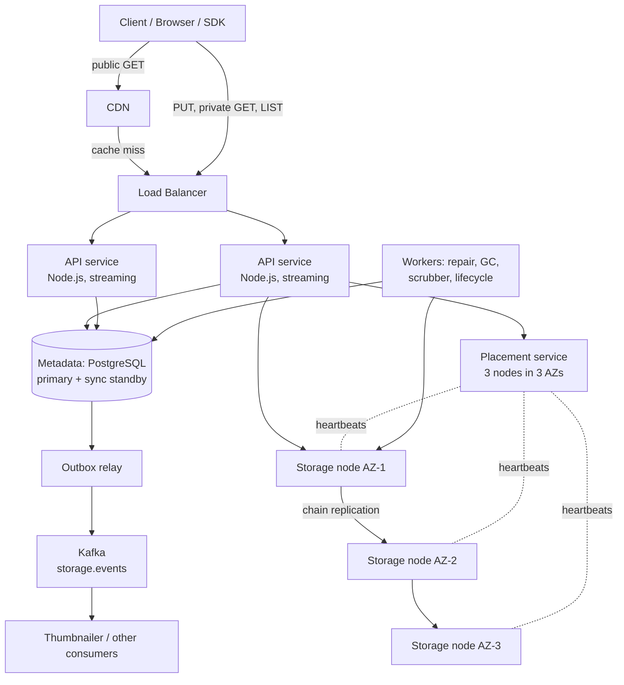

# File Storage (S3-style) -- HLD + LLD (Part 1: Basics -> Requirements -> Estimation -> HLD)

> Is file mein prompt ke **Parts 1-6** hain: problem basics, requirements, clarifying questions, capacity estimation, HLD, aur har component ka WHY.
> Next file: request flows (single PUT, GET with Range, multipart, presigned URL), API design, metadata schema, LLD, Node.js streaming code line-by-line.
>
> **Pichhle systems se connection:** URL Shortener mein humne **IDs + metadata DB + CDN** dekha. Rate Limiter ab har API key ke PUT/GET ko limit karega. Payment System se do cheezein seedhi aayengi: **HMAC signatures** (ab request signing aur presigned URLs ke liye) aur **"fail closed on durability"** -- jab tak bytes safe nahi, "success" mat bolo. Aur repo ka lesson [2GB upload direct to S3](../../lessons/87-2gb-upload-direct-to-s3.md) yaad karo -- wahan humne **client side** se presigned URLs + multipart use kiye the. Ye system uska **server side** hai: S3 ke andar kya ho raha hai.
>
> **Honest note:** Asli AWS S3 isse bahut bada hai (exabytes, trillions of objects) aur uske internals sirf thode publicly described hain. Hum jo design karenge woh **interviewer jo expect karta hai** woh hai: "Design S3" -- ek object storage service. Ye **"Design Dropbox"** nahi hai (no folder sync, no collaborative editing).

---

## PART 1 -- Problem ko bilkul basic se samjho

### Ek kahani se shuru karte hain

ShopKart (wahi e-commerce company jiska rate limiter aur payment system humne banaya) ke paas bahut saari **files** hain:

- Product images (har product ki 5-10 photos)
- Invoices (PDF)
- Return-request ki photos aur videos jo customers upload karte hain
- Sellers ki bulk CSV files
- Database backups (har raat, kai GB)

Shuru mein ek developer ne sabse seedha kaam kiya -- **file Node server ki local disk par save kar do**:

```js
// GALAT (scale par) -- naive upload: file seedha server ki disk par
const multer = require('multer');
const upload = multer({ dest: '/uploads' });

app.post('/upload', upload.single('photo'), (req, res) => {
  res.json({ url: `/files/${req.file.filename}` });  // file ab sirf ISI server ki disk par hai
});
app.use('/files', express.static('/uploads'));
```

**Code Explanation:**

- `multer({ dest: '/uploads' })` -- har upload server ki **local disk** ke `/uploads` folder mein chala jaata hai.
- `upload.single('photo')` -- request ki body se ek file nikal ke disk par likh deta hai.
- `res.json({ url: ... })` -- client ko URL milta hai, lekin woh URL sirf **isi ek server** par kaam karega.
- `express.static('/uploads')` -- wahi server files serve bhi kar raha hai. Upload + serve + business logic, sab ek machine par.

Demo mein perfect. Ab production mein kya hua:

```
Day 1   : 1 server, sab theek.
Day 30  : traffic badha -> 2nd server add kiya, LB ke peeche.
          Priya ki photo server-A par upload hui.
          Support agent ki GET request server-B par gayi -> 404. "File nahi mili!"
Day 60  : server-A ki 500 GB disk 100% full -> naye uploads fail, logs bhi nahi likh rahe.
Day 75  : server-A ki disk crash -> us par ki 3 lakh photos HAMESHA ke liye gayi.
Day 90  : backup script raat bhar chalti hai, fir bhi poora nahi hota (TBs of files).
```

Team ne socha: "Chalo ek bada shared disk (NFS) laga dete hain, sab servers wahi mount karein."

```
server-A --+
server-B --+--> ek bada NFS server (100 TB)
server-C --+
```

Ye kuch mahine chala. Phir:

- NFS server down = **saare uploads aur downloads down** (single point of failure).
- NFS box ki disk capacity ki bhi limit hai -- 100 TB ke baad? Ek aur NFS? Ab kaunsi file kahan hai?
- NFS ki disk RAID par thi, lekin poora data center (ya rack ka power) gaya toh sab gaya.
- Directory mein 50 lakh files -> `ls` bhi minutes leta hai.

Dono approaches ki jadd ek hi hai:

> **Files ko kisi EK machine se baandh diya.** Machine ki disk, machine ki capacity, machine ki zindagi -- sab file ki zindagi ban gayi.

Hume chahiye ek aisa system jahan: koi bhi server kisi bhi file ko ek **naam (key)** se maang sake, capacity machines add karke badhe, aur ek-do machine (ya poora data center) mar jaaye toh bhi file safe rahe. Yahi **object storage** hai -- aur isi ka design hum banayenge, naam: **StoreBox**.

### Pehle kuch terms (ek-ek line mein, depth aage ke parts mein)

| Term | Simple matlab |
|---|---|
| **Object** | Ek file + uski info. **Object = key + bytes + metadata.** |
| **Bucket** | Objects ka ek container, jaise ek "account level folder". Naam globally unique (`shopkart-invoices`). |
| **Key** | Bucket ke andar object ka poora naam: `invoices/2026/09/inv_123.pdf`. |
| **Metadata** | Bytes ke baare mein info: size, content type, ETag, version, **aur bytes kahan pade hain**. |
| **Chunk** | Bade object ko 8 MB ke tukdon mein todte hain; har tukda ek chunk. |
| **Replica** | Same chunk ki copy, doosri machine par (hamare design mein 3 copies, 3 alag AZs). |
| **AZ (Availability Zone)** | Ek region ke andar alag data center -- alag power, alag network. Ek AZ gaya toh baaki chalte hain. |
| **Durability** | Data **lost na ho** -- saalon baad bhi byte-by-byte wahi mile. |
| **Availability** | Data **abhi** access ho sake. (Durable ho sakta hai lekin 5 min ke liye unavailable -- dono alag cheezein.) |
| **Presigned URL** | Time-limited signed URL -- browser bina API key ke directly upload/download kar sake. |
| **Multipart upload** | Badi file ko parts mein upload karo, parallel, aur fail hua part dobara bhejo. |

### File system vs Block storage vs Object storage

Interviewer aksar poochta hai: "Object storage aur file system mein farak kya hai?" Simple table:

| | **Block storage** | **File system** | **Object storage** |
|---|---|---|---|
| Example | AWS EBS, laptop ki raw disk | NFS, EFS, laptop ka `C:\` | S3, GCS, Azure Blob, MinIO, **StoreBox** |
| Unit | Fixed size blocks (e.g. 4 KB), sirf number se address | Files inside **folders** (tree) | **Objects** in a bucket, **flat** namespace |
| Access | OS/DB disk ki tarah use karta hai | `open`, `read`, `seek`, `rename` (POSIX) | HTTP: `PUT`, `GET`, `DELETE`, `LIST` |
| Update | Beech ka ek block badal sakte ho | File ke beech mein likh sakte ho | **Poora object replace** (immutable), beech mein edit nahi |
| Scale | Ek machine se attached | Ek server / cluster tak | Practically unlimited (PBs, billions of objects) |
| Best for | Database ki disk, VM boot disk | Shared code/config, legacy apps | Images, videos, backups, logs, data lake |

**Object ka simple matlab:** ek sealed parcel. Parcel par label (key + metadata), andar saamaan (bytes). Parcel khol ke ek cheez badal nahi sakte -- naya parcel bhejo, purana replace ho jaayega.

**Flat namespace ka simple matlab:** `invoices/2026/09/inv_123.pdf` mein `/` sirf key ka ek character hai. Andar koi "invoices" naam ka folder **exist nahi karta**. Jab tum `prefix=invoices/2026/&delimiter=/` se LIST karte ho, system bas un keys ko dhoondhta hai jo is prefix se shuru hoti hain aur `/` par group karke "folder jaisa" dikha deta hai. **Prefixes folders jaise dikhte hain, par folders nahi hain.** Isliye "folder rename" object storage mein har object ki copy + delete hai -- mehenga.

### Ye system actually karta kya hai?

**StoreBox ka simple matlab:** ek HTTP service jahan tum `PUT bucket/key` karke bytes rakhte ho aur `GET bucket/key` karke wahi bytes wapas paate ho -- **kabhi lost nahi** (11 nines durability), chahe machines, disks, ya poora AZ mar jaaye.

| StoreBox kya karta hai | Kya NAHI karta |
|---|---|
| Buckets create/delete, objects PUT/GET/HEAD/DELETE/LIST | Folder sync (Dropbox) ya Google Docs jaisi collaborative editing |
| Bade objects ke liye multipart upload (max ~1 TB) | Object ke beech mein edit (poora replace hota hai) |
| Presigned URLs -- browser direct upload/download | Image resize / video transcode (woh event sun ke doosri service karti hai) |
| Har chunk ki 3 copies 3 AZs mein, checksums, repair | Full-text search inside files (no Elasticsearch) |
| Versioning, lifecycle (COLD class, expiry) | POSIX file system (`rename`, `seek`-write, locks) |
| `object.created` / `object.deleted` events Kafka par | CDN khud nahi hai -- CDN iske aage baithta hai |

### Real life mein iska example kya hai?

- **AWS S3, Google Cloud Storage, Azure Blob Storage** -- public cloud object stores.
- **MinIO, Ceph (RADOS Gateway)** -- open-source, self-hosted S3-compatible stores. Companies apne data center mein yahi chalati hain.
- **Instagram / Flipkart ki product photos** -- CDN ke peeche aksar ek object store hota hai.
- **Database backups** -- `pg_dump` ki file raat ko S3 mein jaati hai (Payment System mein humne archival ke liye isi ka mention kiya tha).
- **Hamara lesson 87** -- 2 GB video browser se directly S3 par. Wahan hum S3 ke **customer** the; yahan hum **S3 bana rahe hain**.

### User kya request karega? System internally kya karega? Response kya milega?

**Flow 1 -- Single PUT (invoice PDF, 500 KB)**

```
Client:   PUT /v1/buckets/shopkart-invoices/objects/invoices/2026/09/inv_123.pdf
          Authorization: SBX1-HMAC-SHA256 Credential=<keyId>, SignedHeaders=..., Signature=<hex>
          Content-Length: 512000
          Content-Type: application/pdf
          <raw bytes>

System:   1. Signature verify, bucket exists?, size <= 100 MB?
          2. Placement service: "is chunk ke liye 3 nodes do, 3 alag AZs mein"
          3. Bytes stream karo primary node ko -> woh 2 replicas ko forward karta hai
             (har node CRC32C compute + fsync karke ack deta hai)
          4. 2 of 3 replicas ne fsync kar diya (W = 2) -> chunk durable
          5. EK metadata transaction: objects row + chunks + locations, is_latest flip, COMMIT
             -> commit hote hi object visible
          6. Outbox -> Kafka `storage.events`: object.created

Response: 200 OK
          { "etag": "\"9b2c...\"", "versionId": "01J8..." }
```

**Flow 2 -- GET with Range (video ka pehla 1 MB)**

```
Client:   GET /v1/buckets/shopkart-returns/objects/videos/ret_77.mp4
          Range: bytes=0-1048575

System:   1. Auth, metadata se latest version + chunk list + locations
          2. Sirf woh chunk(s) jo is range ko overlap karte hain (yahan chunk 0)
          3. Nearest healthy replica se padho, CRC32C verify, client ko stream karo

Response: 206 Partial Content
          Content-Range: bytes 0-1048575/734003200
          Accept-Ranges: bytes
          <1 MB bytes>
```

**Flow 3 -- Public product image (CDN hit)**

```
Browser:  GET https://cdn.shopkart.com/products/p_42/main.jpg
CDN:      cache mein hai -> turant de do. StoreBox tak request pahunchi hi nahi.
```

> **206 ka simple matlab:** "Poori file nahi, sirf maangi hui range bhej raha hoon." Video player isi se seek karta hai, aur download manager isi se resume.

### Ek simple real-world example

Wapas ShopKart par. Ab StoreBox laga hai:

- Priya ne return-request ki photo upload ki. App ne backend se ek **presigned PUT URL** liya aur photo **seedha StoreBox** ko bheji (lesson 87 wala pattern).
- StoreBox ne photo ki 3 copies 3 AZs mein rakhi, 2 ke fsync hote hi metadata commit kiya, `200` diya.
- `object.created` event Kafka par gaya -> thumbnail service ne chhoti photo bana di.
- Support agent ka request kisi bhi API instance par jaaye -- metadata DB bata deta hai bytes kahan hain. **404 wali problem khatam.**
- Raat ko AZ-2 ka ek rack jal gaya. Photo ki 2 copies AZ-1 aur AZ-3 mein safe; repair worker ne teesri copy naye node par bana di. Priya ko pata bhi nahi chala.

> StoreBox ek **bade warehouse + register** jaisa hai: register (metadata DB) mein likha hai "parcel `inv_123` -- rack 17 (building 1), rack 42 (building 2), rack 9 (building 3)". Parcel (bytes) teen alag buildings mein pade hain. Ek building jal jaaye, parcel phir bhi mil jaata hai. Register chhota hai aur tez; warehouse bahut bada aur sasta.

### Core insight (poora design isi par khada hai)

1. **Metadata ko data se alag karo.** Metadata (bucket, key, size, version, bytes kahan hain) chhota hai -- ~1 KB/object -- aur usse transactions, prefix search chahiye -> **database**. Data (bytes) bahut bada hai -> **storage nodes ki disks**.
2. **Data ko failure domains ke across replicate karo.** 3 copies, 3 alag AZs. Ek disk, ek machine, ek AZ -- kuch bhi jaaye, data bache.
3. **Metadata sabse last mein commit karo.** Pehle bytes durable, phir metadata commit. Commit = object visible. Beech mein crash hua toh object "exist hi nahi karta" -- aadhe objects kabhi dikhte nahi; bache hue orphan chunks GC saaf karta hai.

### Interview mein 30 seconds mein kya bolun?

> "Main S3 jaisa object storage design karunga -- buckets, flat keys, PUT/GET with Range, multipart aur presigned URLs. Core idea hai metadata ko data se alag karna. Metadata -- key, size, version aur bytes kis node par hain -- Postgres mein, jo scale par (bucket_id, key) range se shard hoga taaki prefix LIST fast rahe. Bytes 8 MB chunks mein storage nodes par jaate hain, har chunk ki 3 copies 3 alag AZs mein; 2 replicas fsync kar dein tab chunk durable, aur sab chunks durable hone ke baad hi ek metadata transaction commit hota hai -- wahi object visible hone ka moment hai, jisse strong read-after-write milta hai. Node.js API bytes ko stream karta hai, kabhi poori file memory mein nahi. Background mein repair, scrubber, garbage collector aur lifecycle worker chalte hain; purana data 8+4 erasure coding se COLD class mein jaata hai jisse cost aadhi hoti hai. Public reads CDN se."

---

## PART 2 -- Requirements

### Functional Requirements (system kya karega)

**Must-have (core):**

1. **Buckets** -- create / delete. Naam **globally unique** (`shopkart-invoices`). Non-empty bucket delete -> `409 BUCKET_NOT_EMPTY`.
2. **Objects** -- `PUT` (single upload **max 100 MB**), `GET` (HTTP `Range` support), `HEAD` (sirf headers), `DELETE`, `LIST` by prefix with pagination.
3. **Multipart upload** -- initiate, upload parts (**5 MB - 100 MB** har part, last part chhota ho sakta hai, **max 10,000 parts** -> max object ~1 TB), complete, abort.
4. **Presigned URLs** -- time-limited signed URL taaki browser/app bina hamari API key ke directly upload/download kare.
5. **Versioning (optional, per bucket)** -- purane versions rakho; DELETE ek **delete marker** banata hai (data turant nahi mitta).
6. **Lifecycle rules** -- 30 din se purane objects **COLD** storage class mein (erasure coded), N din baad expire, aur 7 din se adhoore multipart uploads abort.
7. **Event notifications** -- `object.created`, `object.deleted` doosri services ko (e.g. image thumbnailer).

> **Max object ~1 TB kaise?** 10,000 parts x 100 MB = 1,000,000 MB = ~1 TB. Single PUT 100 MB tak isliye kyunki 100 MB se badi file ek HTTP request mein bhejna risky hai -- 95% par connection toota toh sab dobara. Multipart mein sirf fail hua part dobara.

**Nice-to-have (interviewer se confirm karo):**

8. **Cross-region replication** -- doosre region mein async copy (disaster recovery). V2.
9. **Object lock / WORM** -- compliance ke liye "delete nahi ho sakta N saal". V2.
10. **Server-side encryption with customer keys (KMS)** -- V1 mein at-rest encryption hamari keys se.
11. **Static website hosting, byte-range writes, append** -- scope ke bahar.

> Interview tip: core 7 par design banao. "Dropbox wale features -- sync, sharing UI, collaborative editing -- out of scope" clearly bolo. Scope control dikhta hai.

### Non-Functional Requirements (system kaisa hona chahiye)

| Requirement | Simple meaning | Is system mein KYUN important hai? |
|---|---|---|
| **Durability (sabse upar): 99.999999999% (11 nines)** | Jo object ek baar `200` ke saath save hua, woh kabhi lost na ho | Storage system ka **ek hi vaada** hai: "tumhari file safe hai". Availability jaaye toh user 5 min wait karega; **durability jaaye toh data hamesha ke liye gaya** -- invoice, backup, customer ki photo. Iska koi "retry" nahi. |
| **Availability: 99.99% for reads** | System zyada time up rahe | ~4.3 min downtime/month. Product images na khulein toh poori ShopKart website toot jaati hai (har page par images). CDN + multiple replicas + stateless API isliye. |
| **Consistency: strong read-after-write** | PUT ka `200` mila toh agla GET/LIST naya data hi dikhaye | Seller ne CSV upload ki aur turant import job ne GET kiya -- purana version ya 404 mila toh galat import. S3 bhi **Dec 2020 se** PUT/DELETE/LIST par strong read-after-write deta hai (publicly announced). Hum metadata commit ko hi "visible" ka moment banate hain. |
| **Throughput for large objects** | GB-size files tez aur stable upload/download | Backups aur videos GBs ke hain. **Streaming**: bytes aate-aate aage bhejo, poori file kabhi RAM mein nahi (10 uploads x 2 GB = 20 GB RAM -- Node crash). Multipart se parallel parts. |
| **Scalability (PBs)** | Data aur traffic badhe toh machines add karke sambhale | Har saal **3.65 PB** logical data aata hai (Part 4). Koi ek machine ise nahi rakh sakti -- storage nodes horizontally add hote hain, metadata sharded. |
| **Cost efficiency** | Har GB sasta rakho | Storage ka bill disks ka bill hai. 3 copies = 3x disks. Purane data ke liye **erasure coding 8+4 = 1.5x** -- disks aadhi. Petabytes par ye crores ka farak hai. |
| **Security** | Sirf sahi log sahi object padh/likh sakein | Invoices mein customer ka naam, address, GST. Auth: API key + HMAC signature ya presigned URL. **TLS** in transit, **encryption at rest**. Ek galat public bucket = data leak headline. |
| **Low latency (small objects)** | Chhote objects ka pehla byte jaldi aaye | Product image page load ka hissa hai. Isliye public reads CDN se, aur metadata lookup ek index hit. Lekin ye **payment-style correctness** system hai durability par, latency secondary. |

### 11 nines ka matlab -- number se samjho

"99.999999999%" sunke dimaag ghoom jaata hai. Number mein todo:

```
Annual loss probability per object = 1 - 0.99999999999 = 0.00000000001 = 1e-11

Agar 10 billion (10B) objects store hain:
Expected objects lost per year = 10,000,000,000 x 1e-11 = 0.1 object/year

Matlab: ~10 saal mein 1 object lost (average).
```

Aur ShopKart har saal **~7.3B naye objects** daal raha hai (Part 4) -- toh 10B objects 1.5 saal mein ho jaayenge. Isliye 11 nines koi marketing number nahi, **zarurat** hai.

**Ye aata kahan se hai?** Koi ek disk itni reliable nahi (HDD saal mein ~1-2% fail hote hain, commonly quoted). Durability milti hai **combination** se:

- **3 replicas, 3 AZs** -- teeno ek saath marein, iska chance bahut kam.
- **Fast repair** -- node dead declare hote hi (10 min) uske chunks ki nayi copies. Jitna jaldi repair, utna kam window jismein doosri copy bhi mar jaaye.
- **Checksums + scrubber** -- "silent corruption" (disk bytes badal de, error na de) ko pakadna. Har read par CRC32C, aur scrubber sab kuch ~2 hafte mein padhta hai.
- **Metadata last** -- aadhe likhe objects kabhi visible nahi.

> Interview line: "Mera top NFR durability hai -- 11 nines, yaani 10 billion objects par saal mein ~0.1 object loss. Ye koi ek disk nahi deti; ye milti hai 3 AZs mein replication, fast repair, end-to-end checksums aur scrubbing ke combination se. Availability 99.99% reads ke liye, aur consistency strong read-after-write -- metadata commit hi visibility ka moment hai."

### Pichhle systems se comparison

| | URL Shortener | Rate Limiter | Payment System | File Storage |
|---|---|---|---|---|
| Galti ki cost | Ek link galat | Thodi extra requests | Paisa | **Customer ka data hamesha ke liye** |
| Top NFR | Read latency | Latency + availability | Correctness | **Durability** |
| Failure mode | Cache miss par DB | Fail open | Fail closed | **Fail closed on durability** (quorum nahi -> `200` nahi) |
| Data size | Chhota (GBs-TBs) | Tiny (counters) | TBs | **Petabytes** |
| Main store | Postgres + Redis | Redis | Postgres | **Postgres (metadata) + storage nodes (bytes)** |

---

## PART 3 -- Clarifying Questions

Architecture banane se pehle interviewer se ye poochho. Har answer design badalta hai.

| # | Question | Ye KYUN pooch raha hoon? | Answer design ko kaise badlega |
|---|---|---|---|
| 1 | S3 jaisa object storage, ya Dropbox jaisa file sync? | Dono bilkul alag problems | **Object storage** -> PUT/GET/LIST API. Sync = client agent, conflict resolution, alag interview |
| 2 | Kitne uploads/day? Average object size? | Ingest bandwidth, disks, metadata rows | 20M/day, avg 500 KB -> 10 TB/day logical |
| 3 | Size distribution? Max object size? | Chunking, multipart, memory | Mostly chhote images, kuch multi-GB -> 8 MB chunks, multipart, max ~1 TB |
| 4 | Read vs write ratio? Kitna public? | CDN chahiye ya nahi | 10:1, product images public -> **CDN** aage |
| 5 | Durability target? | Replicas, AZs, erasure coding | **11 nines** -> 3 AZs, checksums, repair |
| 6 | Consistency -- PUT ke turant baad GET naya dikhe? | Metadata design, replica reads | Strong read-after-write -> GET primary/sync standby se, async replica se nahi |
| 7 | Data kitne time rakhna hai? Purana kitna padha jaata hai? | Storage classes, cost | 30 din baad kam reads -> **COLD** (8+4 EC), expiry rules |
| 8 | Versioning chahiye? | Metadata model (one row vs many versions) | Optional per bucket -> `version_id` PK, `is_latest` flag, delete markers |
| 9 | Browser se direct upload? | API ke through bytes ya direct | Haan -> **presigned URLs** (lesson 87 ka server side) |
| 10 | Kaun si services ko "file aayi" batana hai? | Event fan-out | Thumbnailer, virus scan -> outbox + Kafka `storage.events` |
| 11 | Single region ya multi-region? | Replication design, latency | V1: single region, 3 AZs. Cross-region async = V2 |
| 12 | Multi-tenant? Per-customer limits? | Noisy neighbour, auth | API keys per team + **rate limit per key** (Rate Limiter system) |

### Size distribution wala question sabse important kyun?

- Agar **sab chhote** objects hain (avg 500 KB), toh problem hai **object count** -- billions of metadata rows. Metadata DB bottleneck banega.
- Agar **kuch bahut bade** hain (GB-TB), toh problem hai **streaming + multipart + resume** -- memory aur long-running connections.
- ShopKart mein **dono** hain. Isliye design mein dono ka jawab chahiye: sharded metadata + chunked streaming.

### Agar interviewer bole: "Assume 100 million users." -- kya badlega?

100M users, maan lo ~20% roz kuch upload karte hain (return photo, seller catalog image, invoice auto-generate) -> **20M uploads/day**. Yahi hamare estimation ke numbers hain (next part). Ab dekho kya badla:

| Area | Chhota scale (~10K uploads/day) | 100M users (20M/day, PBs) |
|---|---|---|
| Storage | Ek server ki disk / ek MinIO box | **Hazaron disks**, storage nodes 3 AZs mein, har saal ~548 naye 20 TB disks (3x) |
| Metadata | Ek Postgres table | Postgres primary + sync standby, **7.3B rows/year -> range sharding by (bucket_id, key)** |
| API | 1 Node instance | N stateless Node instances, streaming |
| Durability | Nightly backup | 3 AZ replication, W=2 quorum, repair worker, scrubber |
| Cost | Ignore | **Erasure coding 8+4** for COLD data -- disks aadhi |
| Reads | Direct | **CDN** (~28 Gbps peak egress) |
| Background | Kuch nahi | Repair, GC + compaction, scrubber, lifecycle, multipart cleanup workers |
| Observability | Logs | `chunks_under_replicated` (must trend to 0), disk usage, repair lag |

> **Key insight:** Payment System mein 100M users ka matlab sirf ~1,000 TPS tha aur architecture ka shape nahi badla. Yahan bhi request rate chhota hai (~1K PUT/s), lekin **bytes aur object count** bahut bade hain. **Is system mein scale ka matlab "zyada requests" nahi, "zyada bytes aur zyada objects" hai.**

> Interview line: "100M users par ~20M uploads/day hain -- sirf ~1,000 PUT/s peak, jo chhota hai. Lekin 10 TB/day yaani 3.65 PB/year logical data aata hai, aur 7.3 billion objects/year. Toh mera design request rate ke liye nahi, bytes aur object count ke liye scale karega: disks aur storage nodes horizontally, metadata DB range-sharded, aur cold data erasure coded."

---

## PART 4 -- Capacity Estimation

Goal wahi hai: **exact number nahi, order of magnitude**. Aur is system ka twist: **requests chhote, bytes bahut bade.**

**Assume (interviewer se confirm karo):**

- **100M users**, **20M uploads/day**
- Read:write = **10:1**
- Peak = **3x average**
- Average object = **500 KB** (zyada tar chhoti images, kuch multi-GB videos/backups)
- Metadata = **~1 KB per object** (object row + chunk rows)
- 1 din = 86,400 sec, decimal units (1 TB = 1,000 GB)

### Step 1 -- Writes: PUT/sec

```
Average PUT/s = 20,000,000 / 86,400 = 231.5  = ~231 PUT/s
Peak          = 231 x 3              = ~694 PUT/s
Plan for      = ~1,000 PUT/s  (headroom ke saath)
```

**Kahan useful hai?** ~1,000 PUT/s kuch khaas nahi -- ek chhota Node.js fleet aur ek Postgres primary (har PUT = ek metadata transaction) aaram se sambhal lete hain. Matlab: **request rate hamara bottleneck nahi hai.** Ye number API instances aur metadata DB ke commits/sec decide karta hai.

> Interview line: "20M uploads/day matlab ~231 PUT/s average, peak ~700, main ~1,000 PUT/s ke liye plan karunga -- ye chhota number hai."

### Step 2 -- Reads: GET/sec

```
Reads/day     = 20M x 10               = 200M GET/day
Average GET/s = 200,000,000 / 86,400   = ~2,315 GET/s
Peak          = 2,315 x 3              = ~6,944 GET/s
Plan for      = ~7K GET/s
```

**Kahan useful hai?** 7K/s bhi moderate hai. Lekin zyada tar GETs **public product images** hain -- inhe **CDN** serve karega, origin (StoreBox API) tak sirf ek fraction pahunchega (cache miss, private invoices, return videos). Har origin GET = ek metadata lookup + chunk reads -- ye metadata DB ke read load aur storage node ke disk IOPS mein count hota hai.

> Interview line: "10:1 read ratio se ~7K GET/s peak -- public images CDN se jaayengi, origin par sirf misses aur private objects."

### Step 3 -- Ingest bandwidth (yahan se numbers bade hone lagte hain)

```
Ingest/day = 20M x 500 KB = 10,000,000,000 KB = 10 TB/day (logical)
Per sec    = 10 TB / 86,400 = ~116 MB/s = ~0.93 Gbps average
Per year   = 10 TB x 365    = 3,650 TB = 3.65 PB/year (logical)
```

**Kahan useful hai?** ~116 MB/s average ek-do servers ki NIC bhi le sakti hai -- lekin yaad rakho, har byte **3 replicas** par bhi jaata hai (primary -> 2 replicas), toh internal network traffic ~3x hai. Aur ye bytes **API layer se stream** ho rahe hain -- isliye API **kabhi poori file buffer nahi karta**, warna RAM khatam. 3.65 PB/year batata hai ki koi ek machine ya ek NFS kabhi kaafi nahi hoga.

> Interview line: "Ingest 10 TB/day logical hai, ~116 MB/s average -- har saal 3.65 PB. Isliye bytes stream hote hain aur storage horizontally scale hota hai."

### Step 4 -- Raw storage aur disks (asli bada number)

```
3x replication (STANDARD):
  Raw/year = 3.65 PB x 3   = 10.95 PB/year
  Disks    = 10.95 PB / 20 TB per HDD = ~548 disks/year
  Per day  = 10 TB x 3 = 30 TB raw/day = ~1.5 naye disks ROZ

Erasure coding 8+4 (COLD, 1.5x overhead):
  Raw/year = 3.65 PB x 1.5 = ~5.5 PB/year
  Disks    = 5.475 PB / 20 TB = ~274 disks/year
```

**Kahan useful hai?** Ye **poore design ka sabse important number** hai. 3 copies ka matlab har saal ~548 naye 20 TB disks -- aadhe disks bachane ka seedha tareeka hai **erasure coding** (Part 3 mein depth mein). Isliye design mein do storage classes hain: naya data **STANDARD** (3x, fast reads, simple), 30 din se purana data **COLD** (8+4 EC, 1.5x, reads thode slow). Real systems mein disks kabhi 100% nahi bharte (headroom chahiye), toh asli count isse zyada hoga.

> **Erasure coding 8+4 ka simple matlab:** data ko 8 tukdon mein todo, unse 4 extra "parity" tukde calculate karo, 12 tukde 12 alag nodes par rakho. Koi bhi **8** tukde mil jaayein toh poora data wapas ban jaata hai -- matlab **koi bhi 4 tukde lost** ho jaayein toh bhi safe. Storage 12/8 = 1.5x, jabki 3 copies mein 3x (aur 3 copies sirf 2 losses sehti hain).

> Interview line: "3x replication par 3.65 PB logical ka matlab ~11 PB raw per year, yaani ~548 twenty-TB disks. Isliye purane data ko 8+4 erasure coding par le jaata hoon -- 1.5x overhead, ~274 disks, aur 4 failures tak survive."

### Step 5 -- Egress bandwidth (reads)

```
Egress/day = 200M GET x 500 KB = 100 TB/day
Per sec    = 100 TB / 86,400   = ~1.16 GB/s = ~9.3 Gbps average
Peak       = 9.3 x 3           = ~28 Gbps
```

**Kahan useful hai?** 28 Gbps peak origin se serve karna = bahut saare servers + bada network bill. Public images ke liye **CDN** aage rakhte hain -- edge par cache, origin par sirf misses. Example: agar CDN ~80% bytes serve kare, toh origin par ~5.6 Gbps peak bachega (ye hit ratio sirf assumption hai, real mein measure karna padta hai). Ye wahi pattern hai jo URL Shortener mein dekha tha -- hot, public, rarely-changing data CDN par.

> Interview line: "Egress 100 TB/day, ~9 Gbps average aur ~28 Gbps peak -- isliye public objects CDN ke peeche. Private objects presigned URLs se."

### Step 6 -- Metadata size aur object count

```
Metadata/day   = 20M x 1 KB        = 20 GB/day
Metadata/year  = 20 GB x 365       = 7.3 TB/year
Objects/year   = 20M x 365         = 7.3 billion objects/year
```

**Kahan useful hai?** Ye doosra important number hai. Bytes 3.65 PB hain lekin metadata sirf 7.3 TB -- **~500x chhota**. Yahi "metadata aur data alag karo" ka proof hai: chhoti cheez fast DB mein, badi cheez sasti disks par. Lekin **7.3B rows/year** ek Postgres table ke liye bahut hai (index bade, vacuum slow, ek primary ki write + storage limit). Isliye metadata DB ko **eventually shard** karna padega -- **range of (bucket_id, key)** se, taaki `LIST prefix=invoices/2026/` ek ya kuch hi shards par chale.

> Interview line: "Metadata ~1 KB per object hai -- 7.3 TB aur 7.3 billion objects per year. Bytes ke saamne chhota hai, lekin row count itna hai ki metadata DB ko (bucket_id, key) range se shard karna padega."

### Step 7 -- Chunks

```
CHUNK_SIZE = 8 MB
500 KB object -> 1 chunk
1 GB object   -> 1024 MB / 8 MB = 128 chunks
Max object ~1 TB -> ~1.2 lakh chunks
```

**Kahan useful hai?** Zyada tar objects (images) **1 chunk** hain -- toh ek PUT = ek chunk write x 3 replicas + ek metadata transaction. Bade objects ke chunks alag-alag nodes par ja sakte hain -> parallel reads, aur ek node par poori 1 TB file ka load nahi. Chunk hi repair, checksum aur placement ki unit hai. Chunk ko bade **1 GB append-only volume files** mein pack karte hain -- warna billions of chhoti files se node ka file system hi toot jaata.

### Step 8 -- Memory (Node.js streaming kyun zaroori)

```
Galat (buffer):  1,000 concurrent uploads x 100 MB = 100 GB RAM   -> impossible
Sahi (stream):   1,000 concurrent uploads x ~8 MB chunk buffer = ~8 GB across the fleet
                 (aur backpressure se aur bhi kam)
```

**Kahan useful hai?** Yahi wajah hai ki API layer **stream** karta hai (`stream.pipeline`) aur kabhi `req.body` mein poori file nahi rakhta. Lesson 87 mein bhi yahi point tha -- "2 GB per upload in memory, 10 uploads = 20 GB".

### Summary table

| Metric | Value | Design decision |
|---|---|---|
| Writes | 20M/day, ~231 avg, ~694 peak -> **plan ~1,000 PUT/s** | Chhota; N stateless Node instances, one metadata txn per PUT |
| Reads | 200M/day, ~2,315 avg, ~6,944 peak -> **plan ~7K GET/s** | CDN for public; origin sees fraction |
| Ingest | **10 TB/day**, ~116 MB/s (~0.93 Gbps) | Streaming, never buffer; 3x internal replication traffic |
| Logical storage | **3.65 PB/year** | Horizontal storage nodes |
| Raw storage | ~10.95 PB/yr (3x) vs ~5.5 PB/yr (EC 8+4) | **~548 vs ~274 disks/yr** -> COLD class erasure coded |
| Egress | 100 TB/day, ~9.3 Gbps avg, **~28 Gbps peak** | **CDN** in front of public reads |
| Metadata | ~1 KB/object -> **7.3 TB/yr, 7.3B objects/yr** | Postgres now, **range-shard by (bucket_id, key)** later |
| Chunks | 8 MB; 500 KB = 1 chunk; 1 GB = 128 chunks | Unit of placement, replication, repair |
| Durability | 10B objects x 1e-11 = **~0.1 lost/yr** | 3 AZs, W=2, repair, scrubber |

### Interview mein kaise bolun (short)

> "20M uploads per day matlab ~231 PUT/s average, main ~1,000 PUT/s aur ~7K GET/s peak ke liye plan karunga -- request rate chhota hai. Asli scale bytes ka hai: 500 KB average se 10 TB/day, yaani 3.65 PB/year logical. 3x replication par ~11 PB raw aur ~548 twenty-TB disks per year; isliye 30 din se purana data 8+4 erasure coding par -- 1.5x, disks aadhi. Egress ~28 Gbps peak hai, isliye CDN. Metadata sirf 1 KB per object hai, lekin 7.3 billion objects per year -- isliye metadata DB ko (bucket_id, key) range se shard karunga. Toh is system mein bytes aur disks dominate karte hain, requests nahi."

---

## PART 5 -- HLD (High-Level Design)

### Step 1: Sabse simple design (aur woh kyun toot jaata hai)

```
Client -> LB -> Node API (x2) -> local disk /uploads      (story wala design)
Client -> LB -> Node API (x2) -> ek NFS server           (story ka "fix")
```

| Problem | Kya hota hai |
|---|---|
| File ek machine par | Doosre server ko dikhti nahi (404), machine mari toh file gayi |
| Capacity ek machine ki | Disk full = uploads band |
| NFS = SPOF | NFS down = sab down |
| Ek hi copy / ek hi data center | Durability 11 nines ke aas-paas bhi nahi |
| Bytes RAM mein buffer | Bade uploads par Node OOM crash |
| Metadata = file system | "Kaunsi file kahan, kitni badi, kaunsa version" -- 50 lakh files ki directory par `ls` slow |

### Step 2: Har problem ke liye ek piece add karo

| Problem | Fix | Component |
|---|---|---|
| "Kaunsi file kahan hai?" | Alag register -- key -> size, version, chunk locations | **Metadata service (Postgres)** |
| Capacity ek machine ki | Bahut saari machines, har ek par disks | **Storage (data) nodes** |
| Kaunse nodes par naya chunk rakhein? | Capacity-aware, 3 alag AZs | **Placement service** (+ heartbeats) |
| Machine / AZ gaya toh data gaya | 3 replicas, 3 AZs, W=2 quorum | Replicated writer + **repair worker** |
| Silent disk corruption | CRC32C har chunk par, periodic re-read | **Scrubber worker** |
| RAM mein poori file | Stream, 8 MB chunks, backpressure | **Stateless Node.js API** (streaming) |
| Browser upload hamari API key ke bina | Signed, time-limited URL | **Presigned URLs** (HMAC) |
| 28 Gbps public reads | Edge cache | **CDN** |
| Thumbnailer ko batana | Event, DB ke saath atomically | **Outbox + Kafka `storage.events`** |
| Deleted/orphan bytes disk par pade | Baad mein reclaim | **GC + volume compaction** |
| 3x ka bill | Purane data ko sasta rakho | **Lifecycle worker** -> COLD (EC 8+4) |
| Ek team saara bandwidth kha jaaye | Per-key limit | **Rate limit** (Rate Limiter system) |

### Step 3: Final architecture diagram

```
   Client / Browser / SDK
        |                         \
        | (private, PUT, LIST)     \ (public GETs only)
        v                           v
       LB  <------ origin ------   CDN
        |
   +----+-------------+-------------+
   v                  v             v
 API svc           API svc       API svc      (stateless Node.js, N instances)
   |  - auth: API key + HMAC signature / presigned URL verify
   |  - rate limit per API key
   |  - streams bytes client <-> storage nodes (never buffers whole object)
   |
   +--> Metadata service: PostgreSQL primary + sync standby
   |       (buckets, objects, object_chunks, chunk_locations, multipart_uploads, upload_parts, lifecycle_rules)
   |       (range-sharded by (bucket_id, key) at scale)
   |
   +--> Placement service: "3 nodes, 3 AZs" per chunk; node heartbeats every 5 s
   |
   +--> Storage (data) nodes
   |       AZ-1: node-az1-001 .. node-az1-NNN   (HDDs, 1 GB append-only volumes)
   |       AZ-2: node-az2-001 .. node-az2-NNN
   |       AZ-3: node-az3-001 .. node-az3-NNN
   |       primary node -> forwards to 2 replicas (chain), CRC32C + fsync before ack
   |
   +--> Kafka: storage.events (object.created / object.deleted), storage.repair, storage.gc
                    |
                    +--> thumbnailer, virus scan, other consumers

   Background workers (Node.js):
     repair (re-replicate), erasure-coding / lifecycle (-> COLD), GC + volume compaction,
     scrubber (verify checksums ~every 2 weeks), multipart cleanup (> 7 days)
```



> Dhyan do: **bytes aur metadata alag raaston par chalte hain.** Bytes: client -> API -> storage nodes. Metadata: API -> Postgres. Postgres mein **ek bhi byte of file data nahi** jaata -- sirf "kahan pada hai".

> **Redis diagram mein nahi hai.** V1 mein uski zarurat nahi (Part 6 mein WHY). Elasticsearch bhi nahi -- LIST ek prefix range scan hai.

### Har component ka kaam (Hinglish mein)

**1. Client / Browser / SDK**
Backend services (ShopKart ki invoice service) API key + HMAC signature ke saath call karti hain. Browser/mobile ke paas API key nahi hoti -- woh apne backend se **presigned URL** leta hai aur seedha StoreBox ko PUT/GET karta hai. Bade files ke liye SDK multipart use karta hai: parts parallel mein, fail hua part dobara.

**2. CDN**
Sirf **public GETs** ke liye (product images). Edge par cache karta hai; miss par origin (hamara LB -> API) se laata hai. 28 Gbps peak egress ka bada hissa yahi sambhalta hai. Private objects (invoices) CDN par cache nahi -- woh presigned URL se aate hain.

**3. Load Balancer**
Traffic N API instances mein baantta hai, TLS terminate karta hai, health checks. Bade uploads long-lived connections hain -- LB ka idle timeout itna hona chahiye ki 100 MB ka PUT beech mein na kate.

**4. API service (stateless Node.js)**
Dil hai system ka, lekin **dimaag nahi rakhta** (stateless). Kaam:

- **Auth**: `SBX1-HMAC-SHA256` signature verify ya presigned URL verify (Payment System ka HMAC yaad karo).
- **Rate limit per API key** -- Rate Limiter system se.
- **Streaming**: request body ko 8 MB chunks mein kaat ke storage nodes ko bhejna, GET mein chunks padh ke client ko -- backpressure ke saath.
- **Metadata commit**: sab chunks durable hone ke baad ek transaction.

Node.js yahan fit hai kyunki kaam **I/O aur streaming** hai -- CPU kam, wait zyada.

**5. Metadata service (PostgreSQL)**
StoreBox ka **register**. Tables: `buckets`, `objects`, `object_chunks`, `chunk_locations`, `multipart_uploads`, `upload_parts`, `lifecycle_rules`. Ek PUT ka commit ek transaction mein: naya `objects` row (naya `version_id`), uske chunks, locations, aur purane version ka `is_latest` false. **Commit = object visible.** Primary + **synchronous** standby, taaki failover par committed metadata lost na ho. GET-after-PUT ke liye reads primary ya sync standby se -- async replica se kabhi nahi.

**6. Placement service**
"Is naye chunk ko kahan rakhein?" -- 3 nodes deta hai, **3 alag AZs** mein, jinki disk mein jagah hai (capacity-aware). Har storage node isko **har 5 sec heartbeat** bhejta hai; 10 min se zyada gayab node = dead -> repair shuru. Ye **membership** ka source hai: kaun zinda, kaun full, kaun kis AZ mein.

**7. Storage (data) nodes**
Bahut saari machines, har ek mein bahut saare HDDs. Chunks ko alag-alag files mein nahi, balki **1 GB append-only volume files** mein pack karte hain + ek local index: `chunk_id -> (volume, offset, length, crc32c)`. Write par: primary node bytes leta hai, disk par likhta hai aur saath-saath next replica ko forward karta hai (**chain replication**); har node CRC32C compute karke **fsync** karta hai, tab ack. Honest note: real data nodes aksar Go/Rust/C++ mein hote hain (disk aur memory par control ke liye); hum Part 2 mein ek simplified Node.js data node dikhayenge.

**8. Kafka (`storage.events`, `storage.repair`, `storage.gc`)**
`object.created` / `object.deleted` events outbox ke through publish -- thumbnailer, virus scanner, search indexer sunte hain. `storage.repair` par "is chunk ki copy kam hai" tasks, `storage.gc` par cleanup tasks.

**9. Background workers (Node.js)**

- **Repair**: under-replicated chunks (W=2 ke baad teesri copy baaki, ya node mar gaya) ki nayi copy banata hai.
- **Lifecycle / erasure coding**: 30 din se purane objects ko 8+4 EC mein convert karke COLD class; expiry; 7 din purane adhoore multipart abort.
- **GC + compaction**: delete hue objects ke bytes aur orphan chunks (24 h se purane, kisi object se linked nahi) reclaim; jis volume mein > 30% garbage ho use rewrite.
- **Scrubber**: saara data periodically (~har 2 hafte) padh ke CRC32C verify; corrupt chunk -> repair.

---

## PART 6 -- Har Component ka WHY

> Rule: koi bhi component tabhi add karo jab uska reason bol sako. Is system mein "sab kuch" lagane ka man karta hai (Redis, Elasticsearch, Cassandra...). Soch ke design karo -- aur jo nahi chahiye woh clearly bolo.

### Component: CDN

- **Kya hai?** Duniya bhar ke edge servers jo public files cache karte hain, user ke paas.
- **Kyun use kar rahe hain?** Egress ~28 Gbps peak hai aur zyada tar product images hain -- public, baar-baar padhi jaane wali, rarely change. Edge se serve = user ke liye fast, origin par load aur bandwidth bill dono kam.
- **Agar hata dein toh?** Har image request StoreBox tak -- zyada API instances, zyada disk reads, zyada network, aur door ke users ke liye slow pages.
- **Kab zarurat nahi?** Agar data mostly **private** hai (backups, invoices) ya reads kam hain. Backup-only storage ke liye CDN bekaar.
- **Interview mein kaise explain karun?** "Public objects ke liye CDN, kyunki egress 28 Gbps peak hai aur product images hot aur immutable hain. Private objects CDN par nahi -- presigned URLs se direct."

### Component: Load Balancer

- **Kya hai?** Traffic police -- requests N API instances mein baantta hai.
- **Kyun use kar rahe hain?** Multiple instances = ek crash ho toh baaki chalein (99.99% reads). Deploys bina downtime.
- **Agar hata dein toh?** Ek API server = SPOF, aur uski NIC saara ingest traffic nahi sambhal payegi.
- **Kab zarurat nahi?** Ek-box MinIO setup (chhota internal use). Production mein hamesha.
- **Interview mein kaise explain karun?** "LB ke peeche stateless Node instances. Upload long connections hain, isliye idle timeouts dhyan se set karta hoon."

### Component: API service (stateless Node.js)

- **Kya hai?** Express 5 / plain `http` streams par Node.js service: auth, validation, rate limit, chunking, streaming, metadata commit.
- **Kyun use kar rahe hain?** Client ko storage nodes, placement, chunks -- kuch nahi pata hona chahiye. Ek simple HTTP API (`PUT bucket/key`) ke peeche saari complexity chhupti hai. Node.js ka event loop hazaron concurrent streams ko thread-per-request ke bina sambhal leta hai.
- **Agar hata dein toh?** Clients ko seedha nodes se baat karni padegi -- har client mein placement, replication, retry logic. Security bhi gayi (nodes internet par).
- **Kab zarurat nahi?** Kabhi nahi -- ye system ka front door hai. Chhote scale par 1-2 instances.
- **Interview mein kaise explain karun?** "API layer stateless hai aur bytes ko stream karta hai -- kabhi poori file memory mein nahi, `stream.pipeline` se backpressure. Saara state metadata DB mein hai, isliye koi bhi instance koi bhi request le sakta hai."

### Component: Metadata DB (PostgreSQL)

- **Kya hai?** Relational DB jo har object ki info rakhta hai -- bytes nahi, sirf "kya hai aur kahan hai".
- **Kyun use kar rahe hain?** (1) **Transaction** -- object row + chunks + locations + `is_latest` flip ek commit mein; commit hi visibility, isliye strong read-after-write. (2) **Unique partial index** `(bucket_id, key) WHERE is_latest` -- ek key ka ek hi latest version (URL Shortener wala unique constraint lesson). (3) **B-tree ordered scan** -- `LIST prefix=invoices/2026/` ek range scan hai, sorted keys, cursor pagination.
- **Agar hata dein toh?** Metadata storage nodes par bikhra rahega -- "kaunsi key kahan" dhoondhne ke liye sab nodes se poochho. LIST impossible, versioning impossible, consistency gayi.
- **Kab zarurat nahi?** Bahut chhote single-box stores (jaise basic MinIO) metadata file ke saath hi rakh lete hain. Lekin billions of objects + LIST + versioning ke liye alag metadata store chahiye.
- **Scale par kya?** 7.3B rows/year -> **range sharding by (bucket_id, key)**. Range isliye kyunki prefix LIST ek-do shards par chalta hai; hash sharding load barabar baantti hai lekin har LIST ko **saare shards** par fan-out karna padta. Hot prefix aaye toh range split. Alternatives: FoundationDB / TiKV / Cassandra-jaise KV stores (Part 4 mein).
- **Interview mein kaise explain karun?** "Metadata Postgres mein, kyunki mujhe object + chunks + is_latest flip ek transaction mein chahiye aur prefix LIST ke liye ordered index. Data kabhi DB mein nahi. 7 billion objects per year ke baad (bucket_id, key) range se shard karunga taaki LIST ek shard par rahe."

### Component: Placement service

- **Kya hai?** Chhota service jo batata hai "naya chunk kin 3 nodes par jaaye" aur heartbeats se node membership rakhta hai.
- **Kyun use kar rahe hain?** Random node choose karo toh teeno copies ek hi AZ mein ja sakti hain (AZ gaya = data gaya), ya full disk wale node par. Placement ensure karta hai: **3 alag AZs, jagah wale nodes**, aur naye khaali nodes par zyada load (balancing).
- **Agar hata dein toh?** Har API instance ko khud saare nodes ki health aur capacity pata honi chahiye -- inconsistent decisions, dead node par writes, ek AZ mein saari copies.
- **Kab zarurat nahi?** Bahut chhote cluster mein static config ("ye 3 nodes") ya consistent hashing kaafi. Lekin capacity-aware + AZ-aware placement scale par zaroori.
- **Interview mein kaise explain karun?** "Placement service har chunk ke liye 3 nodes 3 AZs mein deta hai, capacity dekh ke. Nodes har 5 sec heartbeat bhejte hain; 10 min se gayab node dead declare hota hai aur repair shuru."

### Component: Storage (data) nodes

- **Kya hai?** Disks wali machines jo chunks ko 1 GB append-only volume files mein rakhti hain, local index ke saath.
- **Kyun use kar rahe hain?** Bytes ka ghar. Horizontal scale: capacity chahiye -> nodes add karo. **Append-only volumes** kyun? Billions of chhoti files se file system ka inode/directory overhead maar deta hai; ek badi file mein append sequential disk write hai (HDD ke liye sabse fast).
- **Agar hata dein toh?** Bytes kahan rakhein? DB mein 3.65 PB/year -- impossible aur bahut mehenga.
- **Kab zarurat nahi?** Agar tum khud S3 **use** kar rahe ho (99% companies) -- tab ye AWS ka problem hai. "Design S3" interview mein hamesha.
- **Interview mein kaise explain karun?** "Data nodes chunks ko badi append-only volume files mein likhte hain aur ek local index rakhte hain. Har write par CRC32C aur fsync ke baad hi ack. Deletes turant bytes nahi mitaate -- GC aur compaction baad mein space reclaim karte hain."

### Component: Replication (3 AZs, W = 2)

- **Kya hai?** Har chunk ki 3 copies, 3 AZs mein; **2 copies fsync** hote hi chunk durable maana jaata hai, teesri async ya repair worker se.
- **Kyun use kar rahe hain?** Durability (11 nines) ka base. W=2 isliye: W=3 mein ek slow/dead node poora upload rok deta (latency + availability kharab); W=1 mein ek hi copy par `200` dena -- woh disk mari toh data gaya. **W=2 = 2 alag AZs mein data, aur ek node ka slow hona upload nahi rokta.**
- **Agar hata dein toh?** Ek copy = ek disk failure = data loss. 11 nines kabhi nahi.
- **Kab zarurat nahi?** Dev/test ya re-creatable data (cache, thumbnails jo dobara ban sakte hain) -- wahan 1 copy chal jaati hai.
- **Interview mein kaise explain karun?** "Write quorum 2 of 3 -- 2 AZs mein fsync hone par hi `200`. Quorum na mile toh fail karta hoon -- durability par fail closed, jaise Payment System mein correctness par tha."

### Component: Kafka + outbox

- **Kya hai?** Metadata commit ke saath hi `outbox` row, relay use `storage.events` par bhejta hai. Plus `storage.repair` aur `storage.gc` task topics.
- **Kyun use kar rahe hain?** Thumbnailer ko "nayi image aayi" batana hai. Commit ke baad direct Kafka publish karein aur beech mein crash ho -> event lost -> thumbnail kabhi nahi bana (Payment System ka **dual write problem**, same fix). Repair/GC tasks bhi durable queue mein chahiye, memory mein nahi.
- **Agar hata dein toh?** Consumers ko poll karna padega ("kya naya aaya?") -- mehenga aur slow. Ya events lost.
- **Kab zarurat nahi?** Koi consumer nahi (sirf backup storage) -- tab events off. Kafka ki jagah SQS/RabbitMQ bhi theek hain.
- **Interview mein kaise explain karun?** "Events transactional outbox se -- metadata commit ke saath atomically, relay Kafka par bhejta hai, consumers idempotent. Repair aur GC ke tasks bhi Kafka topics par."

### Component: Background workers (repair, scrubber, GC, lifecycle)

- **Kya hai?** Node.js workers jo "safai aur maintenance" karte hain -- foreground request path se bahar.
- **Kyun use kar rahe hain?**
  - **Repair** -- disks roz marte hain (hazaron disks par ye normal hai). Jitna jaldi re-replicate, utna kam risk. `chunks_under_replicated` metric hamesha 0 ki taraf.
  - **Scrubber** -- **silent corruption** (bit rot) sirf padhne par pakdi jaati hai. Jo data koi nahi padhta, woh chupke se kharab ho sakta hai. Scrubber sab ~2 hafte mein padhta hai.
  - **GC + compaction** -- delete sirf metadata mein turant hota hai; bytes baad mein reclaim. Bina GC ke disks deleted data se bhar jaayengi.
  - **Lifecycle** -- 30 din baad COLD (EC 8+4), expiry, adhoore multipart cleanup. Bina iske disks ka bill 2x.
- **Agar hata dein toh?** Durability dheere-dheere girti hai (copies kam hoti jaati hain), disk full, bill badhta. Ye workers hi 11 nines ko **lambe time tak** 11 nines rakhte hain.
- **Kab zarurat nahi?** Chhote scale par ek cron job kaafi. Lekin repair + scrubber ke bina durability claim hi nahi kar sakte.
- **Interview mein kaise explain karun?** "Durability sirf write time par nahi milti -- repair worker lost copies wapas banata hai, scrubber silent corruption pakadta hai, GC space reclaim karta hai, aur lifecycle purana data erasure coding par le jaata hai."

### Component: Presigned URLs + HMAC auth

- **Kya hai?** URL mein `X-Sbx-KeyId`, `X-Sbx-Expires`, `X-Sbx-Signature` -- server HMAC se verify karta hai ki URL hamari key se sign hua aur expire nahi hua.
- **Kyun use kar rahe hain?** Browser ko API secret nahi de sakte. Lekin 2 GB video ShopKart ke backend se hoke nahi aana chahiye (lesson 87: RAM, double bandwidth). Presigned URL = "ye ek object, ye ek method, itne time tak -- direct aao".
- **Agar hata dein toh?** Ya toh har upload app backend se proxy (mehenga), ya secret key browser mein (disaster).
- **Kab zarurat nahi?** Sirf server-to-server use (backups) -- tab normal signed requests kaafi.
- **Interview mein kaise explain karun?** "Clients ke liye presigned URLs -- HMAC-SHA256 signature with expiry, max 7 din. Server-to-server calls poori request sign karti hain, 15 min clock skew limit ke saath."

### Components jinki zarurat NAHI hai (V1 mein)

| Component | Kyun nahi? |
|---|---|
| **Redis (V1)** | Metadata ka source of truth Postgres hai (transactions, strong consistency). Request rate chhota hai (~1K PUT/s, origin GETs aur bhi kam) -- Postgres index lookup kaafi. **"Yahan initially iski zarurat nahi hai."** Baad mein optional chhota cache: bucket metadata / auth lookups / hot object metadata, short TTL -- **kabhi source of truth nahi** (stale metadata = purana version serve = read-after-write toota). |
| **Elasticsearch** | LIST sirf **prefix range scan** hai -- Postgres B-tree `(bucket_id, key)` par. Full-text search inside files requirement hi nahi. Chahiye toh `storage.events` sunke alag search system -- core path par nahi. |
| **Bytes in the database** | 3.65 PB/year Postgres mein? Backup, replication, vacuum sab mar jaayenge. DB mein sirf metadata. |
| **Distributed file system (HDFS / NFS)** | POSIX semantics (rename, locks, seek-write) chahiye hi nahi -- objects immutable hain. NFS ka SPOF story mein dekh liya. |
| **Distributed locks on data nodes** | Concurrent PUTs same key par -- **last writer wins by metadata commit order**. Har PUT ka apna `version_id`; lock ki zarurat nahi. |
| **MongoDB for metadata** | Multi-row transaction (object + chunks + is_latest flip) aur ordered prefix scans chahiye. Postgres natural fit. Scale par KV stores (FoundationDB/TiKV) discuss karo, Mongo nahi. |
| **Microservices explosion** | API, metadata, placement, workers kaafi hain. Har worker ko alag service + alag DB banana V1 mein overhead. |
| **Multi-region active-active** | V1 single region, 3 AZs. Cross-region replication async, V2. |

### Final component checklist

| Component | MVP mein? | Scale par? | Reason |
|---|---|---|---|
| LB | Yes | Yes | HA, spread ingest |
| API service (Node.js, streaming) | 1-2 instances | N stateless instances | Auth, chunking, streaming |
| Metadata (Postgres) | Single + sync standby | **Range-sharded by (bucket_id, key)** | Transactions, prefix LIST, visibility |
| Placement service | Simple (static node list) | Capacity + AZ aware, heartbeats | Correct replica spread |
| Storage nodes | 3 nodes, 3 AZs | Thousands of disks | Bytes |
| Replication W=2 of 3 | Yes | Yes | Durability |
| Repair + scrubber | Cron | Continuous workers + metrics | Keep 11 nines over time |
| GC + compaction | Cron | Workers | Reclaim space |
| Lifecycle / EC 8+4 | Maybe later | Yes | Cost (1.5x vs 3x) |
| Kafka + outbox | Outbox + poller | Kafka topics | Events, repair/GC tasks |
| CDN | If public reads | Yes | 28 Gbps egress |
| Presigned URLs | Yes | Yes | Direct browser uploads |
| Redis / Elasticsearch / Mongo | No | Redis optional cache only | Not needed |

---

## Remember

> **Object storage = "metadata ko data se alag karo".** Chhota register (Postgres: key, version, size, chunks kahan hain) aur bada warehouse (storage nodes: 8 MB chunks, 3 copies, 3 AZs). Pehle bytes durable karo (W = 2 of 3, fsync, CRC32C), **phir** ek metadata transaction commit karo -- commit hi object ke visible hone ka moment hai. Requests chhote hain (~1K PUT/s), **bytes aur object count** bade hain (3.65 PB aur 7.3B objects per year) -- isliye disks, erasure coding, CDN aur metadata sharding design ko drive karte hain. Durability ek baar nahi milti -- repair, scrubber aur GC usse roz bachate hain.

## Quick Self-Test (answers baad mein check karna)

1. Multer se local disk par upload wala design do servers hote hi kyun toot jaata hai? Aur "ek bada NFS" usse kaise better hai, aur kahan fail hota hai?
2. 11 nines durability ka matlab 10 billion objects par kitne objects per year lost? Ye durability kin 4 mechanisms ke combination se aati hai?
3. 20M uploads/day aur 500 KB average se ingest/day, logical PB/year, aur 3x vs 8+4 par 20 TB disks per year calculate karo. Isse kaunsa design decision nikalta hai?
4. PUT flow mein metadata **sabse last** mein kyun commit hota hai? Agar metadata pehle commit karte aur phir chunk write fail hota toh GET par kya hota?
5. Metadata DB ko hash se shard karne ke bajaye (bucket_id, key) range se kyun shard karte hain? Range sharding ka nuksaan kya hai aur usse kaise handle karte hain?

---

**Next (Part 2):** Request flows (single PUT, GET with Range, multipart, presigned URL), API design, metadata schema, LLD, Node.js streaming code line by line. "next" bolo.
