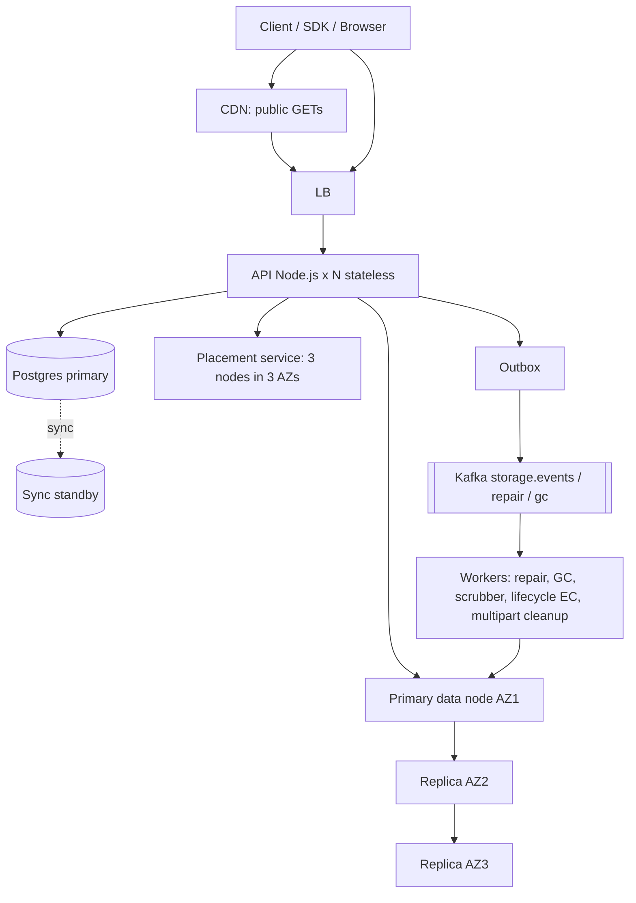
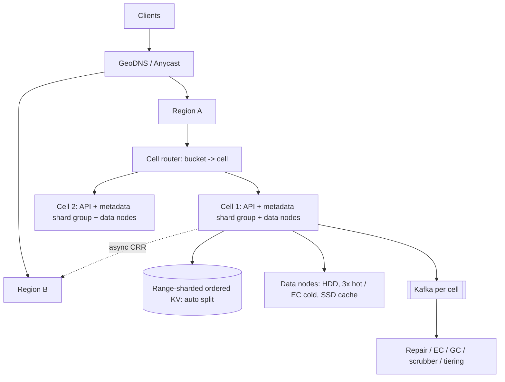

# File Storage (S3-style) -- HLD + LLD (Part 5: Trade-offs -> 3 Versions -> Follow-ups -> Node.js Questions)

> Is file mein prompt ke **Parts 21-25** hain: StoreBox ke har major decision ka trade-off, MVP -> Scalable -> Highly Scalable versions, 17 interviewer follow-up questions, requirement change ("What if...") questions, aur Node.js specific questions -- sab isi ShopKart ke S3-style object store se jude hue.
> Part 4 recap: humne dekha ki scale par pehle kya tootta hai (metadata DB, hot prefixes, repair traffic), disk / node / AZ fail hone par kya hota hai (W=2 ack, repair worker, `chunks_under_replicated` jo 0 ki taraf jaana chahiye), consistency kahan strong chahiye (metadata commit = object visible) aur kya monitor karna hai. Ab un decisions ko **"kyun ye, kyun woh nahi"** ki language mein bolna seekhenge.

Ek baar system yaad kar lo, kyunki har answer isi par tika hai:

```
Client / Browser / SDK
  -> CDN (sirf public GETs)
  -> LB -> N stateless Node.js API instances
       (auth: SBX1-HMAC-SHA256 ya presigned URL, rate limit per API key,
        bytes STREAM karta hai, kabhi poora object memory mein nahi)
     -> Metadata: PostgreSQL primary + sync standby
        (buckets, objects, object_chunks, chunk_locations, multipart_uploads, upload_parts)
     -> Placement service: har chunk ke liye 3 nodes, 3 AZs (heartbeat har 5 s)
     -> Storage nodes: HDDs, 1 GB append-only volumes + local index (chunk_id -> volume, offset, len, crc32c)
     -> Kafka: storage.events, storage.repair, storage.gc
  Workers: repair, erasure-coding (lifecycle -> COLD), GC + compaction, scrubber, multipart cleanup
```

Numbers jo baar baar aayenge: **~1,000 PUT/s planned, ~7K GET/s planned, avg object 500 KB, 10 TB/day ingest (~116 MB/s), 3.65 PB/year logical, 10.95 PB raw at 3x vs ~5.5 PB at 8+4 EC, ~548 vs ~274 disks (20 TB) per year, egress 100 TB/day (~28 Gbps peak), metadata ~7.3 TB / ~7.3B objects per year, chunk 8 MB, 11 nines = 10B objects par ~0.1 object/year loss.**

---

## PART 21 -- Trade-offs: har decision ka "kyun ye, kyun woh nahi"

### Pehle rule samjho

Payment System mein galti ki keemat thi "paisa do baar kata". Yahan galti ki keemat hai **"customer ki file hamesha ke liye gayab"** -- aur ye galti chupchap hoti hai. Disk ka ek bit sad gaya, kisi ko 6 mahine tak pata nahi chalega jab tak koi woh invoice download na kare. Isliye yahan har trade-off teen cheezon ke beech hai:

```
Durability (bytes kabhi na khoyein)  <->  Cost (disk, network, egress)  <->  Latency / Availability
```

Aur ek chauthi cheez jo log bhool jaate hain: **operational complexity** -- repair, rebalancing, scrubbing khud ek system hai. Hamari requirements: **11 nines durability, 99.99% read availability, strong read-after-write (PUT/DELETE/LIST), streaming (never buffer), PB scale, cold data sasta.**

### 1. 3x Replication vs Erasure Coding 8+4 vs Hybrid (by storage class)

| | 3x Replication | Erasure Coding 8+4 (Reed-Solomon) | Hybrid (hamara) |
|---|---|---|---|
| **Pros** | Simple; read = kisi bhi ek replica se seedha (fast, 1 disk seek); repair = bas copy; write = stream to 3 nodes | **1.5x overhead** (3x ka aadha); koi bhi 4 fragments kho jaayein toh bhi data safe (3x mein sirf 2 losses tak) | STANDARD (0-30 din) 3x -> fast reads jab data garam hai; COLD (30+ din) EC -> sasta jab data thanda hai |
| **Cons** | 3x disk: 3.65 PB logical -> **10.95 PB raw**, ~548 disks/year | Read ke liye 8 fragments chahiye (8 nodes se); ek fragment missing ho toh **decode CPU**; repair mein 8 fragments padhne padte hain (network heavy); chhoti objects ke liye bekaar (5 KB ko 8 tukdon mein?) | Lifecycle worker ek aur moving part; COLD read latency zyada; do code paths |
| **Kab use karunga** | Hot data, small objects, jab read latency matter kare | Cold / archive / backups, bade objects | Default for StoreBox |

Math (verified): hybrid mein sirf last 30 din ka data 3x -> 300 TB x 3 = 900 TB; baaki 3.35 PB x 1.5 = ~5.0 PB. Total **~5.9 PB raw** vs 10.95 PB pure 3x -> **~46% kam disk**.

**Decision:** "Hybrid by storage class. ShopKart ka data zyada tar pehle kuch din garam hai (product image upload hote hi CDN warm karta hai, invoice turant download hota hai), phir thanda. Garam data par main latency ke liye paisa deta hoon, thande data par EC se paisa bachata hoon. Publicly bhi bade systems (jaise Facebook ka f4 warm BLOB store, Azure ka LRC) aisa hi pattern describe karte hain."

### 2. Write quorum: W=2 vs W=3 (vs W=1)

| | W=1 | W=2 of 3 (hamara) | W=3 of 3 |
|---|---|---|---|
| **Pros** | Sabse fast ack | Do alag AZs mein fsync ho chuka -> ek AZ poora gaya toh bhi data hai; ek slow/dead node write ko nahi rokta | Ack ke waqt 3 copies -> sabse durable |
| **Cons** | Ack ke baad woh ek disk mari = **data lost**, jabki client ko 200 mil chuka | Ack aur 3rd replica ke beech ek window jahan sirf 2 copies hain (repair worker bharta hai) | Ek bhi node slow = har write slow (p99 = sabse slow node ka p99); ek node down = writes fail ya wait -> availability girti hai |
| **Kab use karunga** | Kabhi nahi for customer data (scratch/temp data shayad) | Default | Jab compliance "3 copies before ack" maange, ya cluster itna chhota ho ki repair slow hai |

**Decision:** "W=2 in 2 different AZs. Durability ka matlab hai 'ack ke baad bhi 2 independent failure domains mein bytes hain'. 3rd replica async + `storage.repair` task. W=3 ka nuksaan tail latency hai: 1,000 PUT/s par koi na koi node hamesha GC/disk hiccup mein hoga. Metric `chunks_under_replicated` batata hai ki window kitni der khuli rehti hai -- ye 0 ki taraf trend kare."

### 3. Chain (pipeline) replication vs Fan-out from API

| | Chain: API -> primary -> replica2 -> replica3 (hamara) | Fan-out: API khud 3 nodes ko parallel bhejta hai |
|---|---|---|
| **Pros** | API ka upload bandwidth sirf 1x (8 MB ek baar bheja); nodes ke beech network (same DC fabric) use hota hai; HDFS jaisa proven pattern | Latency = sabse slow node, na ki teeno ka sum; ek node slow ho toh baaki do se W=2 jaldi mil jaata hai; logic simple (no forwarding) |
| **Cons** | Latency chain ki length se badhti hai (pipelined streaming mein kam, lekin tail badhti hai); beech ka node slow = poori chain slow; failure handling tricky (chain todo, naya node) | API ka egress 3x: 116 MB/s avg ingest -> ~350 MB/s API se bahar; har API instance ko 3 connections per chunk |
| **Kab use karunga** | Bade objects, jab API network bottleneck ho | Small objects (500 KB -- 3x ka bandwidth chhota), jab tail latency important ho |

**Decision:** "Spec chain replication hai -- primary forward karta hai, har node CRC32C + fsync ke baad ack. Honestly dono valid hain; main bolunga ki small objects ke liye fan-out bhi utna hi achha hai, aur mera interface (`putChunk(nodeId, chunkId, data, replicas)`) dono support kar sakta hai -- primary ko replicas list do toh chain, khali do toh API fan-out kare."

### 4. Metadata store: PostgreSQL vs Cassandra/DynamoDB vs FoundationDB-style KV

| | PostgreSQL (hamara, V2) | Cassandra / DynamoDB | FoundationDB / TiKV-style ordered KV (V3) |
|---|---|---|---|
| **Pros** | **Ek transaction** mein objects + object_chunks + chunk_locations + `is_latest` flip; partial unique index `ux_objects_latest`; B-tree par ordered prefix scan (LIST); team ko aata hai | Horizontal scale built-in, bahut high write throughput, multi-AZ replication built-in | Ordered keys (prefix scan natural) **+** distributed ACID transactions **+** automatic range splitting -- object store metadata ke liye almost perfect fit |
| **Cons** | Single primary ki write limit; ~7.3 TB/year -> kuch saal mein sharding khud karni padegi | Cassandra: multi-row transaction nahi (LWT sirf single partition, mehenga); partition key hash hai -> prefix LIST across partitions mushkil; DynamoDB: item 400 KB limit, transactions max 100 items, range query sirf ek partition key ke andar | Operate karna mushkil, kam log jaante hain; FDB mein transaction 5 s aur ~10 MB limits (publicly documented); apna layer likhna padta hai |
| **Kab use karunga** | Pehle kuch PB / billions of rows tak | Jab LIST ki zarurat kam ho aur key-value GET/PUT hi ho | Jab metadata tens of billions rows ho aur strong LIST chahiye |

**Decision:** "V2 Postgres, kyunki 'commit = visible' guarantee ek ACID transaction se sabse aasaan milti hai. V3 mein ordered, transactional KV (FDB/TiKV jaisa) -- Cassandra nahi, kyunki S3 semantics mein **ordered prefix LIST + atomic latest flip** dono chahiye, aur hash-partitioned stores dono mein kamzor hain."

### 5. Metadata sharding: Range by (bucket_id, key) vs Hash

| | Range sharding (hamara) | Hash sharding |
|---|---|---|
| **Pros** | `LIST prefix=invoices/2026/` = ek ya do shards par ordered scan; pagination cursor simple (last key) | Load barabar spread; koi hot shard nahi (jab tak ek key khud hot na ho) |
| **Cons** | **Hot spots:** sab uploads `logs/2026-09-18/...` jaise sequential prefix par -> ek shard par saare writes; shards ko split/merge karna padta hai | LIST = **saare shards par fan-out** + merge sort -> 1,000 keys ke page ke liye N shards ko query; tail latency = sabse slow shard |
| **Kab use karunga** | Object store jahan LIST core API hai | Pure key-value lookups (URL Shortener jaisa) |

**Decision:** "Range sharding + automatic split of hot ranges + `503 SLOW_DOWN` jab koi prefix overloaded ho (S3 bhi publicly per-prefix request rates document karta hai aur 503 SlowDown deta hai). Client ko advice: high-write workloads mein key ke shuru mein thoda randomness (`a1f3/logs/...`) -- lekin woh LIST ko mushkil banata hai, toh sirf jab zarurat ho."

### 6. Small files: packed into big volumes vs one file per object

| | One file per object on a filesystem | Append-only 1 GB volumes + local index (hamara) |
|---|---|---|
| **Pros** | Super simple (`fs.writeFile(path)`); debugging easy; delete = `unlink` | Billions of objects -> sirf lakhon volume files; ek read = index lookup (memory) + **ek disk seek**; sequential writes (HDD ke liye best) |
| **Cons** | Billions of files -> inode/directory metadata khud bottleneck; har read par filesystem metadata ke liye extra disk seeks (Facebook Haystack paper ne publicly isi problem ko describe kiya tha); fragmentation | Delete sirf "garbage" mark karta hai -> **compaction** chahiye (volume rewrite jab > 30% garbage); index corrupt/lost ho toh volume scan karke rebuild; code zyada |
| **Kab use karunga** | V1, chhota scale, bade files | Jab object count hundreds of millions+ ho aur avg size chhota (hamara 500 KB) |

**Decision:** "Volumes. HDD ki asli limit IOPS hai (~100-200 random IOPS per disk, roughly), bytes nahi. Har object ke liye 3 extra metadata seeks = disk ki capacity ka bada hissa waste."

### 7. Chunk size: small (1 MB) vs large (64 MB) -- hamara 8 MB

| | Chhota chunk (1 MB) | Bada chunk (64 MB) | 8 MB (hamara) |
|---|---|---|---|
| **Pros** | Parallel reads zyada; range read mein kam waste; memory per in-flight chunk kam | Metadata rows kam (1 TB object = 16K chunks); sequential disk IO | 500 KB object = 1 chunk; 1 GB = 128 chunks; 1 TB = 131,072 chunks -- manageable |
| **Cons** | 1 TB object = 1M+ chunk rows -> metadata DB par bojh; per-chunk overhead (placement call, CRC, network round trip) | 64 MB buffer per in-flight upload (spec mein `putChunk` Buffer leta hai); retry par 64 MB dobara; small range read par bhi CRC ke liye bada read | Middle ground |

**Decision:** "8 MB. Ye metadata size aur memory-per-upload ke beech ka balance hai. Number magic nahi hai -- HDFS 128 MB block use karta hai kyunki uska use case alag (huge analytics files) hai."

### 8. Strong vs Eventual consistency (GET-after-PUT, LIST)

| | Eventual | Strong read-after-write (hamara) |
|---|---|---|
| **Pros** | Metadata reads async replicas se bhi -> sasta, scalable; multi-region easy | "PUT ka 200 mila -> GET turant naya data dega, LIST mein dikhega" -- client code simple; Spark/data pipelines jaise tools ko ye chahiye |
| **Cons** | Client bugs: upload ke turant baad thumbnailer ko 404; LIST mein file missing -> job ne data skip kar diya (S3 ke purane eventual days mein ye common complaint thi) | GET/LIST sirf primary ya **sync** standby se; cross-region strong = bahut latency (What if #7) |
| **Kab use karunga** | CDN caches, cross-region replicas (clearly documented) | Primary region ka metadata -- default |

**Decision:** "Strong within a region, jaise S3 ne Dec 2020 se kiya. Mechanism simple hai: commit hi visibility hai, aur reads kabhi async replica se nahi. CDN aur cross-region copies eventual hain -- aur ye hum document karte hain."

### 9. Bytes through the API (proxy) vs Presigned direct-to-storage

| | API proxies bytes (hamara) | Client seedha storage nodes par (presigned to node) |
|---|---|---|
| **Pros** | Ek jagah auth, rate limit, chunking, placement, CRC, metadata commit; storage nodes private network mein (internet ke saamne nahi) | API par bandwidth ka bojh nahi; ek network hop kam |
| **Cons** | Saara ingest + origin egress API instances se guzarta hai -> bandwidth aur NIC ka paisa; ek extra hop | Storage nodes public, har node par auth; ek object ke chunks alag nodes par -> client ko chunking + placement samajhna padega; commit kaun karega? |
| **Kab use karunga** | Default | Almost kabhi nahi for a generic object store |

Yahan confusion mat karna: **presigned URL ka matlab "hamari API bypass" nahi hai.** Presigned URL ShopKart ke **app server** ko bypass karta hai (browser -> StoreBox seedha, lesson 87 wala flow), StoreBox ki API ko nahi. StoreBox API URL ka signature verify karke normal streaming path chalata hai.

**Decision:** "API streams. Jab scale par problem ho ki metadata/control calls aur heavy bytes ek hi fleet par compete kar rahe hain, tab **upload/download gateway fleet alag** kar dunga (bade NICs, data-plane only) aur control API (bucket create, LIST, presign) alag -- dono stateless, alag scale."

### 10. CDN vs No CDN

| | No CDN | CDN in front (hamara, public GETs only) |
|---|---|---|
| **Pros** | Simple; har read authz ke saath; koi stale cache nahi | ~28 Gbps peak egress ka bada hissa edge se; users ke paas latency kam; viral image origin ko nahi maarta |
| **Cons** | Saara egress origin se -- bandwidth + data node disk IOPS | Private objects cache nahi kar sakte (ya signed CDN URLs chahiye); overwrite ke baad purana version cache mein (invalidation ya versioned URLs); CDN bill |
| **Kab use karunga** | Private data (invoices, backups) | Public product images |

**Decision:** "Public product images CDN se, `Cache-Control: public, max-age=31536000, immutable` + URL mein version/hash (overwrite = naya URL). Invoices/backups private -> origin se, presigned GET."

### 11. Build (StoreBox) vs Buy (S3 / GCS / R2 / MinIO)

| | Buy managed (S3/GCS/Azure Blob/R2) | Self-host open source (MinIO, Ceph RGW, SeaweedFS) | Build StoreBox |
|---|---|---|---|
| **Pros** | 11 nines + multi-AZ + lifecycle + events already; zero ops; pay as you go | Apna hardware -> storage per TB sasta at scale; S3-compatible API; egress bill nahi (apne DC mein) | Poora control; apni needs ke liye tune |
| **Cons** | Storage + **egress fees** (100 TB/day egress = ~3 PB/month; public list prices roughly few cents per GB -> monthly egress bill lakhs of dollars ho sakta hai, CDN aur negotiated pricing se kam); vendor lock-in | Ops team chahiye (disk replacement, upgrades, capacity planning); licensing/edition changes track karo (MinIO AGPL hai, aur uske editions badalte rahe hain) | **Saalon ka kaam, bada team**; durability bugs ka risk khud par; 11 nines "claim" karna aasaan, prove karna mushkil |
| **Kab use karunga** | 95%+ companies, ShopKart bhi shayad | PB-scale steady data + DC/colo team available | Tab jab storage hi business ho (cloud provider, Dropbox-scale -- Dropbox ne publicly "Magic Pocket" S3 se nikal ke banaya tha) |

**Decision (honest):** "Interview ka sawaal 'design S3' hai, toh main design karunga. Lekin real ShopKart ke liye mera recommendation: **S3 + CDN** abhi, egress ke liye CDN + zero-egress options (R2 jaise) evaluate karo, aur build tabhi jab bill clearly ek team ki salary + hardware se zyada ho aur 2-3 saal ka commitment ho."

### 12. Versioning on vs off

| | Versioning off | Versioning on (per bucket) |
|---|---|---|
| **Pros** | Overwrite = purana gone -> storage kam; LIST simple | Accidental overwrite/delete se recovery; ransomware (sab files encrypt karke overwrite) se bachav; audit |
| **Cons** | Galti se `DELETE` ya bug ne overwrite kiya -> data gone forever | Har overwrite = full naya copy -> storage badhta hai; DELETE sirf delete marker -> "delete kiya phir bhi bill kam nahi hua"; lifecycle rule "noncurrent versions N din baad expire" zaruri |
| **Kab use karunga** | Temp/derived data (thumbnails, jo dobara ban sakte hain) | Invoices, seller CSVs, DB backups |

**Decision:** "Per-bucket choice, default off (S3 jaisa), lekin critical buckets par on + noncurrent expiry 30-90 din."

### 13. Synchronous vs Asynchronous cross-region replication

| | Async CRR | Sync cross-region |
|---|---|---|
| **Pros** | PUT latency same-region hi; doosra region down ho toh writes chalte rehte hain | Region loss par **RPO 0** |
| **Cons** | Region gaya toh last kuch seconds-minutes ke objects doosre region mein nahi (RPO > 0); replication lag monitor karna padta hai | Har PUT par cross-region round trip (tens to 100+ ms) **aur** poore object ke bytes cross-region -- 100 MB PUT ka latency bahut badh jaata hai; doosra region slow = hamare writes slow |
| **Kab use karunga** | Default DR copy | Sirf chhote, bahut critical objects (ya jahan regulation maange) |

**Decision:** "Async, per-bucket opt-in, lag metric ke saath. Durability within a region already 3 AZs se aati hai -- CRR region-level disaster ke liye hai, aur uske liye minutes ka RPO zyada tar businesses accept karte hain."

### 14. HDD vs SSD tiers

| | HDD (hamara data) | SSD / NVMe |
|---|---|---|
| **Pros** | Per TB bahut sasta; 20 TB drives; sequential throughput theek | Random IOPS 100x+; small object reads fast |
| **Cons** | ~100-200 random IOPS per disk; bade disks ka **rebuild time** lamba (20 TB ek disk par ~100 MB/s = ~55 h) | Per TB mehenga |
| **Kab use karunga** | Object bytes (bulk) | Metadata DB, volume indexes, hot small objects ka cache tier, write journal |

**Decision:** "Bytes HDD par, metadata + index SSD par. Hot small objects ke liye CDN + page cache pehle, SSD cache tier baad mein jab metrics bolein."

> Ek aur pair jo interviewer pooch sakta hai: **explicit placement map** (hamara `chunk_locations`) vs **hash-based placement** (consistent hashing, Ceph ka CRUSH). Explicit map mein node add karne par kuch move karna zaruri nahi aur placement capacity-aware hai, lekin har chunk ki location rows metadata badhati hain. Hash-based mein location compute hoti hai (store nahi), lekin node add/remove = forced data movement. Hamare paas metadata DB already hai, toh explicit map.

### Summary: saare decisions ek table mein

| Decision | Humne kya chuna | Kab badlenge |
|---|---|---|
| Redundancy | 3x for STANDARD, 8+4 EC for COLD | Cost pressure -> wider EC (10+4, 17+3), chhota hot window |
| Write ack | W=2 in 2 AZs + async 3rd + repair | Compliance -> W=3 |
| Replication path | Chain via primary | Small objects -> fan-out |
| Metadata DB | Postgres primary + sync standby | Billions of rows -> range-sharded ordered KV |
| Consistency | Strong in region; CDN/CRR eventual | -- |
| Data path | API streams; presign for app bypass | Separate upload gateway fleet |
| CRR | Async, opt-in | -- |
| Build vs buy | Interview: build; real life: probably buy | Bill > team + hardware for years |

> Interview line: "Object storage mein har decision ka test hai: kya ye bytes ko 2 independent failure domains mein ack se pehle rakhta hai, aur kya iska cost per TB scale par chalega? Durability par main compromise nahi karta, latency aur cost ko storage class se tune karta hoon."

---

## PART 22 -- Minimum -> Scalable -> Highly Scalable (3 versions)

Interviewer ye dekhna chahta hai ki tum Day 1 par erasure coding + multi-region nahi banaoge, lekin **checksums aur "commit = visible" Day 1 se** hoga -- kyunki woh correctness hai, scale nahi.

### Version 1 -- Simple MVP

**Honest option A (recommended):** S3 (ya self-hosted MinIO) + ek chhoti Node "files service" jo presigned URLs deta hai aur apni DB mein `(owner, key, size, etag)` rakhta hai. Ye 90% companies ka final answer hai.

**Option B (agar interviewer bole "khud banao, minimum"):**

```
Client
  |
  v
Node.js (1-2 instances)
  |-- PUT/GET/DELETE/LIST, HMAC auth, stream to disk (pipeline + fsync)
  |-- MD5 ETag + CRC32C computed while streaming
  v
One storage server: RAID-6 ya cloud block volume (EBS jaisa, replicated within an AZ)
  + PostgreSQL (managed, multi-AZ standby): buckets, objects (path on disk)
  + nightly backup of bytes to another region (or to S3)
```

- **Kitna traffic?** e.g. 200K uploads/day (~2.3 PUT/s avg) x 500 KB = ~100 GB/day -> ~36.5 TB/year. Ek machine par ek-do saal.
- **Components aur "humne ye abhi kyun add kiya?":**
  - **Metadata Postgres alag, bytes disk par** -- "metadata vs data separation" Day 1 se. Baad mein storage badlo, API/metadata same.
  - **Checksums (MD5 ETag, CRC32C)** -- silent corruption Day 1 se ho sakti hai; checksum baad mein add karna = purane data ka koi reference nahi.
  - **Metadata commit after fsync** -- crash par half-written file kabhi visible nahi.
  - **Streaming** -- 100 MB upload ko RAM mein lena V1 mein bhi galat hai.
- **Kya tootega (clearly bolo):** durability = ek volume/RAID ki durability (11 nines ke kareeb bhi nahi; ek AZ gaya toh sab gaya, backup se RPO 24 h); capacity ek machine; read throughput ek machine ka NIC/disks; maintenance = downtime.
- **Kya jaan-boojh ke NAHI hai:** placement service, chunking, EC, Kafka, CDN, multipart (100 MB tak single PUT kaafi).

**Next version kab? (signals)**

| Signal | Threshold (rough) | Matlab |
|---|---|---|
| Disk usage | > 60-70% aur growth ke hisaab se 6 mahine mein full | Multiple storage nodes |
| Durability requirement | Business bole "backup se 24 h purana data nahi chalega" | Multi-AZ replication |
| File size | Users > 100 MB upload karna chahte hain / uploads beech mein fail | Multipart |
| Egress | Public images ka traffic NIC saturate kar raha | CDN |
| Maintenance | Har patch = storage downtime | Stateless API + multiple nodes |

### Version 2 -- Scalable (hamara spec design)



- **Kitna traffic?** ~1,000 PUT/s, ~7K GET/s planned; 10 TB/day ingest; 3.65 PB/year logical -> ~5.9 PB raw with hybrid; ~7.3B objects/year metadata (~7.3 TB).
- **Har naya component -- "humne ye abhi kyun add kiya?":**
  - **Stateless API x N** -- NIC bandwidth aur rolling deploys. Stateless kyunki saara state metadata DB + data nodes mein hai.
  - **Chunking (8 MB)** -- ek object ke bytes kai nodes par spread; bade objects ka parallel read/repair.
  - **Placement service + heartbeats** -- kaunse 3 nodes (3 AZs, capacity-aware); node 10 min se missing = dead.
  - **3-AZ replication, W=2** -- AZ-level failure survive karna 11 nines ki pehli shart hai.
  - **Repair worker** -- disk/node death ke baad `chunks_under_replicated` ko wapas 0 par laata hai. Iske bina durability har failure ke saath chupchap girti hai.
  - **Scrubber** -- har ~2 hafte har chunk padh ke CRC check; silent corruption ko pehle pakdo, us se pehle ki doosri copy bhi mare.
  - **GC + compaction** -- deletes aur failed uploads ke orphan chunks; volumes > 30% garbage rewrite.
  - **Lifecycle -> COLD (8+4 EC)** -- cost ka sabse bada lever.
  - **Multipart** -- 100 MB se bade objects, flaky networks, parallel parts.
  - **CDN** -- ~28 Gbps peak egress ka bada hissa.
  - **Outbox -> Kafka `storage.events`** -- thumbnailer jaise consumers; Payment System wala same pattern.
- **Kya abhi bhi NAHI hai:** metadata sharding, multi-region, cells, SSD cache tier.

**Next version kab? (signals)**

| Metric | Threshold (rough) | Matlab |
|---|---|---|
| `metadata_query_duration_seconds` p99 / primary CPU | Sustained > 60-70% of tested capacity; table size multi-TB, vacuum/index maintenance painful | Shard metadata (range) / ordered KV |
| `503 SLOW_DOWN` rate | Specific prefixes par regular | Automatic range split |
| Raw storage cost | Finance: "storage bill har quarter 20% badh raha" | EC by default for more data, wider stripes |
| DR requirement | Region-level RPO/RTO business ne maanga | Cross-region replication |
| Blast radius | Ek bad deploy / metadata incident ne sab tenants ko maara | Cells |

### Version 3 -- Highly Scalable (10x-100x, multi-region, cells)



- **Kitna traffic?** 100x = ~100K PUT/s, ~700K GET/s, 1 PB/day ingest, **365 PB/year logical**, ~730B objects/year (~730 TB metadata/year). Ek Postgres ka sawaal hi nahi.
- **Har naya component -- "humne ye abhi kyun add kiya?":**
  - **Range-sharded ordered KV for metadata** -- auto split/merge of key ranges; LIST ek range scan hi rehta hai.
  - **EC by default for cold, wider stripes** -- 365 PB par har 0.1x overhead = ~36 PB disk.
  - **Tiering** -- STANDARD (3x, HDD) -> COLD (EC) -> ARCHIVE (bahut wide EC ya tape-like, hours mein restore); plus SSD cache for hot small objects.
  - **Cells** -- har cell = poora chhota StoreBox (API + metadata + data nodes). Bucket ek cell mein "home". Bad deploy / metadata bug sirf ek cell ke tenants ko maarta hai.
  - **Multi-region + async CRR** -- region disaster; bucket ka home region.
  - **Repair scheduler with priorities** -- jo chunk sirf 1 copy par hai woh pehle, 2 copy wala baad mein.
- **Keemat:** cross-cell bucket moves ek project hai; cell router khud critical; bahut bada ops/SRE team; hardware supply chain (hazaaron disks/month) khud ek function.

### Teeno versions side by side

| | V1 MVP | V2 Scalable | V3 Highly Scalable |
|---|---|---|---|
| Traffic | Few PUT/s, 100 GB/day | ~1K PUT/s, ~7K GET/s, 10 TB/day | ~100K PUT/s, ~700K GET/s, 1 PB/day |
| Bytes | One server, RAID / block volume | Data nodes, 3 AZs, chunks in volumes | Cells, EC default for cold, tiers |
| Durability | Backup (RPO ~24 h) | 3x / 8+4, repair, scrubber | Same + CRR + wider EC |
| Metadata | Single Postgres | Postgres primary + sync standby | Range-sharded ordered KV |
| Large files | Single PUT <= 100 MB | Multipart up to ~1 TB | Same + parallel part upload |
| Reads | Direct | CDN + origin streaming | CDN + origin shield + SSD cache |
| Regions | 1 | 1 (3 AZs) | Multi-region |

> Interview line: "Checksums aur 'metadata commit = visible' Version 1 mein bhi hain -- ye correctness hai. Replication, repair, scrubber Version 2 mein kyunki 11 nines inke bina nahi aate. Sharded metadata, cells aur multi-region tab jab metrics bolein."

---

## PART 23 -- Interview Follow-up Questions (17)

> Tip: har answer mein -- **seedha answer, mechanism, number, trade-off**.

### Durability aur failures

**1. Interviewer:** "11 nines kaise guarantee karoge?"

**My Answer:** "Pehle honestly: 11 nines ek **modelled** number hai, measure nahi kar sakte (10B objects par ~0.1 object/year loss -- kisi test se prove nahi hota). Ye aata hai teen cheezon se: (1) **Redundancy across independent failure domains** -- 3 replicas in 3 AZs ya 8+4 EC; (2) **Fast repair** -- data sirf tab khota hai jab repair se pehle agli failures ho jaayein, toh durability ~ repair speed par depend karti hai. Mean time to repair chhota rakho (disk death detect 10 min, repair parallel across hundreds of nodes); (3) **Checksums + scrubbing** -- silent corruption pakdo us se pehle ki doosri copy bhi mare. Phir ek Markov-style model: disk AFR (public drive stats roughly 1-2%/year), repair time, correlated failures (same batch disks, same rack) -> probability. Aur operational: `chunks_under_replicated` alert, deploy mein ek AZ at a time, 'delete' bugs ke khilaaf versioning. Real incidents mein data bugs aur human error se zyada jaata hai, disk failures se kam -- isliye soft-delete aur GC grace period bhi durability ka hissa hai."

**2. Interviewer:** "Ek disk mar gayi. Step by step kya hota hai?"

**My Answer:** "Data node disk read/write errors dekhta hai -> disk ko failed mark, placement ko report (ya node heartbeat band -> 10 min ke baad dead). Placement us disk ke saare chunks nikaalta hai (`chunk_locations` WHERE node/volume) -> `storage.repair` par tasks. Repair workers har chunk ki surviving replica se padhte hain, CRC verify, placement se naya node (same AZ rule), copy, fsync, `chunk_locations` update. Key point: **parallel repair**. 20 TB ek hi naye disk par copy = ~55 h; 100 nodes mein baant do toh ~200 GB each = ~33 min. Isliye placement chunks ko random-ish spread karta hai, taaki ek disk ke chunks ki copies sau alag disks par hon. Priority: jin chunks ki ab sirf 1 copy bachi hai unko pehle. Reads beech mein chalte rehte hain -- doosri replica se."

**3. Interviewer:** "End-to-end integrity kaise verify karoge?"

**My Answer:** "Har hop par checksum, aur ek dusre se chain:
- Client optional `Content-MD5` / `x-checksum-sha256` bhejta hai -> API stream karte hue compute karta hai, mismatch par **400 aur kuch commit nahi**.
- API har 8 MB chunk ka CRC32C compute karta hai; data node bhi likhte waqt compute karke match karta hai (network corruption), fsync ke baad ack.
- CRC32C metadata (`object_chunks.crc32c`) aur node index dono mein.
- Har read par verify; mismatch -> doosri replica + repair task + `scrubber_corrupt_chunks_total`.
- Scrubber har ~2 hafte sab kuch padhta hai -- jo data koi read nahi karta usko bhi.
- ETag client ko wapas, client verify kar sakta hai.
Range reads ke liye ek subtle point: poore 8 MB ka CRC verify karne ke liye poora chunk padhna padega; isliye real systems chhote sub-blocks (e.g. 64 KB) ke CRC bhi rakhte hain -- main node ke local index mein ye add karunga."

**4. Interviewer:** "Delete safely kaise karoge? GC mein bug ho toh?"

**My Answer:** "Do phase. (1) **Metadata first:** DELETE -> object row hataao ya delete marker (versioning) -> turant invisible, 204. (2) **Bytes later:** GC worker unreferenced chunks dhoondhta hai -- chunk jiska koi `object_chunks` reference nahi aur 24 h se purana (in-flight uploads ke chunks ko galti se na maare). Mark `DELETED`, phir compaction volume rewrite karta hai jab > 30% garbage. Safety: GC **grace period** (e.g. 7 din soft-deleted chunks recoverable), GC ki rate limit, aur ek invariant check -- GC kabhi aisa chunk delete na kare jo kisi live version mein referenced ho (delete se just pehle dobara check, same transaction mein). GC bug durability ka sabse bada khatra hai kyunki woh 'correctly' delete karta hai -- isliye dry-run mode + `gc_reclaimed_bytes_total` par anomaly alert."

### Metadata, LIST, consistency

**5. Interviewer:** "Billions of keys mein LIST kaise kaam karega?"

**My Answer:** "LIST = `ix_objects_list (bucket_id, key, created_at DESC)` par range scan: `WHERE bucket_id = $1 AND key >= $prefix AND key < $prefixUpperBound AND key > $cursorKey AND is_latest ORDER BY key LIMIT 1001`. B-tree seek + sequential read, toh cost page size par depend karti hai, bucket size par nahi. Cursor = last key base64 (offset nahi -- `OFFSET 1000000` har baar million rows skip karta). `delimiter=/` ke liye common prefixes: `photos/a/1.jpg, photos/a/2.jpg ...` ko ek `photos/a/` mein collapse -- aur trick: ek common prefix mil gaya toh cursor ko `photos/a0` (next possible key) par jump karao, warna ek folder ke million keys scan honge sirf ek line dikhane ko. Sharded metadata mein range sharding ki wajah se ek prefix ek-do shards par. Aur honest: LIST expensive hai, isliye clients ko bolo 'inventory ke liye LIST mat karo, events use karo'."

**6. Interviewer:** "Versioning kaise kaam karta hai?"

**My Answer:** "Har PUT ek naya `objects` row with naya `version_id` (ULID); same transaction mein purane latest ka `is_latest = false`. `ux_objects_latest` partial unique index guarantee karta hai ki ek key ka sirf ek latest. DELETE without versionId = naya row `is_delete_marker = true, is_latest = true` -> GET 404, lekin purane versions `?versionId=` se milte hain. DELETE with versionId = woh version permanently hatao (metadata), bytes GC karega; agar woh latest tha toh pichla version latest bano. Versioning off buckets mein overwrite par purana version delete + chunks GC. Cost control: lifecycle 'noncurrent versions 30 din baad expire'."

**7. Interviewer:** "Clocks drift ho gaye toh kya tootega?"

**My Answer:** "Teen jagah clock use hota hai:
- **Signatures:** `x-sbx-date` 15 min skew tak accept. Client ka clock galat -> 403 `REQUEST_EXPIRED` (response mein server time do taaki SDK correct kar sake -- S3 SDKs bhi publicly skew correction karte hain). Server fleet NTP par, skew monitor.
- **ULID version_id:** API instances alag clocks par ULID banate hain -> 2 ms skew mein 'later' PUT ka ULID chhota ho sakta hai. Isliye **latest ka decision ULID se nahi, commit order se** (`is_latest` flip). Version history ordering ke liye `created_at` DB ka `now()` -- ek hi clock (primary ka).
- **Lifecycle / heartbeats:** 30 din ke rule mein seconds ka skew irrelevant; `created_at` DB clock se. Heartbeat timeout placement service apne **monotonic** receive time se nape, node ke timestamp se nahi."

### Big uploads, security

**8. Interviewer:** "Flaky network par 1 TB upload kaise?"

**My Answer:** "Multipart. 1 TB = 10,000 parts x 100 MB -- exactly hamari limits par (min part 5 MB, max 10,000 parts, toh 1 TB ke liye max part size hi lena padega). Client: initiate -> `uploadId`; parts parallel (e.g. 4-8 at a time); har part independent retry (100 MB, 100 Mbps par ~8 s -- network gira toh sirf woh part dobara, poora TB nahi); client apna progress (partNumber -> etag) local file mein save kare taaki laptop restart ke baad resume. Server: har part ke chunks durable + `upload_parts` row (same part number dobara = replace). Complete: parts list validate (order, sizes, etags) -> ek metadata transaction mein object + saare chunks. 1 TB at 100 Mbps = ~22 h -- presigned part URLs expire ho sakte hain, toh client naye URLs maangta rahe. Abandoned uploads 7 din baad cleanup."

**9. Interviewer:** "Presigned URLs secure kaise hain?"

**My Answer:** "URL = `?X-Sbx-KeyId=&X-Sbx-Expires=&X-Sbx-Signature=`; signature = HMAC-SHA256(secret of keyId, method + path + expires + signed headers). Server recompute karke `timingSafeEqual`. Isliye: method bind (GET URL se PUT nahi), exact key bind (doosri file nahi), expiry (max 7 din, practically minutes do). Kamzori: URL **bearer token** hai -- jiske paas hai woh use kar sakta hai; logs/referrers mein leak ho sakta hai. Mitigations: chhoti expiry, PUT URL mein `Content-Type`/`Content-Length`/checksum sign karo taaki koi 5 GB kachra na daale, keyId ko revoke kar sakte ho (saare uske URLs dead), aur sirf HTTPS. Revocation individual URL ka nahi hota -- trade-off."

**10. Interviewer:** "Multi-tenant noisy neighbour -- ek seller ka backup job sabko slow kar raha hai."

**My Answer:** "Layers: (1) **Rate limits per API key** (Rate Limiter system) -- requests/s **aur** bytes/s dono, kyunki 10 requests of 10 GB = 100 GB. (2) Per-tenant concurrency limit on API instances (in-flight uploads). (3) Background vs foreground priority -- repair/scrub/EC ka IO throttle, user reads ko priority. (4) Hot prefix -> `503 SLOW_DOWN` with `Retry-After`. (5) Bahut bade tenant ko alag cell. Metrics per tenant: `storage_bytes_in_total{tenant}` (cardinality dhyan se -- top-N ya sampled)."

### Scale, cost, operations

**11. Interviewer:** "Hot objects -- ek image ko har second lakhon log maang rahe hain?"

**My Answer:** "Public hai toh CDN, long TTL, versioned URL. Origin tak aane wale misses ke liye **origin shield** (CDN ka ek mid-tier jo sab edges ke misses ko collapse karta hai) + request coalescing. Origin par: metadata lookup ka small LRU cache (short TTL, Redis optional), aur chunk ke 3 replicas se round-robin reads (1 nahi). Private hot object -> API instances par in-memory LRU for small objects (< 1 MB) with ETag check. Detail What if #5 mein."

**12. Interviewer:** "Cost kaise bachaoge?"

**My Answer:** "Biggest levers order mein: (1) **Egress** -- CDN, compression for text/CSV, zero-egress/peering deals; egress aksar storage se bada bill hota hai. (2) **Redundancy overhead** -- hot window 30 -> 7 din, wider EC stripes. (3) **Data jo rakhna hi nahi** -- lifecycle expiry (old backups, abandoned multipart uploads, noncurrent versions). (4) Compaction taaki deleted data disk na khaaye. (5) Bade HDDs (per TB sasta, lekin rebuild time lamba -- durability trade-off). Detail What if #8 mein."

**13. Interviewer:** "Naye nodes add kiye -- rebalancing bina downtime kaise?"

**My Answer:** "Hamara placement explicit hai (`chunk_locations`), isliye add karte hi kuch move **zaruri nahi** -- placement naye chunks ko khaali nodes ki taraf tilt kar deta hai (capacity-aware). Agar balance chahiye (purane nodes 85% full): background balancer -- copy chunk to new node, fsync, verify CRC, **phir** metadata mein new location add + old location `DELETED`, phir old bytes GC. Copy-then-switch, kabhi move-then-hope nahi. Throttle (per-node MB/s) taaki user traffic na mare. Reads beech mein purani location se chalte rehte hain. Ye consistent hashing se farq hai jahan node add = forced movement."

**14. Interviewer:** "Cross-region replication kaise?"

**My Answer:** "Per bucket rule. Object commit ke baad outbox event -> `storage.events` -> CRR worker (destination region mein) source se bytes streaming GET karke destination mein normal PUT karta hai with **same versionId** aur source ETag verify. Idempotent: same versionId dobara aaye toh skip. Metric: replication lag (oldest unreplicated object age). Deletes bhi replicate (delete markers) -- lekin option ho ki 'deletes replicate mat karo' (ransomware protection). Conflict: dono regions mein same key par writes -> bucket ka home region hi writes le, doosra read-only replica."

**15. Interviewer:** "Disaster recovery -- poora region chala gaya?"

**My Answer:** "Region ke andar AZ loss design se survive (3 AZs). Region loss: CRR wale buckets doosre region mein hain, **RPO = replication lag** (seconds to minutes normally; backlog ho toh zyada), RTO = DNS/endpoint switch + metadata promote -- rehearsed runbook ke saath tens of minutes. Jo buckets CRR nahi karte, unka data us region ke wapas aane tak unavailable (aur agar region permanently gaya, lost) -- ye customer ki choice hai, clearly document. Metadata bhi replicate hona chahiye (async DR standby / CRR events se rebuild). Drill: saal mein kam se kam ek baar failover test."

**16. Interviewer:** "Redis kahan use karoge?"

**My Answer:** "Source of truth kahin nahi. Optional cache: bucket metadata + API key lookups (har request par chahiye, rarely badalte), aur hot object metadata short TTL (e.g. 5 s) ke saath. Lekin dhyan: GET-after-PUT strong hai -- cached metadata stale ho toh purana version serve ho jaayega. Isliye object metadata cache sirf un buckets par jahan objects immutable hain (versioned URLs), ya invalidation on commit. V1-V2 mein Redis ki zarurat hi nahi -- Postgres PK lookup ~1 ms hai."

**17. Interviewer:** "Encryption at rest kaise karoge?"

**My Answer:** "Envelope encryption: har object (ya chunk) ki random **data key** (AES-256-GCM), data key ko KMS ki master key se encrypt karke metadata mein rakho. Read par KMS se data key decrypt (cache karo, har GET par KMS call mehenga). Key rotation = sirf master key rotate / data keys re-wrap, bytes dobara encrypt nahi. Customer-managed keys: customer key revoke kare toh uska data unreadable (crypto-shredding). Trade-off: KMS availability ab read path par hai; aur encryption ke baad dedupe/compression nahi hota (compress pehle, phir encrypt)."

---

## PART 24 -- Requirement Change ("What if...") Questions

> Format: **Current Design -> New Problem -> Change -> Trade-off.**

### 1. What if traffic becomes 100x?

- **Current Design:** ~1,000 PUT/s, ~7K GET/s, 10 TB/day, Postgres metadata, 3 AZs.
- **New Problem:** ~100K PUT/s, ~700K GET/s, 1 PB/day ingest, 365 PB/year, ~730B objects/year. Metadata ek primary se bahut bahar; repair traffic khud PBs; hazaaron disks har mahine replace.
- **Change:** range-sharded ordered KV for metadata; cells by bucket; EC default after few days; separate upload gateway fleet; CDN + origin shield mandatory; repair scheduler with priorities and throttles; automation for disk replacement.
- **Trade-off:** ops complexity enormous; ye basically cloud provider banna hai. Honest line: "100x par build vs buy dobara socho -- ya storage hi hamara business ban gaya hai."

### 2. What if the average object becomes 5 KB (small-file problem)?

- **Current Design:** avg 500 KB, 1 chunk per object, ~1 KB metadata per object.
- **New Problem:** same 10 TB/day = **2B objects/day (~23K PUT/s avg)**; metadata ~2 TB/day -- metadata ab data ka 20% hai; per-object overhead (placement call, 3 network writes, fsync) dominate karta hai; EC per object bekaar (5 KB / 8 = 640 bytes fragments).
- **Change:**
  - Volumes already pack karte hain; **group commit** -- data node multiple small writes ek fsync mein (few ms batch window).
  - Ek chunk = ek object; `object_chunks` row inline (object row mein location), extra rows nahi.
  - EC at **volume** level after seal, not per object.
  - Placement per volume, not per chunk (API ko "open volume" milta hai, har object ke liye placement call nahi).
  - Client ko batch API / tar-like packing suggest karo agar use case allow kare (logs).
- **Trade-off:** group commit latency add karta hai (few ms); volume-level EC mein ek object ka read bhi volume ke stripe ko samajhna padta hai; compaction zyada important.

### 3. What if objects become 50 GB videos?

- **Current Design:** single PUT max 100 MB, multipart up to ~1 TB, 8 MB chunks.
- **New Problem:** 50 GB = 6,400 chunks (8 MB), 512 parts of 100 MB; upload ghanton ka; users video seek karte hain (Range requests); egress huge.
- **Change:** multipart mandatory (SDK auto); bade chunks for this bucket class (e.g. 64 MB -> 800 chunks, kam metadata); Range reads chunk-aligned; CDN with range caching; transcoding pipeline `object.created` event se (HLS segments -- chhote files -- jo CDN-friendly hain).
- **Trade-off:** configurable chunk size = do code paths; 64 MB chunks par memory per upload badhti hai (stream-to-node chahiye, buffer nahi).

### 4. What if we need immutable (WORM) storage for compliance?

- **Current Design:** DELETE allowed, versioning optional.
- **New Problem:** regulator: invoices 7 saal tak koi delete/overwrite na kar sake -- admin bhi nahi.
- **Change:** **Object Lock** jaisa feature: bucket par versioning mandatory; har version par `retain_until` + optional legal hold. DELETE of a locked version -> 403; overwrite = naya version (purana locked rehta hai). Compliance mode: retention kam nahi ho sakti, kisi se bhi nahi. **GC, lifecycle, compaction teeno** ko lock check karna padega -- ek bhi bypass = compliance fail. Audit log of every attempt.
- **Trade-off:** galti se upload hua 1 TB kachra bhi 7 saal ka bill; GDPR "erase" request se conflict (legal team decide kare; crypto-shredding bhi WORM spirit ke khilaaf ho sakta hai).

### 5. What if one viral image gets 1M GET/s?

- **Current Design:** CDN for public GETs, 3 replicas per chunk.
- **New Problem:** 1M x ~200 KB = **200 GB/s (~1.6 Tbps)**. Koi origin ye serve nahi karta; ek chunk ke 3 disks toh bilkul nahi. CDN edge TTL expire hote hi hazaaron edges ek saath origin ko hit karein (thundering herd).
- **Change:** CDN long TTL + versioned URL (never expires on its own); **origin shield** + request collapsing (ek miss -> ek origin fetch); stale-while-revalidate; origin par small-object in-memory cache in API instances; placement aur replicas badhao for hot objects (hot object -> extra temporary replicas); per-prefix limits taaki origin bache.
- **Trade-off:** CDN bill; immutable URLs matlab app ko har change par naya URL banana; extra replicas ka cleanup.

### 6. What if an entire AZ is lost permanently?

- **Current Design:** 3 replicas in 3 AZs; EC 8+4 on 12 nodes.
- **New Problem:** har STANDARD chunk ki ek replica gayi -> ~1/3 of hot raw data (e.g. ~300 TB) re-replicate; placement ka rule "3 alag AZs" ab poora hi nahi ho sakta (sirf 2 bache). **EC ka hidden trap:** 12 fragments 3 AZs mein = 4 per AZ -> AZ gaya = 4 fragments gaye = ab **zero margin**; ek aur disk gayi toh data loss.
- **Change:** repair priority: EC stripes jinka margin 0 hai pehle; placement policy temporary `2+1` (2 AZs mein 3 copies); naya AZ/capacity aane par rebalance. Long term: EC ko failure-domain-aware banao -- jaise 3 AZs ke liye aise codes/layouts jo ek AZ loss par bhi margin rakhein (e.g. zyada parity, ya LRC-style), ya COLD ko 4 AZs par.
- **Trade-off:** extra parity = overhead badhta hai; repair traffic cross-AZ bandwidth khaata hai aur user traffic ko slow karta hai -- throttle vs risk window ka balance.

### 7. What if we need strong consistency across regions?

- **Current Design:** strong within region, async CRR.
- **New Problem:** "India mein PUT, US mein turant GET latest". Async mein nahi milega.
- **Change:** options:
  - **Home region per bucket** (recommended): writes aur latest-reads sirf home region se; doosre region se GET request home region ko forward ho (latency, lekin correct). Bytes async copy se local serve jab version match ho.
  - **Global consensus metadata** (Spanner-style / multi-region Paxos): har PUT commit par cross-region round trip (~100+ ms), aur region partition par writes ruk sakte hain.
- **Trade-off:** CAP ka seedha case -- partition mein ya consistency chhodo ya availability. Most businesses ke liye home-region model kaafi.

### 8. What if storage cost must drop 50%?

- **Current Design:** hybrid -- ~5.9 PB raw/year (300 TB hot x 3 + 3.35 PB cold x 1.5).
- **New Problem:** target ~3 PB raw/year.
- **Change (calculate, don't guess):**
  - Hot window 30 -> 7 din + wider EC (17+3, ~1.18x) -> ~4.4 PB (~25% kam). Akele se 50% nahi.
  - Baaki **data hi kam karo:** lifecycle expiry (DB backups 90 din, seller CSVs 1 saal), abandoned multipart cleanup, noncurrent version expiry, compression for text/CSV, dedupe (What if #11). Math: ~1.21x average overhead par 3 PB raw ke liye logical ~2.45 PB chahiye, yaani ~1/3 data expire/compress karna hoga.
  - Bade disks (per TB sasta), compaction threshold tighter.
- **Trade-off:** wider EC = slow reads aur bada repair fan-in; ek hi AZ layout mein 17+3 ka failure-domain math bhi dekhna padega (What if #6); expiry = product/legal sign-off. Egress bill alag hai -- woh CDN se.

### 9. What if we need file-system semantics (rename folder, append)?

- **Current Design:** flat namespace; `/` sirf key ka character hai; objects immutable.
- **New Problem:** "folder rename" = 1M keys ka rename = 1M metadata rewrites (copy + delete) -- atomic nahi, beech mein crash toh aadha folder purane naam par. "Append" = immutable object mein ETag, chunk CRCs, EC stripes, CDN caches sab badlenge.
- **Change:** agar sach mein chahiye: (a) **hierarchical namespace** layer (directory inodes as metadata rows, rename = ek row update) -- kuch clouds publicly ye offer karte hain (Azure ADLS Gen2, GCS hierarchical namespace); (b) ya alag product: NFS/EFS/CephFS. Append ke liye: "append = naya part/object", ya multipart compose.
- **Trade-off:** hierarchical namespace par LIST/rename fast, lekin metadata sharding mushkil (tree hot spots) aur PUT path complex. Interview line: "Object storage simple isliye scale karta hai kyunki woh FS nahi hai."

### 10. What if two servers write the same key at the same time?

- **Current Design:** last writer wins by metadata commit order; har PUT ka apna version_id; data nodes par locks nahi.
- **New Problem:** dono ke bytes durable, dono metadata commit karna chahte hain -- `ux_objects_latest` sirf ek latest allow karta hai.
- **Change:** transaction: `UPDATE objects SET is_latest=false WHERE bucket_id=$1 AND key=$2 AND is_latest` -> `INSERT ... is_latest=true`. Tx A pehle row lock leta hai; B wait karta hai; A commit -> B ka UPDATE re-check par 0 rows, aur B ka INSERT A ke naye row se **unique violation (23505)** -> B apna metadata transaction **retry** karta hai (bytes already durable) -> ab A ka row latest hai, B usko flip karke latest banta hai. Result: dono versions exist (versioning on), later commit wins. `If-None-Match: *` (create-only) -> transaction mein existence check + unique violation -> `412 Precondition Failed`.
- **Trade-off:** "later commit" wall-clock "later request" se alag ho sakta hai -- S3 bhi yahi semantics deta hai; strict ordering chahiye toh client conditional writes (`If-Match: <etag>`) use kare.

### 11. What if requests are duplicated?

- **Current Design:** HTTP retries by SDKs, LB, users.
- **New Problem:** duplicate kahan-kahan:

| Operation | Duplicate ka effect | Handling |
|---|---|---|
| PUT same bytes | Versioning off: same content, harmless; on: extra version | Acceptable; ya client `Content-MD5` + dedupe on (key, etag) within seconds |
| Upload part retry | Same part number | Replace (last wins) -- by design |
| Complete multipart retry | Doosra object banana? | Upload state `COMPLETED` -> same `{ etag, versionId }` return |
| DELETE retry | 404? | Hamesha 204 (idempotent) |
| `storage.events` redelivery | Thumbnail 2 baar | Consumer dedupe on `(versionId, eventType)` |
| Repair task duplicate | Do copies bana di | Placement check "already 3 DURABLE?" -> skip; extra copy GC |

- **Trade-off:** PUT ko strictly idempotent banana (idempotency key table) payment jaisa overhead hai -- object store mein usually zarurat nahi, kyunki PUT ka effect "key = yeh bytes" already idempotent hai.

### 12. What if we want to dedupe identical uploads? (apna)

- **Current Design:** har upload apne chunks.
- **New Problem:** sellers same product image 1,000 baar upload karte hain; backups mein repeated blocks.
- **Change:** content-addressed chunks: SHA-256 per chunk -> `chunk_id = hash`; agar exist karta hai toh sirf reference count badhao. Hash poora chunk aane ke baad hi pata chalta hai -> ya toh write then dedupe asynchronously (background), ya client pehle hash bheje ("do you have it?").
- **Trade-off:** refcounts + GC correctness bahut mushkil (refcount bug = live data delete); **cross-tenant dedupe = side channel** (attacker check kar sakta hai ki kisi ke paas ye file hai ya nahi -- upload time se) -> dedupe sirf per tenant; encryption per object ke saath dedupe kaam nahi karta. Usually sirf backups/bade tenants ke liye worth it.

---

## PART 25 -- Node.js Specific Interview Questions

### Q1. "Node.js single-threaded hai, toh 1 GB file upload aur 1,000 parallel uploads kaise handle karega?"

**My Answer:** "Node ka JavaScript single-threaded hai, **I/O nahi**. 1 GB upload ka matlab 1 GB CPU kaam nahi -- ye socket se aate hue chhote Buffers (tens of KB) hain jo hum aage data node ke socket mein daal dete hain. Har upload ek stream hai; event loop ek chunk process karke agle upload ke chunk par jaata hai. Memory ka rule: **per upload bounded memory**, total = concurrency x per-upload bound.
- Galat tareeka (poora body buffer): 100 concurrent x 100 MB = **10 GB RAM** -> process OOM.
- Streaming: stream buffers ~64 KB each (`highWaterMark`) -> 1,000 uploads x 64 KB = ~62.5 MB. Lekin spec ka `putChunk(data: Buffer)` ek 8 MB chunk jama karta hai -> 1,000 bade uploads x 8 MB = **~7.8 GB**. Isliye per instance concurrent-large-upload limit (e.g. 100 -> ~800 MB) ya chunk ko bhi node tak stream karo.
- CPU jo sach mein lagta hai: MD5 + CRC32C per byte. Rough idea: MD5 ek core par few hundred MB/s -> 1 GB par ~1-2 s CPU, jo event loop par hi chalta hai (`hash.update` synchronous hai). Hamara avg ingest ~116 MB/s poori fleet mein -> manageable, lekin instance ka CPU budget isi se decide hota hai.
Little's law: 1,000 PUT/s x ~0.5 s avg duration = ~500 in-flight uploads across fleet; avg 500 KB -> ~250 MB buffered total. Asli dushman: buffering, unbounded concurrency, aur galat stream error handling -- CPU nahi."

### Q2. "Backpressure kya hai? `highWaterMark` kya control karta hai?"

**My Answer:** "Client 1 Gbps par bhej raha hai, data node disk 100 MB/s par likh rahi hai. Agar hum padhte rahein aur jama karte rahein, toh farq RAM mein jama hoga. **Backpressure** = slow consumer fast producer ko 'ruko' bolta hai. Node streams mein: `writable.write()` `false` return karta hai jab internal buffer `highWaterMark` se upar ho; readable ko pause karo, `'drain'` par resume. `pipeline` ye khud karta hai. HTTP request ke liye pause = socket se padhna band = TCP receive window bhar jaata hai = client ka TCP khud slow ho jaata hai. End to end, bina ek line code ke."

```ts
import { Writable } from 'node:stream';

export const CHUNK_SIZE = 8 * 1024 * 1024;

// Collects exactly CHUNK_SIZE bytes, then awaits durable replication before accepting more.
export function chunkSink(onChunk: (seq: number, data: Buffer) => Promise<void>): Writable {
  let parts: Buffer[] = [];
  let size = 0;
  let seq = 0;

  const flush = async () => {
    if (size === 0) return;
    const data = Buffer.concat(parts, size);
    parts = []; size = 0;
    await onChunk(seq++, data);               // W=2 fsync acks arrive here
  };

  return new Writable({
    highWaterMark: 1024 * 1024,               // 1 MB queued before write() returns false
    write(buf: Buffer, _enc, cb) {
      (async () => {
        let off = 0;
        while (off < buf.length) {
          const take = Math.min(CHUNK_SIZE - size, buf.length - off);
          parts.push(buf.subarray(off, off + take));
          size += take; off += take;
          if (size === CHUNK_SIZE) await flush();
        }
      })().then(() => cb(), cb);
    },
    final(cb) { flush().then(() => cb(), cb); },   // last (smaller) chunk
  });
}
```

**Code Explanation:**

- `CHUNK_SIZE` -- spec constant, 8 MB.
- `parts` / `size` -- abhi tak jama bytes; `subarray` copy nahi karta, original Buffer ka view hai.
- `flush` -- `Buffer.concat` ek contiguous 8 MB Buffer banata hai (transiently ~16 MB per upload: parts + concat copy); phir `onChunk` = replicated writer ko bhejna aur **W=2 durable** ka wait.
- `write(buf, _enc, cb)` -- asli backpressure yahi hai: `cb()` tab tak call nahi hota jab tak chunk replicate na ho jaaye. Node agla `write` nahi deta, buffer `highWaterMark` (1 MB) tak bharta hai, `write()` false -> request stream pause -> TCP slow.
- `while` loop -- incoming Buffer chunk boundary cross kar sakta hai (e.g. 7.99 MB + 64 KB), isliye split.
- `.then(() => cb(), cb)` -- error hua (node down, W=2 nahi mila) toh `cb(err)` -> stream error -> `pipeline` sab destroy karta hai -> kuch commit nahi.
- `final` -- stream end par bacha hua last chunk (500 KB object = sirf yahi ek chunk).

### Q3. "`stream.pipeline` vs `.pipe()` -- farq kya hai? Streaming MD5 kaise?"

**My Answer:** "`.pipe()` backpressure handle karta hai lekin **errors propagate nahi karta aur cleanup nahi karta**: `req.pipe(hasher).pipe(sink)` mein client disconnect hua toh `req` error deta hai, `sink` khula reh jaata hai (8 MB buffer, data node sockets leak), aur agar kisi ne `'error'` listener nahi lagaya toh process crash. `pipeline` har stream ko destroy karta hai jab koi ek fail ho, aur ek promise deta hai jo error ke saath reject hota hai."

```ts
import { Transform } from 'node:stream';
import { pipeline } from 'node:stream/promises';
import { createHash } from 'node:crypto';

export function md5AndCount() {
  const md5 = createHash('md5');
  let bytes = 0;
  const stream = new Transform({
    transform(buf: Buffer, _enc, cb) {
      md5.update(buf);
      bytes += buf.length;
      cb(null, buf);                                  // pass bytes through unchanged
    },
  });
  return { stream, result: () => ({ md5: md5.digest(), bytes }) };
}

// in object.service.ts (PUT)
const { stream: hasher, result } = md5AndCount();
await pipeline(req, hasher, chunkSink(writeChunk), { signal });
const { md5, bytes } = result();
if (bytes !== contentLength) throw new BadRequest('INCOMPLETE_BODY');
if (contentMd5 && !md5.equals(Buffer.from(contentMd5, 'base64'))) throw new BadRequest('BAD_DIGEST');
const etag = `"${md5.toString('hex')}"`;
await objectRepo.commitVersion({ bucketId, key, etag, sizeBytes: bytes, chunks });   // ONLY now visible
```

**Code Explanation:**

- `createHash('md5')` + `update` per Buffer -- streaming hash, memory O(1); poora object kabhi memory mein nahi.
- `cb(null, buf)` -- Transform bytes aage bhejta hai; hashing "side effect" hai.
- `result()` -- stream khatam hone ke **baad** digest (ek hi baar call ho sakta hai).
- `pipeline(req, hasher, sink, { signal })` -- teeno ek unit; koi bhi fail/abort -> sab destroy, promise reject.
- `bytes !== contentLength` -- client ne kam bytes bheje (connection beech mein toota lekin cleanly close hua) -> reject.
- `Content-MD5` base64 hota hai -> Buffers compare. Mismatch -> 400, **commit nahi**, chunks orphan -> GC.
- `commitVersion` -- sab durable hone ke baad ek transaction. Yahi "commit = visible" hai.
- MD5 security ke liye nahi, ETag compatibility ke liye hai (S3 convention). Integrity ke liye CRC32C per chunk + optional SHA-256.

### Q4. "`req.on('data')` se chunks array mein daal ke `Buffer.concat` kyun nahi?"

```ts
// WRONG -- whole body in memory
const parts: Buffer[] = [];
req.on('data', (c) => parts.push(c));
req.on('end', async () => { await storage.put(key, Buffer.concat(parts)); });
```

**Code Explanation:**

- Har upload ka **poora size** RAM mein, phir `Buffer.concat` ek aur copy -> peak 2x. 100 concurrent x 100 MB x 2 = ~20 GB.
- Backpressure zero: `'data'` listener stream ko flowing mode mein daalta hai, hum kabhi pause nahi karte -> fast client memory bhar deta hai.
- Error handling nahi: client disconnect -> `'end'` kabhi nahi, `parts` tab tak latka jab tak GC na kare; `'error'` listener nahi = crash risk.
- `express.json()` / `body-parser` bhi yahi karte hain -- isliye object routes par **koi body parser nahi**, `req` seedha stream. (Body parsers sirf chhote JSON routes par: `POST /v1/presign`, multipart complete.)
- Max-size check `Content-Length` se pehle hi: > 100 MB -> 413 `USE_MULTIPART`, bina ek byte padhe.

### Q5. "Data node par `fs.createWriteStream` likh diya -- data durable hai?"

**My Answer:** "Nahi. `'finish'` event ka matlab hai bytes **OS page cache** tak gaye. Power gaya toh gaye. Durable = `fsync` (ya `fdatasync`) complete. Ack sirf uske baad. Aur volume append-only hai, toh ek volume par writes serialize karni hongi taaki offsets overlap na karein."

```ts
import { open, type FileHandle } from 'node:fs/promises';

export class Volume {
  private queue: Promise<unknown> = Promise.resolve();

  private constructor(readonly id: string, private fh: FileHandle, private tail: number) {}

  static async open(id: string, path: string): Promise<Volume> {
    const fh = await open(path, 'a+');
    const { size } = await fh.stat();
    return new Volume(id, fh, size);
  }

  append(data: Buffer): Promise<{ offsetBytes: number }> {
    const run = async () => {
      const offsetBytes = this.tail;
      await this.fh.write(data, 0, data.length, offsetBytes);
      await this.fh.datasync();                       // durable before we ack
      this.tail += data.length;
      return { offsetBytes };
    };
    const p = this.queue.then(run, run);              // one append at a time per volume
    this.queue = p.catch(() => {});
    return p;
  }
}
```

**Code Explanation:**

- `open(path, 'a+')` -- volume file; `stat().size` se current tail (restart ke baad bhi).
- `queue` -- promise chain = per-volume mutex. Do chunks ek saath aaye toh doosra pehle ke baad likhega, offsets clash nahi.
- `fh.write(data, 0, len, offsetBytes)` -- explicit position. (Linux par `'a'` mode mein position ignore hoti hai aur write end par hi jaata hai -- hamara tail bhi end hi hai, toh consistent.)
- `datasync()` -- `fdatasync`: data + zaruri metadata (size) flush, mtime jaise non-essential metadata nahi -> `sync()` se thoda sasta. HDD par ek fsync ~ms-tens of ms.
- `tail += len` sirf success ke baad. Fail hua toh tail wahi, agla write same offset par overwrite -- uncommitted garbage hi tha.
- Missing (real system mein zaruri): har record ka header (chunk_id, len, crc32c) taaki crash ke baad volume scan karke index rebuild ho; local index ka bhi durable update; **group commit** (multiple chunks, ek fsync) throughput ke liye.
- Honest note (spec): real data nodes aksar Go/Rust/C++ mein -- memory layout, direct IO, zero-copy control. Ye learning version hai.

### Q6. "Download ke liye Node mein zero-copy `sendfile` hai?"

**My Answer:** "Practically nahi. Linux `sendfile(2)` kernel mein file -> socket copy karta hai bina userspace se guzre. Node ka public HTTP API isko expose nahi karta: `fs.createReadStream(path, { start, end }).pipe(res)` har block ko ek Buffer mein userspace mein laata hai, phir socket par likhta hai. TLS ho toh encryption waise bhi userspace (OpenSSL) mein hota hai, toh zero-copy ka fayda wahan bhi nahi (kernel TLS jaise special setups ko chhod ke). Hamare design mein bytes data node -> API -> client do hops mein jaate hain, toh copy cost hai hi. Mitigation: bade `highWaterMark` (e.g. 1 MB) for fewer syscalls, keep-alive, aur hot public data CDN se. Isi wajah se heavy data nodes Node mein kam likhe jaate hain, ya static serving nginx jaise tools karte hain."

### Q7. "Client beech mein disconnect ho gaya -- data node se reading kaise rokoge? `Range` aur 206 kaise handle karoge?"

```ts
import { Readable } from 'node:stream';
import { pipeline } from 'node:stream/promises';

type ByteRange = { start: number; end: number };

export function parseRange(header: string | undefined, size: number): ByteRange | 'unsatisfiable' | null {
  if (!header) return null;
  const m = /^bytes=(\d*)-(\d*)$/.exec(header.trim());
  if (!m || (m[1] === '' && m[2] === '')) return null;            // unsupported syntax -> ignore, send 200
  if (m[1] === '') {                                               // suffix: last N bytes
    const n = Number(m[2]);
    return n === 0 || size === 0 ? 'unsatisfiable' : { start: Math.max(0, size - n), end: size - 1 };
  }
  const start = Number(m[1]);
  const end = m[2] === '' ? size - 1 : Math.min(Number(m[2]), size - 1);
  return start >= size || start > end ? 'unsatisfiable' : { start, end };
}

export async function sendObject(res: import('node:http').ServerResponse, meta: ObjectMeta,
                                 chunks: ChunkRef[], rangeHeader?: string) {
  const r = parseRange(rangeHeader, meta.sizeBytes);
  if (r === 'unsatisfiable') {
    res.writeHead(416, { 'Content-Range': `bytes */${meta.sizeBytes}` }).end();
    return;
  }
  const { start, end } = r ?? { start: 0, end: meta.sizeBytes - 1 };
  res.writeHead(r ? 206 : 200, {
    'Content-Length': String(end - start + 1),
    'Content-Type': meta.contentType,
    ETag: meta.etag,
    'Accept-Ranges': 'bytes',
    ...(r && { 'Content-Range': `bytes ${start}-${end}/${meta.sizeBytes}` }),
  });

  const ac = new AbortController();
  res.on('close', () => { if (!res.writableFinished) ac.abort(); });   // client went away

  await pipeline(Readable.from(readRange(chunks, start, end, ac.signal)), res, { signal: ac.signal });
}

async function* readRange(chunks: ChunkRef[], start: number, end: number, signal: AbortSignal) {
  let chunkStart = 0;                                              // cumulative offset (parts may be < 8 MB)
  for (const c of chunks) {
    const chunkEnd = chunkStart + c.sizeBytes - 1;
    if (chunkEnd >= start && chunkStart <= end) {
      const from = Math.max(start, chunkStart) - chunkStart;
      const to = Math.min(end, chunkEnd) - chunkStart;
      yield* readChunkSlice(c, from, to, signal);                  // nearest healthy replica, CRC check, failover
    }
    if (chunkStart > end) break;
    chunkStart += c.sizeBytes;
  }
}
```

**Code Explanation:**

- `parseRange` -- `bytes=0-1048575` (normal), `bytes=100-` (open end), `bytes=-500` (last 500 bytes). Syntax samajh nahi aaya (multi-range `0-1,5-9`) -> `null` -> Range ignore, 200 full (HTTP spec ye allow karta hai). Start size se bahar -> 416 with `Content-Range: bytes */size`.
- `end` ko `size - 1` par clamp -- `bytes=0-999999999` chhote file par valid hai, poora file milta hai.
- 206 par `Content-Range` aur `Content-Length` = range ki length, poore object ki nahi.
- `res.on('close')` + `!res.writableFinished` -- response poora likhne se pehle socket band = client gaya. (`req.on('close')` bhi use hota hai, lekin naye Node versions mein woh request body consume hone par bhi fire hota hai, isliye response ka close zyada reliable signal hai.)
- `ac.abort()` -> `pipeline` generator ko stop karta hai aur `readChunkSlice` ko signal milta hai -> data node ki HTTP request abort -> data node disk read band. Bina iske 1 GB file ka client 1st MB ke baad chala gaya toh bhi hum 1 GB disk se padh ke network par phenkte.
- `readRange` -- **cumulative offsets**, `start / CHUNK_SIZE` arithmetic nahi: multipart mein har part apne chunks mein kata hai, toh chunks 8 MB se chhote bhi ho sakte hain. Sirf overlapping chunks padhe jaate hain.
- `yield*` -- async generator + `Readable.from` = backpressure free mein: `res` slow hai toh generator agla `yield` tab tak nahi chalata.

### Q8. "Data nodes ko HTTP calls ke liye `http.Agent` kaise configure karoge?"

```ts
import http from 'node:http';

export const dataNodeAgent = new http.Agent({
  keepAlive: true,          // reuse TCP connections across chunk calls
  maxSockets: 64,           // per data node (per host:port)
  maxFreeSockets: 16,       // idle sockets kept warm per host
  timeout: 30_000,          // socket idle timeout
});

// usage in storage-node.client.ts
http.request({ host: node.host, port: node.port, path: `/chunks/${chunkId}`, method: 'PUT', agent: dataNodeAgent, signal });
```

**Code Explanation:**

- `keepAlive: true` -- 8 MB chunk ke liye naya TCP (+TLS) handshake har baar = latency + CPU waste. (Naye Node versions mein global agent default keep-alive hai, lekin explicit agent se limits hamare haath mein.)
- `maxSockets: 64` -- **per host** limit. Default `Infinity` hai: ek data node slow hua toh API hazaaron sockets khol dega us par -> node aur bura. Limit = bulkhead; queue bhare toh timeout/failover doosri replica par.
- `signal` -- Q7 wala abort, data node request tak pahunchta hai. (`fetch`/undici use karo toh equivalent `undici.Agent({ connections, keepAliveTimeout })`.)

### Q9. "Worker threads kab chahiye? `UV_THREADPOOL_SIZE` kya hai?"

**My Answer:** "Do alag cheezein:
- **libuv threadpool** (default **4 threads**): async `fs` operations (read, write, fsync), `crypto.pbkdf2`/`scrypt`/`randomBytes` async, `zlib`, aur `dns.lookup` isi par chalte hain. Network sockets nahi. Data node par agar 50 chunks ek saath fsync kar rahe hain, sirf 4 threadpool mein -> baaki queue mein, aur us queue mein `dns.lookup` bhi atak jaata hai -> 'network slow lag raha hai' jaisa confusing symptom. Fix: `UV_THREADPOOL_SIZE=32` (ya disk count ke hisaab se) -- process start par env var se set karo, kyunki pool pehle use par ban jaata hai (max 1024).
- **Worker threads**: jab JS mein CPU-heavy kaam ho jo event loop ko ms se zyada rokta hai. Hamare case: **Reed-Solomon encoding** (lifecycle worker, 8 MB -> 12 fragments -- JS mein slow; native addon ya worker pool jaise `piscina`) aur scrubber ka bulk CRC. API ke request path par MD5/CRC ke liye worker **nahi** -- har Buffer ko thread ke paar bhejna (copy ya transfer) hashing se mehenga pad sakta hai, aur `hash.update` chhote Buffers par fast hai. Rule: pehle measure (event loop lag metric), phir worker."

```ts
// lifecycle.worker.ts -- offload EC encoding to a worker pool
import Piscina from 'piscina';

const ecPool = new Piscina({ filename: new URL('./ec-encode.js', import.meta.url).href, maxThreads: 4 });

export async function encodeChunk(data: Buffer): Promise<Buffer[]> {
  const ab = data.buffer.slice(data.byteOffset, data.byteOffset + data.length);   // own ArrayBuffer
  return ecPool.run({ data: ab, k: 8, m: 4 }, { transferList: [ab] });           // move, don't copy
}
```

**Code Explanation:**

- `maxThreads: 4` -- cores ke hisaab se; zyada threads = context switching, fayda nahi.
- `data.buffer.slice(...)` -- Node Buffers aksar ek bade shared pool ArrayBuffer ka hissa hote hain; transfer karne ke liye apna alag ArrayBuffer chahiye (slice copy karta hai, ek baar).
- `transferList: [ab]` -- ownership worker ko **move**, doosri copy nahi; main thread par `ab` ab use nahi ho sakta.
- `k: 8, m: 4` -- spec ka 8 data + 4 parity. Worker 12 fragments return karta hai, jo 12 alag nodes par jaate hain.
- Lifecycle worker background job hai -- yahan latency nahi, throughput matter karta hai; isliye worker pool theek, API path par nahi.

### Q10. "`--max-old-space-size=2048` lagaya, phir bhi container OOMKilled kyun?"

**My Answer:** "`--max-old-space-size` sirf V8 ke **JS heap** (old generation) ko limit karta hai. Bade Buffers ka memory V8 heap ke **bahar** allocate hota hai (ArrayBuffer backing store -- 'external memory'). Toh heap 300 MB dikhega, lekin 200 uploads x 16 MB transient chunk buffers = ~3.2 GB external -> container limit (e.g. 4 GB) cross -> kernel OOM killer process ko maar deta hai, koi JS error nahi, koi log nahi."

```ts
setInterval(() => {
  const m = process.memoryUsage();
  metrics.gauge('node_rss_bytes', m.rss);
  metrics.gauge('node_heap_used_bytes', m.heapUsed);
  metrics.gauge('node_array_buffers_bytes', m.arrayBuffers);        // Buffers live here
  if (m.rss > 0.8 * CONTAINER_LIMIT_BYTES) admission.pauseLargeUploads();   // shed load before OOM
}, 5_000).unref();
```

**Code Explanation:**

- `rss` -- process ka poora resident memory (heap + external + code). Container limit isse compare hota hai.
- `arrayBuffers` -- Buffers ka memory; streaming service mein asli number yahi hai.
- `admission.pauseLargeUploads()` -- 80% par naye bade uploads ko 503 `SLOW_DOWN` (client retry karega), OOM kill (saare in-flight uploads mare) se bahut behtar.
- `.unref()` -- ye timer process ko shutdown ke waqt zinda na rakhe.
- Sizing: container limit = heap limit + (max concurrent uploads x per-upload buffer) + headroom.

### Q11. "Deploy ho raha hai aur 300 uploads beech mein hain -- graceful shutdown?"

```ts
let draining = false;

process.once('SIGTERM', async () => {
  draining = true;                                   // readiness probe now returns 503
  server.close();                                    // stop accepting new connections
  server.closeIdleConnections();                     // keep-alive sockets with no request
  const deadline = Date.now() + 25_000;              // < terminationGracePeriodSeconds (30 s)
  while (inFlight.size > 0 && Date.now() < deadline) await sleep(250);
  for (const ac of inFlight.values()) ac.abort();    // leftovers: abort, nothing is committed
  await Promise.allSettled([pgPool.end(), producer.disconnect()]);
  process.exit(0);
});

app.get('/ready', (_req, res) => res.status(draining ? 503 : 200).end());
```

**Code Explanation:**

- `draining` + `/ready` 503 -- LB/Kubernetes naye requests bhejna band kare. (Readiness change propagate hone mein kuch seconds lagte hain -- isliye kai teams SIGTERM ke baad pehle few seconds wait karti hain.)
- `server.close()` -- naye connections band; purane chalte rehte hain. `closeIdleConnections()` (Node 18.2+) -- idle keep-alive sockets band, warna `close` kabhi complete nahi hota.
- `inFlight` -- `Map<requestId, AbortController>`, har PUT/GET request start par add, `finally` mein remove.
- 25 s deadline -- 1 GB single PUT at 100 Mbps = ~80 s; grace mein complete nahi hoga. Isliye abort. **Safe kyunki commit atomic hai**: abort = koi metadata row nahi = koi half object nahi; chunks orphan -> GC. Client SDK retry karega (doosre instance par).
- Isi wajah se bade uploads multipart hote hain: sirf current 100 MB part retry, poora GB nahi.
- `allSettled` -- ek cleanup fail ho toh baaki phir bhi ho.

### Q12. "Streams ko test kaise karoge?"

```ts
import { describe, it, expect } from 'vitest';
import { Readable, Writable } from 'node:stream';
import { pipeline } from 'node:stream/promises';

function* bytes(total: number, block = 64 * 1024) {                // generate, don't allocate total
  for (let sent = 0; sent < total; sent += block) yield Buffer.alloc(Math.min(block, total - sent), 7);
}

it('splits into 8 MB chunks and applies backpressure', async () => {
  const seen: number[] = [];
  let inFlight = 0, maxInFlight = 0;
  const sink = chunkSink(async (_seq, data) => {
    inFlight++; maxInFlight = Math.max(maxInFlight, inFlight);
    seen.push(data.length);
    await new Promise((r) => setTimeout(r, 5));                    // slow "replication"
    inFlight--;
  });
  await pipeline(Readable.from(bytes(20 * 1024 * 1024)), sink);
  expect(seen).toEqual([8 * 1024 * 1024, 8 * 1024 * 1024, 4 * 1024 * 1024]);
  expect(maxInFlight).toBe(1);                                      // never more than one chunk buffered
});

it('abort mid-stream rejects and commits nothing', async () => {
  const ac = new AbortController();
  const sink = chunkSink(async () => { ac.abort(); });
  await expect(pipeline(Readable.from(bytes(20 * 1024 * 1024)), sink, { signal: ac.signal }))
    .rejects.toThrow(/abort/i);
  expect(await objectRepo.findLatest(bucketId, 'k')).toBeNull();
});
```

**Code Explanation:**

- `bytes()` generator -- 20 MB test data bina 20 MB allocate kiye (64 KB blocks). 1 GB test bhi aise hi chal sakta hai.
- Pehla test: 20 MB -> exactly `[8, 8, 4]` MB chunks (boundary split sahi), aur `maxInFlight === 1` -- sink ek waqt par ek hi chunk replicate kar raha hai, matlab backpressure kaam kar raha hai.
- Abort test: beech mein abort -> `pipeline` reject; aur asli assertion **metadata mein kuch nahi** (commit sirf success ke baad).
- Aur tests: `parseRange` (pure function -- `bytes=-500`, `bytes=900-`, out of range -> `'unsatisfiable'`, multi-range -> `null`); slow consumer (Writable jo har write par 10 ms le) ke saath `process.memoryUsage().arrayBuffers` bounded rahe; CRC mismatch par fallback replica; fake data node (real HTTP server on random port) jo beech mein socket todta hai.

### Node.js answers ka summary

| Topic | StoreBox mein ek line |
|---|---|
| Single thread | I/O parallel hai; memory = concurrency x per-upload buffer; CPU = hashing |
| Backpressure | `cb()` sirf durable chunk ke baad; `write()` false -> pause -> TCP slow |
| `pipeline` | Errors + cleanup + abort; `.pipe()` leak karta hai |
| Body parsing | Object routes par koi body parser nahi; `req.on('data')` array = OOM |
| Durability | `'finish'` != durable; `FileHandle.datasync()` ke baad ack; per-volume serialized appends |
| sendfile | Node mein practically nahi; bade `highWaterMark`, CDN |
| Disconnect | `res.on('close')` + `!writableFinished` -> `AbortController` -> data node request abort |
| Range | 206 + `Content-Range`, 416 with `bytes */size`, cumulative chunk offsets |
| Agents | `keepAlive`, `maxSockets` per data node = bulkhead |
| Threadpool | Default 4; fs + fsync + `dns.lookup` share it; `UV_THREADPOOL_SIZE` at start |
| Worker threads | EC encoding / bulk scrub, transfer ArrayBuffers; not for per-request MD5 |
| Memory | `--max-old-space-size` Buffers ko cover nahi karta; watch `rss` + `arrayBuffers` |
| Shutdown | Drain, deadline, abort leftovers -- atomic commit = safe |
| Testing | Generators for big data, chunk boundaries, abort -> nothing committed |

---

## Remember

> **StoreBox ka har decision do sawaalon se nikalta hai: "ack se pehle bytes kitne independent failure domains mein fsync hue?" aur "is durability ki keemat per TB scale par chalegi?" Isliye hot data 3x (W=2 in 2 AZs), cold data 8+4 EC, metadata ek transaction mein commit = visible, delete pehle metadata phir GC -- aur Node mein poora object kabhi memory mein nahi, sirf bounded chunks with backpressure.**

## Quick Self-Test

1. Hybrid (3x hot 30 din + 8+4 cold) ka raw storage math karo -- pure 3x se kitna kam hai, aur 50% aur kam karne ke liye sirf EC stripes chauda karna kyun kaafi nahi?
2. W=3 kyun nahi? Ek slow node 1,000 PUT/s par tail latency ko kaise kharab karta hai, aur W=2 ke saath "only 2 copies" window ko kaunsa worker aur metric band karta hai?
3. Range sharding vs hash sharding: LIST `prefix=invoices/2026/` dono mein kaise chalega, aur `logs/2026-09-18/` jaise sequential prefix se range sharding mein kya problem aati hai?
4. Ek poora AZ permanently gaya: 8+4 EC (4 fragments per AZ) ke saath kya khatra hai jo 3x replication mein nahi dikhta?
5. Node mein `req.on('data')` + `Buffer.concat` vs `pipeline(req, hasher, chunkSink)` -- 100 concurrent 100 MB uploads par dono ka memory math karo, aur `--max-old-space-size` OOMKill kyun nahi rokta?

---

**Next (Part 6):** Implement it (TypeScript), 30-second answer, 5-minute answer, whiteboard drawing order, final cheat sheet. "next" bolo.
