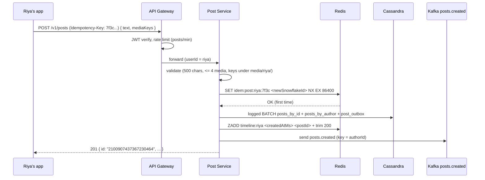
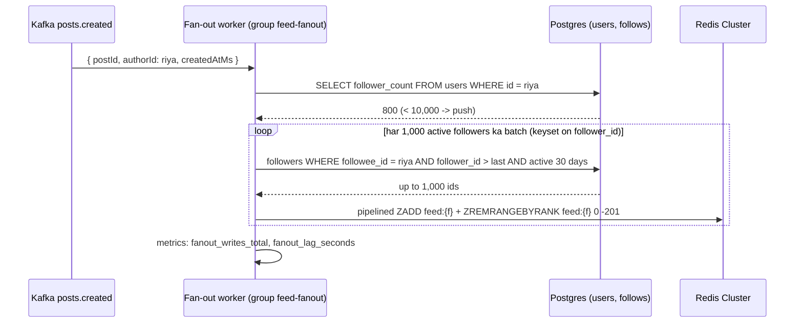
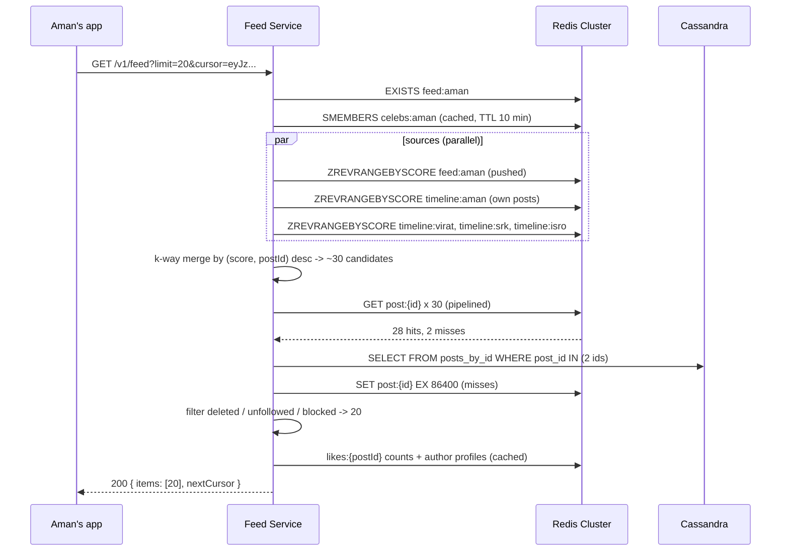
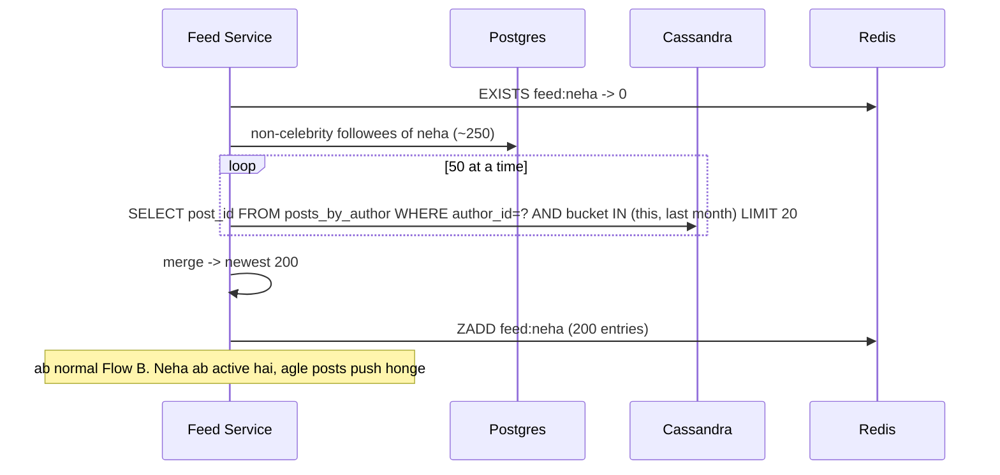

# News Feed -- HLD + LLD (Part 2: Request Flow -> API -> Database -> LLD -> Code)

> Is file mein prompt ke **Parts 7-12** hain: request flow, API design, database design, LLD folder structure, Node.js/TypeScript code, aur code ka line-by-line explanation.
> Part 1 mein humne decide kiya tha: **Chirp (Twitter/Instagram jaisa app), 100M DAU, peak ~35K feed reads/s aur ~350 posts/s (spikes ke liye ~1K/s plan). Feed read = saikdon followees ke posts merge karna -- isliye hybrid: normal author (< 10,000 followers) ka post Kafka ke through followers ke `feed:{userId}` Redis ZSET mein push hota hai (fan-out on write), celebrity (>= 10,000) ka post sirf `timeline:{authorId}` mein rehta hai aur reader use read time par pull karta hai. Posts Cassandra mein, users/follows Postgres mein, Redis sirf derived store (sab kuch rebuild ho sakta hai). Feed read p99 < 200 ms, fan-out lag p99 < 5 s, aur author ko apna post turant dikhna chahiye (read-your-own-writes).** Ab wahi design request flow se code tak le jaayenge.

---

## PART 7 -- HLD Request Flow (shuru se end tak)

URL Shortener mein ek request ka ek hi raasta tha (cache -> DB -> redirect). News Feed mein **write aur read bilkul alag duniya** hain:

1. **Write path (post create)** -- ~350/s, lekin har post ke peeche **200 feeds** likhne hain (average). Ye kaam request ke andar nahi ho sakta -> async (Kafka + fan-out workers).
2. **Read path (feed open)** -- ~35K/s, har read ko < 200 ms. Yahan koi bhari query nahi chalni chahiye -- bas Redis se ready-made list uthao, thoda merge karo, hydrate karo.

Rule yaad rakho: **write thoda slow aur async chalega, read hamesha fast hona chahiye.** Kyunki reads writes se ~100x zyada hain.

Chaar flows: (A) create post + fan-out, (B) read feed, (C) inactive user ka feed rebuild, (D) follow aur delete post.

### Flow A -- Create post (Riya ka post, 800 followers)

Scenario: Riya (normal user, 800 followers) ek photo ke saath post karti hai. Photo pehle hi StoreBox mein presigned URL se upload ho chuki hai (File Storage system) -- API ko sirf `mediaKeys` milti hain.



**Step by step (Hinglish mein):**

1. **Auth + rate limit** -- Gateway JWT verify karta hai aur Rate Limiter system wala per-user limit lagata hai (spam bots ek minute mein 1,000 posts na kar sakein).
2. **Validation** -- text <= 500 chars, max 4 `mediaKeys`, aur har key `media/{authorId}/...` se shuru honi chahiye (kisi aur ki photo apne post mein chipkana band).
3. **Idempotency** -- mobile network par client ko response nahi mila, usne retry kiya. Bina protection ke **ek hi post do baar** publish hota. `SET ... NX` pehli request par Snowflake ID "claim" karta hai; retry ko wahi ID wapas milti hai (Payment System wala idea, detail code mein).
4. **Snowflake ID** -- time-sortable 64-bit ID (URL Shortener Part 3). `createdAtMs` ID ke andar hi hai (top 41 bits).
5. **Cassandra write** -- `posts_by_id` (post ka data) + `posts_by_author` (author ki timeline index) + `post_outbox` (Kafka ke liye event) -- ek **logged batch** mein, taaki teeno ya toh likhe jaayein ya koi nahi.
6. **Own timeline** -- `ZADD timeline:riya`. Isi se **read-your-own-writes** milta hai: Riya turant feed refresh kare toh apna post dikhe, chahe fan-out abhi chala bhi na ho.
7. **Kafka publish** -- `posts.created`, message key = `authorId` (ek author ke events order mein). Publish fail hua toh bhi `201` -- outbox relay baad mein bhej dega.
8. **201** -- response mein ID **string** hai (kyun -- PART 8 mein).

**Async fan-out (request ke baad, background mein):**



1. Worker `feed-fanout` consumer group ka member hai -- 10 workers = partitions 10 workers mein bate, parallel fan-out.
2. **Celebrity check** -- `follower_count >= 10,000` -> **kuch push nahi**, return. Post already `timeline:{authorId}` mein hai; readers pull karenge.
3. **Followers batches mein** -- 1,000-1,000 karke, `follower_id > lastSeen` (keyset). Ek saath 9,999 followers memory mein nahi, aur Postgres par ek lambi query nahi.
4. **Inactive skip** -- 30 din se jo user nahi aaya uska feed Redis mein rakhna waste hai (~1.28 TB sirf active users ke liye plan kiya tha). Wo aayega toh Flow C rebuild karega.
5. **Pipelined ZADD + trim** -- ek round trip mein 1,000 feeds. Trim se har feed max 200 entries.
6. **Retry safe** -- worker crash hua aur message dobara aaya? `ZADD` same member same score = koi change nahi. **Fan-out idempotent hai**, isliye at-least-once Kafka delivery chalti hai.

> Interview line: "Post create request sirf durable write + apni timeline + ek event karta hai -- ~10-20 ms. 200 ya 9,999 followers ke feeds async workers likhte hain. Celebrity ke liye push hota hi nahi."

### Flow B -- Read feed (Aman, follows 300 people incl. 3 celebrities)



1. **Feed exists?** -- `feed:aman` nahi mila = Aman 30+ din se inactive tha -> Flow C (rebuild) pehle.
2. **Celebs list** -- Aman jin celebrities ko follow karta hai (`celebs:aman`, 10 min cache). Unka content push nahi hua tha, isliye yahan pull.
3. **Sources parallel mein** -- pushed feed + apni timeline + har celeb ki timeline. Har source ek sorted list (newest first) hai, cursor ke baad ki entries.
4. **K-way merge** -- sorted lists ko ek sorted list mein milao (Part 3 mein min-heap wala algorithm). Duplicates hatao.
5. **Hydrate** -- ab tak sirf IDs the. Post ka text/media `post:{id}` cache se (batch), miss hue toh Cassandra se ek query mein, aur wapas cache mein.
6. **Filter** -- deleted post (`deleted = true`), jisko unfollow kar diya uske purane pushed posts, blocked users. Isliye 20 ke bajaye ~30 candidates laate hain.
7. **Decorate + respond** -- author profile, like count, viewer ne like kiya ya nahi. `nextCursor` = last item ka `(score, postId)`.

### Flow C -- Inactive user ka feed rebuild

Neha 2 mahine baad app kholti hai. Fan-out ne usko skip kiya tha (inactive), toh `feed:neha` Redis mein hai hi nahi.



- Ye **pull model** hai -- sirf us ek user ke liye, ek baar. Cost ~100-300 ms (250 followees / 50 parallel = 5 rounds). Metric `feed_rebuilds_total` aur `feed_cache_hit_ratio` isi ko track karte hain.
- `last_active_at` login par update hota hai, isliye agle posts se fan-out Neha ko phir push karega.
- Redis node mar gaya aur lakhon feeds udd gaye? Wahi rebuild -- lekin sab ek saath aaye toh Cassandra par stampede (lesson 83: Redis down = DB stampede) -> rebuild concurrency limit + degraded mode (Part 4).

### Flow D -- Follow (+ backfill) aur Delete post

**Follow:** Aman `PUT /v1/users/kabir/follow`.

1. Postgres tx: `INSERT INTO follows ... ON CONFLICT DO NOTHING`. Row naya bana toh hi `following_count`/`follower_count` +1 (same tx). Dobara PUT = no-op -> **idempotent**.
2. `following:aman` aur `celebs:aman` cache DEL (warna 10 min tak purana graph).
3. Event `follows.changed` -> **backfill worker**: Kabir non-celebrity hai -> uske last 20 posts `posts_by_author` se -> `ZADD feed:aman` + trim. Aman ko follow karte hi Kabir ke posts feed mein dikhne lagte hain (few seconds). Celebrity follow kiya -> backfill ki zarurat nahi, read time par pull ho hi jaayega.

**Delete post:** Riya `DELETE /v1/posts/:id`.

1. Author check -- post Riya ka nahi hai toh **404** (403 nahi -- post exist karta hai ye bhi leak na ho).
2. `posts_by_id.deleted = true` (**tombstone**), `posts_by_author` se row hatao, `post:{id}` cache overwrite, `ZREM timeline:riya`.
3. `posts.deleted` event -> cleanup worker followers ke feeds se `ZREM` (best effort).
4. Cleanup se pehle koi feed padhe toh? Hydration mein `deleted = true` milta hai -> **read time par filter** (lazy). Isliye delete turant "gayab" dikhta hai, cleanup sirf memory saaf karta hai.

> Interview line: "Deletes aur unfollows ke liye main source of truth turant update karta hoon aur feeds ko lazily read time par filter karta hoon. 800 feeds se synchronously ZREM karne ka wait user nahi karega."

### Latency budget -- feed read (server side, p99 target < 200 ms)

| Step | Typical | Note |
|---|---|---|
| LB + JWT verify + rate limit | ~1-2 ms | JWT = local signature check, DB nahi |
| `EXISTS feed` + `celebs:{me}` | ~1 ms | Redis, same AZ |
| Sources: feed + own timeline + 3 celeb timelines (parallel) | ~2-3 ms | `ZREVRANGEBYSCORE ... LIMIT 0 30` = O(log N + 30) |
| K-way merge ~150 entries | < 1 ms | CPU |
| Hydrate 30 posts (`GET post:*` pipelined, ~95% hit) | ~2-3 ms | |
| Cache misses -> Cassandra `IN` query | ~5-10 ms | Sirf misses par |
| Authors + like counts + viewerHasLiked (parallel) | ~3-5 ms | Profiles cached; `post_likes` lookup Cassandra |
| JSON serialize ~20 KB | ~1 ms | |
| **Total** | **~15-25 ms typical, ~60-100 ms p99** | Budget mein aaram se |
| Rebuild path (inactive user, rare) | +100-300 ms | Isliye isko rare rakhna zaroori |

Celebrity sources badhe (koi 200 celebrities follow kare) toh sources 200 ho jaate hain -- `celebrity_merge_sources` histogram isi ko dekhta hai. Fix Part 3/4 mein (celeb sources ko cap karo / unke recent posts ka shared cache).

---

## PART 8 -- API Design

Sab endpoints `Authorization: Bearer <JWT>` maangte hain. Viewer ka `userId` token se aata hai, body se kabhi nahi.

### 8.1 Create post

```
POST /v1/posts
Authorization: Bearer eyJhbGciOi...
Idempotency-Key: 7f3c2a9e-1b4d-4c1e-9a55-0c8f2d1e6b10
Content-Type: application/json

{ "text": "Aaj Marine Drive par sunset!", "mediaKeys": ["media/1500000000000000001/sunset.jpg"] }

201 Created
{
  "id": "2100907437367230464",
  "authorId": "1500000000000000001",
  "text": "Aaj Marine Drive par sunset!",
  "mediaUrls": ["https://cdn.chirp.app/media/1500000000000000001/sunset.jpg"],
  "createdAt": "2026-09-18T11:19:00.698Z"
}
```

- **`Idempotency-Key`** (required, client generated UUID) -- retry par wahi post (`201` same body), naya post nahi. 24 h tak yaad rakhte hain.
- **`mediaKeys` in, `mediaUrls` out** -- DB mein sirf StoreBox key; URL CDN ka domain jodke response time par banta hai. Kal CDN badla toh DB rows nahi badalni padti.
- `createdAt` ISO string (insaan/debug ke liye); andar hum `createdAtMs` use karte hain.

### 8.2 IDs hamesha string kyun?

Snowflake IDs ~2.1e18 hain, aur JavaScript `number` (IEEE double) sirf **2^53 = 9,007,199,254,740,992** tak integers exactly rakh sakta hai.

```js
JSON.parse('{"id":2100907437367230465}').id   // 2100907437367230500  <- last digits badal gaye!
```

Ab client galat post ko like/delete karega. Isliye **JSON mein ID string**, Node ke andar string (math chahiye toh `BigInt`), Postgres `pg` driver bhi `BIGINT` string mein deta hai. Aur isi wajah se Redis ZSET ka **score** postId nahi ho sakta (score bhi double hai) -- score = `createdAtMs` (~1.8e12, safe), member = postId string.

### 8.3 Read feed + user timeline

```
GET /v1/feed?limit=20&cursor=eyJzIjoxNzg5NzMxNTQwNjk4LCJpZCI6IjIxMDA5MDc0MzczNjcyMzA0NjQifQ

200 OK
Cache-Control: private, no-store
{
  "items": [
    {
      "post": { "id": "2100907437367230464", "authorId": "1500000000000000001", "text": "...", "mediaUrls": ["..."], "createdAt": "..." },
      "author": { "id": "1500000000000000001", "handle": "riya", "displayName": "Riya S", "avatarUrl": "https://cdn.chirp.app/avatars/riya.jpg" },
      "likeCount": 12,
      "viewerHasLiked": false
    }
  ],
  "nextCursor": "eyJzIjoxNzg5NzMxNTM5MDAwLCJpZCI6IjIxMDA5MDczNzE..."
}

GET /v1/users/1500000000000000001/posts?cursor=...   -> same item shape (sirf us user ke posts)
```

**Cursor contract (lesson [84 -- infinite scroll pagination](../../lessons/84-infinite-scroll-pagination-at-scale.md) wala idea):**

- Cursor = base64url(`{"s": lastScoreMs, "id": "lastPostId"}`). Client ke liye **opaque** -- andar jhaanke nahi, khud na banaye. Kal format badla (ranking score jodna) toh client nahi tootega.
- Pehla page: `cursor` mat bhejo. `nextCursor: null` = "You're all caught up".
- **Offset kyun nahi?** Feed har second badal raha hai (naye posts upar aa rahe). `?page=2` (offset 20) -- beech mein 5 naye posts aaye toh page 2 mein page 1 ke last 5 posts **dobara** dikhenge. Cursor "is post ke baad wale" bolta hai -- naye posts upar aayein, page 2 stable. Aur Redis ZSET mein score-range seek `O(log N)` hai, offset nahi chahiye.
- `limit` default 20, max 50 (zyada = `400 INVALID_LIMIT`). Ek request 10,000 posts hydrate na karwa de.
- Naye posts ke liye client pehla page dobara (bina cursor) laata hai -- "pull to refresh".

### 8.4 Follow, like, delete

```
PUT    /v1/users/1500000000000000001/follow    -> 204   (already following? phir bhi 204)
DELETE /v1/users/1500000000000000001/follow    -> 204   (follow nahi kar rahe the? phir bhi 204)
PUT    /v1/posts/2100907437367230464/like      -> 204
DELETE /v1/posts/2100907437367230464/like      -> 204
DELETE /v1/posts/2100907437367230464           -> 204 (author) | 404 (not found / not yours)
POST   /v1/media/uploads { "contentType": "image/jpeg", "sizeBytes": 310000 } -> 200 { "mediaKey", "uploadUrl" }  (File Storage presign)
```

- **PUT kyun, POST kyun nahi?** "Main X ko follow karta hoon" ek **state** hai, action nahi. PUT ka matlab "is state par set karo" -- 5 baar bhejo, result same (**idempotent by design**). `POST /follow` retry par double counter +1 kar deta. Isliye yahan `Idempotency-Key` ki zarurat nahi, sirf `POST /v1/posts` par (kyunki har post naya resource hai).
- Like count double na ho: like row pehli baar bana tabhi `INCR likes:{postId}` (PART 9 counters).

### 8.5 Validation + authorization

| Field / rule | Check | Kyun |
|---|---|---|
| `text` | 1..500 chars (Unicode code points, `[...text].length`), trim ke baad empty nahi (media ho toh text optional) | Emoji/Hindi mein `.length` UTF-16 units ginta hai -- galat count |
| `mediaKeys` | max 4, har key `media/{authorId}/` prefix, StoreBox mein exist karti ho | Kisi aur ki private photo attach karna band |
| `Idempotency-Key` | required, 8..64 chars | Bina key retry-safety nahi |
| `limit` | integer 1..50 | Hydration cost bound |
| `cursor` | valid base64url JSON, `s` safe integer, `id` digits | Garbage cursor -> `400`, 500 nahi |
| `:id` params | `^\d{1,20}$` | Cassandra/Postgres ko garbage mat bhejo |
| Delete post | `post.authorId === viewerId`, warna **404** | Sirf apna post delete; existence leak nahi |
| Follow | `:id !== viewerId`, user exist kare | DB mein bhi `CHECK (follower_id <> followee_id)` |

### 8.6 Errors + rate limits

| Status | Code | Kab | Client kya kare |
|---|---|---|---|
| `400` | `TEXT_TOO_LONG` / `TOO_MANY_MEDIA` / `INVALID_MEDIA_KEY` | Validation fail | UI mein dikhao, retry nahi |
| `400` | `INVALID_CURSOR` / `INVALID_LIMIT` | Cursor tampered / limit > 50 | Pehla page dobara lo |
| `400` | `IDEMPOTENCY_KEY_REQUIRED` | `POST /v1/posts` bina key | Bug fix |
| `401` | `UNAUTHENTICATED` | JWT missing/expired | Token refresh |
| `404` | `POST_NOT_FOUND` / `USER_NOT_FOUND` | Nahi hai, ya aapka nahi (delete) | Retry mat karo |
| `429` | `RATE_LIMITED` | Limit cross | `Retry-After` ke baad |
| `503` | `UNAVAILABLE` | Cassandra write fail | Same `Idempotency-Key` ke saath retry |

Format: `{ "error": "TEXT_TOO_LONG", "message": "text must be at most 500 characters" }`.

Rate limits (example values, Rate Limiter system se, per user): posts **30/min + 300/day**, follows **400/day** (follow-spam bots), likes **1,000/day**, feed reads **120/min** (scraping). Follow limit sabse important hai -- bots hazaron logon ko follow karke notice paane ki koshish karte hain.

---

## PART 9 -- Database Design

### Teen stores, teen alag kaam

| Data | Store | Kyun |
|---|---|---|
| Users, follows (graph) | **PostgreSQL** | Relational, unique constraints (`handle`, duplicate follow nahi), transactions (follow + counter ek saath), ~300M users x 200 = **60B follow rows** -- bada, lekin user_id se shard ho jaata hai |
| Posts, likes | **Cassandra** | 10M posts/day, 3.65 TB/year, **append-heavy**, kabhi update nahi (sirf delete flag). Linear write scaling (node jodo = capacity), multi-DC replication built-in |
| Feeds, timelines, post cache, counters | **Redis Cluster** | Sirf **derived** data -- sab Cassandra + Postgres se dobara ban sakta hai. Sub-ms reads |

> "Main posts ke liye Cassandra choose kar raha hoon kyunki access pattern simple aur fixed hai -- 'post by id' aur 'author ke latest posts' -- aur write volume bahut bada hai. Joins ki zarurat nahi. Graph ke liye Postgres, kyunki wahan constraints aur transactions chahiye. **V1 mein (chhota scale) posts bhi Postgres mein rakh sakte hain** -- ek DB, kam operations. 10M posts/day par Postgres sharding khud likhni padti, Cassandra ye built-in deta hai."

**MongoDB kab?** Agar team Mongo jaanti hai aur posts ko document (post + media + embedded counts) ki tarah rakhna ho -- sharded collection on `author_id` bhi chal jaata. **DynamoDB** -- AWS par managed Cassandra-jaisa (same partition + sort key thinking). Choice ka core same hai: **query-driven design**.

### Cassandra ka mental model (ek baar samjho)

- **Partition key** -- decide karta hai row **kis node** par jaayegi (hash). Ek query = ideally **ek partition**.
- **Clustering columns** -- partition ke andar rows **sorted** rehti hain (disk par bhi). "Latest 20" = partition ka pehla hissa padho.
- **No joins, no ad-hoc WHERE** -- aap sirf partition key (+ clustering range) se query kar sakte ho. Isliye **har query ke liye alag table** (denormalization): "post by id" ek table, "posts by author" doosri. Same data do jagah -- write thoda mehenga, read sasta. Hamare use case (read-heavy) mein sahi trade.

### Schema (spec wala, exact + ek outbox table)

```sql
-- PostgreSQL (graph + users)
CREATE TABLE users (
  id               BIGINT PRIMARY KEY,              -- Snowflake
  handle           TEXT NOT NULL UNIQUE,
  display_name     TEXT NOT NULL,
  avatar_key       TEXT NULL,                       -- StoreBox key
  follower_count   BIGINT NOT NULL DEFAULT 0,
  following_count  BIGINT NOT NULL DEFAULT 0,
  last_active_at   TIMESTAMPTZ NOT NULL DEFAULT now(),
  created_at       TIMESTAMPTZ NOT NULL DEFAULT now()
);
CREATE TABLE follows (
  follower_id  BIGINT NOT NULL REFERENCES users(id),
  followee_id  BIGINT NOT NULL REFERENCES users(id),
  created_at   TIMESTAMPTZ NOT NULL DEFAULT now(),
  PRIMARY KEY (follower_id, followee_id),           -- "whom do I follow" + no duplicate follows
  CHECK (follower_id <> followee_id)
);
CREATE INDEX ix_follows_followee ON follows (followee_id, follower_id);   -- "who follows X" for fan-out
```

```sql
-- Cassandra (CQL)
CREATE TABLE posts_by_id (
  post_id bigint PRIMARY KEY, author_id bigint, text text,
  media_keys list<text>, created_at timestamp, deleted boolean
);
CREATE TABLE posts_by_author (
  author_id bigint,
  bucket    text,          -- 'YYYY-MM' to keep partitions bounded for prolific authors
  post_id   bigint,
  PRIMARY KEY ((author_id, bucket), post_id)
) WITH CLUSTERING ORDER BY (post_id DESC);
CREATE TABLE post_likes (
  post_id bigint, user_id bigint, created_at timestamp,
  PRIMARY KEY ((post_id), user_id)
);
CREATE TABLE post_counters (post_id bigint PRIMARY KEY, like_count counter);
-- extra (not in spec core): outbox rows written in the same logged BATCH as the post
CREATE TABLE post_outbox (
  minute  text,            -- 'YYYY-MM-DDTHH:MM' UTC -> relay reads only the last few partitions
  post_id bigint,
  event   text,            -- 'posts.created' | 'posts.deleted'
  payload text,
  PRIMARY KEY ((minute), post_id)
) WITH default_time_to_live = 172800;   -- rows expire in 2 days, no DELETE tombstones
```

### Har key / index kyun, aur na ho toh kya tootega

| Key / Index | Kis query ke liye | Na ho toh |
|---|---|---|
| `follows PK (follower_id, followee_id)` | "Aman kisko follow karta hai" = `WHERE follower_id = $1` (PK ka left prefix, index range scan). Plus **duplicate follow impossible** -> `ON CONFLICT DO NOTHING` = idempotent PUT | Do tap = do rows -> `following_count` galat, fan-out do baar |
| `ix_follows_followee (followee_id, follower_id)` | Fan-out: "Riya ko kaun follow karta hai", **sorted by follower_id** -> keyset batches `follower_id > $last LIMIT 1000` seedha index se | PK `follower_id` se shuru hota hai -- "followers of Riya" ke liye poori 60B-row table scan. Har post par. System khatam |
| `ix_follows_followee` mein `follower_id` bhi kyun | Index-only scan + sorted order: page ke liye alag sort nahi | Sirf `(followee_id)` index -> rows unsorted, har batch par sort |
| `users.handle UNIQUE` | `@riya` do logon ka nahi | Mentions/profile URLs ambiguous |
| `CHECK (follower_id <> followee_id)` | Khud ko follow nahi | Apna post feed mein do baar (timeline + pushed) |
| `posts_by_id PK post_id` | Hydration: `WHERE post_id IN (...)` -- har ID ek partition lookup | -- |
| `posts_by_author ((author_id, bucket), post_id DESC)` | "Riya ke latest 20" = ek partition, clustering order mein pehli 20 rows, sort free | Author par ORDER BY impossible (Cassandra) |
| `bucket = 'YYYY-MM'` partition mein | Partition size bounded. Bot 1,000 posts/day karke 10 saal -> **3.6M rows ek partition** mein -> hot + huge partition (Cassandra ko ~100 MB se chhote partitions pasand hain). Month bucket = max ~30K rows | Unbounded partition -> slow reads, compaction pain, repair mein node struggle |
| `post_likes ((post_id), user_id)` | "Kya Aman ne ye like kiya?" = partition + clustering equality; same user dobara like = same row (upsert) -> idempotent | Duplicate likes |
| `post_counters` alag table | Cassandra `counter` columns sirf counter-only table mein ho sakte hain | -- |

**Month bucket ka read side:** latest posts ke liye pehle current month, 20 se kam mile toh pichhla month (max ~12 months peeche jaao, phir ruko). Chup-chaap author = kuch extra queries -- chalta hai.

**`posts_by_author` mein sirf `post_id` kyun, text kyun nahi?** Text do jagah hota toh edit/delete dono jagah karna padta. Timeline se IDs lo, hydration `posts_by_id` (+ `post:{id}` cache) se -- ek hi jagah post ka content. `createdAtMs` ID se nikal jaata hai (Snowflake), alag column nahi chahiye.

### Counters -- like count

- `follower_count` Postgres mein follow tx ke andar update. Celebrity (50M followers) ki row **hot row** ban jaati hai (har second hazaron follows -> row lock contention) -> Part 4: counter increments ko batch karke flush.
- Like: `INSERT INTO post_likes ... IF NOT EXISTS` (LWT) ya Redis `SADD liked:{postId}` -- **pehli baar** like hua tabhi `INCR likes:{postId}`. Redis counter har ~10 s Cassandra `post_counters` mein flush (`UPDATE ... SET like_count = like_count + ?`).
- **Cassandra counters idempotent nahi hain** -- timeout ke baad retry = double increment. Isliye counter ko "display ke liye approximate" maano; exact count chahiye toh `post_likes` rows se reconcile job.

### Redis ek derived store hai

`feed:{userId}`, `timeline:{authorId}`, `post:{postId}`, `likes:{postId}`, `following:{userId}`, `celebs:{userId}` -- inme se kuch bhi udd jaaye, **data loss nahi**: feed = rebuild (Flow C), timeline = `posts_by_author`, post = `posts_by_id`, counters = `post_counters`. Isliye Redis mein AOF-every-second jaisa durability tuning optional hai; lekin **ek saath sab udd jaaye** toh rebuild stampede -- us case ka plan Part 4.

---

## PART 10 -- LLD (Low-Level Design): Node.js project structure

```
chirp-feed/
+-- src/
|   +-- routes/        post | feed | follow | like .routes.ts
|   +-- middleware/    auth.ts (JWT -> res.locals.userId) | rate-limit.ts | error-handler.ts
|   +-- controllers/   post | feed | follow | like .controller.ts   # parse, validate, DTO, status codes
|   +-- services/
|   |   +-- post.service.ts          # createPost (idempotency, snowflake, batch, timeline, event), deletePost
|   |   +-- feed.service.ts          # getFeed: sources -> merge -> hydrate -> filter -> cursor, rebuild
|   |   +-- fanout.service.ts        # push to followers / backfill on follow / cleanup on delete
|   |   +-- graph.service.ts         # follow/unfollow, followingSet, celebritiesFollowedBy (cached)
|   |   +-- like.service.ts          # like/unlike, likedBy(viewer, postIds)
|   |   +-- ranking.service.ts       # V1 no-op (chronological), V2 score
|   +-- workers/fanout.worker.ts     # kafkajs consumer group feed-fanout
|   +-- repositories/
|   |   +-- post.repository.ts       # cassandra-driver: posts_by_id, posts_by_author, post_outbox
|   |   +-- follow.repository.ts     # pg: follows (keyset follower pages)
|   |   +-- user.repository.ts       # pg: users, profiles, follower_count
|   +-- cache/         feed-cache.ts | post-cache.ts | counter-cache.ts
|   +-- utils/         snowflake.ts | cursor.ts | kway-merge.ts
|   +-- infra/         redis.ts | postgres.ts | cassandra.ts | kafka.ts | logger.ts | metrics.ts
|   +-- app.ts                       # composition root: sab objects yahan bante hain
|   +-- server.ts                    # listen + graceful shutdown
+-- migrations/  001_graph.sql (pg) | 001_posts.cql (cassandra)
+-- tests/
```

(`middleware/` spec ki file list se extra hai -- auth/rate-limit ka natural ghar.)

| Folder | Kaam | Kya yahan NAHI hona chahiye |
|---|---|---|
| `routes/` | URL + method -> controller | Logic |
| `middleware/` | JWT verify, rate limit, error -> `{ error, message }` | Business rules |
| `controllers/` | Query/body parse, validation, `Post -> DTO` (mediaKeys -> CDN URLs, ms -> ISO), status codes | Redis/Cassandra calls |
| `services/` | Business flow: idempotency, fan-out decision, merge + filter | `req`/`res`, raw CQL/SQL |
| `workers/` | Kafka consumption, retries, offsets | Apna alag logic -- `fanout.service` hi call karo |
| `repositories/` | Sirf CQL/SQL, rows -> TS types (BIGINT -> string) | Caching decisions |
| `cache/` | Redis key naming + commands (ZADD, trim, pipelines, TTL) ek jagah | Business decisions (celebrity hai ya nahi) |
| `utils/` | Pure functions: ID, cursor, merge -- easily unit-testable | I/O |
| `infra/` | Connections, logger, metrics registry | Business logic |

**Dependency direction:**

```
routes -> middleware -> controllers -> services -> repositories -> Postgres / Cassandra
                                           |    -> cache -> Redis Cluster
                                           |    -> infra/kafka (events)
                                           +-> utils (pure)  <- sab use karte hain, ye kisi ko nahi
workers/fanout.worker -> services/fanout.service -> repositories + cache (same code paths)
```

- **Redis key names sirf `cache/` mein** -- `feed:${uid}` string 10 files mein bikhri ho toh ek typo = silent bug (worker `feed:` mein likhe, reader `feeds:` se padhe, feed hamesha khaali).
- **Worker patla, service mota** -- kal Kafka ki jagah SQS aaye toh sirf worker badlega. Aur fan-out logic ko bina Kafka ke unit test kar sakte ho.
- **`utils/` pure** -- snowflake, cursor, merge ke tests milliseconds mein, bina Docker.

> Interview tip: "Main write path (post service + fan-out worker) aur read path (feed service) ko alag services rakhunga -- read 100x zyada hai, alag scale karna hai. Dono ke beech ka contract sirf Redis keys + Kafka events hain."

---

## PART 11 + 12 -- Node.js / TypeScript Code (line-by-line explanation ke saath)

Stack: **Express 5**, **ioredis** (Cluster, `enableAutoPipelining: true`), **cassandra-driver**, **pg**, **kafkajs**. Code `tsc --strict` se type-check kiya gaya tha aur snowflake/cursor/merge chhote node tests se (10,000 IDs unique + sorted, tie-break cursor); imports chhote kiye hain. Types spec wale: `Post`, `FeedEntry`, `FeedItem`, `FeedPage`. Constants: `CELEBRITY_THRESHOLD = 10_000`, `FEED_MAX = 200`, `PAGE_SIZE = 20`, `ACTIVE_DAYS = 30`, `FANOUT_BATCH = 1_000`, `POST_TTL_SEC = 86_400`.

### 1. `utils/snowflake.ts` -- time-sortable 64-bit IDs (BigInt)

```ts
export const EPOCH_MS = 1288834974657n;           // custom epoch (Nov 2010)
const WORKER_BITS = 10n;
const SEQ_BITS = 12n;
const MAX_SEQ = (1n << SEQ_BITS) - 1n;             // 4095 ids per ms per worker
const MAX_BACKWARD_MS = 5n;

export class Snowflake {
  private lastMs = -1n;
  private seq = 0n;
  constructor(private readonly workerId: number) {
    if (!Number.isInteger(workerId) || workerId < 0 || workerId > 1023) throw new Error('workerId must be 0..1023');
  }
  next(): string {
    let now = BigInt(Date.now());
    if (now < this.lastMs) {                                      // clock moved backwards (NTP)
      if (this.lastMs - now > MAX_BACKWARD_MS) throw new Error(`clock moved back ${this.lastMs - now} ms`);
      now = this.waitUntil(this.lastMs);                          // small jump: just wait it out
    }
    if (now === this.lastMs) {
      this.seq = (this.seq + 1n) & MAX_SEQ;
      if (this.seq === 0n) now = this.waitUntil(this.lastMs + 1n); // 4096 ids used in this ms
    } else {
      this.seq = 0n;
    }
    this.lastMs = now;
    const id = ((now - EPOCH_MS) << (WORKER_BITS + SEQ_BITS)) | (BigInt(this.workerId) << SEQ_BITS) | this.seq;
    return id.toString();                                         // string: > 2^53, unsafe as number
  }
  private waitUntil(ms: bigint): bigint {
    let now = BigInt(Date.now());
    while (now < ms) now = BigInt(Date.now());                    // busy-wait, at most a few ms
    return now;
  }
}
export const createdAtMsOf = (id: string): number => Number((BigInt(id) >> 22n) + EPOCH_MS);
```

**Code Explanation:**

- `EPOCH_MS = 1288834974657n` -- custom epoch (Nov 2010, wahi jo Twitter ne publicly use kiya). 41 bits = ~69 saal ka range epoch se. Check: spec ka example `2100907437367230464 >> 22` = `500895366041` ms + epoch = **2026-09-18**, worker 0, seq 0.
- **`n` suffix = BigInt.** `number` mein bit shift 32-bit par kaam karta hai aur 2^53 ke upar precision jaati hai -- 64-bit ID banana `number` se impossible.
- `now < this.lastMs` -- server ka clock NTP ne peeche kiya. Ignore karte toh **same ID dobara** ban sakti thi (duplicate primary key = ek post doosre ko overwrite). 5 ms tak ka jump -> wait; bada jump -> throw (request `503`, dusra instance handle kare) -- alert lagao.
- `(this.seq + 1n) & MAX_SEQ` -- same millisecond mein agla sequence; 4096 par wrap hokar 0 -> matlab is ms ke saare IDs khatam -> **agle ms tak wait**. 350 posts/s par ye kabhi nahi hoga, lekin correctness ke liye zaroori.
- `id = (time << 22) | (worker << 12) | seq` -- top bits time -> **IDs time se sort hote hain**. Isliye Cassandra `CLUSTERING ORDER BY (post_id DESC)` = newest first.
- `workerId` -- har pod ka unique 0..1023 (config / StatefulSet ordinal se). Do pods ka same workerId = same ms mein same ID -> duplicate. Deploy config mein pakka karo.
- `createdAtMsOf` -- ID se hi time: `>> 22` + epoch. Isliye ZSET score ke liye alag DB column nahi chahiye.

### 2. `utils/cursor.ts` -- opaque cursor + ordering

```ts
export interface Cursor { s: number; id: string }            // last seen (scoreMs, postId)

export function encodeCursor(c: Cursor): string {
  return Buffer.from(JSON.stringify({ s: c.s, id: c.id })).toString('base64url');
}
export function decodeCursor(raw: unknown): Cursor | null {
  if (raw === undefined || raw === '') return null;           // first page
  if (typeof raw !== 'string' || raw.length > 200) throw new AppError(400, 'INVALID_CURSOR');
  try {
    const v = JSON.parse(Buffer.from(raw, 'base64url').toString('utf8')) as Partial<Cursor>;
    if (typeof v.s === 'number' && Number.isSafeInteger(v.s) && v.s > 0 && typeof v.id === 'string' && /^\d{1,20}$/.test(v.id)) {
      return { s: v.s, id: v.id };
    }
  } catch { /* invalid base64 / JSON -> 400 below */ }
  throw new AppError(400, 'INVALID_CURSOR');
}
// numeric compare of decimal id strings without BigInt: longer = bigger, same length = lexicographic
export function cmpId(a: string, b: string): number {
  if (a.length !== b.length) return a.length - b.length;
  return a < b ? -1 : a > b ? 1 : 0;
}
// feed order: newest first = scoreMs DESC, then postId DESC (tie-break)
export const newerFirst = (a: FeedEntry, b: FeedEntry): number => b.scoreMs - a.scoreMs || cmpId(b.postId, a.postId);
export const isAfterCursor = (e: FeedEntry, c: Cursor | null): boolean =>
  !c || e.scoreMs < c.s || (e.scoreMs === c.s && cmpId(e.postId, c.id) < 0);
```

**Code Explanation:**

- `base64url` -- URL mein `+`, `/`, `=` nahi aate, toh `?cursor=` mein encode ka jhanjhat nahi. Spec ka `"eyJzIjox..."` = `{"s":1...` ka base64 -- `s` pehle rakha hai isliye.
- `decodeCursor(raw: unknown)` -- `req.query.cursor` string, array (`?cursor=a&cursor=b`) ya kuch bhi ho sakta hai. Har garbage case -> **`400 INVALID_CURSOR`**, kabhi `500` nahi. `raw.length > 200` -- 1 MB ka cursor bhej ke CPU mat khao.
- `Number.isSafeInteger(v.s)` -- score ms hai (~1.8e12), safe range mein. `id` sirf digits -- baad mein Redis/Cassandra ko jaata hai.
- **Cursor sign kyun nahi kiya?** Isme koi secret/permission nahi -- sirf "kahan tak padha". User tamper kare toh bas apna hi feed alag jagah se dekhega. (Agar cursor mein filters/permissions hote toh HMAC sign karte.)
- `cmpId` -- decimal strings ka numeric compare bina BigInt: lamba = bada, same length par lexicographic. Snowflake IDs sab 19 digits ke hain, lekin rule general rakha.
- **Tie-break kyun?** Do posts same millisecond mein (same score). Cursor sirf `s` hota toh `(s` exclusive read dusre post ko **skip** kar deta, inclusive read **repeat** karta. `(s, id)` pair total order deta hai -> na skip, na repeat.

### 3. `utils/kway-merge.ts` -- sorted sources ko ek sorted list (simple version)

```ts
// lists: each already sorted newest-first. Returns up to `limit` unique entries, newest-first.
export function mergeDesc(lists: FeedEntry[][], limit: number): FeedEntry[] {
  const pos = lists.map(() => 0);
  const out: FeedEntry[] = [];
  const seen = new Set<string>();
  while (out.length < limit) {
    let best = -1;
    for (let i = 0; i < lists.length; i++) {                 // pick the newest head among k lists
      const head = lists[i][pos[i]];
      if (head && (best < 0 || newerFirst(head, lists[best][pos[best]]) < 0)) best = i;
    }
    if (best < 0) break;                                      // all lists exhausted
    const e = lists[best][pos[best]++];
    if (!seen.has(e.postId)) { seen.add(e.postId); out.push(e); }
  }
  return out;
}
```

**Code Explanation:**

- Har list ka ek "pointer" (`pos`). Har step: k heads mein se sabse naya uthao, pointer aage. Jaise 5 queues ke aage khade logon mein se sabse lamba banda chunna.
- Ye simple version O(total x k) hai -- hamare case mein k ~5 sources, total ~150 -> microseconds. Part 3 mein **min-heap** version (O(total log k)) jo 200 celebrity sources par bhi fast hai -- same function signature.
- `seen` dedupe -- ek post do sources mein ho sakta hai (e.g. author abhi-abhi celebrity bana: purane posts pushed feed mein bhi, timeline mein bhi).
- `limit` par ruk jaate hain -- 200-entry lists poori merge karne ki zarurat nahi, sirf page + buffer.

### 4. `cache/feed-cache.ts` -- ZSET push + page read

```ts
export class FeedCache {
  constructor(private readonly redis: Cluster) {}           // ioredis Cluster, enableAutoPipelining: true

  // Fan-out: one post into many followers' feeds. Commands are auto-pipelined per Redis node.
  async pushMany(followerIds: string[], postId: string, scoreMs: number): Promise<number> {
    await Promise.all(followerIds.flatMap((uid) => [
      this.redis.zadd(`feed:${uid}`, scoreMs, postId),
      this.redis.zremrangebyrank(`feed:${uid}`, 0, -(FEED_MAX + 1)),   // keep newest 200
    ]));
    return followerIds.length;
  }
  async pushTimeline(authorId: string, postId: string, scoreMs: number): Promise<void> {
    await Promise.all([
      this.redis.zadd(`timeline:${authorId}`, scoreMs, postId),
      this.redis.zremrangebyrank(`timeline:${authorId}`, 0, -(FEED_MAX + 1)),
    ]);
  }
  // Entries strictly after the cursor, newest first. key = feed:{uid} or timeline:{authorId}
  async readPage(key: string, cursor: Cursor | null, n: number): Promise<FeedEntry[]> {
    const max = cursor ? String(cursor.s) : '+inf';          // inclusive; same-ms ties filtered below
    const raw = await this.redis.zrevrangebyscore(key, max, '-inf', 'WITHSCORES', 'LIMIT', 0, n + 10);
    const out: FeedEntry[] = [];
    for (let i = 0; i < raw.length; i += 2) out.push({ postId: raw[i], scoreMs: Number(raw[i + 1]) });
    return out.filter((e) => isAfterCursor(e, cursor)).slice(0, n);
  }
  async exists(userId: string): Promise<boolean> {
    return (await this.redis.exists(`feed:${userId}`)) === 1;
  }
}
```

**Code Explanation:**

- `ZADD feed:uid <createdAtMs> <postId>` -- score = time (sorting ke liye), member = ID string (exact). Same post dobara ZADD = no change -> **fan-out retry safe**.
- `ZREMRANGEBYRANK key 0 -201` -- rank 0 = sabse chhota score = **sabse purana**. "0 se -201 tak hatao" = sirf newest 200 bachao. Iske bina active user ka feed hamesha badhta -- 1.28 TB ka plan 10 TB ban jaata. 200 se purana chahiye? Scroll bahut deep gaya -> Cassandra fallback (rare, Part 3).
- **Pipeline kahan hai?** `enableAutoPipelining: true` ke saath ioredis same event-loop tick ke saare commands ko **har Redis node ke liye ek pipeline** mein bhejta hai. 1,000 followers = 2,000 commands, ~20 nodes -> ~20 round trips, 2,000 nahi. Plain `redis.pipeline()` ya `MGET` Redis **Cluster** mein tabhi chalta hai jab saari keys same node/slot par hon -- `feed:1`, `feed:2` alag slots mein hain -> `CROSSSLOT` error. Isliye cluster mein auto-pipelining.
- Same key ke `ZADD` aur `ZREMRANGEBYRANK` same node ke same connection par order mein jaate hain -- trim hamesha add ke baad.
- `readPage` -- `ZREVRANGEBYSCORE key max -inf LIMIT 0 n` = newest-first, `O(log N + n)`. Spec wala short form `(<cursorScore>` (exclusive) same-ms wale doosre post ko skip kar deta; isliye **inclusive** padhte hain, `n + 10` extra lete hain, aur `isAfterCursor` se `(score, id)` par exact cut. Redis same score wale members ko reverse-lexicographic deta hai = equal-length IDs mein postId DESC -- hamara order hi.
- `exists` -- feed hai hi nahi = inactive user -> rebuild. Khaali feed (koi follow nahi) bhi Redis mein "missing" dikhta hai -> rebuild sasta hai (0 followees), lekin chahe toh chhota `active:{userId}` marker rakh sakte ho.

### 5. `services/post.service.ts` -- `createPost`

```ts
export class PostService {
  constructor(private readonly ids: Snowflake, private readonly redis: Cluster, private readonly posts: PostRepository,
              private readonly feedCache: FeedCache, private readonly producer: Producer, private readonly log: Logger) {}

  async createPost(authorId: string, input: CreatePostInput, idemKey: string): Promise<Post> {
    validatePost(authorId, input);                       // 500 chars, <= 4 media, keys under media/{authorId}/
    const idem = `idem:post:${authorId}:${idemKey}`;
    const candidate = this.ids.next();
    const claimed = await this.redis.set(idem, candidate, 'EX', 86_400, 'NX');
    const postId = claimed === 'OK' ? candidate : ((await this.redis.get(idem)) ?? candidate);
    if (claimed !== 'OK') {
      const existing = await this.posts.findById(postId);
      if (existing) return existing;                     // retry of a finished request -> same post, no duplicate
    }                                                    // else: first attempt crashed midway -> finish it with SAME id
    const post: Post = { id: postId, authorId, text: input.text, mediaKeys: input.mediaKeys,
                         createdAtMs: createdAtMsOf(postId), deleted: false };
    await this.posts.insertWithOutbox(post);             // logged BATCH: posts_by_id + posts_by_author + post_outbox
    await this.feedCache.pushTimeline(authorId, postId, post.createdAtMs);   // read-your-own-writes
    try {
      await this.producer.send({ topic: 'posts.created', acks: -1, messages: [{ key: authorId,
        value: JSON.stringify({ postId, authorId, createdAtMs: post.createdAtMs }) }] });
    } catch (err) {
      this.log.warn({ err, postId }, 'posts.created publish failed; outbox relay will retry');
    }
    return post;
  }
}
```

**Code Explanation:**

- `validatePost` pehle -- invalid request ke liye na ID banao, na Redis chhuo.
- **Idempotency via Redis `SET NX`** -- key `idem:post:{authorId}:{Idempotency-Key}`. Author ID key mein hai taaki do users ka same UUID collide na kare. `NX` = sirf tab set karo jab key nahi hai -> **atomic claim**: do parallel retries mein ek hi jeetega.
- **Value = postId** -- trick yahi hai. Retry ko wahi ID milti hai. Agar pehla attempt beech mein mara (Cassandra likha, Kafka nahi) toh retry **same ID** ke saath dobara likhta hai -- Cassandra `INSERT` = upsert, same row overwrite, koi duplicate nahi. Dono parallel chal jaayein tab bhi same ID, same data.
- `findById(postId)` mila -> pehla request complete ho chuka tha -> same `Post` wapas (controller `201` same body deta hai). Client ke liye retry aur original ek jaise.
- **Redis kyun, Payment jaisi DB table kyun nahi?** Post double hona annoying hai, paise double katna nahi. Redis key 24 h ki; Redis failover mein key gayi toh worst case ek duplicate post (user delete kar dega). Strict chahiye toh Cassandra table `post_idempotency` with `INSERT ... IF NOT EXISTS` (LWT, slow). Body fingerprint (same key, alag text -> `409`) bhi add kar sakte ho -- Payment System wala pattern.
- `createdAtMsOf(postId)` -- time ID se, taaki retry mein bhi score same rahe (naya `Date.now()` lete toh same post do alag scores par).
- `insertWithOutbox` -- Cassandra **logged batch**: teeno tables ya toh sab likhe jaayenge ya (coordinator crash ke baad bhi batchlog replay se) sab. Ye ACID transaction nahi (isolation nahi), lekin "post likha gaya par event gayab" wala gap band.
- `pushTimeline` -- author ka apna post turant `timeline:{me}` mein. Feed read ise merge karta hai -> Riya ko apna post **fan-out ke bina** dikhta hai.
- **Direct publish + outbox safety net** -- normal case mein event turant Kafka (fan-out lag kam). Kafka down hai -> log + `201` phir bhi (post durable hai). Outbox relay har second pichhle 2-3 `minute` partitions padh ke publish karta hai -- duplicates aayenge, lekin fan-out idempotent hai. `acks: -1` = saari in-sync replicas ne liya tabhi success. Message `key: authorId` = ek author ke events ek partition mein, order mein.

### 6. `workers/fanout.worker.ts` + fan-out logic

```ts
export async function startFanoutWorker(kafka: Kafka, deps: FanoutDeps): Promise<Consumer> {
  const consumer = kafka.consumer({ groupId: 'feed-fanout' });
  await consumer.connect();
  await consumer.subscribe({ topic: 'posts.created' });
  await consumer.run({
    eachMessage: async ({ message }) => {
      if (!message.value) return;
      const evt = JSON.parse(message.value.toString()) as PostCreatedEvent;
      await fanOut(deps, evt);                     // throws -> kafkajs retries, offset NOT committed
    },
  });
  return consumer;
}

export async function fanOut({ users, follows, feedCache, metrics }: FanoutDeps, evt: PostCreatedEvent): Promise<void> {
  const author = await users.findById(evt.authorId);
  if (!author) return;                                          // user deleted meanwhile
  if (author.followerCount >= CELEBRITY_THRESHOLD) return;      // celebrity: pulled at read time
  let after = '0';
  let written = 0;
  for (;;) {
    const batch = await follows.activeFollowersPage(evt.authorId, after, FANOUT_BATCH, ACTIVE_DAYS);
    if (batch.length === 0) break;
    written += await feedCache.pushMany(batch, evt.postId, evt.createdAtMs);
    after = batch[batch.length - 1];                            // keyset: next page starts after this id
    if (batch.length < FANOUT_BATCH) break;                     // last page
  }
  metrics.fanoutWrites.inc(written);
  metrics.fanoutLag.observe((Date.now() - evt.createdAtMs) / 1000);
}

// follow.repository.ts -- uses ix_follows_followee (followee_id, follower_id)
async activeFollowersPage(followeeId: string, after: string, limit: number, activeDays: number): Promise<string[]> {
  const { rows } = await this.pool.query<{ id: string }>(
    `SELECT f.follower_id::text AS id
       FROM follows f JOIN users u ON u.id = f.follower_id
      WHERE f.followee_id = $1 AND f.follower_id > $2
        AND u.last_active_at > now() - make_interval(days => $4)
      ORDER BY f.follower_id
      LIMIT $3`, [followeeId, after, limit, activeDays]);
  return rows.map((r) => r.id);
}
```

**Code Explanation:**

- `groupId: 'feed-fanout'` -- consumer group: `posts.created` ke partitions group ke workers mein bat jaate hain. Load badha -> aur pods (max = partitions count). Lag `kafka_consumer_lag{group="feed-fanout"}` se dikhta hai.
- `eachMessage` throw kare -> kafkajs offset commit nahi karta, message dobara aata hai (**at-least-once**). Isliye `fanOut` idempotent hona chahiye -- `ZADD` hai, toh hai. Poison message (hamesha fail) ke liye retry count + DLQ topic -- Part 4.
- `followerCount >= CELEBRITY_THRESHOLD` -> return. Ek 50M-follower post = 50M ZADDs (~50 s even at 1M/s) -- aur us beech har normal user ka fan-out queue mein atka. Celebrity ka post `createPost` ne `timeline:{authorId}` mein daal hi diya hai.
- **Keyset loop** -- `follower_id > after ORDER BY follower_id LIMIT 1000`. `OFFSET 5000` hota toh har page par Postgres pichhle 5,000 rows dobara padhta; keyset seedha index mein jump karta hai. `ix_follows_followee` ka `(followee_id, follower_id)` order exactly yahi deta hai.
- `u.last_active_at > now() - 30 days` -- inactive followers skip (unka feed rebuild hoga jab aayenge). `LIMIT` sirf active rows ginta hai, isliye `batch.length < FANOUT_BATCH` = scan khatam.
- `follower_id::text` -- BIGINT string mein, number mein kabhi nahi (2^53 wali problem).
- `fanoutLag` = post create se "last follower feed likha" tak ka time -- SLO p99 < 5 s isi histogram par. Worker crash beech mein -> retry pehle batches dobara likhega (harmless) aur aage badhega.
- Ek aur edge: post fan-out se pehle delete ho gaya -> phir bhi push ho jaata hai; read time filter (`deleted`) sambhal leta hai.

### 7. `cache/post-cache.ts` -- hydration (batch cache + Cassandra fallback)

```ts
export class PostCache {
  constructor(private readonly redis: Cluster, private readonly posts: PostRepository, private readonly misses: Counter) {}

  async getMany(ids: string[]): Promise<Map<string, Post>> {
    const found = new Map<string, Post>();
    if (ids.length === 0) return found;
    const cached = await Promise.all(ids.map((id) => this.redis.get(`post:${id}`)));  // auto-pipelined per node
    const missing: string[] = [];
    ids.forEach((id, i) => {
      const v = cached[i];
      if (v) found.set(id, JSON.parse(v) as Post); else missing.push(id);
    });
    if (missing.length > 0) {
      this.misses.inc(missing.length);                                   // hydration_cache_miss_total
      const fromDb = await this.posts.findByIds(missing);               // SELECT ... FROM posts_by_id WHERE post_id IN ?
      await Promise.all(fromDb.map((p) => this.redis.set(`post:${p.id}`, JSON.stringify(p), 'EX', POST_TTL_SEC)));
      for (const p of fromDb) found.set(p.id, p);
    }
    return found;                                                        // ids not in map = no such post
  }
}
```

**Code Explanation:**

- **Hydration** = IDs ko poore objects mein badalna. Feed mein sirf IDs rakhe (64 bytes/entry) -- text 200 feeds mein copy karte toh 1 KB x 200 x 10M posts/day = 2 TB/day Redis. Aur edit/delete 200 jagah.
- `Promise.all(ids.map(get))` -- spec ka "batch MGET" idea, cluster-safe form: auto-pipelining har node ke GETs ek round trip mein. (Single-node Redis par seedha `MGET post:a post:b ...` bhi chalega.)
- `missing` -- sirf cache miss wale Cassandra jaate hain, **ek** `IN` query mein (driver har partition coordinator se puchhta hai; bade `IN` lists ki jagah parallel single-partition queries better hain -- 30 IDs tak `IN` theek).
- `SET ... EX 86400` -- 24 h TTL: purane posts khud cache se nikal jaate hain; hot (aaj ke) posts cache mein rehte hain. ~95% hit ratio expected kyunki feeds zyadatar aaj ke posts dikhate hain.
- **Deleted posts bhi cache hote hain** (`deleted: true`) -- ye negative cache ka kaam karta hai; feed service unhe filter karti hai. DB mein bhi nahi mila -> map mein nahi -> filter. (Us ID ko baar-baar DB se puchhne se bachne ke liye chhota "not found" marker -- optional.)
- Stampede: ek viral post ka cache expire hua aur 10K readers ek saath miss kare? Har reader Cassandra jaayega -- Part 3 (caching deep dive) mein single-flight / request coalescing.

### 8. `services/feed.service.ts` -- `getFeed`

```ts
export class FeedService {
  async getFeed(viewerId: string, limit: number, cursor: Cursor | null): Promise<FeedPage> {
    if (!(await this.feedCache.exists(viewerId))) await this.rebuild(viewerId);      // inactive user
    const celebs = await this.graph.celebritiesFollowedBy(viewerId);                  // celebs:{me}, TTL 10 min
    const want = limit + 10;                                                          // buffer for filtered items
    const sources = await Promise.all([
      this.feedCache.readPage(`feed:${viewerId}`, cursor, want),                     // pushed
      this.feedCache.readPage(`timeline:${viewerId}`, cursor, want),                 // own posts
      ...celebs.map((c) => this.feedCache.readPage(`timeline:${c}`, cursor, want)),  // pulled
    ]);
    this.metrics.celebMergeSources.observe(celebs.length);
    const candidates = mergeDesc(sources, want);
    const [posts, following] = await Promise.all([
      this.postCache.getMany(candidates.map((e) => e.postId)),
      this.graph.followingSet(viewerId),                                              // following:{me}
    ]);
    const kept: Post[] = [];
    let used = 0;
    for (const e of candidates) {
      if (kept.length === limit) break;
      used++;
      const p = posts.get(e.postId);
      if (!p || p.deleted) continue;                                                  // deleted: lazy filter
      if (p.authorId !== viewerId && !following.has(p.authorId)) continue;           // unfollowed after push
      kept.push(p);                                                                   // (blocked users: same idea)
    }
    const last = used > 0 ? candidates[used - 1] : null;
    const more = used < candidates.length || candidates.length === want || sources.some((s) => s.length === want);
    return {
      items: await this.decorate(viewerId, kept),                                     // author, likeCount, viewerHasLiked
      nextCursor: more && last ? encodeCursor({ s: last.scoreMs, id: last.postId }) : null,
    };
  }

  private async rebuild(viewerId: string): Promise<void> {
    this.metrics.feedRebuilds.inc();
    const followees = await this.graph.nonCelebFollowees(viewerId);                   // celebs are pulled anyway
    const lists: FeedEntry[][] = [];
    for (let i = 0; i < followees.length; i += 50) {                                  // max 50 Cassandra queries in flight
      const chunk = followees.slice(i, i + 50);
      lists.push(...(await Promise.all(chunk.map((a) => this.posts.recentByAuthor(a, 20)))));
    }
    const top = mergeDesc(lists, FEED_MAX);
    if (top.length > 0) await this.feedCache.replace(viewerId, top);                  // ZADD all + trim
  }
}
```

**Code Explanation:**

- `exists` -> `rebuild` -- Flow C. Ek hi request mein; rebuild ke baad normal path. (Do tabs se ek saath rebuild -> dono same data likhenge, ZADD idempotent -- harmless.)
- **Teen tarah ke sources** -- pushed `feed:`, apna `timeline:` (read-your-own-writes), har celebrity ka `timeline:`. Hybrid model code mein bas yahi `Promise.all` hai. Sab parallel -> latency = sabse slow source, sum nahi.
- `want = limit + 10` -- kuch candidates filter honge (deleted/unfollowed). Bahut zyada filter hue toh page 20 se chhota aa sakta hai -- chalta hai, cursor sahi hai toh agla page wahin se.
- `mergeDesc` -- `(score, postId)` desc order, dedupe. Har source pehle hi cursor ke baad se shuru hai, toh merge ka output bhi.
- **Filter hydration ke baad** -- `authorId` post ke andar hai, feed entry mein nahi. `following.has(authorId)` -- Aman ne Kabir ko unfollow kiya; Kabir ke purane posts abhi bhi `feed:aman` mein pade hain (cleanup lazy) -> yahan hat jaate hain.
- **Cursor = last *examined* candidate, last *kept* nahi** -- agar last 3 candidates filter hue aur hum cursor last kept par rakhte toh agla page unhe dobara examine karta. `used` counter isi liye.
- `more` -- candidates bache hain, ya koi source poora bhara aaya (aage aur ho sakta hai) -> `nextCursor`. Warna `null` = "all caught up". (Kabhi-kabhi ek extra khaali page aa sakta hai -- acceptable.)
- `rebuild` -- sirf non-celeb followees (celebs toh har read par pull hote hi hain). 50-50 ke chunks = Cassandra ko 1,000 parallel queries se nahi maarte. `recentByAuthor` -- `posts_by_author` current + pichhla month bucket, `FeedEntry` (score ID se). Top 200 -> `feed:{me}`.
- `decorate` (dikhaya nahi) -- `Promise.all` mein: author profiles (user cache), `likes:{postId}` counts, `likeService.likedBy(viewer, ids)` -> `FeedItem[]`. Author na mile (account deleted) -> item drop.
- V2 ranking: yahan `candidates` ko 500 tak badha ke `rankingService.score()` se sort -- lekin tab cursor `(score, id)` ranking score ka ho jaata hai. Part 3.

### 9. `controllers/feed.controller.ts` -- `GET /v1/feed`

```ts
function parseLimit(raw: unknown): number {
  if (raw === undefined) return PAGE_SIZE;
  const n = Number(raw);
  if (!Number.isInteger(n) || n < 1 || n > 50) throw new AppError(400, 'INVALID_LIMIT', 'limit must be 1..50');
  return n;
}
const toPostDto = (p: Post) => ({ id: p.id, authorId: p.authorId, text: p.text,
  mediaUrls: p.mediaKeys.map((k) => `${CDN_BASE_URL}/${k}`), createdAt: new Date(p.createdAtMs).toISOString() });

export const getFeed = (feed: FeedService, readDuration: Histogram) => async (req: Request, res: Response) => {
  const viewerId = res.locals.userId as string;               // set by auth middleware from JWT
  const limit = parseLimit(req.query.limit);
  const cursor = decodeCursor(req.query.cursor);
  const end = readDuration.startTimer();                      // feed_read_duration_seconds
  try {
    const page = await feed.getFeed(viewerId, limit, cursor);
    res.set('Cache-Control', 'private, no-store');
    res.json({ items: page.items.map((it) => ({ ...it, post: toPostDto(it.post) })), nextCursor: page.nextCursor });
  } finally {
    end();
  }
};
// feed.routes.ts: router.get('/v1/feed', auth, rateLimit('feed'), getFeed(feedService, metrics.feedReadDuration))
```

**Code Explanation:**

- `viewerId` **JWT se** (`res.locals.userId`), query param se kabhi nahi -- warna `?userId=` badal ke kisi ka bhi feed padh lo.
- `parseLimit` -- default `PAGE_SIZE` (20), `abc`/`0`/`500` -> `400`. `Number(raw)` array par `NaN` deta hai -> `400` bhi.
- `decodeCursor` pehle -- galat input service tak pahunche hi nahi.
- `startTimer()` + `finally end()` -- error ho tab bhi latency record. p99 dashboard isi histogram se.
- `toPostDto` -- controller ka kaam: internal `Post` (`mediaKeys`, `createdAtMs`, `deleted`) -> public JSON (`mediaUrls`, ISO `createdAt`, `deleted` hide). Internal shape badle toh API contract nahi tootta.
- `Cache-Control: private, no-store` -- feed personal hai; CDN/proxy ise cache karke Aman ka feed Neha ko de de -- privacy incident. (Media CDN se cache hota hai, feed JSON nahi.)
- Express 5 -- async handler ka thrown `AppError` khud error middleware tak jaata hai (Express 4 mein `try/catch + next(err)` chahiye tha).

---

## Remember

> **Write path chhota rakho, read path ready-made rakho:** post = idempotent Snowflake ID + Cassandra batch + apni timeline + event; followers ke `feed:{id}` ZSETs async workers bharte hain (celebrity ko chhodke). Read = pushed feed + apni timeline + celebs ki timelines -> `(score, postId)` merge -> hydrate -> lazy filter -> opaque cursor. IDs hamesha strings, ZSET score = `createdAtMs`, aur Redis sirf derived data -- sab rebuild ho sakta hai.

## Quick Self-Test

1. Riya ne post kiya aur turant feed refresh kiya, lekin fan-out worker 3 s peeche chal raha hai. Uska post phir bhi kyun dikhta hai? Kaunsi Redis key aur kaunsi line isko guarantee karti hai?
2. Client ne `POST /v1/posts` bheja, Cassandra likh gaya, lekin pod Kafka publish se pehle crash ho gaya. Client same `Idempotency-Key` se retry karta hai. Step by step batao kya hota hai -- duplicate post kyun nahi banta, aur event kaise pahunchta hai?
3. `ix_follows_followee` hata do. Kaunsi query kya karegi, aur 60B rows par iska asar kya hoga? PK `(follower_id, followee_id)` isme madad kyun nahi karta?
4. Cursor sirf `createdAtMs` hota (postId nahi) aur read `ZREVRANGEBYSCORE key (<s> -inf` se hota. Ek example banao jahan post skip ho jaata hai.
5. Aman ne Kabir ko unfollow kiya. Kabir ke purane posts `feed:aman` se kabhi turant delete nahi hote -- phir bhi Aman ko kyun nahi dikhte? Aur `nextCursor` last *kept* item ke bajaye last *examined* candidate par kyun banta hai?

---

**Next (Part 3):** Algorithms (Snowflake, push vs pull vs hybrid, ZSET feed cache, cursor pagination, k-way merge, ranking), Concurrency, Caching deep dive. "next" bolo.
