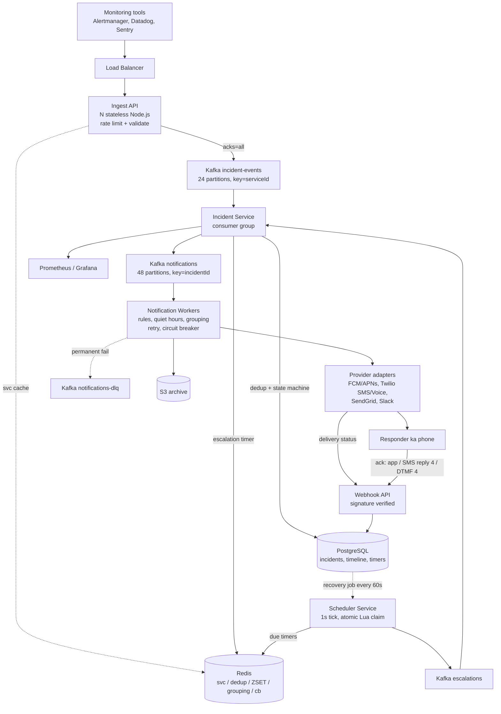

# Notification / Paging System -- HLD + LLD (Part 1: Basics -> Requirements -> Estimation -> HLD)

> Is file mein prompt ke **Parts 1-6** hain: problem basics, requirements, clarifying questions, capacity estimation, HLD, aur har component ka WHY.
> Next file (Part 2): request flow (event se page tak har step), Events API + incident APIs design, Postgres schema, LLD folder structure, Node.js/TypeScript code line-by-line.
>
> **Pichhle system se connection:** **Rate Limiter** wapas aa raha hai -- hamari Events API par har `routingKey` ke liye ek token bucket lagega (ek customer ka alert storm sirf usko throttle kare, baaki 19,999 accounts ko nahi), aur "raat ko phone mat bajao" wali quiet hours bhi ek rate limit hi hai. **URL Shortener** wapas aa raha hai -- SMS sirf 160 characters ka hota hai, toh incident ka poora link nahi bhej sakte; `sho.rt/i/abc` jaisa short link bhejte hain. Aur **Payment System / Idempotency** wapas aa raha hai -- wahan `Idempotency-Key` se do baar paise nahi katte the; yahan `dedupKey` se do baar incident nahi banta aur do baar SMS nahi jaata. **Same idea, naya context.**

---

## PART 1 -- Problem ko bilkul basic se samjho

### Kahani 1 -- Raat ke 3 baje

Hamari company ka `checkout` service hai. Raat 3:04 AM par uske database ka **disk full** ho gaya. Writes fail hone lage, checkout ne `500` dena shuru kar diya.

Achhi baat: monitoring **already laga hua tha**. Prometheus ne metric dekha, **Alertmanager** ne alert fire kiya.

```
03:04:11  Prometheus rule: pg_disk_free_bytes < 5GB for 2m   -> FIRING
03:04:12  Alertmanager -> Slack webhook -> #alerts-prod channel
03:04:12  #alerts-prod mein message: "[FIRING] checkout-db disk full"
03:04:12  #alerts-prod ke 47 members. Sab so rahe hain. Channel muted hai.
03:05:00  ... alert wahin pada hai
04:00:00  ... alert wahin pada hai (aur uske neeche 60 aur alerts aa gaye)
07:22:00  Customer Twitter par: "@ourcompany payment fail ho raha hai since 3am??"
07:25:00  Support ne founder ko call kiya. Founder ne engineer ko call kiya.
07:40:00  Engineer laptop kholta hai. Disk clear. Fix 4 minute ka tha.
```

**4 ghante ka outage. Fix 4 minute ka tha.** Alert bilkul sahi time par bana tha -- bas kisi **insaan tak nahi pahuncha**.

> Yahi is poore system ka core problem hai:
> **Monitoring ka kaam "problem detect karna" hai. Kisi sote hue insaan ko uthana monitoring ka kaam NAHI hai.** Wo ek alag system hai.

### Kahani 2 -- "Simple hai yaar, ek cron likh dete hain"

Agle din team ne socha: chalo hum khud bana lete hain. Ek cron job jo har minute DB check kare aur email bhej de.

```ts
// naive-alert.cron.ts -- har 1 minute chalta hai
import cron from 'node-cron';

cron.schedule('* * * * *', async () => {
  const failing = await db.query(
    `SELECT service, message FROM health_checks WHERE status = 'failing'`
  );
  for (const row of failing.rows) {
    await sendEmail({
      to: 'oncall@company.com',
      subject: `ALERT: ${row.service}`,
      body: row.message,
    });
  }
});
```

**Code Explanation:**

- `cron.schedule('* * * * *', ...)` -- har minute ek baar chalo. Matlab best case mein bhi alert **60 second** late hai.
- `SELECT ... WHERE status = 'failing'` -- jitne bhi failing services hain sabko uthao. Yahan koi memory nahi hai ki "ye wala maine pichhle minute bhi bheja tha".
- `for (const row of failing.rows)` -- har failing row par ek email. Agar ek DC down hua aur 500 services failing hain, toh **ek minute mein 500 email**.
- `await sendEmail({ to: 'oncall@company.com' })` -- ek fixed mailbox. Kaun on-call hai abhi, ye system ko pata hi nahi.

Ye cron do din chala, phir raat ko fail ho gaya. Kyun:

| Kya toota | Kyun |
|---|---|
| Email koi nahi padhta raat ko | Email **pull** channel hai -- aap khologe tab dikhega. Sota hua banda email nahi kholta. Phone **ring** hona chahiye. |
| Koi **dedup** nahi | Problem 40 minute chali -> wahi alert 40 baar. Inbox mein 40 copies, kaunsa naya hai pata nahi. |
| Storm mein 500 duplicate emails | Ek DC down -> sab services ek saath failing -> mailbox blast. Isko **alert fatigue** kehte hain: itne alerts ki log sab ignore karne lagte hain. |
| Koi **acknowledge** nahi | System ko kabhi pata hi nahi chala ki kisi ne dekha ya nahi. Isliye wo agli baar bhi wahi email bhejega, ya bhejna band kar dega -- dono galat. |
| Koi **escalation** nahi | Primary on-call ka phone silent tha. System ne 10 minute baad backup ko nahi uthaya. Kisi ko nahi uthaya. |
| Kaun on-call hai, pata nahi | `oncall@company.com` ek alias hai, insaan nahi. Rotation, timezone, chhutti -- kuch handle nahi. |

> **Sabse badi seekh:** Notification bhejna easy hai. **Guarantee karna ki koi insaan ne actually dekha aur jawab diya** -- wo mushkil hai. Yahi hamara system hai.

### Ye system actually karta kya hai?

Ek line mein:

> **"Ek machine ka alert, sote hue insaan ke phone tak, guaranteed, minutes mein."**

Thoda detail mein, chaar kaam:

1. **Accept** -- customer ke monitoring tools (Prometheus Alertmanager, Datadog, Sentry, cron, custom script) hamari **Events API** par event bhejte hain.
2. **Dedupe + Incident banao** -- same problem baar-baar aaye toh **ek hi incident** bane, uska counter badhe.
3. **Kaun?** -- incident ki service -> uski **escalation policy** -> level -> **on-call schedule** -> "abhi is waqt ye banda on-call hai".
4. **Page karo aur peechha mat chhodo** -- push, phir SMS, phir voice call. Ack na mile toh agle insaan tak **escalate** karo. Ack mile toh sab kuch turant **cancel** karo.

### Real life mein iska example kya hai?

| Product | Kaun banata hai | Note |
|---|---|---|
| **PagerDuty** | PagerDuty | Category ka original. `Events API v2`, dedup key, escalation policy, "reply 4 to ack" -- hamara design isi shape ka hai |
| **Opsgenie** | Atlassian | Jira/Slack ke saath tight integration |
| **Splunk On-Call** (VictorOps) | Splunk | Incident timeline par focus |
| **Grafana OnCall** | Grafana Labs | Open source, Grafana alerts ke saath |
| **Amazon internal paging** | Amazon | Har service team ka apna oncall rotation + pager; "ticket ya page?" severity se decide hota hai |

Bahar bhi yahi pattern dikhta hai: **hospital ka nurse call button**, **fire alarm panel**, **airline crew callout** -- sab "machine ne dekha, insaan ko uthao, uthne ki confirmation lo" hai.

### Client kya bhejta hai? System kya karta hai? Response kya milta hai?

Important: **insaan is API ko call nahi karta.** Client ek **machine** hai (Alertmanager / script). Insaan doosri taraf hai -- wo notification receive karta hai.

**Trace 1 -- naya alert (trigger -> 202)**

```
Client:   POST /v2/enqueue
          Content-Type: application/json
          Idempotency-Key: 8f1c-...-b902
          {
            "routingKey": "R0ABCD1234EFGH5678",
            "eventAction": "trigger",
            "dedupKey": "checkout-db-disk-full",
            "payload": {
              "summary": "checkout-db disk free < 5GB",
              "source": "prom-prod-1",
              "severity": "critical"
            }
          }

System:   1. routingKey -> serviceId  (Redis svc:<routingKey>, miss ho toh Postgres)
          2. rate limit check          (token bucket rl:events:<routingKey>)
          3. validate body             (eventAction, severity enum)
          4. stamp eventId + receivedAt
          5. Kafka `incident-events` par produce, acks=all -> COMMITTED
          6. ab jaake response bhejo

Response: 202 Accepted
          { "status": "accepted", "dedupKey": "checkout-db-disk-full" }
```

> **202 ka simple matlab:** "Tumhara event **safe hai, kho nahi sakta**, par abhi process nahi hua." Hum `201 Created` nahi bol sakte -- incident abhi bana hi nahi. Isliye response mein `incidentId` bhi nahi hai, sirf `dedupKey` hai (jo client ne khud bheja tha, aur wahi handle hai jisse wo baad mein resolve karega).

**Trace 2 -- storm / repeat (dedup, koi naya page nahi)**

Alertmanager har 30 second wahi alert dobara bhejta hai jab tak problem zinda hai. 40 minute mein 80 events.

```
03:04:12  event #1   dedupKey=checkout-db-disk-full  -> naya incident INC-7741 bana
                                                     -> PAGE bheja (push)
03:04:42  event #2   dedupKey=checkout-db-disk-full  -> 202 Accepted
                                                     -> incident INC-7741 already 'triggered'
                                                     -> occurrenceCount 1 -> 2
                                                     -> timeline entry add
                                                     -> KOI notification nahi
03:05:12  event #3   ... occurrenceCount 3 ... koi notification nahi
...
03:44:12  event #80  ... occurrenceCount 80 ... koi notification nahi

Result: 80 events, 1 incident, 1 page. (Cron wala design 80 email bhejta.)
```

**Trace 3 -- SMS reply "4" se acknowledge**

```
03:05:12  SMS to +91XXXXXX1234:
          "[P1] checkout-db disk free < 5GB. INC-7741. Reply 4 to ack, 6 to resolve. sho.rt/i/7ka9"

03:06:40  Engineer replies: "4"

System:   1. Twilio -> POST /webhooks/twilio/inbound  (signature verify karo)
          2. phone number -> contact_method -> userId
          3. us user ko haal hi mein bheja gaya latest incident dhundo -> INC-7741
          4. UPDATE incidents SET status='acknowledged' ... WHERE status='triggered' AND version=$3
          5. escalation_timers.state = 'cancelled'  +  Redis ZREM sched:escalations
          6. queued notifications (voice call jo 5 min par jaani thi) -> status='cancelled'
          7. timeline: { type: 'acknowledged', actor: 'user:9f2c', via: 'sms' }

Reply:    "Ack'd INC-7741. Escalation stopped."
```

> Dhyan do step 5 aur 6 par. **Ack ka matlab sirf status badalna nahi hai -- ack ka matlab "saara pending kaam cancel karo" hai.** Warna banda alert dekh chuka hai aur 2 minute baad uske manager ko call chali jaayegi. Ye design ka sabse kam socha jaane wala hissa hai.

### Paging system kya karta hai / kya NAHI karta

| Ye system karta hai | Ye system NAHI karta |
|---|---|
| Events accept karke durable bana deta hai (Kafka) | Metrics collect nahi karta -- wo Prometheus/Datadog ka kaam hai |
| Dedup karke incident banata hai | Threshold decide nahi karta ("disk 5GB se kam" wo rule monitoring mein hai) |
| On-call schedule se **insaan** nikalta hai | Problem **fix** nahi karta (auto-remediation alag system hai) |
| Push / SMS / voice / email / Slack se page karta hai | Chat / messaging product nahi hai (no threads, no history browsing) |
| Ack na mile toh escalate karta hai | Marketing ya transactional user notifications nahi bhejta (wo alag notification service hai) |
| Har transition ka immutable timeline rakhta hai | Log storage / log search nahi hai (wo Elasticsearch ka kaam) |
| Ack par saara pending kaam cancel karta hai | Exactly-once delivery guarantee nahi deta (jaan-boojh kar -- neeche dekho) |

### Interview mein 30 seconds mein kya bolun?

> "Paging system ka kaam hai machine ka alert ek sote hue insaan ke phone tak guaranteed pahunchana, minutes ke andar. Monitoring tools meri Events API par `POST /v2/enqueue` karte hain jismein `routingKey`, `dedupKey` aur `eventAction` hota hai. Main event ko validate karke Kafka mein commit karta hoon aur turant `202 Accepted` deta hoon -- processing async hai. Incident service consume karke `(serviceId, dedupKey)` par dedup karta hai, taaki 30-second repeat alerts se naya incident na bane, sirf counter badhe. Phir service ki escalation policy aur on-call schedule se banda resolve karke uske notification rules ke hisaab se page karta hoon -- 0 minute push, 1 minute SMS, 5 minute voice call. Escalation timers Redis ZSET mein hain, Postgres mein durable copy ke saath. Ack aane par main timers aur pending notifications turant cancel kar deta hoon. Poora system at-least-once hai kyunki mera design principle hai: **duplicate page is OK, missed page is NOT.**"

---

## PART 2 -- Requirements

### Functional Requirements (system kya karega)

**1. Event ingest.** `POST /v2/enqueue` accept kare: `routingKey`, `eventAction` (`trigger` | `acknowledge` | `resolve`), `dedupKey`, `payload { summary, source, severity, customDetails }`, optional `Idempotency-Key` header. Response `202 Accepted` + `dedupKey`.
*Kyun important:* ye system ka **sabse busy** aur sabse critical entry point hai. Customer ka monitoring tab bhejta hai jab uska system already jal raha ho.

**2. Dedup.** Same `(serviceId, dedupKey)` ka trigger, jab tak incident `resolved` nahi hota, **naya incident nahi banayega** -- purane incident par sirf timeline entry + `occurrenceCount` badhega.
*Kyun important:* monitoring har 30-60 second repeat bhejta hai. Bina dedup ke 50M events = 50M incidents = 150M notifications. Ye feature nahi, **survival** hai.

**3. Incident state machine.** `triggered -> acknowledged -> resolved`, plus `triggered -> resolved` (monitoring khud auto-resolve bhejta hai jab problem theek ho gayi). Har transition timeline mein audit hoti hai.
*Kyun important:* postmortem mein "kab page gaya, kisne ack kiya, kitni der mein" -- ye sawaal legal/compliance level ke hote hain. Timeline **immutable** honi chahiye.

**4. Routing.** service -> escalation policy -> level -> target (schedule ya user) -> on-call user(s) at time T -> us user ke enabled contact methods + notification rules.
*Kyun important:* "kisko page karun" ka jawab **time ke saath badalta hai**. 3 AM par jo on-call hai wo 3 PM wale se alag hai.

**5. Multi-channel delivery.** push (FCM/APNs), SMS (Twilio), voice call (Twilio), email (SendGrid), Slack.
*Kyun important:* ek channel kaafi nahi. Push phone silent mode mein miss ho sakta hai, SMS network issue mein late ho sakta hai. **Voice call hi wo cheez hai jo sote hue bande ko uthati hai.**

**6. Escalation.** Level ka `ackTimeoutMin` khatam -> agle level par page. `repeatCount` ke baad stop + timeline mein "escalation exhausted".
*Kyun important:* primary on-call ka phone dead ho sakta hai. Ye system ka **safety net** hai.

**7. Acknowledge / resolve** mobile app, web, email link, **SMS reply "4"**, ya voice **DTMF "4"** se ho sake. Ack hote hi saare pending escalations + pending notifications cancel.
*Kyun important:* engineer laptop tak pahunchne mein 3 minute lega. Usko ack karne ke liye laptop nahi khologa padna chahiye -- phone se ek button.

**8. Quiet hours / low-urgency.** `severity=info|warning` -> sirf email/digest (raat ko phone nahi bajega). `critical|error` -> full paging.
*Kyun important:* agar har cheez page karegi toh log page ignore karna seekh jaayenge. **Alert fatigue hi is product ka asli dushman hai.**

**9. Alert grouping / storm control.** Ek service se 1 minute mein 10+ naye incidents -> incidents bante rahenge (audit chahiye) par notifications ek grouped page mein collapse ho jaayenge: `"Service checkout: 63 new incidents"`.
*Kyun important:* ek DC down hone par 500 alerts aate hain. 500 SMS bhejne se banda problem solve nahi karega, phone hi hang ho jaayega.

#### Default escalation policy (yahi hum design mein use karenge)

| Level | Target | `ackTimeoutMin` | Kya hota hai |
|---|---|---|---|
| 1 | schedule `Payments Primary` | 5 | Abhi jo primary on-call hai usko page |
| 2 | schedule `Payments Secondary` | 5 | 5 min mein ack nahi aaya -> backup engineer ko page |
| 3 | user `Engineering Manager` | 5 | 10 min mein ack nahi aaya -> manager ko page |

`repeat_count = 2` -- poori policy do baar repeat hogi (level 1 -> 2 -> 3 -> 1 -> 2 -> 3), phir timeline mein `escalation exhausted` likh ke ruk jaayegi. `escalation_round` field yahi count rakhta hai.

> Rukna kyun zaruri hai? Agar infinite escalate karte rahe toh ek stuck incident poori company ko raat bhar call karta rahega. Ek point ke baad problem "page" se "process" ban jaati hai.

#### Per-user notification rules

| Urgency | `delay_min` | Channel | Reason |
|---|---|---|---|
| high | 0 | push | Sabse sasta aur sabse fast. Agar banda jaag raha hai, kaam ho gaya |
| high | 1 | sms | Push miss ho gaya? SMS data ke bina bhi aata hai |
| high | 5 | voice | Sota hua banda sirf ring se uthta hai. Sabse mehenga, isliye last |
| low | 0 | email | Kabhi phone nahi bajega |

> Dhyan do: ye **ek hi level ke andar** ka ladder hai (`notification_rules` table), aur escalation **level badalne** wala ladder hai (`escalation_rules` table). Dono alag hain. Interview mein log yahin confuse hote hain.

### Non-Functional Requirements (system kaisa hona chahiye)

| Requirement | Simple meaning | Is system mein KYUN important hai? |
|---|---|---|
| **Reliability (sabse upar)** | Page kabhi miss na ho | Ek missed page = ek outage jiska kisi ko pata hi nahi chala. Baaki har trade-off isi ke aage jhukega. |
| **Latency SLO** | Event accept -> first notification provider ko handover: **p95 < 5 s, p99 < 10 s** | Paging hi product hai. 2 minute late page bekaar hai -- tab tak customer Twitter par pahunch chuka hai. |
| **Availability 99.99%** (ingest path) | Ingest API hamesha upar | Customer ka monitoring tab bhejta hai jab unka system **already jal raha ho**. Hamara system unke worst moment par upar hona chahiye, warna hum unke outage ka hissa ban jaayenge. |
| **Durability** | Accepted event kabhi kho na jaaye | `202` bolne ka matlab hai humne zimmedari le li. Isliye `202` **Kafka commit ke baad** jaata hai, pehle nahi. |
| **Correctness / idempotency** | Retry se duplicate incident nahi | Alertmanager timeout par retry karta hai. Bina idempotency ke ek problem ke 3 incident bante. |
| **Security** | `routingKey` = secret, per-account isolation, PII encrypted | `routingKey` API key jaisa hai -- leak ho gaya toh koi bhi aapke on-call ko 3 AM par fake page kar sakta hai. Phone numbers `address_enc` mein encrypted (KMS envelope encryption), logs mein masked (`+91XXXXXX1234`). Provider webhooks ki signature verify karo, warna koi bhi "ack" fake kar dega. |
| **Scalability** | 10x-50x spikes normal hain | Ek DC down = sab kuch ek saath alert karta hai. Ye exception nahi, **expected Tuesday** hai. |
| **Consistency** | Incident state par strong, notification delivery par eventual | Do log ek saath ack karein toh ek hi jeete (optimistic locking). Par notification "delivered" status provider se late aata hai -- wahan eventual chalega. |

### Core principle -- ise ratt lo

> ## "Duplicate page is OK, missed page is NOT."

Iska matlab kya nikalta hai, ye poora design decide karta hai:

| Ye principle | Isliye ye decision |
|---|---|
| Duplicate acceptable hai | **At-least-once** delivery everywhere (Kafka manual commit, retry with backoff) |
| Miss acceptable nahi hai | Kafka `acks=all`, timers ki Postgres mein durable copy, DLQ, recovery job |
| Miss acceptable nahi hai | Ingest par **fail closed** -- Kafka down + spool full -> `503`, jhoot mat bolo ki accept kar liya |
| Duplicate ko kam karna hai (khatam nahi) | `notifications.task_id` unique index + provider-side idempotency key -- **mostly** rukta hai, 100% nahi, aur ye acceptable hai |

> **Rate Limiter se ulta:** wahan humne **fail open** kiya tha -- limiter mar jaaye toh request aage jaane do, API down nahi honi chahiye. Yahan **fail closed** hai. Kyun? Kyunki wahan galti ka matlab tha "ek extra request chali gayi"; yahan galti ka matlab hai "aapne bola accept kar liya, aur page kabhi gaya hi nahi". **Accepting a page you cannot deliver is worse than rejecting it loudly.**

### Nice-to-have / out of scope (interview mein clearly bolo)

| Feature | Status | Kyun abhi nahi |
|---|---|---|
| SLA / MTTA / MTTR reporting | Out of scope (v2) | Analytics problem hai, paging problem nahi. Data timeline mein already hai, dashboard baad mein |
| Postmortem documents | Out of scope | Ye ek collaborative doc editor hai -- alag product |
| Public status pages | Out of scope | Alag system (customer-facing, CDN-heavy, read-heavy -- hamara bilkul ulta) |
| ChatOps bots (Slack se resolve) | Nice-to-have | Slack ek **channel** hai hamare liye; Slack ko full control surface banana v2 ka kaam |
| Incident text search | Out of scope (v3) | Postgres se `serviceId + status` filter kaafi hai. Full-text search -> Elasticsearch -> wo **agla system** hai |
| Auto-remediation (runbook chalao) | Out of scope | Alag blast radius, alag approval model |

> Interview line: "Main core 9 functional requirements par design banaunga. SLA reporting, postmortems, status pages aur chatops ko explicitly out of scope bolunga -- ye alag products hain jo isi data ke upar baithte hain, isi service ke andar nahi."

---

## PART 3 -- Clarifying Questions

Architecture banane se pehle interviewer se ye poochho. Har jawab design badal deta hai.

| # | Question | Ye KYUN pooch raha hoon? | Answer design ko kaise badlega |
|---|---|---|---|
| 1 | **Dedup semantics kya hain?** Client `dedupKey` bhejta hai ya hum derive karein? Dedup window kitna? | Dedup is system ka sabse bada cost lever hai (95% traffic yahi kam karta hai) | Client bheje -> hum bas `(serviceId, dedupKey)` par unique index lagayenge. Na bheje -> `hash(summary + source)` derive karo. Window = "jab tak incident resolved nahi" (time-based nahi) |
| 2 | **Delivery guarantee kya expected hai** -- at-least-once ya exactly-once? | Ye poore architecture ka foundation hai | At-least-once -> simple design, manual Kafka commit, duplicate SMS possible. Exactly-once -> distributed transactions, 3x complexity, aur phir bhi provider ke us paar guarantee nahi. **Hum at-least-once lenge** |
| 3 | **Escalation kitni deep?** Levels, repeat, kabhi rukega ya nahi? | Timer load aur state machine complexity yahin se aati hai | 3 levels + repeat 2 -> `escalation_level` + `escalation_round` do fields kaafi. "Unlimited escalate" -> stuck incident poori company ko raat bhar call karega |
| 4 | **Kaunse channels chahiye?** | Har channel ek provider adapter, ek retry policy, ek cost aur ek failure mode hai | Sirf push + email -> koi Twilio nahi, koi telecom rate limit nahi, cost near-zero. Voice call bhi -> DTMF handling, per-number throughput, carrier failures, $5K/day |
| 5 | **SMS / voice ka cost budget kya hai?** | Yahan cost ek **design constraint** hai, sirf latency nahi | $17K/day SMS budget -> hum push-first ladder (0 min push, 1 min SMS, 5 min voice) justify kar sakte hain. Tight budget -> low-urgency ko email-only karna **mandatory** ho jaata hai |
| 6 | **Quiet hours / low-urgency chahiye?** | Alert fatigue hi is product ka asli dushman hai | Chahiye -> `severity -> urgency` mapping + per-user rules + digest batching. Nahi chahiye -> har alert page karta hai aur 3 mahine mein log notifications off kar denge |
| 7 | **Multi-tenant isolation kitni strong?** | Ek customer ka storm doosre customer ka page late nahi karna chahiye | Strong -> per-`routingKey` rate limit (Rate Limiter lesson), per-account provider quota, Kafka key = `serviceId` (ek noisy service ek partition ko block kare, sabko nahi). Single-tenant -> ye sab nahi chahiye |
| 8 | **Storm mein kya behaviour chahiye** -- sab page karo, group karo, ya drop karo? | Ye product decision hai, engineering decision nahi -- galat guess karna mehenga hai | Group karo -> Redis counter + grouped notification (hamara choice). Drop karo -> "missed page" ka risk, principle ke khilaaf. Sab bhejo -> 500 SMS, phone hang |
| 9 | **Retention aur audit kitna?** | Storage cost aur partitioning strategy yahin se aati hai | 90 din hot -> Postgres monthly partitions + S3 Parquet cold. 7 saal compliance -> archive pipeline day 1 se chahiye |
| 10 | **Mobile app hai ya nahi?** | Push channel + ack surface dono isi par depend karte hain | App hai -> FCM/APNs se sabse sasta aur fast channel mil gaya, ack ek tap. App nahi -> sab kuch SMS/voice par, cost 3x, ack SMS reply par |
| 11 | **Auto-resolve chahiye?** | Monitoring khud bol sakta hai "problem gayi" | Chahiye -> `eventAction: 'resolve'` support + `auto_resolve_min` timeout. Nahi -> har incident manually band karna padega, log bhool jaayenge, dedup key stuck rahega |
| 12 | **On-call schedules kitne complex?** | Ye chhupa hua sabse ganda hissa hai | Simple weekly rotation -> ek formula. Layers + overrides + "sirf 9-6 weekdays" restrictions + IANA timezones -> ek poora sub-system (aur **DST bug** ka minefield) |

### Agar interviewer bole: "50 million events per day"

Ye number chhota lagta hai (579 events/sec average), par **do cheezein** design badal deti hain:

| Area | Chhota scale (1 customer, ~10 events/sec) | 50M events/day (~579 avg, ~6,000 peak) |
|---|---|---|
| Ingest | Ek Node process, direct DB insert | **N stateless instances + LB**, Kafka ke peechhe async |
| Event durability | DB insert hi durable hai | **Kafka `incident-events`, 24 partitions, acks=all**, 7-day retention replay ke liye |
| Dedup | `SELECT` phir `INSERT` chal jaata | **Partial unique index + `ON CONFLICT DO UPDATE`** (race-free), Redis sirf fast path |
| Incident processing | Same request thread mein | Alag **consumer group** (`incident-service`), ingest se decoupled |
| Timers | `setTimeout` | **Redis ZSET + atomic Lua claim + Postgres durable copy + recovery job** |
| Notification send | Inline `await twilio.send()` | Alag **worker consumer group**, per-provider concurrency cap, circuit breaker, DLQ |
| Storm | Kuch nahi | **Rate limit per routingKey + grouping counters** |
| Cost | Ignore | **$22K/day SMS+voice** -- channel ladder ka design reason hi cost hai |

> Interview line: "579 events per second average sunne mein chhota hai, par yahan bottleneck throughput nahi -- **spike shape aur delivery guarantee** hai. Peak 10x hai, har accepted event ka durable hona zaruri hai, aur har incident ke saath ek timer chalta hai. Isliye main Kafka ko durability + replay ke liye, aur alag scheduler service ko timers ke liye rakhunga, chahe average RPS chhota ho."

---

## PART 4 -- Capacity Estimation

Goal wahi hai: **exact number nahi, order of magnitude**, aur har number ka ek **design decision** se rishta.

**Assume (interviewer se confirm karo):**

- 20,000 customer accounts, 500,000 responder users, ~100,000 services (ek `routingKey` per service)
- **50M events/day** ingest
- Storm peak = **10x** average
- 1 din = 86,400 sec

### Step 1 -- Events per second

```
Average eps = 50,000,000 / 86,400 = 578.7  -> ~579 events/sec
Peak eps    = 579 x 10             = 5,790 -> ~6,000 events/sec
```

**Ye number architecture mein useful kahan hai?**
579 eps ek hi Node process bhi kar leta -- **ingest API bottleneck nahi hai**. Asli decision **6,000 eps peak** se aata hai: peak hi wo moment hai jab ingest ka upar rehna sabse zaruri hai (ek DC down = sab alert kar raha hai). Isliye hum **average ke liye nahi, peak ke liye** size karte hain, aur ingest ko stateless rakhte hain taaki storm mein horizontally scale ho sake.

### Step 2 -- Kafka partitions (`incident-events`)

```
Peak = 6,000 eps
Ek partition ka safe consumer budget = ~250 eps
6,000 / 250 = 24 partitions
Key = serviceId  (per-service ordering guarantee)
```

**Ye number architecture mein useful kahan hai?**
Partition count = **maximum parallelism** of `incident-service` consumer group. 24 partitions matlab zyada se zyada 24 consumer instances kaam baant sakte hain. Key `serviceId` isliye ki **ek service ke events ordered rahein** -- warna `resolve` event `trigger` se pehle process ho sakta hai aur incident zinda reh jaayega. Side effect: ek noisy service ek partition ko block kar sakti hai, baaki 23 chalti rahengi (**blast radius contained**).

### Step 3 -- Dedup ke baad incidents

Monitoring har 30-60 second repeat bhejta hai jab tak problem hai. Isliye dedup ratio ~**95%**.

```
Naye incidents = 50M x 5%      = 2,500,000/day
Incidents/sec  = 2.5M / 86,400 = 28.9  -> ~29 incidents/sec avg
Peak           = ~300 incidents/sec
```

**Ye number architecture mein useful kahan hai?**
Do jagah. (a) **Postgres write load** ab 579/s nahi, sirf **29/s** hai -- ek single Postgres primary ke liye trivial. **Dedup hi wo cheez hai jo Postgres ko bachati hai.** (b) 95% events "sirf ek counter update" hain, isliye unka path fast hona chahiye -- yahi Redis `dedup:<serviceId>:<dedupKey>` fast path ka reason hai (DB round trip bachana), jabki **source of truth Postgres ka partial unique index** hi rahega.

### Step 4 -- Notifications

```
Avg 3 notifications per incident (push + SMS, phir ek escalation)
Notifications = 2.5M x 3       = 7,500,000/day
Per second    = 7.5M / 86,400  = 86.8 -> ~87/sec avg
Peak          = ~1,000/sec
```

**Ye number architecture mein useful kahan hai?**
87/sec average ek normal number hai, par **1,000/sec peak** batata hai ki notification workers ko **alag consumer group** chahiye (`notifications` topic, **48 partitions**, key = `incidentId`). 48 kyun, 24 nahi? Kyunki ek notification send mein **external network call** (Twilio/FCM) hai jo 200-2000 ms le sakta hai -- yahan CPU nahi, **I/O concurrency** bottleneck hai, toh zyada parallelism chahiye. Key `incidentId` isliye ki ek incident ke saare notifications ek hi partition par ordered rahein (ack ke baad wala cancel late na ho).

### Step 5 -- Channel split aur cost

```
push  50%  ->  3.75M/day
sms   30%  ->  2.25M/day
email 15%  ->  1.1M/day
voice  5%  ->  0.4M/day

SMS   cost = 2.25M x $0.0075      = $16,875  -> ~$17K/day
Voice cost = 0.4M  x $0.013/min   = $5,200   -> ~$5K/day
Total telecom                      ~ $22K/day  = ~$8M/year
```

**Ye number architecture mein useful kahan hai?**
Ye estimation ka sabse important number hai, aur log ise bhool jaate hain. **$8M/year** ka matlab hai ki notification ladder ka design reason sirf reliability nahi, **cost** bhi hai:

- push pehle (near-zero cost) -> agar banda jaag raha hai, $0 mein kaam ho gaya
- SMS 1 minute baad ($0.0075)
- voice sabse last ($0.013/min)
- **low-urgency kabhi SMS/voice nahi** -- sirf email. Agar `warning` bhi SMS bhejta toh SMS volume 3x ho jaata = $50K/day

> Interview mein ye bolna alag dikhaata hai: "Mera escalation ladder cost-ordered bhi hai aur intrusiveness-ordered bhi -- aur ye coincidence nahi hai. Sasta channel kam disturb karta hai, mehenga channel zyada."

### Step 6 -- Provider throughput (chhupa hua bottleneck)

```
Twilio long code  = ~1 SMS/sec per number
Twilio short code = ~100 SMS/sec
Peak need         = ~1,000 notifications/sec (30% SMS -> ~300 SMS/sec)
```

**Ye number architecture mein useful kahan hai?**
Yahan **hamara code bottleneck nahi hai -- telecom hai.** 300 SMS/sec ke liye ek long code se 300 second lag jaate (5 minute late page = bekaar page). Isliye: **multiple sender numbers pool + short codes + provider-side queue**, aur workers mein **per-provider concurrency cap**. Ye cap ek rate limiter hi hai -- **Rate Limiter lesson wapas aa gaya, par ab outbound direction mein**: pehle humne apne aap ko clients se bachaya tha, ab hum apne aap ko **apne hi provider ke limits se** bacha rahe hain.

### Step 7 -- Storage

```
Kafka `incident-events`:
  50M/day x ~1 KB = 50 GB/day
  retention 7 days = 350 GB
  replication factor 3 = ~1 TB disk

incidents (Postgres):
  2.5M/day x ~2 KB = 5 GB/day
  90-day hot retention = ~450 GB   (monthly partitions)
  usse purana -> S3 + Parquet

notifications + notification_attempts:
  7.5M/day x ~500 B = ~4 GB/day
  30-day retention = ~120 GB
```

**Ye number architecture mein useful kahan hai?**
- **350 GB Kafka** = 7 din ka replay. Iska product matlab: bug fix karne ke baad hum **7 din ke events dobara process** kar sakte hain. Yahi Kafka choose karne ka sabse bada reason hai (RabbitMQ mein message consume hote hi gayab).
- **450 GB Postgres** ek single primary ke liye bilkul theek hai -- **sharding ki zarurat nahi**. Par 90 din ka data ek table mein rakhna delete ko dard bana deta hai, isliye **monthly range partitions**: purana data hataana = `DROP PARTITION` (instant), `DELETE` nahi (ghanton ka vacuum).
- **4 GB/day notifications** -- inka retention chhota (30 din) rakha hai kyunki inki value operational hai, legal nahi. Incident timeline legal hai, wo 90 din + S3.

### Step 8 -- Active incidents (yahi timers ka load hai)

```
Ack latency: p50 ~2 min, p95 ~10 min
Active incidents = 29/sec x 120 sec = ~3,500 typical
Storm mein                          = ~50,000
Redis ZSET memory = 50,000 x ~100 B = 5 MB
```

**Ye number architecture mein useful kahan hai?**
Ye number ek **myth tod deta hai**. Log sochte hain "millions of timers, kaise handle karenge?" -- lekin 50,000 timers ka Redis ZSET **5 MB** hai, bilkul trivial. Toh timers ki asli problem **memory nahi** hai:

| Asli problem | Kyun |
|---|---|
| **Duplicate fire** | Do scheduler instances same timer uthale -> do baar escalate -> manager ko 3 AM par bewajah call. Solution: **atomic Lua claim** (`ZRANGEBYSCORE` + `ZREM` ek hi step mein) |
| **Poll fairness** | Storm mein 50,000 due timers ek saath. Batch size na ho toh ek tick sab uthane ki koshish karega aur tick 30 second le lega -> `timer_lag_seconds` blow up |
| **Durability** | Redis ephemeral hai. Redis wipe = 50,000 escalations hamesha ke liye gayab = 50,000 missed pages. Isliye **`escalation_timers` table mein durable copy + recovery job** |

> **Is system ki sabse badi galti hogi: timers ko sirf Redis mein rakhna.** Ye interview mein bolne wali line hai.

### Summary table

| Metric | Value | Design decision |
|---|---|---|
| Events | 50M/day, **579 eps avg, ~6,000 peak** | Stateless ingest + Kafka `incident-events`, 24 partitions |
| Dedup ratio | ~95% | Partial unique index on `(service_id, dedup_key)`; Redis fast path |
| Incidents | 2.5M/day, **~29/s avg, ~300/s peak** | Single Postgres primary kaafi; sharding nahi |
| Notifications | 7.5M/day, **~87/s avg, ~1,000/s peak** | Alag worker consumer group, `notifications` 48 partitions |
| Telecom cost | **~$22K/day (~$8M/year)** | Cost-ordered channel ladder; low-urgency email-only |
| Provider limit | 1 SMS/sec per long code | Number pool + per-provider concurrency cap |
| Kafka storage | 50 GB/day, **350 GB** (x3 = ~1 TB) | 7-day replay window |
| Postgres | 5 GB/day, **~450 GB** for 90 days | Monthly partitions, S3 Parquet cold |
| Active incidents | **~3,500 typical, 50,000 storm** (5 MB) | Redis ZSET + atomic claim + Postgres durable copy |

### Interview mein kaise bolun (short)

> "50 million events per day matlab ~579 events per second average aur storm peak par ~6,000. Dedup ratio ~95% hai kyunki monitoring har 30 second repeat bhejta hai, toh sirf 2.5 million incidents per day bante hain -- ~29 per second, jo ek Postgres primary ke liye kuch bhi nahi. **Dedup hi is system ka sabse bada scaling lever hai.** Har incident par average 3 notifications, toh 7.5 million per day, peak ~1,000 per second. Sabse interesting number cost hai: 2.25 million SMS x $0.0075 = ~$17K/day aur voice ~$5K/day, matlab ~$8M/year -- isliye mera channel ladder push-first hai, cost bhi ek design constraint hai. Storage mein Kafka 50 GB/day with 7-day replay, Postgres ~450 GB for 90 days monthly partitions ke saath. Aur timers: peak par sirf 50,000 active, Redis ZSET mein 5 MB -- memory problem nahi hai, **duplicate-fire aur durability** problem hai."

---

## PART 5 -- HLD (High-Level Design)

### Architecture diagram

```
Monitoring tools / API clients
   |  POST /v2/enqueue  (routingKey, dedupKey, eventAction)
   v
Load Balancer
   v
Ingest API (N stateless Node.js instances, Express 5)
   |-- routingKey -> serviceId lookup (Redis cache, Postgres fallback)
   |-- rate limit per routingKey (token bucket, Rate Limiter lesson)
   |-- validate + produce to Kafka `incident-events` (acks=all)  --> 202 Accepted
   v
Kafka `incident-events` (24 partitions, key=serviceId)
   v
Incident Service (consumer group, Node.js workers)
   |-- dedup + state machine  -> Postgres (incidents, incident_events timeline)
   |-- routing: escalation policy -> level -> schedule -> on-call user
   |-- produce notification tasks -> Kafka `notifications`
   |-- schedule escalation timer -> Redis ZSET `sched:escalations` (+ Postgres escalation_timers durable copy)
   v                                    ^
Notification Workers (consumer group)   |  due timers
   |-- per-user notification rules, quiet hours, grouping                Scheduler Service (Timer)
   |-- provider adapters: FCM/APNs | Twilio SMS | Twilio Voice |          |-- ZRANGEBYSCORE due
   |   SendGrid | Slack                                                   |-- produce to `escalations`
   |-- retry w/ backoff+jitter, circuit breaker per provider, DLQ
   |-- writes notifications + notification_attempts
   v
Providers  --(delivery status webhook)-->  Webhook API --> Postgres + metrics
                                                  ^
Responder (mobile app / web / SMS reply "4") -----|  POST /incidents/:id/acknowledge
```

Support pieces: Postgres primary + 2 read replicas (dashboards read replicas se), Redis (routingKey cache, dedup fast path, timers, locks, grouping counters), S3 (cold incidents + raw event archive), Prometheus/Grafana + OpenTelemetry tracing.

### Wahi architecture, mermaid mein



> Dotted lines = hot path par nahi (cache lookup, failure path, background recovery job).

### Har component ka kaam (Hinglish mein)

**1. Monitoring tools / clients**
Prometheus Alertmanager, Datadog, Sentry, cron jobs, custom scripts. Ye **machines** hain, insaan nahi. Ye har 30-60 second wahi alert repeat bhejte rehte hain jab tak problem zinda hai -- isliye dedup hamari zimmedari hai, unki nahi.

**2. Load Balancer**
Traffic ko N stateless ingest instances mein baantta hai + health checks. Storm mein 10x traffic aata hai, toh instances autoscale honge -- LB ke bina wo possible nahi.

**3. Ingest API (Node.js, Express 5)**
Sabse critical entry point. Teen kaam, isi order mein: (a) `routingKey` -> `serviceId` resolve (Redis `svc:<routingKey>`, TTL 300 s; miss par Postgres), (b) per-`routingKey` token bucket rate limit, (c) validate + Kafka par produce `acks=all`, phir `202`. **Koi DB write nahi, koi business logic nahi.** Jitna patla, utna reliable.

**4. Kafka `incident-events`**
Durability ki deewar. `202` bolne se **pehle** message yahan commit hota hai. 24 partitions, key = `serviceId` (per-service ordering). 7-day retention = replay window. Aur ye ingest ko incident processing se **decouple** karta hai -- Postgres 30 second ke liye slow ho jaaye toh ingest par koi asar nahi, bas lag badh jaayega.

**5. Incident Service (consumer group `incident-service`)**
Dimaag. Dedup + state machine (Postgres partial unique index, `ON CONFLICT DO UPDATE`), routing (policy -> level -> schedule -> on-call user), notification tasks Kafka `notifications` par produce, aur escalation timer schedule. `enable.auto.commit=false` -- DB write ke **baad** commit, taaki crash par message dobara mile (at-least-once).

**6. PostgreSQL**
Source of truth. `services`, `escalation_policies`, `escalation_rules`, `schedules`, `schedule_layers`, `schedule_overrides`, `users`, `contact_methods`, `notification_rules`, `incidents` (monthly partitions), `incident_events` (immutable timeline), `notifications`, `notification_attempts`, `escalation_timers`, `idempotency_keys`. Primary + 2 read replicas (dashboard queries replicas se, taaki hot write path par asar na ho).

**7. Redis**
Paanch alag kaam, sab ephemeral: `svc:<routingKey>` (service cache), `dedup:<serviceId>:<dedupKey>` (fast path, TTL 6 h), `sched:escalations` (ZSET, timers), `grp:<serviceId>:<minute>` (storm counters), `cb:<provider>` (circuit breaker state), `rl:events:<routingKey>` (token bucket). **Koi bhi source of truth Redis mein nahi hai** -- ye deliberate hai.

**8. Scheduler Service (Timer)**
Har 1 second ek tick. Ek **atomic Lua script** se due timers claim karta hai (`ZRANGEBYSCORE` + `ZREM` ek saath), aur `escalations` topic par produce karta hai. 2+ instances chal sakte hain bina leader election ke, kyunki claim atomic hai. Har 60 second ek **recovery job** Postgres se pending timers ZSET mein `ZADD NX` karta hai (Redis wipe se bachne ke liye).

**9. Notification Workers (consumer group `notification-workers`)**
Haath-paon. Per-user notification rules apply, quiet hours check, grouping check, phir sahi provider adapter call. Har attempt `notification_attempts` mein record. Retry with exponential backoff + **full jitter**, per-provider circuit breaker, permanent failure par `notifications-dlq`. Send se **just pehle** `cancelled` check (kyunki task queue mein hone ke baad ack aa sakta hai).

**10. Provider adapters**
Ek common `NotificationProvider` interface, paanch implementations: FCM/APNs, Twilio SMS, Twilio Voice, SendGrid, Slack. Har provider ka apna error mapping (4xx = permanent, 5xx/429/timeout = retry), apna rate limit, apna circuit breaker.

**11. Webhook API**
Do tarah ke inbound: provider delivery status (`POST /webhooks/twilio/status`) aur user actions (`POST /webhooks/twilio/inbound` -- SMS reply "4"). Dono par **signature verification mandatory** -- warna koi bhi fake "ack" bhej ke escalation rok sakta hai. Ye ek security hole hai jo interview mein bolna chahiye.

**12. S3 archive**
90 din se purane incidents Parquet mein, aur raw events ka daily dump. Compliance aur analytics ke liye, hot path se bilkul bahar.

**13. Prometheus / Grafana + OpenTelemetry**
North Star SLI: `page_latency_seconds` (event accept -> first provider handover). Baaki: `events_ingested_total`, `dedup_hits_total`, `notification_attempts_total{channel,provider,result}`, `timer_lag_seconds`, `dlq_depth`, `circuit_breaker_state`, `kafka_consumer_lag`.

### Happy path timeline -- ek page ki poori kahani

Incident: `checkout-db disk free < 5GB`, severity `critical`, policy `Payments Default`.

| Time | Kya hua | Kahan | Note |
|---|---|---|---|
| **t = 0.000 s** | Alertmanager `POST /v2/enqueue` | Ingest API | `routingKey`, `dedupKey=checkout-db-disk-full`, `eventAction=trigger` |
| t = 0.010 s | `svc:<routingKey>` -> `serviceId` | Redis | Cache hit, ~0.3 ms |
| t = 0.020 s | Rate limit check (token bucket) | Redis | Token mila, allow |
| t = 0.045 s | Kafka produce, `acks=all` **committed** | Kafka | Ab event kho nahi sakta |
| **t = 0.050 s** | **`202 Accepted` + `dedupKey`** | Client | Client ka kaam khatam. Total ~50 ms |
| t = 0.100 s | Incident Service ne consume kiya | `incident-service` | Partition = `hash(serviceId) % 24` |
| t = 0.250 s | `INSERT ... ON CONFLICT` -> `xmax = 0` | Postgres | `xmax = 0` matlab **naya row bana** -> ye naya incident hai |
| t = 0.300 s | Routing: policy -> level 1 -> schedule -> `user:9f2c` | Postgres | On-call resolution, IANA timezone ke saath |
| **t = 0.400 s** | Incident `INC-7741` created, timeline `triggered` | Postgres | Ek transaction mein: incident + timeline + timer row |
| t = 0.410 s | `escalation_timers` row (level 1, `due_at = now + 5 min`) | Postgres | **Durable copy pehle** |
| t = 0.420 s | `ZADD sched:escalations <dueAtMs> <timerId>` | Redis | Fast lookup copy |
| t = 0.450 s | Notification task produce (`channel=push`, `delay=0`) | Kafka `notifications` | Key = `incidentId` |
| t = 0.600 s | Worker ne consume kiya, rules check, grouping check | Notification worker | Storm counter < 10, individual page allowed |
| **t = 0.800 s** | **FCM push bheja** | FCM | `page_latency_seconds` = 0.8 s. SLO p95 < 5 s -- comfortable |
| t = 1.200 s | FCM delivery receipt -> `notifications.status='delivered'` | Webhook API | |
| **t = 60 s** | Push par koi tap nahi -> notification rule #2 fire | Notification worker | `delay_min = 1` -> SMS |
| t = 60.9 s | Twilio SMS bheja (short link `sho.rt/i/7ka9`) | Twilio | URL Shortener lesson yahan kaam aaya |
| **t = 300 s (5 min)** | `escalation_timers` due -> Scheduler ne atomic claim kiya | Scheduler | `ZRANGEBYSCORE` + `ZREM` ek Lua mein |
| t = 300.1 s | `escalations` topic par produce | Kafka | |
| t = 300.4 s | Incident `escalation_level` 1 -> 2, timeline `escalated` | Postgres | Level 2 target = Secondary schedule |
| t = 300.6 s | Level 2 ka banda resolve hua, naya page (push) | Notification worker | Aur naya timer (level 3, `due_at = now + 5 min`) |
| **t = 360 s (6 min)** | Level 2 engineer ne app mein **Ack** dabaya | Mobile app -> API | |
| t = 360.1 s | `UPDATE ... WHERE status='triggered' AND version=$3` -> 1 row | Postgres | Optimistic lock jeeta |
| t = 360.2 s | `escalation_timers.state = 'cancelled'` | Postgres | |
| t = 360.2 s | `ZREM sched:escalations <timerId>` | Redis | Level 3 timer ab kabhi fire nahi hoga |
| t = 360.3 s | Queued notifications (5-min voice call) `status='cancelled'` | Postgres | Manager ko call nahi jaayegi |
| t = 360.4 s | Timeline: `acknowledged`, actor `user:4b1a`, via `app` | Postgres | MTTA = 6 minutes |

> Poori kahani mein sabse important line **t = 0.050 s** hai. Client ko 50 ms mein jawab mil gaya, aur baaki sab kuch uske baad async hua. Agar humne sab kuch synchronously kiya hota (incident banao, on-call dhoondho, SMS bhejo, phir response do) toh ek storm mein ingest ki latency 5 second ho jaati aur Alertmanager timeout hoke **retry karta -- aur storm double ho jaata**.

### Trade-off: `202` vs `201` (ye zaroor bolo)

| | `202 Accepted` (hamara choice) | `201 Created` (synchronous) |
|---|---|---|
| Response mein | `dedupKey` (client ka apna handle) | `incidentId` |
| Ingest latency | ~50 ms, predictable | 300-2000 ms, DB par depend |
| Storm mein | Kafka buffer absorb karta hai | DB connection pool khatam -> ingest 503 -> monitoring retry -> aur bura |
| Ingest ka DB par coupling | Zero | Poora -- DB slow = ingest slow |
| Client ko kya sikhana padega | "`incidentId` abhi nahi milega, `dedupKey` se kaam chalao" | Kuch nahi, simple |

> **Interview line:** "Main `202` dunga kyunki ingest ka kaam sirf durability hai, processing nahi. Trade-off ye hai ki client ko turant `incidentId` nahi milta -- usko `dedupKey` se kaam chalana padega, jo waise bhi wahi key hai jisse wo baad mein resolve karega. Iske badle mujhe storm mein stable ingest latency milti hai aur DB se poora decoupling."

---

## PART 6 -- Har Component ka WHY

> Rule wahi hai jo Rate Limiter mein tha: koi bhi component tabhi add karo jab uska reason bol sako.

### Component: Load Balancer

- **Kya hai?** Traffic police jo requests ko N stateless ingest instances mein baantta hai (ALB / nginx / Envoy) + health checks.
- **Kyun use kar rahe hain?** Storm mein traffic 10x ho jaata hai (6,000 eps). Ek instance ko ye load dena bhi galat hai aur ek instance = single point of failure bhi. Hamari availability requirement **99.99%** hai -- wo ek machine se possible hi nahi.
- **Agar hata dein toh?** Ek instance par saara load. Deploy ke waqt downtime (aur hamare liye downtime ka matlab "us waqt ke saare pages gayab"). Autoscaling impossible.
- **Kab zarurat nahi?** Single-tenant internal tool jahan 5 events/sec aate hain. Tab ek process kaafi hai.
- **Interview mein kaise explain karun?** "LB traffic ko stateless ingest instances mein baantega. Ingest deliberately stateless hai -- koi session, koi local state nahi -- taaki storm mein bas instances badha dun."

### Component: Ingest API

- **Kya hai?** Patla Node.js/Express layer: resolve `routingKey`, rate limit, validate, Kafka produce, `202`.
- **Kyun use kar rahe hain?** Isko alag rakhna isliye zaruri hai ki ye **sabse zyada available** hissa hona chahiye. Jitna kam kaam karega, utna kam fail hone ka chance. Yahan koi DB write nahi hai -- ye jaan-boojh kar hai.
- **Agar hata dein toh?** Monitoring tools ko seedha Kafka par likhna padta -- matlab har customer ko Kafka credentials, koi auth, koi rate limit, koi validation nahi. Ek galat client poore cluster ko garbage se bhar deta.
- **Kab zarurat nahi?** Agar clients already aapke trusted network mein hain aur aap unka SDK control karte ho -- tab wo directly queue par likh sakte hain. Multi-tenant SaaS mein kabhi nahi.
- **Interview mein kaise explain karun?** "Ingest ek patli, stateless, write-only layer hai. Wo sirf itna karti hai ki event ko authenticate, rate limit, validate karke Kafka mein durably commit kar de, phir `202`. Uska sabse important guarantee ye hai ki `202` ka matlab **hamesha** 'Kafka mein hai'."

### Component: Kafka

- **Kya hai?** Distributed, durable, replayable log. Hamare 4 topics: `incident-events`, `notifications`, `escalations`, `notifications-dlq`.
- **Kyun use kar rahe hain?** Char reasons: (1) **Durability** -- `acks=all` ke baad hi `202`, isliye "accepted" ka matlab "kho nahi sakta". (2) **Decoupling** -- Postgres ya Twilio slow ho toh ingest par asar nahi, bas lag badhta hai. (3) **Replay** -- bug fix karke 7 din ke events dobara process kar sakte hain. (4) **Multiple consumer groups** -- incident service, analytics, audit archiver sab ek hi stream independently padh sakte hain.
- **Agar hata dein toh?** Ingest ko synchronously incident banana padta -> DB coupling, storm mein collapse. Ya in-memory queue -> process crash = accepted events gayab = **missed pages** = poore product ka core promise toota.
- **Kyun RabbitMQ nahi?** RabbitMQ per-message ack, delay aur retry mein achha hai, par **replay nahi** (consume = gone) aur per-key ordering nahi. Hamein dono chahiye. (Notification **retry** level par RabbitMQ ka pattern zaroor achha hai -- wo Part 4 mein compare karenge.)
- **Kab zarurat nahi?** Chhota single-tenant setup, ~10 events/sec, replay ki koi requirement nahi -> Postgres table as queue (`SELECT ... FOR UPDATE SKIP LOCKED`) bilkul kaafi hai. **Kafka default answer nahi hona chahiye.**
- **Interview mein kaise explain karun?** "Kafka isliye ki mujhe durability, decoupling, per-service ordering aur 7-day replay chahiye. `incident-events` 24 partitions with key `serviceId`, `notifications` 48 partitions with key `incidentId` -- notifications mein zyada isliye ki wahan har message ek external network call hai."

### Component: Incident Service

- **Kya hai?** Kafka consumer group jo dedup, state machine, routing aur timer scheduling karta hai.
- **Kyun use kar rahe hain?** Ye saara kaam **slow aur stateful** hai (DB writes, on-call resolution). Isko ingest se alag rakhna hi ingest ko tez aur available rakhta hai. Aur alag hone se ise independently scale kar sakte hain (24 partitions tak).
- **Agar hata dein toh?** Sab kuch ingest mein -- to phir `202` jhoot ban jaata, latency spike hoti, aur DB slowness seedha customers ko dikhti.
- **Kab zarurat nahi?** v1 monolith mein ye ek **module** ho sakta hai jo usi codebase mein alag process ki tarah chalta hai. Alag **repo/service** banana abhi zaruri nahi -- hamara v1 ek **modular monolith** hai.
- **Interview mein kaise explain karun?** "Incident service dedup aur state machine ka owner hai. Dedup main Postgres ke partial unique index se karta hoon, `INSERT ... ON CONFLICT DO UPDATE ... RETURNING (xmax = 0) AS inserted`. `xmax = 0` batata hai ki row naya bana ya existing update hua -- naya matlab page karo, existing matlab sirf counter badha."

### Component: PostgreSQL

- **Kya hai?** Relational source of truth. Monthly-partitioned `incidents`, immutable `incident_events` timeline, saare config tables.
- **Kyun use kar rahe hain?** (1) Data **relational** hai: service -> policy -> level -> schedule -> layer -> user -> contact method. Ye joins hain, documents nahi. (2) **Transactions** -- incident + timeline + timer ek hi atomic unit mein. (3) **Partial unique index** hamara dedup ka source of truth hai -- ye ek constraint hai jo database enforce karta hai, application nahi. (4) **Partitioning** se 90-day retention `DROP PARTITION` ban jaata hai. (5) Write load sirf ~29/s hai.
- **Agar hata dein toh?** Dedup application-level "check-then-insert" ban jaata = race condition = storm mein duplicate incidents = duplicate pages.
- **Kyun MongoDB nahi?** Yahan multi-entity transactional correctness aur constraints **core requirement** hain, aur schema flexible nahi hai -- fixed hai. Mongo ka main fayda (schema flexibility, horizontal scale) hamein chahiye hi nahi, aur uski kimat (weaker constraints) hamein bahut mehengi padegi.
- **Kab zarurat nahi?** Kabhi nahi -- is system ke liye Postgres sahi choice hai. Haan, **sharding** ki zarurat nahi (450 GB ek primary ke liye theek hai), aur read replicas tabhi chahiye jab dashboards heavy ho jaayein.
- **Interview mein kaise explain karun?** "Postgres single primary + 2 read replicas. Dedup ka source of truth ek partial unique index hai: `CREATE UNIQUE INDEX ... ON incidents (service_id, dedup_key) WHERE status <> 'resolved'`. Incidents monthly range partitions mein, kyunki 90-day retention `DELETE` se nahi, `DROP PARTITION` se karna hai."

### Component: Redis

- **Kya hai?** In-memory store, chhe alag kaam ke liye: `svc:` cache, `dedup:` fast path, `sched:escalations` ZSET, `grp:` counters, `cb:` circuit breaker state, `rl:events:` token bucket.
- **Kyun use kar rahe hain?** Har kaam mein common baat: **sub-millisecond, shared across instances, aur kho jaaye toh duniya nahi rukti**. `svc:` cache se har event par DB hit bachti hai. `dedup:` fast path se 95% events ka DB round trip bachta hai. ZSET se "kaunse timers due hain" ek `ZRANGEBYSCORE` mein mil jaata hai.
- **Agar hata dein toh?** Har event par Postgres lookup (579/s extra reads), timers ke liye DB polling, aur rate limit per-instance ho jaata (Rate Limiter lesson: N instances = N x limit).
- **Sabse important baat:** **Redis mein koi source of truth nahi hai.** Dedup ka truth Postgres index hai (Redis eviction/failover par duplicate incident ban sakta hai -- acceptable, kyunki index phir bhi rokega). Timers ka truth `escalation_timers` table hai. Redis sirf **speed layer** hai.
- **Kab zarurat nahi?** Chhote scale par: `svc` lookup DB se, timers DB polling se (`SELECT ... WHERE due_at <= now() FOR UPDATE SKIP LOCKED`) bilkul chal jaata hai. Redis tab chahiye jab poll frequency ya lookup volume DB ko dukhane lage.
- **Interview mein kaise explain karun?** "Redis mera speed layer hai, source of truth nahi. Dedup ka truth Postgres ka partial unique index hai, timers ka truth `escalation_timers` table -- Redis ZSET sirf fast lookup copy hai, aur ek recovery job har 60 second use rebuild kar sakta hai."

### Component: Scheduler / Timer service

- **Kya hai?** Alag process, har 1 second tick, atomic Lua se due timers claim karke `escalations` topic par bhejta hai.
- **Kyun use kar rahe hain?** Escalation ka matlab hi hai "**5 minute baad** kuch karo". Ye kaam kisi request thread ka nahi hai, kisi consumer ka nahi hai -- iska apna owner chahiye jiska kaam hi "time" hai.
- **Agar hata dein toh?** `setTimeout` in-process karna padta. Process restart/deploy/crash = saare pending escalations gayab. Deploy roz hote hain. **Ye ek silent, invisible failure hai** -- aapko pata bhi nahi chalega ki page nahi gaya.
- **Kab zarurat nahi?** Agar escalation feature hi nahi hai (sirf "ek baar notify karo") toh timer service ki zarurat nahi. Ya agar volume bahut kam hai toh ek cron + DB query kaafi hai (par 1-minute granularity aur thundering herd jhelo).
- **HA kaise?** 2+ instances bina leader election ke, kyunki claim atomic Lua hai (`ZRANGEBYSCORE` + `ZREM` ek hi step). Leader-based design bhi valid hai par wo khud ek single point of failure ban jaata hai.
- **Interview mein kaise explain karun?** "Timers Redis ZSET mein, score = `dueAtMs`. Scheduler har second ek atomic Lua script se due timers claim karta hai -- `ZRANGEBYSCORE` aur `ZREM` ek saath, isliye do instances same timer do baar fire nahi karenge. Durable copy Postgres mein, aur har 60 second ek recovery job pending timers ko `ZADD NX` se wapas daalta hai. **Timers ko sirf Redis mein rakhna is system ki sabse badi galti hogi.** Aur main `timer_lag_seconds` metric par alert lagaunga -- 10 second se zyada matlab escalations late ja rahe hain."

### Component: Notification Workers

- **Kya hai?** Kafka consumer group jo actual sending karta hai: rules, quiet hours, grouping, provider call, retry, circuit breaker, DLQ.
- **Kyun use kar rahe hain?** Sending **slow aur unreliable** hai -- external network, 200-2000 ms, third-party outages. Isko incident service se alag rakhna zaruri hai, warna ek Twilio outage hamari incident processing hi rok deta.
- **Agar hata dein toh?** Incident service Twilio ka intezaar karta baithta -> Kafka lag badhta -> naye incidents late banenge -> naye pages late jaayenge. Ek slow provider poore system ko slow kar deta.
- **Kab zarurat nahi?** MVP mein incident service hi `await provider.send()` kar sakta hai. Jaise hi ek se zyada channel aur retry aayein, alag worker chahiye.
- **Interview mein kaise explain karun?** "Workers ek alag consumer group hain. Har task ka `taskId` idempotency key hai, aur `notifications.task_id` par unique index hai -- at-least-once delivery mein duplicate send yahin rukta hai. Retry exponential backoff with **full jitter** (`delay = random(0, min(30000, 1000 * 2^attempt))`) -- full jitter isliye ki plain exponential backoff mein saare retries ek saath aate hain aur provider ko dobara giraa dete hain. Provider ka 4xx permanent failure hai, retry nahi; 5xx/429/timeout retryable. Send karne se **just pehle** main `cancelled` check karta hoon, kyunki task queue mein hone ke baad bhi ack aa sakta hai."

### Component: Provider adapters

- **Kya hai?** Ek `NotificationProvider` interface (`name`, `channel`, `send()`), paanch implementations (FCM/APNs, Twilio SMS, Twilio Voice, SendGrid, Slack).
- **Kyun use kar rahe hain?** Har provider ka apna SDK, error shape, rate limit aur outage pattern hai. Interface ke peechhe chhupane se: (a) naya provider add karna ek file hai, (b) **failover** possible hai (Twilio down -> MessageBird), (c) test mein fake provider daal sakte hain.
- **Agar hata dein toh?** Worker ke andar `if (channel === 'sms') { ...twilio... } else if ...` ka 500-line function. Ek provider swap karne ke liye core logic chhedna padega, aur circuit breaker per-provider lagana mushkil ho jaayega.
- **Kab zarurat nahi?** Agar sirf ek channel hai (sirf email) toh abstraction overhead hai. Do se zyada hote hi zaruri.
- **Interview mein kaise explain karun?** "Ek `NotificationProvider` interface, per-provider circuit breaker (rolling 30 s window, >50% failures in >=20 requests -> open 30 s -> half-open 5 probes). Circuit open hote hi ya failover provider, ya channel downgrade -- SMS fail ho raha hai toh seedha voice. Kyunki mera principle hai: page miss karne se accha hai mehenga channel use kar lo."

### Component: S3 archive

- **Kya hai?** Cold storage -- 90 din se purane incidents Parquet mein, plus raw events ka daily dump.
- **Kyun use kar rahe hain?** Postgres mein 450 GB rakhna theek hai, 5 TB nahi. Compliance aur analytics ko purana data chahiye par **latency ki zarurat nahi** -- ek query 10 second le le, chalega. S3 ki cost Postgres storage se ~20x sasti hai.
- **Agar hata dein toh?** Ya toh purana data delete karna padega (compliance fail) ya Postgres ko infinitely grow karna padega (cost + backup time + vacuum pain).
- **Kab zarurat nahi?** Agar retention 90 din hi hai aur uske baad delete acceptable hai -- tab bas `DROP PARTITION` kaafi hai, S3 ki zarurat nahi.
- **Interview mein kaise explain karun?** "Hot data Postgres monthly partitions mein 90 din, phir Parquet mein S3 par archive aur partition drop. Archive kabhi hot path par nahi aata."

### Component: Prometheus / Grafana

- **Kya hai?** Metrics + dashboards + alerting.
- **Kyun use kar rahe hain?** Is system ka failure mode **silent** hai. Rate limiter fail kare toh customers chillate hain. **Paging system fail kare toh koi kuch nahi bolta -- bas ek page nahi gaya, aur pata 4 ghante baad chalta hai.** Isliye observability yahan optional nahi hai, wo **product** ka hissa hai.
- **North Star SLI:** `page_latency_seconds` -- event accept se first provider handover tak. Iska p95 aur p99 hi batate hain ki product kaam kar raha hai ya nahi.
- **Agar hata dein toh?** Aap apne hi outage ke liye andhe ho. Aur ye ironic bhi hai: jo system doosron ko outage batata hai, use apna outage nahi pata.
- **Kab zarurat nahi?** Kabhi nahi. Side project mein bhi kam se kam `timer_lag_seconds` aur `dlq_depth` dekho.
- **Interview mein kaise explain karun?** "Mera North Star SLI `page_latency_seconds` hai. Uske alawa `timer_lag_seconds` par alert (>10 s = escalations late), `dlq_depth` par alert (koi notification permanently fail ho raha hai), `kafka_consumer_lag` aur `circuit_breaker_state`. Aur sabse important: **ye monitoring kisi doosre provider par honi chahiye** -- apne hi paging system se apne paging system ka alert nahi bhej sakte."

### Jo humne jaan-boojh kar NAHI liya

| Component | Kyun nahi |
|---|---|
| **CDN** | CDN cacheable reads ke liye hai. Yahan **sab kuch write path** hai -- har event unique, har incident unique. Cache karne layak kuch hai hi nahi. "Yahan iski zarurat nahi hai." |
| **Elasticsearch** | v1 mein incident search Postgres se (`serviceId + status + created_at` index kaafi hai). "Incidents ko text se search karo" v3 ka feature hai -- aur wo **agla system (Search System)** hai, isko usme mat ghusao. |
| **WebSocket** | Mobile app ke liye **push (FCM/APNs) kaafi hai** -- wo battery-efficient hai aur app band hone par bhi kaam karta hai. WebSocket se har responder ka ek persistent connection maintain karna padta, 500,000 users ke liye. Web dashboard ke live updates ke liye **SSE** v2 mein. |
| **Microservices har cheez ke liye** | v1 ek **modular monolith** hai -- ingest, incident, notify ek hi codebase mein, alag processes ke roop mein deploy honge (alag scaling ke liye). Alag repos + alag DBs + inter-service RPC ka overhead abhi justify nahi hota. Boundaries code mein already saaf hain, toh baad mein todna asaan hai. |
| **Separate rate-limit service** | Rate limiting ingest ke andar middleware hai (Rate Limiter lesson wala design). Ek aur network hop is latency-sensitive path par nahi chahiye. |
| **Cassandra / DynamoDB** | Write volume sirf 29/s hai. Hamein relational integrity aur transactions chahiye, infinite write scale nahi. |
| **Distributed lock (Redlock)** | Timer claim already atomic Lua hai, ack already optimistic locking hai. Lock lagana matlab extra round trips aur ek naya failure mode. |

### Final component checklist

| Component | MVP mein? | Scale par? | Reason |
|---|---|---|---|
| Load Balancer | Optional | Yes | Storm mein 10x, 99.99% availability |
| Ingest API | Yes | Yes | Patla, stateless, write-only entry point |
| Kafka | Postgres queue bhi chalega | Yes (4 topics) | Durability + decoupling + 7-day replay |
| Incident Service | Yes (module) | Yes (own consumer group) | Dedup + state machine + routing |
| PostgreSQL | Yes | Yes (+ 2 read replicas) | Relational truth, transactions, partial unique index |
| Redis | Optional | Yes | Speed layer: cache, timers, counters, breaker |
| Scheduler / Timer | Yes (cron chalega) | Yes (2+ instances) | Escalation = "5 min baad kuch karo" |
| Notification Workers | Inline bhi chalega | Yes | Slow, unreliable external calls ko isolate karo |
| Provider adapters | 1 channel | Yes (5 channels) | Failover + testability + per-provider breaker |
| S3 archive | No | Yes | 90 din se purana data sasta rakhna |
| Prometheus | Basic | Yes | Failure mode silent hai -- observability = product |
| CDN / Elasticsearch / WebSocket | No | No | Write path, no text search, push kaafi hai |

---

## Remember

> **Paging system = "duplicate page is OK, missed page is NOT."** Isliye `202` sirf Kafka commit ke baad, dedup ka truth Postgres ka partial unique index (Redis sirf fast path), timers ki durable copy Postgres mein (Redis ZSET sirf lookup copy), delivery at-least-once with retry + circuit breaker, aur ack aate hi saara pending kaam **cancel** -- kyunki jo page ab bekaar hai, wo bhejna bhi ek failure hai.

## Quick Self-Test (answers baad mein check karna)

1. Rate Limiter mein humne Redis down par **fail open** kiya tha, yahan ingest par **fail closed** kar rahe hain. Dono decisions ka reason ek hi principle se kaise nikalta hai?
2. Dedup ratio 95% se girke 50% ho jaaye toh kaun-kaun se numbers badlenge, aur system mein pehle kya tootega?
3. Timers ka Postgres mein durable copy kyun chahiye jab Redis ZSET already kaam kar raha hai? Ek concrete failure scenario batao aur recovery job kaise theek karta hai.
4. Ack hone par exactly kaunsi 3 cheezein cancel karni padti hain, aur agar notification task **already** Kafka queue mein hai toh worker use bhejne se kaise rokta hai?
5. `notifications` topic ke 48 partitions hain jabki `incident-events` ke 24 -- volume toh notifications ka kam hai (87/s vs 579/s). Zyada partitions kyun?

---

**Next (Part 2):** Request Flow (event se page tak har step), Events API + incident APIs design, Postgres schema, LLD folder structure, Node.js/TypeScript code line-by-line. "next" bolo.
