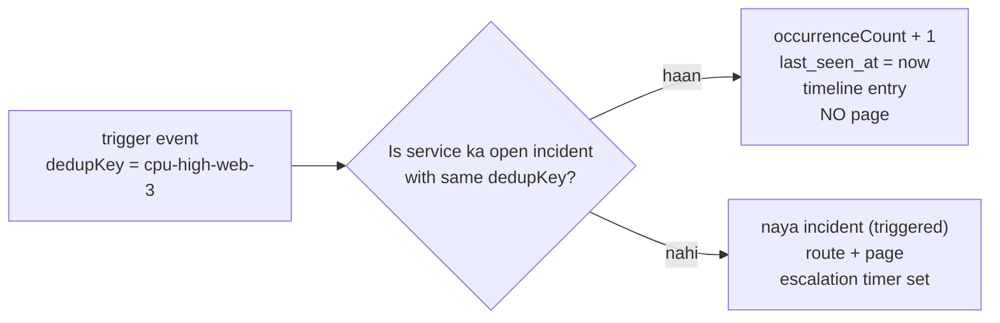
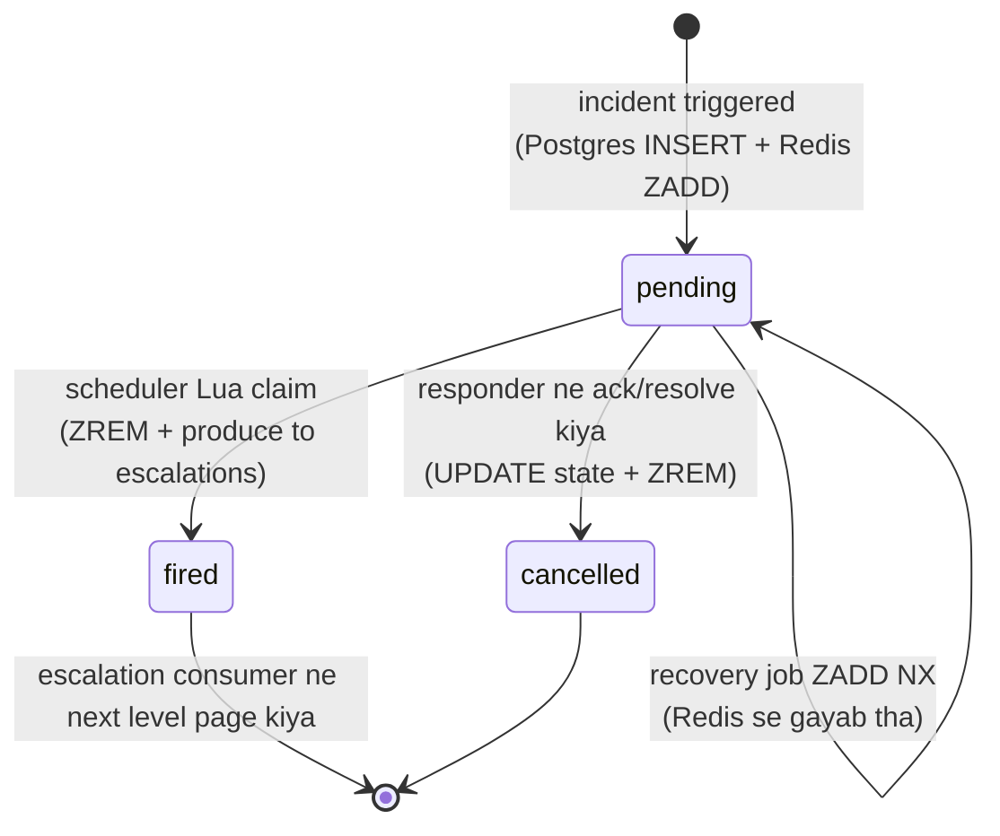

# Notification / Paging System -- HLD + LLD (Part 3: Dedup -> Timers -> Retries -> Concurrency -> Redis State)

> Is file mein prompt ke **Parts 13-15** hain, is system ke hisaab se: dedup key design, **delayed job / timer scheduling** (is poore system ka dil), on-call rotation math, backoff with jitter aur grouping -- phir is system ke saare race conditions, phir Redis state ka deep dive.
> **Part 1-2 recap (3 lines):** (1) Ingest API `POST /v2/enqueue` par event leta hai, `routingKey` validate karta hai, Kafka `incident-events` (24 partitions, key = `serviceId`) mein `acks=all` se likhta hai, aur **202 Accepted** deta hai -- processing async hai. (2) Incident Service consumer dedup karke incident banata/update karta hai (Postgres), routing nikalta hai (policy -> level -> schedule -> on-call user), `notifications` topic par tasks daalta hai, aur escalation timer schedule karta hai. (3) LLD layered hai (`routes -> controllers -> services -> repositories -> providers/workers`), aur poore system ki policy hai **at-least-once: duplicate page OK, missed page NOT** -- lekin ingest par **fail closed** (jhoot mat bolo ki accept kar liya).
> **Part 4 mein:** scaling 1x -> 1000x, failure scenarios, consistency, security, observability.

---

## PART 13 -- Important Algorithms

Is system mein "algorithm" ka matlab sorting-searching nahi hai. Paanch jagah asli algorithmic decisions hain, aur **char galat ho jaayein toh koi insaan raat ko nahi uthega**:

| # | Algorithm | Kya decide karta hai | Galat hua toh |
|---|---|---|---|
| 1 | Dedup key design | Naya incident banega ya purana update hoga | Ek problem par 240 pages, ya ek page hi nahi |
| 2 | Delayed job / timer scheduling | Escalation kab fire hoga | Escalation late, do baar, ya kabhi nahi |
| 3 | On-call rotation math | **Kis insaan** ko page jaayega | Galat aadmi ko 3 AM par call |
| 4 | Backoff with jitter | Fail hone par kab retry karein | Provider ko apne hi retries se maar dena |
| 5 | Grouping / storm suppression | 500 alerts par kitne pages bhejein | Phone 500 baar bajega, aadmi silent kar dega |

---

### Algorithm 1 -- Dedup key design

#### `dedupKey` hai kya?

**Term: dedupKey** -- ek stable string jo kehta hai "ye **wahi problem** hai jo main pehle bata chuka tha". Prometheus Alertmanager har **30 second** par same alert repeat bhejta hai jab tak problem zinda hai -- 2 ghante ka outage matlab **240 events**. Agar hum har event par naya incident banayein:

```
02:00:00  event -> incident #1   -> page Asha
02:00:30  event -> incident #2   -> page Asha
02:01:00  event -> incident #3   -> page Asha
...
04:00:00  event -> incident #240 -> page Asha (jo 03:10 par phone silent kar chuki hai)
```

Asha ne 03:10 par phone silent kar diya, aur **agle 4 ghante ka koi bhi naya critical alert miss ho jaayega**. Ye "alert fatigue" hai, aur yahi is product ka number-one failure mode hai: system technically kaam kar raha hai, par insaan ne sunna band kar diya.

Isliye client har event ke saath ek `dedupKey` bhejta hai (`"dedupKey": "cpu-high-web-3"`). 240 events, same key -> **1 incident**, `occurrenceCount = 240`, **ek page**. Spec ka number yahin se aata hai: **50M events/day, dedup ratio ~95% -> 2.5M incidents/day**. Yaani 95% traffic ka kaam sirf "counter badhao, chup raho" hai.

#### Client `dedupKey` na bheje toh? (`sha1(summary + source)` aur uski kamzori)

```ts
// src/utils/dedup-key.ts
import { createHash } from 'node:crypto';

export function deriveDedupKey(summary: string, source: string): string {
  return createHash('sha1').update(`${summary}|${source}`).digest('hex');
}
```

**Code Explanation:**

- `createHash('sha1')` -- 40-char hex fingerprint. Yahan **security use nahi hai** (koi signature verify nahi ho rahi), sirf ek short deterministic id chahiye -- isliye SHA-1 ki collision weakness yahan threat nahi hai. (Webhook signature mein HMAC-SHA256 hoga -- Part 4.)
- `${summary}|${source}` -- separator zaruri hai, warna `"ab"+"c"` aur `"a"+"bc"` same string ban jaate hain.
- Output seedha `dedup_key` column mein jaata hai; Postgres ko fark nahi ki key client ne di ya humne derive ki.

**Asli kamzori (interview mein yahi poochha jaata hai):** hash apne **input ki stability** par depend karta hai, aur monitoring ka `summary` almost hamesha dynamic hota hai:

```
02:00:00  "CPU 91.4% on web-3"  -> sha1 7f2a...  -> incident #1
02:00:30  "CPU 92.7% on web-3"  -> sha1 c19b...  -> incident #2   [X]
02:01:00  "CPU 90.1% on web-3"  -> sha1 4ee0...  -> incident #3   [X]
```

Ek number badla, hash badla, dedup khatam -- wahi 240-page disaster. Aur ulta bhi bura hai: `summary` bahut generic ho (`"health check failed"`, source `"prod"`) toh **do bilkul alag problems ek incident mein merge** ho jaayengi, ek ack se dono "handle" lagenge -- ye **missed page** hai.

| Approach | Dedup behaviour | Verdict |
|---|---|---|
| Client-supplied `dedupKey` (`cpu-high-web-3`) | Stable, client ke control mein | **Best** -- docs mein strongly recommended |
| `sha1(summary + source)` | Summary mein number/timestamp = har baar naya | Fallback only, warn karo |
| `sha1(source + alertName + labels)` (Alertmanager fingerprint) | Stable (dynamic values labels mein nahi hote) | Achha, par har client ke paas labels nahi |
| Sirf `source` | Ek host ki har problem ek incident | Over-merge -> missed page |

Production rule: (1) derive karne par response mein derived key wapas bhejo taaki client dekh sake; (2) derive karte waqt **sirf summary** ko normalize karo (`/\d+(\.\d+)?/g -> '#'`, toh 91.4% aur 92.7% ek ho jaate hain) -- `source` ko kabhi normalize mat karo warna `web-3` aur `web-7` merge ho jaayenge; (3) `dedup_hits_total` vs `incidents_created_total` ka ratio monitor karo -- kisi service ka 95% se girke 20% ho jaaye toh customer ka dedup key toota hai, unko batao.

#### Dedup ka **window** kya hai? (yahi asli design decision hai)

Do bilkul alag semantics possible hain: **(a) time-window** -- "same key ko agle 5 min ignore karo" (`SET dedup:<k> 1 NX EX 300`); **(b) open-incident (hamara)** -- "jab tak incident `resolved` nahi hota, naya incident mat banao", chahe 3 ghante lag jaayein.



| | Time-window (5 min TTL) | **Open-incident (hamara)** |
|---|---|---|
| Kahan store hota | Redis key with TTL | Postgres partial unique index |
| Long outage (3 ghante) | TTL expire -> **naya incident** jabki purana abhi open hai -> duplicate page | Ek incident, count 240 |
| Problem fix hui, 2 min baad wapas aayi | Window abhi zinda -> **naya page nahi** -> **MISSED page** [X] | Purana `resolved` -> index se bahar -> naya incident + page [OK] |
| Human mental model | "5 minute" -- kisne decide kiya? | "Ek problem = ek incident jab tak koi band na kare" |
| Redis chala gaya | Dedup toot gaya | Sirf fast path gaya, correctness Postgres mein |

Dekho ki time-window **dono directions mein galat** hai -- lambi problem par extra pages, jaldi wapas aayi problem par missed page. Isliye:

> **Hamara dedup window = incident ka lifetime, clock ka window nahi.**

```sql
CREATE UNIQUE INDEX incidents_open_dedup_uniq
  ON incidents (service_id, dedup_key)
  WHERE status <> 'resolved';
```

**Code Explanation:**

- `UNIQUE (service_id, dedup_key)` -- ek service ke andar ek dedup_key sirf ek baar. `service_id` pehle, kyunki do customers dono `"disk-full"` bhej sakte hain.
- `WHERE status <> 'resolved'` -- ye **partial index** hai: index mein sirf **open** incidents hain. Incident resolve hote hi uski row **index se nikal jaati hai** aur wahi `(service_id, dedup_key)` dobara free ho jaata hai. **Poora "dedup window" isi ek `WHERE` clause mein encode hai** -- is lesson ki sabse elegant line yahi hai.
- Bonus: index chhota rehta hai (sirf ~3,500 open incidents typical) toh RAM mein hai aur lookups fast hain, jabki table mein 90 din ka ~450 GB data pada hai.

#### Naive approach -- "pehle Redis check karo, phir insert karo" ek race hai

```ts
// BUGGY -- sirf samajhne ke liye
const existingId = await redis.get(`dedup:${serviceId}:${dedupKey}`);
if (existingId) { await incidentRepo.bumpCount(existingId); return; }
const incident = await incidentRepo.insert({ serviceId, dedupKey, ... });
await redis.set(`dedup:${serviceId}:${dedupKey}`, incident.id, 'EX', 21600);
await page(incident);
```

Ye "check-then-act" hai -- Rate Limiter Part 14 ka **GET-then-SET** wapas aa gaya, bas ab stakes zyada hain:

```
Time   Worker A (partition 7)           Worker B (rebalance ke baad wahi partition)
t1     GET dedup:svc:cpu-high -> nil
t2                                      GET dedup:svc:cpu-high -> nil
t3     INSERT incident #1
t4                                      INSERT incident #2
t5     SET dedup -> #1
t6                                      SET dedup -> #2     (overwrite!)
t7     page(#1)                         page(#2)

Ek problem, DO incidents, DO pages. Aur Redis ab #2 ko point karta hai, toh #1
ek "orphan open incident" ban gaya -- koi use resolve nahi karega, dashboard par
hamesha pada rahega.
```

Ye kab hota hai (detail Part 14 mein): Kafka **rebalance** (purana consumer abhi batch process kar raha hai, naya partition le chuka hai), ek hi process ke andar `eachBatch` + `Promise.all`, Kafka redelivery, Redis failover ya `allkeys-lru` eviction se `dedup:` key udd jaana.

**Asli fix: race ko database ko de do.** Unique index ek atomic conditional insert deta hai:

```sql
INSERT INTO incidents (id, service_id, dedup_key, status, severity, summary, source)
VALUES ($1, $2, $3, 'triggered', $4, $5, $6)
ON CONFLICT (service_id, dedup_key) WHERE status <> 'resolved'
DO UPDATE SET occurrence_count = incidents.occurrence_count + 1,
              last_seen_at     = now()
RETURNING id, status, occurrence_count, (xmax = 0) AS inserted;
```

**Code Explanation:**

- `ON CONFLICT (...) WHERE status <> 'resolved'` -- partial index ke liye **uska predicate repeat karna zaruri hai**, warna error: `there is no unique or exclusion constraint matching the ON CONFLICT specification`. Ye pehli baar sab galat karte hain.
- `incidents.occurrence_count + 1` -- `incidents.` = table ki current row (naya proposed row `excluded.` hota hai).
- `RETURNING ... (xmax = 0) AS inserted` -- **yahi trick hai**: ek hi statement se pata chal jaata hai ki row **nayi bani** (page karo) ya **purani update hui** (chup raho). Ek round trip, zero race.

#### `xmax = 0` kaise kaam karta hai -- do concurrent inserts

**Term: xmin / xmax** -- Postgres MVCC mein har row version ke do chhupe system columns: `xmin` = kisne banaya, `xmax` = kisne delete/lock kiya. Fresh insert ko kisi ne lock nahi kiya -> **`xmax = 0`**. `ON CONFLICT DO UPDATE` ke update path mein Postgres conflicting row ko pehle **lock** karta hai, isliye returned tuple par `xmax` non-zero aata hai.

```
                 T1 (worker A)                       T2 (worker B)
t1   BEGIN
t2   INSERT ... ON CONFLICT ...
     (row bani, COMMIT nahi hua)
t3                                       BEGIN
t4                                       INSERT ... ON CONFLICT ...
                                         -> unique index par T1 ki uncommitted row
                                            mili -> T2 BLOCK (T1 ka faisla ka wait)
t5   COMMIT
t6                                       T2 jaga: row exist karti hai -> DO UPDATE
                                         -> occurrence_count 1 -> 2
                                         -> inserted = FALSE
t7                                       COMMIT

T1: inserted = TRUE,  occurrence_count = 1  -> PAGE
T2: inserted = FALSE, occurrence_count = 2  -> sirf timeline entry
```

Poora race **database ne** handle kiya -- na lock, na Lua, na coordination; T2 ne 1-2 ms extra wait kiya. Aur agar T1 **rollback** ho jaata (worker crash)? T2 jagta hai, row hai hi nahi, toh T2 **insert** karta hai aur `inserted = TRUE` paata hai -> page jaata hai. **Koi page kho nahi sakta** -- yahi behaviour chahiye.

> **Honesty note:** `xmax = 0` widely-used trick hai par Postgres ka **internal implementation detail** hai, documented API nahi. Portable alternatives: `RETURNING occurrence_count` -> `=== 1` matlab naya (`DO UPDATE` hamesha 2+ karta hai) -- **main production mein yahi prefer karunga**; ya CTE pattern (`ON CONFLICT DO NOTHING RETURNING id`, 0 rows aaye toh alag `UPDATE`). Interview mein `xmax = 0` bolna impressive hai, saath mein ye caveat bolna **zyada** impressive.

#### Toh Redis ka kaam kya bacha? (sirf fast path)

```ts
// src/services/incident.service.ts (dedup path)
const cacheKey = `dedup:${serviceId}:${dedupKey}`;
const cachedId = await redisCache.get(cacheKey).catch(() => null);   // Redis down -> null

if (cachedId) {
  const bumped = await incidentRepo.bumpOccurrence(cachedId, receivedAt);
  if (bumped) { metrics.dedupHits.inc(); return { incidentId: cachedId, isNew: false }; }
  await redisCache.del(cacheKey).catch(() => {});                    // stale cache -> full path
}

const row = await incidentRepo.upsertOpen({ serviceId, dedupKey, severity, summary, source });
await redisCache.set(cacheKey, row.id, 'EX', 21600).catch(() => {}); // TTL 6h, best effort
return { incidentId: row.id, isNew: row.occurrenceCount === 1 };
```

**Code Explanation:**

- `.catch(() => null)` / `.catch(() => {})` -- Redis down hona **kabhi bhi** paging ko nahi rokna chahiye. Miss = Postgres path, bas 1-2 ms slow. ("Cache fail-open, ingest fail-closed.")
- `bumpOccurrence` ka SQL: `UPDATE incidents SET occurrence_count = occurrence_count + 1, last_seen_at = $2 WHERE id = $1 AND status <> 'resolved'` -- **primary key par UPDATE**, jo unique-index conflict resolve karne se sasta hai. 95% traffic yahi hai: peak 6,000 eps mein se ~5,700 events yahin ruk jaate hain.
- `if (bumped)` false hone ka matlab cache stale hai (incident resolve ho chuka) -> `DEL` karke full upsert path par giro, jo naya incident bana dega -- jo sahi hai.
- `EX 21600` = 6 ghante (spec). Zyadatar incidents pehle resolve ho jaate hain (p95 ack 10 min); usse lambe incidents Postgres path par jaayenge -- correct, bas slow.
- `isNew: row.occurrenceCount === 1` -- **yahi ek boolean poore system ko chalata hai**: `true` -> routing + page + escalation timer; `false` -> sirf timeline.

**Interview line:**

> "Dedup ka source of truth Redis nahi, Postgres ka **partial unique index** `(service_id, dedup_key) WHERE status <> 'resolved'` hoga. Isse dedup window 'clock ka 5 minute' nahi, 'incident ka lifetime' ban jaata hai -- jo product ka mental model hai. `ON CONFLICT DO UPDATE ... RETURNING (xmax = 0)` se ek atomic statement mein pata chal jaata hai ki page karna hai ya sirf counter badhana. Redis sirf fast path hai 95% repeat events ke liye, aur wo kho jaaye toh sirf latency badhti hai, correctness nahi."

---

### Algorithm 2 -- Delayed job / timer scheduling (is system ka dil)

#### Problem zero se

Requirement #6: level ka `ackTimeoutMin` (default **5 min**) khatam -> agle level par page; `repeatCount` (default **2**) ke baad stop. Matlab chahiye:

> "Abhi 02:00:00 hai. **02:05:00 par** ye code chalao -- lekin sirf tab jab tak incident acknowledged na ho gaya ho. Aur beech mein koi bhi machine restart ho sakti hai, deploy ho sakta hai, Redis failover ho sakta hai."

Scale (spec): active incidents typical **~3,500**, storm mein **~50,000**, har incident ke saath 1 pending timer -> 50,000 x ~100 B = **5 MB**. Toh dhyan se suno:

> **Timers ki problem memory nahi hai. Problem hai durability, duplicate-fire, aur poll fairness.**

#### Saare options, ek table mein

| Approach | Kaise kaam karta hai | Granularity | Durability | HA behaviour | Kya toota hai |
|---|---|---|---|---|---|
| In-process `setTimeout` / timer wheel | Process ki memory mein timer, event loop fire karta hai | ms | **Zero** -- process gaya, timer gaya | Har instance ke apne timers, koi coordination nahi | Deploy / crash / OOM = **saare pending escalations gayab, silently**. Na page, na error |
| Cron (`* * * * *`) | Har minute ek job: "due timers nikaal ke chalao" | **1 min** | Durable (query DB se) | 2 nodes par cron = **dono same rows uthayenge** | 1 min granularity (5 min timeout par 20% error) + har minute :00 par thundering herd |
| DB polling + `FOR UPDATE SKIP LOCKED` | `SELECT ... WHERE due_at <= now() AND state='pending' ORDER BY due_at LIMIT 500 FOR UPDATE SKIP LOCKED` | ~1 s (poll interval) | **Full** (Postgres) | Safe -- `SKIP LOCKED` se har row ek hi worker ko | Har second N workers ka query + har fire par UPDATE = dead tuples, vacuum, constant DB load |
| **Redis ZSET + atomic Lua claim (hamara)** | `ZADD sched:escalations <dueAtMs> <timerId>`; scheduler har 1 s `ZRANGEBYSCORE` + `ZREM` ek Lua mein | **1 s** | Redis mein nahi -- isliye **Postgres durable copy + recovery job** | 2+ instances safe (claim atomic hai), koi leader election nahi | Durable copy bhool gaye toh Redis failover/wipe = timers gayab |
| Kafka delayed topic tiers | Fixed-delay topics (`delay-5m`, `delay-30m`); consumer paused rehta hai jab tak due na ho | Tier jitna | Full (Kafka) | Partition ownership se safe | Sirf **fixed** delays, arbitrary `dueAt` nahi; **cancel lagbhag impossible**; head-of-line blocking |
| SQS `DelaySeconds` | Message N sec baad visible | 1 s | Full (SQS) | Managed | **Max 15 minutes.** Hamari chain (3 levels x 5 min x repeat 2 = 30 min+) fit hi nahi hoti; cancel bhi nahi |
| Cloud scheduler (EventBridge Scheduler / Cloud Tasks) | Per-timer ek scheduled HTTP call | 1 s | Full (managed) | Managed | Per-timer API call = 50,000 create/delete per storm minute; rate limits, per-schedule cost, lock-in |

**Timer wheel ek line mein (naam interview mein girta hai):** buckets ka array, har bucket = 1 tick; "3 sec baad" wala timer `(current + 3) % 60` bucket mein O(1) daal do; har tick par us bucket ki list fire karo; 1 minute se lambe timers ke liye entry mein `rounds` counter rakho. Kafka apne request purgatory mein yahi use karta hai. **Lekin ye memory mein hai** -- hamara process har deploy par marta hai aur hamare timers 5-60 min ke hain.

#### Hamara choice: Redis ZSET

**Term: ZSET (sorted set)** -- har member ke saath ek number ("score"); members hamesha score ke order mein sorted; score-range se nikalna O(log N + M).

```
ZADD sched:escalations 1776412800000 "tmr_9f3a..."   (member = escalationTimerId, score = dueAtMs)

sched:escalations (hamesha sorted by dueAt):
  tmr_aa11  1776412500000   (02:05:00)   <- sabse pehle due
  tmr_bb22  1776412530000   (02:05:30)
  tmr_cc33  1776412800000   (02:10:00)
```

"Due kaun hai?" = `ZRANGEBYSCORE sched:escalations -inf <now>`. Bas.

#### Claim script -- spec ka Lua, line by line

```lua
-- KEYS[1] = 'sched:escalations', ARGV[1] = now ms, ARGV[2] = batch size
local due = redis.call('ZRANGEBYSCORE', KEYS[1], '-inf', ARGV[1], 'LIMIT', 0, tonumber(ARGV[2]))
if #due > 0 then redis.call('ZREM', KEYS[1], unpack(due)) end
return due
```

**Code Explanation:**

- `KEYS[1]` -- ZSET ka naam `ARGV` mein nahi, `KEYS` mein. Redis Cluster isi se decide karta hai script kis node par chalegi (Rate Limiter Part 14 ka rule).
- `ARGV[1] = now ms` -- yahan hum **Node ka `Date.now()`** bhej rahe hain, Redis ka `TIME` nahi. Rate limiter mein ulta tha! Farak kyun: wahan skew se **tokens** ban jaate the (correctness); yahan skew se timer 100 ms jaldi/der se fire hoga -- 5 minute ke timeout aur 10 s lag budget mein irrelevant. (`redis.call('TIME')` bhi theek hai; bas ek consistent choice rakho aur `timer_lag_seconds` se verify karo.)
- `ZRANGEBYSCORE KEYS[1] '-inf' ARGV[1]` -- shuru se "ab" tak ke saare members. `'-inf'` ek string literal hai jise Redis "sabse chhota score" samajhta hai.
- `'LIMIT', 0, tonumber(ARGV[2])` -- **ye LIMIT bahut important hai.** Storm mein 50,000 timers ek saath due ho sakte hain; bina LIMIT ke script 50,000 members ek reply mein bhejegi aur Redis ko lambe time block kar degi (Redis single-threaded hai -- script chalte waqt **koi doosra client kuch nahi kar sakta**). Batch 500, baaki agle iteration mein.
- `tonumber(ARGV[2])` -- Redis ko har ARGV **string** mein milta hai (`"500"`); `LIMIT` ko number chahiye.
- `#due` -- Lua mein table length. `ZREM` ko khaali list bhejna error hai, isliye guard.
- `unpack(due)` -- table ko alag-alag arguments mein todta hai: `ZREM key m1 m2 m3 ...`. **Caveat:** bahut badi table par `unpack` "too many results to unpack" deta hai (stack limit ~8000) -- isliye LIMIT ko kabhi 1000 se upar mat le jaana.
- `return due` -- ioredis mein ye JS `string[]` ban ke aata hai.

**`ZRANGEBYSCORE` aur `ZREM` atomic kyun hone chahiye?** Alag-alag commands mein (ya `await` ke aar-paar) kiya toh:

```
Time   Scheduler-1                        Scheduler-2
t1     ZRANGEBYSCORE -> [tmr_aa11]
t2                                        ZRANGEBYSCORE -> [tmr_aa11]  (abhi hata nahi!)
t3     ZREM tmr_aa11 -> 1
t4                                        ZREM tmr_aa11 -> 0
t5     produce escalation(tmr_aa11)       produce escalation(tmr_aa11)
```

Nuksaan sirf "ek extra SMS" nahi: `escalation_round` **do baar** badhega -> `repeatCount = 2` **aadhe waqt mein exhaust** -> incident ko "escalation exhausted" mil jaayega jabki asal mein ek hi round hua tha. **Duplicate fire aage chal kar MISSED escalation banta hai.** Aur level-2 wala banda do baar page hoke timeline confuse karega.

Lua mein dono ek saath hain -> Redis script ko ek bade command ki tarah chalata hai -> Scheduler-2 ka `ZRANGEBYSCORE` tabhi chalta hai jab Scheduler-1 ka `ZREM` ho chuka hota hai -> usko khaali list milti hai. Isiliye spec kehta hai "**2+ scheduler instances chal sakte hain, leader election ki zarurat nahi**".

> Leader election (ek active scheduler, baaki standby) bhi valid design hai, par leader **single point of failure** ban jaata hai: leader ka 30 s GC pause = 30 s tak koi escalation nahi. Atomic claim se sab active reh sakte hain -- simple aur zyada available.

#### Durable copy + recovery job -- is design ki sabse badi galti se bachna

> **"Timers ko sirf Redis mein rakhna is system ki sabse badi galti hogi."**

Teen tareeke se Redis timers kha jaata hai, aur **teeno chup-chaap**:

1. **Failover:** replication async hai. Primary gira, replica promote hua -> last kuch ms/seconds ke `ZADD` replica tak pahunche hi nahi the.
2. **Restart without persistence:** maintenance / instance replace -> `sched:escalations` khaali.
3. **Eviction (sabse khatarnak):** `allkeys-lru` par Redis memory pressure mein koi bhi key hata sakta hai -- aur `sched:escalations` **ek hi key hai jismein 50,000 timers hain**. Ek eviction = **saare pending escalations ek saath gayab**. Na error, na log.

Isliye har timer **do jagah** likha jaata hai, aur Postgres wali copy source of truth hai:

```sql
CREATE TABLE escalation_timers (
  id UUID PRIMARY KEY, incident_id UUID NOT NULL, level INT NOT NULL,
  due_at TIMESTAMPTZ NOT NULL, state TEXT NOT NULL DEFAULT 'pending'  -- pending|fired|cancelled
);
CREATE INDEX escalation_timers_due ON escalation_timers (due_at) WHERE state = 'pending';
```

```ts
// src/services/escalation.service.ts
async function scheduleEscalation(incidentId: string, level: number, ackTimeoutMin: number) {
  const timerId = randomUUID();
  const dueAt = new Date(Date.now() + ackTimeoutMin * 60_000);

  await timerRepo.insertPending({ id: timerId, incidentId, level, dueAt });   // 1) DURABLE, inside tx
  try {
    await redisState.zadd('sched:escalations', dueAt.getTime(), timerId);     // 2) FAST, best effort
  } catch (err) {
    log.warn({ err, timerId }, 'zadd failed, recovery job will pick it up');
  }
}
```

**Code Explanation:**

- **Order matters:** pehle Postgres, phir Redis. Ulta karte toh Postgres fail hone par ek timer Redis mein hota jiska DB record hi nahi -- wo fire hoke consumer ko confuse karta.
- `insertPending` usi transaction mein hai jismein incident insert aur timeline entry hai -- **ek atomic unit**. Warna "incident bana par timer nahi" = escalation kabhi nahi.
- `try/catch` with `warn` -- Redis ka fail hona exception nahi hai, recovery job 60 s mein theek kar dega. Yahan throw karte toh Kafka message re-deliver hota aur duplicate processing hoti -- chhoti problem ke liye bada nuksaan.
- `dueAt.getTime()` -- ZSET score epoch **milliseconds**, DB mein `TIMESTAMPTZ`. Dono UTC instants, koi timezone conversion nahi.

```ts
// src/workers/scheduler.ts (recovery loop, har 60 s)
async function recoverTimers(lookahead = "interval '5 minutes'") {
  const { rows, rowCount } = await pg.query<{ id: string; due_at: Date }>(
    `SELECT id, due_at FROM escalation_timers
      WHERE state = 'pending' AND due_at < now() + ${lookahead}
      ORDER BY due_at LIMIT 10000`
  );
  if (rowCount === 0) return;
  const pipeline = redisState.pipeline();
  for (const r of rows) pipeline.zadd('sched:escalations', 'NX', r.due_at.getTime(), r.id);
  await pipeline.exec();
  metrics.timersRecovered.inc(rowCount);
}
```

**Code Explanation:**

- `state = 'pending'` -- jo fire/cancel ho chuke unko wapas nahi laana. Yahi isko idempotent banata hai.
- `due_at < now() + interval '5 minutes'` -- **sirf agle 5 minute ka window**, kyunki ye har 60 s chalti hai aur ZSET normally bhara hua hai; humein sirf "jo jaldi due hai" ki guarantee chahiye. Chhota window + partial index `escalation_timers_due` = query milliseconds mein.
- `zadd(..., 'NX', ...)` -- **NX = only if member does not exist**: already-present timer ka score overwrite nahi hoga (warna aap uska fire postpone kar dete). Isse 2 scheduler instances ek saath chala sakte hain.
- `pipeline()` -- 10,000 round trips nahi, ek network write (single key hai toh cluster mein bhi ek hi node).
- **Cold start:** boot par ek baar wider backfill chalao (`interval '60 minutes'`), kyunki poora Redis wipe ho sakta hai aur 5-minute window se rebuild slow hoga.
- **Honest gap:** Redis wipe ke baad, recovery chalne tak, due escalations **60 s tak late** honge. Ack timeout 5 min hai toh acceptable, aur `timer_lag_seconds` ispar chillayega.

#### Timer ka poora lifecycle



Galti se `fired` timer dobara aa gaya (failover ke baad purana snapshot)? Consumer ka DB guard `UPDATE ... WHERE state = 'pending'` 0 rows dega -> drop. **Timer hint hai, DB truth hai.**

---

### Algorithm 3 -- On-call rotation math

#### Problem aur formula

`resolveOnCall(scheduleId, at: Date): User[]` -- "02:07 AM par is schedule par **kaun** hai?" Sunne mein calendar lookup lagta hai, hai **modular arithmetic**: schedule mein "kaun kab" ki rows nahi hoti, sirf ek rule hota hai (`rotation_length_sec`, `handoff_at` anchor, ordered `member_ids[]`). `handoff_at` ka matlab: "is instant par member index 0 ki shift shuru hui thi".

```
index = floor((at - handoffAt) / rotationLengthMs) % memberIds.length
```

#### Worked example (asli dates ke saath)

```
handoffAt         = 2026-03-02T09:00:00Z
rotationLengthSec = 604800  (weekly)
memberIds         = [asha, bilal, chen]   (length 3)
Query at          = 2026-04-14T06:30:00Z

Step 1 -- elapsed
  2026-03-02T09:00Z -> 2026-04-14T09:00Z = 43 days; humein 06:30 chahiye (2.5 h peeche)
  elapsed = 43 days - 2.5 h = 42 days 21.5 h = 42 x 86400 + 77400 = 3,706,200 s

Step 2 -- rotations complete
  3,706,200 / 604,800 = 6.128...  -> floor -> 6

Step 3 -- index
  6 % 3 = 0  ->  memberIds[0] = asha

Step 4 -- shift boundaries (UI ke "until" ke liye)
  start = handoffAt + 6 x 604800 s = 2026-04-13T09:00:00Z
  end   = 2026-04-20T09:00:00Z     -> 04-14 06:30 is window ke andar hai [OK]
```

```ts
// src/services/oncall.service.ts
export function rotationMemberAt(layer: ScheduleLayer, at: Date): string {
  const rotationMs = layer.rotationLengthSec * 1000;
  const elapsed = at.getTime() - layer.handoffAt.getTime();
  const n = layer.memberIds.length;
  const raw = Math.floor(elapsed / rotationMs);
  return layer.memberIds[((raw % n) + n) % n];          // negative-safe
}
```

**Code Explanation:**

- `at.getTime() - handoffAt.getTime()` -- dono **UTC epoch ms**. Koi timezone math yahan nahi, aur yahi is function ki safety hai.
- `Math.floor` (na ki `Math.trunc`) -- negative par bhi neeche ki taraf jaaye.
- `((raw % n) + n) % n` -- **ye line bug fix hai, style nahi.** JS mein `%` negative de sakta hai (`-1 % 3 === -1`) aur `memberIds[-1]` `undefined` hai. Kab hoga? Past ka schedule dekhne par (`GET /api/v1/oncall?at=<handoffAt se pehle>`), ya jab admin `handoff_at` future mein set kare ("next Monday se rotation") -- bilkul common. Bina is line ke `resolveOnCall` `undefined` deta hai aur page **kisi ko nahi** jaata. Ek `%` ki wajah se missed page.
- Daily check: `rotationLengthSec = 86400`, at = 2026-03-05T10:00Z -> elapsed 262,800 s -> `floor(262800/86400) = 3` -> `3 % 3 = 0` -> asha wapas (3 logon ka daily cycle).

#### Layers aur overrides -- precedence

| Priority | Source | Example | Note |
|---|---|---|---|
| 1 (highest) | `schedule_overrides` | Dev, 2026-04-14T00:00Z to 04-15T00:00Z | Exact window; overlapping mein latest `starts_at` jeetta hai |
| 2 | Highest-priority layer **jiska restriction abhi active hai** | "business hours" 09:00-18:00 Mon-Fri | Restriction bahar = layer khaali, neeche wali dekho |
| 3 | Base layer (koi restriction nahi) | 24x7 weekly rotation | Hamesha kisi na kisi ko deta hai |
| 4 | Koi nahi mila | -- | **Alert + account admin ko page** -- "schedule gap" silent nahi rehna chahiye |

```ts
export async function resolveOnCall(scheduleId: string, at: Date): Promise<string[]> {
  const override = await scheduleRepo.findActiveOverride(scheduleId, at);
  if (override) return [override.userId];

  const schedule = await scheduleRepo.byId(scheduleId);
  for (const layer of await scheduleRepo.layersByPriorityDesc(scheduleId)) {
    if (!restrictionActive(layer.restriction, at, schedule.timezone)) continue;
    return [rotationMemberAt(layer, at)];
  }
  metrics.scheduleGaps.inc({ scheduleId });
  return [];
}
```

**Code Explanation:**

- `findActiveOverride` ka SQL: `WHERE schedule_id = $1 AND starts_at <= $2 AND ends_at > $2 ORDER BY starts_at DESC LIMIT 1` -- `ends_at > $2` (strictly greater) taaki back-to-back overrides ke boundary par dono match na karein. Index spec mein hai: `(schedule_id, starts_at, ends_at)`.
- `restrictionActive(..., schedule.timezone)` -- **yahan aur sirf yahan** timezone use hota hai, kyunki restriction ek **wall-clock** rule hai ("09:00-18:00 local"). Rotation math UTC par rehta hai.
- `return []` par metric -- gap ko chup-chaap swallow mat karo; gap ka matlab hai page kahin nahi jaayega.

#### DST trap (interview mein ye poochha jaata hai)

**Term: DST** -- kuch countries saal mein do baar ghadi 1 ghanta aage/peeche karte hain. Do exact problems:

```
(a) SPRING FORWARD -- woh waqt exist hi nahi karta
    America/New_York, 8 March 2026:  01:59:59 EST -> agli second -> 03:00:00 EDT
    Schedule ka handoff "har din 02:00 local" hai? 8 March ko 02:00 local HAI HI NAHI.
    Naive code `new Date(2026, 2, 8, 2, 0, 0)` chupchaap 03:00 EDT (ya 01:00) bana deta hai
    -> ek handoff skip ya repeat -> galat aadmi ko 3 AM page.

(b) FALL BACK -- woh waqt DO baar aata hai
    1 November 2026: 01:00-01:59 EDT, phir DOBARA 01:00-01:59 EST
    "01:30 local" do instants hain (UTC 05:30 aur 06:30).
    Handoff do baar fire kar sakta hai, ya ek ghante ke liye DONO on-call dikhte hain.
```

> **Rule jo hamesha bachata hai: store UTC instants, rotation math UTC epoch arithmetic se karo, aur timezone sirf (a) restrictions evaluate karne aur (b) UI par dikhane ke liye -- wo bhi IANA naam (`Asia/Kolkata`) se, fixed offset (`+05:30`) se nahi. `new Date(y, m, d)` kabhi mat likho -- wo server ki local tz use karta hai, jo container mein UTC hai aur laptop par kuch aur.**

Hamara schema isi par bana hai: `handoff_at TIMESTAMPTZ` (UTC instant), `rotation_length_sec INT` (duration, calendar unit nahi), `schedules.timezone TEXT` (IANA, alag column).

```ts
import { DateTime } from 'luxon';

function restrictionActive(r: Restriction | null, at: Date, tz: string): boolean {
  if (!r) return true;
  const local = DateTime.fromJSDate(at, { zone: tz });       // UTC instant -> local wall clock
  if (!r.daysOfWeek.includes(local.weekday)) return false;   // Luxon: 1 = Monday ... 7 = Sunday
  const minutes = local.hour * 60 + local.minute;
  return minutes >= r.startMinute && minutes < r.endMinute;
}
```

**Code Explanation:**

- `DateTime.fromJSDate(at, { zone: tz })` -- ek **UTC instant** ko us schedule ki local wall-clock mein dekhna; Luxon IANA database se DST khud handle karta hai, aur `at` kabhi modify nahi hota.
- `local.weekday` -- Luxon mein 1 = Monday, 7 = Sunday. **Sawdhan:** native `Date.getDay()` mein 0 = Sunday -- ye off-by-one weekend on-call ko Monday par shift kar deta hai, classic production bug.
- `minutes < r.endMinute` -- end exclusive, taaki 18:00 par din-wali aur raat-wali layer dono active na dikhein.
- Note karo ki "02:00 exist karta hai ya nahi" wala sawaal yahan uthta hi nahi -- kyunki hum **instant -> local** convert kar rahe hain (hamesha possible), na ki local -> instant (kabhi impossible/ambiguous).

**Product-level trade-off:** `rotation_length_sec = 604800` ek fixed duration hai, toh weekly handoff hamesha same **UTC** instant par hoga, par DST ke baad local wall-clock 1 ghanta khisak jaayega (09:00 -> 08:00). PagerDuty jaise products wall-clock fix rakhte hain (calendar arithmetic: Luxon `local.plus({ weeks: 1 })` in tz). Dono valid: fixed duration = pure integer math, testable, DST par local time khisak jaata hai; calendar-based = local time same, par har query par tz calculations aur non-existent 02:00 ke liye explicit policy chahiye. Internal tool ke liye pehla, customer-facing product ke liye doosra.

**Interview line:**

> "On-call resolution modular arithmetic hai: `floor((at - handoffAt) / rotationLength) % members.length`, `handoffAt` ek UTC anchor. JS ke negative modulo se bachne ke liye `((x % n) + n) % n`. Upar layer priority aur overrides apply hote hain, override sabse upar. Timezone sirf restrictions aur display mein, rotation math hamesha UTC par -- kyunki spring-forward par local 02:00 exist hi nahi karta aur fall-back par do baar aata hai."

---

### Algorithm 4 -- Backoff with jitter

#### Problem, numbers ke saath

Twilio 5 second ke liye 500 dene lagta hai (unke side ka deploy). Us waqt hamare paas **1,000 notifications in flight** hain (peak ~1,000/sec).

**Naive retry (no backoff):** sab turant retry -> fail -> turant... ek loop jo CPU, connections aur Twilio teeno ko maar deta hai, aur unke recovery ko aur slow karta hai.

**Plain exponential backoff** (`delay = 1000 * 2^attempt`):

```
t=0.000s   1,000 notifications fail (Twilio 500)
t=1.000s   1,000 retries EK SAATH   (sab ka attempt 0 -> 1000 ms)
t=3.000s   1,000 retries EK SAATH   (sab ka attempt 1 -> 2000 ms)
t=7.000s   1,000 retries EK SAATH
```

Problem dikhi? **Exponential backoff ne load kam kiya, par herd ko toda nahi.** Sab ek saath fail hue the, toh sab ka timer ek saath shuru hua, toh sab ek saath wapas aate hain -- Twilio ko har baar 1,000 ka instantaneous spike, jo usko phir gira sakta hai. Isko **thundering herd / retry storm** kehte hain. Ilaaj: **jitter** (randomness), taaki herd time par phail jaaye.

| Strategy | Formula | attempt=3 (base 8000 ms) | 1,000 retries kaise phailte hain |
|---|---|---|---|
| Plain exponential | `base` | hamesha 8000 | Sab ek hi ms par -> **1,000 req/ms** |
| Equal jitter | `base/2 + random(0, base/2)` | 4000-8000 (mean 6000) | 4 s mein phaila -> ~0.25 req/ms |
| **Full jitter (hamara)** | `random(0, base)` | 0-8000 (mean 4000) | 8 s mein phaila -> ~0.125 req/ms |

Spec ka formula: `delay = random(0, min(30000, 1000 * 2^attempt))` ms, **max 5 attempts per channel**.

```
attempt   cap = min(30000, 1000 x 2^attempt)   range            mean
0         1,000 ms                             0 - 1,000 ms     500 ms
1         2,000 ms                             0 - 2,000 ms     1,000 ms
2         4,000 ms                             0 - 4,000 ms     2,000 ms
3         8,000 ms                             0 - 8,000 ms     4,000 ms
4         16,000 ms                            0 - 16,000 ms    8,000 ms
(5 attempts = 0..4, total expected wait ~15.5 s, phir agla channel / DLQ)
```

**Full jitter kyun, equal jitter nahi?** AWS ka classic experiment (Marc Brooker, "Exponential Backoff And Jitter") mein full jitter ne sabse kam total work aur sabse kam completion time diya. Intuition: hum "har client thoda wait kare" nahi chahte, hum chahte hain "clients **alag-alag** wait karein" -- full jitter randomness maximize karta hai. Cost: kabhi-kabhi ek request `random(0, 16000) = 200 ms` nikaal ke bahut jaldi wapas aa jaati hai -- ek request ke liye "unfair", poore system ke liye achha, aur paging mein toh jaldi pahunchna hi goal hai.

```ts
// src/utils/backoff.ts
const BASE_MS = 1000, MAX_MS = 30_000;
export const MAX_ATTEMPTS = 5;

export function backoffDelayMs(attempt: number): number {
  return Math.floor(Math.random() * Math.min(MAX_MS, BASE_MS * 2 ** attempt));
}

export function isRetryable(err: ProviderError): boolean {
  if (err.permanent) return false;                       // adapter ne khud bola
  if (err.status === 429) return true;                   // rate limited -> zaroor retry
  if (err.status !== undefined && err.status >= 400 && err.status < 500) return false;
  return true;                                           // 5xx, timeout, socket error
}
```

**Code Explanation:**

- `Math.min(MAX_MS, ...)` -- cap **30 s**; bina cap ke attempt 10 par 17 minute aa jaata, escalation timeout se bhi lamba.
- `Math.random() * cap` -- **full** jitter (0 se cap tak uniform); `Math.floor` isliye ki `setTimeout` ko integer ms behtar hai.
- `err.permanent` -- spec ka `ProviderResult.permanent`. Adapter provider-specific errors translate karta hai: Twilio 21211 ("invalid 'To' number") = permanent.
- `status === 429` ka check **4xx wale check se pehle** hai. 429 technically 4xx hai par wo "abhi mat bhejo" kehta hai, "kabhi mat bhejo" nahi. Ye ordering bug bahut common hai -- 429 ko permanent maan liya toh rate-limit hone par page **hamesha ke liye** drop.
- `4xx -> false` -- invalid number ko 5 baar bhejne ka koi matlab nahi; wo paisa bhi kharch karta hai (SMS ~$0.0075 x 2.25M/day = ~$17K/day) aur sender reputation bhi kharab karta hai.
- Default `true` -- network timeout, socket hang up, unknown sab retryable. Default "retry" hona chahiye kyunki policy hai "duplicate page OK, missed page NOT".

**Paging-specific twist:** hamara SLI **page latency p95 < 5 s** hai, aur ek channel par 15 s backoff usko kha jaata hai. Isliye high-urgency (`critical|error`) par rule alag hai: attempt 0 fail -> 1 short retry (0-1 s jitter) -> phir bhi fail toh **turant agle channel** par jao (push -> SMS -> voice), lambi retries baad mein. Low urgency par poora 5-attempt backoff chalao. Aur har retry se pehle **deadline check**: incident ab `acknowledged`/`resolved` hai toh task drop karo -- warna aadmi ack karke so gaya aur 12 s baad phone phir baj raha hai.

---

### Algorithm 5 -- Grouping / storm suppression

Ek AZ gir gaya. `checkout` service ke 63 alag hosts/checks ek minute mein alert kar rahe hain. Har ek ka `dedupKey` alag hai, toh **dedup yahan kuch nahi rok sakta** -- ye 63 genuinely alag incidents hain. Bina grouping ke Asha ka phone 60 second mein **63 baar** bajega; wo 10th par phone ulta rakh degi, aur 11th wala (jo root cause tha) kabhi nahi dekha jaayega.

> **Dedup "same problem" ko rokta hai. Grouping "bahut saare alag problems ek saath" ko rokta hai.** Ye do alag mechanisms hain -- ye farak interview mein clearly bolna.

**Algorithm: Redis minute-bucket counter.** `minuteBucket = floor(Date.now() / 60000)`, key `grp:<serviceId>:<minuteBucket>`, har naye incident par `INCR`. Spec ka threshold: **count > 10** (yaani 11th se grouping), grouped notification **per 5 min**. Atomic hona zaruri hai, warna do workers dono "main pehla hoon" sochke do grouped pages bhejenge:

```lua
-- KEYS[1] = grp:<serviceId>:<minuteBucket>   KEYS[2] = grp:sent:<serviceId>
-- ARGV[1] = threshold (10), ARGV[2] = bucket ttl sec (120), ARGV[3] = grouped cooldown sec (300)
local n = redis.call('INCR', KEYS[1])
if n == 1 then redis.call('EXPIRE', KEYS[1], tonumber(ARGV[2])) end
if n <= tonumber(ARGV[1]) then return {0, n} end
local first = redis.call('SET', KEYS[2], '1', 'NX', 'EX', tonumber(ARGV[3]))
if first then return {2, n} else return {1, n} end
```

**Code Explanation:**

- `INCR` naya key khud bana deta hai (0 se 1), isliye pehle `EXISTS` check ki zarurat nahi.
- `if n == 1 then EXPIRE` -- TTL **sirf pehli baar**. Har INCR par EXPIRE karte toh busy service ka bucket kabhi expire hi na hota aur minute boundary ka matlab khatam. TTL 120 s (2 min) rakha hai, 60 nahi -- boundary par thoda overlap aur debugging mein bucket dikhna achha.
- `n <= threshold` -> return **0 = normal individual page**. Pehle 10 incidents normally page hote hain -- jaan-boojh kar, kyunki pehle kuch alerts mein hi asli signal hota hai.
- `SET KEYS[2] '1' 'NX' 'EX' 300` -- grouped page ka **cooldown**. `NX` se jo worker jeeta usko `'OK'`, baaki sabko `nil` (Lua mein `false`). Yahi "ek grouped page per 5 min" ko atomic banata hai.
- Return **2 = abhi grouped page bhejo**, **1 = chup raho** (is window ka grouped page ja chuka hai).
- **Cluster note:** `KEYS[1]` aur `KEYS[2]` alag slots mein ja sakte hain -> `CROSSSLOT` error. Fix wahi jo Rate Limiter Part 14 mein tha -- hash tag: `grp:{<serviceId>}:<minute>` aur `grp:sent:{<serviceId>}`, dono ka slot `serviceId` se.

```ts
// src/services/grouping.service.ts
redisState.defineCommand('groupCheck', { numberOfKeys: 2, lua: GROUP_LUA });

export async function classify(serviceId: string): Promise<'individual' | 'suppress' | 'grouped'> {
  const bucket = Math.floor(Date.now() / 60_000);
  try {
    const [code] = await redisState.groupCheck(
      `grp:{${serviceId}}:${bucket}`, `grp:sent:{${serviceId}}`, 10, 120, 300
    );
    return code === 0 ? 'individual' : code === 1 ? 'suppress' : 'grouped';
  } catch {
    return 'individual';        // Redis down -> fail towards paging
  }
}
```

**Code Explanation:**

- `numberOfKeys: 2` -- ioredis ko batana ki pehle do arguments `KEYS` hain, baaki `ARGV`.
- `Math.floor(Date.now() / 60_000)` -- epoch minute number; sab instances ka same (skew se ek-aadh second ka farak, yahan irrelevant).
- `catch -> 'individual'` -- **ye ek design decision hai.** Redis gir gaya toh grouping band, sab individually page. Yaani "shor zyada, par koi page nahi khoya". Ulta karte (`suppress`) toh Redis outage mein **saare pages chup** ho jaate -- system ka worst possible behaviour.

**Grouped page dikhta kaisa hai:**

```
[PAGE] Service: checkout
63 new incidents in the last 5 minutes
Top: "5xx rate > 10% on checkout-api" (34 incidents)
     "pod CrashLoopBackOff" (18 incidents)
Open: https://sho.rt/i/k3fQ2a       <- URL Shortener lesson (SMS 160 chars)
```

| Cheez | Grouping ON hone par |
|---|---|
| Incidents Postgres mein | **Bante rahenge, saare 63** -- audit aur dashboard ke liye zaruri |
| Individual notifications | `status = 'cancelled'`, reason timeline mein |
| Escalation timers | Sirf **grouped page** ka ek timer; 63 individual timers nahi (warna 5 min baad 63 escalations phategi) |
| Doosri service ka alert | Bilkul normal page -- grouping **per service** hai |
| Ack | Grouped page ka ack us window ke saare incidents ko ack karta hai, timeline mein `actor = "grouped ack"` |

**Honest caveat:** grouping mein ek genuinely naya critical problem chhup sakta hai. Mitigations (v2): grouped page mein top clusters dikhao (upar wala format), `critical` severity ke naye dedupKey patterns ko individual rehne do, aur har 5 min ka agla grouped page latest count ke saath bhejo.

---

## PART 14 -- Concurrency

Is system mein races sirf "ek DB row do baar likhna" nahi hain -- har race ka result ek **insaan ke phone par** dikhta hai. Base rule (URL Shortener Part 3, Rate Limiter Part 14 se): Node.js mein **do `await` ke beech ka code atomic hai**, `await` ke **aar-paar koi guarantee nahi**, aur 12 alag worker processes ek doosre ki memory dekhte hi nahi.

---

### Race 1 -- Same `dedupKey`, do consumers, same millisecond

**Problem.** Do `trigger` events, same `(serviceId, dedupKey)`, do alag consumers mein ek saath. **Ruko -- ye hona hi nahi chahiye na?** Hamari Kafka key `serviceId` hai, toh ek service ke saare events ek hi partition mein aur ek hi consumer ke paas jaate hain. Phir bhi ye 4 tareeke se hota hai:

| Kaise | Detail |
|---|---|
| Kafka rebalance | Partition 7 consumer-A se consumer-B ko gaya, par A abhi bhi apna last batch process kar raha hai (`max.poll.interval.ms` cross hua). Do process, ek partition, kuch seconds ke liye |
| `eachBatch` + `Promise.all` | Developer ne speed ke liye batch parallel kar diya -> same partition ke do events concurrently |
| Retry / redelivery | Consumer commit se pehle crash hua -> wahi event dobara, jabki side effect ho chuka |
| Ingest + ack path | HTTP ack request aur trigger consumer dono ek hi incident row ko touch kar rahe hain |

**Kya hota hai** (naive check-then-insert ke saath): do incidents, do pages, aur ek **orphan open incident** jo cache mein point nahi hota -- dashboard par hamesha ke liye pada rahega.

**Fix: race Postgres ko do.**

```ts
// src/repositories/incident.repository.ts
async upsertOpen(e: IncomingEvent, serviceId: string) {
  const { rows } = await this.pg.query(
    `INSERT INTO incidents (id, service_id, dedup_key, status, severity, summary, source)
     VALUES ($1,$2,$3,'triggered',$4,$5,$6)
     ON CONFLICT (service_id, dedup_key) WHERE status <> 'resolved'
     DO UPDATE SET occurrence_count = incidents.occurrence_count + 1, last_seen_at = now()
     RETURNING id, status, occurrence_count, (xmax = 0) AS inserted`,
    [randomUUID(), serviceId, e.dedupKey!, e.payload.severity, e.payload.summary, e.payload.source]
  );
  return rows[0];
}
```

**Code Explanation:**

- Ek round trip mein "insert ya update" ka decision + result. Koi pehle `SELECT` nahi, isliye koi check-then-act window nahi.
- `randomUUID()` har call par naya, par conflict hone par wo id use hi nahi hoti -- `RETURNING id` **purani** row ki id deti hai. Caller ko hamesha asli incident id milti hai.
- `inserted` se caller decide karta hai page karna hai ya nahi. Do concurrent workers mein se **exactly ek** ko `true` milega -- database ne guarantee kiya, humne nahi. `false` wala bas ek `incident_events` row (`type = 'triggered'`) likh ke chup ho jaata hai.

---

### Race 2 -- Do responders ek hi second mein ack karte hain

**Problem.** 02:05 AM. Asha (level 1) aur Bilal (jisko escalation gaya tha) dono 300 ms ke andar "Acknowledge" dabate hain.

```
Time   Request A (Asha)                    Request B (Bilal)
t1     SELECT -> status='triggered'
t2                                         SELECT -> status='triggered'
t3     UPDATE status='acknowledged',
              acknowledged_by=asha
t4                                         UPDATE ... acknowledged_by=bilal  <- OVERWRITE
t5     timeline: "asha acknowledged"       timeline: "bilal acknowledged"

Incident par "Bilal ne ack kiya" dikhta hai, Asha ka kaam invisible. Do timeline
entries. Asli nuksaan: AUDIT galat hai -- postmortem mein "kisne pehle dekha" ka
jawab galat milega.
```

**Fix: optimistic locking** (`version` column, spec mein already hai).

```sql
UPDATE incidents
   SET status = 'acknowledged', acknowledged_by = $1, version = version + 1
 WHERE id = $2 AND status = 'triggered' AND version = $3
RETURNING *;
```

```ts
// src/services/incident.service.ts
async function acknowledge(incidentId: string, userId: string) {
  const current = await incidentRepo.byId(incidentId);
  if (!current) throw new NotFound();
  if (current.status !== 'triggered') return { incident: current, changed: false };   // 200

  const updated = await incidentRepo.tryAcknowledge(incidentId, userId, current.version);
  if (!updated) {
    const fresh = await incidentRepo.byId(incidentId);            // koi aur jeet gaya
    return { incident: fresh!, changed: false };
  }

  const pendingIds = await timerRepo.pendingIds(incidentId);
  await timerRepo.cancelPending(incidentId);                      // durable pehle
  await Promise.all([
    pendingIds.length ? redisState.zrem('sched:escalations', ...pendingIds) : null,
    notificationRepo.cancelQueued(incidentId),
  ]);
  await timelineRepo.append(incidentId, 'acknowledged', userId);
  return { incident: updated, changed: true };
}
```

**Code Explanation:**

- `WHERE ... AND version = $3` -- **yahi optimistic lock hai**: "main us version par kaam kar raha tha jo maine padha tha; agar wo abhi bhi wahi hai toh mera update lagao." Koi `SELECT FOR UPDATE`, koi lambi transaction nahi -- isliye scale par sasta.
- `AND status = 'triggered'` -- double guard; version match kar bhi jaaye par status badal chuka ho toh mat likho.
- `RETURNING *` -- 1 row = maine jeeta, **0 rows = koi aur pehle kar gaya**.
- **0 rows par `409` kyun nahi?** User ke nazariye se kuch galat nahi hua -- incident ack ho chuka hai, jo wahi chahta tha. 3 AM par sote hue insaan ko "409 Conflict" dikhana cruelty hai. Spec: **`200` with current state, idempotent** -- response mein `acknowledgedBy: "asha"` dikh jaayega.
- `timerRepo.cancelPending` **pehle**, `zrem` baad mein -- durable state pehle, fast path baad mein. Ulta karte toh Redis se hat jaata par DB `pending` reh jaata aur recovery job usko wapas daal deta.
- Inme se koi cancel fail ho jaaye toh? Timer fire ho jaayega aur escalation consumer DB mein `acknowledged` dekh kar **drop** kar dega. **Cancellation best-effort hai; correctness consumer ke state check se aati hai.**

---

### Race 3 -- Ek escalation timer, do schedulers

**Problem.** Do scheduler instances har second `sched:escalations` par tick kar rahe hain; bina atomic claim ke dono ko same `tmr_aa11` milta hai, `escalation_round` do baar badhta hai, `repeatCount` aadhe waqt mein exhaust (Algorithm 2 ka timeline).

**Fix layer 1:** atomic Lua claim. **Fix layer 2 (zaruri hai):** consumer-side DB guard -- kyunki Redis-level guarantee failover, recovery-job double-add ya Kafka redelivery ke saamne nahi tikti.

```ts
// src/workers/escalation.consumer.ts
async function handleEscalation(timerId: string) {
  const timer = await timerRepo.markFiredIfPending(timerId);      // UPDATE ... WHERE state='pending'
  if (!timer) { metrics.timerDuplicateDrop.inc(); return; }

  const incident = await incidentRepo.byId(timer.incidentId);
  if (!incident || incident.status !== 'triggered') {
    metrics.escalationSkipped.inc({ reason: 'not_triggered' });
    return;
  }
  metrics.timerLag.observe((Date.now() - timer.dueAt.getTime()) / 1000);
  await escalationService.advance(incident, timer.level);
}
```

**Code Explanation:**

- `markFiredIfPending` ka SQL: `UPDATE escalation_timers SET state='fired' WHERE id=$1 AND state='pending' RETURNING id, incident_id, level, due_at` -- ek **atomic compare-and-set**; do consumers same timer par chalein toh exactly ek ko row milegi. Race 2 wala hi pattern, bas version ki jagah state.
- `if (!timer) return` -- **silently drop, error nahi.** Duplicate delivery at-least-once system mein normal hai; bas metric badhao taaki rate dikhe.
- `incident.status !== 'triggered'` -- **last-moment state check**: timer fire hua par beech mein aadmi ne ack kar diya -> escalation mat karo. Yahi guard cancellation ke best-effort hone ko safe banata hai. **Timer ek hint hai, DB sach hai.**
- `timerLag` -- spec ka `timer_lag_seconds` (alert > 10 s). `dueAt` DB row se aata hai, kyunki Lua script sirf member id return karti hai, score nahi.
- Order: pehle timer claim, phir incident check. Ulta karte toh dono consumers incident `triggered` dekh kar aage badh jaate.

---

### Race 4 -- Kafka rebalance se message do baar process hota hai

**Term: consumer group rebalance** -- koi consumer join/leave kare (deploy, crash, scale-up, `max.poll.interval.ms` cross) toh Kafka partitions ko group members mein dobara baant deta hai.

**Problem.** Consumer-A partition 12 ke offsets 900-950 process kar raha tha; 920 tak kaam ho gaya par commit nahi hua (spec: `enable.auto.commit = false`, DB write ke baad manual commit). Rebalance hua, consumer-B ko partition 12 mila, wo **offset 900 se** shuru karta hai -> **20 events dobara** -> 20 extra SMS?

**Fix -- teen layers:**

**(a) Dedup upsert (Race 1).** Trigger ka dobara aana harmless: `ON CONFLICT DO UPDATE` sirf counter badhayega, `inserted = false` -> koi naya page nahi (bas analytics mein thoda noise).

**(b) `notifications.task_id` unique index.** `taskId` **deterministic** hona chahiye, random nahi:

```ts
const taskId = `${incidentId}:${escalationLevel}:${userId}:${channel}`;
// CREATE UNIQUE INDEX notifications_task_uniq ON notifications (task_id);
```

**Code Explanation:**

- `randomUUID()` hota toh redelivery par naya id banta aur unique index kuch na rokta. **Idempotency key ko input se derive karna padta hai, generate nahi** (Payment System lesson ka wahi rule).
- `escalationLevel` key mein hai -- level 2 ka page level 1 wale se clash nahi karna chahiye, wo genuinely alag page hai.
- `channel` key mein hai -- push aur SMS dono jaane chahiye (per-user rules: "0 min push, 1 min SMS").

**(c) Provider-side idempotency**, jahan support ho:

| Provider | Idempotency support | Hum kya karte hain |
|---|---|---|
| FCM (push) | `collapse_key` / message dedup | `collapse_key = incidentId` -- purana push naye se replace, phone par ek hi notification |
| Twilio SMS | Messages API par official idempotency header **nahi** | DB unique index hi guard hai; `providerMessageId` store karke duplicate detect karte hain |
| SendGrid | `batch_id` / custom args | Custom arg `task_id`, reporting mein duplicate detection |
| Slack | `client_msg_id` pattern | Message mein incident id, thread reuse |

**Honest line:** Twilio jaise providers par **100% exactly-once possible hi nahi**. Isliye spec bolta hai: at-least-once, `task_id` unique index se **mostly** ruk jaata hai, bacha hua duplicate **accept** kiya jaata hai.

---

### Race 5 -- Worker crash: SMS chala gaya, offset commit nahi hua

**Problem.** Do side effects (Twilio call + Kafka offset commit) hain aur unke beech **koi transaction nahi** ho sakta.

```
t1  task consume kiya
t2  Twilio API call -> SMS gaya, Asha ka phone baja
t3  *** OOM kill / pod evicted / deploy ***
t4  offset commit nahi hua
t5  rebalance -> naya worker wahi task dobara consume karta hai
t6  Asha ka phone DOBARA bajta hai
```

**Fix -- aur yahan ek trap hai jo log galat solve karte hain.** Pehla instinct: "Twilio call se **pehle** DB row likh do, redelivery par row dekh ke skip kar do." Ye **missed page** bana deta hai:

```
t1  INSERT notifications (task_id, status='queued')
t2  *** crash, Twilio call hua hi nahi ***
t5  redelivery: "row exist karti hai" -> SKIP
    -> SMS KABHI NAHI GAYA, aur kisi ko pata bhi nahi chala.
```

Sahi design **status-aware** hai:

```ts
// src/workers/notification.worker.ts
async function handleTask(task: NotificationTask) {
  // 1) Claim -- deterministic taskId, unique index se protected
  const claim = await notificationRepo.claim(task);   // INSERT ... ON CONFLICT DO NOTHING RETURNING id
  if (!claim.acquired) {
    const { status, createdAt } = claim.row;
    if (status === 'sent' || status === 'delivered') { metrics.dupDrop.inc(); return; }
    if (status === 'cancelled') return;
    if (Date.now() - createdAt.getTime() < 30_000) return;   // koi aur abhi bhej raha hai
    metrics.retryAfterCrash.inc();                           // 'queued' + purana -> DOBARA BHEJO
  }

  // 2) Last-moment cancel check (Race 6)
  const incident = await incidentRepo.byId(task.incidentId);
  if (!incident || incident.status !== 'triggered') {
    await notificationRepo.markCancelled(task.taskId); return;
  }

  // 3) Provider call, 4) result likho -- PHIR offset commit
  const result = await withProviderLimit(provider.name, () => provider.send(task, address, incident));
  await notificationRepo.markResult(task.taskId, result);
}
```

**Code Explanation:**

- `claim(...)` -- `INSERT ... ON CONFLICT (task_id) DO NOTHING RETURNING id`: 1 row = maine claim kiya, 0 rows = pehle se hai (phir `SELECT` se status dekho).
- `'sent' | 'delivered'` -> skip. Yahi wo case hai jahan duplicate genuinely bach gaya.
- **`'queued'` aur 30 s se purana -> dobara bhejo.** Yahi line "missed page" se bachati hai: hum jaan-boojh kar duplicate ka risk le rahe hain, kyunki alternative (chup rehna) worse hai. 30 s threshold "koi doosra worker abhi isi par kaam kar raha hai" wale case ko cover karta hai (ek provider call max ~10 s leti hai).
- Step 4 ke **baad** hi Kafka offset commit hota hai. **Order: side effect -> DB -> commit** -- yahi at-least-once ki definition hai.

| Choice | Risk | Kitna bura |
|---|---|---|
| Crash ke baad **dobara bhejo** | Phone do baar baja | Irritating; dono messages mein same incident link hai toh confusion bhi kam |
| Crash ke baad **skip karo** | Page kabhi nahi gaya | Production down, koi nahi jaaga, customer ne Twitter par bataya |

Ek line mein: **"Duplicate page is OK, missed page is NOT."** Har design decision isi se resolve hota hai.

---

### Race 6 -- Ack aa gaya jab task pehle se worker ke andar hai

```
02:05:01.900  worker: incident status check -> 'triggered'  [OK]
02:05:02.000  Asha ne ack kiya -> DB acknowledged, notifications cancelled
02:05:02.050  worker: provider.send(...)   <- call already shuru ho chuki thi
02:05:02.400  Twilio ne voice call laga di
02:05:03      Asha ka phone bajta hai, jabki usne abhi-abhi ack kiya hai
```

**Fix, teen layers:** (1) ack par cancel -- `notifications.status = 'cancelled'`, timers cancel, Redis `ZREM`; (2) worker ka **last-moment check** provider call se just before (upar ka step 2); (3) provider-level cancel jahan possible ho -- Twilio voice call `POST /Calls/{sid}` se `Status=completed` karke kaati ja sakti hai agar abhi ring ho rahi hai, aur FCM ka `collapse_key` naya "resolved" push bhej kar purana replace kar deta hai.

**Jo race bachta hai use theek nahi kar sakte:**

```
check (DB read, ~1 ms)  ->  [ WINDOW ]  ->  provider.send() returns (200-800 ms)
                                 ^
                    is window mein ack aaya toh call/SMS ja hi chuka hoga
```

Ye **unavoidable** hai -- ek baar request Twilio ko chali gayi toh wo hamari nahi rahi. Window ~ ek provider call ki latency (200-800 ms SMS, 1-2 s voice). Chhota karne ka tareeka: check ko call se **bilkul sat kar** rakho -- template render, address decrypt, sab check se **pehle** karo, beech mein koi `await` nahi (yahi agla section hai). User ke liye: timeline mein dono entries dikhao (`02:05:02 acknowledged by asha`, `02:05:03 voice call placed (raced with ack)`) taaki postmortem mein sawaal na uthe.

---

### Node.js mein concurrency yahan actually kaam kaise karti hai

"Node single-threaded hai toh race nahi hota" **galat** hai, aur is system mein ye galtafehmi mehengi padti hai.

#### (a) Event loop: `await` ke beech atomic, aar-paar nahi

```ts
// BUGGY -- ek hi process ke andar race
const inFlight = new Set<string>();

async function handle(task: NotificationTask) {
  if (inFlight.has(task.incidentId)) return;                    // guard check
  const incident = await incidentRepo.byId(task.incidentId);    // <-- await
  inFlight.add(task.incidentId);                                // guard set (bahut der se)
  await send(incident);
  inFlight.delete(task.incidentId);
}
```

**Code Explanation:**

- Check aur `add` ke **beech mein `await` hai**. Pehla task `await` par rukta hai, event loop **doosra task chala deta hai**, aur usko `inFlight` khaali milta hai -- dono guard paar kar jaate hain. Threads kahin nahi hain; ye **pure single-threaded race** hai, aur is codebase ki sabse aasaan galti.
- **Fix:** `inFlight.add(...)` ko check ke turant baad, kisi bhi `await` se pehle, aur cleanup `finally` mein (warna exception par guard hamesha ke liye atak jaata hai):

```ts
if (inFlight.has(task.incidentId)) return;
inFlight.add(task.incidentId);                   // check + add ek hi sync block mein
try { await send(await incidentRepo.byId(task.incidentId)); }
finally { inFlight.delete(task.incidentId); }
```

- **Aur yaad rakho:** ye guard sirf **is process** ke andar hai. 12 worker pods hain, toh ye sirf local noise kam karta hai -- correctness DB unique index se aati hai, is `Set` se nahi. Isko kabhi "distributed lock ka replacement" mat samajhna.

#### (b) Kafka se per-partition ordering

```ts
await consumer.run({
  partitionsConsumedConcurrently: 4,      // 4 partitions parallel
  eachMessage: async ({ message }) => {
    await handleEvent(JSON.parse(message.value!.toString()));
  },
});
```

**Code Explanation:**

- `eachMessage` **ek partition ke andar strictly sequential** chalta hai -- kafkajs agla message tabhi deta hai jab pichla promise resolve ho. Yahi hamari per-service ordering guarantee hai (key = `serviceId`): ek service ka `trigger` aur uske baad ka `resolve` kabhi ulte order mein process nahi honge.
- `partitionsConsumedConcurrently: 4` -- **alag** partitions parallel: throughput milta hai **bina** per-service ordering tode, kyunki ek service hamesha ek hi partition mein hai. 24 partitions, 6 pods -> har pod 4 partitions.
- **Jo kabhi mat karna:** `eachBatch` ke andar `Promise.all(batch.messages.map(handle))`. 10x fast lagta hai aur ordering todh deta hai: `resolve` `trigger` se pehle process ho sakta hai -> usko incident milega hi nahi -> wo drop -> **incident hamesha ke liye open** aur uska escalation chalta rahega. Throughput chahiye toh **partitions badhao**, partition ke andar parallelism mat lao (spec: 24 / 48 partitions).

#### (c) Producer ordering: `maxInFlightRequests`

```ts
const producer = kafka.producer({ idempotent: true, maxInFlightRequests: 1, retry: { retries: 5 } });
```

**Code Explanation:**

- `maxInFlightRequests` -- ek connection par kitni **un-acknowledged** produce requests ek saath. Default 5; request #1 fail hoke retry hui aur #2 already chali gayi thi, toh broker par **order ulta** ho jaata hai. `1` = ek waqt par ek: ordering guaranteed, throughput thoda kam -- hamare ingest par per-service ordering matter karti hai toh ye trade worth hai.
- `idempotent: true` -- producer ko sequence numbers deta hai, toh broker par retry se duplicate record nahi banta. (kafkajs mein ye waise bhi `maxInFlightRequests` ko 1 aur `acks=all` force karta hai -- dono likhna documentation ki tarah kaam karta hai.)

#### (d) Bounded concurrency -- provider calls ko lagaam

Ye zaruri hai, optional nahi. Spec: **Twilio ~1 SMS/sec per long code**, short code ~100/sec, hamara peak **1,000 notif/sec**. Bina limit ke: 1,000 concurrent HTTPS calls -> 1,000 sockets + TLS handshakes, HTTP agent pool phata, Twilio 429, saare retry -> storm.

```ts
// src/providers/provider-registry.ts
import pLimit from 'p-limit';

const limits: Record<string, ReturnType<typeof pLimit>> = {
  'twilio-sms':   pLimit(Number(process.env.TWILIO_SMS_CONCURRENCY ?? 50)),
  'twilio-voice': pLimit(Number(process.env.TWILIO_VOICE_CONCURRENCY ?? 20)),
  'fcm':          pLimit(200),
  'sendgrid':     pLimit(100),
  'slack':        pLimit(20),
};

export function withProviderLimit<T>(provider: string, fn: () => Promise<T>): Promise<T> {
  const limit = limits[provider];
  if (!limit) return fn();
  metrics.providerQueueDepth.set({ provider }, limit.pendingCount);
  return limit(fn);
}
```

**Code Explanation:**

- `pLimit(50)` ek semaphore hai: max 50 concurrent, baaki queue mein; `limit(fn)` ek promise deta hai jo slot milne par chalti hai.
- Har provider ka **apna** limit -- Twilio ka 429 FCM ke pushes ko nahi rokna chahiye. Ye **bulkhead pattern** hai (failure ko ek compartment mein rakho).
- `process.env.*_CONCURRENCY` -- ye numbers provider account ke saath badalte hain (kitne sender numbers khareede hain), isliye code change ke bina tune ho sakein.
- `limit.pendingCount` metric -- lagataar badh raha hai matlab provider hamari speed se dheema hai; Part 4 mein yahi signal circuit breaker aur channel downgrade trigger karta hai.
- **Backpressure:** queue mein padi tasks memory mein hain, toh consumer ko bhi rukna chahiye -- kafkajs ka `eachMessage` `await` karta hai, toh slot ke liye wait karte waqt partition ka consumption apne aap ruk jaata hai. **Ye automatic backpressure hai, aur ye feature hai:** consumer lag badhega (`kafka_consumer_lag`), jo sahi signal hai ("aur workers chahiye" ya "provider dheema hai").
- `p-limit` ki jagah apna 20-line semaphore bhi chalega; logic same hai (counter + waiting queue).

---

## PART 15 -- Redis State Deep Dive (Redis yahan sirf cache nahi hai)

URL Shortener mein Redis **pure cache** tha, Rate Limiter mein **ephemeral state**. Yahan **dono ek saath hain**, aur yahi is part ka main sabak hai:

> **Ek hi Redis mein cache aur state mix karna is system ka silent killer hai** -- kyunki jo settings cache ke liye sahi hain (`allkeys-lru`, no persistence), wo state ko **chup-chaap** kha jaati hain.

### Har Redis usage, ek table mein

| Key | Kya rakhta hai | Cache ya State? | Source of truth | Kho gaya toh |
|---|---|---|---|---|
| `svc:<routingKey>` | serviceId + policyId | **Cache** | Postgres `services` | Har event par extra DB read; latency, kuch toota nahi |
| `dedup:<serviceId>:<dedupKey>` | open incident ki id | **Cache (fast path)** | Postgres partial unique index | 95% events full upsert path par; Postgres load ~5x. Correctness safe |
| `sched:escalations` (ZSET) | pending escalation timers | **STATE** | Postgres `escalation_timers` | **Escalations fire hi nahi honge** jab tak recovery job (60 s) na chale |
| `grp:<serviceId>:<minute>` | storm counter | State (losable) | Kuch nahi | Grouping reset -> thodi der zyada individual pages. **Safe direction** |
| `grp:sent:<serviceId>` | grouped page cooldown | State (losable) | Kuch nahi | Ek extra grouped page. Harmless |
| `cb:<provider>` | circuit breaker state | State (losable) | Kuch nahi | Breaker `closed` par reset -> kuch failed calls, phir wapas khul jaayega |
| `rl:events:<routingKey>` | token bucket | State (losable) | Kuch nahi | Har routing key ko ek extra burst (Rate Limiter Part 15 wala analysis) |

**Sirf ek row par `STATE` bold hai, aur wahi poora design badal deta hai.** `sched:escalations` ki do properties usko alag banati hain: (1) uska data **dobara compute nahi ho sakta** -- `cb:` khud reset hoke ban jaayega, `rl:` bucket full se shuru ho jaayega, par kho gaya timer apne aap wapas nahi aata; (2) wo **ek single key hai jismein 50,000 members hain**, jabki baaki sab "ek entity = ek key" hain -- ek eviction ka matlab yahan "sab kuch gaya".

### TTL -- har value kyun wahi hai

| Key | TTL | Kyun exactly ye |
|---|---|---|
| `svc:<routingKey>` | **300 s** | Routing key ek **secret** hai; customer revoke kare toh purana key max 5 min kaam karega -- yahi hamara worst-case security window hai. Lamba TTL = risk, chhota TTL = 579 eps par zyada DB reads. Revoke par explicit `DEL` bhi bhejte hain (TTL sirf safety net) |
| `dedup:<serviceId>:<dedupKey>` | **6 h** | Zyadatar incidents pehle resolve ho jaate hain (p95 ack 10 min). Lambe incidents Postgres path par -- **correct, bas 1-2 ms slow**. Lamba TTL = zyada memory + zyada stale entries |
| `sched:escalations` | **KOI TTL NAHI** | Long-lived ZSET; members claim ya ack par nikalte hain. **Is key par kabhi `EXPIRE` mat lagana** -- ek galti = saare pending escalations ek saath gayab |
| `grp:<serviceId>:<minute>` | **120 s** | Bucket 1 min ka hai; 2 min TTL boundary par overlap deta hai aur debugging mein bucket dikhta hai |
| `grp:sent:<serviceId>` | **300 s** | "Ek grouped page per 5 min" ka rule khud TTL mein encode hai |
| `cb:<provider>` | **~60 s** | Breaker ka rolling window 30 s, open duration 30 s (spec); usse lamba rakhne ka fayda nahi |
| `rl:events:<routingKey>` | `ceil(capacity x 1000 / rate) + 1000` | Rate Limiter ka formula ("empty bucket bharne ka time + 1 s"); idle key khud hat jaati hai, correctness par zero asar |

### Memory math (spec ke numbers se)

```
svc:<routingKey>       100,000 services x ~100 B                        =  ~10 MB
dedup:<svc>:<key>      6 h window: 2.5M/day x 6/24 = 625,000 x ~120 B   =  ~75 MB
sched:escalations      storm peak 50,000 members x ~100 B               =   ~5 MB
grp:*                  active services (~2,000) x 3 keys x ~80 B        =  ~0.5 MB
cb:<provider>          ~10 providers                                    =   ~1 KB
rl:events:<routingKey> 100,000 routing keys x ~150 B                    =  ~15 MB
--------------------------------------------------------------------------------
TOTAL                                                                   = ~105 MB
```

Ek chhoti `cache.t3.medium` (3 GB) bhi 30x headroom deti hai.

> **Yahi is part ka sabse important insight hai: memory yahan problem hai hi nahi.** Toh "Redis kitna bada chahiye" ki jagah poori energy in par: **eviction policy, persistence, failover semantics, recovery**. (Rate limiter mein bhi memory bottleneck nahi tha -- wahan throughput tha; yahan **durability** hai.)

### Eviction policy -- woh bug jo koi log nahi karta

**Term: `maxmemory-policy`** -- Redis memory limit tak pahunche toh kya kare. URL Shortener mein `allkeys-lru` sahi tha (sab cache tha, DB se wapas aa jaata). Yahan wahi setting system ko chup-chaap todh deti hai:

```
Redis memory 3 GB limit par (kisi aur team ne isi instance par bada cache daal diya)
  -> allkeys-lru: "kam use hui keys hatao"
  -> sched:escalations par traffic kitna? Har 1 second mein EK ZRANGEBYSCORE.
     Uske saamne dedup:* par 579 reads/sec ho rahe hain.
  -> LRU ke hisaab se sched:escalations ek "thandi" key hai -> EVICT

50,000 pending escalations ek key ke saath gayab. Na error, na exception, na log.
Bas aaj raat kisi ko escalation page nahi jaayega.
```

Ye dohra khatra hai: **LRU ka logic hamari sabse zaruri key ko sabse pehle target karta hai**, kyunki uspar sabse kam operations hote hain.

| Policy | Kya karta hai | Is system par |
|---|---|---|
| `allkeys-lru` | Koi bhi kam-use key hatao | **[X] Cache instance par theek, state instance par disaster** |
| `volatile-lru` / `volatile-ttl` | Sirf TTL wali keys hatao | `sched:escalations` par TTL nahi toh wo bachi rahegi. **Better**, par naazuk -- kisi ne kabhi TTL laga di toh? |
| `noeviction` | Naye writes fail (`OOM command not allowed...`) | **[OK] State instance ke liye sahi.** `ZADD` fail -> `log.warn` -> recovery job repair -> alert baje. **Loud failure > silent failure** |

**Recommendation: do alag Redis instances.** Shared instance par sirf `noeviction` laga dena kaafi nahi, kyunki tab cache ka growth state ke writes ko OOM kar dega.

```
redis-cache                          redis-state
---------------------------          ------------------------------------
svc:<routingKey>                     sched:escalations   <-- STATE
dedup:<svc>:<key>                    grp:*  cb:*  rl:events:*

maxmemory-policy: allkeys-lru        maxmemory-policy: noeviction
persistence:      none               persistence:      AOF everysec + RDB
replica:          optional           replica:          yes + auto failover
failure impact:   latency            failure impact:   escalation lag
```

**Alag instance kyun, alag DB number (`SELECT 1`) kyun nahi?** Kyunki `maxmemory`, `maxmemory-policy` aur persistence **poore instance** ki settings hain, per-DB nahi -- aur Redis Cluster mein multiple DBs support hi nahi hote. Alag instance = **alag failure domain**, jo yahan poora point hai.

**Trade-off (honestly):** do instances = do connection pools, do sets of alerts, thoda zyada ops cost. Chhote deployment (ek customer, 100 eps) mein ek `noeviction` instance kaafi hai. **Rule ye yaad rakho, instance count nahi: `sched:escalations` ke evict hone ka koi raasta nahi bachna chahiye.**

### Persistence -- timer instance ke liye RDB ya AOF?

**Term: RDB** = point-in-time snapshot file har N seconds/changes par. **Term: AOF** = har write command file mein append; restart par replay.

| Option | Restart par kitna bachta | Timer instance ke liye |
|---|---|---|
| Kuch nahi | Sab gaya | Recovery job repair karega, par har restart par 60 s ka escalation blackout. **Avoid** |
| RDB `save 60 1000` | Last snapshot tak (~60 s purana) | Chalega, aur restart **fast** hota hai (RDB load AOF replay se tez). Akele kaafi nahi |
| **AOF `appendfsync everysec`** | ~1 s ka loss | **[OK] Hamara choice.** Timer write volume kam hai (~29/sec avg) toh cost negligible |
| AOF `appendfsync always` | ~0 loss | Har `ZADD` par disk fsync -> latency 10x. **Zarurat nahi**, kyunki asli safety net Postgres hai |

**Final: AOF `everysec` + RDB dono ON** (Redis 7 ka multi-part AOF ye natively karta hai) -- RDB fast restart ke liye, AOF gap bharne ke liye. Aur sabse important line: hum `appendfsync always` ka latency cost isliye nahi dete kyunki hamara **asli durability layer Postgres ka `escalation_timers` hai**. **Redis ko "fast index" ki tarah treat karo, "database" ki tarah nahi.**

### Failover behaviour -- exactly kya khota hai

Redis replication **asynchronous** hai: primary `ZADD` ka `OK` replica ko bheje bina de deta hai.

```
t=0.000  ZADD sched:escalations 1776412800000 tmr_aa11  -> OK
t=0.001  (replication buffer mein hai, replica tak nahi pahuncha)
t=0.002  *** primary crash ***
t=0.500  Sentinel / ElastiCache ne replica promote kiya -> naye primary par tmr_aa11 HAI HI NAHI
```

**(a) Naya `ZADD` kho gaya (timer missing).** Postgres mein row `pending` hai; recovery job 60 s mein `ZADD NX` se wapas laayega. Escalation max 60 s late; ack timeout 5 min hai toh impact ~20%, aur `timer_lag_seconds` alert bajega. **Acceptable, aur visible.**

**(b) Naya `ZREM` kho gaya (cancelled timer wapas aa gaya).** Asha ne ack kiya tha, `ZREM` replica tak nahi pahuncha. Failover ke baad timer wapas hai -> fire hoga -> `markFiredIfPending` par DB mein `state = 'cancelled'` -> **0 rows -> drop**; aur agar wo bhi paar ho jaata toh `incident.status !== 'triggered'` guard rok deta.

> **Yahi wajah hai ki Race 3 wale do guards optional nahi hain.** Failover ke bina wo "defence in depth" lagte hain; failover ke saath wo **primary correctness mechanism** hain. Ek line: **timer ek hint hai, DB sach hai.**

**(c) Poora wipe (restart without AOF, ya naya blank instance).** Recovery job 60 s baad agle 5 min ke timers laayega; boot par wider backfill (60 min) chalao. Beech ke escalations 60 s late.

**Kya escalation poori tarah kho sakti hai?** Sirf tab jab Postgres ka `escalation_timers` bhi kho jaaye -- aur wo hamara primary DB hai jiska apna replica/backup/PITR hai. **Do independent systems ko ek saath marna padega** -- yahi durability chain interview mein bolni chahiye.

### Exact recovery procedure (runbook)

Alert: `escalations_fired_total == 0 for 5 min`, ya `timer_lag_seconds > 10`.

```
1. DETECT
   a) Redis:    ZCARD sched:escalations
   b) Postgres: SELECT count(*) FROM escalation_timers
                 WHERE state='pending' AND due_at < now() + interval '5 minutes';
   c) Dono bahut alag = Redis ne timers khoye hain.
      (Is diff ko permanent metric banao: `timer_zset_drift`.)

2. STOP THE BLEEDING
   a) CONFIG GET maxmemory-policy  -> 'allkeys-lru' nikla toh yahi root cause hai.
      CONFIG SET turant, AUR terraform/helm mein bhi theek karo (warna next restart par wapas).
   b) INFO memory (used_memory vs maxmemory), INFO stats (evicted_keys > 0?)

3. REPAIR (recovery job kar raha hoga, par force karo)
   a) Scheduler ka /admin/recover-timers?lookahead=60m hit karo (ya ek pod restart --
      boot par wider backfill chalta hai)
   b) ZCARD dobara -> Postgres ke pending count ke barabar hona chahiye

4. VERIFY
   a) timer_lag_seconds p99 -> 2 min mein 10 s ke neeche
   b) escalations_fired_total badhna shuru
   c) dlq_depth -- blackout ke doran kuch tasks DLQ mein to nahi gaye

5. BACKFILL (business decision)
   Jo timers blackout mein due the wo ab purane dueAt ke saath wapas aate hain, yaani
   TURANT due hain aur agli tick par fire honge -- late page > no page. Par agar blackout
   lamba tha (>15 min) toh 50,000 escalations ek saath fire hongi. Scheduler ka batch size
   (500) aur provider p-limit isko throttle karte hain, phir bhi on-call ko pehle bata do.

6. POSTMORTEM
   a) `timer_zset_drift` metric tha? Nahi toh pehle wahi banao.
   b) Alert incident se pehle baja? Nahi toh threshold theek karo.
```

Step 5 dhyan se padho -- **recovery khud ek storm bana sakti hai**, isliye batch size aur `p-limit` bina soche bade mat karna.

### ioredis config -- har option ka WHY

```ts
// src/infra/redis.ts
import Redis from 'ioredis';

export const redisState = new Redis({
  host: process.env.REDIS_STATE_HOST, port: 6379,
  enableOfflineQueue: true,                                 // (1)
  commandTimeout: 200,                                      // (2)
  connectTimeout: 2000,                                     // (3)
  maxRetriesPerRequest: 3,                                  // (4)
  retryStrategy: (times) => Math.min(times * 200, 2000),    // (5)
  enableReadyCheck: true,                                   // (6)
  keepAlive: 10_000,                                        // (7)
  noDelay: true,                                            // (8)
  reconnectOnError: (err) => err.message.includes('READONLY'),  // (9)
});

export const redisCache = new Redis({
  host: process.env.REDIS_CACHE_HOST, port: 6379,
  enableOfflineQueue: false,                                // (10)
  commandTimeout: 20,                                       // (11)
  maxRetriesPerRequest: 1,
});
```

**Code Explanation:**

1. `enableOfflineQueue: true` (state) -- reconnect ke doran commands **queue** karo, turant fail mat karo. `ZADD` fail hona = 60 s escalation lag, toh 200 ms rukna behtar hai. **Rate Limiter mein ye `false` tha** (wahan fail-fast karke local bucket par jaana sahi tha) -- alag system, alag jawab, yahi engineering judgement hai.
2. `commandTimeout: 200` -- hamari sabse bhaari command (Lua claim, batch 500) microseconds leti hai; 200 ms matlab Redis sach mein dikkat mein hai -> fail karke recovery path par jao.
3. `connectTimeout: 2000` -- TCP + auth ke liye; chhota rakhne se container start par jhoothe failures milte hain.
4. `maxRetriesPerRequest: 3` -- isse zyada matlab ek atka hua command poore tick loop ko block kar dega.
5. `retryStrategy` -- reconnect gap 200 ms, 400 ms, ... max 2 s. **Yahan bhi backoff hai** -- Redis restart ho raha ho toh 12 pods ka reconnect storm usko phir gira sakta hai. (Chaaho toh yahan bhi jitter -- wahi Algorithm 4.)
6. `enableReadyCheck: true` -- ioredis `INFO` se confirm karta hai ki Redis `loading:0` hai. Bade AOF/RDB ke baad Redis start to ho jaata hai par data load kar raha hota hai; us waqt bheja `ZRANGEBYSCORE` **khaali** result deta -> scheduler sochta "koi timer due nahi" -> silently kuch fire nahi hota. Ye check exactly wo bug rokta hai.
7. `keepAlive: 10_000` -- cloud load balancers idle connections chup-chaap kaat dete hain; scheduler ka connection busy hai par recovery job ka idle ho sakta hai.
8. `noDelay: true` -- Nagle off; hamare packets chhote hain (ek `ZADD`), unhe buffer karke 40 ms wait karna bekaar hai.
9. `reconnectOnError` -- ElastiCache failover ke baad purana primary **replica** ban jaata hai aur `READONLY You can't write against a read only replica` deta hai. **Iske bina failover ke baad saare `ZADD` chup-chaap fail hote rahenge** jab tak pod restart na ho.
10. `enableOfflineQueue: false` (cache) -- cache ka fail hona turant pata chale taaki Postgres path par giren; queue karke 2 s wait karna bina fayde ki latency hai.
11. `commandTimeout: 20` -- cache read 20 ms se zyada le toh DB se padhna hi tez hai.

### Scheduler tick loop -- poora code

```ts
// src/workers/scheduler.ts
import { redisState } from '../infra/redis';

const CLAIM_DUE_LUA = `
local due = redis.call('ZRANGEBYSCORE', KEYS[1], '-inf', ARGV[1], 'LIMIT', 0, tonumber(ARGV[2]))
if #due > 0 then redis.call('ZREM', KEYS[1], unpack(due)) end
return due
`;
redisState.defineCommand('claimDueTimers', { numberOfKeys: 1, lua: CLAIM_DUE_LUA });

const TICK_MS = 1_000, BATCH = 500, MAX_TICK_BUDGET_MS = 800;
let stopping = false;

async function tick(): Promise<void> {
  const startedAt = Date.now();
  let fired = 0;

  while (!stopping) {
    const due: string[] = await redisState.claimDueTimers('sched:escalations', Date.now(), BATCH);
    if (due.length === 0) break;

    await producer.send({
      topic: 'escalations',
      messages: due.map((timerId) => ({ key: timerId, value: JSON.stringify({ timerId }) })),
    });

    fired += due.length;
    if (due.length < BATCH) break;
    if (Date.now() - startedAt > MAX_TICK_BUDGET_MS) break;
  }
  metrics.schedulerTickDuration.observe((Date.now() - startedAt) / 1000);
  metrics.escalationsClaimed.inc(fired);
}

export async function runScheduler(): Promise<void> {
  while (!stopping) {
    const startedAt = Date.now();
    try { await tick(); } catch (err) { log.error({ err }, 'scheduler tick failed'); }
    await sleep(Math.max(0, TICK_MS - (Date.now() - startedAt)));   // drift correction
  }
}

process.on('SIGTERM', () => { stopping = true; });
```

**Code Explanation:**

- `defineCommand(...)` -- ioredis script ko method bana deta hai: andar `EVALSHA <sha>` bhejta hai (chhota payload) aur `NOSCRIPT` par khud `EVAL <full script>` retry karta hai. Redis restart/failover ke baad script cache khaali hota hai, isliye **ye auto-recovery zaruri hai** -- hum raw `evalsha()` khud nahi likhte (Rate Limiter Part 15 ka detail).
- `numberOfKeys: 1` -- pehla argument `KEYS[1]`, baaki `ARGV`.
- `while (...)` loop -- ek tick mein kai batches: storm mein 50,000 timers due ho sakte hain; bina loop ke har second sirf 500 fire hote -> 100 second ka lag.
- `if (due.length < BATCH) break` -- aur due timers nahi bache; `MAX_TICK_BUDGET_MS` -- ek tick 800 ms se zyada na le, warna ticks pile up honge aur recovery job ko CPU nahi milega. Bacha kaam agle tick par -- self-healing.
- **Crash window:** `claimDueTimers` (ZREM ho gaya) aur `producer.send` ke beech process mar jaaye toh wo 500 timers Redis se nikal chuke hain par Kafka mein nahi gaye -- **Postgres mein abhi bhi `pending` hain**, recovery job 60 s mein wapas laayega. Yahi `ZADD NX` ka poora point hai. Agar `producer.send` ko claim se **pehle** karte toh duplicates zyada hote. Priority order: **late page > duplicate storm > no page.**
- `producer.send` batch mein, key = `timerId` -- same timer hamesha same partition par, redelivery order predictable.
- `catch` mein sirf `log.error`, koi rethrow nahi -- ek kharab tick se poora scheduler process nahi marna chahiye; agla tick 1 s baad phir try karega.
- `sleep(Math.max(0, TICK_MS - elapsed))` -- **drift correction**; seedha `sleep(1000)` likhte toh actual interval `1000 + tick time` hota aur ghanton mein clock khisak jaati.
- `SIGTERM -> stopping = true` -- graceful shutdown: chalta hua tick poora hota hai (uske claimed timers Kafka mein chale jaate hain), phir loop exit. Bina iske deploy ke waqt 500 claimed timers kahin nahi jaate aur 60 s recovery ka wait karna padta.

### Redis state ka final picture

```
Ingest API                    Incident Service                Scheduler (2+ instances)
   | GET svc:<routingKey>        | GET/SET dedup:<svc>:<key>     | EVALSHA claimDueTimers
   | (TTL 300 s)                 | (TTL 6 h)                     | (atomic ZRANGEBYSCORE+ZREM)
   v                             v                               v
+--------------------------+  +---------------------------------------------------+
|       redis-cache        |  |                   redis-state                      |
|  allkeys-lru, no AOF     |  |  noeviction, AOF everysec + RDB, replica + HA      |
|  svc:*   dedup:*         |  |  sched:escalations (ZSET, NO TTL), grp:*, cb:*,    |
|                          |  |  rl:events:*                                       |
+--------------------------+  +---------------------------------------------------+
   | miss = slow, safe           | loss = 60 s escalation lag
   v                             v
+---------------------------------------------------------------------------------+
|                          Postgres (source of truth)                             |
|  services | incidents (partial unique index) | escalation_timers (durable copy)  |
+---------------------------------------------------------------------------------+
                         ^ recovery job har 60 s:
                           SELECT pending due < now+5m -> ZADD NX
```

### Interview mein Redis state kaise explain karun

> "Is system mein Redis ke do bilkul alag roles hain, aur main unko **alag instances** par rakhunga. Cache side par `svc:` aur `dedup:` -- kho jaayein toh sirf Postgres par load badhta hai, correctness nahi jaati, kyunki dedup ka source of truth `(service_id, dedup_key) WHERE status <> 'resolved'` wala partial unique index hai. State side par `sched:escalations` ZSET hai -- **ek single key jismein 50,000 timers hain** -- aur `allkeys-lru` uske evict hone ka raasta khol deta hai, jiska koi error ya log nahi hota, bas raat ko koi escalate nahi hota. Isliye state instance par `noeviction`, AOF `everysec`, aur sabse zaruri: har timer ka durable copy Postgres `escalation_timers` mein plus 60-second recovery job jo `ZADD NX` se ZSET rebuild karta hai. Memory yahan issue hai hi nahi -- poora footprint ~100 MB hai; issue durability aur eviction semantics hai. Aur consumer side par main hamesha DB se state re-check karta hoon, kyunki **timer ek hint hai, Postgres sach hai**."

---

## Remember

> **Is system ke chaar sach: dedup ka window "5 minute" nahi, "incident ka lifetime" hai (partial unique index); timer ek hint hai, Postgres sach hai (isliye har timer do jagah likho aur 60 s ka recovery job rakho); har retry mein jitter daalo warna aap provider ko apne hi retries se maar doge; aur jab bhi confusion ho -- duplicate page is OK, missed page is NOT.**

## Quick Self-Test

1. Client `dedupKey` nahi bhejta aur hum `sha1(summary + source)` derive karte hain. Summary hai `"CPU 91.4% on web-3"`. Do minute baad kya hoga, aur aap isko kaise theek karoge bina do alag hosts ko merge kiye?
2. `ZRANGEBYSCORE` aur `ZREM` alag-alag commands mein chalaye jaayein toh do scheduler instances ke saath exactly kya hota hai -- aur woh "ek extra SMS" se zyada bura kyun hai?
3. Weekly rotation, `handoffAt = 2026-03-02T09:00:00Z`, members `[asha, bilal, chen]`. `2026-04-14T06:30:00Z` par kaun on-call hai? Ab `at` ko `handoffAt` se pehle rakho -- JavaScript mein kya galat hoga?
4. Worker Twilio ko SMS bhej chuka hai par Kafka offset commit se pehle crash ho gaya. Redelivery par agar aap "row exist karti hai toh skip" karte ho, toh kaunsa naya bug paida hota hai -- aur sahi rule kya hai?
5. `redis-state` par `maxmemory-policy` galti se `allkeys-lru` set ho jaaye. Kaunsi key sabse pehle evict hone ka risk rakhti hai aur kyun? Aapko is failure ka pata kaise chalega, aur recovery ke 6 steps kya hain?

---

**Next (Part 4):** Scaling 1x -> 10x -> 100x -> 1000x, failure scenarios (Kafka down, Postgres down, Twilio down, scheduler down, storm), consistency, security (routing keys, PII, webhook signatures), observability (page latency SLI, timer lag, DLQ depth). "next" bolo.
