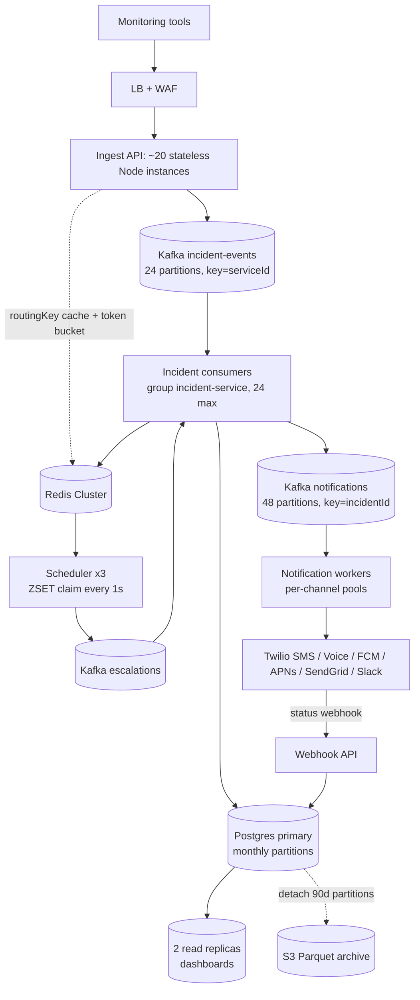

# Notification / Paging System -- HLD + LLD (Part 4: Scaling -> Failures -> Consistency -> Security -> Observability)

> Is file mein prompt ke **Parts 16-20** hain: scaling (1x se 1000x), failure scenarios, consistency, security, aur observability.
> Pichle parts ka recap: Part 1 mein numbers nikale (**50M events/day = ~579 events/sec average, ~6,000 eps storm peak, 95% dedup -> 2.5M incidents/day (~29/sec), 7.5M notifications/day (~87/sec avg, ~1,000/sec peak), SLO: event accept -> first provider handover p95 < 5 s**). Part 2 mein `POST /v2/enqueue` ka 202 flow, Postgres schema, aur `incident.service.ts` / `notification.worker.ts` ka LLD code likha. Part 3 mein dedup ka partial unique index, escalation timers ka Redis ZSET + atomic Lua claim, on-call rotation ki DST-safe math, retry backoff aur per-provider circuit breaker deep dive kiya. Ab dekhenge ye system **traffic badhne par, cheezein tootne par, aur attack hone par** kaise behave karta hai.

**Ek baat pehle se yaad rakho:** Rate Limiter ka rule tha "limiter fail ho toh API chalti rahe" (**fail open**). Paging system ka rule uska ulta hai: **jo page tum deliver nahi kar sakte, usko accept karne ka natak mat karo (fail closed on ingest)**. Aur delivery ke baad wala rule spec se seedha aata hai:

> **"Duplicate page is OK. Missed page is NOT."**

Is part ka har decision isi ek sawaal se nikalta hai: **"agar yahan kuch toota, toh kya koi sota hua insaan bina jaage reh jaayega?"**

> Honest note: PagerDuty / Opsgenie jaise asli products isse bade aur purane hain (multi-region active-active, apne khud ke telephony carriers). Ye woh design hai jo interviewer ek **on-call paging platform** ke liye expect karta hai.

---

## PART 16 -- Scaling: 1x -> 10x -> 100x -> 1000x

### Pehle ek rule

Har level par sirf teen sawaal:

1. **Sabse pehle kya tootega?** (bottleneck)
2. **Usko theek karne ka sabse sasta tareeka kya hai?**
3. **Kya abhi zarurat NAHI hai?**

**Part 1 ka key insight yaad rakho:** ye system **write-heavy** hai. Har event ek write hai (Kafka produce), har incident ek DB write hai, har notification ek DB write + ek third-party network call hai. Read traffic (dashboard) is system ka chhota sa hissa hai.

Iska matlab: URL Shortener wala "cache laga do" trick yahan nahi chalega, aur **Postgres read replicas ingest path ko bachate hi nahi** -- woh sirf dashboard bachate hain. Yahan bottleneck teen jagah aata hai:

```
1. Ingest throughput   -> Kafka partitions + stateless API instances
2. Incident write path -> Postgres write throughput (dedup UPDATE!)
3. Delivery fan-out    -> third-party provider limits (Twilio 1 SMS/sec per long code)
```

Aur ek chhupa hua chautha: **timer/scheduler**, jo ek hi Redis ZSET par ek hi second ke tick mein sab kuch karta hai.

### Levels define karte hain

Spec ka 50M events/day ek bade SaaS ka number hai. Kahani samajhne ke liye ek chhote startup se shuru karte hain:

| Level | Events/day | Avg eps | Storm peak eps | Incidents/day | Notifications/day | Peak notif/sec | SMS+voice cost/day |
|---|---|---|---|---|---|---|---|
| **1x** (startup) | 500K | ~6 | ~60 | 25K | 75K | ~10 | ~$220 |
| **10x** | 5M | ~58 | ~600 | 250K | 750K | ~100 | ~$2.2K |
| **100x** (hamara spec) | **50M** | **579** | **~6,000** | **2.5M** | **7.5M** | **~1,000** | **~$22K** |
| **1000x** | 500M | ~5,787 | ~58,000 | 25M (~290/sec) | 75M | ~10,000 | ~$220K |

> Cost formula spec se: SMS 30% x $0.0075 + voice 5% x $0.013. 100x par SMS ~$17K/day + voice ~$5K/day. **Cost ek design constraint hai, sirf latency nahi** -- isliye push pehle, SMS baad mein, voice last.

---

### 1x -- 500K events/day (~6 eps, storm peak ~60 eps)

```
Monitoring tools
   |
   v
   LB
   |
   v
+--------------------------------------------------+
|  ONE Node.js box (modular monolith)              |
|   - Express ingest route                          |
|   - incident service (in-process, same event loop)|
|   - notification worker (in-process)              |
|   - scheduler (setInterval 1 s)                   |
+--------------------------------------------------+
   |                  |                 |
   v                  v                 v
Postgres (1)      Redis (1)      Twilio / FCM / SendGrid
```

- **Kafka ki zarurat hai?** Honest jawab: **v1 mein nahi.** 6 eps par ek Postgres table (`event_queue`) + `SELECT ... FOR UPDATE SKIP LOCKED` poller bilkul kaafi hai. Lekin **durability ka rule fir bhi lagta hai**: `202` dene se pehle event **disk par committed** hona chahiye. In-memory queue (`setImmediate`, BullMQ without persistence) yahan **galat** hai -- process crash = page gaya.
- **Redis?** Timers ke liye chahiye hi chahiye -- warna `setTimeout` process memory mein hoga aur **deploy/restart har pending escalation ko maar dega**. Ye is system ki sabse aam beginner galti hai.
- Scheduler in-process `setInterval(tick, 1000)` -- ek hi instance hai, isliye double-fire ka koi risk nahi.
- **Kya NAHI chahiye:** Kafka, consumer groups, read replicas, partitioning, sharding, DLQ topic, per-channel worker pools, S3 archive.

**Sabse pehle kya toota:**

| # | Kya toota | Kab | Kya add kiya | Kyun |
|---|---|---|---|---|
| 1 | Deploy par pending escalations gaayab | Har deploy | Timers Redis ZSET + `escalation_timers` table mein | Process memory restart-proof nahi hai |
| 2 | Ek Twilio timeout poore event loop ko atka deta hai | Pehla provider outage | Provider call par `timeout: 5000` + `Promise.allSettled` | Ek slow third party poora ingest nahi rok sakta |
| 3 | 60 eps ka chhota storm par p95 latency 5 s cross | Pehla real outage | Notification bhejna ingest se alag kar do (in-process queue -> phir Kafka) | Ingest ko provider latency se decouple karna |

- **Cost direction:** ~$220/day SMS+voice, infra ~$150/month (1 box + managed PG + managed Redis). **Provider bill infra bill se 40x bada hai** -- ye ratio pehle din se sach hai.

> Interview line: "1x par main poora system ek modular monolith mein rakhta hoon -- Kafka nahi, ek Postgres-backed queue. Lekin do cheezein pehle din se non-negotiable hain: accepted event disk par committed ho, aur escalation timers process memory mein na hon warna har deploy pending pages kha jaayega."

---

### 10x -- 5M events/day (~58 eps, storm peak ~600 eps)

```
Monitoring tools -> LB -> Ingest API x 3 (stateless)
                              |
                              v
                     Kafka `incident-events` (6 partitions, key=serviceId)
                              |
                              v
                     Incident consumers x 3 (group: incident-service)
                              |                 \
                              v                  v
                     Postgres primary       Kafka `notifications` (12 partitions)
                     + 1 read replica              |
                              ^                    v
                     Scheduler x 2  <-- Redis  Notification workers x 4
                     (ZSET sched:escalations)      |
                                                   v
                                          Twilio / FCM / SendGrid
```

| Area | Kya tootega | Change | Kyun |
|---|---|---|---|
| Ingest availability | Ek box gaya = customer ka poora monitoring andha | **3 stateless instances** behind LB, 2 AZ | 99.99% ingest availability chahiye |
| Postgres-backed queue | 600 eps par poller `SKIP LOCKED` contention + table bloat | **Kafka `incident-events`, 6 partitions** | Queue table ab ek hot table ban gayi; Kafka append-only hai |
| Provider latency | Voice call 25 s block karta hai | **Alag notification worker process** (consumer group) | Ingest aur delivery ke life cycles alag hain |
| Scheduler SPOF | Scheduler box gaya = koi escalation nahi | **2 scheduler instances** (atomic Lua claim se safe) | Spec: leader election ki zarurat nahi, claim atomic hai |
| Dashboard queries ingest ko slow karti hain | Bada `GET /incidents` scan | **1 read replica**, dashboards wahan se | Reads ko write path se hatao |

**Stateless horizontal scaling ka asli matlab (ingest API):**

Ingest instance mein **kuch bhi local state nahi**: koi in-memory dedup map nahi, koi local timer nahi, koi session nahi. Sirf do caches hain aur dono **safe-to-lose** hain:

- `svc:<routingKey>` -> serviceId (Redis, TTL 300 s) -- miss hone par Postgres.
- token bucket `rl:events:<routingKey>` -- Redis mein, isliye 3 instances milkar ek hi limit enforce karte hain (Rate Limiter lesson: local bucket hota toh limit 3x ho jaata).

Isi wajah se ingest ko autoscale karna trivial hai: box add karo, LB ko batao, bas.

- **Kya NAHI chahiye:** Postgres partitioning (abhi 250K incidents/day x 2 KB = 0.5 GB/day), sharding, DLQ replay tool (manual ok), per-channel worker pools, S3 archive, SSE/WebSocket.

**Sabse pehle kya toota:**

| # | Kya toota | Kya add kiya | Kyun |
|---|---|---|---|
| 1 | Deploy ke waqt consumer rebalance se duplicate pages | `enable.auto.commit=false`, DB write ke **baad** commit + `notifications.task_id` unique index | At-least-once mein duplicate rokne ka DB-side guard |
| 2 | Ek customer ka storm sabki notifications ko peeche dhakel deta hai | Per-routing-key token bucket + grouping counter `grp:<serviceId>:<minute>` | Noisy neighbour isolation |
| 3 | `GET /api/v1/incidents` timeout (offset pagination) | **Keyset pagination** (`created_at, id`) | URL Shortener Part 4 ka rule: offset kabhi nahi |

- **Cost direction:** provider bill ~$2.2K/day (~$800K/year). Yahan pehli baar **finance team aati hai**: "voice call kyun?" Jawab: voice ka conversion (sote hue insaan ko jagana) SMS se bahut behtar hai; isliye voice ko sirf level-2 escalation par rakho, level-1 par nahi.

> Interview line: "10x par teen cheezein alag hoti hain: ingest stateless ho jaata hai aur 2 AZ mein 3 instances par chalta hai, queue Postgres se Kafka ban jaati hai kyunki poller table hot ho gayi thi, aur notification delivery apni process mein nikal jaati hai taaki ek 25 second ka voice call ingest ki p95 latency na khaaye."

---

### 100x -- 50M events/day (~579 eps, storm peak ~6,000 eps) -- hamara design point

Ye woh design hai jo Parts 1-3 mein bana.



#### 1. Ingest API -- stateless horizontal scaling

- Peak 6,000 eps. Ek Node instance realistically ~300-500 eps sambhalta hai (JSON parse + validate + Redis lookup + Kafka produce with `acks=all`). Toh **~15-20 instances**, headroom ke saath 24.
- Kafka produce ko **batch** karo: `linger.ms=5`, `batch.size=64KB`. 5 ms extra latency, par throughput kai guna. Hamara budget 5,000 ms hai -- 5 ms kuch nahi.
- `acks=all` + `min.insync.replicas=2`: producer tab tak `202` nahi deta jab tak 2 brokers ne likh nahi liya. **Yehi hamari durability guarantee hai.**
- Autoscale **CPU par nahi, `kafka_producer_queue_depth` par** -- CPU spike hone se pehle hi queue bharne lagti hai.

#### 2. Kafka partition count aur consumer group sizing -- yahan log fisalte hain

**Rule (yaad rakho):** ek partition ko ek consumer group mein **sirf ek** consumer padh sakta hai.

```
consumers <= partitions
```

Agar 24 partitions hain aur tum 30 consumer instances chalao, toh **6 instances khaali baithe rahenge** (idle, sirf paisa jala rahe). Partition count = tumhara **maximum parallelism**.

| Topic | Partitions | Key | Sizing ka kaaran |
|---|---|---|---|
| `incident-events` | **24** | `serviceId` | 6,000 eps peak / ~250 eps per partition safe budget = 24. Key `serviceId` se ek service ke events **ordered** rehte hain (trigger ke baad hi resolve process ho) |
| `notifications` | **48** | `incidentId` | Yahan throughput nahi, **concurrency** decide karti hai (neeche) |
| `escalations` | 12 | `incidentId` | Volume chhota (7.5M notif mein se ek hissa) |
| `notifications-dlq` | 6 | `incidentId` | Manual replay, throughput matter nahi karta |

**`notifications` ko 48 partitions kyun jab peak sirf 1,000/sec hai?**

Kyunki notification ka kaam CPU nahi, **wait** hai. Ek SMS send ~300 ms leta hai. Agar har partition ko strictly sequential process karein:

```
1 partition = 1 / 0.3 s = ~3.3 sends/sec
1,000 sends/sec chahiye -> ~300 partitions?!
```

300 partitions mehnga hai. Isliye hum **do cheezein milate hain**: 48 partitions **x** har partition ke andar bounded concurrency 16 = **768 concurrent sends**. Ye 1,000/sec ko aaram se kha jaata hai (768 / 0.3 s = 2,560 sends/sec capacity).

Trade-off: partition ke andar concurrency chalane se **us partition ka strict ordering toot jaata hai**. Kya ye chalega? Haan -- `notifications` ka key `incidentId` hai aur ek incident ke do notifications (push aur SMS) ke beech koi order dependency nahi. Jahan order chahiye tha (trigger vs resolve) woh `incident-events` topic hai, aur wahan hum **sequential** rehte hain.

**Repartitioning ka dard (interview favourite):**

Partition = `hash(key) % numPartitions`. Agar 24 se 48 kar do, toh **kal jo `serviceId` partition 3 par jaata tha, aaj partition 27 par jaayega**. Result:

```
Partition 3 : ...trigger(svc-A)  <-- abhi tak process nahi hua
Partition 27: resolve(svc-A)     <-- naya message, alag consumer, alag speed
```

Do alag consumers, do alag speeds -> **resolve pehle process ho sakta hai, trigger baad mein** -> ek incident create hota hai jo kabhi resolve nahi hoga, aur kisi ko 3 baje raat ko page jaata hai.

Isse bachne ke teen tareeke:

1. **Din 1 par over-provision karo.** Partitions sasti hain (ek partition = kuch MB memory + file handles). 24 ki jagah 48 se shuru karna aur consumers kam rakhna bilkul theek hai. **Partitions badhana aasaan hai, ghatana namumkin.**
2. **Drain-and-switch:** producers rok do, sab partitions ka lag 0 karo, phir partitions badhao, phir producers chaalu. Ingest path par ye **downtime** hai -- hamare liye acceptable nahi.
3. **Naya topic:** `incident-events-v2` banao, producers udhar switch karo, consumers dono topics padhein jab tak purana drain na ho jaaye. Zero downtime, thodi si code complexity. **100x par yahi karo.**

#### 3. Postgres scaling -- sahi order

Order yaad rakho, kyunki interviewer aksar seedha "shard kar dunga" sun kar khush nahi hota:

```
1. Indexes / query fix   (sabse sasta, ghanton ka kaam)
2. Read replicas          (reads hatao, writes nahi)
3. Partitioning           (retention + vacuum + index size)
4. Shard by account_id    (SABSE AAKHIR mein)
```

**Step 1 -- Indexes, aur ek chupa hua bottleneck.**

Sabse bada Postgres load **incident create karna nahi hai**. 579 eps mein se **95% dedup hits** hain -- yaani ~550 UPDATEs per second, aur storm peak par **~5,700 UPDATEs/sec**:

```sql
UPDATE incidents SET occurrence_count = occurrence_count + 1, last_seen_at = now() WHERE ...
```

Yehi is DB ka sabse bhaari writer hai. Do fixes:

- **Duplicate par timeline row mat likho.** Har dedup hit par `incident_events` mein row daaloge toh 47.5M rows/day ban jaayenge sirf "phir se aaya" batane ke liye. Sirf `occurrence_count` badhao; timeline mein pehli aur aakhri occurrence kaafi hai.
- **Counter ko Redis mein jama karo, Postgres mein flush karo.** `dedup:<serviceId>:<dedupKey>` par `INCR`, aur har 10 s ek batch `UPDATE ... FROM (VALUES ...)` se saare counters ek query mein. 5,700 UPDATEs/sec -> ~50 batched statements/sec. Trade-off: `occurrence_count` ab 10 s stale ho sakta hai (dashboard par "63" ki jagah "58" dikh sakta hai) -- ye **poori tarah acceptable** hai, kyunki ye number sirf insaan ke padhne ke liye hai, kisi decision ka input nahi.

Baaki indexes spec mein already hain: `incidents_open_dedup_uniq` (partial, sirf non-resolved rows -- isliye chhota rehta hai) aur `incidents_open_by_service`. **Partial index ka fayda:** 450 GB table mein bhi "open incidents" sirf ~50K rows hain, toh index RAM mein fit ho jaata hai.

**Step 2 -- Read replicas (2, spec ke mutabik).**

Kya jaata hai replica par: incident list, incident detail + timeline, on-call schedule view, reports/analytics.
Kya **kabhi nahi** jaata replica par: dedup ka `INSERT ... ON CONFLICT`, state transitions, timer writes, aur **ack ke turant baad ka read** (PART 18 dekho).

Replicas ingest ko nahi bachate (woh sab writes hain) -- woh sirf **dashboard ko ingest se alag** karte hain. Ye 100x par zaruri hai kyunki outage ke waqt **hi** dono peak par hote hain: alerts bhi aa rahe hain aur 50 engineers dashboard refresh bhi kar rahe hain.

**Step 3 -- Partitioning (monthly range on `created_at`).**

- 2.5M incidents/day x 2 KB = **5 GB/day**, 90-day hot = **~450 GB**.
- Monthly partitions ka asli fayda **DELETE se bachna** hai. 90 din purane 150 GB ko `DELETE FROM incidents WHERE created_at < ...` se hatana = ghanton ka lock + autovacuum ka pahaad + WAL ka blast. Partition ke saath ye **ek metadata operation** hai:

```sql
ALTER TABLE incidents DETACH PARTITION incidents_2025_06 CONCURRENTLY;
-- phir S3 mein Parquet export, phir DROP TABLE incidents_2025_06;
```

- Doosra fayda: har partition ke apne chhote indexes, aur autovacuum ka kaam per-partition baant jaata hai.
- Dhyan do: **partitioned table par unique index mein partition key hona chahiye**. `incidents_open_dedup_uniq (service_id, dedup_key)` mein `created_at` nahi hai -- yaani Postgres ise global unique nahi bana sakta. Do options: (a) unique constraint ko **sirf "current" partition** par rakho aur pichhli partitions ko read-only maano (open incidents 90 din purane hote hi nahi, p95 ack 10 min hai), ya (b) dedup ko ek chhoti alag `open_incidents(service_id, dedup_key, incident_id)` table mein rakho jo partitioned nahi hai aur jismein sirf ~50K rows hain. **Option (b) saaf hai** aur interview mein bolne layak hai -- ye woh detail hai jo dikhata hai ki tumne partitioning sach mein ki hai, sirf padhi nahi.

**Step 4 -- Shard by `account_id` (aur ye SABSE AAKHIR mein kyun).**

Shard key **`account_id` hi** hoga kyunki ek query kabhi do accounts ko touch nahi karti: service -> policy -> schedule -> user, sab ek hi account ke andar. Ye ek **perfect** shard key hai.

Fir bhi ye aakhir mein aata hai, kyunki:

| Cost | Detail |
|---|---|
| **Global uniqueness toot jaati hai** | `services.routing_key` UNIQUE poore system mein hai. Sharded par ek alag lookup service / consistent hashing chahiye routing key -> shard resolve karne ke liye |
| **Operations x N** | N primaries, N replica sets, N backup schedules, N schema migrations. Ek migration ab ek script nahi, ek project hai |
| **Cross-shard reporting mar jaati hai** | "Poore platform mein aaj kitne incidents?" ab ek query nahi, N queries + merge |
| **Hot shard** | Ek enterprise account 30% traffic bhej sakta hai. Shard rebalancing (`account_id` move karna) offline copy + cutover hai |
| **Zarurat hi nahi hai** | 450 GB hot data aur ~6K writes/sec ek achhe `db.r6g.4xlarge` par aaram se chalta hai. Sharding ki asli zarurat ~5-10 TB ya ~50K writes/sec par aati hai |

> Interview line: "Main Postgres ko is order mein scale karunga: pehle dedup UPDATE path ko batch karke likhunga kyunki 95% dedup ratio ki wajah se wahi sabse bada writer hai, phir dashboards read replicas par, phir monthly partitions taaki 90-day retention ek DETACH ho na ki ek ghante ka DELETE. Shard by `account_id` sabse aakhir mein -- shard key perfect hai lekin global unique routing key aur N-guna operations ki keemat hai, aur 450 GB par zarurat hi nahi."

#### 4. Timer / scheduler -- system ka chhupa hua bottleneck

Spec kehta hai: 50K active timers x ~100 B = **5 MB**. Memory bilkul problem nahi hai. Problem teen aur hain:

```
Problem 1: EK key par saara load
   sched:escalations ek single Redis key hai -> ek single hash slot -> EK Redis primary.
   Cluster mein 6 primaries hon, timer load fir bhi 1 par hi hai.

Problem 2: EK scheduler tick ka budget
   Har tick par claim -> kai hazaar timer ids -> har ek ke liye Kafka produce.
   3 instances hain par sab ek hi ZSET se claim karte hain (atomic, safe) --
   fir bhi woh Redis round trips ek hi key par serialize hote hain.

Problem 3: Lua ka `unpack(due)` bada batch nahi le sakta
   Lua ka C stack ~8000 entries par phat jaata hai ("too many results to unpack").
   Isliye batch size 500 se upar mat le jao.
```

Storm mein 50,000 timers ek hi second mein due ho sakte hain (ek DC gaya -> sab alerts ek saath aaye -> 5 min baad sab ek saath escalate honge). Batch 500 par woh **100 ticks = 100 seconds** ka lag hai. Hamara alert threshold `timer_lag_seconds > 10` hai -- yaani hum SLO se 10x bahar.

**Fix: ZSET ko shard karo.**

```
sched:escalations            ->   sched:escalations:0
                                  sched:escalations:1
                                  ...
                                  sched:escalations:15

shardIndex = hash32(escalationTimerId) % 16
```

```ts
// src/workers/scheduler.ts
const SHARDS = 16;
const BATCH = 500;

export function shardKeyFor(timerId: string): string {
  return `sched:escalations:${hash32(timerId) % SHARDS}`;   // 0..15
}

export class Scheduler {
  private cursor = Math.floor(Math.random() * SHARDS);      // har instance alag jagah se shuru

  async tick(now = Date.now()): Promise<void> {
    const started = Date.now();
    for (let n = 0; n < SHARDS; n++) {
      const shard = (this.cursor + n) % SHARDS;
      const due: string[] = await this.redis.evalsha(
        this.claimSha, 1, `sched:escalations:${shard}`, String(now), String(BATCH),
      );
      if (due.length === 0) continue;
      await this.fire(due);                                  // Kafka produce + DB state update
      if (Date.now() - started > 800) { this.cursor = (shard + 1) % SHARDS; return; }
    }
    this.cursor = (this.cursor + 1) % SHARDS;
  }
}
```

**Code Explanation:**

- `SHARDS = 16` -- 16 alag ZSET keys. Redis Cluster mein 16 alag hash slots -> load kai primaries par bikhar jaata hai, ek primary ka CPU pin nahi hota.
- `BATCH = 500` -- Lua ke `unpack()` ki limit ke neeche. 16 shards x 500 = **8,000 timers per tick**, aur tick har 1 s. 50K ka storm ab ~7 ticks mein khatam, 100 ticks mein nahi.
- `hash32(timerId) % SHARDS` -- timer ko shard **uske apne id se** map karo, `incidentId` ya `serviceId` se nahi. Kyun? Ek storm mein ek hi service ke hazaaron timers ek saath due hote hain; `serviceId` se hash karte toh woh sab **ek hi shard** par gir jaate aur sharding ka fayda hi khatam ho jaata.
- `this.cursor = Math.floor(Math.random() * SHARDS)` -- **fairness**. Agar har instance hamesha shard 0 se shuru kare, toh shard 15 sirf tab chalega jab pehle 15 khaali hon. Random start + round-robin cursor se har shard ko turn milta hai.
- `evalsha(this.claimSha, 1, key, now, BATCH)` -- Part 3 wala **atomic Lua claim** (`ZRANGEBYSCORE` + `ZREM` ek hi step mein). 3 scheduler instances chalein toh bhi ek timer sirf ek instance ko milega -- isliye leader election ki zarurat nahi (spec ka decision).
- `if (Date.now() - started > 800) ... return` -- **tick ko 1 second ke andar khatam karo.** Agar 800 ms ho gaye toh baaki shards agle tick par. Warna ticks overlap karenge aur event loop peeche girta jaayega (classic `setInterval` death spiral).
- `this.cursor = (shard + 1) % SHARDS` return se pehle -- agla tick wahin se shuru ho jahan chhoda tha, taaki koi shard bhooka na rahe.

**Sharding ke baad bhi ek cheez sach rehti hai:** ye ZSET ek **cache** hai, source of truth nahi. `escalation_timers` table durable copy hai aur recovery job (har 60 s, `ZADD NX`) usse rebuild karta hai. PART 17 mein isi ka failure case hai.

> Chetavani (Redis Cluster): key mein literal curly braces mat likhna. `sched:escalations:{3}` Redis Cluster mein **hash tag** hai -- iska matlab hai "sirf `3` ko hash karo". Agar tumne saare shards `{...}` ke saath likhe toh woh sab alag-alag slots par toh jaayenge par tumhara intent galat likha jaayega; aur agar tag same hua (`{escalations}:3`) toh saare shards **ek hi slot** par chale jaayenge aur sharding ka poora fayda khatam. Isliye plain `sched:escalations:3`.

#### 5. Provider throughput -- yahan tumhara code nahi, duniya limit karti hai

Peak 1,000 notifications/sec, jisme SMS 30% = **~300 SMS/sec**.

| Sender type | Throughput | 300 SMS/sec ke liye chahiye |
|---|---|---|
| Long code (normal 10-digit number) | **~1 SMS/sec** | 300 numbers (!) |
| Toll-free | ~3 SMS/sec | ~100 numbers |
| 10DLC (registered brand) | ~10-100 SMS/sec (campaign tier) | ~5-30 numbers |
| Short code (5-6 digit) | **~100 SMS/sec** | 3 short codes |

Teen practical baatein:

1. **Sender pool.** Ek Twilio Messaging Service mein 10-50 numbers daal do; Twilio khud rotate karta hai aur apni queue rakhta hai. Tumhara worker ek **pool** ko bhejta hai, ek number ko nahi.
2. **Sticky sender per user -- ye zaruri hai.** Agar Priya ko har baar alag number se SMS aaye toh (a) uske phone mein alag-alag threads ban jaayenge, (b) woh "4" reply karegi toh tumhe pata hona chahiye kis incident ka ack hai, aur (c) uska carrier ise spam maan ke block kar sakta hai. Isliye `hash(userId) % poolSize` se number fix karo (Messaging Service ka sticky sender yahi karta hai), aur inbound webhook mein `(From, To)` jodi se user resolve karo.
3. **Per-provider concurrency cap -- Rate Limiter lesson wapas aaya.** Provider ki limit tumhare **saare** workers milkar todte hain, isliye cap **shared Redis token bucket** par hona chahiye, har worker ki local memory mein nahi:

```ts
// src/providers/provider-registry.ts
const caps: Record<string, { key: string; ratePerSec: number; burst: number }> = {
  'twilio-sms':   { key: 'rl:prov:twilio-sms',   ratePerSec: 300,  burst: 600   },
  'twilio-voice': { key: 'rl:prov:twilio-voice', ratePerSec: 60,   burst: 60    },
  'fcm':          { key: 'rl:prov:fcm',          ratePerSec: 5000, burst: 10000 },
  'sendgrid':     { key: 'rl:prov:sendgrid',     ratePerSec: 500,  burst: 1000  },
};

async function sendWithCap(
  p: NotificationProvider, task: NotificationTask, addr: string, inc: Incident,
): Promise<ProviderResult> {
  const cap = caps[p.name];
  const ok = await tokenBucket.consume(cap.key, cap.ratePerSec, cap.burst, 1);
  if (!ok.allowed) {
    throw new RetryableError('provider_cap', ok.retryAfterMs);   // backoff + jitter; offset commit NAHI
  }
  return p.send(task, addr, inc);
}
```

**Code Explanation:**

- `caps` -- har provider ka apna budget. `twilio-voice` sirf 60/sec kyunki voice volume 5% hai aur har call 20-30 s chalti hai (concurrent calls ka apna alag limit hota hai, per-second se alag cheez).
- `tokenBucket.consume(...)` -- **wahi Lua token bucket** jo Rate Limiter lesson mein likha tha, bas identity ab "customer" nahi "provider" hai. Ek hi code do bilkul alag problems solve kar raha hai -- yehi acchhe abstraction ki nishani hai.
- `throw new RetryableError(...)` -- cap lagne par message ko **fail mat maano**. Kafka offset commit **nahi** hota, message backoff ke saath dobara process hoga. Yaani cap ka matlab "thoda ruk jao" hai, "chhod do" nahi.
- **Redis mein kyun, local memory mein kyun nahi?** 24 notification workers hain. Har ek apna local 300/sec rakhe toh total 7,200/sec Twilio ko jaayega -> Twilio 429 -> circuit breaker open -> **pages ruk gaye**. Shared bucket hi sahi jawab hai.

#### 6. Per-channel worker pools -- ek shared pool kyun galat hai

Ek hi pool mein sab channels daalne par kya hota hai:

```
Shared pool (concurrency 100):
  slot 1..97   -> voice calls, har ek 25 SECONDS ring kar raha hai
  slot 98..100 -> push notifications, jo 80 MILLISECONDS mein ho jaate

  Result: 97 slots 25 s ke liye block. Push queue ka lag 30 s.
  Push = sabse SASTA, sabse TEZ, aur LEVEL-1 ka PEHLA page hai.
  Yaani sabse important cheez sabse slow cheez ke peeche fas gayi.
```

Isko **head-of-line blocking** kehte hain: line mein ek slow banda poori line rok deta hai.

| Channel | Typical latency | Cost per message | Pool size (100x) | Kyun |
|---|---|---|---|---|
| `push` | 50-100 ms | ~$0 | 400 | Tez, sasta, level-1 ka pehla page. Sabse bada pool |
| `sms` | 200-500 ms | $0.0075 | 300 | Provider cap 300/sec se match |
| `email` | 200-800 ms | ~$0.0001 | 200 | Low urgency + digest |
| `voice` | 20-30 s | $0.013/min | 100 | Slow aur mehnga, apne kone mein |
| `slack` | 100-300 ms | $0 | 100 | Webhook; customer ka apna rate limit alag |

Alag pools ke teen aur fayde:

- **Blast radius alag.** Twilio down -> SMS pool bhar jaayega, par push aur email chalte rahenge. Shared pool mein Twilio ka outage **sab** channels rok deta.
- **Circuit breaker ka matlab banta hai.** `cb:<provider>` per provider hai; per-channel pool ke bina ek open breaker doosre channels ke slots bhi kha raha hota.
- **Alag scaling.** Email digest ka spike SMS pool ko touch nahi karta.

100x par hum spec ke mutabik **ek hi `notifications` topic (48 partitions)** rakhte hain aur pools **worker process ke andar** banate hain (`p-limit` jaisa bounded concurrency, per channel ek limiter). 1000x par topic hi split hota hai (neeche).

#### 7. S3 archiving

| Data | Hot store | Retention | Archive |
|---|---|---|---|
| Raw events | Kafka `incident-events` | **7 days** (350 GB, RF3 -> ~1 TB disk) | S3 sink connector -> `s3://.../events/dt=YYYY-MM-DD/` (Parquet, gzip) |
| `incidents` | Postgres monthly partitions | **90 days** (~450 GB) | `DETACH PARTITION` -> Parquet -> `DROP` |
| `incident_events` (timeline) | Postgres | 90 days (incident ke saath) | Incident ke saath S3 par (audit ke liye lamba rakho) |
| `notifications` + `notification_attempts` | Postgres | **30 days** (~120 GB) | Aggregates rakho, raw rows drop |

- **Raw events kyun rakhne hain:** **replay.** Bug fix ke baad "pichle 3 din ke events dobara process karo" tabhi possible hai jab events kahin pade hon. Yehi Kafka choose karne ka ek bada kaaran tha (RabbitMQ mein message consume hote hi gaya).
- **Replay ka khatra:** 3 din ke events dobara chala doge toh **3 din ke purane pages dobara** chale jaayenge. Isliye replay hamesha ek flag ke saath: `replay: true` -> incidents banao/update karo, **notifications suppress karo**. Ye switch pehle se code mein hona chahiye; outage ke beech mein likhne ka waqt nahi milta.
- Cost: S3 Standard-IA par 1 TB/month ~$12. Postgres par wahi 1 TB ~$120/month + backup. **~10x sasta** -- isliye archive sirf "neat" nahi, budget decision hai.

**100x par sabse pehle kya toota:**

| # | Kya toota | Symptom | Kya add kiya | Kyun |
|---|---|---|---|---|
| 1 | Dedup `UPDATE` se Postgres ka WAL + autovacuum | Write latency p99 20 ms -> 300 ms | Redis counter + 10 s batched flush | 95% traffic dedup hit hai, wahi sabse bada writer tha |
| 2 | Single ZSET par timer lag | `timer_lag_seconds` storm mein 90 s | 16 ZSET shards + 800 ms tick budget | Ek key = ek slot = ek primary |
| 3 | Twilio 429 storm | SMS failure rate 40%, breaker open | Shared Redis per-provider cap + sender pool | Provider limit ko saare workers milkar todte the |
| 4 | Voice calls ne push ko block kiya | Push p95 80 ms -> 30 s | Per-channel bounded pools | Head-of-line blocking |
| 5 | 90-day `DELETE` ne DB 2 ghante lock kiya | Nightly job ne ingest slow kar diya | Monthly partitions + `DETACH` | DELETE = row-by-row + vacuum; DETACH = metadata |

- **Cost direction (100x):** provider ~$22K/day = **~$8M/year**. Infra (Kafka 6 brokers + PG r6g.4xlarge + 2 replicas + Redis Cluster + ~50 Node instances) ~$25-35K/**month**. Yaani provider bill infra bill ka **~20 guna**. Har architecture decision ab ek cost decision bhi hai: "push pehle try karo" sirf latency ke liye nahi, $17K/day bachane ke liye hai.

---

### 1000x -- 500M events/day (~5,787 eps avg, ~58,000 eps storm peak)

Numbers: **25M incidents/day = ~290 incidents/sec average** (~1.04M incidents/hour, storm peak ~3,000/sec), **75M notifications/day = ~870/sec avg, ~10,000/sec peak**, provider bill **~$220K/day**.

```
                 Region: us-east                        Region: eu-west
   LB + WAF                                      LB + WAF
      |                                              |
   Ingest API x ~150                              Ingest API x ~60
      |                                              |
   Kafka incident-events (240 partitions)         Kafka (apna alag cluster)
      |                                              |
   Incident consumers x 240                       Incident consumers x 60
      |                                              |
   Postgres SHARDED by account_id                 Postgres shards (EU accounts)
   (8 shards x [primary + 2 replicas])
      |
   Kafka notifications.push  (240 part.)  -> push workers
        notifications.sms    (240 part.)  -> sms workers -> sender pool (30 short codes,
        notifications.voice  ( 60 part.)  -> voice workers   3 providers)
        notifications.email  ( 60 part.)  -> email workers
      |
   Scheduler x 12, ZSET 256 shards across Redis Cluster
```

| Bottleneck | Kyun | Kya karunga |
|---|---|---|
| **Kafka partitions** | 58K eps / 250 eps per partition = **~232** | `incident-events` 240 partitions -> consumer group max 240 instances. Migration naye topic (`-v2`) + dual consume se, live repartition se nahi |
| **Consumers > partitions** | 300 instances chalao toh 60 **idle** | Partition count hamesha max desired instances se upar rakho. Ye capacity planning ka input hai, afterthought nahi |
| **Postgres writes** | ~3,000 incidents/sec peak x ~8 row writes = **~24K writes/sec** | **Ab sharding sach mein chahiye**: 8 shards by `account_id`. `routing_key -> shard` ek chhoti global lookup table + Redis cache se |
| **Timers** | Storm mein ~500K active timers | ZSET shards 16 -> **256**; 12 scheduler instances, har ek ~20 shards ka owner (consistent hashing se assign, taaki do instance ek shard par na ladein) |
| **Provider throughput** | 3,000 SMS/sec peak | **Multi-provider**: Twilio + MessageBird + Sinch, weighted split + automatic failover. Ek provider ki limit ab tumhari limit nahi |
| **Provider cost** | $220K/day = **~$80M/year** | Push-first aggressively (level-1 sirf push + Slack), SMS level-2 par, voice sirf level-3 + `critical`. Grouping default ON |
| **Cross-region latency** | EU customer ka event US Kafka tak 90 ms+ | **Region-local ingest + processing**; har account ka ek "home region", cross-region sirf async replication (metadata) |
| **Blast radius** | Ek bug sabko down kar deta hai | **Cell-based architecture**: har cell = apna Kafka + PG shard + workers + Redis, ~2,000 accounts per cell; deploy ek cell se shuru |

**1000x ka sabse bada mental shift:** ab tum ek single system nahi, **kai chhote identical systems (cells)** chala rahe ho. Kyun? Kyunki ek paging platform ke liye sabse bada business risk hai **"saare customers ek saath andhere mein"**. 8 cells mein ek cell down = 12.5% customers affected, 100% nahi.

**1000x par sabse pehle kya toota:**

| # | Kya toota | Kya add kiya | Kyun |
|---|---|---|---|
| 1 | Ek Postgres primary 24K writes/sec par pin | Shard by `account_id` (8 shards) | Vertical scaling ki chhat aa gayi |
| 2 | Partition count consumer scaling ko cap kar raha tha | Naya topic 240 partitions, dual-consume migration | Live repartition ordering todta hai |
| 3 | Ek provider ki global limit | Multi-provider routing + failover | Twilio bhi ek single point of failure hai |
| 4 | Ek bad deploy = poora platform | Cells + per-cell staged rollout | Blast radius kam karna hi availability hai |
| 5 | $80M/year provider bill | Channel policy sakht: push-first, grouping default ON | Cost ab #1 constraint hai |

> Interview line: "1000x par teen cheezein badalti hain. Ek, Kafka partition count hi mera max consumer count hai -- 240 partitions, aur badhane ke liye naya topic banaunga kyunki live repartition ordering todta hai aur `resolve` `trigger` se pehle process ho sakta hai. Do, Postgres ab sach mein `account_id` par shard hoga kyunki ~24K writes/sec ek primary ki chhat hai. Teen, aur ye sabse important -- main cells banaunga, har cell 2,000 accounts ka poora independent stack, kyunki ek paging platform ke liye 'saare customers ek saath andhere mein' sabse bada risk hai."

---

### Har scaling tool -- kab lagana hai, kab nahi

| Tool | Hamare system mein kab | Kab NAHI |
|---|---|---|
| **Stateless API + LB** | 10x se (2+ instances) | Kabhi nuksaan nahi -- din 1 se stateless likho |
| **Kafka** | 10x se (600 eps par PG poller hot ho gaya) | 1x par -- Postgres `SKIP LOCKED` queue kaafi hai |
| **Zyada partitions** | Capacity planning ke waqt, pehle se | Live topic par jaldbazi mein -- ordering tootegi |
| **Read replicas** | 10x se (dashboard alag karo) | Ingest/write path bachane ke liye -- woh bachate hi nahi |
| **Table partitioning** | 100x (450 GB, 90-day retention) | Chhoti tables par -- sirf planner overhead milega |
| **Sharding (`account_id`)** | 1000x (~24K writes/sec, multi-TB) | 100x tak bilkul nahi -- N-guna operations ki keemat |
| **ZSET sharding (timers)** | 100x (`timer_lag_seconds > 10`) | 10x par ek ZSET theek hai |
| **Per-channel worker pools** | 100x (voice ne push ko block kiya) | 1x-10x par ek pool chalega |
| **Multi-provider failover** | 100x se (ek provider = SPOF) | 1x par -- ek provider + achha backoff |
| **S3 archive** | 100x (retention cost) | Jab tak DB ~200 GB se chhoti hai |
| **Cells / multi-region** | 1000x | Pehle nahi -- ye sabse mehenga operational decision hai |
| **CDN** | **Kabhi nahi** | Sab write path hai, cacheable kuch nahi (spec) |
| **Elasticsearch** | v3 mein "search incidents by text" ke liye | v1/v2 -- Postgres se incident list theek hai (spec) |

---
