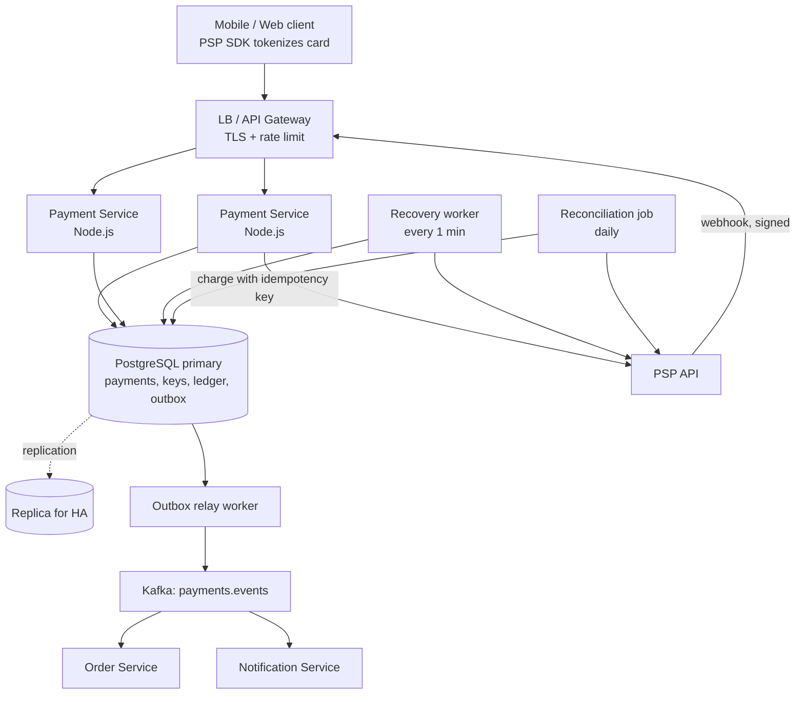

# Payment System -- HLD + LLD (Part 1: Basics -> Requirements -> Estimation -> HLD)

> Is file mein prompt ke **Parts 1-6** hain: problem basics, requirements, clarifying questions, capacity estimation, HLD, aur har component ka WHY.
> Next file: request flow (happy path, timeout, webhook), API design with `Idempotency-Key`, database schema, LLD, Node.js code line-by-line.
>
> **Pichhle systems se connection:** URL Shortener mein humne seekha ki **unique constraint** duplicate ko DB level par rokta hai. Rate Limiter mein humne seekha **atomic operations** aur **fail open** -- "limiter gira toh bhi API chalni chahiye". Payment system mein ye soch **ulti** ho jaati hai: yahan **fail closed** -- "shak ho toh ruk jao, lekin double charge kabhi nahi".
>
> **Honest note:** Stripe, Razorpay, Adyen jaise asli payment companies ke systems isse bahut bade hain (card networks, banks, settlement, fraud engines). Hum jo design karenge woh **merchant-side Payment Service** hai -- ShopKart jaisi company ka apna service jo PSP ke upar baitha hai. Interviewer "design a payment system / idempotent API" mein yahi expect karta hai.

---

## PART 1 -- Problem ko bilkul basic se samjho

### Ek kahani se shuru karte hain

ShopKart (wahi e-commerce company jiska rate limiter humne banaya tha) ki Diwali sale chal rahi hai. Priya metro mein hai, network 2G jaisa slow. Woh cart mein Rs 499 ka earphone daal ke **"Pay Rs 499"** tap karti hai.

```
20:00:00.000  App: POST /pay  { orderId: ord_123, card token }
20:00:00.300  Hamara server -> PSP: "Rs 499 charge karo"
20:00:02.100  PSP: "Done, charged"            -> paisa Priya ke account se kat gaya
20:00:02.150  Hamara server -> App: 200 OK   -> lekin response metro tunnel mein kho gaya
20:00:10.000  App: timeout! "Something went wrong"
20:00:10.500  App auto-retry (ya Priya ne dobara "Pay" dabaya)
20:00:10.800  Hamara server -> PSP: "Rs 499 charge karo"   (server ko lagta hai ye nayi request hai)
20:00:12.600  PSP: "Done, charged"            -> DOOSRI baar paisa kata
```

Priya ke account se **Rs 998** kat gaye, earphone ek hi aayega. Agle din Twitter par screenshot, support ticket, refund, aur ShopKart par se bharosa khatam.

Doosri kahani, usse bhi dangerous: hamara server PSP ko charge karwata hai, PSP "success" bolta hai, aur **DB mein save karne se pehle hi server crash** ho jaata hai (deploy, OOM, kuch bhi). Ab:

- Customer ka paisa kat chuka hai.
- Hamare DB mein koi record nahi -- order "unpaid" dikh raha hai.
- Na order ship hoga, na refund hoga. Paisa "lost" ho gaya.

Dono kahaniyon ki jadd ek hi hai:

> **Network timeout ka matlab "fail" nahi hai. Timeout ka matlab hai "result UNKNOWN".** Request shayad pahunchi ho, shayad kaam ho bhi gaya ho -- bas jawab wapas nahi aaya.

Client ko pata nahi ki pehli request ka kya hua. Isliye woh retry karega -- aur retry karna **sahi** bhi hai. Problem retry mein nahi hai. Problem ye hai ki **server retry ko pehchan nahi pa raha**.

Yahi kaam **Payment System + Idempotent API** ka hai.

### Pehle kuch terms (ek-ek line mein, depth aage ke parts mein)

| Term | Simple matlab |
|---|---|
| **PSP (Payment Service Provider)** | Razorpay / Stripe jaisi company jo actually bank aur card network se baat karke paisa move karti hai. ShopKart khud paisa move nahi karta -- PSP ko bolta hai. |
| **Tokenization** | Card number hamare server par aata hi nahi. PSP ka SDK phone par hi card ko ek token (`pm_abc`) mein badal deta hai. Hum sirf token dekhte hain. |
| **PCI DSS** | Card data handle karne ke security rules. Card number hamare paas nahi aaya toh hamara PCI scope bahut chhota -- audit aasan, risk kam. |
| **Idempotency** | Same request accidentally 2 baar aaye, toh **business operation 2 baar nahi hona chahiye**. Doosri baar pehla wala result hi wapas do. |
| **Idempotency-Key** | Client har logical operation ("order ord_123 ka payment") ke liye ek UUID banata hai aur har retry par **wahi** bhejta hai. Isi se server retry pehchanta hai. |
| **Webhook** | PSP ka hamare server ko "callback": "payment pay_01J8 succeed ho gaya". Kuch payments (UPI, 3-D Secure) ka final result baad mein isi se aata hai. |
| **Ledger** | Paisa ka hisaab-kitaab book. Har money movement ki **double-entry** (ek DEBIT, ek CREDIT) -- kabhi edit nahi, sirf append. |
| **Reconciliation** | Roz raat PSP ki settlement report ko apne ledger se milana: "PSP bolta hai 5M payments, hum bolte hain 5M -- match?" |

### Ye system actually karta kya hai?

**Payment Service ka simple matlab:** customer ke order ke liye PSP se paisa charge karwana, aur ye guarantee dena ki **paisa exactly ek baar move ho** -- na do baar, na zero baar (jab customer ka kat chuka ho) -- aur har rupaye ka hisaab ledger mein ho.

| Payment Service kya karta hai | Kya NAHI karta |
|---|---|
| Order ke amount ke hisaab se PSP ko charge request bhejta hai | Card number store nahi karta (PSP tokenize karta hai) |
| Har request ko `Idempotency-Key` se dedupe karta hai | Khud bank / card network se baat nahi karta |
| Payment ka state track karta hai (`PROCESSING`, `SUCCEEDED`, ...) | Order ship nahi karta (Order Service ka kaam) |
| PSP ke webhooks receive, verify, dedupe karta hai | Email/SMS nahi bhejta (Notification Service ka kaam) |
| Double-entry ledger likhta hai, daily reconciliation karta hai | Fraud scoring engine nahi hai (alag system / PSP ka feature) |
| Order + Notification services ko events bhejta hai | Amount client se nahi leta -- order se padhta hai |

### Real life mein iska example kya hai?

- **Stripe API** -- har `POST` request par optional `Idempotency-Key` header. Same key dobara aaye toh Stripe pehla response replay karta hai. Hamara design isi pattern par hai.
- **Razorpay / PayU checkout** -- Flipkart, Swiggy, Zomato jaise apps inka SDK use karte hain; card/UPI data seedha PSP ke paas jaata hai.
- **UPI collect request** -- tum "Pay" dabate ho, phone par PhonePe/GPay ka popup aata hai, 30 sec baad approve karte ho. Beech mein payment **pending** hai -- final result webhook se aata hai.
- **3-D Secure OTP** -- card payment mein bank ka OTP page. Payment tab tak `REQUIRES_ACTION` state mein hai.
- **"Payment pending, don't press back"** -- IRCTC / bank pages ka ye message isi problem ka UI version hai: result unknown hai, retry mat karo warna double ho sakta hai. Achha idempotent API is message ki zarurat hi khatam kar deta hai.

### User kya request karega? System internally kya karega? Response kya milega?

**Flow 1 -- Happy path (card, turant success)**

```
Client:   POST /v1/payments
          Authorization: Bearer <jwt>
          Idempotency-Key: 5f1c2a9e-7b3d-4e21-9a0c-2d8e6f4b1a77
          { "orderId": "ord_123", "paymentMethodToken": "pm_abc" }

System:   1. Key claim karo            -> idempotency_keys mein naya row (IN_PROGRESS)
          2. Order load karo           -> amount 49900 paise (Rs 499), client se NAHI
          3. payments row banao        -> pay_01J8..., status CREATED -> PROCESSING
          4. PSP ko charge bhejo       -> PSP idempotency key = pay_01J8... (hamari payment id)
          5. PSP bola "succeeded"      -> ek hi DB transaction mein:
                                          payment SUCCEEDED + ledger entries + outbox event
                                          + key COMPLETED with stored response

Response: 201 Created
          { "id": "pay_01J8...", "status": "SUCCEEDED",
            "amount": { "valueMinor": 49900, "currency": "INR" } }
```

**Flow 2 -- Same request dobara aayi (Priya ka retry)**

```
Client:   POST /v1/payments   (SAME Idempotency-Key, same body)
System:   1. Key claim -> already exists, status COMPLETED, same request hash
          2. PSP ko call hi nahi karo. Stored response nikalo.
Response: 201 Created
          Idempotent-Replayed: true
          { "id": "pay_01J8...", "status": "SUCCEEDED", ... }     -> bilkul pehle jaisa
```

**Flow 3 -- PSP timeout (result unknown)**

```
System:   PSP ne 10 sec mein jawab nahi diya
          -> payment PROCESSING hi rehta hai (FAILED mark NAHI karte!)
          -> key IN_PROGRESS rehti hai, recovery_point = PSP_CALLED
Response: 202 Accepted
          { "id": "pay_01J8...", "status": "PROCESSING" }
Baad mein: webhook aayega, ya client ka retry / recovery worker PSP se poochega
           "is idempotency key wale payment ka kya hua?" -> final status set
```

> **202 ka simple matlab:** "Request mil gayi, kaam chal raha hai, abhi final result nahi pata. `GET /v1/payments/:id` se status dekhte raho."
>
> **Decline bhi 201 kyun?** Card declined ek valid **business outcome** hai -- payment create hua, result `FAILED` aaya. Isliye `201` with `status: "FAILED"`, `failureCode: "card_declined"`. Error codes (4xx/5xx) sirf tab jab request hi process nahi hui.

### Ek simple real-world example

Wapas Priya par. Ab naya design laga hai:

- Priya ki app ne pehli request se pehle `Idempotency-Key: 5f1c...` banaya.
- Server ne charge kiya, response tunnel mein kho gaya.
- App ne retry kiya -- **same key** ke saath.
- Server: "Ye key main pehle dekh chuka hoon, result SUCCEEDED tha" -- PSP ko dobara call nahi, stored response replay.
- Priya ko ek hi charge, screen par "Payment successful". Support ticket zero.

Aur server crash wali kahani? Payment row pehle hi DB mein `PROCESSING` state mein save tha. **Recovery worker** har minute stuck payments dhoondhta hai, PSP se poochta hai, aur `SUCCEEDED` mark kar deta hai. Paisa "lost" nahi hua.

> Payment system ek **bank ki passbook + receipt counter** jaisa hai: har transaction ka ek receipt number (idempotency key). Same receipt number dobara aaye toh cashier dobara paisa nahi kaatta -- purani receipt ki copy de deta hai.

### Interview mein 30 seconds mein kya bolun?

> "Payment service ka main kaam hai paisa exactly ek baar move karna, jabki network timeout, client retry, double-click aur server crash sab normal hain. Main card data khud handle nahi karunga -- PSP ka SDK card ko tokenize karega. Client har payment ke liye ek Idempotency-Key bhejega; main use Postgres mein payment ke saath hi store karunga, taaki retry aaye toh stored response replay ho, dobara charge nahi. PSP ko bhi apni payment id idempotency key ki tarah bhejunga. Timeout par payment ko FAILED nahi, PROCESSING rakhunga aur webhook ya recovery worker se final status laaunga. Har success par double-entry ledger likhunga, events outbox pattern se Kafka par bhejunga, aur roz PSP report se reconciliation karunga. Yahan correctness availability se upar hai -- shak ho toh fail closed."

---

## PART 2 -- Requirements

### Functional Requirements (system kya karega)

**Must-have (core):**

1. **Payment create karna** -- `POST /v1/payments`, header `Idempotency-Key` **required** (missing -> `400 IDEMPOTENCY_KEY_REQUIRED`). Body mein sirf `orderId` + `paymentMethodToken`; amount server order se padhta hai.
2. **PSP se charge** (card / UPI), aur **async outcomes** support: 3-D Secure / UPI collect mein status `REQUIRES_ACTION`, final result webhook se.
3. **Status dekhna** -- `GET /v1/payments/:id` (sirf owner).
4. **Refund** -- full ya partial, woh bhi idempotent: `POST /v1/payments/:id/refunds`.
5. **Double-entry ledger** -- har money movement (payment, refund, PSP fee) ki entry.
6. **Webhooks receive** -- `POST /webhooks/psp`: signature verify, dedupe, payment state machine par apply.
7. **Events publish** -- `payment.succeeded`, `payment.failed`, `refund.succeeded` -> Order Service (order confirm/ship) aur Notification Service (SMS/email).
8. **Daily reconciliation** -- PSP ki settlement report vs hamara ledger.

> **Amount client se kyun nahi?** Agar body mein `amount` aata toh koi bhi app modify karke Rs 499 ke order ka Rs 1 bhej deta. Amount hamesha **server-side order se** aata hai. Client sirf batata hai "kaunsa order, kaunsa payment method".

**Nice-to-have (interviewer se confirm karo):**

9. **Multiple PSPs / routing** -- Razorpay down ho toh Stripe par bhejo. Complex hai (dono ke saath idempotency, reconciliation). V2/V3.
10. **Saved cards, subscriptions, wallets, EMI** -- PSP ke features hain, hum sirf token store karte hain.
11. **Payouts to sellers** -- marketplace ho toh. Alag flow (money bahar jaata hai), alag system.
12. **Multi-currency** -- design `currency CHAR(3)` se ready hai, FX conversion out of scope.

> Interview tip: core 8 par design banao. Multi-PSP routing aur payouts ko clearly **"v1 mein out of scope"** bolo -- scope control dikhata hai.

### Non-Functional Requirements (system kaisa hona chahiye)

| Requirement | Simple meaning | Is system mein KYUN important hai? |
|---|---|---|
| **Correctness (sabse upar)** | Galat result kabhi nahi | Double charge = customer ka paisa gaya + trust gaya + chargeback fees. Lost payment = paisa kata, order nahi mila. Rate limiter mein 100 ki jagah 102 chal jaata tha -- **yahan 1 paisa bhi galat nahi chalega.** Ledger hamesha balanced. |
| **Exactly-once effect** | Request kitni bhi baar aaye, paisa ek baar move ho | Network "exactly-once delivery" nahi deta -- retries hote hi hain. Hum **at-least-once delivery + idempotency = exactly-once effect** banate hain. Ye poore system ka core idea hai. |
| **Consistency (strong)** | Jo likha, turant sahi padha jaaye; related cheezein saath mein change hon | Payment status, ledger, idempotency key aur outbox event -- **ek hi DB transaction** mein commit. Aadha likha state (payment SUCCEEDED lekin ledger nahi) = hisaab galat. Isliye eventual consistency yahan core path par nahi chalti. |
| **Durability + audit** | Data kabhi lost na ho, har change ka record | Paisa ka record legally 7 saal rakhna padta hai (tax, disputes, audits). Commit hua toh disk + replica par. Ledger append-only -- galti ho toh reversing entry, delete nahi. |
| **Security** | Card data, APIs, webhooks safe | Card number humare paas aata hi nahi (tokenization -> PCI scope chhota). Webhook par HMAC signature verify, warna koi bhi fake "payment succeeded" bhej ke free saamaan le jaaye. Authz: user sirf apna order pay/dekh sake. |
| **Availability (99.95%)** | System zyada time up rahe | ~22 min downtime/month allowed. Lekin twist: **doubt mein fail closed**. DB unreachable ya PSP circuit open -> `503`, "try again" -- guess karke charge kabhi nahi. Rate limiter ka ulta. |
| **Latency** | Response kitni jaldi | Latency mostly **PSP ki** hai (300 ms - 3 s). p99 create ~2-3 s acceptable -- user payment ke liye wait karta hai. Hamara apna overhead (DB writes) chhota rakhna hai, lekin ye "< 2 ms" wala system nahi hai. |
| **Scalability** | Load badhe toh sambhale | Sale mein 10x spike. Lekin numbers chhote hain (~1,000 TPS peak) -- scale yahan main challenge nahi, **correctness** hai (Part 4 mein dekhenge). |

> Interview line: "Is system ki sabse important NFR **correctness** hai -- no double charge, no lost payment, balanced ledger. Iske liye strong consistency aur idempotency chahiye. Availability 99.95% target hai lekin shak ki situation mein main fail closed karunga. Latency PSP dominate karta hai, isliye 2-3 second p99 theek hai."

### Pichhle systems se comparison (ye table interview mein bahut kaam aata hai)

| | URL Shortener | Rate Limiter | Payment System |
|---|---|---|---|
| Galti ki cost | Ek link galat -- chhoti | Thodi extra requests -- almost zero | **Paisa** -- bahut badi |
| Failure mode | Cache miss par DB | **Fail open** (API chalti rahe) | **Fail closed** (doubt mein ruk jao) |
| Priority | Read latency | Latency + availability | **Correctness + consistency** |
| Duplicate rokna | Unique constraint on short code | Atomic Lua script | Unique constraints + idempotency keys + PSP idempotency |
| Main store | Postgres + Redis cache | Redis (counters) | **Postgres only** (source of truth) |

---

## PART 3 -- Clarifying Questions

Architecture banane se pehle interviewer se ye poochho. Har answer design badalta hai.

| # | Question | Ye KYUN pooch raha hoon? | Answer design ko kaise badlega |
|---|---|---|---|
| 1 | Hum merchant hain (PSP use karte hain) ya khud PSP / bank bana rahe hain? | Scope 10x farak hai | **Merchant-side** -> PSP integration, tokenization. PSP khud banana = card networks, settlement, alag interview |
| 2 | Card data hum store karenge? | PCI DSS scope decide hota hai | Nahi -> PSP SDK tokenize kare, hum sirf `pm_...` token dekhein |
| 3 | Kitne payments/day? Sale ka peak kitna? | DB sizing, instances, PSP rate limits | 5M/day, 10x sale spike -> ~1,000 TPS peak ek Postgres primary sambhal leta hai |
| 4 | Payment methods? Card only ya UPI / netbanking / 3-D Secure bhi? | Sync vs async outcome | UPI / 3DS = **async** -> `REQUIRES_ACTION` state + webhooks must |
| 5 | Client retry karega? Kaun Idempotency-Key banayega? | Idempotency ka contract | Client har logical payment par UUID banaye, retry par same bheje. Key required |
| 6 | Kya ek order ke liye multiple payment attempts allowed hain? | Double-click alag keys ke saath bhi aa sakta hai | Ek order par max ek active/successful payment -> **partial unique index** (key se independent safety net) |
| 7 | Refunds chahiye? Partial bhi? | Naya state, naya ledger flow | Haan -> `refunds` table, `PARTIALLY_REFUNDED` state, `refunded_minor <= amount_minor` CHECK |
| 8 | Kitne PSPs? Ek ya multiple (failover)? | Routing + reconciliation complexity | v1: ek PSP (Razorpay). Multi-PSP = v2 |
| 9 | Kaun-kaun si services ko payment result chahiye? | Event fan-out chahiye ya nahi | Order + Notification (+ future analytics) -> outbox + Kafka |
| 10 | Data kitne saal rakhna hai? | Storage + archival | 7 saal -> ~25.5 TB -> monthly partitions + archive |
| 11 | Multi-currency / multi-region? | Money model, data residency | INR + `currency` column; single region (India data residency) v1 |
| 12 | Doubt mein kya prefer -- payment reject ya risk lena? | Fail open vs fail closed | Payments = **fail closed**. "Try again" achha, double charge bura |

### Idempotency key kaun banata hai -- ye question sabse important kyun?

- Agar **server** key banaye, toh pehli request ka response (jisme key thi) hi toh lost hua tha -- client ke paas key hai hi nahi. Retry ko kaise link karega?
- Isliye **client** key banata hai, request bhejne se **pehle**, aur local storage mein rakhta hai jab tak final result na mile. Stripe bhi yahi karta hai.

### Agar interviewer bole: "Assume 100 million users." -- kya badlega?

100M registered users, maan lo ~5% roz kuch khareedte hain -> **5M payments/day**. Yahi hamare estimation ke numbers hain (next part). Ab surprising baat:

| Area | Chhota scale (~1K payments/day) | 100M users (5M/day, ~1,000 TPS peak) |
|---|---|---|
| Servers | 1 Node.js instance | N stateless Node.js instances behind LB |
| Database | Ek Postgres | Ek **well-tuned Postgres primary** + HA replica. **Sharding nahi** -- ~10K row writes/sec peak ek primary mein fit |
| Idempotency | Postgres table | **Same** -- Postgres table, same DB (Redis nahi) |
| Storage | GBs | ~25.5 TB over 7 years -> **monthly partitioning + archival** |
| PSP | Direct call | Timeouts, retries with same key, **circuit breaker**, PSP ke rate limits ka dhyan |
| Events | Direct function call to order module | **Outbox + Kafka** (multiple consumer services) |
| Recovery | Manual | **Recovery worker** har minute + daily **reconciliation job** |
| Observability | Logs | Metrics: success rate, stuck payments, ledger imbalance (must be 0) |

> **Key insight:** 100M users sunke log reflex mein bolte hain "sharding, Cassandra, Redis cluster". Payment system mein 100M users ka matlab bhi sirf ~1,000 TPS hai. **Scale badhne se architecture ka shape kam badalta hai -- reliability machinery (idempotency, recovery, reconciliation) badhti hai.**

> Interview line: "100M users par bhi payments ~5M/day, yaani peak ~1,000 TPS hai -- ek Postgres primary sambhal leta hai, toh main sharding nahi karunga. Mera focus hoga idempotency, PSP failures, recovery worker aur reconciliation. Storage 7 saal mein ~25 TB hoga, uske liye monthly partitioning aur archival."

---

## PART 4 -- Capacity Estimation

Goal wahi hai: **exact number nahi, order of magnitude**. Aur is baar twist ye hai ki numbers **chhote** niklenge -- aur yahi insight interview mein bolna hai.

**Assume (interviewer se confirm karo):**

- **100M users**, **5M payments/day**
- Sale peak = **10x average**
- Har payment ~2 KB (saari tables mila ke), 7 saal retention
- 1 din = 86,400 sec

### Step 1 -- Payments per day -> Average TPS

```
Average TPS = 5,000,000 / 86,400 = 57.9  = ~58 payments/sec
```

**Kahan useful hai?** ~58/sec kuch bhi nahi hai -- URL shortener ke ~35K reads/sec ya rate limiter ke ~100K checks/sec ke saamne bahut chhota. Iska matlab: **throughput hamari problem nahi hai**. Design ka focus correctness par jaayega.

### Step 2 -- Peak TPS

```
Peak = 58 x 10 = ~580 TPS   -> headroom ke saath plan karo: ~1,000 TPS peak
```

**Kahan useful hai?** Diwali / Big Billion Day jaise sale mein traffic 10x. Hum **1,000 TPS** ke liye plan karte hain taaki flash sale ke pehle 5 minute (jab sab ek saath pay karte hain) bhi safe rahein. Ye number decide karta hai: kitne Node instances, DB connection pool size, aur **PSP ki rate limit** (PSP se confirm karna padta hai ki woh hamare 1,000 TPS accept karega ya nahi).

### Step 3 -- DB writes per payment (asli DB load)

Ek payment = ~3 DB transactions (claim + create, mark processing, apply result) aur ~10 row writes:

```
idempotency key insert, payment insert, payment -> PROCESSING, key recovery point update,
payment -> SUCCEEDED, 2 ledger entries, outbox insert, key COMPLETED, ...  = ~10 row writes

Peak row writes = 1,000 TPS x 10 = ~10,000 row writes/sec
Peak transactions = 1,000 x 3    = ~3,000 commits/sec
```

**Kahan useful hai?** ~10K row writes/sec ek **well-tuned Postgres primary** (achha SSD, sahi connection pooling) ke liye manageable hai. Isliye: **sharding nahi**, ek primary + HA replica. Sharding ke saath cross-shard transactions (payment + ledger ek saath) bahut mushkil ho jaate -- aur hume wahi chahiye. Ye number humein **simple rehne** ki permission deta hai.

### Step 4 -- Reads

```
Reads (status polls + GET) = ~5x writes
Average = 58 x 5    = ~290  = ~300 reads/sec
Peak    = 1,000 x 5 = ~5,000 reads/sec
```

**Kahan useful hai?** Reads bhi chhote hain. Status read **primary se** hi karenge (read-after-write: user ne abhi pay kiya, replica thoda peeche ho toh "PROCESSING" dikhega jabki payment SUCCEEDED hai -- confusing). 5K simple primary-key lookups/sec Postgres ke liye aasan. **Cache ki zarurat nahi** -- aur cache mein stale payment status dikhana khatarnak hai.

### Step 5 -- Storage (yahi asli "bada" number hai)

```
Per day  = 5M x 2 KB           = 10 GB/day
Per year = 10 GB x 365         = 3,650 GB = ~3.65 TB/year
7 years  = 3.65 TB x 7         = ~25.5 TB
```

**Kahan useful hai?** Ek table mein 25 TB aur billions of rows -> index bade, vacuum slow, backup/restore ghanton. Isliye:

- **Monthly partitioning** on `payments` aur `ledger_entries` (per month ~150M payments rows, ~300M ledger rows).
- Purane partitions (1-2 saal se purane) -> **archive** to cheaper storage (e.g. S3 / cold storage), sirf audit ke liye.
- Hot data (last few months) fast disk par.

> Throughput ne sharding nahi maangi, lekin **retention** ne partitioning maangi. Ye farak interview mein bolna.

### Step 6 -- Idempotency keys

```
Per key  = ~1 KB (stored response body included)
Per day  = 5M x 1 KB = ~5 GB/day
TTL      = 24 hours, cleanup job deletes older rows
Live     = ~5 GB at any time
```

**Kahan useful hai?** 5 GB aaram se Postgres mein. Isliye keys ke liye **alag store (Redis) ki zarurat nahi** -- aur rakhna bhi nahi chahiye, kyunki key ka update payment ke saath **same transaction** mein hona chahiye (Part 6 mein WHY). 24 hours isliye kyunki client retries minutes/hours mein hote hain, din bhar baad nahi.

### Step 7 -- Webhooks

```
~3 webhooks per payment (authorized, captured, settled type events)
Per day = 5M x 3   = 15M webhooks/day
Average = 15M / 86,400 = ~174 webhooks/sec   (sale mein 10x -> ~1,700/sec)
```

**Kahan useful hai?** Webhook endpoint ko **fast** jawab dena hai (`200` jaldi), warna PSP retry karega aur load double. Har webhook `webhook_events` table mein insert (dedupe by `(psp, psp_event_id)`) -- ye bhi row writes mein count. Sale ke time PSP webhooks ka burst bhej sakta hai -- endpoint stateless instances par, same LB ke peeche.

### Step 8 -- Bandwidth

```
~2 KB per payment API call (request + response)
Average = 58 x 2 KB    = ~116 KB/s
Peak    = 1,000 x 2 KB = ~2 MB/s
```

**Kahan useful hai?** Bandwidth koi issue nahi. **CDN ki zarurat nahi** -- payment responses dynamic aur private hain, cache karne layak kuch nahi.

### Step 9 -- Asli bottleneck: PSP

```
PSP latency       = 300 ms - 3 s   (bank, 3DS, UPI par depend)
PSP rate limits   = PSP ke contract par depend
PSP outages       = saal mein kuch baar, minutes se ghante
Concurrent in-flight PSP calls at peak = 1,000 TPS x ~1.5 s (maan lo ~1.5 s typical) = ~1,500
```

**Kahan useful hai?** Hamara DB nahi, **PSP bottleneck hai**. Isliye:

- **Node.js** achha fit: 1,500 concurrent HTTP calls await karna event loop ke liye aasan (thread per request nahi).
- PSP call **kabhi DB transaction ke andar nahi** -- warna 1,500 transactions 1-3 sec tak row locks + connections pakad ke baithengi, pool khatam.
- **Timeouts (10 s), retries with same idempotency key, circuit breaker** -- PSP down ho toh `503 PSP_UNAVAILABLE` turant, nothing charged.

### Summary table

| Metric | Value | Design decision |
|---|---|---|
| Payments | 5M/day, **~58 avg, ~1,000 peak TPS** | Scale chhota; focus correctness |
| DB writes | ~10 rows/payment -> **~10K row writes/sec peak** | Ek Postgres primary + HA replica, **no sharding** |
| Reads | ~300 avg / ~5K peak per sec | Primary se read (read-after-write), no cache |
| Storage | 10 GB/day -> 3.65 TB/yr -> **~25.5 TB / 7 yrs** | Monthly partitions + archival |
| Idempotency keys | ~5 GB live (24 h TTL) | Postgres table, same DB, no Redis |
| Webhooks | 15M/day, ~174/sec avg | Fast 200, dedupe table |
| Bandwidth | ~2 MB/s peak | No CDN |
| PSP | 300 ms - 3 s, rate limits, outages | **Real bottleneck**: timeouts, retries, circuit breaker, async 202 |

### Interview mein kaise bolun (short)

> "5M payments per day matlab ~58 TPS average; sale mein 10x, main ~1,000 TPS peak ke liye plan karunga. Har payment ~10 row writes hai, toh peak ~10K row writes per second -- ek well-tuned Postgres primary sambhal leta hai, isliye sharding nahi, aur saara payment state ek DB mein rehta hai jisse transactions simple rehte hain. Reads ~5K per second peak, primary se. Storage ~2 KB per payment, yaani 10 GB per day aur 7 saal mein ~25 TB -- iske liye monthly partitioning aur archival. Idempotency keys sirf ~5 GB live hain. Asli bottleneck mera DB nahi, PSP hai -- 300 ms se 3 second latency aur outages -- isliye timeouts, retries same key ke saath, circuit breaker aur async 202 response."

---

## PART 5 -- HLD (High-Level Design)

### Step 1: Sabse simple design (aur woh kyun toot jaata hai)

```
Client -> LB -> Payment Service (Node.js) -> PostgreSQL
                         |
                         +-----> PSP (Razorpay)
```

Pehla instinct ye code hota hai:

```ts
// GALAT -- naive payment handler (no idempotency, no recovery)
app.post('/pay', async (req, res) => {
  const { orderId, amount, cardToken } = req.body;
  const result = await psp.charge({ amount, token: cardToken });
  await db.query(
    'INSERT INTO payments (order_id, amount, status) VALUES ($1, $2, $3)',
    [orderId, amount, result.status],
  );
  res.json({ status: result.status });
});
```

**Code Explanation:**

- `const { orderId, amount, cardToken } = req.body;` -- **amount client se** aa raha hai. Koi bhi app modify karke Rs 1 bhej dega. Pehli galti.
- `await psp.charge(...)` -- PSP ko bina kisi idempotency key ke call. Retry aaya toh PSP ise **nayi** charge samjhega -> double charge.
- `await db.query('INSERT ...')` -- DB mein record **charge ke baad** likh rahe hain. Beech mein crash = paisa kata, record nahi (lost payment).
- `res.json(...)` -- ye response network mein kho gaya toh client retry karega, aur upar wala poora code dobara chalega. Server ke paas retry pehchanne ka koi tareeka nahi.
- PSP timeout par `charge` throw karega -> 500 -> client ko lagega fail hua, jabki shayad paisa kat chuka ho.

Ek demo mein ye perfectly chalta hai. Production mein pehle hi din double charges aur lost payments.

### Step 2: Har problem ke liye ek piece add karo

| Problem | Fix | Component |
|---|---|---|
| Retry = double charge | Client `Idempotency-Key`, server store + replay | `idempotency_keys` table in Postgres |
| Crash between charge and save | **Pehle** DB mein `CREATED/PROCESSING` save, **phir** PSP call; PSP ko hamari payment id as idempotency key | Payment state machine + PSP idempotency |
| Timeout = result unknown | `PROCESSING` + `202`; baad mein PSP se poochho | **Recovery worker** |
| UPI / 3DS result baad mein aata hai | PSP khud batata hai | **Webhook endpoint** |
| Order / Notification ko batana, lekin event lost na ho | Event ko DB transaction mein hi likho, alag process publish kare | **Outbox + relay + Kafka** |
| Hamara data aur PSP ka data kabhi-kabhi alag | Roz milao | **Reconciliation job** |
| Paisa ka hisaab | Double-entry, append-only | **Ledger** (Postgres table) |
| Double-click with 2 different keys | Ek order par ek active payment | Partial unique index |
| Buggy client / attacker spam | Limit per user | **Rate limit** at gateway (pichhla system!) |

### Step 3: Final architecture diagram

```
     Mobile / Web client
     (PSP SDK tokenizes card -> pm_token; app generates Idempotency-Key)
                    |
                    v
     LB / API Gateway  (TLS, rate limit on POST /v1/payments)
                    |
      +-------------+-------------+
      v             v             v
  Payment Svc   Payment Svc   Payment Svc      (stateless Node.js, Express 5, N instances)
      |
      |  transactions (keys, payments, ledger, outbox, webhook_events)
      +---------------> PostgreSQL primary  ----replication----> replica (HA)
      |
      |  HTTPS, 10 s timeout, retries with SAME PSP idempotency key, circuit breaker
      +---------------> PSP API (Razorpay)
                           |
                           |  POST /webhooks/psp  (X-PSP-Signature, deduped)
      <--------------------+

  Outbox relay worker:     outbox table --> Kafka topic `payments.events`
                                              |--> Order Service        (idempotent consumer)
                                              |--> Notification Service (idempotent consumer)

  Recovery worker (1 min): stuck IN_PROGRESS keys + PROCESSING payments -> ask PSP -> finish
  Reconciliation (daily):  PSP settlement file vs ledger -> mismatches -> review queue + alert
```



> Dhyan do: **Redis diagram mein payment path par hai hi nahi.** Rate limit gateway par hai (woh apna Redis use karta hai -- Rate Limiter system), lekin payment state aur idempotency sirf Postgres mein.

### Har component ka kaam (Hinglish mein)

**1. Client (mobile / web) + PSP SDK**
Card details PSP ke SDK / hosted fields mein type hote hain, SDK unhe PSP ko bhej ke `pm_abc` token laata hai. App ek `Idempotency-Key` (UUID v4) banata hai, local storage mein save karta hai, aur har retry par wahi bhejta hai. `202 PROCESSING` mile toh status poll karta hai.

**2. LB / API Gateway**
TLS terminate karta hai, traffic N Payment Service instances mein baantta hai, health checks. `POST /v1/payments` par **rate limit** -- wahi Rate Limiter jo humne pichhle system mein banaya (per user, e.g. kuch payments per minute). Card testing attack (attacker chori ke cards test karta hai) isse rukta hai.

**3. Payment Service (Node.js, stateless)**
Dil hai system ka. Key claim, order load, payment row create, PSP call, result apply, ledger + outbox likhna. Stateless -- koi state memory mein nahi, sab Postgres mein. Isliye koi bhi instance crash ho, doosra instance (ya recovery worker) wahi se continue kar sakta hai jahan `recovery_point` bolta hai.

**4. PostgreSQL (primary + replica)**
**Single source of truth.** Tables: `payments`, `refunds`, `idempotency_keys`, `ledger_entries`, `webhook_events`, `outbox`. Sabse important property: payment status + ledger + key completion + outbox event **ek transaction, ek commit**. Replica HA ke liye (primary gaya toh failover); reads bhi primary se.

**5. PSP API**
Razorpay/Stripe jaisa external service. Hum har `charge` call mein **PSP idempotency key = hamari payment id** (`pay_01J8...`) bhejte hain. Toh agar hum timeout ke baad dobara call karein, PSP bolega "ye toh already ho chuka" -- naya charge nahi. Hamari idempotency (client -> hum) + PSP ki idempotency (hum -> PSP) = end-to-end exactly-once effect.

**6. Webhook endpoint (`POST /webhooks/psp`)**
PSP yahan events bhejta hai. Hum: raw body par HMAC-SHA256 signature verify (`X-PSP-Signature`), `webhook_events` mein `ON CONFLICT DO NOTHING` insert (duplicate webhook ignore), state machine transition apply, aur `200` fast. Hamari galti par `500` -- PSP khud retry karega.

**7. Outbox relay worker + Kafka (`payments.events`)**
Payment SUCCEEDED hua toh Order Service ko batana hai. Agar hum DB commit ke baad directly Kafka par bhejein aur beech mein crash ho, event lost -- order kabhi ship nahi hoga. Isliye event `outbox` table mein **same transaction** mein likhte hain. Alag relay worker outbox padh ke Kafka par publish karta hai (key = payment id, taaki ek payment ke events order mein). Consumers `event_id` se dedupe karte hain.

**8. Recovery worker (har 1 minute)**
Crash aur timeout ka safai-karamchari. Dhoondhta hai: `IN_PROGRESS` keys jinka lock expire ho gaya, aur `PROCESSING` / `REQUIRES_ACTION` payments jo bahut der se atke hain. PSP se `getPaymentByIdempotencyKey` poochta hai aur final state apply karta hai.

**9. Reconciliation job (daily)**
PSP ki settlement file (unke hisaab se kya-kya hua, fees kitni kati) ko hamare ledger se line-by-line milata hai. Mismatch -> review queue + alert. Ye **last safety net** hai: agar sab mechanisms ke baad bhi kuch chhoot gaya, 24 ghante mein pakda jaayega.

---

## PART 6 -- Har Component ka WHY

> Rule: koi bhi component tabhi add karo jab uska reason bol sako. Payment system mein bahut saare "standard" components (Redis cache, CDN, Elasticsearch) ki **zarurat nahi** -- aur ye bolna interviewer ko dikhata hai ki tum soch ke design kar rahe ho.

### Component: LB / API Gateway (+ rate limit)

- **Kya hai?** Traffic police -- requests ko N Payment Service instances mein baantta hai, TLS handle karta hai, aur `POST /v1/payments` par per-user limit lagata hai.
- **Kyun use kar rahe hain?** Multiple instances = ek crash ho toh baaki chalte rahein (99.95% availability). Rate limit se card-testing attacks aur buggy retry loops rukte hain -- aur PSP ki rate limit bhi bachti hai.
- **Agar hata dein toh?** Ek server = single point of failure; deploy par bhi downtime. Bina rate limit ke attacker hazaron chori ke cards test karega, PSP hamara account flag kar dega.
- **Kab zarurat nahi?** Bahut chhota merchant, ek instance kaafi. Lekin payments mein rate limit chhota scale par bhi rakhna chahiye.
- **Interview mein kaise explain karun?** "LB ke peeche stateless Node instances. Payment create endpoint par per-user rate limit lagaunga -- ye card testing aur retry storms se bachata hai. Ye wahi rate limiter hai jo maine pichhle design mein banaya."

### Component: Payment Service (stateless Node.js)

- **Kya hai?** Express 5 app jo payment ke phases orchestrate karta hai: claim key -> create payment -> PSP call -> apply result.
- **Kyun use kar rahe hain?** Business logic (amount order se, state machine, ledger rules) ek jagah. Node.js isliye fit hai kyunki kaam mostly **I/O wait** hai -- PSP ka 1-3 s ka jawab, DB calls. Event loop hazaron concurrent PSP calls aaram se wait kar leta hai.
- **Agar hata dein toh?** Har client (web, app, POS) khud PSP call karega -- idempotency, ledger, events sab bikhar jaayenge. Aur PSP secret key client par aa jaayegi -- security disaster.
- **Kab zarurat nahi?** Bahut chhota store jo Shopify / PSP ka hosted checkout use karta hai -- wahan PSP hi sab karta hai, hum sirf webhook sunte hain.
- **Interview mein kaise explain karun?** "Payment Service stateless hai; saara state Postgres mein, `recovery_point` ke saath. Isliye koi instance crash ho toh koi aur instance ya recovery worker wahi se resume kar sakta hai."

### Component: PostgreSQL (source of truth)

- **Kya hai?** Relational DB with ACID transactions -- payments, keys, ledger, webhooks, outbox sab yahan.
- **Kyun use kar rahe hain?** (1) **ACID transaction** -- payment SUCCEEDED + ledger entries + key COMPLETED + outbox event ek hi commit mein; ya sab, ya kuch nahi. (2) **Unique + partial unique indexes** -- duplicate key, ek order par do active payments, duplicate webhook -- sab DB level par ruk jaate hain (URL shortener wala lesson). (3) **CHECK constraints** -- `amount_minor > 0`, `refunded_minor <= amount_minor`. (4) ~10K row writes/sec peak ek primary mein fit.
- **Agar hata dein toh?** Kisi eventual-consistent NoSQL mein multi-row atomic commit nahi (ya mushkil) -- payment SUCCEEDED ho jaaye aur ledger entry miss ho jaaye, ye possible ho jaata hai. Paisa ke hisaab mein ye allowed nahi.
- **Kab zarurat nahi?** Kabhi nahi -- payments ko hamesha ek strongly consistent store chahiye. Scale 100x ho jaaye toh bhi pehle partitioning, phir sharding by `customer_id` / merchant socho (payment + uska ledger same shard par).
- **Interview mein kaise explain karun?** "Postgres, kyunki mujhe payment, ledger, idempotency key aur outbox ek transaction mein chahiye, aur unique constraints se duplicates DB level par rukte hain. READ COMMITTED + unique constraints + conditional updates kaafi hain, SERIALIZABLE ki zarurat nahi. Peak 10K row writes/sec ek primary sambhal leta hai."

### Component: `idempotency_keys` table (Postgres mein)

- **Kya hai?** Har `(customer_id, key)` ka ek row: request hash, status (`IN_PROGRESS` / `COMPLETED`), `recovery_point`, stored response, `locked_until`.
- **Kyun use kar rahe hain?** Retry ko pehchanne ka yahi tareeka hai. Same key + same body -> stored response replay. Same key + **different body** -> `422 IDEMPOTENCY_KEY_REUSED` (client bug). Same key abhi chal rahi -> `409 IDEMPOTENCY_IN_PROGRESS`.
- **Agar hata dein toh?** Priya wali kahani -- har retry = naya charge. PSP idempotency akele kaafi nahi, kyunki har request par hum nayi payment id banayenge toh PSP key bhi nayi hogi.
- **Kab zarurat nahi?** GET requests (naturally idempotent). Ya internal operations jahan natural unique key already hai (jaise webhook ka `psp_event_id`).
- **Interview mein kaise explain karun?** "Client har logical payment ke liye UUID key bhejta hai. Main use `INSERT ... ON CONFLICT DO NOTHING` se claim karta hoon -- jo insert jeeta wahi owner. Completed ho toh stored response replay, 24 ghante baad cleanup."

### Redis for idempotency / payment state -- **yahan Redis ki zarurat nahi**

Ye interview ka favourite trap hai: "idempotency keys Redis mein rakh do, fast hai."

- **Problem 1 -- do systems, ek commit nahi.** Payment Postgres mein SUCCEEDED commit hua, aur Redis mein key `COMPLETED` likhne se pehle crash. Retry aaya -> Redis bolta hai "key nahi mili" -> **double charge**. Key update aur payment update **same DB transaction** mein hone chahiye.
- **Problem 2 -- Redis source of truth nahi.** Eviction, failover mein last few writes ka loss (async replication) -- key gayab = duplicate protection gayab.
- **Problem 3 -- speed ki zarurat hi nahi.** ~1,000 TPS peak aur latency PSP ki 1-3 s. Postgres ka 1-2 ms vs Redis ka 0.3 ms -- koi farak nahi padta.
- **Redis kahan hai?** Sirf gateway ke rate limiter mein (pichhla system). Payment path par nahi.

> Interview line: "Idempotency keys Postgres mein, same database jahan payments hain, kyunki key ka COMPLETED hona aur payment ka SUCCEEDED hona ek hi commit mein hona chahiye. Redis yahan latency bachata jo PSP ke saamne negligible hai, aur atomicity tod deta."

### Component: PSP client (with PSP idempotency key)

- **Kya hai?** Hamara wrapper (`PspClient`) jo PSP ki HTTPS API call karta hai: 10 s timeout, network/5xx/429 par exponential backoff + jitter ke saath retry, **hamesha same idempotency key**, aur circuit breaker.
- **Kyun use kar rahe hain?** PSP bottleneck aur failure ka sabse bada source hai. Same key ke saath retry = safe retry. Circuit breaker = PSP down ho toh 10 s timeout ka wait nahi, turant `503 PSP_UNAVAILABLE` (nothing charged, same key se retry safe).
- **Agar hata dein toh?** Timeout ke baad retry bina key = double charge at PSP. Bina circuit breaker = PSP outage mein saare Node instances ke connections 10 s wait mein phanse, poori service slow.
- **Kab zarurat nahi?** Wrapper hamesha chahiye. Circuit breaker chhote scale par optional.
- **Interview mein kaise explain karun?** "PSP ko main apni payment id idempotency key ki tarah bhejta hoon, toh mera retry kabhi doosra charge nahi banata. Timeout ko main kabhi FAILED nahi maanta -- woh unknown hai, PROCESSING rakhta hoon."

### Component: Webhook endpoint

- **Kya hai?** `POST /webhooks/psp` -- PSP ka callback.
- **Kyun use kar rahe hain?** UPI collect aur 3DS ka final result **sirf async** aata hai. Aur timeout wale payments ka result bhi aksar webhook se pehle pata chalta hai.
- **Agar hata dein toh?** `REQUIRES_ACTION` payments kabhi final nahi honge jab tak hum poll na karein -- polling 5M payments/day ke liye mehenga aur slow.
- **Kab zarurat nahi?** Agar sirf sync card payments hon aur har result turant aaye -- practically kabhi nahi.
- **Dhyan rakhne wali baatein:** signature verify (fake webhook = free order), dedupe (PSP same event 2-3 baar bhejta hai), **out-of-order** (`captured` pehle, `authorized` baad mein aaye) -- terminal state kabhi peeche nahi jaata.
- **Interview mein kaise explain karun?** "Webhook par HMAC signature verify, `webhook_events` table mein event id par dedupe, aur state machine conditional update se apply -- purana ya duplicate event ignore. Jawab fast 200; failure par 500 taaki PSP retry kare."

### Component: Outbox + relay worker + Kafka

- **Kya hai?** `outbox` table mein event row (payment ke same transaction mein), ek relay worker jo unpublished rows Kafka topic `payments.events` par bhejta hai.
- **Kyun use kar rahe hain?** **Dual write problem:** DB commit aur Kafka publish do alag systems hain. DB commit hua aur publish se pehle crash -> Order Service ko kabhi pata nahi chala -> paisa kata, order ship nahi. Outbox se event DB ke saath atomically save hota hai; relay at-least-once publish karta hai; consumers `event_id` se dedupe karte hain.
- **Kafka kyun, direct HTTP call kyun nahi?** Multiple consumers (Order, Notification, kal Analytics / Fraud) -- har ek ko alag call karna, unke down hone par retry sambhalna, payment path ko slow karna. Kafka mein ek baar publish, sab apni speed se padhein, replay bhi possible.
- **Agar hata dein toh?** Ya toh events lost (dual write), ya payment request ke andar hi Order Service ko synchronously call -- Order Service down = payment fail. Galat coupling.
- **Kab zarurat nahi?** Monolith jahan order aur payment ek hi DB mein hain -- tab same transaction mein order status update kar do, koi queue nahi. Aur Kafka ki jagah **SQS / RabbitMQ** bhi bilkul theek hain agar team ke paas already hain (trade-off Part 5 mein).
- **Interview mein kaise explain karun?** "Events ke liye transactional outbox: event payment ke saath hi commit, relay worker Kafka par publish karta hai, consumers idempotent hain. Kafka isliye kyunki multiple services ko fan-out chahiye; SQS/RabbitMQ bhi chal jaate."

### Component: Recovery worker

- **Kya hai?** Background job, har 1 minute: expired-lock `IN_PROGRESS` keys aur purane `PROCESSING` / `REQUIRES_ACTION` payments uthata hai, PSP se status poochta hai, final state apply karta hai.
- **Kyun use kar rahe hain?** Client ka retry **guarantee nahi** hai -- Priya ne app band kar di toh? Server crash hua toh? Kisi ko toh adhoora kaam poora karna hai. `recovery_point` batata hai kahan se resume karna hai.
- **Agar hata dein toh?** Payments hamesha ke liye `PROCESSING` mein atke -- customer ka paisa kata, order pending. Manual support tickets.
- **Kab zarurat nahi?** Agar webhooks 100% reliable hote -- woh nahi hote. Chhote scale par ek cron job kaafi.
- **Interview mein kaise explain karun?** "Har minute ek recovery worker stuck payments ko PSP se reconcile karta hai. Ek bhi payment `PROCESSING` mein permanently nahi atakna chahiye -- `payments_stuck_processing` metric par alert."

### Component: Reconciliation job (daily)

- **Kya hai?** Roz PSP ki settlement file vs hamara ledger -- har payment, refund, fee match karo.
- **Kyun use kar rahe hain?** Bugs, missed webhooks, PSP ki taraf ki galtiyan, manual refunds PSP dashboard se -- sab yahan pakde jaate hain. Finance team ko proof chahiye ki hisaab sahi hai. PSP fees ki ledger entry bhi yahin banti hai.
- **Agar hata dein toh?** Galtiyan mahino tak chupi rahengi. Audit mein pakdi jaayengi -- tab fix karna bahut mehenga.
- **Kab zarurat nahi?** Koi bhi real money system iske bina nahi chalta. Chhote scale par spreadsheet se bhi hota hai, lekin hota zaroor hai.
- **Interview mein kaise explain karun?** "Real-time mechanisms ke upar ek daily reconciliation job -- PSP settlement report vs ledger. Mismatch review queue mein jaata hai aur alert. Ye defense in depth ki last layer hai."

### Component: Ledger (`ledger_entries` table)

- **Kya hai?** Double-entry, append-only table. Rs 499 success: DEBIT `psp_clearing` 49900, CREDIT `sales_revenue` 49900. Amounts **integer paise** mein (`BIGINT`), kabhi float nahi.
- **Kyun use kar rahe hain?** `payments.status` batata hai "abhi kya haal hai"; ledger batata hai "paisa kab, kahan se kahan gaya" -- immutable history. Har transaction mein DEBIT total = CREDIT total, toh galti turant dikhti hai (`ledger_imbalance_total` hamesha 0).
- **Agar hata dein toh?** Refunds, fees, reversals ka hisaab payments table ke columns update karke -- history khatam, audit fail.
- **Kab zarurat nahi?** Bahut chhota merchant jo PSP dashboard ko hi hisaab maanta hai. Lekin interview mein hamesha rakho.
- **Interview mein kaise explain karun?** "Har money movement par double-entry ledger entry, same transaction mein. Append-only -- correction ke liye reversing entry, update/delete nahi. Amount integer minor units mein, floats kabhi nahi."

### Components jinki zarurat NAHI hai

| Component | Kyun nahi? |
|---|---|
| **Redis (payment path par)** | Idempotency / state ka source of truth nahi ho sakta -- payment ke saath same commit chahiye. Speed ki zarurat bhi nahi (PSP 1-3 s). **"Yahan Redis ki zarurat nahi."** Sirf gateway rate limiter mein. |
| **Cache for payment status** | Stale status khatarnak ("PROCESSING" dikha jabki SUCCEEDED -- user dobara pay karega). ~5K reads/sec primary-key lookups Postgres aaram se sambhalta hai. |
| **CDN** | Kuch static ya public cacheable nahi -- har response private aur dynamic. **"Yahan iski zarurat nahi hai."** |
| **Elasticsearch** | Core path par koi full-text search nahi -- sab lookups id / order_id se. Support team ke liye search chahiye toh baad mein read replica / analytics store. |
| **Sharding** | ~10K row writes/sec peak ek primary mein fit. Sharding cross-table transactions tod deti. Partitioning kaafi hai. |
| **MongoDB / Cassandra** | Multi-row ACID + unique constraints + CHECK constraints chahiye. Postgres perfect fit. |
| **Distributed lock (Redlock)** | DB ka unique constraint (`ON CONFLICT`) + conditional `UPDATE ... WHERE status = ANY(...)` hi lock ka kaam karte hain. Alag lock service = extra failure point. |
| **Distributed transactions (2PC)** | PSP 2PC support nahi karta. Hum phases + recovery points + reconciliation (saga-jaisa) use karte hain. |
| **Microservices split (ledger service alag, etc.)** | V1 mein payment + ledger ek service, ek DB -- ek transaction. Alag karo toh ledger ke liye bhi outbox/saga chahiye. Baad mein scale par. |

### Final component checklist

| Component | MVP mein? | Scale par? | Reason |
|---|---|---|---|
| LB / Gateway + rate limit | Yes (rate limit bhi) | Yes | HA + card testing protection |
| Payment Service (Node.js) | 1-2 instances | N stateless instances | Orchestration, I/O heavy |
| PostgreSQL | Single + backups | Primary + HA replica, monthly partitions | Source of truth, ACID |
| `idempotency_keys` | **Yes** | Yes (same DB) | No double charge on retry |
| PSP client (timeout, retry, same key) | Yes | + circuit breaker | PSP = real bottleneck |
| Webhook endpoint | Yes | Yes | Async outcomes (UPI, 3DS) |
| Ledger | Yes | Yes (partitioned) | Money history, audit |
| Outbox + Kafka | Outbox + simple poller | Outbox + Kafka | Reliable fan-out to services |
| Recovery worker | Cron job | Every 1 min + alerts | No payment stuck forever |
| Reconciliation | Daily script | Daily job + review queue | Last safety net |
| Redis / CDN / ES / sharding | No | No | Correctness > speed, small TPS |

---

## Remember

> **Payment system = "network timeout ka matlab result unknown hai" ko seriously lena.** Client har payment ki ek Idempotency-Key bhejta hai, hum use payment ke saath **same Postgres transaction** mein rakhte hain, PSP ko apni payment id as key bhejte hain, timeout par FAILED nahi balki PROCESSING rakhte hain, aur webhook + recovery worker + daily reconciliation se har payment ko final state tak le jaate hain. Scale chhota hai (~1,000 TPS peak) -- asli kaam **correctness** hai: shak ho toh fail closed.

## Quick Self-Test (answers baad mein check karna)

1. Rate limiter fail open tha, payment system fail closed kyun hai? Ek example do jahan fail open karne se kya nuksaan hota.
2. PSP ne 10 sec mein jawab nahi diya. Payment ko `FAILED` mark karna kyun galat hai, aur uski jagah hum kya karte hain (status, HTTP code, aage ka flow)?
3. "Idempotency keys Redis mein rakh do, fast hai" -- is suggestion mein exactly kaunsa crash scenario double charge karwa dega?
4. 5M payments/day se peak row writes/sec calculate karo. Isse sharding ka decision kya nikalta hai, aur storage ka number kya decide karta hai?
5. Payment SUCCEEDED commit hua, lekin Order Service ko event bhejne se pehle server crash ho gaya. Outbox pattern isse kaise bachata hai, aur consumer ko idempotent kyun hona padta hai?

---

**Next (Part 2):** Request flow (happy path, timeout, webhook), API design with Idempotency-Key, database schema, LLD, Node.js code line by line. "next" bolo.
