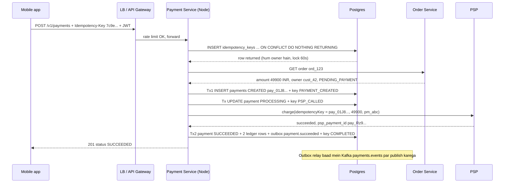
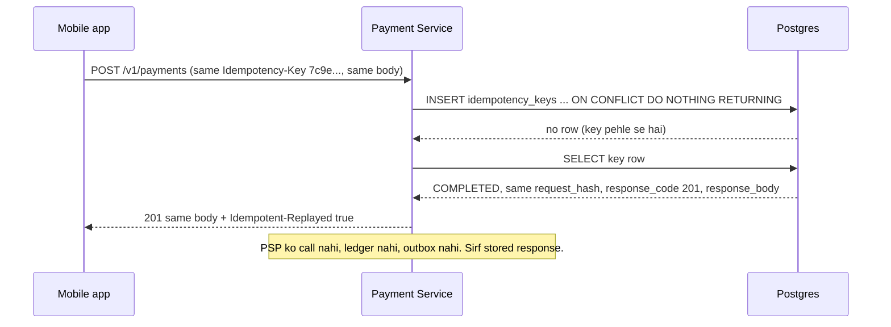
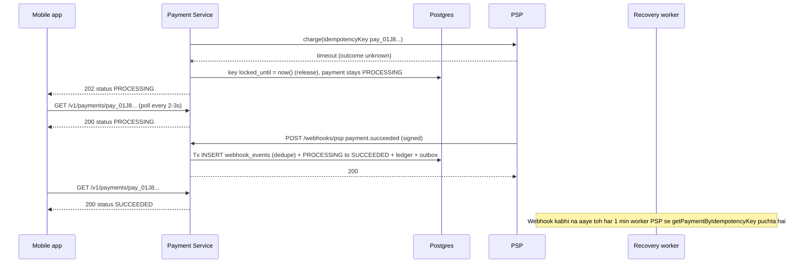
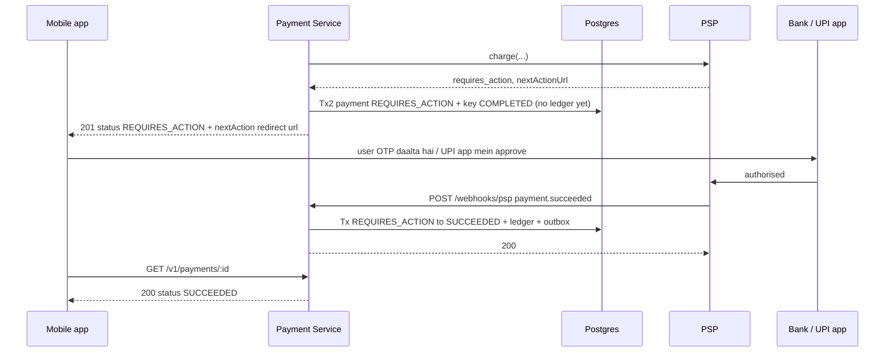

# Payment System -- HLD + LLD (Part 2: Request Flow -> API -> Database -> LLD -> Code)

> Is file mein prompt ke **Parts 7-12** hain: request flow, API design, database design, LLD folder structure, Node.js/TypeScript code, aur code ka line-by-line explanation.
> Part 1 mein humne decide kiya tha: **ShopKart ka Payment Service, 5M payments/day (~58 TPS avg, ~1,000 TPS peak plan), paisa PSP (Razorpay/Stripe style) move karta hai, hum sirf `pm_...` token dekhte hain. Sabse bada rule: money exactly once move ho. Tool = Idempotent API (`Idempotency-Key` header, keys Postgres mein), 3 atomic phases with recovery points, state machine with conditional updates, double-entry ledger, outbox -> Kafka. Correctness over availability -- doubt ho toh fail closed.** Ab wahi design code tak le jaayenge.

---

## PART 7 -- HLD Request Flow (shuru se end tak)

Rate limiter mein ek request = ek Redis call tha. Payment mein ek request ke andar **teen alag duniya** hain:

1. **Hamara DB** (fast, hamare control mein, ACID).
2. **PSP** (slow, bahar, kabhi timeout, kabhi 2 baar same event).
3. **Client** (mobile network, user double-click, app retry).

Is part ka poora game: in teeno ke beech **kisi bhi point par crash ho, paisa na do baar kate, na gum ho.** Isliye flow ko **3 atomic phases** mein toda hai. Har phase ke end par ek **recovery point** save hota hai -- "main yahan tak pahunch gaya tha".

```
Phase 1 (Tx 1)     : key claim -> order read -> payments row CREATED        -> recovery_point PAYMENT_CREATED
Phase 2 (no tx)    : payment PROCESSING + recovery_point PSP_CALLED (commit) -> PSP charge call
Phase 3 (Tx 2)     : status + ledger + outbox + key COMPLETED (ek commit)   -> recovery_point FINISHED
```

Char flows dekhenge: (A) happy path, (B) client retry -> replay, (C) PSP timeout -> 202, (D) 3-D Secure / UPI -> webhook.

### Flow A -- Happy path (card payment succeed)

Scenario: Priya ne ShopKart par Rs 499 ka order `ord_123` banaya. App ne PSP SDK se card tokenize kiya -> `pm_abc`. Ab app ek naya UUID banata hai (`Idempotency-Key: 7c9e...`) aur pay karta hai.



**Step by step (Hinglish mein):**

1. **Client** -- `POST /v1/payments`, body `{ orderId: "ord_123", paymentMethodToken: "pm_abc" }`. Amount body mein **nahi** hai. Header mein `Idempotency-Key` (UUID v4) aur `Authorization: Bearer <jwt>`.
2. **LB / Gateway** -- TLS terminate, aur `POST /v1/payments` par rate limit (Rate Limiter system wala). Ek user 1 second mein 50 pay requests bheje toh wo abuse hai, payment service tak aane hi mat do.
3. **Auth** -- JWT verify, `customerId = cust_42` nikala. Ye customer id **token se** aata hai, body se kabhi nahi.
4. **Claim** -- `INSERT ... ON CONFLICT DO NOTHING RETURNING *`. Row wapas aayi = ye key pehli baar dekhi, **hum iske owner hain**, 60 second ka lock (`locked_until`). Yahi ek statement do parallel requests mein se sirf ek ko jeetne deta hai (Postgres unique PK ki guarantee).
5. **Order read** -- Order Service se order laao. Amount `49900` paise (Rs 499) **order se** aata hai. Check: order Priya ka hai? status `PENDING_PAYMENT` hai?
6. **Tx 1** -- `payments` row `CREATED`, id `pay_01J8...` (ULID). Same transaction mein key par `recovery_point = 'PAYMENT_CREATED'`, `payment_id = pay_01J8...`. Crash yahan ke baad hua toh retry ko pata hai ki payment row ban chuki hai.
7. **Mark PROCESSING** -- payment `CREATED -> PROCESSING` aur key `PSP_CALLED`, **commit**. PSP ko call karne se **pehle** likhna zaruri hai: agar call ke beech server mara toh DB bolega "PSP ko shayad call gaya tha" -- recovery pehle PSP se puchegi, andhe mein naya charge nahi karegi.
8. **PSP charge** -- **kisi DB transaction ke bahar**. PSP idempotency key = `pay_01J8...` (hamari payment id). Is call ko 10 baar bhi retry karo, PSP ek hi charge banayega.
9. **Tx 2** -- ek hi commit mein: payment `SUCCEEDED` (conditional update), ledger mein DEBIT `psp_clearing` 49900 + CREDIT `sales_revenue` 49900, outbox mein `payment.succeeded`, key `COMPLETED` + stored response. Ya sab hoga, ya kuch nahi.
10. **Response** -- `201` + `{ id, status: "SUCCEEDED", amount }`. Baad mein outbox relay event ko Kafka par daalega -> Order Service order ko PAID karegi, Notification Service SMS bhejegi.

> Key point: Tx 1 aur Tx 2 dono **chhote** hain (few ms). Slow PSP call (300 ms - 3 s) **kisi transaction ke andar nahi** -- DB connection aur row locks PSP ka wait nahi karte.

### Flow B -- Client retry after timeout (same key) -> replay

Scenario: Priya metro mein hai. Payment server par succeed ho gaya (Flow A poora hua), lekin `201` response raaste mein network drop ho gaya. App ko timeout dikha. App **same key** ke saath retry karta hai.



**Existing row mili toh 4 raaste:** alag `request_hash` (same key, alag body) -> `422 IDEMPOTENCY_KEY_REUSED` | `COMPLETED` -> stored response replay + `Idempotent-Replayed: true` | `IN_PROGRESS` + lock valid (pehli request abhi chal rahi) -> `409 IDEMPOTENCY_IN_PROGRESS` | `IN_PROGRESS` + lock expired (pehla server crash) -> **take over** aur `recovery_point` se aage.

> Replay ka matlab: **pehla jawab hi dobara**. Agar pehla jawab `FAILED` (card declined) tha, replay bhi `FAILED` dega -- naya charge try nahi. Naya try = nayi key.

### Flow C -- PSP timeout -> 202 PROCESSING -> webhook ya recovery worker

Scenario: Big sale, PSP slow hai. Hamara charge call 10 s timeout (retries ke baad bhi) par jawab nahi laaya. Humein **nahi pata** card kata ya nahi.



**Step by step:**

1. Timeout = **unknown**, failure nahi. Ho sakta hai PSP ne card kaat liya ho aur sirf jawab raaste mein gum hua ho. **Timeout par kabhi FAILED mat likho** -- warna user dobara pay karega aur do baar katega.
2. Payment `PROCESSING` rehta hai; key `IN_PROGRESS` @ `PSP_CALLED`, bas lock release. Client ko **`202`** + `PROCESSING` -> app "Processing..." screen + `GET` poll.
3. **Teen raaste se final state aati hai** (jo pehle pahunche):
   - **Webhook** -- PSP `payment.succeeded` bhejta hai. Signature verify, `webhook_events` mein dedupe insert, conditional update `PROCESSING -> SUCCEEDED`, ledger + outbox. Sab ek tx.
   - **Client retry (same key)** -- lock free hai -> take over -> `PSP_CALLED` se resume -> `psp.getPaymentByIdempotencyKey(pay_01J8...)` -> result lagao. PSP ko bhi record nahi mila (`unknown`) toh **same PSP key** ke saath `charge` dobara -- safe hai, PSP duplicate nahi banayega.
   - **Recovery worker** (har 1 min) -- stuck `IN_PROGRESS` keys aur `PROCESSING` payments dhundhta hai, PSP se status puchta hai.
4. Teeno raaste **same conditional update** use karte hain (`WHERE status = ANY(allowed_from)`). Jo pehle pahuncha wo jeeta; baaki ko `rowCount = 0` milta hai -> "already done", error nahi. Ledger entries isliye **sirf jeetne wala** likhta hai -- double ledger impossible.

### Flow D -- REQUIRES_ACTION (3-D Secure / UPI collect) -> webhook completes

Scenario: Priya ka card 3-D Secure maangta hai (bank ka OTP page). Ya UPI collect -- user ko apne UPI app mein approve karna hai.



**Step by step:**

1. PSP bolta hai "user ka action chahiye" + URL. Tx 2 mein payment `REQUIRES_ACTION`, **ledger entry nahi** (paisa abhi move nahi hua), key `COMPLETED` with `201 REQUIRES_ACTION`.
2. App `nextAction.url` kholta hai, user OTP daalta hai. Final result **sirf webhook** (ya recovery worker) se: `REQUIRES_ACTION -> SUCCEEDED` ya `FAILED` (15 min tak kuch nahi kiya toh PSP expire karke `payment.failed`).
3. Dhyan do: ab same key ka retry **purana `REQUIRES_ACTION` jawab replay** karega, chahe payment ab `SUCCEEDED` ho. Latest status ke liye client `GET` kare. Idempotency ka contract "same request = same response" hai, "latest state" nahi.

### Latency budget (PSP dominates)

| Step | Approx time | Note |
|---|---|---|
| LB + TLS + gateway rate limit | ~1 ms | Rate limiter wala ~1 ms |
| JWT verify | ~0.2 ms | CPU only |
| Claim INSERT (idempotency_keys) | ~2 ms | 1 round trip + WAL |
| Order Service GET | ~5-20 ms | Internal HTTP (maan lo ~12) |
| Tx 1 (payment insert + recovery point) | ~4 ms | BEGIN, 2 statements, COMMIT |
| Tx mark PROCESSING | ~2 ms | |
| **PSP charge** | **~300 ms - 3 s** | Bank + card network + PSP |
| Tx 2 (status + 2 ledger + outbox + key) | ~6 ms | 4-5 statements, 1 commit |
| **Hamara hissa** | **~27 ms** | |
| **Total** | **~0.33 - 3.03 s** | PSP = ~92% (fast case) se ~99% (slow case) |

(Check: 300 + 27 = 327 ms -> PSP 91.7%; 3000 + 27 = 3027 ms -> PSP 99.1%.)

> Interview line: "Payment create ka latency basically **PSP ka latency** hai. Hamara optimisation DB ko fast karna nahi, balki ye pakka karna hai ki **PSP ke wait ke dauraan hum koi DB connection ya lock pakad ke na baithein**."

**Ye point kyun important hai (Little's law):**

- Peak 1,000 TPS x ~1-3 s per request = **~1,000-3,000 requests ek saath in-flight**.
- Agar PSP call transaction ke andar hoti -> itne hi DB connections busy. Postgres ke `max_connections` usually kuch sau -> poora system atak jaata.
- Hamare design mein har payment DB ko total ~15 ms deta hai -> 1,000 x 0.015 = **~15 connections average busy**. Node instances ka chhota pool (e.g. 20 per instance) kaafi hai.

---

## PART 8 -- API Design

Chaar endpoints: create payment, get payment, refund, aur PSP webhook.

### 8.1 `POST /v1/payments` -- create payment

**Request:**

```
POST /v1/payments
Authorization: Bearer eyJhbGciOi...
Idempotency-Key: 7c9e6679-7425-40de-944b-e07fc1f90ae7
Content-Type: application/json

{ "orderId": "ord_123", "paymentMethodToken": "pm_abc" }
```

**Responses:**

```
HTTP/1.1 201 Created
{ "id": "pay_01J8XK3M9Q", "status": "SUCCEEDED", "amount": { "valueMinor": 49900, "currency": "INR" } }

HTTP/1.1 201 Created                              (card declined -- phir bhi 201!)
{ "id": "pay_01J8XK3M9Q", "status": "FAILED", "amount": { "valueMinor": 49900, "currency": "INR" }, "failureCode": "card_declined" }

HTTP/1.1 201 Created                              (3-D Secure / UPI)
{ "id": "pay_01J8XK3M9Q", "status": "REQUIRES_ACTION", "amount": { "valueMinor": 49900, "currency": "INR" },
  "nextAction": { "type": "redirect", "url": "https://psp.example/3ds/abc" } }

HTTP/1.1 202 Accepted                             (PSP ka jawab abhi pata nahi)
{ "id": "pay_01J8XK3M9Q", "status": "PROCESSING" }

HTTP/1.1 201 Created                              (same key ka retry)
Idempotent-Replayed: true
{ ...pehle wala exact same body... }
```

**Ye endpoint kyun aisa hai?**

- **Amount body mein kyun nahi?** Agar client amount bhejta, toh koi bhi app modify karke Rs 499 ke order ke liye Rs 1 bhej deta. Server **order se** amount padhta hai. Client sirf "kaunsa order" aur "kaunsa payment method" batata hai. (Client `amount` bheje bhi toh ignore -- fingerprint mein bhi sirf `orderId` + `paymentMethodToken` jaate hain.)
- **`paymentMethodToken`, card number kyun nahi?** Card number PSP ke SDK ne device par hi tokenize kar diya. Raw card hamare server tak aaya toh poora system PCI DSS ke heavy scope mein aa jaata (audits, network segmentation, sab). Token = hamara scope chhota.
- **Decline `201` + `FAILED` kyun, `402`/`400` kyun nahi?** Request **sahi thi**, humne payment **create kiya**, PSP ne bola "bank ne mana kiya". Ye ek valid business outcome hai, server error ya client bug nahi. `201` ke saath payment id milti hai (support ticket, history). Aur ye response **store + replay** hota hai -- retry par phir `FAILED`, dobara card try nahi. `4xx` rakha hota toh bahut clients use "retry-able error" samajh ke loop karte.
- **`202` kyun?** `202 Accepted` = "request le li, kaam abhi poora nahi hua". Timeout par humein sach mein nahi pata -- `500` bolna jhooth hai (shayad paisa kat gaya) aur `FAILED` bolna khatarnak hai. `202` + `PROCESSING` honest jawab hai. **202 store nahi hota** (key `IN_PROGRESS` rehti hai), taaki same key ka retry aage resume kar sake.

**Headers:**

| Header | Direction | Matlab |
|---|---|---|
| `Authorization: Bearer <jwt>` | request | Kaun hai (customer id) |
| `Idempotency-Key: <uuid v4>` | request | Is logical operation ki id. **Required** |
| `Idempotent-Replayed: true` | response | Ye stored jawab hai, operation dobara nahi chala |

### 8.2 Error table (create payment)

| Status | Code | Kab | Client kya kare |
|---|---|---|---|
| `400` | `IDEMPOTENCY_KEY_REQUIRED` | Header missing | Bug fix: key bhejo |
| `400` | `INVALID_IDEMPOTENCY_KEY` / `INVALID_ORDER_ID` / `INVALID_PAYMENT_METHOD_TOKEN` / `INVALID_JSON` | Format galat | Bug fix |
| `401` | `UNAUTHENTICATED` | JWT missing / expired | Login refresh |
| `403` | `FORBIDDEN` | Order kisi aur customer ka hai | Mat retry karo |
| `404` | `ORDER_NOT_FOUND` | Order exist nahi karta | Mat retry karo |
| `409` | `IDEMPOTENCY_IN_PROGRESS` | Same key ki pehli request abhi chal rahi hai (lock valid) | 1-2 s ruk ke **same key** se retry |
| `409` | `ORDER_ALREADY_PAID` | Order pehle se paid / ek active payment already hai (doosri key se) | Order status dikhao, pay mat karo |
| `422` | `IDEMPOTENCY_KEY_REUSED` | Same key, **alag body** | Bug: har naye operation ke liye nayi key |
| `429` | `RATE_LIMITED` | Gateway limit | `Retry-After` ke baad |
| `503` | `PSP_UNAVAILABLE` | Circuit breaker open, PSP ko request **gayi hi nahi** | Same key se baad mein retry -- safe |
| `500` | `INTERNAL_ERROR` | Hamara bug / DB down | Same key se retry -- safe (key resume karegi) |

**Note:** `4xx` jo **kuch bhi hone se pehle** aate hain (403, 404, 409 ORDER_ALREADY_PAID) store nahi hote -- key release ho jaati hai. Kyunki koi side effect nahi hua, retry dobara check chala dega. Sirf "payment ka final jawab" (201) store + replay hota hai.

### 8.3 Validation

| Field | Rule | Kyun |
|---|---|---|
| `Idempotency-Key` | UUID v4 regex | Random, guess-proof, fixed length (DB key chhota). `"1"` jaisi keys doosre requests se collide karengi |
| `orderId` | `^ord_[A-Za-z0-9]{1,40}$` | Garbage / injection / 1 MB string reject |
| `paymentMethodToken` | `^pm_[A-Za-z0-9_]{1,100}$` | Sirf token shape. Koi 16-digit card number bheje toh reject -- raw card log mein bhi nahi jaana chahiye |
| Amount (order se) + body | `Number.isSafeInteger`, `> 0`; body max `16kb` | Order Service ka bug (float, negative) charge se pehle pakdo |

### 8.4 Authentication + Authorization

- **Authentication:** JWT (gateway ya middleware verify kare). `customerId = token.sub`.
- **Authorization (sabse important):** customer **sirf apne** order ka payment bana sakta hai aur **sirf apna** payment dekh sakta hai.
  - Create: `order.customerId !== customerId` -> `403`.
  - Get: payment kisi aur ka hai -> **`404`** (403 nahi). 403 bolna leak karta hai ki "ye id exist karti hai" -- attacker ids guess karke dusron ke payments ka pata laga sakta hai.
- **Idempotency key scope `(customer_id, key)`** -- do alag customers galti se same UUID bhejein (ya attacker jaan-boojh ke) toh bhi ek doosre ka stored response replay nahi hoga.

### 8.5 Client ko kya karna chahiye (docs mein likhna)

1. **Key ek baar banao, per attempt.** User "Pay" dabaye -> naya UUID -> local storage mein save. Isi attempt ke saare retries (timeout, app restart, network drop) **same key**.
2. **Retry = same key + same body.** Body badli toh 422.
3. **Naya attempt = nayi key.** Card declined hua, user doosra card try kare -> nayi key (aur naya `pm_` token).
4. **`202` ya timeout** -> "Processing" screen, `GET /v1/payments/:id` har 2-3 s poll (max ~2 min), ya push event ka wait. **Dobara "Pay" button enable mat karo.**
5. **`409 IDEMPOTENCY_IN_PROGRESS` / `5xx`** -> exponential backoff + jitter, same key, max ~5 attempts (Rate Limiter mein dekha tha).
6. **Pay button double-click** -> button disable karo; phir bhi do alag keys aa gayi toh server ka `ux_payments_one_active_per_order` index doosre ko `409 ORDER_ALREADY_PAID` de dega.

### 8.6 `GET /v1/payments/:id`

```
GET /v1/payments/pay_01J8XK3M9Q
Authorization: Bearer ...

200 OK
Cache-Control: no-store
{ "id": "pay_01J8XK3M9Q", "status": "SUCCEEDED", "amount": { "valueMinor": 49900, "currency": "INR" },
  "refundedMinor": 0, "createdAt": "2026-09-18T14:02:11.120Z" }
```

- **Primary se padho, replica se nahi.** Webhook ne abhi `SUCCEEDED` likha aur replica 200 ms peeche hai -> user ko `PROCESSING` dikhega aur wo dobara pay karne ki sochega. Read-after-write consistency chahiye. Load ~300 avg / ~5K peak reads/s -- primary aaram se handle karta hai (PK lookup).
- `Cache-Control: no-store` -- status badalta rehta hai, koi proxy/browser cache na kare.

### 8.7 `POST /v1/payments/:id/refunds`

```
POST /v1/payments/pay_01J8XK3M9Q/refunds
Idempotency-Key: 0b8f1c2e-5d7a-4e3b-9a61-2f4c8d9e7a10
{ "amountMinor": 10000, "reason": "customer_request" }

201 Created
{ "id": "re_01J8ZP...", "paymentId": "pay_01J8XK3M9Q", "amountMinor": 10000, "status": "SUCCEEDED" }
```

- Refund bhi paisa move karta hai -> **same idempotency machinery** (key required, replay, 409, 422). `amountMinor` integer paise (Rs 100 = 10000), safe integer `> 0`.
- Payment `SUCCEEDED` ya `PARTIALLY_REFUNDED` hona chahiye (warna `409`). `422 REFUND_EXCEEDS_AMOUNT` jab `refunded_minor + amountMinor > amount_minor`; DB ka `CHECK (refunded_minor <= amount_minor)` last line of defence (double refund race Part 3 mein).
- Authz: usually support/admin role ya merchant backend refund karta hai, customer khud nahi.

### 8.8 `POST /webhooks/psp` -- PSP se aane wala contract

```
POST /webhooks/psp
X-PSP-Signature: 5f2b0c...(hex HMAC-SHA256 of raw body)
Content-Type: application/json

{ "id": "evt_psp_881", "type": "payment.succeeded",
  "data": { "paymentId": "pay_01J8XK3M9Q", "pspPaymentId": "pay_Rz9", "failureCode": null } }
```

(Real PSPs ka exact payload alag hota hai; `razorpay.client.ts` usko is normalised shape mein badalta hai. Hamari payment id PSP ko charge ke time metadata / idempotency key mein di thi, isliye event mein wapas aati hai.)

| Rule | Kyun |
|---|---|
| **Raw body** par signature verify | HMAC exact bytes par bana hai. `express.json` parse karke dobara stringify kare toh spacing / key order badal sakta hai -> signature kabhi match nahi karega |
| `crypto.timingSafeEqual` | Normal `===` pehle alag byte par ruk jaata hai; time naap ke attacker signature byte-by-byte guess kar sakta hai |
| No JWT | PSP ka koi user login nahi. **Signature hi authentication hai.** Bina valid signature -> `401`, kuch process nahi |
| `webhook_events` insert `ON CONFLICT DO NOTHING` | PSP same event 2-3 baar bhejta hai (at-least-once). PK `(psp, psp_event_id)` dedupe karta hai |
| **`200` jaldi** | PSP ka timeout chhota hota hai (kuch seconds). Slow jawab = PSP retry = aur load |
| **`500` jab hum fail** | Tx rollback hua (dedupe row bhi) -> `500` -> PSP baad mein retry karega -> dobara process. Kabhi "200 bhej ke baad mein process" mat karo jab tak durable queue na ho |
| Out-of-order events | `payment.failed` `SUCCEEDED` ke baad aaya? Conditional update `rowCount 0` -> ignore, `200` |

Extra hardening: event timestamp check (5 min se purana reject -- replay attack), PSP ke published IP ranges allowlist, aur zyada safety ke liye important events par PSP API se status re-fetch.

---

## PART 9 -- Database Design

### Kaunsa DB? Deciding factor = ek transaction mein kai rows

Tx 2 mein ek saath 5 cheezein badalni hain: payment status, 2 ledger rows, outbox event, idempotency key. Agar inme se **ek bhi** likhi aur baaki nahi:

- Payment `SUCCEEDED` lekin ledger nahi -> accounts galat, reconciliation mismatch.
- Ledger likha lekin key `COMPLETED` nahi -> retry dobara ledger likh sakta hai.
- Status likha lekin outbox nahi -> Order Service ko kabhi pata nahi chalega, order "unpaid" reh jaayega.

Toh requirement: **multi-row, multi-table ACID transaction**, plus unique constraints aur CHECK constraints.

| Option | Payment ke liye? | Kyun |
|---|---|---|
| **PostgreSQL** | **Haan (hamari choice)** | Multi-table ACID, `ON CONFLICT`, partial unique indexes, CHECK, `RETURNING`, mature ops (backups, PITR, replicas). ~10K row writes/s peak ek tuned primary par fit |
| **MySQL (InnoDB)** | Haan, equally valid | ACID + unique indexes. Partial index nahi (generated column trick chahiye), CHECK 8.0.16+ se. Team MySQL jaanti hai toh ye bhi theek |
| **MongoDB** | Possible, lekin weak | 4.0+ se multi-document transactions hain, lekin ye default nahi, costly hain, aur partial unique / CHECK jaisi guarantees schema validation se jugaad. Money ke liye relational constraints zyada natural. Tab choose karunga jab company ka poora stack Mongo ho |
| **DynamoDB** | Scale bahut bada ho tab | `TransactWriteItems` (max 100 items) + conditional writes se ho sakta hai, infinite scale. Lekin ad-hoc queries (reconciliation, "stuck payments"), ledger reports mushkil; har access pattern pehle design karna padta hai. 58 TPS avg ke liye overkill |
| **"Redis for idempotency keys"** | **Nahi** | Tempting: fast `SET NX`. Problem: key Redis mein, payment Postgres mein -> **do alag systems, ek transaction nahi**. Redis mein `COMPLETED` likha aur Postgres commit fail? Ya ulta? Plus Redis failover/eviction par key gayi -> retry dobara charge. **Yahan Redis ki zarurat nahi.** |

> "Main PostgreSQL choose kar raha hoon kyunki payment ka core correctness ek hi baat par tika hai: **status, ledger, outbox aur idempotency key ek hi commit mein**. Postgres ye guarantee deta hai, unique/partial indexes aur CHECK constraints se DB khud galat state reject karta hai, aur hamara scale (~1,000 TPS peak) ek primary par fit hai."

**Isolation:** `READ COMMITTED` (Postgres default) kaafi hai. Race conditions ko hum **unique constraints** (claim, dedupe, one-active-per-order) aur **conditional updates** (`WHERE status = ANY(...)`) se rokte hain. `SERIALIZABLE` ki zarurat nahi -- uske serialization failures ke retries alag complexity laate.

### Schema (spec wala, exact)

```sql
CREATE TABLE payments (
  id              TEXT PRIMARY KEY,                  -- 'pay_01J8...' (ULID: sortable, app-generated)
  order_id        TEXT NOT NULL,
  customer_id     TEXT NOT NULL,
  amount_minor    BIGINT NOT NULL CHECK (amount_minor > 0),
  currency        CHAR(3) NOT NULL,
  status          TEXT NOT NULL CHECK (status IN ('CREATED','PROCESSING','REQUIRES_ACTION','SUCCEEDED','FAILED','PARTIALLY_REFUNDED','REFUNDED')),
  refunded_minor  BIGINT NOT NULL DEFAULT 0 CHECK (refunded_minor >= 0 AND refunded_minor <= amount_minor),
  psp             TEXT NOT NULL,                     -- 'razorpay'
  psp_payment_id  TEXT NULL,
  failure_code    TEXT NULL,
  version         INT NOT NULL DEFAULT 0,
  created_at      TIMESTAMPTZ NOT NULL DEFAULT now(),
  updated_at      TIMESTAMPTZ NOT NULL DEFAULT now()
);
CREATE UNIQUE INDEX ux_payments_one_active_per_order ON payments (order_id)
  WHERE status IN ('CREATED','PROCESSING','REQUIRES_ACTION','SUCCEEDED','PARTIALLY_REFUNDED','REFUNDED');
CREATE UNIQUE INDEX ux_payments_psp_id ON payments (psp, psp_payment_id) WHERE psp_payment_id IS NOT NULL;
CREATE INDEX ix_payments_stuck ON payments (updated_at) WHERE status IN ('PROCESSING','REQUIRES_ACTION');

CREATE TABLE idempotency_keys (
  customer_id     TEXT NOT NULL,
  key             TEXT NOT NULL,
  request_path    TEXT NOT NULL,
  request_hash    TEXT NOT NULL,
  status          TEXT NOT NULL CHECK (status IN ('IN_PROGRESS','COMPLETED')),
  recovery_point  TEXT NOT NULL DEFAULT 'STARTED' CHECK (recovery_point IN ('STARTED','PAYMENT_CREATED','PSP_CALLED','FINISHED')),
  payment_id      TEXT NULL,
  response_code   INT NULL,
  response_body   JSONB NULL,
  locked_until    TIMESTAMPTZ NULL,
  created_at      TIMESTAMPTZ NOT NULL DEFAULT now(),
  PRIMARY KEY (customer_id, key)
);
CREATE INDEX ix_idem_created ON idempotency_keys (created_at);

CREATE TABLE refunds (
  id              TEXT PRIMARY KEY,                  -- 're_<ULID>'
  payment_id      TEXT NOT NULL REFERENCES payments(id),
  amount_minor    BIGINT NOT NULL CHECK (amount_minor > 0),
  status          TEXT NOT NULL CHECK (status IN ('PENDING','SUCCEEDED','FAILED')),
  psp_refund_id   TEXT NULL,
  created_at      TIMESTAMPTZ NOT NULL DEFAULT now()
);

CREATE TABLE ledger_entries (
  id              BIGSERIAL PRIMARY KEY,
  transaction_id  TEXT NOT NULL,
  account         TEXT NOT NULL,                     -- 'psp_clearing','sales_revenue','psp_fees'
  direction       TEXT NOT NULL CHECK (direction IN ('DEBIT','CREDIT')),
  amount_minor    BIGINT NOT NULL CHECK (amount_minor > 0),
  currency        CHAR(3) NOT NULL,
  payment_id      TEXT NOT NULL,
  created_at      TIMESTAMPTZ NOT NULL DEFAULT now()
);
CREATE INDEX ix_ledger_payment ON ledger_entries (payment_id);
CREATE INDEX ix_ledger_account_time ON ledger_entries (account, created_at);

CREATE TABLE webhook_events (
  psp             TEXT NOT NULL,
  psp_event_id    TEXT NOT NULL,
  type            TEXT NOT NULL,
  payload         JSONB NOT NULL,
  received_at     TIMESTAMPTZ NOT NULL DEFAULT now(),
  processed_at    TIMESTAMPTZ NULL,
  PRIMARY KEY (psp, psp_event_id)
);

CREATE TABLE outbox (
  id              BIGSERIAL PRIMARY KEY,
  event_id        TEXT NOT NULL UNIQUE,              -- 'evt_<ULID>', consumers dedupe on this
  aggregate_id    TEXT NOT NULL,                     -- payment id
  event_type      TEXT NOT NULL,                     -- 'payment.succeeded'
  payload         JSONB NOT NULL,
  created_at      TIMESTAMPTZ NOT NULL DEFAULT now(),
  published_at    TIMESTAMPTZ NULL
);
CREATE INDEX ix_outbox_unpublished ON outbox (id) WHERE published_at IS NULL;
```

### Column decisions ke WHY

- **`amount_minor BIGINT`, `NUMERIC`/`FLOAT` kyun nahi?** Paise mein integer (Rs 499 = 49900). Float mein `0.1 + 0.2 = 0.30000000000000004` -- paise gayab. BIGINT exact, fast, aur JS mein `Number.isSafeInteger` tak (~9e15 paise) safe. `NUMERIC` bhi exact hai lekin integer minor units sabse simple contract hai (Stripe/Razorpay APIs bhi paise/cents lete hain).
- **`currency CHAR(3)`** -- ISO code (`INR`). Amount bina currency ke adhoora hai; kal USD aaye toh schema same.
- **`id TEXT` = `pay_<ULID>`** -- app generate karta hai (DB round trip nahi), time-sortable (B-tree index par inserts end mein, URL shortener mein dekha tha), prefix se log mein turant pata "ye payment id hai". Aur yahi id **PSP idempotency key** banti hai.
- **`status` CHECK** -- typo `'SUCEEDED'` DB reject karega. Transitions ka rule code (`payment-state.ts`) mein, allowed values DB mein. **`version`** har transition par +1 (audit + optimistic concurrency).
- **`ledger_entries` mein `UPDATE`/`DELETE` nahi** -- DB grants se band (`GRANT INSERT, SELECT` only). Galti sudhaarni hai toh reversing entry. Detail Part 3.

### Constraints + indexes -- kyun, aur na ho toh kya bigdega

| Constraint / Index | Kyun | Na ho toh |
|---|---|---|
| `idempotency_keys PRIMARY KEY (customer_id, key)` | **Claim ka poora mechanism isi par hai.** Do parallel requests same key ke saath -> Postgres sirf ek INSERT hone deta hai, doosre ko `ON CONFLICT DO NOTHING` | Dono requests "main owner hoon" samjhengi -> **double charge**. "Pehle SELECT, phir INSERT" code race karta hai |
| `ux_payments_one_active_per_order` (partial unique on `order_id`) | Idempotency key se **independent** second safety net. User ne double-click kiya aur buggy app ne **do alag keys** bhej di -- dono ke liye payment row banegi? Nahi: doosra INSERT unique violation -> `409 ORDER_ALREADY_PAID` | Ek order ke do active payments -> dono charge -> customer ko refund karna padega, support ticket |
| ...us index mein `FAILED` kyun nahi? | Failed payment ke baad user ko doosra card try karne dena hai -- naya payment row same order par | FAILED bhi hota toh ek decline ke baad order kabhi pay hi nahi hota |
| `CHECK (refunded_minor >= 0 AND refunded_minor <= amount_minor)` | Do support agents ek saath refund dabayein (Rs 400 + Rs 400 on Rs 499). Code ka check race kar sakta hai; DB ka CHECK **atomic** hai -- doosra UPDATE fail | Rs 499 ke payment par Rs 800 refund -> seedha paisa nuksaan |
| `CHECK (amount_minor > 0)` (payments, refunds, ledger) | 0 ya negative amount kabhi valid nahi | Negative refund = ulta paisa; 0 wali ledger entry = noise |
| `ux_payments_psp_id` (partial unique) | Ek PSP payment id sirf ek hamare payment se jude. Webhook/reconciliation `psp_payment_id` se dhundhte hain | Bug se do payments same PSP charge ko claim karein -> ledger double |
| `ix_payments_stuck` (partial on `updated_at`) | Recovery worker har minute: "PROCESSING/REQUIRES_ACTION jo 10 min se purane hain". Partial index mein sirf in-flight rows (kuch hazaar), crores wali table nahi | Har minute poori payments table scan -> DB par bhaari load |
| `ix_idem_created` | Cleanup job: `DELETE ... WHERE created_at < now() - interval '24 hours'` (batches mein) | 5M rows/day ka delete full scan -> table 24h ki jagah hamesha badhti |
| `webhook_events PRIMARY KEY (psp, psp_event_id)` | PSP same event 3 baar bhejta hai -> sirf pehla insert hota hai = **dedupe** | Har duplicate webhook dobara process -> (conditional update bachayega, lekin) extra outbox events, extra kaam |
| `ix_ledger_payment` | "Is payment ki saari entries" (support, refund, reconciliation) | 7 saal ki ledger table scan |
| `ix_ledger_account_time` | "`sales_revenue` ka aaj ka total" -- finance reports, reconciliation | Reports har baar full scan |
| `outbox.event_id UNIQUE` | Consumers is id par dedupe karte hain; unique hona chahiye | Do events same id -> consumer ek ko skip kar dega |
| `ix_outbox_unpublished` (partial `WHERE published_at IS NULL`) | Relay har ~100 ms: "abhi tak publish nahi hue". Index mein sirf pending rows (usually < 100) | Relay ko poori outbox table (crores) scan karni padti |

> Interview line: "Payments mein **DB constraints hi asli guards hain**. Application code ke checks race kar sakte hain; unique index aur CHECK constraint atomic hain. Main dono rakhta hoon -- code se achha error message, DB se guarantee."

### Scale + retention (7 saal)

- ~2 KB per payment (saari tables) x 5M/day = **10 GB/day -> ~3.65 TB/year -> ~25.5 TB for 7 years**. Ek table mein 7 saal = slow VACUUM, bade indexes, mehenge backups.
- **Monthly partitioning** (`PARTITION BY RANGE (created_at)`): ~300 GB per month partition, 7 saal = 84 partitions. Queries "last 30 days" sirf 1-2 partitions chhooti hain. Purane partitions **detach karke** sasti storage (S3 / archive DB) mein -- DELETE nahi, audit ke liye data rehta hai.
- `ledger_entries` partitioning ke liye perfect hai: append-only, koi global unique constraint nahi.
- **Catch (interview mein bolo):** Postgres mein partitioned table par unique index mein **partition key include karni padti hai**. Matlab `ux_payments_one_active_per_order` ya `payments.id` PK ko monthly partitions par global enforce nahi kar sakte. Practical approach: `payments` ki **hot table** chhoti rakho (recent months), aur purane **terminal** payments (SUCCEEDED/FAILED/REFUNDED) ko archive (partitioned) table mein move karo -- "one active per order" sirf naye orders ke liye matter karta hai.
- `idempotency_keys` partition nahi karte (same wajah: PK `(customer_id, key)`); 24h cleanup se ~5 GB live rehta hai -- chhota hai.
- Webhooks ~15M/day (~174/s) -- `webhook_events` bhi badhti hai; 30-90 din baad archive.

---

## PART 10 -- LLD (Low-Level Design): Node.js project structure

```
payment-service/
+-- src/
|   +-- routes/
|   |   +-- payment.routes.ts           # /v1/payments, /v1/payments/:id, /refunds
|   |   +-- webhook.routes.ts           # /webhooks/psp (express.raw)
|   +-- controllers/
|   |   +-- payment.controller.ts       # headers + body validate, service call, status code
|   |   +-- webhook.controller.ts       # raw body, HMAC verify, 200 / 500
|   +-- services/
|   |   +-- payment.service.ts          # 3 atomic phases + recovery points + webhook apply
|   |   +-- idempotency.service.ts      # begin (claim / replay / resume), complete, release
|   |   +-- ledger.service.ts           # double-entry rows (balanced)
|   |   +-- refund.service.ts           # refunds (same idempotency pattern)
|   +-- domain/
|   |   +-- payment-state.ts            # allowed transitions map (pure)
|   |   +-- money.ts                    # integer minor units validation (pure)
|   |   +-- errors.ts                   # AppError(status, code)
|   +-- psp/
|   |   +-- psp-client.ts               # PspClient interface (hamara contract)
|   |   +-- razorpay.client.ts          # HTTP impl: 10s timeout, retry+jitter, same key, circuit breaker
|   +-- repositories/
|   |   +-- payment.repository.ts       # sirf SQL: insert, findById, conditional transition
|   |   +-- idempotency.repository.ts   # claim, find, takeOver, complete, release
|   |   +-- ledger.repository.ts
|   |   +-- outbox.repository.ts
|   |   +-- webhook-event.repository.ts # insertIfNew (dedupe)
|   +-- clients/
|   |   +-- order.client.ts             # Order Service se order (amount, owner, status)
|   +-- middleware/
|   |   +-- authenticate.ts             # JWT -> res.locals.customerId
|   +-- workers/
|   |   +-- outbox-relay.ts             # outbox -> Kafka payments.events
|   |   +-- payment-recovery.worker.ts  # stuck keys / PROCESSING payments -> ask PSP
|   +-- jobs/
|   |   +-- reconciliation.job.ts       # daily PSP settlement vs ledger
|   +-- infra/
|   |   +-- postgres.ts                 # Pool + withTransaction helper
|   |   +-- kafka.ts
|   |   +-- logger.ts                   # pino (card data / tokens redact)
|   |   +-- metrics.ts                  # prom-client
|   +-- app.ts                          # composition root + route-level body parsers
|   +-- server.ts                       # listen + graceful shutdown
+-- migrations/001_payments.sql
+-- tests/                              # pure state tests, real-Postgres same-key race, fake PSP flows
```

(`clients/`, `middleware/` aur `domain/errors.ts` spec ki file list se extra hain -- chhote helpers.)

| Folder | Kaam | Kya yahan NAHI hona chahiye |
|---|---|---|
| `routes/` | URL -> controller mapping, route-level body parser | Logic |
| `controllers/` | HTTP ki duniya: headers, validation, status code, `Idempotent-Replayed` header | SQL, PSP calls, transactions |
| `services/` | **Orchestration**: phases, recovery points, kab transaction, kab PSP | `req`/`res`; raw SQL strings |
| `domain/` | Pure rules: kaunsa transition allowed, amount valid hai ya nahi | I/O (DB, HTTP), Express |
| `psp/` | PSP se baat: timeout, retry, circuit breaker, response ko hamare `PspChargeResult` mein badalna | Payment status update, DB |
| `repositories/` | **Sirf SQL**, har function ek `Queryable` (pool ya tx) leta hai | Business decisions (transition allowed hai ya nahi), HTTP |
| `clients/` | Doosri internal services ke HTTP clients | Payment logic |
| `workers/`, `jobs/` | Background loops -- same services/repositories reuse | Apna alag SQL / alag rules (duplicate logic = bugs) |
| `infra/` | Connections, transaction helper, logger, metrics | Business logic |

**Dependency direction:**

```
routes -> controllers -> services -> repositories -> Postgres
                            |    -> psp/psp-client (interface) <- psp/razorpay.client (impl)
                            |    -> clients/order.client
                            +-> domain (pure: payment-state, money)   <- sab isko use karte hain, ye kisi ko nahi
workers/jobs -> services (same code path as API)
```

**Kyun aise layers?**

- **Service transaction decide karti hai, repository nahi.** Repository ke har method mein `db: Queryable` parameter hai -- service `tx` pass kare toh wo query transaction ke andar. Isse "payment + ledger + outbox + key ek commit" service ek jagah dikhati hai.
- **`PspClient` interface** -- tests mein `FakePspClient` jo timeout / decline / requires_action simulate kare. Kal Razorpay se Stripe? Sirf naya `stripe.client.ts`.
- **Workers same service use karte hain** -- webhook, client retry aur recovery worker teeno ek hi `transition` + `recordSideEffects` se jaate hain. Alag code path = alag bugs = double ledger.
- **`domain/` pure** -- state machine ka test bina DB ke milliseconds mein.

> Interview tip: "Main 3 cheezein strictly alag rakhunga: **HTTP (controller)**, **orchestration + transactions (service)**, **SQL (repository)**. Aur PSP ek interface ke peeche, taaki failure scenarios test ho sakein."

---

## PART 11 + 12 -- Node.js / TypeScript Code (line-by-line explanation ke saath)

Stack: **Express 5** (async errors khud error handler tak jaate hain), **pg** (node-postgres), **ulid**, **node:crypto**. Metrics/logger chhote wrappers (Part 5 mein detail).

Order: infra -> domain -> repository -> services -> PSP interface -> controllers -> wiring. (Poora code `tsc --strict` se type-check kiya gaya tha; yahan imports aur kuch helpers chhote karke dikhaye hain.)

### 1. `infra/postgres.ts` -- `withTransaction` helper

```ts
import { Pool, type PoolClient, type QueryResult, type QueryResultRow } from 'pg';

export interface Queryable {
  query<R extends QueryResultRow = any>(text: string, values?: unknown[]): Promise<QueryResult<R>>;
}
export type Tx = PoolClient;

export function createPool(connectionString: string): Pool {
  return new Pool({ connectionString, max: 20, statement_timeout: 5_000 });
}

export async function withTransaction<T>(pool: Pool, fn: (tx: Tx) => Promise<T>): Promise<T> {
  const client = await pool.connect();
  try {
    await client.query('BEGIN');
    const result = await fn(client);
    await client.query('COMMIT');
    return result;
  } catch (err) {
    await client.query('ROLLBACK').catch(() => undefined);
    throw err;
  } finally {
    client.release();
  }
}
```

**Code Explanation:**

- `interface Queryable` -- `Pool` aur `PoolClient` dono ke paas `query()` hai. Repositories `Queryable` lete hain, toh same function transaction ke andar (`tx`) bhi chal sakta hai aur bahar (`pool`) bhi.
- `max: 20` -- per Node instance 20 connections. PSP call tx ke bahar hai, toh har payment connection ko sirf ~15 ms pakadta hai. Part 7 ka hisaab: peak par ~15 connections total busy.
- `statement_timeout: 5_000` -- koi query 5 s se zyada atki toh Postgres khud cancel kare. Lock wait mein phansi query poora pool na kha jaaye.
- `pool.connect()` -- transaction ke liye **ek hi connection** chahiye. `pool.query('BEGIN')` phir `pool.query('INSERT')` alag-alag connections par ja sakte hain -- transaction toot jaata. Ye classic bug hai.
- `BEGIN ... fn(client) ... COMMIT` -- callback ke saare queries ek transaction mein.
- `catch -> ROLLBACK` -- kuch bhi throw hua toh sab undo. `.catch(() => undefined)` -- connection hi toot gaya ho toh ROLLBACK bhi fail hoga; asli error (`err`) chhupna nahi chahiye.
- `finally -> client.release()` -- connection pool mein wapas. Bhoole toh 20 requests ke baad pool khaali aur service hang.
- **Rule:** `fn` ke andar **kabhi** PSP ya HTTP call mat karna. Isliye helper ka naam aur usage review mein dikhe.

### 2. `domain/money.ts` -- integer minor units

```ts
import { AppError } from './errors';

export interface Money { amountMinor: number; currency: string }

const SUPPORTED_CURRENCIES = new Set(['INR']);

export function assertValidMoney(m: Money): void {
  if (!Number.isSafeInteger(m.amountMinor) || m.amountMinor <= 0) {
    throw new AppError(500, 'INVALID_AMOUNT', `amountMinor must be a positive safe integer, got ${m.amountMinor}`);
  }
  if (!SUPPORTED_CURRENCIES.has(m.currency)) {
    throw new AppError(500, 'UNSUPPORTED_CURRENCY', `currency ${m.currency}`);
  }
}

// pg returns BIGINT columns as strings ("49900") -- convert safely
export function minorFromDb(value: string | number): number {
  const n = Number(value);
  if (!Number.isSafeInteger(n)) throw new Error(`unsafe BIGINT from DB: ${value}`);
  return n;
}
```

**Code Explanation:**

- `Number.isSafeInteger(m.amountMinor)` -- ek check mein teen cheezein: integer hai (499.5 reject), `NaN`/`Infinity` nahi, aur 2^53 - 1 (~9e15) se chhota (JS number us ke upar exact nahi rehta). 9e15 paise = Rs 90 trillion -- kaafi hai.
- `amountMinor <= 0` -- zero/negative payment kabhi nahi.
- `AppError(500, ...)` kyun 500? Amount **order service se** aaya hai, client se nahi. Galat amount = hamare system ka bug, client ki galti nahi. Charge karne se pehle ruk jao (fail closed).
- `SUPPORTED_CURRENCIES` -- aaj sirf INR. Naya currency = conscious decision (PSP config, ledger accounts), accidental nahi.
- `minorFromDb` -- **node-postgres BIGINT ko string deta hai** (`"49900"`), kyunki BIGINT JS number mein fit na ho sakta hai. Bina convert kiye `"49900" + 100` = `"49900100"` -- string concat! Isliye ek jagah safe conversion.

### 3. `domain/payment-state.ts` -- allowed transitions

```ts
export type PaymentStatus =
  | 'CREATED' | 'PROCESSING' | 'REQUIRES_ACTION' | 'SUCCEEDED'
  | 'FAILED' | 'PARTIALLY_REFUNDED' | 'REFUNDED';

const TRANSITIONS: Record<PaymentStatus, readonly PaymentStatus[]> = {
  CREATED:            ['PROCESSING'],
  PROCESSING:         ['SUCCEEDED', 'FAILED', 'REQUIRES_ACTION'],
  REQUIRES_ACTION:    ['SUCCEEDED', 'FAILED'],
  SUCCEEDED:          ['PARTIALLY_REFUNDED', 'REFUNDED'],
  PARTIALLY_REFUNDED: ['PARTIALLY_REFUNDED', 'REFUNDED'],
  FAILED:             [],
  REFUNDED:           [],
};

export function canTransition(from: PaymentStatus, to: PaymentStatus): boolean {
  return TRANSITIONS[from].includes(to);
}

// For the conditional UPDATE: "which current states may move to `to`?"
export function allowedFrom(to: PaymentStatus): PaymentStatus[] {
  return (Object.keys(TRANSITIONS) as PaymentStatus[]).filter((from) => canTransition(from, to));
}
```

**Code Explanation:**

- `Record<PaymentStatus, ...>` -- TypeScript force karta hai ki **har** status ki entry ho. Naya status add kiya aur map update bhoole -> compile error.
- `FAILED: []`, `REFUNDED: []` -- terminal. Yahan se kahin nahi. Late webhook `SUCCEEDED` bheje `FAILED` payment ke liye? Allowed nahi -> ignore (aur alert, kyunki ye PSP-side mismatch hai -- reconciliation pakdegi).
- `SUCCEEDED -> FAILED` nahi hai -- out-of-order `payment.failed` webhook success ko ulta nahi kar sakta.
- `PARTIALLY_REFUNDED -> PARTIALLY_REFUNDED` -- doosra partial refund (Rs 100 + Rs 100) status same rakhta hai, sirf `refunded_minor` badhta hai.
- `allowedFrom('SUCCEEDED')` = `['PROCESSING', 'REQUIRES_ACTION']`. Ye list SQL mein `WHERE status = ANY($4)` banti hai. **Rule ek jagah (map), enforcement DB mein (atomic).**

### 4. `repositories/idempotency.repository.ts` -- claim, find, takeOver, complete, release

```ts
import type { Queryable } from '../infra/postgres';

export type RecoveryPoint = 'STARTED' | 'PAYMENT_CREATED' | 'PSP_CALLED' | 'FINISHED';

export interface IdempotencyKeyRow {
  customer_id: string; key: string; request_path: string; request_hash: string;
  status: 'IN_PROGRESS' | 'COMPLETED'; recovery_point: RecoveryPoint;
  payment_id: string | null; response_code: number | null; response_body: unknown;
  locked_until: Date | null; created_at: Date;
}

export class IdempotencyRepository {
  async claim(db: Queryable, customerId: string, key: string, path: string, hash: string) {
    const { rows } = await db.query<IdempotencyKeyRow>(
      `INSERT INTO idempotency_keys (customer_id, key, request_path, request_hash, status, recovery_point, locked_until)
       VALUES ($1, $2, $3, $4, 'IN_PROGRESS', 'STARTED', now() + interval '60 seconds')
       ON CONFLICT (customer_id, key) DO NOTHING
       RETURNING *`,
      [customerId, key, path, hash],
    );
    return rows[0] ?? null;
  }

  async find(db: Queryable, customerId: string, key: string) {
    const { rows } = await db.query<IdempotencyKeyRow>(
      `SELECT * FROM idempotency_keys WHERE customer_id = $1 AND key = $2`, [customerId, key]);
    return rows[0] ?? null;
  }

  async takeOver(db: Queryable, customerId: string, key: string) {
    const { rows } = await db.query<IdempotencyKeyRow>(
      `UPDATE idempotency_keys SET locked_until = now() + interval '60 seconds'
       WHERE customer_id = $1 AND key = $2 AND status = 'IN_PROGRESS' AND locked_until < now()
       RETURNING *`,
      [customerId, key],
    );
    return rows[0] ?? null;
  }

  async setRecoveryPoint(db: Queryable, customerId: string, key: string, point: RecoveryPoint, paymentId?: string) {
    await db.query(
      `UPDATE idempotency_keys SET recovery_point = $3, payment_id = COALESCE($4, payment_id)
       WHERE customer_id = $1 AND key = $2 AND status = 'IN_PROGRESS'`,
      [customerId, key, point, paymentId ?? null]);
  }

  async complete(db: Queryable, customerId: string, key: string, code: number, body: unknown) {
    await db.query(
      `UPDATE idempotency_keys
       SET status = 'COMPLETED', recovery_point = 'FINISHED', response_code = $3, response_body = $4, locked_until = NULL
       WHERE customer_id = $1 AND key = $2 AND status = 'IN_PROGRESS'`,
      [customerId, key, code, JSON.stringify(body)]);
  }

  async release(db: Queryable, customerId: string, key: string) {
    await db.query(
      `UPDATE idempotency_keys SET locked_until = now()
       WHERE customer_id = $1 AND key = $2 AND status = 'IN_PROGRESS'`, [customerId, key]);
  }
}
```

**Code Explanation:**

- `claim` -- spec wala canonical SQL. `ON CONFLICT (customer_id, key) DO NOTHING` + `RETURNING *`: row aayi = hum jeete; `null` = key pehle se hai. Do requests ek hi millisecond mein aayein toh bhi PK unique index sirf ek ko insert karne deta hai; doosri **wait** karti hai jab tak pehli commit na ho, phir `DO NOTHING`. Koi "check then insert" race nahi.
- `now() + interval '60 seconds'` -- **DB ka clock**, Node ka nahi. 20 Node servers ki clocks thodi alag ho sakti hain; lock ka faisla ek hi clock se.
- 60 s kyun? PSP call (10 s timeout x ~3 attempts + backoff = ~35 s) normally is ke andar khatam. Lock ka matlab: "main zinda hoon, beech mein mat ghuso". Kabhi lock kaam ke beech expire ho bhi gaya aur doosre ne take over kiya, toh bhi dono **same PSP key** use karte hain aur Tx 2 conditional update hai -- double charge / double ledger nahi.
- `takeOver` -- `WHERE ... AND locked_until < now()` conditional UPDATE. Do retries ek saath take over karna chahein toh sirf ek ka UPDATE row laayega (row lock + re-check). `status = 'IN_PROGRESS'` extra guard: COMPLETED key kabhi take over nahi.
- `setRecoveryPoint` -- phases ke beech progress save. `COALESCE($4, payment_id)` -- payment id sirf pehli baar set, baad mein overwrite nahi.
- `complete` -- `COMPLETED` + response store + `locked_until = NULL`. `WHERE status = 'IN_PROGRESS'` -- do baar complete na ho.
- `JSON.stringify(body)` -- JSONB column ke liye explicit JSON (pg arrays ko Postgres array bana deta, isliye stringify safe hai).
- `release` -- `locked_until = now()`: key `IN_PROGRESS` hi rehti hai (recovery point bhi), bas turant take-over-able. 202 aur errors ke baad yahi chalta hai.

### 5. `services/idempotency.service.ts` -- begin -> new | replay | resume

```ts
import { createHash } from 'node:crypto';
import type { Pool } from 'pg';
import type { Queryable } from '../infra/postgres';
import { AppError } from '../domain/errors';
import { metrics } from '../infra/metrics';
import type { IdempotencyKeyRow, IdempotencyRepository, RecoveryPoint } from '../repositories/idempotency.repository';

export interface KeyRef { customerId: string; key: string }

export type BeginResult =
  | { kind: 'new'; row: IdempotencyKeyRow }
  | { kind: 'resume'; row: IdempotencyKeyRow }
  | { kind: 'replay'; code: number; body: unknown };

function canonicalJson(v: unknown): string {
  if (Array.isArray(v)) return `[${v.map(canonicalJson).join(',')}]`;
  if (v !== null && typeof v === 'object') {
    const obj = v as Record<string, unknown>;
    return `{${Object.keys(obj).sort().map((k) => `${JSON.stringify(k)}:${canonicalJson(obj[k])}`).join(',')}}`;
  }
  return JSON.stringify(v);
}

export function requestFingerprint(method: string, path: string, body: unknown): string {
  return createHash('sha256').update(`${method} ${path} ${canonicalJson(body)}`).digest('hex');
}

export class IdempotencyService {
  constructor(private readonly pool: Pool, private readonly repo: IdempotencyRepository) {}

  async begin(k: KeyRef, method: string, path: string, body: unknown): Promise<BeginResult> {
    const hash = requestFingerprint(method, path, body);

    const claimed = await this.repo.claim(this.pool, k.customerId, k.key, path, hash);
    if (claimed) return { kind: 'new', row: claimed };

    const existing = await this.repo.find(this.pool, k.customerId, k.key);
    if (!existing) throw new AppError(409, 'IDEMPOTENCY_IN_PROGRESS'); // deleted in between (rare): retry

    if (existing.request_hash !== hash) {
      metrics.inc('idempotency_conflicts_total', { reason: 'reused' });
      throw new AppError(422, 'IDEMPOTENCY_KEY_REUSED');
    }
    if (existing.status === 'COMPLETED') {
      metrics.inc('idempotency_replays_total');
      return { kind: 'replay', code: existing.response_code!, body: existing.response_body };
    }

    const taken = await this.repo.takeOver(this.pool, k.customerId, k.key);
    if (!taken) {
      metrics.inc('idempotency_conflicts_total', { reason: 'in_progress' });
      throw new AppError(409, 'IDEMPOTENCY_IN_PROGRESS');
    }
    return { kind: 'resume', row: taken };
  }

  advance(db: Queryable, k: KeyRef, point: RecoveryPoint, paymentId?: string) {
    return this.repo.setRecoveryPoint(db, k.customerId, k.key, point, paymentId);
  }
  complete(db: Queryable, k: KeyRef, code: number, body: unknown) {
    return this.repo.complete(db, k.customerId, k.key, code, body);
  }
  release(k: KeyRef) {
    return this.repo.release(this.pool, k.customerId, k.key);
  }
}
```

**Code Explanation:**

- `BeginResult` -- **discriminated union**. Caller ko `switch (kind)` karna hi padega: `new` (pehli baar), `resume` (crash ke baad hum owner bane, `row.recovery_point` se aage), `replay` (stored jawab do). Errors (409/422) throw hote hain.
- `canonicalJson` -- keys **sort** karke JSON. `{"orderId":..,"paymentMethodToken":..}` aur `{"paymentMethodToken":..,"orderId":..}` same data hai; plain `JSON.stringify` alag string deta -> alag hash -> galat 422. Canonical form se same data = same hash.
- `requestFingerprint` -- spec: SHA-256 of `method + path + canonical body`. Poori body store karne ki jagah 64-char hash (chhota, aur `pm_` token raw store nahi).
- `claim` **pool** par (autocommit) -- ek single statement khud atomic hai. Claim ko commit karna zaruri hai taaki parallel request ko turant dikhe.
- `if (!existing)` -- claim aur find ke beech cleanup job ne key delete kar di (24h purani). Bahut rare; 409 bolke client ko retry karwao.
- **Order of checks matter karta hai:** pehle hash (galat use = 422 hamesha, chahe status kuch bhi ho), phir `COMPLETED` (replay), phir lock. Hash check replay se pehle na hota toh alag body wali request ko purana response mil jaata -- client samajhta "doosra order bhi pay ho gaya".
- `existing.response_code!` -- `COMPLETED` row mein response hamesha hai (`complete()` dono ek saath likhta hai).
- `takeOver` null -> lock abhi valid -> pehli request zinda hai -> 409. Metric `idempotency_conflicts_total{reason="in_progress"}` -- ye badhe toh clients bahut aggressive retry kar rahe hain.
- `advance`/`complete` `db` lete hain (tx pass hoga) -- recovery point **usi transaction** mein likhe jaate hain jisme kaam hua. `release` pool par -- ye kisi tx ka hissa nahi.

### 6. `services/payment.service.ts` -- 3 phases + recovery points

Pehle chhota repository method jo har transition ka engine hai (`repositories/payment.repository.ts` se):

```ts
async transition(db: Queryable, id: string, to: PaymentStatus, pspPaymentId?: string, failureCode?: string) {
  const { rows } = await db.query<PaymentRow>(
    `UPDATE payments
     SET status = $2, psp_payment_id = COALESCE($3, psp_payment_id),
         failure_code = COALESCE($5, failure_code), version = version + 1, updated_at = now()
     WHERE id = $1 AND status = ANY($4::text[])
     RETURNING *`,
    [id, to, pspPaymentId ?? null, allowedFrom(to), failureCode ?? null],
  );
  return rows[0] ?? null; // null = someone else already moved it
}
```

- Spec ka conditional update, bas `failure_code` bhi set (decline ka reason store karna hai).
- `status = ANY($4::text[])` -- sirf allowed "from" states se move. Row lock sirf is statement ke liye; PSP call ke dauraan koi lock nahi (**optimistic**).
- `null` return = 0 rows = kisi aur (webhook / worker / doosra retry) ne pehle move kar diya. **Error nahi**, "already done".

Ab service:

```ts
export class PaymentService {
  constructor(private readonly d: Deps) {}

  async createPayment(input: CreatePaymentInput): Promise<ApiResult> {
    const k: KeyRef = { customerId: input.customerId, key: input.idempotencyKey };
    const fingerprintBody = { orderId: input.orderId, paymentMethodToken: input.paymentMethodToken };
    const begin = await this.d.idem.begin(k, 'POST', '/v1/payments', fingerprintBody);
    if (begin.kind === 'replay') return { code: begin.code, body: begin.body as Record<string, unknown>, replayed: true };

    try {
      const point = begin.row.recovery_point;
      let payment: PaymentRow;
      let result: PspChargeResult;

      if (point === 'STARTED') {
        payment = await this.phase1CreatePayment(input, k);
      } else {
        payment = (await this.d.payments.findById(this.d.pool, begin.row.payment_id!))!;
      }

      if (point === 'STARTED' || point === 'PAYMENT_CREATED') {
        result = await this.phase2Charge(payment, input.paymentMethodToken, k);
      } else {
        // PSP_CALLED: pichhla attempt PSP call ke baad mara / timeout hua. Pehle PSP se pucho.
        result = await this.d.psp.getPaymentByIdempotencyKey(payment.id);
        if (result.outcome === 'unknown') {
          result = await this.safeCharge(payment, input.paymentMethodToken); // same PSP key -> no double charge
        }
      }

      return await this.phase3ApplyResult(payment, result, k);
    } catch (err) {
      await this.d.idem.release(k).catch(() => undefined); // same key ka retry resume kar sake
      if (err instanceof PspUnavailableError) throw new AppError(503, 'PSP_UNAVAILABLE');
      throw err;
    }
  }
```

**Code Explanation (orchestrator):**

- `fingerprintBody` -- sirf wahi fields jo business meaning rakhte hain. Client ne extra `amount` field bheji toh hash par asar nahi (aur use hum waise bhi ignore karte hain).
- `begin.kind === 'replay'` -- stored jawab turant. PSP, DB writes, kuch nahi.
- `point` -- **recovery point hi resume ka map hai:**

| `recovery_point` | Matlab | Resume kahan se |
|---|---|---|
| `STARTED` | Kuch nahi hua (naya, ya crash phase 1 se pehle) | Phase 1 se |
| `PAYMENT_CREATED` | Payment row hai, PSP ko **pakka** call nahi hua | Phase 2 (charge) |
| `PSP_CALLED` | PSP ko **shayad** call hua | Pehle PSP se pucho, phir phase 3 |
| `FINISHED` | Key `COMPLETED` | Replay (yahan aata hi nahi) |

- `begin.row.payment_id!` -- `PAYMENT_CREATED`/`PSP_CALLED` par payment id key row mein saved hai (Tx 1 ne likha tha).
- **`PSP_CALLED` branch (sabse important):** pichhli baar humne charge bheja tha, jawab nahi mila. Andhe mein dobara charge karne se pehle `getPaymentByIdempotencyKey(payment.id)` -- PSP se pucho "is key ka kya hua?". Mila (`succeeded`/`failed`/`requires_action`) -> seedha phase 3. `unknown` (PSP ke paas record nahi / abhi bhi pending) -> `safeCharge` **same key** ke saath: PSP ne pehle kiya tha toh wahi result lautayega, nahi kiya tha toh ab karega. Dono cases mein **ek hi charge**.
- `catch` -> `release(k)` -- koi bhi error (403, 404, DB down) aaye toh lock chhodo taaki same key ka retry 60 s wait na kare. Recovery point wahi rehta hai, toh retry sahi jagah se resume karega. `.catch(() => undefined)` -- DB hi down hai toh release bhi fail hoga; lock 60 s mein khud expire hoga.
- `PspUnavailableError -> 503` -- circuit breaker open, request gayi hi nahi. Payment `PROCESSING` + key `PSP_CALLED` reh jaata hai; retry `getPaymentByIdempotencyKey` -> `unknown` -> charge. Safe.
- **Production improvement (Part 3):** circuit breaker ko **Tx 1 se pehle** bhi check karo (`if (psp.isOpen()) throw 503`). Tab breaker open hone par koi `CREATED`/`PROCESSING` row banti hi nahi, aur order "one active payment" index mein atakta nahi. Upar wala inner guard phir bhi rakho -- breaker Tx 1 ke baad bhi open ho sakta hai. Aur jo payment kabhi finish na ho, usko recovery worker 15 min baad `FAILED` (`abandoned`) mark karta hai (Part 4).

```ts
  // Phase 1: order read (tx ke bahar), phir Tx 1 = payment row + recovery point
  private async phase1CreatePayment(input: CreatePaymentInput, k: KeyRef): Promise<PaymentRow> {
    const order = await this.d.orders.getOrder(input.orderId);
    if (!order) throw new AppError(404, 'ORDER_NOT_FOUND');
    if (order.customerId !== input.customerId) throw new AppError(403, 'FORBIDDEN');
    if (order.status !== 'PENDING_PAYMENT') throw new AppError(409, 'ORDER_ALREADY_PAID');
    assertValidMoney({ amountMinor: order.amountMinor, currency: order.currency });

    const id = `pay_${ulid()}`;
    try {
      return await withTransaction(this.d.pool, async (tx) => {
        const p = await this.d.payments.insert(tx, {
          id, orderId: order.id, customerId: order.customerId,
          amountMinor: order.amountMinor, currency: order.currency, psp: this.d.pspName,
        });
        await this.d.idem.advance(tx, k, 'PAYMENT_CREATED', id);
        return p;
      });
    } catch (err) {
      if ((err as { constraint?: string }).constraint === 'ux_payments_one_active_per_order') {
        throw new AppError(409, 'ORDER_ALREADY_PAID');
      }
      throw err;
    }
  }

  // Phase 2: PROCESSING + PSP_CALLED commit karo, PHIR PSP call (kisi tx ke andar nahi)
  private async phase2Charge(payment: PaymentRow, token: string, k: KeyRef): Promise<PspChargeResult> {
    await withTransaction(this.d.pool, async (tx) => {
      await this.d.payments.transition(tx, payment.id, 'PROCESSING');
      await this.d.idem.advance(tx, k, 'PSP_CALLED');
    });
    return this.safeCharge(payment, token);
  }

  private async safeCharge(payment: PaymentRow, token: string): Promise<PspChargeResult> {
    try {
      return await this.d.psp.charge({
        idempotencyKey: payment.id,                        // PSP ki idempotency key = hamari payment id
        amountMinor: minorFromDb(payment.amount_minor),
        currency: payment.currency,
        paymentMethodToken: token,
      });
    } catch (err) {
      if (err instanceof PspUnavailableError) throw err;   // pakka nahi gaya
      return { outcome: 'unknown' };                        // shayad gaya -> FAILED kabhi mat maano
    }
  }
```

**Code Explanation (phase 1 + 2):**

- `getOrder` **transaction ke bahar** -- ye Order Service ka HTTP call hai. Tx ke andar HTTP = connection + locks network ke rehem par. (Read-only GET hai, retry safe.)
- Teen checks: exist (404), **ownership** (403 -- Priya kisi aur ka order pay nahi kar sakti), status (409). Amount **order se**, client se kabhi nahi.
- `assertValidMoney` -- Order Service ne float/negative bheja toh charge se pehle ruko.
- `` `pay_${ulid()}` `` -- id app mein bani, DB mein nahi. Kyunki ye id PSP key bhi hai aur recovery point mein bhi save hoti hai.
- Tx 1: `payments.insert` (`CREATED`) + `advance('PAYMENT_CREATED', id)` **ek commit**. Crash beech mein? Dono rollback -> key `STARTED` -> retry phase 1 se, koi orphan payment nahi.
- `err.constraint === 'ux_payments_one_active_per_order'` -- pg error object mein constraint ka naam hota hai. Doosri key se same order ka active payment already hai -> `409 ORDER_ALREADY_PAID`. Ye wahi double-click safety net hai.
- Phase 2 ka tx: `CREATED -> PROCESSING` + `PSP_CALLED` **commit hone ke baad hi** PSP call. Ulta order (pehle call, phir likho) mein crash = PSP ne charge kiya, DB ko pata nahi, retry `PAYMENT_CREATED` se naya charge bhejta. (PSP key same hone se PSP bacha leta, lekin hum us ek safety par depend nahi karte.) Bonus: webhook aaye toh payment `PROCESSING` mein milega, `CREATED` mein nahi -- transition allowed.
- `idempotencyKey: payment.id` -- **do layers ki idempotency**: client -> hum (`Idempotency-Key`), hum -> PSP (`pay_01J8...`). Hamare `razorpay.client.ts` ke andar ke retries bhi yahi key bhejte hain.
- `safeCharge` ka `catch` -- timeout, socket reset, 5xx after retries -- request **shayad** PSP tak pahunchi. Isliye `unknown`, kabhi `failed` nahi. Sirf `PspUnavailableError` (circuit open, network par kuch gaya hi nahi) upar jaata hai.

```ts
  // Phase 3: Tx 2 = status + ledger + outbox + key COMPLETED, sab ya kuch nahi
  private async phase3ApplyResult(payment: PaymentRow, r: PspChargeResult, k: KeyRef): Promise<ApiResult> {
    if (r.outcome === 'unknown') {
      await this.d.idem.release(k);                          // key IN_PROGRESS @ PSP_CALLED hi rahegi
      return { code: 202, body: { id: payment.id, status: 'PROCESSING' }, replayed: false };
    }
    const to: PaymentStatus =
      r.outcome === 'succeeded' ? 'SUCCEEDED' : r.outcome === 'failed' ? 'FAILED' : 'REQUIRES_ACTION';

    return withTransaction(this.d.pool, async (tx) => {
      const moved = await this.d.payments.transition(tx, payment.id, to, r.pspPaymentId, r.failureCode);
      if (moved) await this.recordSideEffects(tx, moved);   // webhook humse pehle nahi aaya
      const current = moved ?? (await this.d.payments.findById(tx, payment.id))!;
      const result = toApiResult(current, r.nextActionUrl);
      await this.d.idem.complete(tx, k, result.code, result.body);
      return result;
    });
  }

  private async recordSideEffects(tx: Tx, p: PaymentRow): Promise<void> {
    if (p.status === 'SUCCEEDED') {
      await this.d.ledger.recordPaymentSucceeded(tx, p);
      await this.d.outbox.add(tx, { aggregateId: p.id, eventType: 'payment.succeeded', payload: { paymentId: p.id, orderId: p.order_id } });
    } else if (p.status === 'FAILED') {
      await this.d.outbox.add(tx, { aggregateId: p.id, eventType: 'payment.failed', payload: { paymentId: p.id, orderId: p.order_id, failureCode: p.failure_code } });
    }
  }
```

**Code Explanation (phase 3):**

- `unknown` -> **key complete nahi**, sirf release; `202 PROCESSING`. Ye 202 store nahi hota, isliye same key ka retry resume karke asli result laa sakta hai.
- `to` -- PSP ke outcome ko hamare status mein map. `requires_action -> REQUIRES_ACTION` (ledger nahi).
- `transition(...)` -- conditional update `WHERE status = ANY(allowedFrom(to))`.
- `if (moved) recordSideEffects` -- **sirf jeetne wala** ledger + outbox likhta hai. Webhook pehle aa gaya tha? `moved = null` -> ledger webhook ne likh diya tha -> hum nahi likhte. Double ledger impossible.
- `current = moved ?? findById(tx, ...)` -- webhook jeeta toh current state DB se padho aur **wahi** client ko batao (e.g. `SUCCEEDED`). Client ko sach milta hai, chahe kisi ne bhi likha ho.
- `idem.complete(tx, ...)` -- **same tx** mein. Status + ledger + outbox + key ek commit: ya sab, ya kuch nahi. Tx 2 fail hua? Key `PSP_CALLED` par hi hai -> retry PSP se puchega -> phir Tx 2. Paisa ek hi baar.
- `recordSideEffects` -- `ledgerService.recordPaymentSucceeded(tx, payment)` do rows likhta hai, same `transaction_id`:

```ts
await tx.query(
  `INSERT INTO ledger_entries (transaction_id, account, direction, amount_minor, currency, payment_id)
   VALUES ($1, 'psp_clearing', 'DEBIT', $2, $3, $4), ($1, 'sales_revenue', 'CREDIT', $2, $3, $4)`,
  [`txn_${ulid()}`, p.amount_minor, p.currency, p.id],
);
```

  Ek hi INSERT mein dono legs -> DEBIT 49900 = CREDIT 49900, hamesha balanced. `outboxRepo.add(tx, event)` ek row `outbox` mein daalta hai (`event_id = evt_<ULID>`); relay use Kafka `payments.events` par bhejega (key = payment id). Dono ke algorithms (balance invariant, relay loop) Part 3 mein.

```ts
  async applyPspEvent(event: PspWebhookEvent): Promise<void> {
    const to: PaymentStatus | null =
      event.type === 'payment.succeeded' ? 'SUCCEEDED' : event.type === 'payment.failed' ? 'FAILED' : null;

    await withTransaction(this.d.pool, async (tx) => {
      const isNew = await this.d.webhookEvents.insertIfNew(tx, this.d.pspName, event.id, event.type, event);
      if (!isNew) return;                                           // duplicate delivery
      if (to) {
        const moved = await this.d.payments.transition(tx, event.data.paymentId, to, event.data.pspPaymentId, event.data.failureCode);
        if (moved) await this.recordSideEffects(tx, moved);         // null = already final / out of order
      }
      await this.d.webhookEvents.markProcessed(tx, this.d.pspName, event.id);
    });
  }

  async getPayment(customerId: string, id: string) {
    const p = await this.d.payments.findById(this.d.pool, id);     // pool = primary (read-after-write)
    if (!p || p.customer_id !== customerId) throw new AppError(404, 'PAYMENT_NOT_FOUND');
    return { ...toApiResult(p).body, refundedMinor: minorFromDb(p.refunded_minor), createdAt: p.created_at.toISOString() };
  }
}
```

**Code Explanation (webhook apply + get):**

- `insertIfNew` = `INSERT INTO webhook_events ... ON CONFLICT (psp, psp_event_id) DO NOTHING`, `rowCount === 1` -> naya event. Duplicate -> return (controller `200` bhejega, PSP khush).
- **Dedupe aur apply ek hi transaction mein** -- ye subtle hai. Agar dedupe row alag commit hoti aur apply fail hota, toh PSP ki retry "duplicate" ban ke skip ho jaati -> event hamesha ke liye lost. Same tx mein: apply fail -> dedupe row bhi rollback -> retry dobara process.
- `transition(..., to)` -- same conditional update jo API path use karta hai. `allowedFrom('SUCCEEDED')` = PROCESSING/REQUIRES_ACTION. Payment already `SUCCEEDED` (API path jeeta)? `null` -> kuch nahi. `payment.failed` late aaya success ke baad? `null` -> ignore. **Out-of-order safe.**
- `recordSideEffects` -- API path wala **same** function. Ek code path = ek behaviour.
- `markProcessed` -- `processed_at` set; debugging aur metric `webhook_processing_lag_seconds` ke liye.
- Payment ki key (`idempotency_keys`) webhook nahi chhoota -- wo client ke request ka record hai. Key `PSP_CALLED` par hai toh agla retry PSP se puchega, `transition` null paayega, current `SUCCEEDED` padh ke key complete karega.
- `getPayment` -- **primary** pool se (replica lag = user ko purana status). Owner check fail ya row nahi -> dono `404` (existence leak nahi).

### 7. `psp/psp-client.ts` -- interface

```ts
export interface PspChargeInput { idempotencyKey: string; amountMinor: number; currency: string; paymentMethodToken: string }
export interface PspChargeResult {
  outcome: 'succeeded' | 'failed' | 'requires_action' | 'unknown';
  pspPaymentId?: string; failureCode?: string; nextActionUrl?: string;
}
export interface PspClient {
  charge(input: PspChargeInput): Promise<PspChargeResult>;
  getPaymentByIdempotencyKey(idempotencyKey: string): Promise<PspChargeResult>;
  refund(input: { idempotencyKey: string; pspPaymentId: string; amountMinor: number }):
    Promise<{ outcome: 'succeeded' | 'failed' | 'unknown'; pspRefundId?: string }>;
}

// Thrown ONLY when the request was definitely not sent (circuit breaker open)
export class PspUnavailableError extends Error {}

export interface PspWebhookEvent {
  id: string;                                   // PSP's event id -> dedupe key
  type: 'payment.succeeded' | 'payment.failed' | string;
  data: { paymentId: string; pspPaymentId: string; failureCode?: string };
}
```

**Code Explanation:**

- `outcome` mein **`unknown` ek first-class value hai**. Bahut systems sirf success/fail rakhte hain aur timeout ko fail maan lete hain -- wahi double charge ka raasta. Type hi force karta hai ki har caller unknown handle kare.
- `idempotencyKey` har money-moving call mein **required** hai (optional nahi). Bhoolna compile error.
- `getPaymentByIdempotencyKey` -- recovery ka main tool: "is key ka kya hua?" (Stripe/Razorpay jaise PSPs mein metadata ya idempotency key se lookup hota hai.)
- `PspUnavailableError` -- sirf "pakka nahi gaya" ke liye. Implementation (`razorpay.client.ts`: 10 s timeout, retries sirf network/5xx/429 par with backoff + jitter, same key, circuit breaker) Part 3/4 mein.
- `PspWebhookEvent` -- normalised shape; PSP-specific payload ka mapping PSP adapter karta hai, service ko PSP ka naam nahi pata.

### 8. `controllers/payment.controller.ts`

```ts
import type { Request, Response } from 'express';
import { AppError } from '../domain/errors';
import type { PaymentService } from '../services/payment.service';

const UUID_V4 = /^[0-9a-f]{8}-[0-9a-f]{4}-4[0-9a-f]{3}-[89ab][0-9a-f]{3}-[0-9a-f]{12}$/i;
const ORDER_ID = /^ord_[A-Za-z0-9]{1,40}$/;
const PM_TOKEN = /^pm_[A-Za-z0-9_]{1,100}$/;

export class PaymentController {
  constructor(private readonly payments: PaymentService) {}

  create = async (req: Request, res: Response): Promise<void> => {
    const key = req.get('Idempotency-Key');
    if (!key) throw new AppError(400, 'IDEMPOTENCY_KEY_REQUIRED');
    if (!UUID_V4.test(key)) throw new AppError(400, 'INVALID_IDEMPOTENCY_KEY');

    const { orderId, paymentMethodToken } = req.body ?? {};
    if (typeof orderId !== 'string' || !ORDER_ID.test(orderId)) throw new AppError(400, 'INVALID_ORDER_ID');
    if (typeof paymentMethodToken !== 'string' || !PM_TOKEN.test(paymentMethodToken)) {
      throw new AppError(400, 'INVALID_PAYMENT_METHOD_TOKEN');
    }

    const result = await this.payments.createPayment({
      customerId: res.locals.customerId,        // JWT se, body se kabhi nahi
      idempotencyKey: key,
      orderId,
      paymentMethodToken,
    });

    if (result.replayed) res.set('Idempotent-Replayed', 'true');
    res.status(result.code).json(result.body);
  };

  get = async (req: Request<{ id: string }>, res: Response): Promise<void> => {
    const payment = await this.payments.getPayment(res.locals.customerId, req.params.id);
    res.set('Cache-Control', 'no-store').json(payment);
  };
}
```

**Code Explanation:**

- `create = async (...) =>` -- arrow property, taaki `this` route mein pass karne par bhi sahi rahe (`v1.post('/payments', payments.create)`).
- `req.get('Idempotency-Key')` -- header names case-insensitive; Express handle karta hai.
- Missing -> `400 IDEMPOTENCY_KEY_REQUIRED`. **Payment API par key optional nahi.** Optional hoti toh aadhe clients bhejte hi nahi, aur unke retries double charge karte.
- `UUID_V4` regex -- key random aur fixed-size ho.
- `req.body ?? {}` -- body na ho toh destructure crash na kare.
- `typeof ... !== 'string'` -- `{ "orderId": { "$gt": "" } }` jaisa object injection reject.
- `PM_TOKEN` -- koi card number (sirf digits) bheje toh reject; card data hamare logs tak na pahunche.
- `customerId: res.locals.customerId` -- `authenticate` middleware ne JWT se set kiya. Body mein `customerId` hota toh koi bhi dusre ke naam se pay kar leta.
- `throw new AppError(...)` -- Express 5 mein async handler ka throw automatically error handler tak jaata hai (Express 4 mein `next(err)` ya wrapper chahiye tha).
- `result.replayed` -> `Idempotent-Replayed: true` -- client aur support dono ko pata "ye naya operation nahi tha".
- `res.status(result.code)` -- 201 ya 202, service decide karti hai (business meaning), controller sirf bhejta hai.

### 9. `controllers/webhook.controller.ts`

```ts
import { createHmac, timingSafeEqual } from 'node:crypto';
import type { Request, Response } from 'express';
import type { PaymentService } from '../services/payment.service';
import type { PspWebhookEvent } from '../psp/psp-client';

export class WebhookController {
  constructor(
    private readonly payments: PaymentService,
    private readonly webhookSecret: string,
    private readonly log: { error(obj: object, msg: string): void },
  ) {}

  handle = async (req: Request, res: Response): Promise<void> => {
    const raw = req.body;                                    // Buffer (express.raw), parsed object nahi
    if (!Buffer.isBuffer(raw)) { res.status(400).end(); return; }

    if (!this.isValidSignature(raw, req.get('X-PSP-Signature') ?? '')) {
      res.status(401).json({ error: 'INVALID_SIGNATURE' });
      return;
    }

    let event: PspWebhookEvent;
    try {
      event = JSON.parse(raw.toString('utf8')) as PspWebhookEvent;
    } catch {
      res.status(400).json({ error: 'INVALID_JSON' });
      return;
    }

    try {
      await this.payments.applyPspEvent(event);               // dedupe + transition, ek tx mein
      res.status(200).json({ received: true });
    } catch (err) {
      this.log.error({ err, eventId: event.id }, 'webhook processing failed');
      res.status(500).json({ error: 'WEBHOOK_PROCESSING_FAILED' }); // PSP retry karega
    }
  };

  private isValidSignature(raw: Buffer, signatureHex: string): boolean {
    const expected = createHmac('sha256', this.webhookSecret).update(raw).digest();
    const given = Buffer.from(signatureHex, 'hex');
    return given.length === expected.length && timingSafeEqual(given, expected);
  }
}
```

**Code Explanation:**

- `req.body` = **Buffer** kyunki is route par `express.raw` laga hai. Signature exact bytes par hai; parse karke dobara stringify kiya toh bytes badal sakte hain.
- `Buffer.isBuffer(raw)` guard -- galti se kisi ne global `express.json` pehle laga diya toh yahan pakda jaayega (signature kabhi match nahi karta, silently saare webhooks reject hote).
- **Pehle verify, phir parse.** Unverified JSON ko parse karna bhi attack surface hai; aur bina signature ke kuch bhi process nahi.
- `createHmac('sha256', secret).update(raw).digest()` -- hum khud HMAC banate hain. Secret sirf hamare aur PSP ke paas hai -> match = message PSP ne hi bheja aur raaste mein badla nahi.
- `Buffer.from(signatureHex, 'hex')` -- galat hex (garbage) ho toh chhota/khaali buffer banega; length check pakad lega.
- `given.length === expected.length && timingSafeEqual(...)` -- `timingSafeEqual` alag length par **throw** karta hai, isliye pehle length. Aur ye comparison constant time mein hota hai -- attacker time naap ke signature guess nahi kar sakta.
- `401` invalid signature par -- PSP genuine hai toh signature hamesha sahi hoga; galat = attacker ya config galat (secret rotate hua?). Metric/alert lagao.
- `applyPspEvent` success -> **`200` fast** (sirf ek chhota tx). Heavy kaam (Order update, SMS) outbox -> Kafka ke through async hota hai, webhook ke andar nahi.
- `catch -> 500` -- DB down / bug. Tx rollback ho chuka (dedupe row bhi), toh PSP ki retry dobara process karegi. **Kabhi error par 200 mat bhejo** -- event hamesha ke liye kho jaayega.
- `this.log.error({ err, eventId })` -- event id log karo, **poora payload nahi** (PII).

### 10. `app.ts` -- wiring + route-level body parsers

```ts
export function createApp(deps: AppDeps) {
  const paymentService = new PaymentService({
    pool: deps.pool,
    idem: new IdempotencyService(deps.pool, new IdempotencyRepository()),
    payments: new PaymentRepository(),
    orders: deps.orders,
    psp: deps.psp,
    pspName: 'razorpay',
    ledger: new LedgerService(),
    outbox: new OutboxRepository(),
    webhookEvents: new WebhookEventRepository(),
  });
  const payments = new PaymentController(paymentService);
  const webhooks = new WebhookController(paymentService, deps.webhookSecret, deps.logger);

  const app = express();
  app.set('trust proxy', 1);
  app.get('/health', (_req, res) => { res.json({ status: 'ok' }); });

  // Webhook: RAW body (signature raw bytes par hai), JWT auth nahi (PSP ka signature hi auth hai)
  app.post('/webhooks/psp', express.raw({ type: 'application/json', limit: '256kb' }), webhooks.handle);

  // Public API: JSON body + JWT
  const v1 = Router();
  v1.post('/payments', payments.create);
  v1.get('/payments/:id', payments.get);
  app.use('/v1', express.json({ limit: '16kb' }), deps.authenticate, v1);

  app.use(errorHandler(deps.logger)); // AppError -> status+code, bad JSON -> 400, else 500 + log
  return app;
}
```

(Real project mein routes `payment.routes.ts` / `webhook.routes.ts` mein alag honge; yahan ek jagah dikhaya hai.)

**Code Explanation:**

- **Composition root** -- sirf yahan pata hai ki kaunsa repository kaunsi service mein jaata hai, PSP Razorpay hai, etc. Tests mein `createApp({ psp: new FakePspClient(), ... })`.
- `pspName: 'razorpay'` -- `payments.psp` aur `webhook_events.psp` column mein jaata hai (multi-PSP future ke liye).
- `app.set('trust proxy', 1)` -- LB ke peeche asli client IP (Rate Limiter mein dekha tha).
- `/health` sabse upar -- LB probe par auth/body parsing nahi.
- **`express.raw` sirf webhook route par, aur global `express.json` se PEHLE.** Global `app.use(express.json())` laga diya toh webhook ki body parse ho jaati, raw bytes gayab -> har signature fail. Isliye body parsers **route-level**.
- `limit: '256kb'` webhook, `'16kb'` API -- payment body chhoti hai; bade body = abuse.
- Webhook par `authenticate` (JWT) nahi -- PSP ke paas hamara JWT nahi hota. Signature hi auth.
- `app.use('/v1', express.json(...), deps.authenticate, v1)` -- `/v1` ke har route par pehle JSON parse, phir JWT verify, phir handler.
- `errorHandler` -- `AppError` -> uska status + code (client ke liye stable `error` code, jaise `IDEMPOTENCY_KEY_REUSED`). `entity.parse.failed` -> malformed JSON 400 (500 nahi). Baaki sab `500` + log -- internal details (SQL, stack) client ko kabhi nahi.
- `500` par client kya kare? **Same key** se retry -- key ka recovery point bata dega kahan se resume karna hai. Yahi Idempotent API ka poora fayda hai.

### Poora code ek line mein

```
POST /v1/payments -> validate + JWT -> begin(key): new | resume | replay | 409 | 422
   -> Phase 1: order read -> Tx1 (payment CREATED + PAYMENT_CREATED)
   -> Phase 2: Tx (PROCESSING + PSP_CALLED) -> psp.charge(key = payment id)   [no tx held]
   -> Phase 3: Tx2 (status + ledger + outbox + key COMPLETED)  |  unknown -> release + 202
Webhook -> raw body -> HMAC -> Tx (dedupe insert + same conditional transition + same side effects) -> 200 / 500
```

---

## Remember

> **Payment request teen phases mein chalti hai aur har phase ke baad ek bookmark (recovery point) save hota hai: claim + payment row, phir "PSP ko call kiya", phir ek commit mein status + ledger + outbox + key.** PSP call kabhi transaction ke andar nahi, timeout kabhi FAILED nahi (202 + PROCESSING), aur webhook / retry / worker teeno ek hi conditional update se jaate hain -- jo pehle pahuncha wo jeeta, baaki "already done".

## Quick Self-Test

1. PSP ka `charge` call Tx 1 ya Tx 2 ke andar kyun nahi rakhte? Peak 1,000 TPS par iska DB connections par kya asar hota (Little's law se batao)?
2. Card decline ko `201` + `status: FAILED` kyun return karte hain, `402`/`400` kyun nahi? Aur PSP timeout ko `202` kyun, `500` ya `FAILED` kyun nahi?
3. Key `recovery_point = 'PSP_CALLED'` par atki hai aur client same key se retry karta hai. Step by step batao kya hoga -- aur double charge kaise ruka?
4. Webhook dedupe (`webhook_events` insert) aur state transition **ek hi transaction** mein kyun hain? Alag commit karne se kaunsa bug aata?
5. `ux_payments_one_active_per_order` index kis case ko pakadta hai jo idempotency key nahi pakad sakti? Us index mein `FAILED` status kyun nahi hai?

---

**Next (Part 3):** Algorithms (idempotency key lifecycle, atomic phases + recovery, state machine, double-entry ledger, retries with backoff + jitter, outbox), Concurrency (same key twice, webhook vs response race, double refund), Idempotency store deep dive. "next" bolo.
