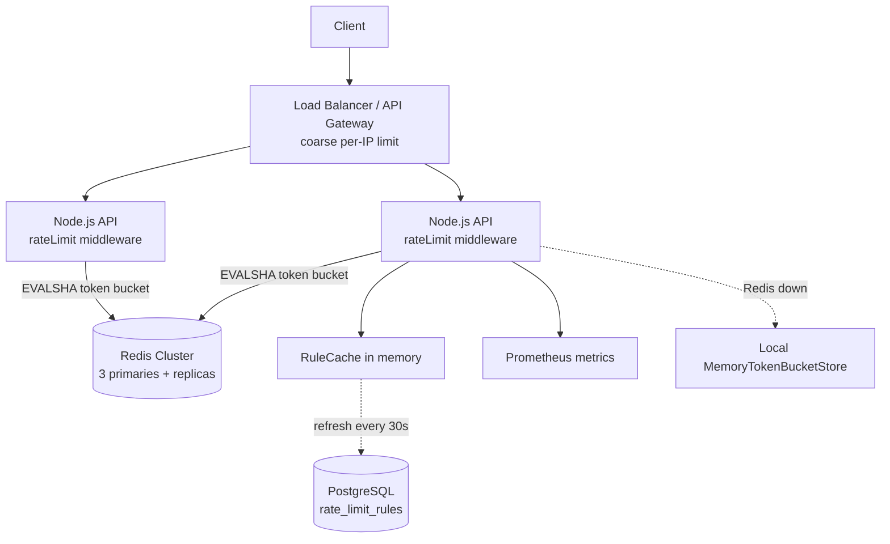

# Rate Limiter -- HLD + LLD (Part 1: Basics -> Requirements -> Estimation -> HLD)

> Is file mein prompt ke **Parts 1-6** hain: problem basics, requirements, clarifying questions, capacity estimation, HLD, aur har component ka WHY.
> Next file: request flow, API/headers design, rules database, LLD, Node.js code line-by-line.
>
> **Pichhle system se connection:** URL Shortener mein humne `createUrlLimiter` middleware lagaya tha, aur uske Part 4 mein ek simple Redis **fixed window** limiter (`INCR` + `EXPIRE`) dekha tha. Wahan hi bola tha: "strict chahiye toh token bucket -- ye Rate Limiter design mein detail mein karenge." Ab wahi karenge -- production rate limiter andar se kaise kaam karta hai.

---

## PART 1 -- Problem ko bilkul basic se samjho

### Ek kahani se shuru karte hain

Hum ek SaaS company hain. Hamari public REST API hai (Stripe / GitHub jaisi) -- customers **API key** se call karte hain. Saath mein ek web/mobile app hai (logged-in users) aur kuch anonymous endpoints (signup, login, public search).

Friday raat 8 baje. Ek customer "ShopKart" ne naya script deploy kiya. Script mein bug hai: jab bhi hamari API `500` deti hai, script **turant retry** karta hai -- na wait, na backoff. Uske 20 workers hain.

```
8:00:00  ShopKart script: GET /api/v1/orders/search   -> 500 (DB thoda slow tha)
8:00:00  script turant retry, retry, retry ...        -> 5,000 req/sec sirf ek customer se
8:00:30  DB CPU 100%, connection pool full
8:01:00  BAAKI saare customers ko bhi timeouts        -> poori API "down"
8:01:30  jitna slow hota hai, utne zyada 500, utne zyada retries  (vicious loop)
```

Hamara average traffic ~23K req/sec hai. Ek hi buggy client ne usme 5,000 req/sec aur jod diye -- aur woh bhi **mehenge search endpoint** par. Ek customer ki galti ki saza **sab customers** ko mili.

Doosri kahani: koi attacker `POST /auth/login` par ek hi email ke liye 1 lakh passwords try kar raha hai (**brute force**). Har attempt bcrypt chalata hai (CPU heavy) aur agar password weak hai toh account hack.

Dono kahaniyon mein sawaal ek hi hai:

> **"Ek client kitni requests bhej sakta hai, is par koi limit kyun nahi thi?"**

Yahi kaam **Rate Limiter** ka hai.

### Ye system actually karta kya hai?

**Rate limiter ka simple matlab:** har client ke liye ek limit set karo -- "itne time mein itni requests" -- aur limit cross ho toh request ko **business logic tak pahunchne se pehle hi** mana kar do.

Har incoming request par rate limiter sirf **ek sawaal** ka jawab deta hai:

```
"Is client ko abhi ye request karne do?"   -> YES (allow) ya NO (reject with 429)
```

| Rate limiter kya karta hai | Kya NAHI karta |
|---|---|
| Client ko identify karta hai (API key / user / IP) | Business logic nahi chalata |
| Us client ka counter check + update karta hai | Request ko queue mein daal ke baad mein process nahi karta |
| Allow ya reject decide karta hai (~1-2 ms mein) | Permanent data store nahi karta (counters temporary hain) |
| Client ko batata hai kitni requests bachi hain (headers) | Authentication/authorization ki jagah nahi leta |

### Real life mein iska example kya hai?

- **GitHub API** -- authenticated requests ke liye per hour limit (5,000/hour), aur har response mein `X-RateLimit-Remaining` header.
- **Stripe / payment APIs** -- zyada requests par `429 Too Many Requests`, client ko retry with backoff karna padta hai.
- **OTP resend** -- "Resend OTP" button 30 sec baad hi dobara chalta hai. Ye bhi rate limiting hai (SMS paise lagte hain).
- **Login lockout** -- 5 galat password ke baad "thodi der baad try karo".
- **AWS API Gateway throttling** -- har API ke liye rate + burst limit (ye token bucket hi hai).
- **Plan-based quotas** -- free plan 100 req/min, pro plan 1000 req/min. Yahan rate limiting **business feature** bhi hai (zyada limit chahiye toh upgrade karo).

### User kya request karega? System internally kya karega? Response kya milega?

Important baat: user **rate limiter ko directly call nahi karta**. User hamari normal API call karta hai, aur rate limiter beech mein **middleware** ki tarah baitha hai.

**Flow 1 -- Limit ke andar (allowed)**

```
Client:   GET /api/v1/orders
          Authorization: Bearer ak_live_9f2c        (free plan)
System:   1. Identity nikalo        -> apiKey = ak_live_9f2c, plan = free
          2. Rule nikalo            -> 'api-free' (100 req/min)
          3. Redis bucket check     -> key rl:api-free:ak_live_9f2c, token mila
          4. Request aage controller tak jaane do
Response: 200 OK
          RateLimit-Limit: 100
          RateLimit-Remaining: 37
          RateLimit-Reset: 38
          { ...orders... }
```

**Flow 2 -- Limit cross (rejected)**

```
Client:   POST /auth/login   { "email": "priya@example.com", "password": "..." }   (6th try in a minute)
System:   1. Identity nikalo        -> ip + username = 203.0.113.7 + priya@example.com
          2. Rule nikalo            -> 'login' (5 attempts/min)
          3. Redis bucket check     -> key rl:login:203.0.113.7:priya@example.com, token khatam
          4. Controller tak jaane hi nahi do (bcrypt bhi nahi chalega)
Response: 429 Too Many Requests
          RateLimit-Limit: 5
          RateLimit-Remaining: 0
          RateLimit-Reset: 60
          Retry-After: 12
          { "error": "RATE_LIMITED", "message": "Too many requests", "retryAfterSec": 12 }
```

> **429 ka simple matlab:** "Tumhari request galat nahi hai, bas tum bahut jaldi-jaldi bhej rahe ho. `Retry-After` seconds ke baad aana."
>
> **Headers ka simple matlab:** `RateLimit-Limit` = tumhari max limit, `RateLimit-Remaining` = abhi kitni bachi, `RateLimit-Reset` = kitne seconds mein poori limit wapas bhar jaayegi, `Retry-After` = kitne seconds baad retry karo. Achha client in headers ko padh ke khud slow ho jaata hai.

Numbers kahan se aaye? `login` rule mein 1 token 12 sec mein wapas aata hai (5 per 60 sec), isliye `Retry-After: 12`. Poora bucket (5 tokens) 60 sec mein bharta hai, isliye `RateLimit-Reset: 60`. Ye calculation token bucket algorithm se aati hai -- neeche preview hai, detail Part 3 file mein.

### Ek simple real-world example

Ab wapas ShopKart par. Ab rate limiter laga hai, ShopKart free plan par hai (`api-free` = 100 req/min):

- Buggy script 5,000 req/sec bhej raha hai = 3,00,000 req/min.
- Rate limiter sirf **100 req/min** aage jaane deta hai. Baaki **99.97%** ko turant 429 (Redis check ke baad, DB tak nahi pahunchi).
- DB ko ShopKart se sirf ~100 req/min mili. **Baaki customers ko pata bhi nahi chala** ki kuch hua.
- ShopKart ke dashboard par 429s dikhe, unhone bug fix kiya.

> Rate limiter ek **fuse** jaisa hai: ek room mein short circuit ho toh sirf us room ki bijli jaaye, poore building ki nahi.

### Interview mein 30 seconds mein kya bolun?

> "Rate limiter har client ki request rate ko control karta hai taaki ek buggy ya malicious client poori API ko down na kar sake, brute force ruke, aur plan-based quotas enforce hon. Main isko Node.js API mein middleware ki tarah lagaunga jo business logic se pehle chalta hai. Client ko API key, user id, ya IP se identify karunga, aur har rule ke liye ek token bucket Redis mein rakhunga, jo ek atomic Lua script se update hoga, taaki saare servers ek hi global counter dekhein. Limit cross hone par 429 aur Retry-After header dunga. Rules Postgres mein honge aur memory mein cached, taaki bina deploy ke change ho sakein. Redis down ho toh main fail open karunga local in-memory fallback ke saath, kyunki limiter ki wajah se poori API down nahi honi chahiye."

---

## PART 2 -- Requirements

### Functional Requirements (system kya karega)

**Must-have (core):**

1. **Client identity ke hisaab se limit** -- API key (`apiKey`), logged-in user (`userId`), ya anonymous traffic ke liye IP (`ip`).
2. **Plan aur route ke hisaab se alag rules.** Default rules:

| Rule id | Kiske liye | Limit | Token bucket (capacity / refillPerSec) |
|---|---|---|---|
| `api-free` | Free plan API key | 100 req/min per API key | 100 / 100/60 = ~1.67 |
| `api-pro` | Pro plan API key | 1000 req/min per API key | 1000 / ~16.67 |
| `anon-ip` | Anonymous traffic | 60 req/min per IP | 60 / 1 |
| `login` | `POST /auth/login` | 5 attempts/min per (IP + username) | 5 / 5/60 = ~0.083 |

3. **Reject par HTTP 429** with headers `RateLimit-Limit`, `RateLimit-Remaining`, `RateLimit-Reset` (seconds), `Retry-After` (seconds). Allowed requests par bhi `RateLimit-*` headers.
4. **Rules bina redeploy change ho sakein** -- Postgres mein stored, memory mein cached, har 30 sec refresh.
5. **Per-client overrides** -- enterprise customer ko custom limit (e.g. special deal).

> **Login rule stricter kyun?** Normal API call sasti hai, login par bcrypt chalta hai aur account security ka sawaal hai. Aur key **IP + username** hai: sirf IP rakhte toh office ke 500 log ek IP share karte hain (sab block). Sirf username rakhte toh attacker kisi ka bhi account lock kar deta. Dono milke sahi balance.

**Nice-to-have (interviewer se confirm karo):**

6. **Monthly quota** (e.g. 1M calls/month billing ke liye) -- ye rate limiting se alag problem hai (long-term counting, durable). Bolo "ye alag quota/billing service hai."
7. **Cost-based limits** -- mehenga endpoint (search, export) 1 request = 5 tokens. Hamara design `cost` parameter already support karta hai.
8. **Admin dashboard** -- rules dekhna/badalna.

> Interview tip: core 5 par design banao. Monthly quota ko clearly **out of scope** bolo -- isse dikhta hai ki tum "rate limit" aur "quota" ka farak samajhte ho.

### Non-Functional Requirements (system kaisa hona chahiye)

| Requirement | Simple meaning | Is system mein KYUN important hai? |
|---|---|---|
| **Low latency** | Limiter apna kaam bahut jaldi kare | Limiter **har ek request** par chalta hai. Ye 20 ms leta toh poori API 20 ms slow. Target: **< 2 ms p99** extra. Isliye DB nahi, in-memory Redis + ek round trip. |
| **Availability** | Limiter hamesha answer de | Sabse important twist: **limiter fail ho toh API down nahi honi chahiye.** Limiter protection ke liye hai; agar wahi single point of failure ban gaya toh ulta nuksaan. Isliye Redis down -> local fallback, fail open. |
| **Accuracy** | Limit kitni exact follow ho | **"Accurate enough", exact nahi.** 100 ki jagah 102 allow ho gayi toh koi nuksaan nahi. Exact accuracy ke liye bahut memory ya locking chahiye -- worth nahi. (Payment system mein ye trade-off nahi chalega, yahan chalta hai.) |
| **Scalability** | Traffic badhe toh limiter bhi badhe | Limiter ka load = poori API ka load. Peak ~100K req/sec = ~100K Redis checks/sec. |
| **Distributed / Consistency** | Limit **global** ho, per server nahi | N Node.js instances hain. Agar har server apna counter rakhe toh client ko **N x limit** mil jaati hai. Isliye counter shared Redis mein. |
| **Durability** | Data lost na ho | **Counters ke liye zaruri nahi!** Redis restart hua toh buckets reset -- clients ko 1 minute extra requests mil gayi, chalega. Lekin **rules** durable hone chahiye (Postgres). |
| **Security** | Misuse aur attack se bachao | Brute force, scraping, credential stuffing rokna iska main kaam hai. Aur limiter khud bypass na ho: client-side limit par bharosa nahi, `X-Forwarded-For` sirf trusted proxy se lo. |

> Interview line: "Is system ki sabse important NFRs hain **very low latency** kyunki ye har request ke path par hai, aur **high availability** -- limiter fail ho toh bhi API chalni chahiye. Accuracy approximate chalegi, aur counters ki durability zaruri nahi, sirf rules ki."

---

## PART 3 -- Clarifying Questions

Architecture banane se pehle interviewer se ye poochho. Har answer design badalta hai.

| # | Question | Ye KYUN pooch raha hoon? | Answer design ko kaise badlega |
|---|---|---|---|
| 1 | Client-side ya server-side limiter? | Client-side limiter (SDK mein) pe bharosa nahi kar sakte -- attacker SDK use hi nahi karega | Hum **server-side** banayenge. Client-side sirf "achhe clients" ke liye bonus |
| 2 | Client ko kaise identify karein -- API key, user, IP? | Identity = bucket key. Galat identity = galat log block | API key -> per key. Logged-in -> `userId`. Anonymous -> IP (NAT ki problem yaad rakho) |
| 3 | Limits per plan / per route alag hain? | Ek global limit ya rules engine chahiye | Alag hain -> rules table + route pattern matching (`api-free`, `login`, ...) |
| 4 | Kitna traffic hai? Peak RPS? | Har request = 1 Redis check. Ye number Redis sizing decide karta hai | ~1K RPS -> ek Redis. ~100K RPS -> **Redis Cluster** |
| 5 | Kitne servers / regions? | Distributed limit chahiye ya ek server kaafi | 1 server -> in-memory bhi chal jaata. N servers -> shared store must |
| 6 | Limit kitni accurate chahiye? | Exact accuracy mehengi hai | "Approx OK" -> token bucket (2 fields). "Exact" -> sliding log (bahut memory) |
| 7 | Burst allow karna hai? | Real clients bursty hote hain (page load par 10 calls ek saath) | Burst OK -> **token bucket**. Smooth output chahiye -> leaky bucket |
| 8 | Limit cross hone par kya karein -- reject, ya queue mein delay? | Queue karna = memory + latency, aur client ka timeout | Default **reject 429 + Retry-After**. Queue/delay sirf internal jobs ke liye |
| 9 | Limiter fail ho toh -- fail open ya fail closed? | Availability vs strictness ka decision | Normal API -> **fail open** (with local fallback). Login jaisa sensitive -> `failMode: closed` jab koi decision possible hi na ho |
| 10 | Rules bina deploy change ho sakein? | Config file = har change par deploy | Haan -> rules DB mein + in-memory cache refresh |
| 11 | Client ko remaining limit batani hai? | Achhe clients khud slow ho jaate hain | Haan -> `RateLimit-*` + `Retry-After` headers |
| 12 | Monthly quota / billing bhi isi mein? | Alag problem hai (durable, long window) | Out of scope, alag quota service |

### Rate limit vs quota -- interview mein ye farak bolo

- **Rate limit** -- short window (per second / per minute). Goal: **system ko bachana**. Counter kho gaya toh chalta hai.
- **Quota** -- long window (per month). Goal: **billing / business**. Counter khona = paise ka hisaab galat. Durable DB chahiye.

### Agar interviewer bole: "Assume 100 million users." -- kya badlega?

100M users ka matlab: roz ~10M active identities (API keys + users + IPs) aur ~2B API requests/day -- yahi hamare estimation ke numbers hain (next part). Ab ye badlega:

| Area | Chhota scale (1 server, ~100 RPS) | 100M users (~100K RPS peak) |
|---|---|---|
| Limiter kahan | Ek server ki memory (`Map`) | Middleware har instance mein + **shared Redis** |
| Counter store | In-process memory | **Redis Cluster, 3 primaries + replicas** (throughput ke liye) |
| Algorithm | Fixed window `INCR` bhi chal jaata | **Token bucket Lua script** (atomic, burst-friendly, O(1) memory) |
| Rules | Code mein hardcoded | Postgres + in-memory `RuleCache` (30s refresh) + overrides |
| Edge | Kuch nahi | API Gateway / LB par **coarse per-IP flood protection** |
| Failure | Server gaya toh sab gaya | Redis down -> local fallback, metrics + alerts |
| Observability | Logs | Prometheus metrics: allowed/rejected per rule, latency histogram |

> Interview line: "100M users par main limiter ko middleware + shared Redis Cluster par rakhunga, kyunki har request ek read+write hai aur throughput hi bottleneck hai. Edge par coarse IP limit lagaunga, aur Redis failure par local fallback ke saath fail open karunga."

---

## PART 4 -- Capacity Estimation

Goal wahi hai jo URL shortener mein tha: **exact number nahi, order of magnitude**. Lekin is baar ek bada twist aayega -- dhyan se dekhna.

**Assume (interviewer se confirm karo):**

- **10M active client identities/day** (API keys + users + IPs)
- **2B API requests/day**
- Peak = **4x average** (API traffic bursty hota hai -- batch jobs, cron, business hours)
- 1 din = 86,400 sec

### Step 1 -- Requests per day -> Average RPS

```
Average RPS = 2,000,000,000 / 86,400 = ~23,148  = ~23K req/sec
```

**Kahan useful hai?** Har API request par limiter chalta hai. Toh limiter ka traffic = **poori API ka traffic**. Rate limiter ka koi "kam traffic wala" path hota hi nahi.

### Step 2 -- Peak RPS

```
Peak RPS = 23,148 x 4 = ~92,600  -> round off: ~100K req/sec peak
```

**Kahan useful hai?** Hum design **peak ke liye** karte hain. Aur peak par hi limiter sabse zyada zaruri hai -- attack ya buggy client ke time hi traffic spike hota hai. Agar limiter peak par hi gir gaya toh uska koi fayda nahi.

### Step 3 -- Redis operations per second (yahi asli number hai)

```
1 request = 1 rate-limit check = 1 Redis round trip (EVALSHA of Lua script)
Peak Redis ops = ~100K Lua script calls/sec
```

**Ab twist:** URL shortener **read-heavy** tha (100:1), isliye humne Redis cache lagaya aur DB bach gaya. Rate limiter mein:

```
Har check = READ (tokens kitne hain?) + WRITE (ek token kam karo, time update karo)
Read : Write = 1 : 1
```

> **Key insight:** Rate limiter **read-heavy nahi hai**. Har check counter ko **update** karta hai. Isliye "iske aage ek cache laga do" wala trick yahan kaam nahi karta -- cache mein purana count padha toh limit galat. Counter store ko khud hi har request handle karni hai.

**Kahan useful hai?** Ye batata hai ki counter store **in-memory aur atomic** hona chahiye (Redis), aur Postgres jaise disk DB mein counters rakhna impossible hai (100K writes/sec + row locks).

### Step 4 -- Memory

Ek token bucket ko sirf **2 fields** chahiye: `tokens` aur `ts` (last refill time).

| Cheez | Approx size |
|---|---|
| Key `rl:api-free:ak_live_9f2c` | ~30-50 bytes |
| Hash with 2 fields (`tokens`, `ts`) | ~30 bytes |
| Redis per-key overhead + TTL | ~70 bytes |
| **Total (round off)** | **~150 bytes per bucket** |

```
Memory = 10M identities x 150 bytes = 1,500,000,000 bytes = ~1.5 GB
```

Aur TTL (`PEXPIRE`) idle keys ko khud delete kar deta hai -- jo client 1 minute se nahi aaya, uska bucket waise bhi full hota, toh key rakhne ka fayda nahi.

**Kahan useful hai?** 1.5 GB ek chhote Redis node mein bhi fit ho jaata hai. **Memory bottleneck nahi hai.** Ye bolna important hai kyunki log reflex mein bolte hain "data zyada hai isliye cluster" -- yahan cluster ka reason alag hai (Step 6).

### Step 5 -- Algorithm choice ka memory impact (sliding log kyun reject)

Ek "exact" algorithm hai **sliding window log** -- har request ka timestamp store karo (detail Part 3 file mein). Uska memory:

```
Sliding log = 10M keys x ~100 entries/key x ~60 bytes/entry = 60,000,000,000 bytes = ~60 GB
Token bucket = 10M keys x ~150 bytes                        = ~1.5 GB
```

**Kahan useful hai?** 40x memory farak. Isliye **sliding log reject**, token bucket choose. Ye number interview mein algorithm choice ko justify karta hai.

### Step 6 -- Redis throughput (asli bottleneck)

Ek Redis primary single-threaded command execution karta hai. Simple `GET/SET` ek node par ~1 lakh+ ops/sec kar leta hai, lekin hum Lua script chala rahe hain (HMGET + HSET + PEXPIRE + TIME ek saath), toh safe budget kam rakhte hain:

```
Safe budget  = ~50K Lua-script ops/sec per primary
Peak need    = ~100K ops/sec
100K / 50K   = 2 primaries (bilkul 100% budget par -- koi headroom nahi)
Choose       = 3 primaries -> 100K / 3 = ~33K ops/sec each (~66% of budget)
+ 1 replica per primary (failover ke liye)
```

**Kahan useful hai?** Yahi decide karta hai ki **Redis Cluster** chahiye -- memory ke liye nahi (1.5 GB), **throughput** ke liye. 2 primaries exactly budget par hote; ek hot spike ya ek node ka failover aur sab slow. Isliye 3.

> Compare with URL shortener: wahan ~10 GB cache ek Redis node mein fit tha aur reads ~35K/sec the, toh cluster nahi chahiye tha. Yahan memory kam hai (1.5 GB) phir bhi cluster chahiye -- kyunki har operation **write** hai aur 100K/sec hai.

### Step 7 -- Network bandwidth to Redis

```
~300 bytes per check (request + response) x 100K checks/sec = 30,000,000 bytes/sec = ~30 MB/s
```

**Kahan useful hai?** 30 MB/s ek normal network ke liye kuch nahi. **Bandwidth problem nahi hai.** Lekin **latency** matter karti hai: Redis same region / same AZ mein hona chahiye, taaki round trip ~0.2-0.5 ms rahe aur hamara < 2 ms p99 budget bache.

### Step 8 -- Rules storage

```
Rules = kuch sau rows (api-free, api-pro, anon-ip, login, + enterprise overrides) = KBs
```

**Kahan useful hai?** Itna chhota data har Node instance ki **memory mein poora** rakh sakte hain (`RuleCache`). Hot path par Postgres kabhi hit nahi hoga -- sirf har 30 sec background refresh.

### Step 9 -- Rejections (429s) aur logging

```
Assume ~1% requests rejected = 2B x 1% = ~20M 429s/day   (peak par ~1K/sec)
```

**Kahan useful hai?** 20M log lines/day sirf 429s ke -- har ek ko full log karna mehenga aur noisy. Isliye: **metrics mein count** (`rate_limit_checks_total{rule, result="rejected"}`) aur logs **sampled** (e.g. 1 in 100). Attack ke time rejections 10x ho sakte hain -- tab full logging khud system ko gira degi.

### Summary table

| Metric | Value | Design decision |
|---|---|---|
| Identities | 10M active/day | Bucket key per identity per rule |
| Requests | 2B/day, ~23K avg, **~100K peak RPS** | Limiter har request par -- latency < 2 ms |
| Redis ops | ~100K/sec, **read + write** | Cache trick kaam nahi karta; atomic Lua |
| Memory | ~1.5 GB (token bucket) | Memory bottleneck nahi; TTL for idle keys |
| Sliding log | ~60 GB | Rejected -> token bucket |
| Redis throughput | ~50K Lua ops/sec per primary | **Redis Cluster: 3 primaries + 1 replica each** |
| Network | ~30 MB/s | Fine; latency ke liye same AZ |
| Rules | KBs | Poora in-memory cache, DB hot path par nahi |
| Rejections | ~20M/day | Metrics mein count, logs sampled |

### Interview mein kaise bolun (short)

> "2 billion requests per day matlab ~23K RPS average, 4x peak par ~100K RPS. Har request ek rate-limit check hai, aur har check read plus write hai, toh ye read-heavy nahi hai -- cache laga ke bach nahi sakte. Token bucket ko sirf 2 fields chahiye, toh 10M identities ka memory sirf ~1.5 GB hai; sliding log hota toh ~60 GB. Memory bottleneck nahi hai, throughput hai: ek Redis primary par ~50K Lua ops/sec safe budget maan ke, 100K peak ke liye 3 primaries ka Redis Cluster with replicas lunga. Network ~30 MB/s hai, koi issue nahi. Rules sirf KBs hain, toh poore memory mein cached."

---

## PART 5 -- HLD (High-Level Design)

### Pehle: rate limiter **kahan** reh sakta hai?

Design se pehle ye decide karna padta hai. 4 options hain (deep trade-offs aage Part 5 file mein):

| Option | Kahan | Achha | Problem |
|---|---|---|---|
| **Client-side** | Customer ke SDK / app mein | Server tak request aati hi nahi | **Bharosa nahi kar sakte** -- attacker SDK use hi nahi karega |
| **API Gateway / edge** | Kong, Envoy, nginx `limit_req`, AWS API Gateway | App tak pahunchne se pehle flood rok do | Coarse hai -- plan, user, route ka business context nahi pata |
| **In-app middleware** | Node.js mein `rateLimit()` middleware + shared Redis | Poora context (API key ka plan, user, route), simple, ek hi codebase | Har service ko library chahiye; bahut saari languages ho toh repeat |
| **Separate rate-limit service** | Alag service (Envoy global rate limit service, gRPC) | Polyglot services, central control | Har request par ek extra network hop + ek aur service chalani |

**Hamara choice (v1-v2):** **middleware library + shared Redis**, aur edge gateway par sirf **coarse per-IP flood protection**. Separate service = Version 3, jab bahut saari services aur languages ho.

> Kyun? Hamare paas ek Node.js API hai. Middleware ko plan, user, route sab pata hai, aur Redis ek hop hai. Separate service ek extra hop + extra infra hai jiska abhi reason nahi.

### Limit **global** kyun honi chahiye? (sabse common galti)

Sabse simple idea: har Node.js server apni memory mein counter rakhe.

```ts
// GALAT for multiple servers -- har instance ka apna Map
const counters = new Map<string, { count: number; windowStart: number }>();

export function naiveLimit(key: string, limit: number): boolean {
  const now = Date.now();
  const entry = counters.get(key);
  if (!entry || now - entry.windowStart >= 60_000) {
    counters.set(key, { count: 1, windowStart: now });
    return true;
  }
  entry.count += 1;
  return entry.count <= limit;
}
```

**Code Explanation:**

- `const counters = new Map(...)` -- counter **is process ki memory** mein hai. Doosre server ko iska pata hi nahi.
- `if (!entry || now - entry.windowStart >= 60_000)` -- naya client ya 1 minute poora -> counter fresh start (ye fixed window hai).
- `entry.count += 1; return entry.count <= limit;` -- limit tak allow, uske baad block. **Ek server par** ye bilkul sahi kaam karta hai.

Problem tab aata hai jab load balancer requests ko 3 servers mein baantta hai:

```
ShopKart (limit 100/min)
        |
   Load Balancer (round robin)
   /        |        \
Server A  Server B  Server C
count 100 count 100 count 100     -> har server bolta hai "abhi limit ke andar"
                                  -> total allowed = 300/min = 3 x limit
```

> **N instances = N x limit.** Aur autoscaling mein N badalta rehta hai -- limit bhi badalti rahegi. Isliye counter **shared store (Redis)** mein hona chahiye, jise saare servers dekhein. URL shortener Part 4 mein bhi yahi bola tha: "12 instances = 12x limit".

### Algorithm preview: Token bucket (detail Part 3 file mein)

Har client ke paas ek **baalti (bucket)** hai jisme max `capacity` tokens aate hain. Har request 1 token kharch karti hai. Tokens ek fixed speed (`refillPerSec`) se wapas bharte hain. Token nahi -> 429.

`api-free`: capacity 100, refill ~1.67/sec -> client ek saath 100 ka burst bhej sakta hai, phir steady ~1.67/sec. Redis mein sirf 2 fields (`tokens`, `ts`), aur poora check ek **atomic Lua script** mein -- Redis ka apna `TIME` use karke, taaki alag Node servers ki clock ka farak (clock skew) problem na bane.

### Simple architecture diagram

```
                     Client (customer script / web app / mobile)
                                    |
                                    v
                         DNS  (api.example.com -> LB)
                                    |
                                    v
                  Load Balancer / API Gateway
                  (coarse per-IP flood protection at edge)
                                    |
              +---------------------+---------------------+
              v                     v                     v
        Node.js API           Node.js API           Node.js API     (stateless, N instances, Express 5)
        [rateLimit()]         [rateLimit()]         [rateLimit()]
              |
              |  1 EVALSHA per request (token bucket Lua)
              +-------------> Redis Cluster (3 primaries + 1 replica each)
              |                bucket state: rl:<ruleId>:<identifier>, TTL
              |
              +-------------> RuleCache (in-memory, har instance mein)
              |                     ^
              |                     |  refresh every 30s (hot path par nahi)
              |               PostgreSQL: rate_limit_rules, rate_limit_overrides
              |
              +-------------> Prometheus metrics (allowed / rejected / latency / fallback)
              |
              +- - - - - - -> MemoryTokenBucketStore (local fallback, sirf jab Redis down)
```



> Dotted lines = hot path par nahi. Postgres sirf background refresh mein, aur local fallback sirf Redis failure par.

### Middleware ka order -- kahan lagega?

```
Request -> cheap API-key identification -> rateLimit() -> auth-heavy work (JWT verify, DB lookups) -> validation -> controller -> DB
```

- **Pehle cheap identification** -- API key header padho aur (cached) plan pata karo. Bina identity ke pata hi nahi kaunsa bucket.
- **Phir `rateLimit()`** -- mehenge kaam se **pehle**. Rejected request par bcrypt, DB query, business logic kuch nahi chalna chahiye. Warna attacker ke 429 bhi hume mehenge padenge.
- Ye wahi idea hai jo URL shortener mein tha: `router.post('/api/v1/urls', createUrlLimiter, validateBody(...), controller.create)` -- sasta check pehle, mehenga kaam sabse last.

### Har component ka kaam (Hinglish mein)

**1. Client**
Customer ka script (API key ke saath), hamara web/mobile app (logged-in user), ya anonymous browser (signup, login, public search). Client ko sirf response headers se pata chalta hai ki limit kitni bachi hai.

**2. DNS**
`api.example.com` ko load balancer ke IP mein convert karta hai. Rate limiter ke liye iska koi special role nahi.

**3. Load Balancer / API Gateway (edge)**
Traffic ko N Node.js instances mein baantta hai aur health checks karta hai. Saath mein **coarse per-IP flood protection** -- jaise nginx `limit_req` ya gateway ka built-in limit. Ye ek bahut badi, dumb limit hai (e.g. ek IP se bahut zyada req/sec) jo DDoS-type flood ko app tak aane se pehle rok deti hai. **Plan-based, user-based limits yahan nahi** -- gateway ko ye business context nahi pata.

**4. Node.js API instances + `rateLimit()` middleware**
Yahan asli rate limiting hoti hai. Middleware: identity banata hai (apiKey / userId / ip), `RuleCache` se matching rule nikalta hai, Redis mein token bucket check karta hai, `RateLimit-*` headers set karta hai, aur limit cross par 429 deta hai. Instances **stateless** hain -- counter kisi server ki memory mein nahi, Redis mein hai. Isliye LB kisi bhi server par bheje, limit same.

**5. Redis Cluster (bucket state)**
Har `(rule, identity)` ka ek hash: key `rl:api-free:ak_live_9f2c`, fields `tokens` aur `ts`. Ek **Lua script** check + update ek saath atomically karta hai -- beech mein koi doosra server ghus nahi sakta (race condition nahi). TTL idle keys hata deta hai. 3 primaries isliye ki 100K ops/sec ek node ke safe budget se zyada hai. Ye counters ka **source of truth** hai, lekin **ephemeral** -- kho gaye toh bas limits thodi der ke liye reset.

**6. RuleCache (in-memory)**
Har Node instance ki memory mein saare rules (kuch sau rows, KBs). Har request par rule lookup = memory se, ~microseconds. Har 30 sec background mein Postgres se refresh. DB down ho toh **last good copy** rakhta hai.

**7. PostgreSQL (rules + overrides)**
`rate_limit_rules` aur `rate_limit_overrides` tables. Rules chhote hain, rarely change hote hain, audit chahiye ("kisne enterprise ki limit badhai?") -- relational DB perfect. **Counters kabhi SQL mein nahi.**

**8. Prometheus metrics**
`rate_limit_checks_total{rule, result}`, `rate_limit_check_duration_seconds`, `rate_limiter_fallback_total`, `rate_limit_rule_cache_age_seconds`. Isse pata chalta hai: kaunsa customer throttle ho raha hai, limiter kitna time le raha hai, Redis fail toh nahi ho raha, rules purane toh nahi.

**9. Local fallback (`MemoryTokenBucketStore`)**
Same token bucket algorithm, lekin process memory mein. Sirf jab Redis error/timeout de. Capacity aur refill ko **instances ki count se divide** kar dete hain -- 10 instances aur `api-free` 100/min -> har instance par ~10/min. Total approx 100 hi rehta hai. Exact nahi, lekin **limit bhi rahi aur API bhi chali**.

---

## PART 6 -- Har Component ka WHY

> Rule: koi bhi component tabhi add karo jab uska reason bol sako. Rate limiter mein bahut saare "standard" components ki **zarurat hi nahi** -- aur ye bolna interviewer ko impress karta hai.

### Component: Load Balancer / API Gateway

- **Kya hai?** Traffic police jo requests ko N servers mein baantta hai (AWS ALB, nginx, Envoy, Kong). Gateway ho toh edge par basic limits bhi laga sakta hai.
- **Kyun use kar rahe hain?** ~100K peak RPS ek Node process nahi sambhalega, aur ek server = single point of failure. Edge par coarse IP limit se bada flood app tak aata hi nahi -- Node aur Redis dono bachte hain.
- **Agar hata dein toh?** Ek server par saara load. Aur bina edge limit ke, flood ka har packet Node tak aayega, har ek par Redis call hogi -- limiter khud overload ho sakta hai.
- **Kab zarurat nahi?** MVP jahan ek server kaafi hai. Edge limit bhi tab optional hai jab traffic chhota ho aur cloud provider ka basic DDoS protection ho.
- **Interview mein kaise explain karun?** "LB traffic ko stateless Node instances mein baantega. Edge par sirf coarse per-IP flood protection rakhunga; plan aur user-level limits app middleware mein, kyunki wahan business context hai."

### Component: `rateLimit()` middleware (in-app)

- **Kya hai?** Express middleware jo har request par business logic se pehle chalta hai aur allow/reject decide karta hai.
- **Kyun use kar rahe hain?** Isko poora context pata hai -- API key ka plan, user id, route, enterprise override. Aur ek hi codebase mein hai, alag service chalane ki zarurat nahi.
- **Agar hata dein toh?** Sirf gateway limits bachengi -- woh plan-based quotas aur `login` jaisa (IP + username) rule enforce nahi kar sakti. ShopKart wali kahani repeat.
- **Kab zarurat nahi?** Jab bahut saari services alag languages mein ho (Go, Java, Node) -- tab har language mein library likhne ki jagah **separate rate-limit service** (Envoy RLS jaisa) better. Ye Version 3 hai, abhi nahi.
- **Interview mein kaise explain karun?** "Main limiter ko middleware ki tarah lagaunga, cheap identification ke baad aur auth-heavy work se pehle, taaki rejected request par koi mehenga kaam na ho."

### Component: Redis Cluster (counter store)

- **Kya hai?** In-memory key-value store. Har bucket ek hash (`tokens`, `ts`) with TTL. Cluster = data 3 primaries mein key ke hash se baanta hua.
- **Kyun use kar rahe hain?** (1) Counter **global** hona chahiye -- saare instances ek hi jagah dekhein. (2) Har check read + write hai, 100K/sec, < 2 ms -- sirf memory store itna fast hai. (3) **Lua script atomic** hai -- check aur update ke beech koi doosri request nahi ghusti. (4) TTL se idle keys apne aap saaf.
- **Agar Redis hata dein toh?** Har server apna counter -> N x limit. Ya Postgres mein counters -> 100K writes/sec, row locks, latency 5-20 ms -- limiter hi API ko slow kar dega.
- **Kab zarurat nahi?** Sirf **ek server** hai toh in-memory token bucket kaafi hai. Aur Redis Cluster ki zarurat nahi jab traffic ek primary ke budget (~50K Lua ops/sec) se kaafi neeche ho -- tab ek primary + replica.
- **Important:** Redis mein counters **ephemeral** hain. Persistence (AOF) strictly zaruri nahi -- restart par buckets full ho jaate hain, jo acceptable hai.
- **Interview mein kaise explain karun?** "Counters Redis mein rakhunga kyunki har check atomic read-modify-write hai aur global hona chahiye. Memory sirf ~1.5 GB hai, lekin 100K ops/sec ke liye 3-primary cluster lunga. Ek key ek hi slot mein hai, toh single-key Lua script cluster mein bina hash tags ke chalega."

> **Hash tags ka simple matlab:** Redis Cluster mein agar ek script **multiple keys** chhuye toh saari keys same node par honi chahiye -- `{...}` hash tag se force karte hain. Hamari script **ek hi key** chhuti hai, toh zarurat nahi.

### Component: PostgreSQL (sirf rules ke liye)

- **Kya hai?** Relational DB jahan `rate_limit_rules` aur `rate_limit_overrides` rakhe hain.
- **Kyun use kar rahe hain?** Rules chhote hain, rarely badalte hain, lekin **durable + audited** hone chahiye. Admin API se rule change -> DB update -> 30 sec mein saare instances par live. **Bina redeploy.**
- **Agar hata dein toh?** Rules code/config file mein -> har limit change = deploy. Enterprise customer ko 5 min mein custom limit dena mushkil.
- **Kab zarurat nahi?** Agar rules 3-4 fixed hain aur kabhi nahi badalte, toh config file (env / YAML) kaafi hai. Ya already koi config service (Consul, etcd) ho toh wahan rakh sakte ho.
- **Interview mein kaise explain karun?** "Rules Postgres mein, kyunki woh durable aur audited hone chahiye. Counters kabhi SQL mein nahi -- woh Redis mein. Postgres hot path par kabhi nahi aata."

### Component: RuleCache (in-memory)

- **Kya hai?** Har Node instance ki memory mein saare rules ki copy, har 30 sec refresh.
- **Kyun use kar rahe hain?** Har request par rule chahiye. Agar har request par Postgres query karein toh 100K queries/sec -- limiter ka < 2 ms budget khatam. Rules KBs hain, toh poora memory mein.
- **Agar hata dein toh?** Har request par DB call -> latency + DB overload. Aur DB down = limiter down.
- **Kab zarurat nahi?** Jab rules code mein hardcoded hain.
- **Trade-off:** Rule change 30 sec tak purana chal sakta hai. Rate limits ke liye ye bilkul theek hai. DB down hua toh last good copy chalti rahegi; `rate_limit_rule_cache_age_seconds` metric batayega ki copy kitni purani hai.
- **Interview mein kaise explain karun?** "Rules chhote aur read-mostly hain, toh har instance mein in-memory cache with 30 second refresh. Stale rule thodi der chalna acceptable hai."

### Component: Local fallback (`MemoryTokenBucketStore`)

- **Kya hai?** Same token bucket, process memory mein. Sirf Redis failure/timeout par use.
- **Kyun use kar rahe hain?** Availability NFR: limiter ki wajah se API down nahi honi chahiye. Lekin **bina limit ke** chhod dena bhi risky (attack ke time Redis gira toh?). Isliye beech ka raasta: capacity/refill ko instances ki count se divide karke local limit.
- **Agar hata dein toh?** Do bure options: fail open bina limit (brute force khula) ya fail closed (poori API 503). Dono nahi chahiye.
- **Kab zarurat nahi?** Chhote system mein jahan Redis down = sab down anyway, ya simple "fail open" acceptable ho.
- **`failMode` kab matter karta hai?** Sirf jab **koi bhi decision possible na ho** (e.g. startup par rules load hi nahi hue, ya limiter mein unexpected bug). Tab `open` rules request allow karte hain, `closed` rules (jaise `login`) 503 dete hain. Sirf Redis down hai toh `login` bhi local fallback use karta hai -- limit phir bhi lagti hai.
- **Interview mein kaise explain karun?** "Normal API traffic ke liye fail open, lekin local in-memory fallback ke saath jo approx global limit rakhta hai. Availability over strictness."

### Component: Prometheus metrics

- **Kya hai?** Counters aur histograms jo Grafana par dikhte hain aur alerts trigger karte hain.
- **Kyun use kar rahe hain?** ~20M 429s/day logs mein nahi dhoond sakte. Metrics se: kaunsa rule kitna reject kar raha hai, limiter ka p99 latency, fallback kitni baar hua.
- **Agar hata dein toh?** Andhere mein kaam -- galat rule ne half customers ko block kar diya, pata tab chalega jab support tickets aayenge.
- **Kab zarurat nahi?** Side project. Production mein hamesha.
- **Interview mein kaise explain karun?** "429s ko metrics mein count karunga, logs sampled rakhunga. Alert lagaunga jab rejection rate achanak badhe ya fallback counter badhne lage."

### Components jinki zarurat NAHI hai

| Component | Kyun nahi? |
|---|---|
| **Queue (SQS / RabbitMQ)** | Rate limiter ko **synchronously** jawab dena hai -- "abhi allow ya nahi". Queue mein daal ke baad mein decide karne ka matlab hi nahi. **"Yahan iski zarurat nahi hai."** (Throttled requests ko queue karke delay karna bhi nahi -- hum 429 dete hain.) |
| **Kafka** | Koi event stream / replay requirement nahi. 429 events sirf metrics mein count. Agar future mein "abuse analytics" chahiye toh sampled events bhej sakte hain -- abhi nahi. |
| **CDN** | CDN static/cacheable content ke liye hai. Rate limit decision har request ka alag aur dynamic hai -- cache nahi ho sakta. (CDN/WAF ka edge rate limiting coarse IP protection ke liye use ho sakta hai, lekin woh gateway wala hi role hai.) |
| **Cache in front of Redis** | Har check read + write hai. Cache mein purana count padha toh limit galat. URL shortener wala trick yahan kaam nahi karta. |
| **Elasticsearch** | Koi search nahi. Hum sirf exact key (`rl:<ruleId>:<id>`) se access karte hain. |
| **S3** | Koi files nahi. |
| **MongoDB / Cassandra** | Counters ke liye disk DB bahut slow; rules ke liye Postgres already perfect. Koi fayda nahi. |
| **Separate rate-limit service** | Abhi ek Node.js API hai. Alag service = extra network hop + extra infra. **Version 3** mein, jab bahut saari services/languages hon. |
| **Distributed lock (Redlock)** | Lua script already atomic hai. Lock lagana = extra round trips + latency. Zarurat nahi. |

### Final component checklist

| Component | MVP mein? | Scale par? | Reason |
|---|---|---|---|
| Load Balancer / Gateway | Optional | Yes (+ coarse IP limit) | Multiple instances + edge flood protection |
| `rateLimit()` middleware | Yes | Yes | Business context (plan, user, route) |
| Redis | Single node | **Cluster, 3 primaries + replicas** | Global, atomic, fast counters; throughput bottleneck |
| PostgreSQL (rules) | Config file bhi chalega | Yes | Rules durable + audited, no redeploy |
| RuleCache | Yes (agar DB rules) | Yes | DB hot path se bahar |
| Local fallback | Optional | Yes | Redis down par bhi approx limit |
| Prometheus metrics | Basic | Yes | 429s count, latency, fallback alerts |
| Queue / Kafka / CDN / ES / S3 | No | No | Synchronous decision, no search, no files |
| Separate limiter service | No | Only at very large / polyglot scale | Extra hop; Version 3 |

---

## Remember

> **Rate limiter = "har request par ek chhota sa, super-fast, atomic read+write sawaal: abhi allow karun ya nahi?"** Isliye counter shared Redis mein (global limit), algorithm token bucket (2 fields, burst-friendly), rules memory mein, aur agar limiter hi fail ho jaaye toh API ko mat girao -- local fallback ke saath fail open.

## Quick Self-Test (answers baad mein check karna)

1. URL shortener mein Redis cache se DB bach gaya tha. Rate limiter mein "ek cache aage laga do" kyun kaam nahi karta?
2. Memory sirf ~1.5 GB hai, phir bhi Redis Cluster kyun? Numbers ke saath batao.
3. 5 Node instances hain aur har instance apni memory mein limit rakhta hai (100/min). Client ko actually kitni limit milegi, aur autoscaling mein kya hoga?
4. `login` rule ki key sirf IP ya sirf username kyun nahi? Dono ke nuksaan batao.
5. Redis down ho gaya -- `api-free` aur `login` requests ke saath exactly kya hoga? `failMode` kab matter karta hai?

---

**Next (Part 2):** Request Flow (step by step), API + headers design (429, `RateLimit-*`, `Retry-After`, admin APIs), rules database design, LLD folder structure, Node.js/TypeScript code with line-by-line explanation. "next" bolo.
