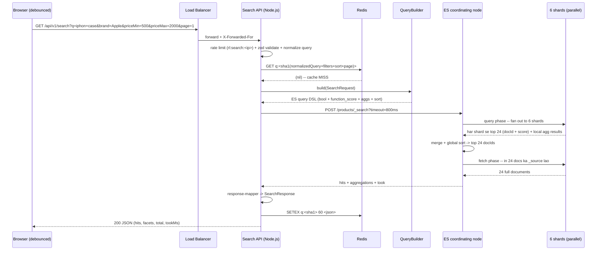

# Search System -- HLD + LLD (Part 2: Request Flow -> API -> Index + DB Design -> LLD -> Code)

> Is file mein prompt ke **Parts 7-12** hain: request flow (search + autocomplete + indexing), API design, Postgres schema + Elasticsearch mapping, LLD folder structure, aur Node.js/TypeScript code ka line-by-line explanation.
> Part 1 ka recap teen line mein: **(1)** `SELECT * FROM products WHERE name ILIKE '%iphone case%'` 50M products par 8-12 second leta hai kyunki leading wildcard koi B-tree index use nahi kar sakta, aur `LIKE` boolean hai -- usme "kaun zyada relevant hai" ka concept hi nahi. **(2)** Isliye do alag cheezein chahiye: **inverted index** (speed) aur **scoring/ranking** (relevance) -- yani Elasticsearch, index `products_v3` behind alias `products`, **6 primary shards x 1 replica** (~130 GB primary data, 22 GB per shard), 6 data nodes + 3 master nodes. **(3)** Traffic: search 20M/day (~231 QPS avg, ~1,000 QPS peak), autocomplete 80M/day (~925 QPS avg, ~4,000 QPS peak -- search se 4x zyada, isliye alag `suggestions_v2` index + Redis prefix cache), updates 5M/day (58/sec avg, ~500/sec flash sale), Postgres source of truth + outbox -> Kafka -> indexer workers.
> **Part 3 mein** aayega: inverted index zero se (postings list by hand), TF-IDF se BM25 tak actual calculation, typo tolerance (Levenshtein), synonyms, autocomplete ke teen design options, indexing concurrency aur version conflicts, caching layers.

---

## PART 7 -- Request Flow (dono paths, step by step)

Search system mein **teen alag flows** hain aur interview mein teeno alag-alag bolne chahiye. Log aksar sirf "search query" wala bolte hain aur indexing bhool jaate hain -- wahi to asli distributed-systems wala hissa hai.

| Flow | Kaun trigger karta hai | Traffic | Target latency | Path |
|---|---|---|---|---|
| **A. Search query** | User Enter dabata hai / filter click karta hai | ~1,000 QPS peak | p95 < 200 ms | API -> Redis -> ES `products` |
| **B. Autocomplete** | Har keystroke (debounced) | ~4,000 QPS peak | p99 < 100 ms | API -> Redis -> ES `suggestions_v2` |
| **C. Indexing** | Seller product update karta hai | ~58/sec avg, ~500/sec peak | end-to-end <= 30 s | Postgres -> outbox -> Kafka -> worker -> ES |

Flow A aur B **read path** hain (user wait kar raha hai). Flow C **write path** hai (koi user wait nahi kar raha, isliye async chal sakta hai).

---

### Flow A -- Search query (user ne "iphon case" type karke Enter dabaya)

Scenario: Priya Mumbai se mobile par `iphon case` search karti hai, phir left sidebar se **Brand = Apple** aur **price 500-2000** filter lagati hai.



**Step by step (Hinglish mein):**

**1. Browser debounce (150 ms).** User type kar raha hai to har keystroke par search nahi bhejte. 150 ms tak koi key na dabe tabhi request jaati hai. Ye **client-side ka sabse sasta optimization** hai -- 12 characters type karne par 12 requests ki jagah ~4 requests jaati hain. Debounce hata do to autocomplete traffic 3x ho jaayega aur cluster ka size badhana padega. Yani ek `setTimeout` ne hardware bacha diya.

**2. Load Balancer.** TLS yahin terminate hota hai. LB request ko kisi bhi healthy Node instance par bhejta hai -- **Search API stateless hai** (koi session, koi local state nahi), isliye koi bhi instance koi bhi request handle kar sakta hai. `X-Forwarded-For` mein asli client IP aata hai (rate limiter ko chahiye).

**3. Rate limit.** Rate Limiter lesson wala token bucket, key `rl:search:<ip>`. Kyun? Price scrapers competitor ki pricing nikalne ke liye search API ko hammer karte hain. Ye traffic ES cluster ka RAM aur CPU khaata hai aur real users ki latency badhata hai. **Search par sakht limit, autocomplete par dheeli limit** (autocomplete waise bhi 4x zyada hai aur mostly cache se serve hota hai).

**4. Validate + normalize query.** Do alag kaam hain, dono zaroori:

```
raw:        "  IPHON   Case!!  "
trim:       "IPHON   Case!!"
lowercase:  "iphon   case!!"
collapse:   "iphon case!!"     (multiple spaces -> ek space)
strip:      "iphon case"       (control chars, ES reserved chars)
cap:        pehle 100 chars
```

Normalization ka asli fayda **cache hit ratio** hai. `"iPhone Case"`, `"iphone case"`, `"iphone  case"` -- teeno alag strings hain lekin same result dena chahiye. Normalize na karo to teeno alag cache entries banayenge aur teeno ES tak jaayengi. Normalize karne se ek entry, teen hits.

**5. Cache key banao: `q:<sha1(normalizedQuery + filters + sort + page)>`.**

Key mein sirf query nahi, **poora request shape** jaata hai. Kyun? `q=iphone case` ka result `brand=Apple` filter ke saath bilkul alag hai. Sirf query ko key banaya to Priya ko filter lagane par bhi bina-filter wale results milenge -- **silent wrong data**, jo sabse buri bug hoti hai.

SHA-1 kyun? Kyunki raw string bahut lambi ho sakti hai (100 char query + 10 filters + sort + page). SHA-1 hamesha 40 hex characters deta hai -- chhoti, fixed-length Redis key. Yahan SHA-1 **security ke liye nahi** hai (collision attacks se koi matlab nahi), sirf **fingerprinting** ke liye -- isliye SHA-256 ki zarurat nahi, SHA-1 tez hai.

**6. Cache miss.** Part 1 ka number yaad karo: **top 1,000 queries = traffic ka ~30%** (Zipf distribution -- "iphone", "shoes", "laptop" type head queries). Yani ~30% requests yahin se lautt jaati hain, ~5 ms mein. Baaki 70% aage jaati hain.

**7. QueryBuilder -> ES DSL.** Ek **pure function**: `SearchRequest` andar, JSON object bahar. Koi network call nahi, koi I/O nahi. (Iska poora code PART 11 mein.)

**8. ES coordinating node.** Request kisi bhi ES node par jaati hai; wo node us request ke liye **coordinating node** ban jaata hai. Uska kaam: request ko saare relevant shards par bhejna, results merge karna, wapas dena. Usme khud data hone ki zarurat nahi.

**9. Query phase -- 6 shards parallel.** Ye sabse important internal detail hai:

```
Coordinating node
   |
   +---> shard 0 --> local search --> top 24 (docId, score) + local aggs
   +---> shard 1 --> local search --> top 24 (docId, score) + local aggs
   +---> shard 2 --> ...
   +---> shard 3 --> ...
   +---> shard 4 --> ...
   +---> shard 5 --> ...
   |
   (sab wapas aane ka WAIT)
   |
   merge 6 x 24 = 144 entries -> global sort -> top 24 docIds
```

Har shard apne **local inverted index** par search chalata hai, apne top 24 nikalta hai, aur sirf `(docId, score)` bhejta hai -- poora document nahi. 6 shards x 24 = 144 chhoti entries network par aati hain, 144 x 2 KB documents nahi. Ye **bandwidth aur memory dono bachata hai.**

**10. Fetch phase.** Merge ke baad coordinating node ke paas final 24 docIds hain. Ab wo **sirf un shards** se, **sirf un 24 docs** ka `_source` maangta hai. Do-phase design ka poora point yahi hai: mehenga kaam (document body padhna) sirf 24 docs par hota hai, poore match set par nahi.

**11. Slowest shard hi tumhara p99 hai.** Ye interview ka killer point hai:

```
shard 0: 45 ms
shard 1: 50 ms
shard 2: 48 ms
shard 3: 52 ms
shard 4: 47 ms
shard 5: 190 ms   <-- GC pause / cold page cache / hot neighbour
-----------------------------------------------
query phase total = 190 ms  (NOT the average of 72 ms)
```

Coordinating node **saare** shards ka intezaar karta hai. Yani search latency = **max(shards)**, average nahi. Iske teen seedhe nateeje hain:

- **Zyada shards = zyada chance ki koi ek slow ho.** 60 shards banaoge to har request 60 lottery tickets kharidti hai ki koi ek GC pause mein ho. Isliye Part 1 mein 6 shards chune, 60 nahi.
- **Ek slow node poore cluster ki p99 kharab karta hai**, sirf apne queries ki nahi. Isliye node-level monitoring (`es_jvm_heap_used_percent`) zaroori hai.
- **`allow_partial_search_results: true`** -- ek shard fail/timeout ho to baaki 5 ke results de do. 5/6 results >> 0 results. Par response mein `_shards.failed` check karke metric badhao, warna silently kharab results serve karte rahoge.

**12. Aggregations (facets).** "Samsung (1,204)", "Apple (890)" -- ye `aggs` se aate hain. Har shard apne matched docs par local `terms` aggregation chalata hai, coordinating node unhe merge karta hai. **Cost:** +20-40 ms, kyunki aggregation poore match set par chalta hai (top 24 par nahi). 50,000 products match hue to aggregation 50,000 par chalega.

> Isiliye aggregation ke liye **doc values** chahiye (PART 9 mein detail) -- `keyword` fields par by default on hote hain. `text` field par aggregation karoge to ES `fielddata` maangega, jo heap kha jaata hai. Rule: **facet field hamesha `keyword`.**

**13. Response mapping.** ES ka raw response bahut bada aur ES-specific hota hai (`hits.hits[]._source`, `aggregations.brands.buckets[]`). Usse apne clean `SearchResponse` shape mein badalte hain. Kyun? Kal ES ki jagah kuch aur laaye (ya ES 9 mein response shape badla) to **sirf mapper badlega**, frontend nahi.

**14. Cache set (TTL 60 s).** `SETEX q:<sha1> 60 <json>`. 60 second kyun?

- Bahut chhota (5 s) -> cache hit ratio gir jaayega, fayda khatam.
- Bahut bada (10 min) -> price/stock change hone ke baad bhi purana result 10 minute dikhta rahega. User "In Stock" dekh ke click karega aur product page par "Out of Stock" milega -- **worst UX**.
- 60 s = acceptable staleness + ~30% hit ratio. Aur **sirf page 1** cache karte hain (page 2+ ki repeat rate bahut kam hai, cache memory waste).
- **Personalization v1 mein nahi** -- kyunki personalized result matlab har user ka alag result, matlab cache key mein userId, matlab hit ratio ~0%. Ye trade-off Part 1 mein settle ho chuka hai.

**15. JSON to browser.** `200 OK` + `SearchResponse`.

---

### Flow B -- Autocomplete (user "iph" tak type kar chuka hai)

Ye flow **alag**, **halka**, aur **Redis-heavy** hai. Same code path use karna sabse badi galti hoti.

```
Browser (150 ms debounce)
   |  GET /api/v1/suggest?q=iph&limit=10
   v
Load Balancer
   v
Suggest API (same Node.js process, alag route + alag rate limit)
   |
   +--> Redis GET sug:iph
   |        HIT (~70-80% of traffic)  --> return in ~3-5 ms   [DONE]
   |        MISS
   |          |
   |          v
   |     ES POST /suggestions/_search   (index suggestions_v2, chhota, RAM mein fit)
   |          match on title.ac (edge n-gram), size 10, sort by popularity
   |          |
   |          v
   |     Redis SETEX sug:iph 600 <json>   (TTL 10 min)
   |          |
   v          v
Browser  <-- { suggestions: [{ text, type }] }
```

**Search flow se kya-kya alag hai aur KYUN:**

| Cheez | Search | Autocomplete | Kyun alag |
|---|---|---|---|
| Index | `products_v3` (~130 GB) | `suggestions_v2` (chhota, ~1-2 GB) | Chhota index poora RAM/page cache mein fit hota hai -> disk I/O zero -> p99 < 100 ms possible |
| Cache TTL | 60 s | **600 s** | Suggestions ka data (popular queries) dheere badalta hai. Price/stock ki tarah volatile nahi. |
| Cache hit ratio | ~30% | **~70-80%** | Prefixes bahut zyada repeat hote hain -- "i", "ip", "iph" har iPhone search karne wala type karta hai |
| Query type | `multi_match` + fuzzy + `function_score` + aggs | simple `match` on `title.ac` | Autocomplete mein facets nahi chahiye, scoring simple hai (popularity) |
| Fuzziness | `AUTO` | **nahi** (v1 mein) | 4,000 QPS par fuzzy expansion bahut mehenga hai; aur user abhi type kar raha hai, next keystroke waise bhi theek kar dega |
| Traffic | ~1,000 QPS peak | **~4,000 QPS peak** | user 12 chars type karta hai, debounce ke baad ~4 requests per search |

> **Key insight (Part 1 se):** autocomplete traffic search se **4x zyada** hai. Agar dono ek hi `products_v3` index par chalein, to autocomplete main cluster ka 80% CPU kha jaayega aur asli search slow ho jaayegi. Isliye: **alag index + aggressive Redis cache.** Redis mein top ~10K popular prefixes cache hain, aur 4,000 QPS ka bada hissa ES tak pahunchta hi nahi.

**Edge n-gram ka one-line idea (poora Part 3 mein):** index time par hi `iphone` ko `ip, iph, ipho, iphon, iphone` mein tod ke store kar dete hain. Query time par `iph` ek **simple term lookup** ban jaata hai -- O(1) jaisa. Yani mehnat index time par shift kar di, jab koi user wait nahi kar raha.

---

### Flow C -- Indexing (seller ne price 1,999 se 1,499 kiya)

Ye **write path** hai. Yahan koi user wait nahi kar raha, isliye async + reliable hona zaroori hai (fast hone se zyada).

```
   Seller Panel
       |  PUT /api/v1/seller/products/:id  { price: 1499 }
       v
   Catalog Service (Node.js)
       |
       |  BEGIN;
       |    UPDATE products SET price_paise = 149900, version = version + 1, updated_at = now()
       |     WHERE id = $1;
       |    INSERT INTO product_outbox (product_id, op, version) VALUES ($1, 'upsert', $2);
       |  COMMIT;                    <-- DONO ek hi transaction mein. Atomic.
       v
   Postgres  products  +  product_outbox
       |
       |  (har 200 ms)
       v
   Outbox Poller  (SELECT ... WHERE published_at IS NULL ORDER BY id LIMIT 500 FOR UPDATE SKIP LOCKED)
       |
       |  produce, key = productId
       v
   Kafka topic `product-changes`  (12 partitions, key = productId)
       |                            [same product ki saari events ek hi partition -> ORDER preserved]
       v
   Indexer Workers  (consumer group `product-indexer`, 12 consumers max)
       |
       |  batch: 500 docs  OR  5 MB  OR  1 s  (jo pehle aa jaaye)
       |  Postgres se full product row lao (event mein sirf id + version hai)
       |  ES bulk index, version_type: 'external', version: product.version
       v
   Elasticsearch  products_v3
       |
       |  refresh_interval: 1s  -> in-memory buffer se naya segment banta hai
       v
   SEARCHABLE  (end to end: ~1-3 s typical, requirement <= 30 s)
```

**Step by step:**

1. **Seller update karta hai.** Catalog Service ek hi Postgres transaction mein **do** cheezein likhta hai: `products` row update + `product_outbox` mein ek row insert. Ye dono ya to dono commit honge ya dono rollback -- **atomic**. Yahi outbox pattern ka poora point hai.
2. **`version` bump hota hai.** Har update par `version = version + 1`. Ye number aage ES tak jaayega aur out-of-order messages se bachayega.
3. **Outbox poller** har ~200 ms `published_at IS NULL` wali rows uthata hai, Kafka par bhejta hai, phir `published_at = now()` set karta hai.
4. **Kafka `product-changes`, key = `productId`.** Key isliye zaroori hai ki **ek hi product ki saari events ek hi partition mein jaayein**. Kafka sirf partition ke andar order guarantee karta hai. Key na do to product P ka "price 1499" update partition 3 mein aur "price 1299" update partition 7 mein chala jaayega -- do alag consumers, do alag speed, aur ES mein galat final value aa sakti hai.
5. **Indexer worker** events ko batch karta hai (500 docs / 5 MB / 1 s) aur ES `_bulk` API par bhejta hai. Per-document request bhejna 500x zyada network overhead hai.
6. **ES refresh (`refresh_interval: 1s`).** ES mein document turant searchable nahi hota. Pehle in-memory buffer mein jaata hai; refresh par wo buffer ek naya **segment** banta hai aur tabhi search ko dikhta hai. 1 second = "near real-time".
7. **Total lag:** outbox poll (~200 ms) + Kafka (~10 ms) + batch wait (<= 1 s) + bulk index (~50-200 ms) + refresh (<= 1 s) = **~1-3 second typical.** Requirement 30 s hai, to comfortable margin hai.

**Metric jo is poore flow ko ek number mein batata hai:** `indexer_lag_seconds` = `now() - product.updatedAt` jab document ES mein successfully index ho. Ye 30 s cross kare to alert.

---

### Latency budget -- p95 < 200 ms kaise prove karein

Interview mein "p95 200 ms rakhenge" bolna kaafi nahi. **Budget todo aur dikhao ki har hissa kahan jaa raha hai.**

| # | Step | p50 | p95 | Kyun itna |
|---|---|---|---|---|
| 1 | Client -> LB -> API network (same region) | 2 ms | 5 ms | TLS pehle se established (keep-alive) |
| 2 | Rate limit (Redis token bucket) | 0.4 ms | 1 ms | Ek `EVALSHA`, same AZ |
| 3 | zod validate + normalize + sha1 | 0.5 ms | 2 ms | Pure CPU, koi I/O nahi |
| 4 | Redis `GET q:<sha1>` | 0.5 ms | 1 ms | In-memory |
| -- | **Agar CACHE HIT -> yahin return** | **~5 ms** | **~12 ms** | ~30% requests |
| 5 | QueryBuilder (pure function) | 0.2 ms | 0.5 ms | Sirf object banana |
| 6 | API -> ES network + JSON serialize | 1 ms | 3 ms | Keep-alive agent, same VPC |
| 7 | **ES query phase (6 shards parallel)** | 35 ms | **90 ms** | **max(shards)**, average nahi |
| 8 | **ES aggregations (3 facets)** | 15 ms | **35 ms** | Poore match set par chalti hain |
| 9 | ES fetch phase (24 docs ka `_source`) | 3 ms | 8 ms | Sirf 24 documents |
| 10 | ES -> API network + JSON parse | 3 ms | 8 ms | ~50-100 KB response |
| 11 | `response-mapper` | 1 ms | 3 ms | Array map, 24 items |
| 12 | Redis `SETEX` (fire and forget) | 0 ms | 0 ms | `await` nahi karte |
| 13 | JSON serialize -> client | 3 ms | 10 ms | Node ka `JSON.stringify` + gzip |
| | **TOTAL (cache miss)** | **~64 ms** | **~166 ms** | Budget **200 ms** -- ~34 ms headroom [OK] |

**Headroom kyun chhoda?** Kyunki peak traffic (4x) par ES queue karna shuru karti hai aur p95 badhta hai. 166 ms par chal rahe ho to 20% degradation bhi 200 ms ke andar hai. Agar design 198 ms par baithta, to har chhota spike SLO tod deta.

**Budget kahan sabse pehle tootega?**

| Kya badla | Asar | Fix |
|---|---|---|
| `size=100` (24 ki jagah) | Fetch phase 8 ms -> 30 ms, network 8 ms -> 40 ms | `size` max 100 par cap, default 24 |
| `page=500` | Har shard se 500+24 docs coordinate node par = memory blow-up | `page` max 50, uske aage `search_after` |
| Facets 3 se 10 kar diye | Aggregation 35 ms -> 120 ms | Sirf visible facets maango; baaki lazy load |
| `track_total_hits: true` | Poora match set count karna padega (+50-150 ms) | `10000` par cap |
| ES doosre region mein | +60-150 ms per request | ES hamesha same region, ideally same AZ |
| Ek node par heap 85%+ | Lambe GC pauses -> wahi shard p99 kharab karega | Heap 31 GB cap, alert at 75% |

> **Interview line:** "Search ka latency budget basically **ek ES round trip** hai, aur ES ka round trip **sabse slow shard** se decide hota hai -- average se nahi. Isliye maine shard count 6 rakha (60 nahi), facets 3 rakhe, `track_total_hits` 10,000 par cap kiya, aur head queries ke liye 60-second Redis cache lagaya jo ~30% traffic ES tak pahunchne hi nahi deta."

---

## PART 8 -- API Design

Search system ki API chhoti hai -- do public endpoints, do admin, do health. Lekin **har query param ke peeche ek design decision hai**, aur interviewer wahi poochta hai.

```
GET  /api/v1/search     -- main search (public)
GET  /api/v1/suggest    -- autocomplete (public)
POST /api/v1/admin/reindex    -- reindex job start (admin only)
POST /api/v1/admin/synonyms   -- synonyms add/update + reload analyzers (admin only)
GET  /health                  -- process zinda hai?
GET  /ready                   -- ES cluster status theek hai? (traffic lene layak hoon?)
```

### 8.1 `GET /api/v1/search`

**Full request:**

```
GET /api/v1/search?q=iphone+case&brand=Apple&brand=Spigen&categoryPath=electronics%2Fmobiles%2Faccessories
   &priceMin=500&priceMax=2000&minRating=4&inStock=true&sort=relevance&page=1&size=24
Accept: application/json
```

**Query params (poori table):**

| Param | Type | Default | Max / Allowed | Kyun |
|---|---|---|---|---|
| `q` | string | `""` | **100 chars** | Search text. Khaali ho to category browse mode (`match_all` + filters) |
| `brand` | string, repeatable | -- | 10 values | `?brand=Apple&brand=Spigen` -> OR filter |
| `categoryPath` | string, repeatable | -- | 5 values | `electronics/mobiles/accessories` |
| `priceMin` | number (rupees) | -- | >= 0 | `range` filter ka `gte` |
| `priceMax` | number (rupees) | -- | <= 10,000,000 | `range` filter ka `lte` |
| `minRating` | number | -- | 0-5 | `range` filter `rating >= X` |
| `inStock` | boolean | -- | `true`/`false` | `true` hone par hi filter lagta hai |
| `sort` | enum | `relevance` | `relevance`, `price_asc`, `price_desc`, `newest`, `rating` | Whitelist -- user ka string field name kabhi nahi banta |
| `page` | int | `1` | **50** | Uske aage `searchAfter` mandatory |
| `size` | int | `24` | **100** | Grid 4x6 = 24 |
| `searchAfter` | string (JSON array) | -- | -- | Deep pagination cursor `[sortValue, productId]` |

**Response (200) -- spec ka `SearchResponse` shape:**

```json
{
  "hits": [
    { "productId": "8f2c1a4e-...", "title": "Spigen Ultra Hybrid Case for iPhone 15",
      "brand": "Spigen", "price": 1299, "rating": 4.3, "inStock": true, "score": 18.42 },
    { "productId": "b71d0c99-...", "title": "Apple Silicone Case with MagSafe - iPhone 15",
      "brand": "Apple", "price": 4900, "rating": 4.6, "inStock": true, "score": 17.10 }
  ],
  "total": 10000,
  "totalIsLowerBound": true,
  "facets": {
    "brands":      [ { "value": "Spigen", "count": 1204 }, { "value": "Apple", "count": 890 } ],
    "categories":  [ { "value": "electronics/mobiles/accessories", "count": 3421 } ],
    "priceRanges": [ { "value": "*-500", "count": 812 }, { "value": "500-2000", "count": 2210 },
                     { "value": "2000-*", "count": 1190 } ]
  },
  "tookMs": 74,
  "searchAfter": [17.10, "b71d0c99-..."]
}
```

**Ye endpoint kyun hai?** Poora product discovery isi par khada hai. Homepage ke baad user ka pehla interaction search box hai -- agar ye down hai to catalog exist hi nahi karta. Isliye Part 1 mein availability 99.95% aur **fallback path** decide kiya tha.

**Auth chahiye ya nahi?** **Nahi.** Search public hai -- logged-out user bhi search karta hai (aur wahi conversion funnel ka top hai). Lekin **rate limit zaroori hai** (`rl:search:<ip>`), kyunki bina auth ke abuse ka darwaza khula hai. Logged-in user ka token ho to use sirf analytics (`userId` query log mein) aur future personalization ke liye padhte hain -- results abhi same rehte hain.

**Validation rules aur error cases:**

| Condition | Status | Body |
|---|---|---|
| `q` > 100 chars | `400` | `{ "error": "VALIDATION_ERROR", "field": "q", "message": "q max 100 characters" }` |
| `size` > 100 | `400` | `{ "error": "VALIDATION_ERROR", "field": "size" }` |
| `page` > 50 bina `searchAfter` | `400` | `{ "error": "VALIDATION_ERROR", "field": "page", "message": "use searchAfter beyond page 50" }` |
| `sort=price` (typo, allowed list mein nahi) | `400` | `{ "error": "VALIDATION_ERROR", "field": "sort" }` |
| Unknown filter (`?color=red`) | `400` | `{ "error": "VALIDATION_ERROR", "field": "color", "message": "unknown filter" }` |
| `priceMin > priceMax` | `400` | `{ "error": "VALIDATION_ERROR", "message": "priceMin must be <= priceMax" }` |
| Rate limit cross | `429` | `{ "error": "RATE_LIMITED", "retryAfterSec": 12 }` + `Retry-After` |
| ES down, Postgres fallback chala | `200` | Normal body + `"degraded": true`, facets khaali |
| ES down **aur** fallback bhi fail | `503` | `{ "error": "SEARCH_UNAVAILABLE" }` |

---

### 8.2 Deep dive -- har limit ke peeche ki wajah

#### (a) `q` 100 characters par cap kyun?

Yahan teen alag problems ek saath rukti hain:

1. **Fuzzy expansion ka cost.** Hamari query mein `fuzziness: AUTO` hai. Har term ke liye ES term dictionary mein edit-distance-1/2 wale saare terms dhoondhta hai. 3-word query mein 3 terms x ~50 expansions = 150 terms. 50-word query mein 50 x 50 = **2,500 terms** ka boolean query -- ek hi request cluster ka ek core kha jaayegi.
2. **`max_clause_count` crash.** Lucene ka default boolean clause limit 1024 (newer versions mein 4096) hai. Bahut lambi query cross kar jaati hai aur ES `too_many_clauses` exception phenkta hai -- 500 error, na ki slow response.
3. **Cache poisoning.** Har unique lambi query ek nayi Redis key banati hai. Attacker 1M random 5,000-char queries bhej ke Redis memory bhar sakta hai aur asli head queries ko evict kara sakta hai.

100 chars kaafi hai: real users ki average query ~2.5 words (~18 chars) hoti hai. 100 se lambi query 99.99% cases mein bot hai.

#### (b) `page` 50 par cap, uske aage `search_after` kyun?

Ye sabse achha "distributed systems" question hai. Problem ko number ke saath samjho.

**`from + size` kaise kaam karta hai:** page 500, size 24 maango (`from=11976, size=24`). ES ko top 12,000 results **global order mein** chahiye, lekin har shard ko nahi pata ki uske results global ranking mein kahan aayenge. Isliye:

```
page 1   (from=0,     size=24):  har shard se 24 docs    -> 6 x 24     =    144 entries merge
page 50  (from=1176,  size=24):  har shard se 1,200 docs -> 6 x 1,200  =  7,200 entries merge
page 500 (from=11976, size=24):  har shard se 12,000 docs-> 6 x 12,000 = 72,000 entries merge
                                  ... aur user ko dikhne wale sirf 24!
```

Coordinating node ko 72,000 `(docId, score, sortValue)` entries memory mein rakhni padti hain, sort karni padti hain, aur 71,976 ko phenk dena padta hai. Ek request ke liye -- aur 1,000 QPS par ye heap ko maar deta hai. Isiliye ES ka default `index.max_result_window: 10000` hai; `from + size > 10000` par wo seedha error deta hai.

**`search_after` kaise bachata hai:** cursor-based pagination. Pichhle page ke **aakhri document ki sort values** bhejte ho, aur ES bolta hai "in values ke *baad* wale 24 do". Har shard ko sirf apne local index mein us point se aage 24 docs chahiye -- **memory constant rehti hai, chahe page 5 ho ya 5,000.**

```
page 1 response:  searchAfter: [17.10, "b71d0c99-..."]
next request:     ?q=iphone+case&searchAfter=[17.10,"b71d0c99-..."]
ES:  sort ["_score", {"productId":"asc"}]  +  search_after: [17.10, "b71d0c99-..."]
```

**Tie-breaker `productId` kyun zaroori hai?** `search_after` ko ek **unique, stable** sort position chahiye. Agar 40 products ka score exactly `17.10` hai aur sirf `_score` par sort kiya, to ES ko pata hi nahi chalega ki un 40 mein se kahan se continue karna hai -- results repeat honge ya skip. `productId` (unique) tie-breaker add karne se har document ki position unique ho jaati hai. **Yahi wajah hai ki spec ke har sort mein `{ "productId": "asc" }` last element hai.**

**Trade-off:** `search_after` se tum **page 500 par jump nahi kar sakte** -- sirf "next" kar sakte ho, kyunki cursor pichhle page se aata hai. Ye theek hai: analytics kehti hai ki 99% users page 3 se aage jaate hi nahi. Jo jaate hain wo scrapers hain.

**Aur `scroll` API?** Wo **stateful snapshot** banata hai (server par context, memory, expiry). Export/offline jobs ke liye sahi hai, real-time UI ke liye bilkul nahi -- 1,000 QPS par hazaaron scroll contexts cluster ki memory kha jaayenge. Modern tareeka **PIT (point in time) + `search_after`** hai.

#### (c) `track_total_hits: 10000` -> `totalIsLowerBound: true` -> UI par "10,000+ results"

Exact total count nikalne ke liye ES ko **poore match set** ko count karna padta hai -- 50M ke index mein "shoes" 800,000 documents match kar sakta hai. Sirf ye count karne ke liye 800,000 documents par iterate karna +50-150 ms hai, aur user isse kuch nahi karta.

`track_total_hits: 10000` ka matlab: "10,000 tak exact count karo, uske baad rok do aur bata do ki 10,000 se zyada hain."

ES response mein ye aise aata hai:

```json
"hits": { "total": { "value": 10000, "relation": "gte" } }
"hits": { "total": { "value": 347,   "relation": "eq"  } }
```

`gte` = greater than or equal (lower bound), `eq` = exact. Hum isko API mein do fields mein translate karte hain:

| ES `relation` | API `total` | API `totalIsLowerBound` | UI par kya dikhe |
|---|---|---|---|
| `eq` | `347` | `false` | "347 results" |
| `gte` | `10000` | `true` | **"10,000+ results"** |

**UI ko `totalIsLowerBound` clearly handle karna chahiye:**

- [OK] `"10,000+ results found"`
- [X] `"10000 results found"` -- jhooth hai, aur user page 417 par jaayega to khaali milega
- [X] Pagination component mein `Math.ceil(10000/24) = 417` pages dikhana -- user 417 pages dekhega jabki wo `page > 50` par ja hi nahi sakta

Sahi UI: "10,000+ results", aur pagination sirf 50 pages tak, uske baad "Load more" button jo `searchAfter` bhejta hai.

#### (d) Filters kaise pass hote hain aur validate hote hain -- "query injection" wala point

Ye **PART 8 ka sabse important security point** hai.

**Galat approach (bahut tempting):**

```ts
// [X] KABHI NAHI
const filters = Object.entries(req.query)
  .filter(([k]) => !['q', 'page', 'size', 'sort'].includes(k))
  .map(([field, value]) => ({ term: { [field]: value } }));   // user ka key -> ES field
```

**Code Explanation:**

- `Object.entries(req.query)` -- user ne jo bhi query params bheje, sab utha liye.
- `.filter(...)` -- known params hata diye, baaki sabko "filter" maan liya.
- `{ term: { [field]: value } }` -- **yahi line poison hai**: `field` seedha user se aa raha hai aur ES DSL ka **field name** ban raha hai.

Problem kya hai?

1. **Internal fields expose ho gaye.** `?sellerId=xyz` chal jaayega. `?popularityScore=...`, `?version=...` -- tumhare internal ranking fields ab public filterable hain. Competitor tumhara popularity model reverse-engineer kar sakta hai.
2. **Galat/mehengi operations trigger ho sakti hain.** `?description=something` -> `text` field par `term` query. Ye galat result dega (term query analyze nahi karti) aur user confuse hoga.
3. **DoS.** `?attributes=<10 MB string>` -> ES ko ek bada term lookup karna padega.
4. **Nested DSL injection.** Agar tum `JSON.parse(req.query.filter)` karke usse DSL mein daal do, to user `{"script": {"source": "..."}}` bhej sakta hai -- **painless script execution**. Ye asli RCE-class bug hai. (Isiliye production clusters mein inline scripting disable hoti hai.)

**Sahi approach -- explicit whitelist:**

```ts
// [OK] Har filter ka naam, type, aur ES field mapping HUM decide karte hain
export const FILTER_SPEC = {
  brand:        { esField: 'brand',        kind: 'terms',    maxValues: 10 },
  categoryPath: { esField: 'categoryPath', kind: 'terms',    maxValues: 5  },
  priceMin:     { esField: 'price',        kind: 'rangeGte' },
  priceMax:     { esField: 'price',        kind: 'rangeLte' },
  minRating:    { esField: 'rating',       kind: 'rangeGte' },
  inStock:      { esField: 'inStock',      kind: 'termBool' },
} as const;
```

**Code Explanation:**

- Ye ek **static map** hai -- compile time par fixed. Runtime par user isme kuch add nahi kar sakta.
- `esField` -- public param naam (`minRating`) aur internal ES field (`rating`) alag ho sakte hain. Isse tum ES schema ko rename kar sakte ho bina public API toda.
- `kind` -- kaunsi DSL clause banegi. `terms` (multi-value OR), `rangeGte`, `rangeLte`, `termBool`. **User `kind` choose nahi karta.**
- `maxValues` -- `?brand=A&brand=B&...` 500 baar bhejne par bhi hum sirf pehle 10 lenge (ya `400` denge). Warna 500-clause `terms` query.
- `as const` -- TypeScript ko batata hai ki ye object literal readonly hai, aur keys ka union type (`'brand' | 'categoryPath' | ...`) nikal aata hai. Isse zod schema aur query-builder dono type-safe ho jaate hain.

Teen niyam yaad rakho:

1. **User kabhi field name decide nahi karta.** `brand` -> `brand`, ye mapping code mein hai. Unknown key = `400`, chup-chaap ignore nahi (warna typo `?brnd=Apple` silently ignore hoga aur user ko galat results milenge).
2. **User kabhi query *type* decide nahi karta.** `term` vs `range` vs `match` -- humne decide kiya.
3. **Values bhi validate hoti hain.** `brand` ek string hai, max 100 chars, max 10 values. `priceMin` ek finite number hai. `inStock` sirf `"true"`/`"false"`.

> **Interview line:** "User input se main sirf **values** leta hoon, **structure** kabhi nahi. Query DSL ka shape hamesha server-side whitelist se banta hai. Ye wahi principle hai jo SQL mein parameterized queries ka hai -- yahan bas JSON DSL hai, SQL string nahi."

#### (e) `degraded: true` -- fallback path ka honest signal

Jab ES cluster red ho ya ES calls timeout ho rahi hon, hum **teen step** neeche girte hain (Part 1 ka "degrade, don't die"):

```
1. Redis cache se stale result             -> degraded: true  (head queries ke liye kaam karta hai)
2. Postgres pg_trgm / tsvector top 20      -> degraded: true, facets: {} (khaali)
3. dono fail                               -> 503 SEARCH_UNAVAILABLE
```

Response:

```json
{
  "hits": [ "... top 20 ..." ],
  "total": 20,
  "totalIsLowerBound": true,
  "facets": { "brands": [], "categories": [], "priceRanges": [] },
  "tookMs": 180,
  "degraded": true
}
```

**`degraded` field API mein kyun daala, sirf log kyun nahi?**

- **Frontend banner dikha sakta hai:** "Showing limited results. Filters temporarily unavailable." User ko pata chalta hai ki kuch alag hai -- warna wo sochega ki tumhara catalog chhota hai.
- **UI facet sidebar hide kar sakti hai.** Khaali facets dikhana ("Brands: none") galat lagta hai; sidebar hi hata do.
- **Client-side metric.** Frontend `degraded` ki rate track kar sakta hai -- kabhi-kabhi backend metric se pehle client par dikhta hai.
- **Cache mein `degraded: true` wala response kabhi mat daalo.** Warna ES wapas aane ke baad bhi 60 second tak degraded results serve hote rahenge.

Server side par ye `search_degraded_total` metric badhata hai -- alert ka pehla signal.

---

### 8.3 `GET /api/v1/suggest`

```
GET /api/v1/suggest?q=iph&limit=10

200 OK
{
  "suggestions": [
    { "text": "iphone 15",         "type": "query" },
    { "text": "iphone case",       "type": "query" },
    { "text": "iphone 15 pro max", "type": "query" },
    { "text": "Apple iPhone 15 (128GB, Blue)", "type": "product" },
    { "text": "electronics/mobiles", "type": "category" }
  ]
}
```

| Param | Rules | Kyun |
|---|---|---|
| `q` | required, 1-50 chars | 50 se lambi "prefix" hoti hi nahi; cache key chhoti rehti hai |
| `limit` | default 10, max 20 | Dropdown mein 10 se zyada koi nahi padhta; har extra result latency hai |

**`type` field kyun?** UI ko pata hona chahiye ki click par kya karna hai:

- `query` -> search page par le jao (`/search?q=iphone+case`)
- `product` -> seedha product page (`/p/<productId>`)
- `category` -> category listing page

**Auth:** nahi. **Rate limit:** haan, lekin **search se 4-5x dheeli** -- kyunki ek search ke liye 4 suggest calls normal hain. Same limit lagaoge to normal user hi 429 khaayega.

**Error cases:**

| Condition | Status |
|---|---|
| `q` missing ya khaali | `400 VALIDATION_ERROR` |
| `q` > 50 chars | `400 VALIDATION_ERROR` |
| ES `suggestions` index down | `200` with `{ "suggestions": [] }` -- **kabhi 500 nahi** |

> Autocomplete fail hone par **khaali array** dena sahi hai, error nahi. User type karta rahega aur Enter dabayega -- uska flow tootna nahi chahiye sirf isliye ki dropdown nahi aaya. Ye "graceful degradation" ka sabse saaf example hai.

### 8.4 Admin endpoints

```
POST /api/v1/admin/reindex
Authorization: Bearer <admin-token>
{ "targetIndex": "products_v4", "sourceIndex": "products_v3" }

202 Accepted
{ "jobId": "reindex-2026-09-18-01", "status": "running",
  "statusUrl": "/api/v1/admin/reindex/reindex-2026-09-18-01" }
```

**`202` kyun, `200` nahi?** Reindex 50M documents par **ghanton** chalta hai. HTTP request usse wait nahi kar sakti. `202 Accepted` ka matlab hai "kaam accept kar liya, background mein chal raha hai, yahan se status dekho." Ye **async job API** ka standard pattern hai.

```
POST /api/v1/admin/synonyms
Authorization: Bearer <admin-token>
{ "terms": "mobile, smartphone, cell phone, cellphone", "enabled": true }

200 OK
{ "id": 42, "reloaded": true, "affectedIndices": ["products_v3"] }
```

Ye `search_synonyms` table mein row daalta hai, `synonyms.txt` export karta hai, aur `POST /products/_reload_search_analyzers` call karta hai. **Reindex ki zarurat nahi** kyunki synonyms **search-time** par lagte hain (PART 9 mein detail).

**Auth (dono admin endpoints):** admin JWT + role `search-admin`, aur internal network/VPN se hi reachable. Galat reindex = cluster par ghanton ka load; galat synonym = poore catalog ki relevance kharab. Har change ka audit log (kaun, kab, kya).

### 8.5 `/health` vs `/ready` -- ye alag kyun hain

```
GET /health   ->  200 { "status": "ok" }
                  (sirf: Node process zinda hai aur event loop blocked nahi hai)

GET /ready    ->  200 { "status": "ready", "es": "green", "redis": "up" }
                  503 { "status": "not_ready", "es": "red" }
```

- **`/health` (liveness):** "process ko restart karna chahiye?" Isme **kabhi** ES check mat karo. ES red hone par Kubernetes tumhare saare healthy API pods ko restart karne lagega -- ES already down hai aur ab API bhi restart loop mein. Disaster.
- **`/ready` (readiness):** "is instance ko traffic bhejna chahiye?" Yahan ES cluster status aur Redis connectivity check karo. Not ready = LB is instance ko rotation se hata dega.

> Note: agar hamare paas Postgres fallback hai, to ES red hone par bhi API **degraded results de sakti hai**. Us case mein `/ready` ko 503 dena galat hoga -- sab instances rotation se nikal jaayenge aur user ko kuch bhi nahi milega. Isliye `/ready` tabhi fail karo jab **na ES, na Postgres fallback** kaam kar raha ho.

---
