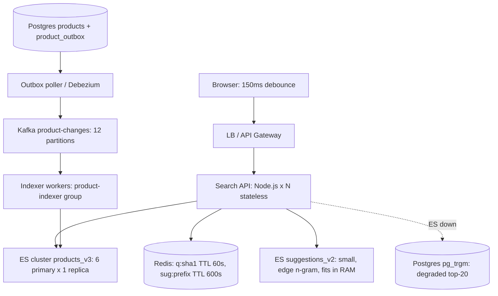
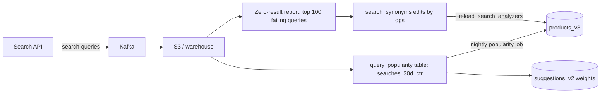

# Search System -- HLD + LLD (Part 4: Scaling -> Failures -> Consistency -> Security -> Observability)

> Is file mein prompt ke **Parts 16-20** hain: scaling (1x se 1000x), failure scenarios, consistency, security, aur observability.
> Part 1-3 ka recap: Part 1 mein numbers nikale (**50M products, ~130 GB index, 6 primary shards x 1 replica, 6 data nodes + 3 dedicated masters, 20M searches/day = 231 QPS avg / ~1,000 QPS peak, aur autocomplete 80M/day = search se 4x zyada**). Part 2 mein request flow, `GET /api/v1/search` ka contract, Postgres schema (`products` + `product_outbox`), LLD folder structure aur `QueryBuilder` -> ES DSL ka Node.js code likha. Part 3 mein inverted index zero se banaya, **BM25** ka scoring samjha, query context vs filter context (cacheable bitset) ka rule seekha, edge n-gram autocomplete choose kiya, aur Redis query cache (`q:<sha1>` TTL 60 s, head queries = traffic ka 30%) lagaya.
> Ab dekhenge ye search **traffic badhne par, cheezein tootne par, aur attack hone par** kaise behave karta hai.

**Ek baat pehle se yaad rakho:** Rate Limiter mein hamara sawaal tha "limiter mar jaaye toh API chalti rahe?" -- wahan jawab tha *fail open vs fail closed*. Search mein woh framing kaam nahi karti, kyunki search **khud hi product** hai. Search band = user homepage se aage badh hi nahi sakta = revenue zero. Isliye is part ka har decision ek naye sawaal se nikalta hai:

> **"Search poora nahi de sakte, toh kam se kam kitna de sakte hain?"** -- yaani **degrade, don't die.**

---

## PART 16 -- Scaling: 1x -> 10x -> 100x -> 1000x

### Pehle ek rule

Har level par sirf teen sawaal:

1. **Sabse pehle kya tootega?** (bottleneck)
2. **Usko theek karne ka sabse sasta tareeka kya hai?**
3. **Kya abhi zarurat NAHI hai?**

**Key insight (Part 1 se):** search ek **read-heavy** system hai -- 20M searches/day ke saamne sirf 5M updates/day. Isliye URL Shortener wala "cache laga do" trick **yahan kaam karta hai** (Rate Limiter mein nahi karta tha, kyunki wahan har check ek write tha).

Lekin ek twist hai: cache sirf **head queries** par lagta hai. "iphone case" 10,000 baar search hoti hai -- cache hit. "samsung m31 back cover blue 6gb" ek baar -- cache miss, ES tak jaana hi padega. Zipf distribution: top 1,000 queries = traffic ka ~30%. Yaani **cache ne 30% bachaya, baaki 70% ES ko hi khaana hai.** Isliye ES ki capacity planning se bach nahi sakte.

Aur doosra twist: **autocomplete search se 4x zyada traffic hai** (80M vs 20M/day). Scaling ki asli kahani yahi hai.

### Levels define karte hain

Spec ka 50M products / 1,000 QPS peak hamara **100x** design point hai. Kahani samajhne ke liye ek chhoti site se shuru karte hain:

| Level | Products | Searches/day | Avg QPS | Peak QPS (4x) | Index size (1.3x, 2 KB/doc) | Search engine |
|---|---|---|---|---|---|---|
| **1x** (startup) | 100K | 200K | ~2.3 | ~10 | ~260 MB | **Postgres** `tsvector` + GIN |
| **10x** | 5M | 2M | ~23 | ~95 | ~13 GB | 1 ES node (ya managed OpenSearch, 3 chhote nodes) |
| **100x** (hamara spec) | **50M** | **20M** | **231** | **~1,000** | **~130 GB** | 6 primary x 1 replica, 6 data + 3 master nodes |
| **1000x** | 500M | 200M | ~2,315 | **10,000+** | ~1.3 TB | ~40 primaries x 1-2 replicas, ~25 data nodes, dedicated coordinating tier |

> Autocomplete traffic har level par search ka **4x** hai. 100x par 4,000 QPS peak, 1000x par **~40,000 QPS peak**. Isi number ne 100x par alag `suggestions_v2` index aur 1000x par alag cluster force kiya.

---

### 1x -- 100K products, 200K searches/day

```
Browser -> LB -> 1-2 Node.js instances -> Postgres (products + tsvector GIN index)
```

**Honest baat (spec ka decision, dohrana zaruri hai):** agar catalog 100K products hai toh **Elasticsearch mat lagao.** Postgres kaafi hai:

```sql
ALTER TABLE products ADD COLUMN search_tsv tsvector
  GENERATED ALWAYS AS (
    setweight(to_tsvector('english', coalesce(title,'')), 'A') ||
    setweight(to_tsvector('english', coalesce(brand,'')), 'B') ||
    setweight(to_tsvector('english', coalesce(description,'')), 'C')
  ) STORED;

CREATE INDEX products_tsv_idx  ON products USING GIN (search_tsv);
CREATE INDEX products_trgm_idx ON products USING GIN (title gin_trgm_ops);

SELECT id, title, ts_rank(search_tsv, plainto_tsquery('english', $1)) AS rank
FROM products
WHERE search_tsv @@ plainto_tsquery('english', $1) AND status = 'active'
ORDER BY rank DESC
LIMIT 20;
```

**Code Explanation:**

- `GENERATED ALWAYS AS ... STORED` -- Postgres khud har insert/update par `tsvector` bana ke column mein rakh deta hai. Koi alag pipeline, koi Kafka, koi indexer worker nahi. **Ye 1x ki sabse badi jeet hai.**
- `setweight(..., 'A' | 'B' | 'C')` -- title ka match brand se aur brand ka description se zyada important. Ye hamare ES ke `"fields": ["title^3", "brand^2", "description"]` ka chhota bhai hai.
- `to_tsvector('english', ...)` -- Postgres ka English analyzer: lowercase + stop words + stemming. `mobiles` -> `mobil`, `running` -> `run`. Yaani Part 3 wala analyzer pipeline yahan bhi free mein mil raha hai.
- `GIN (search_tsv)` -- GIN ek **inverted index** hi hai (term -> row ids ki posting list). Yaani Postgres ke andar wahi data structure hai jo Part 3 mein humne haath se banaya tha.
- `gin_trgm_ops` on `title` -- `pg_trgm` extension. Ye typo tolerance ka sasta version deta hai (`similarity('iphon','iphone') > 0.4`). Ye index **Part 4 ke failure path (ES down) mein bhi kaam aayega** -- isliye 100x par bhi ise mat hatao.
- `ts_rank(...)` -- Postgres ka apna relevance score. BM25 jitna accha nahi (field length normalization kamzor, IDF simplistic), par 100K docs par user ko fark nahi dikhta.

**ES kab chahiye (spec ka rule, yaad rakho):** (a) docs > ~5-10M, (b) **facet aggregations** chahiye ("Samsung (1,204)"), (c) relevance tuning / typo / synonyms chahiye, (d) search traffic DB ko hurt kar raha ho. In chaar mein se ek bhi true na ho -> Postgres.

**Sabse pehle kya toota (1x):**

| Kya | Kab toota | Fix |
|---|---|---|
| `ILIKE '%term%'` | 50K docs ke baad hi (full table scan) | `tsvector` + GIN |
| Zero results on typo | Din 1 se | `pg_trgm` similarity fallback |
| Facet counts | Jab pehla "Brand (count)" filter maanga gaya | `GROUP BY brand` -- 100K rows par theek, 5M par nahi |

**Kya NAHI chahiye:** ES, Kafka, outbox, Redis cache, alias swap, indexer workers. Ye sab abhi **pure overhead** hai.

> Interview line: "1x par main Elasticsearch nahi lagaunga. Postgres `tsvector` + GIN inverted index deta hai, `ts_rank` basic relevance, aur `pg_trgm` typo tolerance -- bina kisi alag pipeline ke, aur consistency free mein (same transaction). ES tab aayega jab docs 5-10M cross karein ya facet counts / relevance tuning chahiye ho."

---

### 10x -- 5M products, 2M searches/day (~95 QPS peak)

Ab Postgres ki deewar dikhne lagi:

| Area | Kya tootega? | Change | Kyun |
|---|---|---|---|
| **Facet counts** | `GROUP BY brand` 5M rows par 2-4 sec | **ES aggregations** | ES `terms` agg **doc values** (columnar, disk pe sorted) se chalta hai -- ye ES ka structural fayda hai, tuning ka nahi |
| **Relevance** | `ts_rank` mein `k1`/`b` tune nahi hote, business boost nahi lag sakta | ES **BM25 + `function_score`** | Part 3 wala `popularityScore` boost Postgres mein likhna dard hai |
| **Search load on DB** | Search queries OLTP DB ka CPU kha rahi hain -- checkout slow | Search ko **alag system** mein bhejo | Blast radius: search ka load kabhi orders ko na maare |
| **Synonyms / typo** | `pg_trgm` scale nahi karta | `synonym_graph` + `fuzziness: AUTO` | Spec ka zero-result target < 5% |
| **Consistency** | Ab do systems hain (Postgres + ES) | **Outbox + Kafka** (Part 2 wala) | Dual-write = permanent divergence |

**Cluster shape 10x par:**

- Index size 5M x 2 KB x 1.3 = **~13 GB**. Shard sizing rule (25-40 GB) ke hisaab se **1 primary shard** kaafi hai, par HA ke liye **1 replica**. Yaani 2 shards total.
- Nodes: managed OpenSearch / Elastic Cloud ke **3 chhote nodes** (16-32 GB RAM). Teen kyun? Quorum ke liye (neeche masters wala section). Self-hosted single node chalega par ek node gaya = search gaya.
- Abhi **dedicated master nodes nahi** -- teeno nodes `master + data` dono roles nibha lenge.
- Abhi **alag suggestions index nahi** -- autocomplete `title.ac` (edge n-gram sub-field) par main index se hi chal jaayega, 400 QPS peak sambhal lega.
- Redis cache **optional** -- 95 QPS par ES bore ho raha hai.

**Sabse pehle kya toota (10x):**

| Kya | Symptom | Fix |
|---|---|---|
| Postgres CPU | Search queries 40% DB CPU kha rahi hain | ES par shift |
| Facet latency | Filter sidebar 3 sec mein aata hai | ES `terms` agg |
| Indexing lag | Seller update 10 min baad dikhta hai (nightly job tha) | Outbox -> Kafka -> bulk indexer, target <= 30 s |

**Kya NAHI chahiye:** multiple shards (13 GB ek shard mein aaram se), dedicated masters, coordinating nodes, alag autocomplete cluster, Redis query cache, hot/warm tiers.

> Interview line: "10x par main ES laata hoon -- lekin traffic ki wajah se nahi, **capability** ki wajah se: facet aggregations, BM25 tuning, synonyms aur typo tolerance. 13 GB ek shard mein fit hai, isliye 1 primary + 1 replica, aur teen node ka managed cluster. Sabse bada kaam engine ka nahi, **pipeline** ka hai -- outbox + Kafka, kyunki ab Postgres aur ES do alag jagah hain."

---

### 100x -- 50M products, 1,000 QPS peak (hamara spec)

Ye woh design hai jo Parts 1-3 mein bana.



**Sizing ka poora hisaab (ratta nahi, derivation):**

```
50M docs x 2 KB              = 100 GB raw
x 1.3 (inverted index + doc values + _source) = 130 GB primary data
130 GB / 35 GB per shard     = 3.7  -> round up -> 6 primary shards (~22 GB each)
6 primaries + 6 replicas     = 12 shards, ~260 GB cluster data
6 data nodes x 2 shards each = 64 GB RAM node, 31 GB JVM heap
+ 3 dedicated master nodes   (quorum)
```

Ab ES ke scaling levers -- **aur sabse important: kaunsa lever kab kheenchna hai.**

---

#### Lever 1: Replicas vs Shards -- ye sabse zyada galat samjha jaata hai

Ek line mein:

> **Shards = data volume aur per-query parallelism. Replicas = read throughput (QPS).**

| Tum badhaoge | Kya milega | Kya NAHI milega |
|---|---|---|
| **Shards** (`number_of_shards`) | Zyada data fit hoga; ek query zyada CPUs par parallel chalegi | QPS nahi badhega -- ek query ab **zyada** nodes ko busy karti hai |
| **Replicas** (`number_of_replicas`) | Zyada QPS (har query kisi bhi copy par ja sakti hai); HA | Index chhota nahi hoga -- har replica poora data duplicate karta hai (disk + RAM cost) |

**Kaise decide karun?**

```
Latency zyada hai, QPS theek hai       -> shards badhao (query ko parallel karo)
QPS zyada hai, latency theek hai       -> replicas badhao (copies badhao)
Disk bhar raha hai                     -> shards badhao (+ nodes)
Ek shard 40 GB cross kar gaya          -> shards badhao (reindex/_split)
```

Hamare case mein 100x par: 1,000 QPS peak, 6 data nodes, har query 6 shards par parallel. Ek query ~60-120 ms leti hai. Ek node 8 cores ka hai -> search thread pool size = `int((8 * 3) / 2) + 1 = 13`. Roughly 12 nodes-worth of shard copies x ~13 concurrent slots = capacity kaafi hai 1,000 QPS ke liye, kyunki 30% cache se pehle hi kat jaata hai (**700 QPS ES tak**).

Sale day 4,600 QPS par? -> **replicas 1 se 2 karo** (`PUT /products/_settings {"number_of_replicas": 2}`). Ab 18 shard copies. Ye **online** hota hai, reindex nahi chahiye. Cost: +130 GB disk aur ek aur data node set.

#### Over-sharding -- classic mistake

Naya banda sochta hai: "zyada shards = zyada parallel = fast." Galat.

```
Query "iphone case" on 6 shards:
  coordinating node -> 6 parallel requests -> 6 results (top 24 each)
  -> merge 144 hits -> fetch top 24 documents -> respond
  Cost = 6 round trips + merge of 144

Query "iphone case" on 50 shards:
  coordinating node -> 50 parallel requests -> 50 results (top 24 each)
  -> merge 1,200 hits -> fetch top 24
  Cost = 50 round trips + merge of 1,200 + 50 shards ka apna overhead
```

Har shard ek **alag Lucene index** hai: apni memory, apne segments, apne file handles, apna merge thread. 50 chhote shards par:

- **Coordination cost** query time ka bada hissa kha jaata hai (network fan-out, merge).
- **Slowest shard decides** -- 50 shards mein se koi ek GC pause mein hoga, poori query wahi wait karegi. Ye **tail latency amplification** hai: p99 shard latency 50 baar roll karoge toh query ka p99 shard ke p99 se bura hoga.
- **IDF distorted** -- BM25 ka `idf` har shard apne local doc counts se nikaalta hai. Bahut chhote shards par ek hi term ka score alag-alag shards mein alag aata hai -> relevance flaky. (Fix `dfs_query_then_fetch` hai, par woh ek extra round trip hai.)
- **Heap** -- har shard ka fixed overhead (few MB) x shard count x nodes.

> **Rule:** shard count woh sabse **chhota** number rakho jisse har shard 25-40 GB ke andar rahe. 130 GB / 35 = 4 (round up to 6 for headroom). 50 nahi.

#### Lever 2: Shard sizing aur woh constraint jo log bhool jaate hain

- **Target 25-40 GB per shard.** Chhota (< 5 GB) = over-sharding. Bada (> 50 GB) = recovery slow (node gira toh 60 GB network par copy hoga), merges bhaari, hot spot.
- **Hard limit:** ek Lucene shard mein max ~2.1 billion docs. Hum 50M par hain, koi tension nahi.
- **Sabse bada constraint:**

> **`number_of_shards` index banne ke baad badla NAHI ja sakta.** Badalne ke liye poora **reindex** chahiye (alias swap wala, Part 3), ya `_split` / `_shrink`.

| Operation | Kya karta hai | Constraint |
|---|---|---|
| `POST /products_v3/_split/products_v4` | Shards **badhata** hai (6 -> 12, 6 -> 18) | Source index **read-only** hona chahiye; naya shard count source ka **multiple** ho |
| `POST /products_v3/_shrink/products_v4` | Shards **ghatata** hai (6 -> 3, 6 -> 1) | Saari shards **ek hi node** par honi chahiye pehle; naya count source ka **factor** ho |
| `_reindex` + alias swap | Kuch bhi badal do (shards, mapping, analyzer) | Mehenga -- 130 GB dobara likhna, ghante lagenge |

Isiliye **shard count din 1 par plan karo, growth ka 2-3 saal soch ke.** Agar 2 saal mein catalog 150 GB hona hai, toh 6 shards abhi bhi theek hai (25 GB each). 500 GB hona hai toh aaj hi 12-14 shards lo.

> Interview line: "Shard count immutable hai, isliye main use capacity planning ki tarah treat karta hoon: aaj 130 GB, do saal mein ~250 GB, target 25-40 GB per shard -> 6 primaries. Badalna pade toh `_split` (read-only source, multiple of 6) ya alias-swap reindex."

#### Lever 3: Hot / Warm / Cold tiers -- yahan lagte hain ya nahi?

**Kya hai:** nodes ko tiers mein baanto. **Hot** = fast NVMe SSD, zyada CPU, naya data yahan likha jaata hai. **Warm** = sasta SSD/HDD, sirf read. **Cold/Frozen** = object storage (S3) se searchable, bahut sasta, bahut slow.

**Kaam kab karta hai:** jab data **time-series** ho aur purana data kam padha jaaye -- logs, metrics, events.

**Hamare products index par? Mostly NAHI.**

- 2019 ka product 2024 ke product jitna hi searchable hona chahiye. "iphone case" query ko poore catalog par chalna hai -- purane docs ko slow disk par daalna matlab **har query slow**.
- Products index time-partitioned hai hi nahi -- ek hi `products_v3`.

**Haan kahan lagta hai:** **query-log indices.** Spec ka side path -- `search-queries` -> analytics. Agar tum query logs ko bhi ES mein rakhte ho (Kibana dashboards ke liye), toh:

```
search-logs-2026.09.18   -> hot   (aaj ka, dashboards live query karte hain)
search-logs-2026.09.0*   -> warm  (7-30 din, kabhi kabhi dekha jaata hai)
search-logs-2026.0[1-8]* -> cold  (90+ din, quarterly report ke liye)
```

Ye **ILM (Index Lifecycle Management)** policy se automatic hota hai: rollover daily, 7 din baad warm, 30 din baad cold, 400 din baad delete.

> **Anchor:** hot/warm/cold **time-based data** ka tool hai, **catalog data** ka nahi.

#### Lever 4: Dedicated master nodes aur quorum

**Kya hai:** ES cluster mein ek node **elected master** hota hai. Woh data nahi dhoondhta -- woh **cluster state** sambhalta hai: kaunsi index hai, kaunsa shard kaunse node par hai, mapping kya hai, alias kya point kar raha hai.

**Dedicated kyun?** Agar master ka role data node par hai, toh ek heavy aggregation query us node ko GC pause mein daal degi -> master "gayab" ho jaayega -> cluster naya election karega -> **saari indexing aur shard allocation ruk jaayegi.** Search ke liye ek bhaari query cluster ko hila degi -- ye acceptable nahi.

Isliye spec mein **3 dedicated master nodes** hain: chhote (8-16 GB RAM), data nahi, query nahi, sirf cluster state.

**Quorum rule:**

```
minimum required masters = (n / 2) + 1     (n = master-eligible nodes)

n = 1 -> 1   (koi HA nahi; woh node gaya = cluster gaya)
n = 2 -> 2   (SABSE KHARAB: ek node gaya = quorum gaya = cluster down.
              2 nodes 1 node se BURE hain HA ke liye)
n = 3 -> 2   [OK] ek node gir sakta hai, cluster chalta rahega
n = 5 -> 3   bade clusters (50+ nodes) ke liye
```

**Kyun (n/2)+1 aur 3 nodes?** Maano network partition ho gaya: nodes A|B,C. Agar dono side apna master chun lein toh **split brain** -- do masters, do alag cluster states, ek hi shard par dono taraf writes, data permanently divergent. Quorum isse rokta hai: A akela hai (1 < 2), woh master nahi chun sakta, woh **read-only ho jaata hai**. B,C ke paas 2 hain (2 >= 2), woh master chunte hain aur chalte rehte hain. **Majority hi jeet sakta hai, isliye kabhi do masters nahi ban sakte.**

> Kabhi bhi **even number** master-eligible nodes mat rakho. 4 masters ka quorum bhi 3 hai -- yaani tum 3 ke muqable extra HA nahi kharid rahe, sirf extra machine ka bill.

#### Lever 5: Routing (`_routing`) -- ek query, ek shard

**Default:** `shard = hash(_id) % number_of_shards`. Document random shard par jaata hai. Query har baar **saari 6 shards** par jaati hai (kyunki pata nahi match kahan hai).

**`_routing` ke saath:** tum khud batate ho document kaunse shard par jaaye.

```json
PUT /products_v3/_doc/p_123?routing=seller_8891
{ "productId": "p_123", "sellerId": "seller_8891", "title": "..." }
```

```json
GET /products/_search?routing=seller_8891
{ "query": { "bool": { "filter": [{ "term": { "sellerId": "seller_8891" }}] } } }
```

Ab query **1 shard** par jaati hai, 6 par nahi. Fayda: 6x kam kaam per query -> cluster ki total QPS capacity ~6x.

**Kab helpful hai:** jab query **hamesha** ek tenant ke andar ho.

- [OK] **Multi-tenant marketplace ka seller dashboard** -- "mere 4,000 products mein 'blue shirt' dhoondo". 20,000 sellers hain, har seller sirf apna data search karta hai. Yahan routing perfect hai.
- [OK] B2B SaaS jahan har customer ka data alag hai.
- [X] **Hamara main buyer search** -- "iphone case" ko 20,000 sellers ke products mein dhoondhna hai. Yahan routing lag hi nahi sakta.

**Hot shard ka risk (routing ka andhera pehlu):**

Routing = `hash(routingValue) % 6`. Agar ek seller ke paas 4M products hain (bada brand store) aur baaki ke paas 500-500, toh us seller ka poora data **ek shard** par baith jaayega:

```
shard 0: 22 GB   shard 1: 22 GB   shard 2: 22 GB
shard 3: 22 GB   shard 4: 22 GB   shard 5: 68 GB  <-- mega seller yahan
```

Us shard ka node: disk zyada, heap pressure zyada, queries slow, merges bhaari. Aur **fix karna mushkil hai** -- shard rebalance se kuch nahi hoga, poora data ek hi shard ka hai.

**Mitigation:** bade tenants ke liye `routing_partition_size` set karo -- tenant ka data 1 shard ki jagah N shards mein bikhre (query N shards par jaayegi, 6 par nahi -- beech ka raasta). Ya mega-sellers ko alag index do.

> **Rule:** routing tab lagao jab tenants **chhote aur kaafi ek jaise** hon. Ek hi whale tenant poori strategy ko zeher bana deta hai.

#### Lever 6: Coordinating-only nodes

Har ES query ke do phase hote hain:

```
QUERY phase:  coordinating node -> saari shards ko "top 24 doc ids + scores do"
              har shard apna local top 24 lauta ta hai
FETCH phase:  coordinating node 144 hits ko merge karke global top 24 nikaalta hai
              -> un 24 docs ka _source un shards se maangta hai -> response banata hai
```

**Coordinating node** wahi node hai jisne request receive ki -- by default koi bhi data node. Uska kaam CPU + heap khata hai: merge, sort, **aggregations ka final reduce** (facet counts!), aur JSON serialization.

**Problem 100x+ par:** 1,000 QPS mein har query 3 facet aggregations kar rahi hai. Merge ka kaam data node par ho raha hai, wahi node jo Lucene search bhi chala raha hai. Ek bhaari aggregation ka reduce us node ka heap kha jaata hai -> GC pause -> us node par padi saari shards ki queries slow -> p99 spike.

**Fix:** 2-3 **coordinating-only nodes** (`node.roles: []` -- na data, na master). LB search requests inhi ko bheje.

```yaml
# coordinating-only node
node.roles: []
```

- Data nodes ab sirf Lucene search karte hain, merge ka kaam alag machine par.
- **Blast radius** kam: coordinating node ka GC pause data nodes ko nahi chhuta.
- Ye ek tarah ka **smart load balancer** hai jo ES protocol samajhta hai.

**Kab NAHI chahiye:** 100x par (6 data nodes, 1,000 QPS) abhi zarurat nahi -- ye **1000x ka lever** hai, ya jab aggregations bahut bhaari hon. Overkill jaldi lagana = 2 extra nodes ka bill bina fayde ke.

#### Lever 7: Caching ki teen parah -- 30% head queries

Cheapest query woh hai jo **chali hi nahi**.

| Tier | Kahan | Kya cache hota hai | TTL | Hit rate |
|---|---|---|---|---|
| **1. Redis query cache** | Hamara code | `q:<sha1(normalizedQuery+filters+sort+page)>` -> poora `SearchResponse` JSON | 60 s | **~30%** (head queries, Zipf) |
| **2. Redis prefix cache** | Hamara code | `sug:<prefix>` -> top 10 suggestions | 600 s | **~60-70%** (prefixes aur bhi zyada skewed hain) |
| **3. ES node query cache** | ES ke andar (auto) | `filter` context ke bitsets (`brand:Apple`, `inStock:true`) | auto (LRU, heap ka 10%) | -- |
| **4. ES shard request cache** | ES ke andar | `size: 0` wali requests ka poora result -- yaani **pure aggregation** calls | refresh tak | -- |

**Tier 1 ka asli impact:**

```
1,000 QPS peak
- 30% Redis hit (head queries)  = 300 QPS Redis se, ~2 ms mein
= 700 QPS ES tak pahunchti hai
```

Yaani cache ne cluster ka ~30% kaam bachaya -- lagbhag **2 data nodes ka bill**. Isliye cache "nice to have" nahi, **capacity plan ka hissa** hai.

**Tier 3 kyun kaam karta hai (Part 3 ka rule yaad karo):** `filter` context score nahi banata, isliye ES uska result ek **bitset** (har doc ke liye 1 bit) mein cache kar sakta hai. `brand: Apple` ka bitset ek baar bana, phir har `iphone case + Apple` query usko reuse karti hai. **Isiliye** rule tha: jo cheez score mein contribute nahi karti, usse `filter` mein daalo. Ye sirf theory nahi thi -- ye ek cache hit hai.

**Tier 1 ki honest limit:**

- **Personalization cache ko maar deti hai.** Agar result har user ke liye alag ho toh cache key mein userId aayega -> hit rate ~0%. Isiliye spec mein **personalization v1 mein nahi hai.**
- Cache sirf **page 1** ka. Page 7 ki query kaun repeat karega?
- TTL 60 s -- yaani price change search results mein max 60 s late dikh sakta hai cached queries par. Ye consciously accept kiya (PART 18).

#### Lever 8: Autocomplete ko alag karo -- 100x ka sabse bada decision

Ye is system ka **sabse important scaling move** hai, aur interview mein yahi impress karta hai.

```
Search:       20M/day  ->  231 QPS avg,   ~1,000 QPS peak
Autocomplete: 80M/day  ->  925 QPS avg,  ~4,000 QPS peak     <-- 4x zyada
```

**Agar dono ek hi index par chalein toh kya hoga?**

- Main index 130 GB ka hai, 6 shards par. Har suggest request 6 shards ko jagati hai -- 4,000 QPS x 6 = **24,000 shard operations/sec** sirf autocomplete ke liye.
- Autocomplete ka p99 budget **100 ms** hai, search ka 400 ms. Dono ek hi thread pool mein compete karenge -- aur autocomplete apne volume se search ko bhookha maar dega.
- Ek bhaari facet query (search) suggest ka p99 kharab kar degi, aur user ko har keystroke par lag dikhega.

**Isliye spec mein `suggestions_v2` alag index hai:**

| | `products_v3` | `suggestions_v2` |
|---|---|---|
| Docs | 50M products | ~2-5M (popular queries + product titles + categories) |
| Size | ~130 GB | **~2-4 GB** -- OS page cache mein poora fit |
| Fields | 15+ fields, `_source` stored | `text`, `type`, `weight` -- bas |
| Query | `multi_match` + fuzzy + aggs + `function_score` | `match` on edge n-gram field, `sort` by weight |
| Shards | 6 | **1-2** (chhota hai) |
| Latency | p95 200 ms | **p99 100 ms** |

Aur uske aage **Redis `sug:<prefix>`** (top ~10K prefixes, TTL 600 s) -- 4,000 QPS ka bada hissa ES tak pahunchta hi nahi.

**1000x par next step:** `suggestions` ko apne **alag cluster** par daal do. Kyun? Kyunki tab dono workloads alag-alag scale karti hain aur unki failure domains alag honi chahiye: **suggest cluster gir jaaye toh search chalti rahe** (UI bas suggestions band kar de -- user phir bhi Enter dabake search kar sakta hai). Yeh degradation user ko mushkil se dikhega.

> Interview line: "Sabse counter-intuitive number ye hai ki autocomplete search se 4x zyada traffic laata hai -- 80M vs 20M per day. Isliye main use kabhi main index par nahi chalata. Ek chhota `suggestions_v2` index banata hoon jo RAM mein fit ho jaaye, uske aage Redis prefix cache, aur 1000x par use poore alag cluster par daal deta hoon taaki uska failure search ko na le doobe."

#### Sale-day playbook (20x = ~4,600 QPS)

Sale traffic **predictable** hai -- date pata hai. Isliye ye reactive nahi, **pre-planned checklist** hai. T = sale start.

| Kab | Kya karo | Kyun |
|---|---|---|
| **T-7 din** | `number_of_replicas: 1 -> 2` + 3 extra data nodes | Replica badhana = QPS capacity. Shards **nahi** badha sakte (immutable) -- isliye ye lever pehle se socha hua hona chahiye |
| **T-2 din** | Saare `_reindex` / mapping migrations **freeze** | Reindex merge aur IO kha jaata hai; sale ke beech mein alias swap = risk without upside |
| **T-1 din** | Popularity job, synonym updates, analyzer reload -- sab ab, sale ke dauran nahi | Analyzer change = reindex (spec ka rule) -- sale mein bilkul nahi |
| **T-2 ghante** | **Cache pre-warm:** top 5,000 queries ko background script se hit karo taaki `q:<sha1>` bhar jaayein | Cold cache + 4,600 QPS = sab ek saath ES par. Warm cache = pehle minute se 30% saved |
| **T-2 ghante** | `refresh_interval: 1s -> 30s` | Ye sabse bada indexing lever hai. Refresh = naya Lucene segment banana. 500 updates/sec par 1s refresh = segment churn + merge storm. 30s karne se indexing cost gir jaata hai; keemat: naya product 30 s ki jagah 30-60 s mein dikhega -- sale par acceptable |
| **T-1 ghanta** | Non-critical Kafka consumers **pause**: description re-embedding, image jobs, analytics backfills | Bulk indexing aur search CPU ke liye ladte hain |
| **T-1 ghanta** | Node.js API autoscale min instances badhao; ES client `requestTimeout` mat badhao | Timeout badhana = slow queries ko jam hone dena. Fast fail better |
| **T-0** | **Degradation switches ready:** facets off karne ka feature flag, `size` cap 24, `page` cap 20, fuzziness off for `q` > 5 words | Facet aggregations query cost ka 20-40% hain (spec ka latency budget). Search bachane ke liye **facets sabse pehle giro** |
| **T+** | Watch: `es_jvm_heap_used_percent`, `search_latency_seconds` p99, `indexer_lag_seconds`, `search_cache_hit_ratio` | Chaar number, ek screen |
| **T+2 din** | `refresh_interval` wapas `1s`, replicas wapas 1, jobs resume, nodes scale down | Bhoolna = mehenga bill + stale search |

**Degrade ladder sale par (sabse pehle kya chhodo):**

```
1. Facet counts off       -> ES cost -20-40%, user ko filter counts nahi dikhte
2. Fuzziness off          -> ES cost -10-20%, typo tolerance jaata hai
3. track_total_hits: false-> "10,000+" bhi nahi, bas "results found"
4. Page cap 20 -> 5       -> deep pagination band
5. Redis stale cache      -> TTL 60s -> 300s, thoda purana result chalega
6. Postgres degraded top-20 (PART 17)
```

**Sabse pehle kya toota (100x):**

| Kya | Symptom | Fix |
|---|---|---|
| Facet aggregations | p99 400 ms cross, `es_query_duration_seconds` spike | Facet count `size: 10` cap, `execution_hint: map`, sale par facets off |
| JVM heap | `es_jvm_heap_used_percent` > 80%, GC pauses | Heap **31 GB se upar kabhi nahi**; field data / aggregation cardinality kam karo |
| Coordinating load | Ek data node ka CPU baaki se double | Coordinating-only nodes (Lever 6) |
| Deep pagination | Page 500 par `max_result_window` error ya OOM | `page <= 50` cap + `search_after` (Part 2 ka decision) |
| Autocomplete | Suggest p99 300 ms, search bhi slow | Alag `suggestions_v2` index + Redis prefix cache |

> Interview line: "100x par 130 GB ka data 6 shards par baithta hai aur 1,000 QPS ka peak Redis ke 30% head-query cache ke baad ~700 QPS ban jaata hai. QPS badhaana ho toh replicas, data badhe toh shards -- aur shard count immutable hai isliye woh din 1 ka decision hai. Autocomplete alag index par, kyunki woh search se 4x bada hai."

---

### 1000x -- 500M products, 200M searches/day (10,000+ QPS peak)

Ab har cheez ka shape badalta hai.

| Bottleneck | Kyun | Kya karunga |
|---|---|---|
| **Index size** | 500M x 2 KB x 1.3 = **~1.3 TB** | 1.3 TB / 35 GB = **~40 primary shards**. Nodes ~20-25 (2 shards/node, 64 GB RAM) |
| **Query fan-out** | Ek query ab **40 shards** par jaayegi -> coordination + tail latency amplification | **Index partitioning:** `products_electronics`, `products_fashion`, ... category-wise alag indices, alias `products` ke peeche. User aksar category ke andar search karta hai -> query 40 nahi, 6 shards par |
| **Coordinating load** | Merge + agg reduce data nodes ko maar rahe hain | **4-6 coordinating-only nodes**, LB unhi ko hit kare |
| **QPS** | 10,000 peak, 30% cache ke baad ~7,000 ES par | Replicas 2-3; aur zyada data nodes. Ye linear scaling hai, bas mehenga |
| **Autocomplete** | 40,000 QPS peak | **Alag cluster** + Redis cluster prefix cache + edge caching popular prefixes ke liye |
| **Indexing** | 50M updates/day = 580/sec avg, flash sale 5,000/sec | Kafka partitions 12 -> 48; indexer workers scale; **`refresh_interval` 5s** default (1s ka cost 40 shards par bahut zyada) |
| **Global users** | Ek region ka cluster = 150-250 ms cross-region latency | **Multi-region read replicas**: har region apna ES cluster, Kafka se replicate (CCR / alag consumer group). Postgres primary ek jagah |
| **Cost** | ~25 data nodes x 64 GB + replicas = bada bill | **Frozen tier** discontinued products ke liye (searchable snapshot S3 se); `_source` compression (`best_compression`); `description` ko `index: false, store: false` karke sirf DB se serve karo |
| **Relevance at scale** | 500M docs mein BM25 akela kaafi nahi | **Learning-to-Rank** (2-phase: BM25 se top 500, phir ML model se re-rank) + **vector / kNN hybrid search** -- spec ne inhe v3 kaha tha, yahan aate hain |

**Multi-region ka shape:**

```
                      Postgres primary (single writer, source of truth)
                              |
                         outbox -> Kafka (multi-region replicated)
                       /            |            \
                 IN indexer    US indexer    EU indexer
                      |             |             |
                 ES cluster IN  ES cluster US  ES cluster EU
                      |             |             |
                 IN users       US users      EU users
```

- Har region **read-only** search serve karta hai apne local cluster se -> latency ~50 ms, cross-region hop zero.
- Writes ek hi jagah (Postgres primary), isliye "do jagah alag price" wala problem nahi.
- Trade-off: ab **indexing lag per region** alag hai. Ek region ka indexer atka toh sirf wahan ke users purana data dekhenge -- aur ye debug karna mushkil hai ("mujhe dikh raha hai, aapko nahi"). `indexer_lag_seconds{region}` label mandatory ho jaata hai.

**Sabse pehle kya toota (1000x):**

| Kya | Symptom | Fix |
|---|---|---|
| Query fan-out | p99 800 ms, par har shard ka apna time 40 ms | Category-wise index partitioning |
| Cluster state | 40 indices x 40 shards x 2 = 3,200 shards; master slow, allocation minutes leti hai | Shard count discipline; ILM; `_shrink` purane indices |
| Cost | Monthly bill 3x expected | Frozen tier, `best_compression`, `_source` se bade fields hatao |
| Relevance | Zero-result rate wapas 8% (long tail queries) | Hybrid search: BM25 + vector kNN, RRF se merge |

> Interview line: "1000x par ek query ka 40-shard fan-out hi bottleneck ban jaata hai -- shards badhana ab **madad nahi**, nuksaan karta hai. Isliye main index ko category-wise partition karta hoon aliases ke peeche, coordinating-only tier lagata hoon, autocomplete ko alag cluster par, aur multi-region read clusters Kafka se feed karta hoon. Relevance ke liye BM25 pehle stage banta hai aur LTR/vector second stage."

### Har scaling tool -- kab lagana hai, kab nahi

| Tool | Hamare system mein kab | Kab NAHI |
|---|---|---|
| **Postgres FTS (`tsvector` + GIN)** | 1x, aur 100x par **fallback path** ke roop mein hamesha | Jab facets / relevance tuning / 5M+ docs chahiye |
| **Elasticsearch** | 10x se | 100K products wali site |
| **More replicas** | QPS badhe (sale day) | Data badhne par (replica se jagah nahi banti) |
| **More shards** | Data badhe / shard 40 GB cross kare | QPS ke liye -- over-sharding latency badhata hai |
| **Dedicated masters (3)** | 100x se (6+ data nodes) | 3-node dev cluster |
| **Coordinating-only nodes** | 1000x, ya bhaari aggregations par | 100x par -- abhi overkill |
| **Routing (`_routing`)** | Seller dashboard search (per-tenant) | Buyer search; ya jab ek whale tenant ho |
| **Hot/warm/cold + ILM** | Query-log indices | `products` index -- purana product bhi utna hi searchable hai |
| **Redis query cache** | 100x se (30% traffic bachata hai) | Jab personalization on ho (hit rate ~0) |
| **Alag `suggestions` index** | 100x se (4x traffic) | 10x par -- `title.ac` sub-field kaafi hai |
| **Alag suggest cluster** | 1000x | Pehle |
| **Multi-region clusters** | 1000x / global users | Ek desh ka marketplace |
| **LTR / vector search** | 1000x, ya jab zero-result plateau ho jaaye | v1/v2 -- pehle synonyms aur BM25 tuning nichodo |

---

## PART 17 -- Failure Scenarios (interviewer style)

Format: **Problem -> Impact -> Solution**, aur har ek mein **user ko kya dikhta hai**. Golden rule:

> **Rate Limiter mein hum poochte the "fail open ya fail closed?" -- yahan woh sawaal galat hai. Search ka jawab hai: DEGRADE, DON'T DIE.** Poora search nahi de sakte toh aadha do; aadha nahi de sakte toh stale do; woh bhi nahi toh 503 -- lekin uss order mein.

### Failure map

```
Failure                          Search chalti hai?   User ko kya dikhta hai
ES cluster YELLOW                Haan (normal)        Kuch nahi -- sab normal
ES cluster RED (ek shard)        Partial              ~1/6 results gayab, chupchaap
Ek data node mara               Haan                 Kuch nahi (replica promote)
Poora ES cluster gaya            Degraded             Top 20, no facets, banner
JVM heap pressure / GC           Slow                 p99 spike, "loading..." lamba
Ek slow shard                    Partial/slow         Kam results ya slow page
Indexer peeche (Kafka lag)       Haan                 Purana price/stock
Outbox poller atka               Haan                 Naya product dikhta hi nahi
Bad mapping deploy               Haan                 Naye/edited products missing
Reindex ne disk bhar di          Read-only            Naya kuch index nahi hota
Bad synonym/analyzer             Haan                 Bakwaas results (sabse khatarnak)
Scraper hammering                Slow sabke liye      429 scraper ko, latency sabko
Query of death                   Ek node struggle     Us node ki saari queries slow
Split brain / master issue       Partial/none         Writes ruk jaate hain
```

### 1. "ES cluster yellow ho gaya -- panic karun?"

- **Problem:** `GET /_cluster/health` ne `"status": "yellow"` diya.
- **Iska matlab exactly kya hai:** **saari primary shards assigned hain, lekin kam se kam ek replica unassigned hai.**
- **Impact:** **Data ka koi loss nahi, search poori tarah kaam kar rahi hai.** User ko **kuch nahi dikhta.** Do asli risks hain: (a) ab us shard ki ek hi copy hai -- agar woh node bhi gaya toh **RED**; (b) read throughput us shard ke liye aadha (2 copies ki jagah 1).
- **Yellow kyun hota hai (common reasons):**
  - Ek data node abhi restart hua / gaya -> uski shards unassigned.
  - Naya index bana jismein `number_of_replicas: 1` hai par cluster mein **ek hi node** hai (ES ek shard aur uski replica **kabhi** ek hi node par nahi rakhta -- warna replica ka matlab hi kya).
  - Disk **high watermark (90%)** cross -> ES naye shards allocate karna band kar deta hai.
- **Solution:**
  - `GET /_cluster/allocation/explain` -- ye API **seedha batati hai** ki woh shard allocate kyun nahi ho rahi. Guess mat karo.
  - Node wapas aa gaya toh khud green ho jaayega (recovery mein minutes lagte hain -- 22 GB shard network par copy ho rahi hai).
  - Alert: **yellow for > 15 min = warn** (page nahi). RED = page.

### 2. "ES cluster RED ho gaya"

- **Problem:** `"status": "red"` -- **kam se kam ek PRIMARY shard assigned nahi hai.**
- **Impact:** **Us shard ka data abhi search mein hai hi nahi.** Aur sabse khatarnak baat: **query fail nahi hoti.** ES baaki 5 shards se results laata hai aur 200 OK deta hai. Response mein `_shards: { total: 6, successful: 5, failed: 1 }`.
  - User ko dikhega: "iphone case" par 8,300 results (10,000 ki jagah). **Woh kabhi nahi jaanega ki 1/6 catalog gayab hai.** Uska product page 2 par tha, ab kahin nahi hai.
  - Ye **silent partial failure** hai -- outage se bura, kyunki koi alarm nahi bajta jab tak tum khud na dekho.
- **Solution:**
  - **`_shards.failed` ko har response par check karo aur metric badhao.** Ye code Part 2 mein likha tha; yahan uska kaaran hai:

```ts
// src/repositories/es.repository.ts
const res = await this.es.search<ProductDoc>({ index: 'products', ...body });

if (res._shards.failed > 0) {
  partialResultsTotal.inc({ index: 'products' }, res._shards.failed);
  logger.warn(
    { failed: res._shards.failed, total: res._shards.total,
      reasons: res._shards.failures?.slice(0, 2).map((f) => f.reason?.type) },
    'partial search results -- some shards did not answer',
  );
}
```

**Code Explanation:**

- `res._shards.failed > 0` -- ES ne 200 diya, par kuch shards ne jawab nahi diya. **Ye check na ho toh RED cluster chupchaap aadhe results deta rahega.**
- `partialResultsTotal.inc(..., res._shards.failed)` -- Prometheus counter. Alert: `rate(...) > 0 for 2 min` = **page**. Yahi RED ka asli detector hai (cluster health polling se bhi jaldi).
- `res._shards.failures?.slice(0, 2)` -- sirf pehle 2 reasons log karo. 1,000 QPS par poora failures array log karoge toh logging pipeline hi gir jaayegi.
- `f.reason?.type` -- ES ka exception type (`no_shard_available_action_exception`, `circuit_breaking_exception`, `search_phase_execution_exception`). Yahi batata hai ki RED hai ya slow shard ya heap.
- **Product decision:** chaaho toh `res._shards.failed > 0` par response mein `degraded: true` bhi bhejo (spec ka field) taaki UI bole "kuch results abhi available nahi hain".

  - **Recovery:** RED ka matlab aksar ye hai ki primary aur uski replica **dono** gayab hain (do nodes gaye, ya disk corrupt). Options: node wapas laao (best), ya **snapshot se restore** karo, ya (agar data derived hai -- aur hamara hai!) **us shard ko reindex karo Postgres se**. Ye ek bada fayda hai: **ES hamara source of truth nahi hai, isliye worst case mein hum poora index dobara bana sakte hain.** Postgres se full reindex 50M docs ka -- kuch ghante, par data loss zero.

### 3. "Ek data node mar gaya"

- **Problem:** 6 mein se ek data node crash / EC2 terminate / AZ issue.
- **Impact:** us node par 2 shards thi. Agar dono primaries thi, toh unki replicas doosre nodes par **turant promote** ho jaati hain (seconds). Cluster **yellow** ho jaata hai (ab un shards ki ek hi copy hai). Search chalti rehti hai, **user ko kuch nahi dikhta**. Baaki 5 nodes par 20% zyada load -- p99 thoda badhega.
- **Solution:**
  - `index.unassigned.node_left.delayed_timeout: 5m` (default 1m) -- ES turant 22 GB shards copy karna shuru na kare. Agar node 5 min mein wapas aa gaya (restart/deploy), toh copy ka poora network storm bach gaya. Ye **ek setting bahut saare "cluster slow ho gaya" incidents rokti hai.**
  - Shard allocation awareness: `cluster.routing.allocation.awareness.attributes: zone` -- ES primary aur replica ko **alag AZ** mein rakhega. Ek poori AZ girne par bhi data mile.
  - Capacity: 6 nodes ko **5 nodes ka load** jhelne layak rakho (yaani peak par ~80% utilization se upar mat jao).

### 4. "Poora ES cluster unreachable hai" -- degrade ladder

- **Problem:** cluster down (bad config push, network ACL, provider outage, ya saari nodes OOM).
- **Impact:** agar kuch na karein toh **search feature poora gayab** = homepage se aage koi nahi badhega = revenue zero. Ye is system ka **worst case** hai.
- **Solution: teen seedhiyon ki ladder, isi order mein.**

```
Step 0: ES query  -----------> fail (timeout ya connection refused)
   |
Step 1: Redis stale cache  --> head queries ke liye purana result (TTL badha ke serve)
   |                            "iphone case" jaisi 30% queries yahan se nikal jaati hain
   v (miss)
Step 2: Postgres pg_trgm  ---> degraded top-20, BINA facets, BINA deep pagination
   |                            response: degraded: true + UI banner
   v (Postgres bhi fail)
Step 3: 503 SEARCH_UNAVAILABLE
```

```ts
// src/services/search.service.ts
async search(req: SearchRequest): Promise<SearchResponse> {
  const key = cacheKey(req);

  const fresh = await this.cache.get(key);          // normal 60 s cache
  if (fresh) return { ...fresh, tookMs: 1 };

  try {
    const res = await this.esRepo.search(req);       // requestTimeout 1000, per-request timeout 800ms
    await this.cache.set(key, res, 60);
    await this.cache.set(`stale:${key}`, res, 900);  // 15 min ka lifeboat
    return res;
  } catch (err) {
    searchDegradedTotal.inc({ stage: 'es_failed' });
    this.logger.error({ err: String(err) }, 'es search failed, degrading');

    const stale = await this.cache.get(`stale:${key}`);   // STEP 1
    if (stale) {
      searchDegradedTotal.inc({ stage: 'stale_cache' });
      return { ...stale, degraded: true };
    }

    try {                                                  // STEP 2
      const rows = await this.productRepo.degradedSearch(req.q, 20);
      searchDegradedTotal.inc({ stage: 'postgres' });
      return {
        hits: rows, total: rows.length, totalIsLowerBound: true,
        facets: { brands: [], categories: [], priceRanges: [] },
        tookMs: 0, degraded: true,
      };
    } catch (pgErr) {                                      // STEP 3
      searchDegradedTotal.inc({ stage: 'failed' });
      throw new ServiceUnavailableError('SEARCH_UNAVAILABLE');
    }
  }
}
```

**Code Explanation:**

- `const fresh = await this.cache.get(key)` -- normal 60 s cache. ES healthy ho ya na ho, 30% head queries yahin se jaati hain.
- `await this.cache.set(\`stale:${key}\`, res, 900)` -- **yahi trick hai.** Har successful search do jagah likhti hai: 60 s wali "fresh" copy, aur **15 min wali "stale" copy**. Normal din mein stale copy kabhi padhi hi nahi jaati. ES gira toh yahi hamari lifeboat hai. Extra Redis memory: ~2x cache size -- sasta insurance.
- `catch (err)` -- ES ka har error (timeout, connection refused, 503) yahan aata hai. **Retry nahi kar rahe** -- ES client already `maxRetries: 2` karta hai; service layer par aur retry = user 3 sec wait karega bina fayde ke.
- `searchDegradedTotal.inc({ stage })` -- spec ka `search_degraded_total` metric, `stage` label ke saath. Ye batata hai ladder ki **kaunsi seedhi** use hui. Alert: `stage="postgres"` > 0 = **page**.
- `stale` return with `degraded: true` -- API contract mein ye field pehle se hai (`SearchResponse.degraded`). UI dekhta hai aur banner dikhata hai: "Search abhi limited mode mein hai -- results purane ho sakte hain."
- `degradedSearch(req.q, 20)` -- Postgres `pg_trgm`/FTS query, `LIMIT 20`, **bina facets** (`GROUP BY` 50M rows par Postgres ko maar dega) aur **bina pagination** (page 2 ka koi matlab nahi jab ranking hi kachchi hai).
- `facets: { brands: [], ... }` -- khaali arrays, `undefined` nahi. Frontend ko crash nahi karna chahiye -- ye contract ki baat hai.
- `totalIsLowerBound: true` -- "20 results" mat bolo, "20+ results" bolo. Jhooth mat bolo.
- `throw new ServiceUnavailableError` -- last step. **503 (404 ya khaali list nahi)** -- khaali list ka matlab "kuch nahi mila" hota hai, jo jhooth hai aur user ko bhaga deta hai.

**Ek zaruri warning:** Postgres degraded path ko **rate limit aur circuit breaker** ke peeche rakho. ES gira aur 1,000 QPS achanak Postgres par aa gaya -- toh ab tumhara **orders database** bhi mar jaayega. Search bachane ke chakkar mein checkout mat maaro. Practical rule: degraded path par ek global cap (jaise 100 QPS), baaki ko seedha 503. Aadhe log search kar payein, poora business zinda rahe.

> Interview line: "ES down hone par main teen seedhi ki ladder use karta hoon: Redis se stale head-query results, phir Postgres `pg_trgm` se degraded top-20 bina facets `degraded: true` flag ke saath, phir 503. Rate limiter mein sawaal 'fail open ya closed' tha; search mein sawaal hai 'kitna kam de sakte hain' -- degrade, don't die. Aur degraded Postgres path circuit breaker ke peeche hota hai, warna search bachaate bachaate main OLTP database gira doonga."

### 5. "JVM heap pressure / long GC pauses"

- **Problem:** ES Java par chalta hai. Heap 75%+ par lagatar rahe toh **old-generation GC** chalta hai, jo **stop-the-world** hota hai -- us dauran node kuch nahi karta.
- **Impact:** p99 achanak 200 ms se 2,000 ms. p50 normal dikhta hai! Kyunki sirf woh queries slow hoti hain jo GC pause ke dauran us node par thi. Graph par ye **spiky p99, flat p50** jaisa dikhta hai -- yahi GC ka fingerprint hai.
- **Common causes:**
  - **High-cardinality aggregation** -- `terms` agg on `productId` (50M unique values) ya bina `size` cap ke. Har bucket heap mein banta hai.
  - Bada `size` (`size: 10000` request) -- 10,000 docs ka `_source` heap mein.
  - Deep pagination -- `from: 100000` par har shard 100,024 hits coordinating node par bhejta hai.
  - Field data on `text` field (sorting/aggregating a `text` field) -- ye poora inverted index ulta karke heap mein daalta hai. **Isiliye spec mein `brand`, `categoryPath` `keyword` hain, `text` nahi.**
- **Solution:**
  - **Heap 31 GB se upar kabhi nahi** (spec ka number). 32 GB ke aage JVM **compressed ordinary object pointers** off kar deta hai -- pointers 4 byte se 8 byte ho jaate hain, yaani **40 GB heap 31 GB se kam useful memory deta hai.** Ye counter-intuitive hai par sach hai.
  - Baaki RAM (64 - 31 = 33 GB) **OS page cache** ke liye chhodo -- Lucene segments wahan cache hote hain aur ye search speed ka sabse bada factor hai.
  - **Circuit breakers** (ES built-in): `indices.breaker.request.limit: 60%`, `indices.breaker.total.limit: 70%`. Ye ek bhaari query ko **reject** kar deta hai (`circuit_breaking_exception`) taaki poora node na gire. **Ek query ka 500 error poore cluster ke outage se accha hai.**
  - `search.max_buckets: 10000` -- aggregation bucket cap.
  - API layer par hard caps: `size` max 100, `page` max 50 (spec).
  - Alert: `es_jvm_heap_used_percent > 80` for 10 min = page. GC old-gen time > 1 sec/min = page.

### 6. "Ek slow shard poori query ko slow bana raha hai"

- **Problem:** ES query **scatter-gather** hai. Coordinating node saari 6 shards se jawab ka **wait** karta hai. Yaani:

> **Query ka latency = sabse SLOW shard ka latency.** 5 shards 40 ms mein aaye, chhati 900 ms mein -> query 900 ms.

- **Impact:** ek node par disk throttling, ya ek bada merge chal raha hai, ya GC -- aur **poore cluster ki p99 gir jaati hai** jabki 5 nodes bilkul theek hain.
- **Kaise pakdo:** `es_query_duration_seconds` cluster-level average kuch nahi batata. Chahiye **per-node** breakdown. `GET /_nodes/stats/indices/search` se per-node `query_time_in_millis / query_total` nikalo aur graph mein **6 alag lines** banao. Ek line upar ho toh culprit mil gaya.
- **Solution:**

```json
GET /products/_search?allow_partial_search_results=true
{
  "timeout": "800ms",
  "size": 24,
  "query": { "...": "..." }
}
```

**Code Explanation:**

- `"timeout": "800ms"` -- **per-request, per-shard** timeout. Har shard 800 ms tak jo mila woh bhej de, phir ruk jaaye. Bina iske ek slow shard 30 sec tak baitha reh sakta hai. **800 ms kyun?** spec ka p99 budget 400 ms hai; 800 ms "clearly broken" ki line hai, normal slow query ki nahi.
- `allow_partial_search_results=true` -- default `true` hai, par **explicitly likho** taaki intent clear rahe: "ek shard na de paaye toh baaki 5 ke results de do, poori query mat gira do."
- **Ye setting do-dhaari talwar hai.** `true` = user ko kuch results milte hain (achha) par **chupchaap adhoore** (khatarnak -- failure #2 wali silent partial). `false` = poori query fail, saaf error, par user ko kuch nahi milta.
- **Isliye `true` + mandatory `_shards.failed` monitoring** (failure #2 ka code). Dono saath mein hi sahi hai; akela `true` ek chhupa hua bug hai.
- **Aur bhi hai:** `"timeout"` ES ke andar ka timeout hai; client ka `requestTimeout: 1000` network-level hai. Client timeout hamesha ES timeout se **bada** rakho (800 < 1000), warna client pehle haath khada kar dega aur ES ka partial result kabhi milega hi nahi.

  - **Slow shard ka root cause aksar ye hota hai:** us node par ek bada **segment merge** chal raha hai (bulk indexing ke baad). Fix: `indices.store.throttle` / merge scheduler tuning, ya bulk indexing ko off-peak par shift karna.

### 7. "Indexer peeche chal raha hai" (Kafka lag)

- **Problem:** `product-indexer` consumer group Kafka `product-changes` se peeche hai. Flash sale par 500 updates/sec aaye, workers 200/sec kar paa rahe hain.
- **Impact:** **search purana data dikhaati hai.** Seller ne price 1,299 kar diya, search mein 1,999 dikh raha hai. Stock khatam ho gaya, search mein "in stock" hai. Spec ka SLA `<= 30 s` toot gaya -- lag 20 minute ho sakta hai. **User ko dikhta hai:** product page par price alag, ya cart mein daalne par "out of stock".
- **Kaise detect karo -- do alag metrics, dono chahiye:**

| Metric | Kya naapta hai | Kyun zaroori |
|---|---|---|
| **Kafka consumer lag** | Kitne messages unprocessed hain | Broker se milta hai, sasta, par "500 messages" ka matlab time mein pata nahi |
| **`indexer_lag_seconds`** (spec) | `now - product.updatedAt` jis doc ko abhi index kiya | **Ye asli SLA metric hai** -- "seller ke edit ko search mein aane mein kitne second lage" |

```ts
// src/workers/product-indexer.worker.ts
for (const doc of batch) {
  const lagSec = (Date.now() - new Date(doc.updatedAt).getTime()) / 1000;
  indexerLagSeconds.observe(lagSec);
}
await this.esRepo.bulkIndex(batch);
```

**Code Explanation:**

- `Date.now() - doc.updatedAt` -- **Postgres mein row badli** se lekar **ES mein likhne** tak ka poora end-to-end time: outbox poller ka delay + Kafka ka time + consumer ka batch wait. Sirf Kafka lag dekhoge toh outbox poller ka atkna miss ho jaayega.
- `.observe(lagSec)` -- histogram, gauge nahi. Isse p50 aur p99 dono milte hain. Alert `histogram_quantile(0.99, ...) > 60` for 5 min.
- **Clock skew ki warning:** `Date.now()` worker ka clock hai, `updatedAt` Postgres ka. Dono NTP se sync hone chahiye warna lag negative ya fake dikhega. (Rate Limiter Part 4 mein yahi problem thi -- wahan fix Redis `TIME` tha.)

- **Solution:**
  - **Consumers scale karo** -- par **max concurrency = partition count**. Spec mein 12 partitions hain, yaani max 12 workers. 13th worker idle baithega. Isiliye partition count bhi capacity decision hai.
  - **Bulk batching tune karo** -- 500 docs / 5 MB / 1 s (spec). Chhoti batches = zyada round trips = slow.
  - **Backpressure ke waqt priority:** ek `product-changes-priority` topic banao sirf **price/stock** changes ke liye. Title/description edits thoda late chalega, par "in stock" jhooth mehenga hai.
  - **Sabse bada fix aksar ye hai:** spec ka rule -- **har stock quantity change par reindex mat karo.** `inStock` boolean index mein, exact `stock_qty` product page par DB/Redis se. Isse update volume 5M/day ke aas paas rehta hai, 50M/day nahi ban jaata.

### 8. "Outbox poller atak gaya"

- **Problem:** `outbox-poller` process crash / deadlock / uska DB connection stuck. Product updates Postgres mein ho rahe hain, `product_outbox` rows ban rahi hain, par koi unhe Kafka par publish nahi kar raha.
- **Impact:** **Kafka lag ZERO dikhega** (kyunki messages aa hi nahi rahe!) aur `indexer_lag_seconds` bhi theek dikhega (jo aaya woh jaldi index hua). **Dono metrics green, aur search ka data poori tarah frozen.** Ye is system ka sabse **dhokhebaaz** failure hai.
- **Detect kaise (ek hi sahi metric):** **sabse purani unpublished outbox row ki umar.**

```ts
// src/workers/outbox-poller.ts -- metric registration
new client.Gauge({
  name: 'outbox_oldest_unpublished_age_seconds',
  help: 'Age of the oldest row in product_outbox with published_at IS NULL',
  async collect() {
    const { rows } = await pg.query<{ age: number }>(
      `SELECT COALESCE(EXTRACT(EPOCH FROM (now() - MIN(created_at))), 0) AS age
         FROM product_outbox WHERE published_at IS NULL`,
    );
    this.set(Number(rows[0].age));
  },
});
```

**Code Explanation:**

- `MIN(created_at) WHERE published_at IS NULL` -- sabse purani row jo abhi tak publish nahi hui. **Row count mat naapo** -- 10,000 rows healthy ho sakti hain (burst) aur 1 row 2 ghante purani = outage.
- `COALESCE(..., 0)` -- koi unpublished row nahi (khaali table) toh `MIN` `NULL` deta hai -> gauge 0 (healthy).
- Ye query `product_outbox_unpublished` **partial index** (`ON (id) WHERE published_at IS NULL`) use karti hai -- spec mein wahi isliye banaya tha. Partial index mein sirf pending rows hoti hain, isliye ye query millisecond mein chalti hai chaahe table mein 500M rows hon.
- `async collect()` -- Prometheus scrape (har 15-30 s) par chalta hai, har request par nahi. Ek halki query har 30 s -- Postgres ko fark nahi padta.
- Alert: `outbox_oldest_unpublished_age_seconds > 120` = **page**.

- **Solution:**
  - Poller ko `SELECT ... FOR UPDATE SKIP LOCKED` ke saath chalao -> multiple poller instances bina duplicate kaam ke saath chal sakte hain. Ek marega toh doosra chalta rahega.
  - Poller ka apna liveness check: har successful loop par heartbeat timestamp; 60 s se purana = restart.
  - **Cleanup job:** published rows ko 7 din baad delete karo, warna `product_outbox` 5M rows/day se badhta rahega aur poller slow ho jaayega.
  - **Recovery:** poller wapas chalte hi backlog apne aap nikal jaayega (rows wahin hain -- yahi outbox pattern ka poora point hai: **kuch kho nahi sakta, sirf late ho sakta hai**).

### 9. "Kisi ne bad mapping change deploy kar di"

- **Problem:** dev ne `rating` ko `half_float` se `keyword` kar diya, ya naya field `discount` add kiya `integer` ke roop mein jabki data `"25%"` string bhej raha hai.
- **Impact:** ES **existing mapping badalne nahi deta** (sirf naye fields add hote hain). Toh bulk index calls **reject** hone lagti hain: `mapper_parsing_exception` / `illegal_argument_exception`. Har prabhavit doc **DLQ** (dead letter queue) mein ja raha hai. **User ko dikhta hai:** naye/edited products search mein aate hi nahi. Purane results normal. Yaani business ko ye **sellers ki complaints** se pata chalta hai, monitoring se nahi -- agar tumne DLQ par alert na lagaya ho.
- **Solution:**

```ts
// src/workers/product-indexer.worker.ts
const res = await this.es.bulk({ operations, refresh: false });

if (res.errors) {
  for (const item of res.items) {
    const r = item.index ?? item.create ?? item.update;
    if (!r?.error) continue;

    if (r.status === 409) { versionConflictTotal.inc(); continue; }   // expected, ignore

    bulkIndexErrorsTotal.inc({ type: r.error.type });
    if (r.status >= 400 && r.status < 500) {
      await this.dlq.send({ id: r._id, error: r.error.type, reason: r.error.reason });
    } else {
      await this.retryQueue.send({ id: r._id });                      // 5xx -> retry
    }
  }
}
```

**Code Explanation:**

- `res.errors` -- ES bulk API ka bada jaal: **poori bulk call HTTP 200 deti hai** chaahe usme se 400 docs fail ho gaye hon. Per-item status check **mandatory** hai.
- `item.index ?? item.create ?? item.update` -- bulk response mein har item ka key uske operation ke hisaab se hota hai. Ye normalize karta hai.
- `r.status === 409` -> `versionConflictTotal` aur **continue**. Ye **expected** hai: spec ka `version_type: 'external'`. Out-of-order Kafka message purana version laaya -> ES ne mana kar diya -> **ye correctness hai, error nahi.** Ise DLQ mein bhejoge toh DLQ bekaar alarms se bhar jaayega.
- `bulkIndexErrorsTotal.inc({ type: r.error.type })` -- `type` label (`mapper_parsing_exception`, `strict_dynamic_mapping_exception`, `circuit_breaking_exception`) se **exactly** pata chalta hai kya toota. Cardinality low hai (ES ke error types ginti ke hain), safe label.
- **4xx -> DLQ, 5xx -> retry** -- ye pura fark hai. 4xx = **hamara doc galat hai**, dobara bhejne se bhi wahi error (poison message, infinite retry loop). 5xx = **cluster busy/down**, retry karna sahi hai.
- Alert: `rate(bulk_index_errors_total[5m]) > 0` = warn; `> 10/s` = page. Aur DLQ depth par alert alag se.
- **Prevention:** mapping mein `"dynamic": "strict"` set karo -- naya unknown field aaya toh **reject** ho, chupchaap `text` mein map na ho jaaye. Aur mapping changes CI mein ek staging index par test hon.
- **Recovery:** mapping badalna hai toh **alias swap reindex** hi raasta hai (spec: analyzer/mapping change = reindex). DLQ ke docs reindex ke baad replay karo.

### 10. "Reindex ne disk bhar di"

- **Problem:** `products_v4` banaya, `_reindex` shuru. Ab cluster par **dono** indices hain: `products_v3` (130 GB primaries + 130 GB replicas) aur `products_v4` (banta hua). Peak par **~520 GB** chahiye jahan pehle 260 GB tha.
- **Impact -- watermarks ki teen seedhi:**

| Watermark | Default | ES kya karta hai |
|---|---|---|
| **low** | **85%** | Us node par **nayi shards allocate karna band**. Cluster **yellow** ho jaayega (nayi replicas unassigned) |
| **high** | **90%** | Us node se shards **doosre nodes par relocate** karna shuru -- jo aur IO aur network kha jaata hai (aksar problem badhata hai) |
| **flood_stage** | **95%** | **`index.blocks.read_only_allow_delete: true`** -- har index jiski koi shard us node par hai, **read-only** ho jaata hai |

- **User ko kya dikhta hai:** search **chalti rehti hai** (reads block nahi hote). Lekin **koi bhi update index nahi ho raha** -- har bulk call `cluster_block_exception` deti hai. Yaani catalog frozen. Aur sabse buri baat: **disk khaali karne ke baad bhi ye block apne aap nahi hatta** (purane ES versions mein; naye versions auto-release karte hain, par bharosa mat karo).
- **Recovery (order matters):**

```json
// 1. jagah banao -- purana index hatao ya snapshot se sasta banao
DELETE /products_v1

// 2. phir block hatao (jagah banane se PEHLE mat karo, warna turant wapas lag jaayega)
PUT /_all/_settings
{ "index.blocks.read_only_allow_delete": null }
```

**Code Explanation:**

- `DELETE /products_v1` -- **pehle jagah**, phir block. Ulta karoge toh writes shuru honge, disk phir 95% hogi, block phir lagega -- ab tum loop mein ho.
- `"index.blocks.read_only_allow_delete": null` -- `null` ka matlab "setting hata do, default par jao", `false` nahi. `_all` isliye kyunki flood stage ne saare prabhavit indices par block laga diya tha.
- **Prevention (asli fix):**
  - Reindex se pehle **capacity check**: kya `used + estimated_new_index_size` 70% se neeche rahega? Agar nahi, toh pehle nodes badhao.
  - Reindex se pehle purane versions (`products_v1`) delete karo -- spec kehta hai purana index **24 ghante** rakho rollback ke liye, isse zyada nahi.
  - Reindex ke dauran naye index par `number_of_replicas: 0` (spec) -- **aadhi jagah** chahiye. Swap ke baad replicas wapas 1. **Risk:** us dauran naye index ki koi copy nahi -- node gaya toh reindex dobara. Isliye ye sirf **initial build** ke liye, live index par kabhi nahi.
  - Watermarks par alert **85% se pehle** -- 75% par warn, 82% par page. 95% par pata chalna matlab already outage.

### 11. "Bad synonym ya analyzer change ne relevance tabah kar di"

- **Problem:** ops team ne `search_synonyms` table mein add kiya: `apple, fruit`. Ab `synonym_graph` har "apple" query ko "fruit" se expand kar raha hai. `_reload_search_analyzers` chal gaya.
- **Impact:** "apple iphone" search par **seb, apple juice, fruit baskets** aa rahe hain. Aur **koi error nahi, koi 5xx nahi, koi latency spike nahi.** Saare dashboards green. Ye is system ka sabse khatarnak outage hai kyunki **monitoring ise pakadti hi nahi** -- sirf revenue girti hai aur agle din analytics mein dikhti hai.
- **Detect kaise:**
  - **`search_zero_results_total` ratio** -- bad synonym aksar zero-result rate girata hai (zyada match) ya badhata hai (galat expansion). Dono direction ka **sudden change** alert hona chahiye, sirf "> 5%" nahi.
  - **CTR by position** -- agar top 3 results par clicks gir gaye, relevance tooti hai. Ye p99 se bhi behtar signal hai (PART 20).
  - **Golden query set** -- 200 queries ka fixed set aur unke expected top-5 productIds. CI/CD mein aur har synonym reload ke baad chalao. Overlap 80% se neeche gire -> **deploy block / auto rollback**.
- **Solution -- rollback:**

| Kya badla | Reindex chahiye? | Rollback kaise | Time |
|---|---|---|---|
| **Synonyms** (search-time, spec ka decision) | **Nahi** | `search_synonyms` row disable -> `synonyms.txt` regenerate -> `POST /products/_reload_search_analyzers` | **Seconds** |
| **Analyzer / mapping** | **Haan** | Alias ko purane index par wapas point karo: `POST /_aliases` -- atomic | **Seconds** (agar purana index abhi zinda hai) |

```json
POST /_aliases
{
  "actions": [
    { "remove": { "index": "products_v4", "alias": "products" } },
    { "add":    { "index": "products_v3", "alias": "products" } }
  ]
}
```

**Code Explanation:**

- Ek hi `_aliases` call mein `remove` + `add` -- ye **atomic** hai. Ek bhi query aisi nahi hogi jise "products" alias na mile. Do alag calls karoge toh beech mein queries fail hongi.
- **Ye rollback sirf tab kaam karta hai jab `products_v3` abhi bhi maujood ho.** Isiliye spec ka rule: **purana index 24 ghante rakho.** Agar tumne swap ke turant baad delete kar diya, toh rollback = 3 ghante ka reindex.
- **Yahi wajah hai ki spec ne synonyms ko search-time rakha, index-time nahi:** index-time synonyms tez hote hain (query par kaam nahi) par har synonym change par **poora 130 GB reindex** maangte hain. Search-time thoda slow hai par rollback **seconds** mein hai. Jo cheez insaan roz edit karta hai, uska rollback sasta hona chahiye.
- **Prevention:** synonyms admin API par validation (`apple, fruit` jaisi cross-category entry par warning), do-person approval, aur change ke baad automatic golden-query check.

### 12. "Ek scraper search par hathoda chala raha hai"

- **Problem:** competitor 500 QPS par `/api/v1/search` hit kar raha hai, hazaaron unique queries ke saath (`brand:X page:1..50` ka cross product), prices nikalne ke liye.
- **Impact:** ye "traffic" **cache-proof** hai -- har query unique hai, `q:<sha1>` hit 0%. Yaani **100% load seedha ES par**. Aur deep pagination (`page 1..50`) sabse mehengi query hai. Normal users ki latency badh jaati hai. Cache hit ratio dashboard par 30% se 12% gir jaata hai -- **yahi pehla signal hai.**
- **Solution (layers -- Rate Limiter lesson yahan cash hota hai):**
  - `rl:search:<ip>` token bucket (spec ki Redis key) -- per IP, jaise 60/min anonymous. Autocomplete par alag (zyada) limit, kyunki ek search = 4 legit suggest calls.
  - Per **account/token** limit (IP badalna aasaan hai, logged-in identity nahi).
  - **Global per-endpoint cap** -- search endpoint ka total budget. Bots kaise bhi bikhre hon, backend bachta hai.
  - **Deep pagination cap** -- `page <= 50` (spec). Scraper ko poora catalog nikalne ke liye 50 pages x har filter combination karna padega -- bahut mehenga.
  - **Cache hit ratio drop par alert** -- ye scraping ka sabse sasta detector hai.
  - **Honest limit:** distributed scraper (10,000 residential IPs, har IP 5 req/min) ko app-level rate limit **kabhi nahi** rokega. Uske liye WAF / bot management chahiye (behavioral fingerprints, TLS fingerprint, headless detection). Aur poori tarah rokna **possible hi nahi hai** -- prices public hain. Goal: **scraping ko mehenga banao, apne users ko sasta rakho.**

### 13. "Query of death" -- ek request jo node hila de

- **Problem:** koi bheje:

```
GET /api/v1/search?q=<5000 characters of random text>&page=50&size=100
```

- **Impact:** `multi_match` with `fuzziness: AUTO` har **term** par fuzzy expansion karta hai. 5,000 chars = ~700 terms. Har term `max_expansions: 50` tak term dictionary mein expand hota hai -> **35,000 term lookups**, ek hi query mein. Woh node CPU-bound ho jaata hai, uski saari shards ki queries slow ho jaati hain. Ek request, poore node ka asar. Agar `bool` clauses `indices.query.bool.max_clause_count` cross karein toh exception, warna node bas ghisata rahega.
- **Solution -- defence in depth, API layer se shuru:**

```ts
// src/middleware/validate.ts
import { z } from 'zod';

export const searchQuerySchema = z.object({
  q: z.string().trim().min(1).max(100),                 // spec: 100 chars max
  page: z.coerce.number().int().min(1).max(50),         // spec: page 50 ke aage searchAfter
  size: z.coerce.number().int().min(1).max(100),        // spec: size max 100
  sort: z.enum(['relevance', 'price_asc', 'price_desc', 'newest', 'rating']),
  brand: z.array(z.string().max(64)).max(10).optional(),
  priceMin: z.coerce.number().int().min(0).max(100_000_000).optional(),
  priceMax: z.coerce.number().int().min(0).max(100_000_000).optional(),
}).strict();                                            // spec: unknown filter -> 400
```

**Code Explanation:**

- `.max(100)` on `q` -- **spec ka number, aur ye security control hai, UX nahi.** Ye ek line query-of-death ki 90% power khatam kar deti hai: 100 chars = max ~15 terms, 15 x 50 = 750 expansions, manageable.
- `.trim().min(1)` -- khaali/whitespace query ko ES tak jaane hi mat do (match_all ban jaati hai = poora index scan).
- `.max(50)` on `page` -- deep pagination cap. Page 51+ ke liye API `searchAfter` maangta hai (stateless cursor, `from` ka memory blow-up nahi).
- `.max(10)` on `brand` array -- 500 brands ka filter array bhejna ek aur DoS vector hai (500 `term` clauses).
- `z.coerce.number()` -- query string se sab kuch string aata hai (`page=2`); `coerce` number banata hai. `.int()` ke bina `page=2.5` aage nikal jaayega.
- `.strict()` -- **spec ka rule: unknown filter = 400.** Ye sirf hygiene nahi: unknown params ko chupchaap ignore karna matlab attacker `&script_fields=...` jaisa kuch try karta rahega aur tumhe pata bhi nahi chalega.
- **Iske aage ES-side guards** (kyunki validation bug ho sakta hai): per-request `"timeout": "800ms"`, `search.max_buckets`, ES circuit breakers, aur `fuzziness` ko word count par conditional karo -- 5+ words wali query par fuzzy off (lambi queries mein waise bhi typo tolerance ki zarurat kam hoti hai kyunki context zyada hai).

### 14. "Split brain / master election ke issues"

- **Problem:** network partition ya masters par heap pressure -> elected master "gayab" -> re-election.
- **Impact:**
  - Election ke dauran (~seconds se ek minute): **cluster state changes ruk jaate hain** -- naye index nahi ban sakte, shard allocation ruk jaati hai, alias swap fail hoga. **Searches aksar chalti rehti hain** (data nodes ke paas last known routing table hai) aur indexing bhi mostly chalti hai.
  - Bar-bar election (flapping) ho toh cluster "chalta hua dikhta hai" par kuch bhi change nahi kar paate.
  - **Asli split brain** (do masters) purane ES (< 7.x) mein possible tha jahan `minimum_master_nodes` galat set ho jaata tha. ES 7+ mein ye **structurally impossible** hai -- voting configuration quorum-based hai aur ES khud manage karta hai.
- **Solution:**
  - **3 dedicated master nodes** (spec), teeno **alag AZ/rack** mein. Even number kabhi nahi.
  - Masters ko chhota par **dedicated** rakho -- unka heap kabhi search/agg se na bhare. Yahi dedicated masters ka poora point hai.
  - `discovery.seed_hosts` + `cluster.initial_master_nodes` sahi se set -- galat config par cluster boot hi nahi hota (ya do alag cluster ban jaate hain, jo vaastav mein "split brain" ka modern version hai: **do cluster jo ek dusre ko jaante hi nahi**).
  - Monitor: `es_cluster_status` (spec ka metric), master election count, aur `pending_tasks` queue length (`GET /_cluster/pending_tasks` -- lambi queue = master overwhelmed).

### Failure summary

| Failure | Detect kaise | Fallback / fix |
|---|---|---|
| Cluster yellow | `es_cluster_status` = 1 for 15 min | `_cluster/allocation/explain`; aksar self-heal |
| Cluster red | `_shards.failed > 0`, `es_cluster_status` = 2 | Node wapas / snapshot restore / **Postgres se reindex** |
| Data node dead | Node count drop | Replica promote; `delayed_timeout: 5m` |
| Cluster unreachable | ES errors, `search_degraded_total` | Stale Redis -> Postgres top-20 -> 503 |
| Heap / GC | `es_jvm_heap_used_percent > 80`, spiky p99 flat p50 | Heap <= 31 GB, circuit breakers, `size`/`page` caps |
| Slow shard | Per-node query time divergence | `timeout: 800ms` + partial results + `_shards.failed` metric |
| Indexer lag | `indexer_lag_seconds` p99 > 60 | Scale workers (<= 12 = partitions), priority topic |
| Outbox stuck | `outbox_oldest_unpublished_age_seconds > 120` | `SKIP LOCKED` multi-poller, restart |
| Bad mapping | `bulk_index_errors_total`, DLQ depth | `dynamic: strict`, staging test, reindex + DLQ replay |
| Disk full | Disk % > 82 (pre-alert) | Delete old index **phir** block clear |
| Bad synonyms | Zero-result ratio shift, CTR@1-3 drop, golden set | `_reload_search_analyzers` / alias swap back |
| Scraper | Cache hit ratio drop, per-IP 429s | Rate limits + page cap + WAF |
| Query of death | p99 spike on one node | Zod caps (`q` 100, `page` 50, `size` 100) + ES timeout |
| Master election | `pending_tasks` queue, election count | 3 dedicated masters, alag AZ |

---

## PART 18 -- Consistency

### Teen words, simple Hinglish mein

- **Strong consistency:** value badalte hi **har** padhne wala turant nayi value dekhega. Jaise bank balance -- ATM aur app dono ek hi number dikhayenge, warna paisa gadbad.
- **Eventual consistency:** abhi kuch log purani value dekh sakte hain, par thodi der mein sab same ho jaayenge. Jaise YouTube ka view count -- 1,203 ya 1,210, kisi ko fark nahi.
- **Read-after-write consistency:** **jisne likha, woh turant apna likha hua dekhe.** Baaki thoda late dekhein toh chalega. Jaise tumne comment kiya -- tumhe turant dikhna chahiye, dost ko 3 sec baad bhi chalega.

### Is system mein kahan kya?

| Cheez | Kya hai | Kyun |
|---|---|---|
| **Postgres `products`** | **Strong** -- SOURCE OF TRUTH | ACID transactions. Price, stock, seller data -- sab ka sach yahi hai |
| **`products` + `product_outbox` ek transaction mein** | **Strong (atomic)** | Dono saath commit ya dono rollback. **Yahi outbox pattern ka poora point hai** |
| **Elasticsearch `products_v3`** | **Eventual** (SLA <= 30 s) | **Jaan-boojh kar.** ES derived data hai. Strong consistency ke liye har write ko ES-confirmed karna padta -- write latency 5 ms se 200 ms, aur ES gira toh **catalog writes bhi band** |
| **Redis `q:<sha1>` cache** | **Eventual + 60 s** | Uske upar ek aur 60 s ka lag. Total worst case: 30 s indexing + 60 s cache = **~90 s** |
| **Seller apna product edit karke apne dashboard par dekhe** | **Read-after-write** | Seller ne 2 min pehle price badla aur nahi dikh raha -> support ticket. Fix: **uska apna view Postgres se** |
| **Search results ka stock** | Eventual -- aur **isse authority mat banao** | Neeche poora section |
| **Facet counts** | Eventual + approximate | `terms` agg distributed hai; counts approximate ho sakte hain (`doc_count_error_upper_bound`). "Samsung (1,204)" vs 1,199 -- kisi ko fark nahi |
| **Synonyms / analyzer config** | Eventual (reload tak) | `_reload_search_analyzers` ke baad hi naye synonyms lagte hain |

### ES eventual kyun hai -- do alag lags

Log sochte hain "indexing lag" ek cheez hai. Actually do hain:

```
Seller ne Save dabaya (t=0)
  |
  |  [1] PIPELINE LAG: outbox poller (~1s) + Kafka (~ms) + indexer batch wait (~1s) + bulk call
  |      = typically 2-5 s
  v
ES ne document accept kar liya (t=3s)     <-- par abhi bhi search mein NAHI hai!
  |
  |  [2] REFRESH LAG: naya doc abhi in-memory buffer mein hai.
  |      Woh tabhi searchable hota hai jab REFRESH ek naya Lucene segment banata hai.
  |      refresh_interval: 1s (spec) -> 0-1 s
  v
Ab search mein dikhta hai (t=4s)
```

**Refresh lag hi woh cheez hai jo "near real-time" ko "real-time" nahi banne deti.** Lucene segments **immutable** hain -- likha hua doc tab tak searchable nahi jab tak naya segment na bane. `refresh_interval` ghatakar 100 ms kar sakte ho, par phir bahut chhote segments banenge -> merge storm -> cluster slow. Isiliye sale day par ulta **badhate** hain (30 s).

> **Anchor:** `refresh_interval` seedha ek **knob** hai: ek taraf freshness, doosri taraf indexing throughput. Dono ek saath nahi mil sakte.

### Read-after-write: seller ka apna product

**Problem:** seller ne price 1,999 -> 1,299 kiya. Turant apne "My Listings" page par gaya. Agar woh page ES se aata hai toh 4 seconds tak **purana price** dikhega. Seller ka natural reaction: "save hua hi nahi" -> dobara save -> phir dobara -> support ticket.

**Fix (simple aur sahi):**

```ts
// src/controllers/search.controller.ts
async sellerListings(req: Request, res: Response) {
  const sellerId = req.user.sellerId;

  // Seller ka apna dashboard -> ALWAYS Postgres (read-after-write)
  const rows = await this.productRepo.listBySeller(sellerId, req.query);
  return res.json(rows);
}
```

**Code Explanation:**

- Seller dashboard ES ko **bilkul touch nahi karta** -- seedha Postgres se. `products_seller_idx ON (seller_id, updated_at DESC)` (spec ka index) isi ke liye hai.
- Ye scale karta hai kyunki ek seller ke paas 4,000 products hain, 50M nahi. Ye ek **filtered lookup** hai, search nahi -- yahan BM25 ki zarurat hi nahi.
- **Sabse important sabak:** read-after-write ka sabse saaf hal ye hai ki **us case ko source of truth se serve karo**, na ki poore system ko strong banane ki koshish karo.
- Agar seller ke paas 50,000 products hain aur use unme **search** chahiye, toh? Tab ES use karo **par ek chhota tweak** ke saath: response mein Postgres se seller ke last 60 s ke edits merge karke overlay karo. Thoda code, par SLA bach jaata hai.

### Ordering guarantee: Kafka key + external version

**Problem:** ek product par teen updates ek second mein: price 1,999 -> 1,299 -> 1,499. Indexer workers parallel hain (12 partitions). Agar `1,299` wala message `1,499` wale ke baad process ho gaya, toh ES mein **permanently galat price** baith jaayegi. Kabhi khud theek nahi hogi.

**Do layer ka fix:**

```ts
// Layer 1 -- outbox poller: Kafka key = productId
await producer.send({
  topic: 'product-changes',
  messages: [{ key: row.product_id, value: JSON.stringify(payload) }],
});

// Layer 2 -- indexer: ES external version
operations.push(
  { index: { _index: 'products', _id: doc.productId,
             version: doc.version, version_type: 'external' } },
  doc,
);
```

**Code Explanation:**

- `key: row.product_id` -- Kafka guarantee: **same key = same partition = order preserved.** `p_123` ke saare messages ek hi partition mein, ek hi consumer, order mein. Spec mein isiliye `key=productId` likha hai.
- **Par ye kaafi nahi hai.** Kyun? (a) Consumer batches ke andar parallelism, (b) retries -- ek failed message retry hone tak agla nikal chuka hoga, (c) partition count badhaoge (12 -> 48) toh purani keys naye partitions par jaayengi aur **order toot jaayega**. Isliye layer 2 chahiye.
- `version: doc.version, version_type: 'external'` -- **yahi asli guarantee hai.** ES dekhta hai: "mere paas jo doc hai uska version 7 hai, tum version 5 la rahe ho" -> **409 reject.** Purana data naye ko overwrite kar hi nahi sakta, chaahe messages kaisi bhi order mein aayein.
- `doc.version` Postgres ka `version BIGINT` column hai (spec), jo har update par bump hota hai. Yaani DB ka truth hi ordering ka judge hai.
- Indexer 409 ko **success** maanta hai (failure #9 ka code) -- "kisi aur ne naya data pehle daal diya" ek **achhi** khabar hai.
- **Ye idempotency bhi free mein deta hai:** Kafka at-least-once hai, wahi message do baar aaya -> doosri baar 409 -> koi nuksaan nahi. Rate Limiter Part 4 mein duplicate requests ka jawab "count karo" tha; yahan jawab "version se reject karo" hai -- kyunki wahan hum **kaam** gin rahe the, yahan hum **state** set kar rahe hain.

### Sabse mehenga consistency bug: "search says in stock, checkout says out of stock"

Ye **har e-commerce** mein hota hai. Chain samjho:

```
t=0    Stock 1 bacha. Search mein inStock: true
t=1    User A ne khareed liya. Postgres stock_qty = 0, inStock = false
t=1-30 Indexing lag -> ES mein abhi bhi inStock: true
t=5    User B ne search kiya -> product dikha -> cart -> checkout
t=5.2  Checkout ne Postgres se validate kiya -> OUT OF STOCK
```

**Business cost (real):** user ne search kiya, click kiya, cart mein daala, address bhara, payment page tak pahuncha -- aur phir "out of stock". Woh user aksar **poora session chhod deta hai**, sirf woh product nahi. Failed-checkout wale users ka repeat rate girta hai. Support tickets alag.

**Standard fix -- do hisse:**

**1. Index kabhi authority nahi hai.**

> **Search index discovery ke liye hai, truth ke liye nahi. Paisa aur stock ka faisla hamesha Postgres se hota hai -- checkout par, transaction ke andar, `SELECT ... FOR UPDATE` ke saath.**

Yaani ye "bug" nahi hai, ye **design** hai. Checkout ka kaam hi re-validate karna hai. Agar tumhara checkout ES se stock padh raha hai, toh tumhara architecture galat hai, tumhari consistency nahi.

**2. Lag ko chhota rakho jahan sasta ho -- layer by layer:**

| Layer | Kya karta hai | Lag |
|---|---|---|
| **Search results page** | `inStock` ES se (filter ke liye) | 30 s tak stale ho sakta hai |
| **Product card par badge** | Frontend `inStock` dikhaata hai, exact quantity **nahi** | -- |
| **Product detail page** | Exact `stock_qty` **Redis/Postgres se** (spec ka decision) | ~real-time |
| **Add to cart** | Postgres check | Real-time |
| **Checkout** | Postgres `SELECT ... FOR UPDATE` + transaction | **Strong** |

Har layer pichli layer se sakht hai. User ko **jitna aage badhta hai utna sahi sach** milta hai -- aur jab tak woh paisa deta hai, sach 100% hai.

**Aur ek practical trick:** "out of stock" products ko search se **hatao mat, neeche karo.** `function_score` mein `{ "filter": { "term": { "inStock": true } }, "weight": 1.2 }` (spec ki query) yahi kar raha hai. Kyun? Kyunki (a) user use dhoondh raha ho sakta hai, (b) "notify me" ka option monetize hota hai, (c) achanak gayab hona SEO ke liye bura hai.

### Drift detect karna aur repair karna

Bhale hi outbox aur versioning sahi ho, **drift hota hai**: DLQ mein pade docs, ek chhoti si bug wali deploy ki 20 minute ki window, manual DB fix jisne `updated_at` nahi chhua, ya ek reindex jo beech mein maar gaya.

**Nightly reconciliation job:**

```ts
// src/workers/reconcile.job.ts
for (const category of categories) {
  const pg = await pgRepo.categoryChecksum(category);
  // SELECT count(*) AS cnt, md5(string_agg(id::text || ':' || version, ',' ORDER BY id)) AS sum
  //   FROM products WHERE category_path = $1 AND status = 'active'

  const es = await esRepo.categoryChecksum(category);
  // terms agg on categoryPath + a scripted/stored digest, ya productId+version ka paged scan

  reconcileCountDiff.set({ category }, Math.abs(pg.cnt - es.cnt));

  if (pg.cnt !== es.cnt || pg.sum !== es.sum) {
    logger.warn({ category, pgCount: pg.cnt, esCount: es.cnt }, 'index drift detected');
    await this.resyncCategory(category);   // targeted re-sync, poora reindex nahi
  }
}
```

**Code Explanation:**

- **Category-wise, poore index par nahi.** 50M docs ka ek hi checksum bekaar hai: woh bas "kuch galat hai" bolega. Category-wise chalane se **kahan** galat hai woh pata chalta hai, aur repair targeted hota hai.
- `count(*)` + `md5(string_agg(id || ':' || version ORDER BY id))` -- count sasta hai par kamzor (ek doc ka galat **price** count nahi badalta). `version` ko checksum mein daalne se **content drift** bhi pakda jaata hai, kyunki spec ke hisaab se har update `version` bump karta hai.
- `ORDER BY id` -- **zaroori**. Bina order ke `string_agg` ka result har baar alag aa sakta hai aur har raat fake drift milega.
- `reconcileCountDiff.set({ category }, ...)` -- gauge, taaki drift ka trend graph par dikhe. Ek raat 3 docs = shor; roz badhta hua number = asli bug.
- `resyncCategory(category)` -- us category ke products Postgres se padho aur `product_outbox` mein dobara daal do. **Normal pipeline hi repair karega** -- koi alag "fix path" nahi. Yahi outbox ki khoobsurati hai: replay = repair.
- **Kab chalao:** raat ko off-peak, aur throttled (jaise 2,000 docs/sec) taaki live traffic ko na chhue.
- Alert: kisi bhi category mein `count diff > 0.1%` = warn; `> 1%` = page.

> Interview line: "Postgres source of truth hai aur strongly consistent; ES derived hai aur **jaan-boojh kar** eventually consistent -- lag ke do hisse hain, pipeline (2-5 s) aur refresh (1 s). Ordering ke liye Kafka key productId aur uske upar ES external version, jo purane data ko naye par likhne se rokta hai. Seller apna dashboard Postgres se dekhta hai -- read-after-write. Aur sabse important rule: **index kabhi paise ya stock ka authority nahi hai** -- checkout Postgres se re-validate karta hai. Drift ke liye nightly category-wise count + version checksum, aur repair sirf outbox replay."

---

## PART 19 -- Security

Search ke saath ek khaas baat hai: **tum apne poore catalog par arbitrary user input chala rahe ho.** Aur wahi input ek query language mein translate ho raha hai. Soch: **"main is search box se kya kar sakta hoon jo tumne socha nahi tha?"**

### Threat -> defence map

| Threat | Defence |
|---|---|
| Doosre seller/tenant ka data dekhna | **Server-side mandatory filters** (client filter par kabhi bharosa nahi) |
| Inactive / deleted / hidden products dikhna | Wahi mandatory filter (`status: active`) |
| Query DSL injection | Typed client, kabhi string concat nahi; `query_string` ban |
| Scripting exploit (RCE class) | `script.allowed_types: none`, sandboxed Painless only |
| Resource exhaustion / query of death | `q` 100 chars, `max_expansions`, `max_buckets`, `max_result_window`, timeouts |
| Price scraping | Per-IP + per-token rate limits, page cap, WAF |
| ES cluster khula internet par | **Port 9200 kabhi public nahi**, auth + TLS + private subnet |
| PII query logs mein | Normalize + scrub before storing |
| Admin endpoints (`/reindex`, `/synonyms`) | AuthN + role authz + audit + confirmation |

### 1. Visibility filters -- har query par, server side

**Ye is system ki #1 security baat hai.**

Marketplace mein har product har user ko nahi dikhna chahiye:

- `status = 'deleted'` ya `'inactive'` products kisi ko nahi.
- Seller dashboard par **sirf uske apne** products.
- Region-restricted products (kuch products kuch pin codes par nahi bikte).
- B2B catalog jo sirf approved buyers ko dikhta hai.

**Galat tareeka (aur ye bahut common hai):** frontend `?sellerId=me` bhejta hai aur backend use `filter` mein daal deta hai.

**Kyun galat hai:** attacker `?sellerId=<competitor_id>` bhej dega aur competitor ka poora catalog (inactive drafts, upcoming launches, internal SKUs) dekh lega. Ye **IDOR** (Insecure Direct Object Reference) hai -- OWASP ka #1 access control bug.

**Sahi tareeka -- filter middleware jo server-side se aata hai:**

```ts
// src/middleware/visibility.ts
import type { Request, Response, NextFunction } from 'express';

export interface VisibilityContext {
  mandatoryFilters: Record<string, unknown>[];
}

export function visibilityFilter(req: Request, _res: Response, next: NextFunction) {
  const filters: Record<string, unknown>[] = [
    { term: { status: 'active' } },          // har query par, bina exception
  ];

  const ctx = req.auth;                       // JWT se decode hua, client se NAHI

  if (ctx?.role === 'seller' && req.path.startsWith('/api/v1/seller/')) {
    filters.push({ term: { sellerId: ctx.sellerId } });   // token se, query param se nahi
  }

  if (ctx?.role !== 'admin') {
    filters.push({ term: { visibility: 'public' } });
  }

  if (req.geo?.country) {
    filters.push({
      bool: { must_not: [{ term: { blockedCountries: req.geo.country } }] },
    });
  }

  (req as Request & { visibility: VisibilityContext }).visibility = { mandatoryFilters: filters };
  next();
}
```

```ts
// src/search/query-builder.ts
build(req: SearchRequest, visibility: VisibilityContext) {
  const userFilters = this.buildUserFilters(req.filters);   // brand, price, rating...

  return {
    query: {
      function_score: {
        query: {
          bool: {
            must: [this.buildMultiMatch(req.q)],
            filter: [...visibility.mandatoryFilters, ...userFilters],   // MANDATORY FIRST
          },
        },
        functions: [/* popularityScore, inStock boost */],
        score_mode: 'sum', boost_mode: 'multiply',
      },
    },
    /* aggs, sort, size */
  };
}
```

**Code Explanation:**

- `const ctx = req.auth` -- identity **JWT/session se** aati hai, jise server ne sign kiya hai. `req.query.sellerId` se **kabhi nahi**. Ek line ka fark, poore data breach ka fark.
- `{ term: { status: 'active' } }` **sabse pehle, unconditional** -- ye ek aisi jagah hai jahan "default deny" chahiye. Koi bhi naya endpoint jo `visibilityFilter` middleware use karega, automatically safe hoga.
- `req.path.startsWith('/api/v1/seller/')` + `ctx.sellerId` -- seller ko uska apna scope **token se** milta hai. Woh URL badal ke doosre seller ka nahi dekh sakta.
- `build(req, visibility)` ka signature -- `visibility` ek **required parameter** hai, optional nahi. Yaani koi developer bhool hi nahi sakta: bina visibility ke query banti hi nahi, TypeScript compile hi nahi hoga. **Security ko type system se enforce karo, discipline se nahi.**
- `filter: [...visibility.mandatoryFilters, ...userFilters]` -- spread order mayne rakhta hai code padhne walon ke liye, aur mandatory filters ko **`filter` context** mein rakhna performance ke liye bhi sahi hai (Part 3: filters cacheable bitsets hain, aur `status: active` ka bitset hamesha hot rahega).
- **Test likho:** ek test jo seller A ke token se seller B ka `sellerId` bhejta hai aur assert karta hai ki 0 results aate hain. Ye test regression ke against tumhara sabse sasta insurance hai.

### 2. Query injection -- ES mein "SQL injection" kaise dikhta hai

SQL injection sabko pata hai. ES mein iska equivalent hai **DSL injection**, aur ye **string concatenation** se aata hai.

**Kabhi mat karo:**

```ts
// [X] NEVER -- user input ko JSON string mein concat karna
const body = `{"query":{"match":{"title":"${req.query.q}"}}}`;
```

User bheje `"}},"aggs":{"leak":{"terms":{"field":"sellerId","size":10000` -- ab woh tumhare query ka **shape** hi badal raha hai: aggregations add kar sakta hai, filters hata sakta hai, `size` badha sakta hai.

**Sahi -- typed client, structured object:**

```ts
// [OK] src/search/query-builder.ts
buildMultiMatch(q: string) {
  return {
    multi_match: {
      query: q,                                    // value slot -- kabhi structure nahi ban sakti
      fields: ['title^3', 'brand^2', 'description'],
      type: 'best_fields',
      fuzziness: q.split(/\s+/).length > 5 ? undefined : 'AUTO',
      prefix_length: 1,
      max_expansions: 50,
    },
  };
}
```

**Code Explanation:**

- `query: q` -- `q` ek **JavaScript string value** hai object ke andar. `@elastic/elasticsearch` client ise `JSON.stringify` karta hai, jo har special character ko escape kar deta hai. User ka `"}}` sirf literal text ban ke `"}}` search karega. **Structure user ke haath mein hai hi nahi.**
- `fuzziness: q.split(...).length > 5 ? undefined : 'AUTO'` -- lambi queries par fuzzy off. Ye security (expansion blowup, failure #13) aur relevance dono ke liye achha hai.
- `max_expansions: 50` -- spec ka number. Har fuzzy term max 50 variants tak expand hoga. **Ye ek hard cost cap hai.**
- `prefix_length: 1` -- pehla akshar exact maano. Bina iske fuzzy match term dictionary ke bade hisse ko scan karta hai -- yaani ye performance control **bhi** hai aur DoS control **bhi**.

**`query_string` query ko user input ke liye kabhi use mat karo:**

```json
// [X] DANGEROUS for user input
{ "query_string": { "query": "<whatever user typed>" } }
```

Kyun khatarnak hai:

| Problem | Example input | Nateeja |
|---|---|---|
| Ye ek **query LANGUAGE** hai, value nahi | `sellerId:secret_seller AND status:deleted` | User tumhari **filtering bypass** kar raha hai -- fields khud choose kar raha hai |
| Wildcards | `*` ya `a*b*c*` | Poore term dictionary ka scan -- ek request se node down |
| Regex | `/.*(a|b)*.*/ ` | Catastrophic backtracking, CPU 100% |
| Fuzzy operator | `term~` bar bar | Expansion blowup |
| Parse errors | `title:(` | 400s ka flood, aur kabhi internals leak |

**Safe choice: `multi_match`** (spec ki canonical query). Usme user ka input hamesha ek **value** hai. Fields, operators aur boosts **tum** decide karte ho. Agar power users ko `AND`/`OR` chahiye toh `simple_query_string` use karo -- woh bhi `query_string` se kaafi safe hai (invalid syntax throw nahi karti, aur `fields` tum fix karte ho) -- par usme bhi wildcards off karo (`flags: "AND|OR|PHRASE"`).

**Scripting:** ES mein **Painless** scripts chal sakti hain (`script_score`, `script_fields`). `elasticsearch.yml` mein:

```yaml
script.allowed_types: none          # koi inline/stored script nahi (agar zarurat na ho)
# agar zarurat ho:
# script.allowed_types: stored      # sirf pre-approved stored scripts, inline NEVER
# script.allowed_contexts: score
```

Aur user input ko **kabhi** script source mein mat daalo. Purane ES versions (Groovy/MVEL wale) mein yahi **RCE** ka raasta tha. Painless sandboxed hai, par principle wahi rehta hai: user ko code likhne mat do.

### 3. Resource exhaustion -- ek query, poora node

Search mein "expensive request" ka concept aata hai jo REST CRUD mein nahi hota. Guards **layers** mein:

| Layer | Control | Value | Kya rokta hai |
|---|---|---|---|
| **API (Zod)** | `q` length | **100 chars** (spec) | Fuzzy expansion blowup |
| **API** | `size` | max **100** (spec) | Bada `_source` fetch, heap |
| **API** | `page` | max **50** (spec) | Deep pagination memory |
| **API** | filter array length | 10 | 500-clause `bool` |
| **API** | per-IP rate limit | `rl:search:<ip>` | Volume |
| **Query** | `max_expansions` | 50 | Fuzzy term explosion |
| **Query** | `timeout` | `800ms` | Slow shard, runaway query |
| **Index** | `index.max_result_window` | 10,000 (default) | `from + size` blow-up -- **isse badhao mat**, `search_after` use karo |
| **Cluster** | `search.max_buckets` | 10,000 | Aggregation bucket explosion (heap OOM) |
| **Cluster** | `indices.query.bool.max_clause_count` | default (1024/4096) | Huge bool queries |
| **Cluster** | circuit breakers (`request` 60%, `total` 70%) | -- | Ek query poora node na giraye |

**Ek zaruri baat `index.max_result_window` ke baare mein:** jab koi bolta hai "page 500 par error aa raha hai, limit badha do" -- **mana karo.** Limit 10,000 se 1,000,000 karne ka matlab hai ki ab ek request 6 shards se 1,000,024 hits coordinating node par la sakti hai. Ye limit **tumhari suraksha hai**, tumhara bug nahi. Sahi jawab: `search_after` (spec ka decision).

```ts
// src/middleware/validate.ts -- search request validation
export function validateSearch(req: Request, res: Response, next: NextFunction) {
  const parsed = searchQuerySchema.safeParse(req.query);
  if (!parsed.success) {
    return res.status(400).json({
      code: 'VALIDATION_ERROR',
      details: parsed.error.issues.map((i) => ({ path: i.path.join('.'), message: i.message })),
    });
  }

  const q = parsed.data.q;
  if (q.length > 40 && q.split(/\s+/).length > 12) {
    return res.status(400).json({ code: 'VALIDATION_ERROR', message: 'query too complex' });
  }

  if (parsed.data.page > 50 && !req.query.searchAfter) {
    return res.status(400).json({
      code: 'VALIDATION_ERROR',
      message: 'use searchAfter cursor beyond page 50',
    });
  }

  (req as Request & { search: SearchRequest }).search = toSearchRequest(parsed.data);
  next();
}
```

**Code Explanation:**

- `safeParse` -- `parse` ki tarah throw nahi karta, `{ success, error }` deta hai. Isse hum apna `400 VALIDATION_ERROR` (spec ka error code) bana sakte hain.
- `i.path.join('.')` + `i.message` -- developer ko exactly batao kaunsa field galat hai. Par **raw Zod error object kabhi mat bhejo** -- usme internal schema structure leak hota hai.
- `q.length > 40 && words > 12` -- length cap ke **upar** ek complexity cap. 100 chars ke andar bhi `a b c d e f g h i j k l m` jaisi 13-term fuzzy query mehengi hai. Do alag cheezein naapo: **size** aur **shape**.
- `page > 50 && !searchAfter` -- 400 do, chupchaap page 50 par clamp mat karo. Silent clamping se client bug chhupta hai aur scraper ko pata bhi nahi chalta ki limit lagi hai.
- `(req as ...).search = toSearchRequest(...)` -- **validated, typed** object request par rakho. Controller ab **kabhi** `req.query` ko dobara nahi chhuta. Ye "parse, don't validate" pattern hai: ek baar saaf karo, phir poore code mein sirf saaf data ghoome.

### 4. Scraping aur competitor price harvesting

Ye search ka **sabse common abuse** hai aur iska ek honest jawab hai.

**Defence stack:**

1. **Per IP:** `rl:search:<ip>` token bucket (spec ki key). Anonymous search jaise 60/min; suggest ke liye alag, zyada limit (kyunki ek search = ~4 legit suggest calls).
2. **Per token/account:** logged-in / API traffic par account-level limit. IP badalna sasta hai, account banana mehenga.
3. **Global endpoint cap:** search endpoint ka total budget -- bots kaise bhi bikhre, backend bachta hai.
4. **Page cap 50** -- poora catalog nikalne ki cost badha do.
5. **Bot signals:** koi `Referer` nahi + data-center ASN (AWS/Hetzner/DigitalOcean ranges) + kabhi image/CSS request nahi + perfect timing intervals (insaan 150 ms debounce ke saath type karta hai, bot 1000.0 ms par exactly request bhejta hai) + TLS/JA3 fingerprint. In signals par CAPTCHA ya throttle.
6. **Honeypot products:** kuch fake SKUs jo sirf API se dikhte hain, UI se nahi. Woh competitor ki site par dikh gaye -> pakka proof mila ki woh scrape kar rahe hain (legal ke liye kaam ka).

**Honest limit (ye interview mein bolna maturity dikhata hai):**

> **Prices public hain. Jo cheez browser mein dikh sakti hai, woh scrape ho sakti hai.** 10,000 residential proxies se, har IP 3 req/min -- koi rate limit ise nahi pakadega, kyunki woh normal user se distinguishable hai hi nahi. Goal "rokna" nahi hai; goal ye hai ki **scraping ki cost tumhare business ke fayde se zyada ho jaaye**, aur tumhare asli users kabhi affected na hon.

### 5. ES cluster hardening -- "internet par khula Elasticsearch"

Ye software industry ka sabse dohraya gaya breach pattern hai. Hazaaron ES clusters internet par **bina auth** ke khule mile hain -- millions of records leak, aur "Meow attack" jaise bots ne to unhe **delete** hi kar diya.

**Kyun hota hai:** purane ES versions mein **security by default OFF** thi. Docker mein `-p 9200:9200` chala, cloud security group mein `0.0.0.0/0` rah gaya -- aur poora catalog, saare user records, sab public.

**Checklist:**

| Control | Kya |
|---|---|
| **Network** | ES **private subnet** mein. Port 9200 (HTTP) aur 9300 (transport) ka security group sirf app servers se inbound. **Public IP kabhi nahi.** |
| **Auth** | Built-in security on; har service ka apna user. `elastic` superuser password rotate aur app mein kabhi use nahi |
| **Authorization** | **Role-based:** search API user ko `read` on `products`/`suggestions` alias. Indexer user ko `write` on `products_*`. Admin alag. Search API ko `DELETE /products` ka access hona hi nahi chahiye |
| **TLS** | Transport (node-to-node) aur HTTP dono par. Bina iske cluster ke andar sab plaintext |
| **Scripting** | `script.allowed_types: none` (ya `stored`) |
| **Kibana** | SSO/VPN ke peeche. Kibana Dev Tools = poora cluster control |
| **Snapshots** | S3 bucket **encrypted + private**. Backup leak = index leak |
| **Secrets** | ES credentials secret manager se (`ES_USERNAME`/`ES_PASSWORD` env), repo mein kabhi nahi |
| **Audit logging** | On, at least for admin ops |

```ts
// src/infra/elasticsearch.ts
export const es = new Client({
  node: process.env.ES_NODE,                       // https://es.internal:9200 -- private DNS
  auth: { username: process.env.ES_USERNAME!, password: process.env.ES_PASSWORD! },
  tls: { ca: readFileSync(process.env.ES_CA_PATH!) },
  maxRetries: 2,
  requestTimeout: 1000,
  sniffOnStart: false,                             // spec: sniffing off behind LB
});
```

**Code Explanation:**

- `node: process.env.ES_NODE` -- **private DNS**, `https`. Har config env se, hardcoded kabhi nahi.
- `auth: {...}` -- credentials secret manager -> env. Code mein kabhi nahi.
- `tls: { ca: ... }` -- apna CA certificate verify karo. `rejectUnauthorized: false` **kabhi mat likho** -- woh TLS ko off karne ke barabar hai (MITM khula).
- `requestTimeout: 1000` -- spec ka number. Search interactive hai; 1 sec se lambi wait ka koi matlab nahi.
- `sniffOnStart: false` -- spec ka decision. Sniffing mein client cluster se node list maangta hai aur unke **internal IPs** par seedha connect karta hai. LB ke peeche ye tootta hai (internal IPs app se reachable nahi) aur security boundary bhi bypass hoti hai.

### 6. PII in query logs -- log karne se pehle scrub karo

**Problem:** log 20M + 80M queries/day (spec: ~30 GB/day). Log kiya hua data warehouse mein saalon rehta hai, analysts dekhte hain, Kibana mein search hota hai. Aur users search box mein **sab kuch** type karte hain:

- Apna phone number (customer care dhoondhte hue)
- Email (account dhoondhte hue)
- Order ID
- Credit card number (galti se, ya ye maan ke ki ye "search anything" box hai)
- Naam, address
- Sharam wali medical/personal cheezein

Pehle teen **PII** hain, chautha **PCI** hai (aur agar tumhare logs mein card number hai toh tumhara PCI scope poora warehouse ban gaya). Paanchva GDPR ka "special category" data ho sakta hai.

```ts
// src/infra/query-logger.ts
const PATTERNS: Array<[RegExp, string]> = [
  [/\b\d{13,19}\b/g, '[CARD]'],                                  // card-like number
  [/\b[\w.+-]+@[\w-]+\.[\w.]{2,}\b/gi, '[EMAIL]'],
  [/\b(?:\+?91[\s-]?)?[6-9]\d{9}\b/g, '[PHONE]'],                // Indian mobile
  [/\b[A-Z]{5}\d{4}[A-Z]\b/g, '[PAN]'],                          // Indian PAN
];

export function scrubQuery(raw: string): { text: string; redacted: boolean } {
  let text = raw;
  for (const [re, tag] of PATTERNS) text = text.replace(re, tag);
  return { text, redacted: text !== raw };
}

export function logSearch(evt: SearchLogEvent) {
  const { text, redacted } = scrubQuery(evt.q);
  queryLogProducer.send({
    topic: 'search-queries',
    messages: [{ value: JSON.stringify({
      q: text,
      qNormalized: normalize(text),
      redacted,
      filters: evt.filterSet,
      resultCount: evt.total,
      tookMs: evt.tookMs,
      cacheHit: evt.cacheHit,
      esTookMs: evt.esTook,
      sessionId: evt.sessionId,                 // pseudonymous
      userSegment: evt.segment,                 // 'new' | 'returning' | 'prime'
      ts: Date.now(),
    }) }],
  });
}
```

**Code Explanation:**

- `scrubQuery` **Kafka par bhejne se PEHLE** chalta hai. Ek baar raw query warehouse mein chali gayi toh use retroactively nikalna lagbhag namumkin hai (backups, replicas, downstream jobs -- sab jagah copy ho chuki hoti hai). **Scrub at the source.**
- `\b\d{13,19}\b` -- card-length numbers. Ye **thoda aggressive** hai (kuch legit product codes bhi pakad sakta hai), aur ye **jaan-boojh kar** hai: false positive = ek query analytics mein `[CARD]` dikhi; false negative = card number tumhare warehouse mein. Trade-off saaf hai.
- `redacted: true` flag -- kitni queries scrub hui iska metric banao. Achanak spike matlab koi naya PII pattern aa raha hai (ya koi integration galat data bhej raha hai).
- `sessionId` -- **pseudonymous**, raw userId nahi. CTR aur refinement chains (PART 20) ke liye session-level linking chahiye, identity nahi.
- `userSegment` -- `'new' | 'returning' | 'prime'` -- ye **low cardinality** hai aur analytics ke liye enough. Raw userId analytics mein daalne ka matlab hai har query ko ek insaan se jodna -- **GDPR/DPDP ke liye bahut bada risk, aur business value bahut kam.**
- **Retention:** Kafka 7 din (spec), warehouse mein raw queries 90 din, uske baad sirf **aggregates** (`query_popularity` table -- spec). Aggregates mein koi individual query-to-person link nahi bachta.
- **Jo NAHI log karna:** raw `Authorization` header, cookies, full IP (last octet mask karo ya sirf `/24`), aur `q` ka raw version jab `redacted: true` ho.

### 7. Admin endpoints

`POST /api/v1/admin/reindex` aur `POST /api/v1/admin/synonyms` (spec ke endpoints) bahut takatwar hain:

- Reindex = ghante bhar ka cluster load, aur galat chala toh alias swap se poora search badal jaata hai.
- Synonyms = relevance ka seedha control. Ek galat entry se search bekaar (failure #11).

**Controls:**

- **AuthN + AuthZ alag hain:** login hona kaafi nahi; `role === 'search_admin'` check zaroori. (Ye Rate Limiter Part 4 ka admin section hi hai, alag endpoint par.)
- **Network:** internal VPN / private ALB. Ye endpoints public internet par expose hone ka koi kaaran nahi hai.
- **Audit log:** kisne, kab, kya badla (purana + naya value). Synonyms ke liye ye **ops ka undo button** hai.
- **Reindex par concurrency lock:** Redis lock se ek time par ek hi reindex. Do parallel reindex = disk full (failure #10).
- **Confirmation token** destructive ops par: `POST /admin/reindex { "confirm": "products_v4" }` -- index ka naam manually likhna pade.
- **Rate limit admin endpoints par bhi** -- galti se chalne wale scripts se bachao.

> Interview line: "Search security ke teen stambh: pehla, visibility filters **hamesha server side se** aur type system se mandatory -- client ka `sellerId` kabhi trust nahi. Doosra, user input kabhi DSL structure nahi ban sakta -- typed client aur `multi_match`, `query_string` **kabhi nahi**, scripting off. Teesra, resource caps har layer par -- `q` 100 chars, page 50, `max_expansions` 50, `max_buckets`, timeouts, circuit breakers. Iske upar cluster private subnet mein auth aur TLS ke saath, aur query logs se PII scrub hoke hi Kafka par jaati hai."

---

## PART 20 -- Observability

Search ke baare mein **chaar** log sawaal poochte hain -- aur chautha wahi hai jo engineers bhool jaate hain:

- **On-call engineer:** "Search healthy hai? Latency budget ke andar hai?"
- **Indexing owner:** "Data fresh hai? Lag kitna hai?"
- **Support:** "Customer bol raha hai uska product search mein nahi aa raha."
- **Product / Growth:** **"Kya search achhe results de rahi hai?"** -- ye latency wala sawaal **nahi** hai.

Chauthi wali dimension hi search ko baaki systems se alag banati hai. Ek search system **p99 50 ms** par chal sakta hai aur **poori tarah bekaar** ho sakta hai.

### 1. SLIs -- paanch number jo poori kahani batate hain

| SLI | Target (spec) | Kaise naapein |
|---|---|---|
| **Search latency p95 / p99** | **< 200 ms / < 400 ms** | `search_latency_seconds` histogram, **API mein** (ES ke `took` se nahi -- usme network aur serialization nahi hai) |
| **Suggest p99** | **< 100 ms** | `suggest_latency_seconds` histogram |
| **Zero-result rate** | **< 5%** (baseline 12%) | `search_zero_results_total / search_requests_total` |
| **Cache hit ratio** | **~30%** | `search_cache_hit_ratio`, ya `search_requests_total{cached="true"}` ka fraction |
| **Indexer lag** | **p99 <= 30 s** | `indexer_lag_seconds` histogram (`now - doc.updatedAt` index hote waqt) |

**Do bahut zaroori measurement rules:**

1. **Latency client ke sabse kareeb naapo.** ES ka `took` field sirf ES ke andar ka time hai. Tumhara p95 budget (spec) hai: Node overhead ~10 ms + network ~5 ms + ES 60-120 ms + aggs 20-40 ms + serialization ~10 ms. `es_query_duration_seconds` aur `search_latency_seconds` **dono** rakho -- unka **antar** batata hai problem ES mein hai ya tumhare Node process mein (event loop lag!).

2. **Cached aur uncached ko alag naapo.** Agar cache hits (2 ms) ko ES-served requests (150 ms) ke saath mila doge toh p95 jhoota accha dikhega. Aur cache hit ratio girte hi p95 "achanak" badh jaayega bina kisi asli reason ke. Isiliye spec ka metric mein `cached` label hai.

### 2. Metrics (spec ki poori list) + alert thresholds

| Metric | Type | Labels | Alert |
|---|---|---|---|
| `search_requests_total` | Counter | `sort`, `cached` | Traffic drop > 50% vs pichla hafta = page |
| `search_latency_seconds` | Histogram | `cached` | p95 > 200 ms 10 min = **page**; p99 > 400 ms = page |
| `es_query_duration_seconds` | Histogram | `index` | p99 > 300 ms 10 min = warn |
| `search_zero_results_total` | Counter | -- | Ratio > 8% 30 min = warn; ratio ka **sudden 2x shift** = page (bad synonym!) |
| `search_cache_hit_ratio` | Gauge | -- | < 15% 15 min = warn (scraper ya cache down) |
| `suggest_latency_seconds` | Histogram | `cached` | p99 > 100 ms 10 min = page |
| `indexer_lag_seconds` | Histogram | -- | p99 > 60 s 5 min = **page** |
| `bulk_index_errors_total` | Counter | `type` | > 0 = warn; > 10/s = page |
| `es_cluster_status` | Gauge (0/1/2) | -- | 1 (yellow) 15 min = warn; **2 (red) = page** |
| `es_jvm_heap_used_percent` | Gauge | `node` | > 80% 10 min = page |
| `search_degraded_total` | Counter | `stage` | `stage="postgres"` > 0 = **page** |
| `outbox_oldest_unpublished_age_seconds` | Gauge | -- | > 120 s = **page** |
| `partial_results_total` | Counter | `index` | > 0 for 2 min = **page** (silent partial!) |

**Page vs warn ka rule:** page tabhi jab **user ko dard ho raha ho** ya **data chup-chaap galat ja raha ho**. Yellow cluster user ko dard nahi deta -> warn. Silent partial results user ko chup-chaap galat data de rahe hain -> page.

### PromQL

```
# 1. Search p95 (uncached requests only -- yahi asli latency hai)
histogram_quantile(0.95,
  sum by (le) (rate(search_latency_seconds_bucket{cached="false"}[5m]))
)

# 2. Zero-result rate
sum(rate(search_zero_results_total[10m]))
  / sum(rate(search_requests_total[10m]))

# 3. Cache hit ratio
sum(rate(search_requests_total{cached="true"}[5m]))
  / sum(rate(search_requests_total[5m]))

# 4. Indexer lag p99 -- SLA metric
histogram_quantile(0.99, sum by (le) (rate(indexer_lag_seconds_bucket[5m])))

# 5. Node overhead = API latency - ES latency (kya Node hi slow hai?)
histogram_quantile(0.95, sum by (le) (rate(search_latency_seconds_bucket{cached="false"}[5m])))
  - histogram_quantile(0.95, sum by (le) (rate(es_query_duration_seconds_bucket[5m])))

# 6. Degraded path abhi chal raha hai
sum by (stage) (increase(search_degraded_total[1m])) > 0

# 7. Ek node dusron se slow hai kya (slow shard detector)
max by (node) (rate(elasticsearch_indices_search_query_time_seconds[5m])
             / rate(elasticsearch_indices_search_query_total[5m]))

# 8. Zero-result rate ka SUDDEN shift (bad synonym detector)
abs(
  (sum(rate(search_zero_results_total[15m])) / sum(rate(search_requests_total[15m])))
  -
  (sum(rate(search_zero_results_total[15m] offset 2h)) / sum(rate(search_requests_total[15m] offset 2h)))
) > 0.03
```

**Code Explanation:**

- **#1** `{cached="false"}` -- cache hits ko hataaye bina p95 jhoota dikhta hai. `sum by (le)` histogram quantile ke liye mandatory hai (buckets ko pehle jodo, phir quantile).
- **#2** Do alag counters ka ratio -- dono same scrape se aate hain toh ratio sahi rehta hai. Window 10 min (5 min se kam par ye metric shor karta hai).
- **#4** `histogram_quantile` on lag -- p99 chahiye, average nahi. Average lag 2 s ho sakta hai jabki 1% products 5 min late hon (jo aksar sabse important products hote hain -- flash sale wale).
- **#5** Ye **sabse kaam ka debugging query** hai. Agar ye antar achanak badhe, toh ES theek hai aur problem **Node process** mein hai: event loop lag, GC, JSON serialization, ya connection pool exhaustion.
- **#7** Per-node average query time. Ek node ki line upar ho = slow shard mil gaya (failure #6).
- **#8** `offset 2h` -- aaj ke zero-result rate ko 2 ghante pehle se compare karo. **Absolute threshold (> 5%) bad synonym deploy ko miss kar sakta hai** agar tumhara baseline already 4% ho. Sudden **change** hi asli signal hai.

### 3. ES slow log -- kaunsi query slow hai, ye yahi batata hai

Metrics batate hain "p99 kharab hai". Slow log batata hai **"ye wali query kharab hai."**

```json
PUT /products_v3/_settings
{
  "index.search.slowlog.threshold.query.warn":  "500ms",
  "index.search.slowlog.threshold.query.info":  "200ms",
  "index.search.slowlog.threshold.fetch.warn":  "200ms",
  "index.search.slowlog.threshold.fetch.info":  "100ms",
  "index.indexing.slowlog.threshold.index.warn": "1s"
}
```

**Code Explanation:**

- Ye **per-index** settings hain aur **live** badalti hain (restart nahi chahiye). `products_v3` par alag thresholds, `suggestions_v2` par bahut sakht (`warn: 100ms`) kyunki uska budget hi 100 ms hai.
- **`query` aur `fetch` alag kyun?** Ye ES ke do phase hain (PART 16, Lever 6). `query` slow = matching/scoring mehengi hai (fuzzy expansion, bhaari aggregations). `fetch` slow = **document retrieval** slow hai (bada `_source`, bada `size`, ya disk slow). Do bilkul alag problems, do bilkul alag fixes. Sirf "query slow hai" dekhoge toh galat jagah dhoondhoge.
- **Sabse important baat:** slow log ka time **per-shard** hai, poori query ka nahi. Ek entry 600 ms ki hai matlab **us ek shard** ne 600 ms liye -- aur kyunki query = slowest shard, user ne bhi ~600+ ms dekhe.
- Thresholds itne rakho ki din mein kuch sau lines aayein, hazaaron nahi. Warna koi nahi padhega.

**Ek entry kaise padhein:**

```
[2026-09-18T20:14:03,221][WARN][index.search.slowlog.query] [data-node-3]
[products_v3][4] took[812.4ms], took_millis[812], total_hits[48213 hits],
search_type[QUERY_THEN_FETCH], total_shards[6],
source[{"size":24,"query":{"function_score":{...,"fuzziness":"AUTO"...}},
"aggs":{"brands":{"terms":{"field":"brand","size":10}},...}}]
```

| Field | Kya batata hai |
|---|---|
| `[data-node-3]` | Kaunsa node -- agar saari slow entries ek hi node se hain, problem query nahi **node** hai (failure #6) |
| `[products_v3][4]` | Index aur **shard number 4** -- shard-level hotspot ka direct proof |
| `took[812.4ms]` | **Sirf is shard ka** time |
| `total_hits[48213]` | Itne docs match hue -- bahut zyada hits matlab query kaafi broad hai (shayad fuzzy expansion) |
| `source[...]` | **Poori query.** Ise copy karke `_search` par `"profile": true` ke saath chalao -- ES batayega kaunsa clause kitna time le raha hai |

### 4. Har search request par kya log karein (aur kya nahi)

```json
{"level":"info","msg":"search",
 "q":"[EMAIL] case","qNormalized":"email case","redacted":true,
 "filters":["brand","priceRange","inStock"],
 "sort":"relevance","page":1,"size":24,
 "resultCount":1204,"totalIsLowerBound":true,
 "tookMs":143,"esTookMs":98,"cacheHit":false,"degraded":false,
 "shardsFailed":0,"userSegment":"returning","sessionId":"s_9f2c",
 "requestId":"req_7f3a","traceId":"4bf92f..."}
```

| Field | Kyun chahiye |
|---|---|
| `q` (scrubbed) | Bina query ke koi search bug reproduce nahi hota |
| `qNormalized` | Lowercase/trim/collapse -- analytics grouping isi par hoti hai ("iPhone Case" aur "iphone case" ek hi query hain) |
| `filters` (**keys only**, values nahi) | Cardinality control: `["brand","priceRange"]` chalega, `["brand:Apple"]` nahi |
| `resultCount` | **Zero-result analysis ka dil** |
| `tookMs` vs `esTookMs` | Antar = hamara overhead (PromQL #5 ka per-request version) |
| `cacheHit` | Latency ko sahi bucket mein rakhne ke liye |
| `shardsFailed` | Silent partial (failure #2) |
| `degraded` | Degraded path ke requests ko alag analyze karna |
| `sessionId` | **CTR aur refinement chains** ke liye (neeche) -- pseudonymous |
| `traceId` | Distributed trace se jodne ke liye |

**Kya NAHI log karna:**

| [X] Kabhi nahi | Kyun |
|---|---|
| Raw un-scrubbed `q` | PII / PCI (PART 19 #6) |
| Full user ID | GDPR/DPDP; `sessionId` + `userSegment` kaafi hai |
| Poora IP | `/24` tak mask karo |
| `Authorization` header / cookies | Credential leak |
| **Poora ES response body** | 24 hits x 2 KB = 50 KB per line. 20M/day = **logging system hi gir jaayega** |
| Poora ES request DSL har request par | Bada; ye slow log ka kaam hai |
| Filter **values** as metric labels | Cardinality explosion (Rate Limiter Part 4 ka sabak) |

**Sampling:** 20M searches/day par har request ka full log ~30 GB/day hai (spec ka number). Practical setup: **100% requests Kafka `search-queries` par** (ye analytics ka input hai, ye chahiye hi), lekin **application logs** (pino) sirf **1% + har zero-result + har `degraded` + har `shardsFailed > 0`**. Yaani jo interesting hai woh poora, jo normal hai woh sample.

### 5. Search QUALITY -- woh dimension jo sab bhool jaate hain

> **Ek search system jiska p99 50 ms hai aur zero-result rate 30% hai, woh ek fast failure machine hai.**

Latency metrics batate hain search **kaam kar raha hai**. Quality metrics batate hain search **kaam ka hai**. Spec ka analytics path (`search-queries` -> S3/warehouse -> popularity + synonyms + zero-result reports) exactly isi ke liye hai.

| Quality metric | Kaise nikaalte hain | Kya batata hai | Action |
|---|---|---|---|
| **Zero-result rate by query** | `GROUP BY qNormalized WHERE resultCount = 0 ORDER BY count DESC` | Top 100 queries jinka jawab nahi hai | Har ek dekho: typo? synonym missing? product hai hi nahi? |
| **CTR by position** | Search log + click events `sessionId` se join | Position 1 ka CTR normal ~30%, 2 ka ~15%... | **Position 1 ka CTR girna = ranking toot rahi hai** -- p99 se pehle ka signal |
| **"Searches with no click"** | Session mein search hua, koi result click nahi hua | **Results aaye par kaam ke nahi the** | Ye zero-result se **bada** problem hai kyunki dikhta nahi |
| **Query -> refinement chains** | Ek session mein queries ka sequence | `"shoes"` -> `"running shoes"` -> `"nike running shoes"` -> click | User ko teen koshish lagi -- pehli query ki ranking kharab hai |
| **Query reformulation rate** | Same session mein 3+ queries bina click | Search bar-bar fail kar raha hai | Top offenders ko manually theek karo |
| **Search -> add to cart -> order** | Funnel by query | **Business impact** -- yahi woh number hai jo leadership samajhti hai | Relevance work ko justify karta hai |

**Zero-result triage -- ek buckets table jo roz kaam aati hai:**

| Kahani | Example | Fix |
|---|---|---|
| **Typo** | "ipone case", "samsng" | `fuzziness: AUTO` already hai -- kyun nahi laga? Shayad `prefix_length: 1` ne pehla akshar block kiya |
| **Synonym missing** | "cell phone" par 0, "mobile" par 50K | `search_synonyms` mein add -> `_reload_search_analyzers` (reindex nahi!) |
| **Product hi nahi hai** | "iphone 19 pro max" | Search ka bug nahi -- **merchandising ka signal**. "Aisi cheezein log dhoondh rahe hain jo hum bechte nahi" = catalog team ke liye gold |
| **Over-filtering** | "shoes" + price < 100 + 5 star + in stock = 0 | UI: "koi result nahi -- ye filter hataayein?" |
| **Analyzer gap** | "t-shirt" vs "tshirt" vs "t shirt" | Character filter ya synonym |

**Feedback loop (spec ka nightly path):**



- **Zero-result report -> synonyms:** seconds mein deploy (search-time synonyms, spec ka decision). Har hafte 20-30 synonyms add karne se zero-result rate 12% se 5% tak realistically aata hai.
- **`query_popularity` -> `popularityScore`:** nightly job 30-din ke searches aur CTR se score nikaalta hai, jo `function_score` ke `field_value_factor` mein jaata hai (spec ki query). **Yahi woh loop hai jo search ko har hafte behtar banata hai** -- users hi bata rahe hain kya important hai.
- **`query_popularity` -> suggestions weights:** autocomplete ki ranking bhi isi se aati hai.
- **Chetavni (feedback loop ka andhera pehlu):** popularity boost ek **self-fulfilling prophecy** hai. Jo upar hai use zyada click milte hain, isliye woh aur upar jaata hai. Naye achhe products kabhi upar nahi aa paate. Isiliye: `log1p` modifier (spec) jo bade numbers ko dabata hai, `weight: 0.3` (chhota weight -- **text relevance ko multiply karo, replace mat karo**), freshness decay, aur thoda "exploration" (kabhi kabhi naye products ko top 10 mein try karo aur unka CTR naapo).

### 6. Grafana dashboard layout

**Screen 1 -- "Search Health" (on-call ka pehla screen):**

```
+---------------------------+---------------------------+---------------------------+
| Search QPS (by cached)    | Search p50/p95/p99        | Suggest p99               |
| stacked area              | 3 lines + 200ms/400ms     | line + 100ms threshold    |
|                           | threshold lines           |                           |
+---------------------------+---------------------------+---------------------------+
| Cache hit ratio (target   | Error rate: 4xx / 5xx     | search_degraded_total     |
| 30% line)                 | by code                   | by stage (stacked)        |
+---------------------------+---------------------------+---------------------------+
| ES cluster status         | JVM heap % PER NODE       | Per-node avg query time   |
| green/yellow/red timeline | 6 lines + 80% line        | 6 lines (slow shard!)     |
+---------------------------+---------------------------+---------------------------+
| partial_results_total     | ES search thread pool     | Disk used % per node      |
| (should be flat ZERO)     | queue + rejected          | (85/90/95 lines)          |
+---------------------------+---------------------------+---------------------------+
```

**Screen 2 -- "Indexing Health":**

```
+---------------------------+---------------------------+
| indexer_lag_seconds       | Kafka consumer lag        |
| p50/p99 + 30s SLA line    | per partition (12 lines)  |
+---------------------------+---------------------------+
| outbox_oldest_unpublished | bulk_index_errors_total   |
| _age_seconds (120s line)  | by type + DLQ depth       |
+---------------------------+---------------------------+
| Docs indexed/sec          | Segment count + merges    |
+---------------------------+---------------------------+
```

**Screen 3 -- "Search Quality" (product team ka screen, daily/weekly view):**

```
+---------------------------+---------------------------+
| Zero-result rate          | CTR by position (1..10)   |
| trend + 5% target         | stacked bars              |
+---------------------------+---------------------------+
| Top 20 zero-result        | "Searches with no click"  |
| queries (TABLE)           | rate trend                |
+---------------------------+---------------------------+
| Search -> cart -> order   | Query reformulation rate  |
| funnel                    |                           |
+---------------------------+---------------------------+
```

**Do rules:** (a) har latency panel par **threshold line** ho -- warna "200 ms accha hai ya bura?" har baar sochna padta hai. (b) Screen 1 ke saare panels ek **shared time range aur shared crosshair** par -- taaki "heap spike aur latency spike ek hi second par hue the?" ek nazar mein dikh jaaye.

### 7. Tracing

OpenTelemetry auto-instrumentation `@elastic/elasticsearch`, `ioredis` aur `pg` ke spans khud banata hai. Upar se apne spans daalo:

```
trace_id = 4bf92f...   GET /api/v1/search?q=iphone+case      total 187 ms
  |-- rate_limit.check (redis)                                 0.8 ms
  |-- cache.get  q:a91f03c2                                    1.2 ms   MISS
  |-- query.build (analyze + DSL)                              1.1 ms
  |-- es.search  products (6 shards)                         168 ms
  |     |-- shard time (from response profile): max 161 ms
  |-- response.map (24 hits + 3 facets)                        9 ms
  |-- cache.set                                                0.9 ms
  |-- kafka.produce search-queries (async, fire and forget)    0.3 ms
```

- Span attributes: `es.index`, `es.took`, `es.shards_failed`, `cache.hit`, `result.count`, `degraded`. **`q` ka raw value span mein mat daalo** -- traces bhi logs jitne hi leak-prone hain.
- `kafka.produce` **fire and forget** hona chahiye -- query log ka await user ki latency mein nahi aana chahiye.
- Jab koi bole "search slow hai", trace turant bata deta hai: ES 168 ms (ES ki problem) ya `response.map` 90 ms (hamari serialization ki problem).

### 8. Ek worked debugging story: "p99 800 se 900 ms ho gaya, raat 8 baje"

Ye woh sequence hai jo main **isi order** mein follow karunga. Har step ek possibility **kaatta** hai.

**Step 0 -- Kya ye asli hai? (30 sec)**
`search_requests_total` dekho. Kya traffic bhi badha hai? 8 PM peak hour hai (spec: 4x peak). Agar QPS 250 se 1,000 hua hai toh ye **capacity** ki baat ho sakti hai, kisi bug ki nahi. **Traffic aur latency ka graph hamesha saath dekho.**

**Step 1 -- Kya sabko ho raha hai ya kuch ko? (1 min)**
`search_latency_seconds` p50 vs p99 dekho.
- p50 bhi badha (140 -> 400 ms) -> **systemic** hai: cluster-wide load ya capacity.
- **p50 flat (140 ms), sirf p99 uda** -> kuch **specific** queries ya kuch **specific node**. Ye GC ya slow shard ka classic fingerprint hai. Maano yahi hua.

**Step 2 -- Hamari taraf ya ES ki taraf? (1 min)**
PromQL #5 chalao: `search_latency_seconds p95 - es_query_duration_seconds p95`.
- Antar wahi ~25 ms hai jo hamesha hota hai -> **ES ki taraf** problem hai. Node theek hai.
- Antar 300 ms ho gaya -> Node ki problem: event loop lag, GC, connection pool. (Tab `nodejs_eventloop_lag_seconds` dekho.)
Maano antar normal hai -> ES.

**Step 3 -- Cache toh nahi gira? (30 sec)**
`search_cache_hit_ratio` -- 30% se 12% par gir gaya?
- **Haan** -> ES ka load achanak 700 se 880 QPS ho gaya bina traffic badhe. Ab poochho **kyun**: Redis down hai (`redis_up`)? Ya koi **scraper** unique queries bhej raha hai (failure #12)? Top talkers per IP dekho.
- **Nahi** (30% hi hai) -> aage badho.

**Step 4 -- Cluster health (30 sec)**
`es_cluster_status` -- yellow/red?
`partial_results_total` -- **zero se upar?** Agar haan, toh RED cluster chupchaap aadhe results de raha hai (failure #2) -- **yahi asli incident hai, latency toh side effect hai.** Turant escalate.
Maano green hai.

**Step 5 -- Kaunsa node? (1 min)**
PromQL #7: per-node average query time.
- Saari 6 lines saath badhi -> cluster-wide load.
- **`data-node-3` ki line 40 ms se 400 ms** -> **ek node** ki problem. Ab us node par focus karo.

**Step 6 -- Us node ko kya ho raha hai? (2 min)**
`es_jvm_heap_used_percent{node="data-node-3"}` -- 60% se 92%?
- **Haan** -> heap pressure (failure #5). Poochho: kya koi nayi bhaari aggregation deploy hui? Kisi ne `size` badha diya? Kya koi bada merge chal raha hai? GC old-gen collection time dekho.
- **Nahi** -> disk IO / CPU dekho. Bada segment merge? EBS burst credits khatam (cloud ka classic)?

**Step 7 -- Kaunsi query? (2 min)**
`products_v3` ka **slow log** kholo, last 30 min. Kya saari WARN entries `[data-node-3]` se hain (node ki problem) ya har node se ek hi **shape** ki query (query ki problem)?
Maano har node se ek hi shape dikh rahi hai: `"aggs":{"brands":{"terms":{"field":"brand","size":500}}}`.
Aha -- kisi ne facet `size` 10 (spec ka number) se **500** kar diya. 500 buckets x 6 shards x har request = heap aur CPU dono. `data-node-3` sirf sabse pehle gira.

**Step 8 -- Confirm karo (1 min)**
Ek slow log query copy karo, `"profile": true` ke saath chalao. Profile output confirm karega: time ka bada hissa `aggregations` mein ja raha hai, `query` mein nahi. Aur deploy timeline check karo -- 7:50 PM ka ek deploy hai. **Time match kar gaya.**

**Step 9 -- Mitigate pehle, fix baad mein**
- **Turant:** facet `size` wapas 10 -- config flag se, poore deploy rollback ki zarurat nahi (agar ye config hai). Nahi toh deploy rollback.
- **Agar mitigate karne mein time lage:** sale-day degrade ladder use karo -- facets temporarily off.
- **Uske baad:** `search.max_buckets` ko cluster par sakht karo taaki agli baar ES khud ye query reject kare (`circuit_breaking_exception`) bajaye slowly marne ke.
- **Postmortem action:** facet `size` ko validation schema mein cap karo, aur golden-query latency test CI mein daalo taaki aisi query merge hi na ho paaye.

**Kahani ka sabak:**

> **Order ye hai: real? -> sabko ya kuch ko? -> hamara ya ES ka? -> cache -> cluster health -> kaunsa node -> kaunsi query -> profile -> mitigate.** Har step ek possibility kaatta hai. Seedha "ES slow hai, nodes add kar do" par mat kood jao -- us raat nodes add karne se ye problem theek **nahi** hoti, sirf mehengi ho jaati.

> Interview line: "Main search ko chaar angle se observe karta hoon: latency (p95/p99, cached aur uncached alag), freshness (`indexer_lag_seconds` aur outbox age), correctness (`_shards.failed`, cluster status, degraded counter), aur **quality** -- zero-result rate, CTR by position, aur 'searches with no click'. Chauthi wali sabse zyada bhooli jaati hai aur sabse zyada revenue se judi hai: search p99 50 ms par bhi bekaar ho sakti hai. Aur debugging mein main hamesha latency ko traffic ke saath dekhta hoon, phir p50 vs p99 se decide karta hoon ki problem systemic hai ya kisi ek node/query ki."

---

## Remember

> **Search mein sawaal "fail open ya fail closed" nahi hai -- sawaal hai "kitna kam de sakte hain": Redis stale -> Postgres top-20 -> 503. Shards data ke liye hain aur replicas QPS ke liye (aur shard count immutable hai, isliye din 1 ka decision hai); autocomplete search se 4x bada hai isliye alag index; ES eventually consistent hai isliye **index kabhi paise ya stock ka authority nahi**; aur p99 ke saath zero-result rate aur CTR bhi dekho, warna tum ek bahut fast failure machine chala rahe ho.**

## Quick Self-Test

1. Tumhara search p99 theek hai par QPS badhne par latency badh rahi hai. Tum shards badhaoge ya replicas? Aur agar catalog 130 GB se 400 GB ho jaaye toh kya badlega -- aur us badlav mein sabse bada constraint kya hai?
2. Cluster YELLOW hai vs RED hai -- dono mein user ko exactly kya dikhta hai, aur RED wale case mein woh kaunsa ek metric hai jiske bina tumhe pata hi nahi chalega ki kuch toota hai?
3. `outbox_oldest_unpublished_age_seconds` 400 par hai, lekin Kafka consumer lag 0 hai aur `indexer_lag_seconds` bhi normal hai. Kya hua hai, aur ye combination itni khatarnak kyun hai?
4. Ek attacker `?q=<user input>` ke through `sellerId:competitor_x AND status:deleted` bhejta hai. Kaunsi do design choices ise rokti hain, aur `multi_match` ki jagah `query_string` use karne se exactly kya toot jaata?
5. Search ka p99 120 ms hai, cluster green hai, koi error nahi -- par orders gir rahe hain. Kaunse teen quality metrics dekhoge, aur "searches with no click" ka rate zero-result rate se zyada khatarnak kyun hai?

---

**Next (Part 5):** Trade-offs (Elasticsearch vs Postgres FTS vs Algolia vs Solr, shards vs replicas, search-time vs index-time work), MVP -> Scalable -> Highly Scalable, 20+ follow-up questions, what-ifs, Node.js specific questions. "next" bolo.
