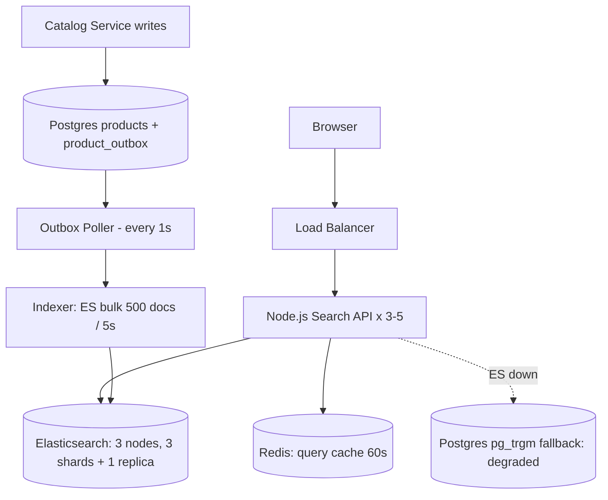
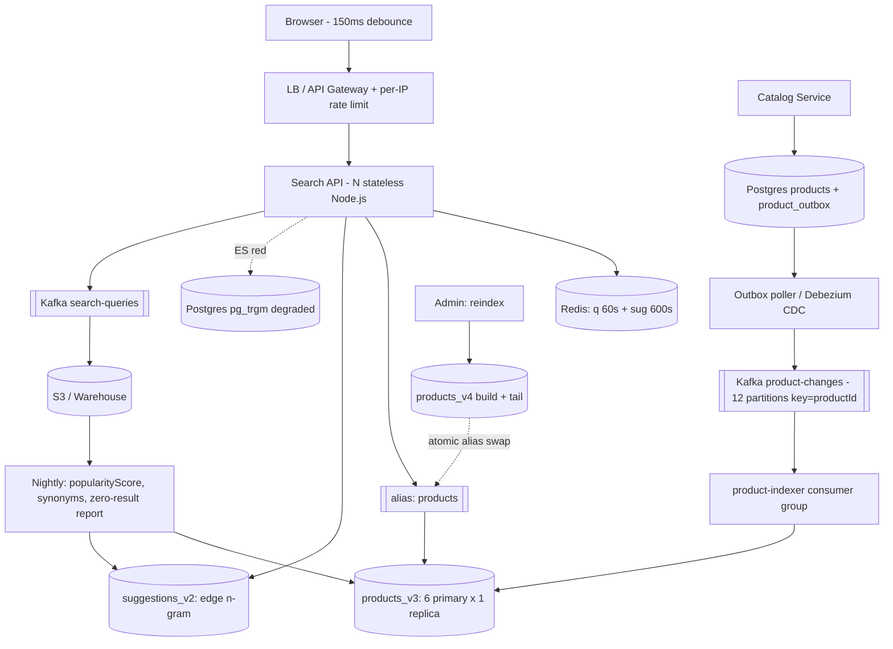

# Search System -- HLD + LLD (Part 5: Trade-offs -> 3 Versions -> Follow-ups -> Node.js Questions)

> Is file mein prompt ke **Parts 21-25** hain: search ke har bade decision ka trade-off (Postgres FTS vs Elasticsearch se lekar BM25 vs vector search tak), MVP -> Scalable -> Highly Scalable teen versions, 24 interviewer follow-up questions, 13 requirement-change ("What if...") questions, aur Node.js specific questions -- sab isi 50M product wale search system par.
> Part 4 recap: humne dekha ki 1x se 20x sale-day traffic par kya pehle tootta hai (**ES query latency aur JVM heap**, disk nahi), kaun kaun fail ho sakta hai aur tab kya hota hai (ES red -> Redis stale cache -> Postgres `pg_trgm` degraded search -> `503`; Kafka lag -> `indexer_lag_seconds` badhta hai par search chalti rehti hai), consistency kitni chahiye ("30 s eventual OK, par price/stock galat dikhana business problem hai" -- isliye `version_type: external`), aur kya monitor karna hai (`search_latency_seconds`, `indexer_lag_seconds`, `search_zero_results_total`, `es_jvm_heap_used_percent`, `search_degraded_total`).
> Ab wahi decisions **"kyun ye, kyun woh nahi"** ki language mein bolna seekhenge -- interview mein yahi hissa alag karta hai.

Ek line mein system yaad kar lo, kyunki har answer isi par tika hai:

```
Browser (150 ms debounce)
  -> LB / API Gateway  (per-IP rate limit)
  -> Search API (N stateless Node.js)
       |-- Redis: q:<sha1(...)> 60 s  +  sug:<prefix> 600 s
       |-- QueryBuilder -> ES DSL (bool: must / filter / should + function_score)
       -> Elasticsearch: `products_v3` behind alias `products` (6 primary x 1 replica)
                         `suggestions_v2` (edge n-gram, chhota, RAM mein)
Postgres `products` (SOURCE OF TRUTH) + `product_outbox`
  -> outbox poller / Debezium -> Kafka `product-changes` (12 partitions, key=productId)
  -> `product-indexer` consumer group -> ES bulk API
Side: query logs -> Kafka `search-queries` -> S3/warehouse -> popularityScore (nightly)
```

Numbers jo baar baar aayenge: **50M products, ~100 GB raw / ~130 GB ES primary data, 6 shards + 1 replica = ~260 GB, 20M searches/day = 231 QPS avg / ~1,000 peak / ~4,600 sale day, autocomplete 80M/day = ~925 QPS avg / ~4,000 peak, 5M updates/day = 58/s avg aur ~500/s flash sale, p95 < 200 ms, autocomplete p99 < 100 ms, zero-result target < 5%.**

---

## PART 21 -- Trade-offs: har decision ka "kyun ye, kyun woh nahi"

### Pehle rule samjho

Search ke interview mein sabse common galti: **"Elasticsearch use karunga"** bol dena, catalog size poochhe bina. Interviewer ye sunna chahta hai:

```
Requirement kya hai -> Options kya hain -> Har option ki keemat kya hai -> Is requirement par kaunsi keemat chalegi
```

Hamari requirements yaad rakho: **50M docs, typo + synonyms + stemming, facet counts, p95 < 200 ms, 30 s tak stale chalega, 99.95% availability, ES cluster ka bill control mein rehna chahiye.** Har table ke end mein **hamare system ka decision** hai.

---

### 1. Postgres FTS vs Elasticsearch vs Algolia/Typesense vs Solr vs Meilisearch

Pehle terms:

- **FTS (Full-Text Search)** -- text ko words (tokens) mein todke index karna, taaki `LIKE '%x%'` wala full scan na karna pade.
- **`tsvector`** -- Postgres ka column type jo document ke stemmed tokens + positions rakhta hai. `to_tsvector('english', 'Running Shoes')` -> `'run':1 'shoe':2`.
- **GIN index** -- Generalized Inverted Index. Postgres ka apna inverted index: `token -> row ids`. Yahi cheez ES bhi karta hai, bas Postgres mein ek table ke andar.
- **`pg_trgm`** -- trigram extension: har string ko 3-letter tukdon mein todta hai (`iphone` -> `iph`, `pho`, `hon`, `one`), jisse `similarity()` aur fast `ILIKE '%x%'` dono possible ho jaate hain. **Typo tolerance ka Postgres wala jugaad yahi hai.**

| | Postgres FTS (`tsvector` + GIN + `pg_trgm`) | Elasticsearch / OpenSearch (hamara) | Algolia / Typesense (hosted search) | Apache Solr | Meilisearch |
|---|---|---|---|---|---|
| **Pros** | Pehle se hai -- **zero naya infra**; search aur data ek hi transaction mein, **koi sync lag nahi**; `JOIN` kar sakte ho (sellers, inventory); backup/DR pehle se solved; team ko SQL aata hai | Distributed by design (shards); BM25 + fuzzy + synonyms + analyzers ka poora control; **aggregations = facet counts almost free**; `search_after`, alias swap, percolator; ecosystem (Kibana, Beats) | Sub-50 ms typo-tolerant search **bina kisi ops ke**; typo tolerance default on; instant-search UI widgets ready; relevance dashboard non-engineers ke liye | ES jaisa hi Lucene par; mature faceting; Apache 2.0 license (koi licensing drama nahi); ZooKeeper-based SolrCloud | Bahut fast typo-tolerant search, **single binary**, RAM-friendly, API simple; dev experience shandaar |
| **Cons** | Facet counts mehenge (har facet = ek aur `GROUP BY` over matching rows); ranking tuning bahut limited (`ts_rank` mein BM25 jaisa `k1`/`b` nahi); typo sirf `pg_trgm` se, aur woh alag index + alag query path; **search load aapke primary OLTP DB par**; single node (read replicas se scale, shard nahi) | Ek aur poora distributed system operate karna: JVM heap, shards, mappings, rolling upgrades; **source of truth nahi** -> sync pipeline banani padegi; RAM-heavy (mehenga); mapping change = reindex | Per-record + per-operation **pricing 50M docs par bahut mehengi** ho jaati hai; data vendor ke paas; custom ranking logic unke model ke andar hi; vendor lock-in | Ops ES se bhi thoda purana feel deta hai; ZooKeeper ek aur moving part; cloud-managed options kam; community ES ke muqable chhoti | 50M docs + heavy facets par ES jitna proven nahi; distributed sharding story ES jitni mature nahi; aggregations limited |
| **Ops capacity chahiye** | Bilkul nahi (DBA already hai) | **Sabse zyada** -- ek dedicated owner chahiye | Zero | Zyada | Kam |
| **Kab ye choose karunga** | Docs **< ~1M**, facets simple/kam, relevance "theek-thaak" chalega, team chhoti, budget zero | Docs **> ~5-10M**, facet counts chahiye, relevance tuning/typo/synonyms chahiye, search traffic DB ko hurt kar raha hai -- **hamara case** | Team mein search ka koi owner nahi aur catalog chhota/medium (< ~1M records), time-to-market sab kuch hai | Pehle se Solr shop ho, ya ES ke licensing history se dur rehna ho aur Lucene-level control chahiye | Docs kuch lakh tak, typo-tolerant instant search chahiye, ek chhoti team, self-host karna hai |
| **Kab ye NAHI** | 50M docs + har query par 3 facet counts -> `GROUP BY` mein DB CPU khatam | 50K products ki dukaan -- **overengineering** | 50M docs -> bill lakhon mein | Naya greenfield project jahan team ES jaanti hai | 50M docs + 4,600 QPS sale day |

**Ye line interview mein saaf bolni hai:**

> "Agar catalog **1 million se kam** hai aur relevance requirement simple hai, toh sahi jawab **Postgres FTS** hai -- `tsvector` + GIN index + `pg_trgm` typo ke liye. Elasticsearch wahan **overengineering** hai: ek aur cluster, ek aur sync pipeline, ek aur cheez jo 3 baje raat ko red ho sakti hai, aur badle mein kuch nahi. ES tab justify hota hai jab in chaar mein se koi sach ho: (a) docs ~5-10M se upar, (b) har query par facet counts chahiye, (c) relevance tuning / typo / synonyms product requirement hai, (d) search ka load OLTP DB ko hurt kar raha hai. Hamare case mein **chaaron sach hain** -- 50M docs, 3 facets, typo + synonyms, aur 231 QPS search jo Postgres par nahi daal sakte."

**Decision table -- kaunsa system, kis situation mein:**

| Catalog size | Facets chahiye? | Relevance tuning chahiye? | Team size | Budget / ops capacity | Jawab |
|---|---|---|---|---|---|
| < 100K | Nahi / 1-2 simple | Nahi | 1-3 devs | Zero | **Postgres FTS**. Bas. |
| 100K - 1M | Haan, par category page par (precomputed) | Thoda (title boost) | 3-8 devs | Kam | **Postgres FTS** + `pg_trgm` + precomputed facet counts table |
| 100K - 1M | Haan, dynamic | Haan, typo mandatory | Koi bhi | Paisa hai, ops nahi | **Algolia / Typesense / Meilisearch** (hosted ya single binary) |
| 1M - 10M | Haan, dynamic | Haan | 8+ devs | Ek banda search own kar sakta hai | **Elasticsearch / OpenSearch** (3 nodes) |
| > 10M | Haan | Haan, continuous tuning | Dedicated search team | Cluster ka bill afford kar sakte ho | **Elasticsearch / OpenSearch** (hamara V3) |
| > 10M | Haan | Haan | Team Lucene-level control chahti hai / licensing concern | Ops strong | **Solr** |

**Decision:** "Hamare 50M docs, dynamic facets, typo + synonyms aur 1,000 QPS peak par **Elasticsearch/OpenSearch** hi sahi jawab hai. Lekin main ye bhi bolunga ki agar ye 200K products ka niche marketplace hota, toh main Postgres `tsvector` + GIN se start karta aur ES ko ek line bhi nahi chhoota -- kyunki ES ki asli keemat servers nahi, **ops aur sync pipeline** hai."

---

### 2. Self-hosted ES vs Elastic Cloud vs AWS OpenSearch Service

Thoda history samajh lo kyunki interviewer aksar poochhta hai: 2021 mein Elastic ne Elasticsearch ka license Apache 2.0 se hata ke **SSPL/Elastic License** kar diya (matlab cloud providers usse managed service ke roop mein nahi bech sakte). AWS ne us waqt ke open source code se **OpenSearch** fork kar liya (Apache 2.0). 2024 mein Elastic ne AGPL bhi ek option ke roop mein wapas add kiya. Result: aaj **do parallel projects** hain jo ~7.10 tak same the, uske baad alag ho gaye -- APIs 90% same, par features aur versions diverge karte hain.

| | Self-hosted ES/OpenSearch (EC2 / k8s) | Elastic Cloud (Elastic ka apna managed) | AWS OpenSearch Service (managed) |
|---|---|---|---|
| **Pros** | Sabse sasta per GB RAM; poora control (JVM flags, plugins jaise LTR, custom analyzers); version aap chunte ho; kisi bhi cloud par | Latest Elastic features (ELSER semantic model, LTR plugin, searchable snapshots); upgrades one click; Elastic ka support; Kibana included | AWS ke andar hi (IAM, VPC, CloudWatch, KMS); snapshots S3 mein automatic; billing ek jagah; Apache 2.0 license, koi licensing risk nahi |
| **Cons** | **Aap hi on-call ho**: rolling upgrade, disk full, heap pressure, node replace, snapshot restore; k8s par ECK operator seekhna | Sabse mehengi per GB; Elastic license (SSPL/Elastic) ki terms padhni padti hain; AWS account ke bahar (ya AWS marketplace se, thoda indirect) | Version usually **peeche** chalta hai; kuch plugins allowed nahi (custom JVM plugin nahi daal sakte); "blue/green" upgrades mein cluster thodi der slow; ES ke naye features yahan nahi aayenge (alag project hai) |
| **Ops cost** | Highest | Lowest | Low |
| **Version lock** | Aap decide karo | Elastic ki release train | **AWS ki release train -- sabse zyada lock** |
| **Kab ye choose karunga** | Team ke paas dedicated infra/search engineer hai, cost sabse bada factor hai, ya LTR jaise plugin chahiye | Latest ES features (semantic search, ELSER, LTR) chahiye aur ops team chhoti hai | Pehle se AWS shop ho, IAM/VPC/compliance story important ho, aur "bas kaam karna chahiye" attitude ho -- **hamari default choice** |

**Decision:** "Main **AWS OpenSearch Service** se start karunga, kyunki hamari baaki chizen (RDS, MSK, S3) already AWS mein hain aur mujhe ek aur cluster **on-call** nahi rakhna. Trade-off saaf hai: version thoda peeche rahega aur LTR jaisa custom plugin nahi daal paunga. Jis din Learning-to-Rank ya ELSER semantic search product requirement ban jaaye, main Elastic Cloud par jaaunga -- aur self-host sirf tab jab bill itna bada ho ki ek full-time engineer usse sasta pade."

---

### 3. Shards vs Replicas -- kaun sa kya scale karta hai

Ye sabse zyada confuse hone wala point hai, isliye ek line mein:

```
Shards    = data ko kaat kar parallel mein search karna     -> INDEX SIZE + indexing throughput scale karta hai
Replicas  = same data ki extra copies                        -> READ QPS + availability scale karta hai
```

| | Zyada primary shards | Zyada replicas |
|---|---|---|
| **Kya scale hota hai** | Index kitna bada ho sakta hai; indexing throughput (bulk requests alag nodes par bat-te hain); ek query ka kaam parallel mein bat-ta hai | Kitni concurrent queries serve kar sakte ho (har replica query le sakti hai); node down par data loss nahi |
| **Pros** | Har shard chhota = merge sasta, recovery fast; 6 shards x 22 GB = 6 nodes par ek-ek | Read QPS lineary badhti hai; node fail ho toh cluster green rehta hai (bas yellow ho ke wapas) |
| **Cons** | Har query **har shard** par jaati hai -> coordinating node ko 6 jawab merge karne padte hain; **bahut zyada chhote shards = "oversharding"**, har shard ka apna Lucene overhead + heap; shard count **baad mein badla nahi ja sakta** (reindex chahiye) | Har replica = **poora disk ka doosra copy** + har indexing operation dobara hota hai -> indexing cost x(1 + replicas); RAM bhi chahiye |
| **Kab badhaunga** | Data badh raha hai (shard 40-50 GB cross kar raha) ya indexing throughput bottleneck hai | Search QPS badh rahi hai, ya CPU har node par high hai aur data utna hi hai |
| **Kab NAHI** | "QPS badh gayi" -- ye shard ka jawab nahi hai, replica ka hai | "Index bahut bada ho gaya" -- replica se space aur kharab hoga |

**Hamare numbers par:** 130 GB primary data / 6 shards = ~22 GB per shard (target band 25-40 GB ke andar), 1 replica = 12 shards total = ~260 GB, 6 data nodes (2 shards each, 64 GB RAM, **31 GB JVM heap** -- 32 GB se upar kabhi nahi kyunki JVM ka compressed object pointers wahin band ho jaate hain aur effective memory ghat jaati hai), + 3 dedicated master nodes (quorum, split-brain se bachne ke liye).

**Decision:** "Sale day par 4,600 QPS chahiye toh main **replicas badhata hoon, shards nahi** -- `PUT products/_settings {"number_of_replicas": 2}` live chalta hai, downtime zero, bas disk aur indexing load badhta hai. Shard count badlana = poora reindex, wo sale ke din nahi hota. Isliye shard count din 1 par **future ke liye** decide karta hoon: 50M -> 200M ka plan ho toh aaj hi 12 shards le lunga, bhale aaj wo 11 GB ke hon."

---

### 4. Index-time work vs Search-time work

Search ka central trade-off yahi hai: **har kaam ya toh ek baar index karte waqt karo (50M docs x ek baar), ya har query par karo (1,000 QPS x hamesha).** Do concrete examples se samjho.

| | Index time par kaam (edge n-gram) | Search time par kaam (synonym_graph) |
|---|---|---|
| **Kya hota hai** | `iphone` -> index mein `ip, iph, ipho, iphon, iphone` sab terms ban jaate hain. Query `iph` ek simple term lookup ban jaati hai -- O(1) | `mobile` query aate hi analyzer usse `mobile OR smartphone OR "cell phone"` mein expand karta hai. Index mein sirf original term pada hai |
| **Pros** | Query bilkul sasta -- autocomplete ka p99 < 100 ms isi se milta hai; koi prefix scan nahi | **Synonym list badalne par reindex nahi chahiye** -- bas `POST /products/_reload_search_analyzers`; ops team synonyms roz add kar sakti hai |
| **Cons** | **Index size badhta hai** (ek word ke 5-19 terms); aur sabse bada: **list badli toh poora reindex** (analyzer change = reindex, hamesha) | Har query par extra terms -> zyada postings lists padhni padti hain -> latency thodi badhti hai; multi-word synonyms ("cell phone") ka graph handling tricky hai |
| **Kab ye choose karunga** | Jo cheez **kabhi kabhi** badalti hai aur query par bahut mehengi hai: autocomplete prefixes, stemming, lowercase, ASCII folding | Jo cheez **roz badalti** hai aur query par sasti hai: synonyms, kuch business rules |

**Decision:** "Autocomplete ke liye **index time** (edge n-gram) -- kyunki 4,000 QPS par query sasti honi chahiye, aur prefix ki definition kabhi nahi badalti. Synonyms **search time** -- kyunki category team hafte mein 20 naye synonyms add karti hai aur main har baar 50M docs reindex nahi kar sakta. General rule: **jo kabhi nahi badalta usse index time par pre-compute karo; jo roz badalta hai usse query time par rakho.**"

---

### 5. Zyada fields index karo vs Index size / indexing cost

| | Har field indexed (description, attributes, seller name, reviews...) | Sirf zaruri fields |
|---|---|---|
| **Pros** | User kuch bhi likhe, match mil jaata hai; recall high; "zero results" kam | Index chhota -> zyada RAM mein fit -> fast; indexing fast; merge sasta |
| **Cons** | Index size badhta hai (reviews add kiye toh 130 GB -> 400 GB aaram se); **relevance kharab ho sakti hai** -- 2,000 word description mein "case" aa hi jaayega, toh iPhone 15 ka page bhi "iphone case" par match karega; har doc reindex mehenga | Kuch legit queries miss hongi (ek user brand ke old name se dhoondh raha hai) |
| **Kab ye choose karunga** | Jab zero-result rate high ho aur queries long-tail hon | Jab precision matter karti ho (shopping mein karti hai) aur index budget tight ho |

**Decision:** "Main fields **weighted** karta hoon, sabko barabar nahi: `"fields": ["title^3", "brand^2", "description"]`. Title mein match sabse strong signal hai, description last resort. Reviews ko index **nahi** karta -- 50M x 20 reviews se index 3x ho jaayega aur relevance kharab hogi (review mein 'case' likha hoga). Ek aur cheez: fields jo sirf **filter** hote hain (`sellerId`) unhe `keyword` rakhta hoon, `text` nahi -- analysis ka kaam bachta hai. Aur jo field na search hoti hai na filter, usse `"index": false` kar do -- `_source` mein rahegi, inverted index mein nahi."

---

### 6. `_source` enabled vs disabled

**`_source`** = ES har doc ka original JSON bhi store karta hai. Search result mein jo document wapas milta hai, wahi hai.

| | `_source` enabled (default, hamara) | `_source` disabled |
|---|---|---|
| **Pros** | Result mein poora doc milta hai -> ek call mein UI ban jaata hai; **`_reindex` kaam karta hai** (naya index purane ke `_source` se banta hai); `_update` aur partial update possible; `update_by_query` possible; debugging aasaan | ~20-30% disk bachta hai; indexing thodi fast |
| **Cons** | Disk aur cache mein jagah (hamare 130 GB ka bada hissa); bade docs -> bade responses -> Node mein JSON parse ka CPU (Part 25 Q1) | **`_reindex` marr jaata hai** -- naya index banane ke liye data Postgres se dobara stream karna padega; `_update` nahi chalega; result se doc nahi milega, sirf IDs -> **hydration** mandatory ho jaata hai |
| **Kab ye choose karunga** | Lagbhag hamesha. Search system ka `_reindex` + alias swap wala flow isi par khada hai | Sirf tab jab docs bahut bade hon aur aap waise bhi DB se hydrate karte ho, aur reindex ke liye ek reliable "replay from source" pipeline already ho |

**Decision:** "`_source` **on**, lekin query mein hamesha **`_source` includes** dunga: `"_source": ["productId","title","brand","price","rating","inStock"]`. Matlab data disk par poora hai (reindex ke liye), par network par sirf 6 fields aate hain. Ye best of both hai -- aur Part 25 mein dekhoge ki yahi ek change Node ke CPU ko aadha kar deta hai."

---

### 7. Poora document ES mein store karo vs Search ke baad Postgres se hydrate karo

**Hydration** = ES se sirf `productId` list lo, phir un IDs ko Postgres se `WHERE id = ANY($1)` karke asli data uthao. Ye ek **asli** trade-off hai, dono taraf achhe arguments hain.

| | ES = display store (poora doc ES se aata hai -- hamara) | ES = pure ID-finder (hydrate from Postgres) |
|---|---|---|
| **Pros** | **Ek hi network call** -> latency budget mein aaram (60-120 ms ES, bas); Postgres par search traffic ka zero load; ES down ho toh bhi cache se poore results serve ho sakte hain | **Price/stock hamesha 100% fresh** -- kyunki DB se aa rahe hain, indexing lag ka farq hi nahi padta; ES chhota rehta hai (sirf searchable fields); "search mein dikha 999, cart mein 1,299" wala bug possible hi nahi |
| **Cons** | ES mein data 30 s tak **stale** ho sakta hai -> user ko purani price dikh sakti hai; index bada; har field change par doc reindex | **Ek aur round trip** (~10-25 ms) har search par; 24 results = ek `IN (24 ids)` query **1,000 QPS par = 1,000 extra Postgres queries/sec** -- ye aapke OLTP DB par asli load hai; agar DB slow hua toh search bhi slow; ordering ES se aati hai aur DB rows ko manually us order mein wapas lagana padta hai |
| **Consistency** | Eventual (hamara 30 s SLA) | Strong for hydrated fields, eventual for matching |
| **Kab ye choose karunga** | Read-heavy search jahan 30 s staleness chalti hai, aur DB ko bachana priority hai -- **hamara case** | Jab data **bahut** volatile ho (stock exchange, flight seats, auction bids) ya compliance keh raha ho ki display hamesha source of truth se ho |

**Hamara hybrid (interview mein yahi bolo):**

> "Main **hybrid** leta hoon. Search results ke liye ES se seedha `title, brand, price, rating, inStock` -- ek call, fast. Lekin do exceptions: (1) **exact `stock_qty` kabhi index nahi karta** -- sirf `inStock` boolean, kyunki har quantity change par reindex karna segment churn hai. Exact quantity product page par DB/Redis se aati hai. (2) **price ka indexing debounced hai** (30 s batch window) aur **product page par price DB se re-verify hoti hai** -- toh search mein purani price dikh bhi jaaye, add-to-cart par sahi price lagegi. Trade-off jo maine accept kiya: ek user ko search page par 30 s tak purani price dikh sakti hai. Trade-off jo maine reject kiya: 1,000 QPS ka hydration load Postgres par."

---

### 8. CDC / Debezium vs Outbox polling vs Dual write

**Dual write** = app Postgres mein bhi likhe aur ES mein bhi, seedha. **Outbox** = ek hi transaction mein `products` update + `product_outbox` row insert, phir ek poller outbox se padhke Kafka mein daale. **CDC (Change Data Capture)** = Debezium Postgres ke **WAL (write-ahead log)** ko padhta hai aur har row change ko Kafka event bana deta hai.

| | Dual write | Outbox polling (hamara v1) | CDC / Debezium |
|---|---|---|---|
| **Pros** | Sabse simple code -- 2 lines | **Atomic**: product change aur outbox row ek hi transaction mein, dono ya koi nahi; ordering `id` se; replay possible (`published_at IS NULL`); koi extra infra nahi, bas ek worker | Zero application code -- table par likho, event apne aap; poll ka latency nahi (WAL tail, ~ms); `DELETE` aur out-of-band SQL updates bhi pakad leta hai |
| **Cons** | **Permanent divergence**: DB commit ho gaya aur ES call fail -> product hamesha ke liye search se gayab; ya ES ho gaya aur DB rollback -> search mein ghost product. Retry se bhi guarantee nahi | Poller latency (hamara 1 s poll); ek aur worker; outbox table ko cleanup chahiye (purane published rows delete/partition) warna table badhti rehti hai | Ek aur distributed system (Kafka Connect + Debezium) operate karna; Postgres par **replication slot** -- agar consumer ruk gaya toh WAL jamta hai aur **DB ka disk bhar sakta hai** (ye real incident hai); schema change handling tricky; event mein "business intent" nahi hoti, sirf raw row diff |
| **Kab ye choose karunga** | **Kabhi nahi** production search mein. Prototype mein chalega | Default. Team chhoti, Postgres already hai, ek worker manage kar sakte ho -- **hamari V2/V3 choice** | Jab bahut saari tables/services se changes chahiye, ya jab legacy code bhi DB likhta hai jise aap badal nahi sakte, aur Kafka Connect ka ops already hai |

**Decision:** "**Outbox**, kyunki wo ek plain Postgres transaction hai -- koi naya system nahi aur guarantee 100% hai. Debezium bhi bilkul valid hai aur latency better deta hai; main usse tab lunga jab teen-chaar aur services ko bhi yahi changes chahiye hon, ya poll ka 1 s bhi bahut lagne lage. **Dual write main kabhi nahi karunga** -- aur interview mein iska reason ek line mein bolunga: do alag systems mein do alag writes ko atomic banane ka koi tarika nahi hai, bina distributed transaction ke, aur wo apni alag musibat hai."

---

### 9. Sync indexing vs Async indexing

| | Sync (seller ka API call hi ES tak jaaye) | Async (outbox -> Kafka -> indexer worker -- hamara) |
|---|---|---|
| **Pros** | Seller ko turant "ab search mein hai" ka confirmation; debugging seedha | ES down ho toh bhi **seller apna product save kar sakta hai** (ye availability ka bada point hai); bulk batching possible (500 docs / 5 MB / 1 s) -> ES par 100x kam requests; retry + backoff free mein; flash sale ke 500 updates/sec ko queue absorb kar leti hai |
| **Cons** | ES slow/down = **seller ka API bhi slow/down**; har update ek separate ES request (bulk nahi) -> ES par bahut zyada load; write latency mein ES ka p99 add ho jaata hai | **Lag** -- hamara SLA 30 s; user ko "maine update kiya, dikha nahi" feel hota hai; ordering ko sambhalna padta hai (isliye Kafka key = `productId` + `version_type: external`); ek aur worker monitor karna |
| **Kab ye choose karunga** | Chhota system, kuch hi updates/day, ya admin tool jahan "turant dikhna" hard requirement hai | 5M updates/day, availability 99.95%, bulk indexing chahiye -- **hamara case** |

**Decision:** "Async, hamesha. Lekin UX ka gap main product-level par bharta hoon: seller dashboard par 'Indexing... usually under 30 seconds' dikhata hoon aur `updatedAt` vs `indexed_at` se status. Aur ek chhota **sync read-your-own-write** exception: seller apne hi products ki list Postgres se padhta hai, ES se nahi -- toh usse apna change turant dikhta hai. Search sirf public queries ke liye hai."

---

### 10. Search results cache karo vs Hamesha fresh

| | Redis cache (`q:<sha1(...)>`, TTL 60 s -- hamara) | Hamesha ES se fresh |
|---|---|---|
| **Pros** | **Head queries = traffic ka ~30%** (Zipf: top 1,000 queries). Cache se ~30% requests ES tak jaati hi nahi -> ES cluster chhota rakh sakte ho -> seedha paisa bachta hai; p95 latency girti hai (Redis ~1 ms vs ES 60-120 ms); **ES down hone par stale results ek fallback layer hai** | Price/stock/ranking hamesha latest; koi cache invalidation ka sar dard nahi; personalization possible |
| **Cons** | 60 s tak purana result (out-of-stock product dikh sakta hai); cache key mein **sab kuch** aana chahiye -- query + filters + sort + page, warna galat result serve hoga; personalization ke saath hit rate ~0% ho jaata hai; memory | ES par poora 1,000 QPS -> zyada nodes -> zyada bill; tail latency pura ES ka |
| **Kab ye choose karunga** | Anonymous, page 1, no personalization -- yahi 80% traffic hai | Logged-in personalized results, ya page 2+ (jinki hit rate waise bhi bekar hai) |

**Decision:** "Cache **sirf page 1, sirf non-personalized, TTL 60 s**. Key `q:<sha1(normalizedQuery + filters + sort + page)>` -- `normalizedQuery` matlab lowercase + trim + extra spaces hata ke, taaki `iPhone Case` aur `iphone  case` ek hi key hon. 60 s isliye ki price update ka SLA 30 s hai aur ek cache TTL usse do guna se zyada nahi honi chahiye. Aur ek bonus: ES red hone par main **expired cache bhi serve karta hoon** (`degraded: true` ke saath) -- stale results, no results se behtar hain."

---

### 11. Facets: ES aggregations (on the fly) vs Precomputed counts

| | ES aggregations (hamara) | Precomputed counts (nightly job -> table/Redis) |
|---|---|---|
| **Pros** | **Current result set ke hisaab se sahi counts** -- "Samsung (1,204)" matlab aapki query + baaki filters ke andar 1,204. Yahi user expect karta hai; koi extra pipeline nahi | Query time par **zero cost** -- bas ek lookup; category landing pages ("Mobiles -> Samsung (45,201)") ke liye perfect |
| **Cons** | Har aggregation **poore matching set** par chalti hai -> hamare budget mein `+20-40 ms`; 3 aggs = 3x; high-cardinality field (`sellerId`, 20,000 sellers) par aggregation heap kha jaati hai; `terms` agg distributed setup mein **approximate** hoti hai (har shard apne top N bhejti hai, coordinating node merge karta hai -> tail counts thode galat) | **Query-specific ho hi nahi sakta** -- "iphone case" + "under 2000" ke liye brand counts precompute karna combinatorially impossible hai |
| **Kab ye choose karunga** | Search results page, jahan facets query par depend karte hain | Category/browse pages jahan koi `q` hai hi nahi -- wahan filters fixed hain aur counts roz badalte hain |

**Decision:** "**Dono.** Search page par ES aggregations (`brands`, `categories`, `price_ranges`, har ek `size: 10`) -- kyunki counts query ke hisaab se sahi hone chahiye. Category browse pages par precomputed counts Redis se -- wahan query nahi hai, toh nightly job kaafi hai aur ES ka 30 ms bach jaata hai. Optimization jo main pehle karunga: **facets sirf page 1 par maango**. Page 2 par user facets nahi badal raha, wo already frontend ke paas hain -- 60% aggregations bach gayin bina kisi UX nuksaan ke."

---

### 12. BM25 tuning vs Learning-to-Rank vs Vector / Semantic search

Teeno **alag cheezein** hain, ek dusre ke replacement nahi. Pehle terms:

- **BM25** -- ES ka default scoring: term frequency (saturating, `k1 = 1.2`) x inverse document frequency x field length normalization (`b = 0.75`). Poora **lexical** hai -- shabd milna chahiye.
- **LTR (Learning to Rank)** -- ek ML model (usually gradient-boosted trees) jo top ~100 BM25 results ko **re-rank** karta hai, features ke aadhar par (BM25 score, CTR, price rank, seller rating, recency...). Training data chahiye: clicks/purchases se banaya gaya "judgement list".
- **Vector / semantic search** -- query aur documents ko embeddings (numbers ka vector) mein badlo, phir **kNN** (k nearest neighbours) se nazdeek wale dhoondho. Ye **meaning** match karta hai, shabd nahi -- "gift for a 5 year old boy" -> toys, bina "toy" shabd ke.

| | BM25 + `function_score` tuning (hamara v1) | Learning to Rank | Vector / semantic (kNN) |
|---|---|---|---|
| **Kya chahiye** | Kuch nahi -- bas ES aur domain sense | **Training data** (clicks, purchases, ya human judgements), feature store, model training pipeline, ES LTR plugin | Embedding model (inference cost har query aur har doc par), HNSW index (RAM-heavy), reindex on model change |
| **Pros** | Explainable (`_explain` API se exact score breakdown), turant deploy, sasta; 80% relevance yahin se aa jaati hai | Signals ko automatically weigh karta hai; woh patterns pakadta hai jo hand-tuning miss karti hai; usually **+5-15% CTR/conversion** deta hai jab data achha ho | Vocabulary mismatch solve karta hai ("laptop bag" vs "notebook sleeve"); natural-language queries; typo-robust by nature |
| **Cons** | Hand-tuning = guesswork; weights ki ladai (`popularityScore` 0.3 kyun, 0.5 kyun nahi); business boosts BM25 ko dabaa sakte hain | Black box -- "ye result upar kyun hai" ka jawab mushkil; **feedback loop**: jo upar dikhta hai wahi click hota hai wahi model ko aur upar bhejta hai; training pipeline maintain karni padti hai; bina traffic ke train hi nahi hoga | Exact match kharab kar sakta hai -- user ne model number `A2483` daala aur semantic search "kuch milta-julta" le aaya; kNN mehenga (RAM + CPU); embeddings model change = **poora reindex** |
| **Kab ye choose karunga** | **Hamesha pehle.** Day 1 se lekar tab tak jab tak ye clearly limit na ban jaaye | Jab traffic itna ho ki clicks se signal nikle (roz lakhon searches -- hamare 20M/day par haan) aur BM25 tuning plateau kar chuki ho | Jab **long natural-language queries** ka hissa bada ho, ya zero-result rate mein bada chunk vocabulary mismatch ho |
| **Kab ye NAHI** | Jab aapke paas mahine bhar ka click data pada hai aur aap use nahi kar rahe | Naye product mein (data hi nahi), ya chhoti team mein | Jab queries chhoti aur keyword-type hon ("iphone 15 case") -- wahan BM25 already jeet raha hai |

**Decision (aur ye interview ka best answer hai):**

> "Main teen phases mein sochta hoon. **Phase 1: BM25 + `function_score`** -- `popularityScore` par `log1p` (weight 0.3), `inStock` boost 1.2, `boost_mode: multiply`. Rule: **text relevance ko multiply karo, replace mat karo** -- warna sabse popular product har query par aayega. **Phase 2: analytics se tuning** -- zero-result queries se synonyms, CTR se field boosts. **Phase 3: hybrid search** -- BM25 aur kNN dono chalao aur scores ko RRF (reciprocal rank fusion) se milao, kyunki pure vector search exact model numbers par kharab hai. **LTR sabse last**, kyunki uska payoff tabhi hai jab baaki sab tuned ho -- aur usse pehle mujhe ek **offline evaluation setup** chahiye, warna mujhe pata hi nahi chalega ki model ne relevance sudhaari ya bigaadi."

---

### 13. Exact total count vs `track_total_hits` approximation

| | Exact count (`track_total_hits: true`) | Approximate / capped (`track_total_hits: 10000` -- hamara) |
|---|---|---|
| **Pros** | "1,204 results" precisely; page count exact nikalta hai | ES **early termination** kar sakta hai -- 10,000 doc count hone ke baad counting band. Broad queries ("shirt" -> 2M matches) par ye **bada** saving hai; latency predictable |
| **Cons** | Har matching doc count karna padta hai chahe aap 24 hi dikha rahe ho -- 2M match par pura scan; latency broad queries par blow up | Response mein `"total": {"value": 10000, "relation": "gte"}` -- UI ko "10,000+ results" dikhana padega; exact page count nahi bana sakte |
| **Kab ye choose karunga** | Jab count khud product feature ho (admin dashboards, reports, "aapke 47 orders") | Consumer search -- **koi user 10,000 se aage nahi jaata**. `SearchResponse.totalIsLowerBound: true` isi ke liye hai |

**Decision:** "`track_total_hits: 10000`. Interview line: 'Exact total nikalna mehenga hai aur uski **business value zero** hai -- koi user page 417 par nahi jaata. Main "10,000+ results" dikhata hoon aur us saving ko latency budget mein daal deta hoon.' Ye aur **deep pagination** wala decision ek hi soch se aate hain: search UI ka kaam top 20 results theek dena hai, poori list dena nahi."

---

### 14. Prompt ke generic pairs -- search par kya lagta hai, kya nahi

| Pair | Search par relevant? | Decision |
|---|---|---|
| **SQL vs NoSQL** | Haan, par shayad waise nahi jaise soch rahe ho | **Postgres = source of truth** (transactions, constraints, `price_paise BIGINT`, FKs), **ES = derived read model**. Ye classic CQRS hai: write model relational, read model search-optimized. ES ko kabhi source of truth mat banao -- usme transactions nahi hain aur reindex se data wapas banana possible hona chahiye |
| **Kafka vs RabbitMQ** | Haan, indexing pipeline ke liye | **Kafka** -- kyunki mujhe (a) **key=`productId` se per-product ordering** chahiye, (b) **replay** chahiye (indexer mein bug tha -> offset reset karke 7 din dobara chala do), (c) **multiple consumers** same stream par (indexer, analytics, cache invalidator). RabbitMQ mein message consume hone ke baad chala jaata hai -- replay nahi. RabbitMQ tab better jab per-message routing/priority/TTL chahiye, jo yahan nahi chahiye |
| **REST vs WebSocket** | Search ke liye REST, aur ye clear hai | Search **request-response** hai, server push nahi karta. Autocomplete ke liye bhi REST + 150 ms debounce kaafi hai -- WebSocket sirf handshake ka overhead dega aur stateless API ka fayda cheen lega. Exception: agar "live" results chahiye ho (har keystroke par bina debounce ke), tab WebSocket consider karna, par tab bhi main pehle debounce badhata |
| **Polling vs WebSocket** | Nahi | Kuch subscribe nahi ho raha. Admin reindex progress dekhne ke liye chhota polling (`GET /admin/reindex/:id`) kaafi hai |
| **Sync vs Async** | Haan -- do jagah, do alag jawab | **Search query = sync** (user wait kar raha hai). **Indexing = async** (#9). Ye distinction interview mein explicitly bolna chahiye |
| **Cache vs no cache** | Haan | Head queries + popular prefixes par haan (#10). Page 2+ aur personalized par nahi -- hit rate hi nahi milega |
| **UUID vs Snowflake** | Lagbhag nahi | `productId` pehle se UUID hai aur ES ka `_id` bhi wahi. Ek chhoti baat: **random UUIDs Postgres ke B-tree mein index bloat** karte hain (random insert points) -- agar ye naya system hota toh main UUIDv7 (time-ordered) leta. ES par koi asar nahi |

---

### Summary: saare decisions ek table mein

| Decision | Humne kya chuna | Kab badlenge |
|---|---|---|
| Search engine | Elasticsearch / OpenSearch | Catalog < 1M -> Postgres FTS; team mein ops nahi -> Algolia/Typesense |
| Hosting | AWS OpenSearch Service (managed) | LTR / ELSER chahiye -> Elastic Cloud; bill bahut bada -> self-host |
| Shards / replicas | 6 primary + 1 replica, 6 data nodes + 3 masters | QPS badhi -> replicas; data badha -> reindex with more shards |
| Autocomplete | Edge n-gram index (index-time work) + Redis prefix cache | Filters/personalization chahiye -> main index par `match_phrase_prefix` |
| Synonyms | `synonym_graph` search-time | Latency budget cross kare -> index-time (par reindex accept karna hoga) |
| `_source` | On, par query mein `_source` includes | Kabhi off nahi (reindex tut jaayega) |
| Display data | ES se seedha (hybrid: stock/price special) | Bahut volatile data -> hydrate from Postgres |
| Indexing pipeline | Outbox -> Kafka -> bulk indexer | Multi-table / legacy writers -> Debezium CDC |
| Indexing mode | Async, bulk (500 docs / 5 MB / 1 s) | Kabhi sync nahi |
| Caching | Redis `q:` 60 s page 1 only, `sug:` 600 s | Personalization aayi -> cache hit rate girega, re-rank karo cache ke baad |
| Facets | ES aggregations (page 1 only) | Category pages -> precomputed |
| Ranking | BM25 + `function_score` (multiply) | Data aane par hybrid kNN, phir LTR |
| Total count | `track_total_hits: 10000` | Admin/reporting -> exact |
| Pagination | `from/size` page <= 50, phir `search_after` | Export -> PIT + `search_after` |

> Interview line: "Search mein har decision do axes par hai -- **relevance vs cost**, aur **freshness vs latency**. Mera requirement 'p95 200 ms, 30 s staleness OK, bill control mein' hai, toh main har jagah thodi freshness aur thodi exactness bech ke latency aur cost kharidta hoon -- aur jahan business ko hurt hota hai (price, stock) wahan alag rasta rakhta hoon."

---

## PART 22 -- Minimum -> Scalable -> Highly Scalable (3 versions)

Interviewer 3 versions isliye maangta hai taaki dekhe ki tum **Day 1 par 6-node ES cluster + Kafka nahi laga doge**, aur tumhe pata hai ki **kaunsa metric** tumhe agle version par le jaayega.

---

### Version 1 -- MVP: Postgres only, koi Elasticsearch nahi

```
Browser
  |
  v
Node.js API (1-2 instances)
  |
  v
PostgreSQL
   products.search_vector (tsvector, GENERATED)  -> GIN index
   products.title                                -> GIN (gin_trgm_ops) for typos
```

**Schema change (asli SQL):**

```sql
CREATE EXTENSION IF NOT EXISTS pg_trgm;

ALTER TABLE products ADD COLUMN search_vector tsvector
  GENERATED ALWAYS AS (
      setweight(to_tsvector('english', coalesce(title, '')),       'A')
   || setweight(to_tsvector('english', coalesce(brand, '')),       'B')
   || setweight(to_tsvector('english', coalesce(description, '')), 'C')
  ) STORED;

CREATE INDEX products_fts_idx  ON products USING GIN (search_vector);
CREATE INDEX products_trgm_idx ON products USING GIN (title gin_trgm_ops);
CREATE INDEX products_brand_idx ON products (brand) WHERE status = 'active';
```

**Code Explanation:**

- `CREATE EXTENSION pg_trgm` -- trigram support on karta hai. Iske bina typo tolerance ka koi rasta nahi Postgres mein.
- `GENERATED ALWAYS AS (...) STORED` -- Postgres 12+ ka generated column. Matlab: **jab bhi `title`/`brand`/`description` badle, `search_vector` apne aap recompute ho jaata hai**. Trigger likhne ki zarurat nahi, aur sabse badi baat -- **koi sync lag nahi**, wahi transaction hai.
- `setweight(..., 'A' | 'B' | 'C')` -- Postgres FTS mein 4 weight classes hain (A sabse bhaari). Title ka match brand se strong, brand ka description se strong. Ye ES ke `"title^3", "brand^2"` ka Postgres version hai -- **lekin bahut kam control ke saath** (bas 4 levels, koi decimal nahi).
- `coalesce(x, '')` -- NULL ke saath `||` karoge toh poora vector NULL ho jaayega. Classic bug.
- `USING GIN (search_vector)` -- yahi asli **inverted index** hai. Iske bina `@@` bhi sequential scan karega.
- `USING GIN (title gin_trgm_ops)` -- alag index, alag kaam: `similarity()` aur `ILIKE '%x%'` ko fast banata hai. Dhyan do ki **do alag index, do alag query paths** hain -- ES mein ye ek hi analyzer chain ka hissa hota.

**Query (page 1, `LIMIT 20`):**

```sql
-- $1 = user ki query, $2 = brand filter (NULL allowed), $3/$4 = price range
SELECT p.id, p.title, p.brand, p.price_paise, p.rating, (p.stock_qty > 0) AS in_stock,
       ts_rank(p.search_vector, q) AS rank
FROM   products p,
       plainto_tsquery('english', $1) AS q
WHERE  p.search_vector @@ q
  AND  p.status = 'active'
  AND  ($2::text IS NULL OR p.brand = $2)
  AND  ($3::bigint IS NULL OR p.price_paise >= $3)
  AND  ($4::bigint IS NULL OR p.price_paise <= $4)
ORDER BY rank DESC, p.id
LIMIT 20;
```

**Code Explanation:**

- `plainto_tsquery('english', $1)` -- user ka raw text (`'iphone case'`) ko query mein badalta hai: `'iphon' & 'case'` (stemmed, AND se juda). `websearch_to_tsquery` bhi hai jo `"exact phrase"` aur `-exclude` samajhta hai -- production mein main wahi use karta.
- `FROM products p, plainto_tsquery(...) AS q` -- ye lateral join jaisa hai; query ko **ek baar** compute karke har row ke liye reuse karta hai. Agar aap `WHERE search_vector @@ plainto_tsquery(...)` inline likho toh Postgres usse bhi ek baar hi evaluate karta hai, par is form mein `q` ko `ts_rank` mein dobara use karna saaf lagta hai.
- `@@` -- "does this tsvector match this tsquery". **Yahi GIN index use karta hai.** Ye woh line hai jo `ILIKE '%x%'` ke 8-12 second wale full scan ko ~20 ms bana deti hai.
- `ts_rank(vector, query)` -- Postgres ka scoring. Ye TF-IDF ka bahut simplified cousin hai: term frequency aur weights dekhta hai, **par BM25 nahi hai** -- na `k1` saturation, na `b` length normalization, na IDF ka proper handling. Isliye relevance "theek hai" hoti hai, "achhi" nahi.
- `($2::text IS NULL OR p.brand = $2)` -- ek hi query se optional filters. Chhote scale par fine; bade scale par Postgres ka plan cache isse confuse ho sakta hai (isliye bade systems mein query builder se dynamic SQL banate hain).
- `ORDER BY rank DESC, p.id` -- `p.id` **tie-breaker** hai. Iske bina do equal-rank rows ka order run-to-run badal sakta hai aur pagination mein duplicate/missing rows aayenge. (Yahi reason ES mein `"sort": ["_score", {"productId": "asc"}]` hai.)
- `LIMIT 20` -- aur yahi is version ki honest seema hai: 20 rows ke liye Postgres ko pehle **saare matching rows** rank karne padte hain.

**Typo fallback (jab upar wali query 0 rows de):**

```sql
SELECT id, title, brand, similarity(title, $1) AS sim
FROM   products
WHERE  status = 'active' AND title % $1        -- % = "similar enough" (pg_trgm threshold)
ORDER BY sim DESC
LIMIT 20;
```

**Code Explanation:**

- `title % $1` -- `pg_trgm` ka similarity operator; default threshold `0.3` (`SET pg_trgm.similarity_threshold`). `iphon cover` ka `iPhone Cover` se trigram overlap kaafi hai -> match.
- Ye query **tabhi chalao jab pehli ne 0 diye** -- kyunki ye pehli se mehengi hai aur relevance kharab hai.
- Yahi wo cheez hai jo ES mein `fuzziness: AUTO` ek hi query mein, ek hi pass mein kar deta hai. Postgres mein ye **do queries aur do code paths** hai.

**Facets V1 mein (aur yahi sabse pehle dard deta hai):**

```sql
SELECT brand, count(*) FROM products p, plainto_tsquery('english', $1) q
WHERE p.search_vector @@ q AND p.status = 'active'
GROUP BY brand ORDER BY count(*) DESC LIMIT 10;
```

**Code Explanation:** Har facet ke liye **ek aur poori query** jo saare matching rows par `GROUP BY` karti hai. 3 facets = 4 queries per search (1 results + 3 counts). 10K matching rows par theek. 2M matching rows par aapka DB CPU 100%. **Ye exactly woh moment hai jab ES ki aggregations "free" lagne lagti hain.**

- **Kitna traffic / kitna data?** Achhe se: **~1M documents tak aur kuch sau QPS tak**, badi RDS instance par. Ye koi jugaad nahi -- Postgres FTS ek serious full-text engine hai.
- **Kya jaan-boojh ke NAHI hai:** Elasticsearch, Kafka, Redis, indexer worker, alias, koi sync pipeline. Ek bhi nahi. **Search aur data ek hi transaction mein hai -- ye V1 ka sabse bada superpower hai** aur jo cheez V2 mein kho jaayegi.
- **Chalane ka kharcha (rough order of magnitude):** ~**$0 extra**. Shayad RDS ek size upar (~$200-400/month). Bas.
- **Kya missing hai:** proper BM25 tuning, dynamic facets sasti, synonyms (Postgres ke thesaurus dictionaries hain par ops nightmare hain), business boosts (`ts_rank` ko `popularity` ke saath mix karna hand-rolled math ban jaata hai), autocomplete jo 4,000 QPS le sake, aur scale-out (read replicas se read scale hoga, par **index ek node par hi rahega**).

**Exactly kya tootta hai (signals to move to V2):**

| Metric | Threshold (rough) | Matlab |
|---|---|---|
| Documents | > ~1-2M | GIN index RAM mein fit hona band, query latency chadhne lagti |
| Search p95 | > 300-500 ms | `ts_rank` + `GROUP BY` facets DB CPU kha rahe hain |
| DB CPU | Search queries ka hissa > 30% | **Search aapke checkout ko slow kar raha hai** -- sabse khatarnak signal |
| Zero-result rate | > 10% | Synonyms/typo ki kami; `pg_trgm` fallback kaafi nahi |
| Product asks | "brand counts chahiye har filter par" | Facets ab core feature hain -> aggregations chahiye |

---

### Version 2 -- Scalable: ek chhota ES cluster + outbox + Redis



- **Kitna traffic / data?** ~5-15M docs, ~200-500 QPS search. Ek 3-node cluster (har node 16-32 GB RAM) is range mein aaram se chalta hai.
- **Har naya component -- "humne ye abhi kyun add kiya?"**
  - **Elasticsearch (3 nodes, 3 shards + 1 replica)** -- kyunki facet counts ab har query par chahiye aur Postgres ka `GROUP BY` DB CPU kha raha tha. 3 nodes isliye ki **master election ke liye quorum chahiye** -- 2 nodes ka cluster split-brain ke liye khula hai. Chhote setup mein har node master + data dono roles nibha leta hai (dedicated masters V3 mein).
  - **Outbox table + poller** -- ab **do datastores** hain, toh unhe sync rakhna ek problem ban gaya. Poller har 1 s `WHERE published_at IS NULL ORDER BY id LIMIT 500` padhta hai, ES mein bulk bhejta hai, phir `published_at = now()` set karta hai. **Dual write bilkul nahi.**
  - **Redis query cache** -- head queries ka ~30% ES tak jaana band. 3-node cluster ko bachane ka sabse sasta tarika.
  - **Postgres fallback path** -- ES ab critical dependency ban gaya. V1 ka `pg_trgm` code **delete mat karo** -- wahi ab aapka degraded mode hai (`degraded: true`, top 20, no facets).
  - **Basic facets** -- `terms` aggregation on `brand`, `categoryPath`, `size: 10`.
- **Kya abhi bhi NAHI hai:** Kafka (poller seedha ES ko likh raha hai), alag suggestions index (autocomplete abhi `match_phrase_prefix` se chal raha hai), alias-based reindex (index ka naam seedha `products` hai -- **aur yahi agla dard hai**), analytics loop, dedicated masters.
- **Chalane ka kharcha (rough order of magnitude):** ES 3 nodes ~$600-1,000/month + Redis ~$50-100/month + ek chhota worker. Total **~$1,000/month** ke order par. Plus ek engineer ka time jo ab ES ka owner hai.
- **Kya missing hai:** 
  - **Reindex karne par downtime.** Mapping badli (naya analyzer, naya field) toh index delete karke dobara banana padta hai -- us beech search dead. Ye V3 ka alias wala fix maangta hai.
  - **Autocomplete latency** -- `match_phrase_prefix` main index par chalta hai, 4,000 QPS par ye cluster ko maar dega.
  - **Poller ek single point** hai -- crash hua toh lag badhta jaayega; do chalayenge toh duplicate work (isliye `FOR UPDATE SKIP LOCKED` ya leader election chahiye).
  - **Koi feedback loop nahi** -- kaunsi queries zero results de rahi hain, pata hi nahi.

**Next version par kab jaayenge? (signals)**

| Metric | Threshold (rough) | Matlab |
|---|---|---|
| Docs / shard | > 40-50 GB | Aur shards chahiye -> reindex -> alias mandatory |
| `search_latency_seconds` p95 | > 200 ms sustained | Nodes ya replicas badhao; ya query simplify karo |
| `es_jvm_heap_used_percent` | > 75% sustained | Heap pressure -> GC pauses -> p99 spikes. Data ya aggregations kam karo, ya nodes badhao |
| Autocomplete p99 | > 100 ms | Alag `suggestions` index + edge n-gram chahiye |
| `indexer_lag_seconds` | > 30 s | Poller keep up nahi kar raha -> Kafka + parallel consumers |
| Reindex frequency | Mahine mein ek se zyada | Zero-downtime alias swap ab must hai |
| Zero-result rate | > 5% aur koi nahi jaanta kyun | Query logging + analytics pipeline chahiye |

---

### Version 3 -- Highly Scalable: poora spec wala architecture



- **Kitna traffic / data?** Hamara poora spec: **50M docs / ~130 GB primary, 231 QPS avg, ~1,000 peak, 4,600 sale day, autocomplete ~4,000 QPS peak, 5M updates/day (~500/s flash sale)**.
- **Har naya component -- "humne ye abhi kyun add kiya?"**
  - **6 primary shards + 1 replica, 6 data nodes + 3 dedicated masters** -- data ab ek node par fit nahi hota (22 GB/shard target), aur peak QPS ke liye replicas chahiye. **Dedicated masters** isliye ki cluster state management ko data node ki GC pause se bachaya ja sake -- ek heavy aggregation data node ko 5 s ke liye rok de aur wahi master ho, toh poora cluster unstable ho jaata hai.
  - **Kafka `product-changes` (12 partitions, key=`productId`)** -- poller ab bottleneck tha. Kafka se: (a) 12 partitions = 12 parallel indexer workers, (b) key=`productId` se **ek product ke saare changes ek hi partition mein, ordered**, (c) 7 din retention = **replay** (indexer bug fix karke offset reset), (d) `search-queries` ke liye same infra. Saath mein `version_type: 'external'` + `version: product.version` -- out-of-order message purane data se naye doc ko overwrite nahi kar sakta (ES 409 deta hai, indexer usse ignore karta hai).
  - **Alag `suggestions_v2` index (edge n-gram)** -- autocomplete ki traffic search se **4x zyada** hai (925 vs 231 QPS avg). Usse main index par chalane ka matlab hai main cluster ko 5x size dena. Suggestions index chhota hai (queries + product titles + categories), **poora RAM mein fit hota hai**, aur uska analyzer alag hai. Plus Redis `sug:<prefix>` 600 s -- top 10K prefixes ES tak pahunchte hi nahi.
  - **Alias `products` + `products_v3`** -- ab mapping/analyzer changes routine hain. Naya index banao -> `_reindex` + live Kafka tail -> verify (doc count, sample queries, spot-check relevance) -> `POST /_aliases` se **atomic swap** (`remove products_v2, add products_v3`) -> purana index **24 ghante rakho** rollback ke liye. Application code mein index ka naam kabhi hardcode nahi, hamesha alias.
  - **`search-queries` -> S3 -> nightly jobs** -- ab feedback loop hai: `popularityScore` (30-day orders) index mein wapas, zero-result queries se synonyms, CTR se ranking evaluation. **Ye woh cheez hai jo search ko time ke saath behtar banati hai** -- iske bina aap hamesha guess kar rahe ho.
  - **Degraded path formalize** -- `search_degraded_total` metric, `degraded: true` response field, UI banner.
- **Chalane ka kharcha (rough order of magnitude, cloud pricing badalti rehti hai):**

| Cheez | Rough monthly |
|---|---|
| 6 data nodes (64 GB RAM class) | ~$2,000-2,500 |
| 3 dedicated master nodes (chhote) | ~$300 |
| Storage ~300 GB SSD + snapshots | ~$50-100 |
| Managed Kafka (3 brokers) | ~$400-600 |
| Redis (cluster, chhota -- cache hai, DB nahi) | ~$200-300 |
| S3 + warehouse queries (30 GB/day logs) | ~$200-400 |
| **Total (search infra, Node API alag)** | **~$3,500-4,500/month ke order par** |

  Isliye PART 21 ka "Postgres FTS < 1M docs" wala point serious hai: V1 ka bill ~$0 hai, V3 ka ~$4,000/month + ek engineer ka time. **Wo jump justify karne ke liye business reason chahiye.**

- **Kya abhi bhi missing hai (aur main ye khud bolunga, interviewer ke poochhne se pehle):**
  - **Personalization** -- nahi hai, kyunki wo query cache ko kill kar degi. V3+ mein top 100 results par API layer mein re-rank.
  - **Semantic / vector search** -- nahi hai. "gift for a 5 year old boy" abhi kaam nahi karega.
  - **Learning to Rank** -- nahi hai. Ranking abhi hand-tuned `function_score` hai.
  - **Multi-region active-active** -- nahi. Ek region, cross-region latency accept.
  - **Multi-language** -- abhi sirf `english` analyzer.
  - **Per-user data search** ("search within my orders") -- alag problem hai, alag sharding chahiye (PART 24 #7).

---

### Teeno versions side by side

| | V1 MVP | V2 Scalable | V3 Highly Scalable |
|---|---|---|---|
| Docs | < ~1M | ~5-15M | 50M+ |
| Search QPS | Kuch sau | ~200-500 | ~1,000 peak, 4,600 sale |
| Engine | Postgres `tsvector` + GIN + `pg_trgm` | ES 3 nodes, 3 shards + 1 replica | ES 6 data + 3 master, 6 shards + 1 replica |
| Indexing | Same transaction (generated column) | Outbox poller -> ES bulk | Outbox/CDC -> Kafka (12 partitions) -> 12 workers |
| Consistency | **Strong** (ek transaction) | Eventual, ~5-10 s | Eventual, <= 30 s SLA |
| Autocomplete | `ILIKE 'x%'` on title (prefix index) | `match_phrase_prefix` on main index | `suggestions_v2` edge n-gram + Redis `sug:` |
| Facets | `GROUP BY` (mehenga) | `terms` aggregation | `terms` agg, page 1 only, + precomputed for category pages |
| Typo | `pg_trgm` fallback query | `fuzziness: AUTO` | `fuzziness: AUTO`, `prefix_length: 1`, `max_expansions: 50` |
| Reindex | N/A (column generated) | Downtime | Alias swap, zero downtime |
| Cache | Nahi | Redis `q:` 60 s | Redis `q:` + `sug:` |
| Feedback loop | Nahi | Nahi | `search-queries` -> S3 -> `popularityScore`, synonyms |
| Rough cost/month | ~$0 extra | ~$1,000 | ~$4,000 |

**Catalog size + QPS -> version mapping:**

| Catalog | Search QPS | Facets? | Version |
|---|---|---|---|
| < 100K | < 50 | Simple | **V1** (aur ES ka naam bhi mat lo) |
| 100K - 1M | < 200 | Simple / precomputed | **V1** + read replica |
| 100K - 1M | 200+ | Dynamic, har query par | **V2** |
| 1M - 10M | Koi bhi | Haan | **V2** |
| 10M - 100M | 200 - 2,000 | Haan | **V3** |
| 100M+ | 2,000+ | Haan, + personalization | **V3 + sharding strategy rethink** (PART 24 #1) |

> Interview line: "Main V1 se start karunga aur **defend** karunga -- Postgres `tsvector` 1M docs tak sach mein achha hai aur search wahan transactional hai, jo ES kabhi nahi de sakta. V2 tab jab facets ya DB CPU dard de. V3 tab jab data ek node par na aaye, autocomplete alag index maange, aur reindex routine ban jaaye. Har jump ka ek metric hai, feeling nahi."

---

## PART 23 -- Interview Follow-up Questions (24)

> Tip: har answer mein 3 cheezein -- **seedha jawab, reason, trade-off**. Numbers hamare design ke.

### Relevance

**1. Interviewer:** "Users keh rahe hain 'search results bad hain'. Aap kya karoge?"

**My Answer:** "Sabse pehle main 'bad' ko **measure karne layak** banaunga, kyunki 'bad' se main kuch fix nahi kar sakta. Teen buckets mein todunga: (a) **zero results** -- `search_zero_results_total` aur query log se top zero-result queries nikaalo; ye usually typo ya missing synonym hote hain, aur sabse sasta fix hai. (b) **Bad results** -- CTR per query dekho; jin queries ka CTR bahut kam hai wahan ranking kharab hai. (c) **Right results, wrong order** -- click position distribution dekho; agar users position 7-8 par click kar rahe hain toh top 3 galat hain. Phir top 50 queries ka ek **manual judgement set** banata hoon (har query ke top 10 results ko relevant/not mark karo) aur usse offline evaluation chalata hoon. Trade-off: judgement set banane mein human time lagta hai, par uske bina aap har ranking change ko andhere mein deploy kar rahe ho."

**2. Interviewer:** "Aapne ranking badli. Kaise pata chalega ki behtar hui?"

**My Answer:** "Do layer. **Offline:** judgement set par metrics compute karo -- **precision@10** (top 10 mein kitne relevant), **recall@k** (saare relevant mein se kitne top k mein aaye), aur **NDCG@10**. NDCG ko main aise samjhata hoon: har result ko ek relevance grade do (0 = bekar, 3 = perfect), phir score jodo lekin **neeche wale results ka weight kam** karo (position 1 ka pura, position 10 ka bahut kam) -- kyunki user neeche dekhta hi nahi. Us score ko **perfect ordering ke score se divide** karo -> 0 se 1 ke beech ka number. 1 matlab ideal order. **Online:** A/B test, aur primary metric CTR nahi balki **conversion/add-to-cart** rakhta hoon, kyunki clickbait title CTR badha sakta hai par bikri nahi. Trade-off: offline tez aur sasta hai par judgement set stale ho jaata hai; online sach hai par ek test ko 1-2 hafte chahiye."

**3. Interviewer:** "Search change ka A/B test kaise karoge?"

**My Answer:** "Bucketing **user ya session par**, query par nahi -- warna ek hi user ko ek search mein purani ranking aur agle mein nayi milegi, aur experience inconsistent ho jaayega. Implementation: `hash(userId) % 100 < 10` -> variant B; bucket assignment response mein log karo taaki analysis mein join kar sako. Ranking config ko **runtime flag** banao, alag deploy nahi. Metrics: conversion rate, revenue per search, zero-result rate, aur guardrail metrics (latency p95 -- naya ranking ES par bhaari ho sakta hai, aur search abandonment). Trade-off: search A/B tests slow hote hain kyunki conversion ka signal noisy hai -- 10% traffic par ek ranking change ka 1% effect detect karne mein hafte lag jaate hain. Isliye pehle offline NDCG se filter karo, sirf promising changes online bhejo. Ek aur cheez: **interleaving** (dono rankings ko ek hi result list mein mix karke dekhna ki user kiske results par click karta hai) A/B se bahut tez signal deta hai, par implement karna mushkil hai."

**4. Interviewer:** "Synonyms kaise manage karoge? Roz naye add hote hain."

**My Answer:** "`search_synonyms` table mein (ops team UI se edit karti hai), aur wahan se `synonyms.txt` export hoti hai. Sabse important decision: **synonyms search-time hain, index-time nahi** (`product_search` analyzer mein `syn_graph` filter). Matlab list badalne par bas `POST /products/_reload_search_analyzers` -- **koi reindex nahi**. Agar index-time hota toh har synonym change par 50M docs dobara index karne padte. Trade-off: search-time synonyms har query ko thoda mehenga karte hain (`mobile` -> 3 terms -> 3 postings lists), aur multi-word synonyms (`cell phone`) ke liye `synonym_graph` chahiye, simple `synonym` filter nahi -- warna phrase matching tut jaati hai. Aur ek khatra: galat synonym (`apple` = `fruit`) relevance ko chupke se kharab kar deta hai, isliye har change ke baad affected queries ka offline eval chalata hoon."

### Sharding aur capacity

**5. Interviewer:** "6 shards hi kyun? 12 kyun nahi, ya 3 kyun nahi?"

**My Answer:** "Rule ye hai: **shard size 25-40 GB ke beech rakho**. Hamara primary data ~130 GB hai (50M x 2 KB x ~1.3 ES overhead), toh 130/6 = ~22 GB per shard -- band ke thoda neeche, growth ke liye jagah. 3 shards lete toh 43 GB per shard -- upper edge par, aur recovery/merge slow. 12 lete toh 11 GB per shard -- **oversharding**: har shard ka apna Lucene overhead aur heap footprint hota hai, aur har query 12 shards par jaati hai aur coordinating node ko 12 jawab merge karne padte hain, toh chhoti queries par overhead zyada ho jaata hai. Sabse bada constraint: **shard count baad mein change nahi hota** bina reindex ke -- toh main 2x growth sochke decide karta hoon. Agar catalog 2 saal mein 100M jaane ka plan hai toh main aaj hi 12 leta, bhale aaj 11 GB ke hon."

**6. Interviewer:** "Sale day 20x traffic. Shards badhaoge?"

**My Answer:** "Nahi, **replicas**. Shards data ko baantte hain, replicas read capacity dete hain -- sale day mein data wahi hai, queries 20x hain. `PUT products/_settings {"number_of_replicas": 2}` live chalta hai, downtime zero, aur cluster ek aur poori copy bana leta hai (disk aur indexing load badhega, isliye ye sale se **do din pehle** karta hoon, sale ke din nahi). Saath mein: Redis cache TTL 60 s se 300 s badha deta hoon (staleness thodi badhi, ES par load bahut gira), facets ko page 1 par limit, aur `max_expansions` fuzzy ka thoda kam. Shard count badalna reindex maangta hai -- wo sale ke hafte mein bilkul nahi."

**7. Interviewer:** "Deep pagination -- user page 500 par jaana chahta hai. Kya hoga?"

**My Answer:** "`from + size` mein disaster hai: page 500 par har shard ko **`from + size` = 12,024 docs** laane padte hain, aur coordinating node ko 6 x 12,024 = ~72,000 docs sort karne padte hain, sirf 24 dikhane ke liye. Isliye ES ka default `index.max_result_window` 10,000 hai aur wo jaan boojh ke hai. Hamara design: page 50 tak `from/size`, uske aage **`search_after`** mandatory -- pichle page ke aakhri doc ke sort values (`[_score, productId]`) bhejo aur ES wahin se agla page de deta hai, bina kuch skip kiye. Tie-breaker `productId` isliye zaruri hai ki do docs ka score barabar ho toh order deterministic rahe, warna pages mein duplicate ya missing items aayenge. Scroll API is kaam ke liye nahi hai -- wo stateful snapshot hai, export/offline jobs ke liye; real-time UI ke liye **PIT (point in time) + `search_after`** modern tarika hai. Trade-off: `search_after` se aap **seedha page 500 par jump nahi kar sakte**, sirf agla-pichla. Product side par ye bilkul theek hai -- koi user page 500 par organically nahi jaata, wahan sirf scrapers hote hain."

**8. Interviewer:** "Facets kitne mehenge hain? Kam kaise karoge?"

**My Answer:** "Hamare budget mein aggregations `+20-40 ms` hain, matlab 200 ms ka ~15-20%. Cost ka driver matching document count hai -- 'shirt' 2M docs match karta hai aur har ek par brand nikaal ke count karni padti hai (doc values se, jo column-oriented disk structure hai, isliye utna bura nahi -- par free bhi nahi). Kam karne ke tareeke, sabse sasta pehle: (1) **facets sirf page 1 par** -- page 2 par user filter nahi badal raha, frontend ke paas already hain. Ye akela ~60% aggregations bacha deta hai. (2) `size: 10` -- top 10 brands hi dikhte hain, 20,000 nahi. (3) High-cardinality fields (`sellerId`) par facet **bilkul nahi**. (4) Facets ko cache karo results ke saath (ek hi Redis entry). (5) Agar bahut zaruri ho toh facets ko ek **alag parallel request** bana do, taaki results pehle aa jaayein aur facets thoda baad mein render hon. Trade-off jo yaad rakhna: distributed `terms` aggregation **approximate** hoti hai -- har shard apne top N bhejta hai, toh 11th-20th brand ke counts thode galat ho sakte hain (`doc_count_error_upper_bound` isi ke liye hai). Top 5 par ye practically kabhi nahi dikhta."

### Indexing aur consistency

**9. Interviewer:** "Seller ne price update kiya, search mein purani price dikh rahi hai. Kitni der lagegi aur kyun?"

**My Answer:** "Path ye hai: Postgres commit + outbox row (same transaction) -> poller/Debezium ~1 s -> Kafka -> indexer batch window (500 docs / 5 MB / 1 s) -> ES bulk -> **`refresh_interval: 1s`** (ES mein doc likhne ke baad bhi searchable tab hota hai jab refresh se naya segment banta hai). Total normal case mein ~3-5 s, aur hamara SLA **30 s** hai jismein backlog ki gunjaish hai. Price ka indexing main **debounce** karta hoon (30 s batch window) kyunki ek seller flash sale mein ek product ki price 10 baar badal sakta hai aur har baar ES mein **delete + re-insert** hota hai (segments immutable hain) -- wo segment churn hai. Aur business risk main product page par sambhalta hoon: wahan price **Postgres se** aati hai, toh search mein purani dikhe bhi toh cart mein sahi lagegi. Trade-off: user ko search page par 30 s tak purani price dikh sakti hai. Agar product bole '1 second chahiye' toh wo alag design hai (PART 24 #6)."

**10. Interviewer:** "Kafka messages out of order aa gaye. Purana update naye ko overwrite kar dega?"

**My Answer:** "Do layer se bacha hua hai. Pehla: Kafka mein **key = `productId`** hai, toh ek product ke saare messages **ek hi partition** mein jaate hain aur partition ke andar order guaranteed hai. Doosra (belt and braces): bulk index par `version_type: 'external'` + `version: product.version`. ES us doc ki current version se compare karta hai aur agar aane wali version **choti ya barabar** hai toh **409 Conflict** deta hai aur doc badalta nahi. Indexer us 409 ko error nahi maanta -- log karta hai aur aage badh jaata hai. Ye tab bachata hai jab retry, partition rebalance ya replay se koi purana message dobara aa jaaye. Trade-off: `version` column ko har update par bump karna **discipline** maangta hai -- ek bhi jagah aapne `UPDATE products SET price_paise = ...` bina `version = version + 1` kiya, toh wo update ES mein silently reject ho jaayega. Isliye main wo bump ek DB trigger ya repository layer mein enforce karta hoon, har call site par nahi."

**11. Interviewer:** "Indexer worker crash ho gaya aur 2 ghante down raha. Kya hoga?"

**My Answer:** "Kuch **kho-ega nahi** -- Kafka ka retention 7 din hai aur consumer group ka offset commit ho chuke messages ke baad hai. Worker wapas aake wahin se padhna shuru karega. Us beech search **purana data** dikhati rahegi (naye products missing, purani prices), aur `indexer_lag_seconds` alert hoga. Wapas aane par backlog hai: 2 ghante x 58 updates/s = ~420K messages. 12 partitions x parallel workers bulk se ye ~10-15 minute mein clear ho jaayega, par dhyan rakhna ki catch-up ke dauraan **ES par indexing load normal se bahut zyada** hai aur usse search latency badh sakti hai -- isliye indexer mein ek **rate cap** rakhta hoon (bounded concurrency, Part 25 Q5) taaki catch-up search ko na maare. Agar worker ka crash ek **poison message** ki wajah se ho (ek doc jo mapping tod raha hai) toh wo infinite loop banega -- isliye per-message retry count aur uske baad **dead letter topic**."

**12. Interviewer:** "Zero-downtime reindex kaise karoge? Aur agar naya index kharab nikla?"

**My Answer:** "Application kabhi index ka naam use nahi karti, hamesha **alias `products`**. Steps: (1) `products_v4` naye mapping ke saath banao, `refresh_interval: -1` aur `number_of_replicas: 0` -- indexing 2-3x fast ho jaati hai. (2) `_reindex` from `products_v3` (ya Postgres se stream, agar analyzer ke liye source data chahiye). (3) Saath-saath **Kafka tail** chalao taaki reindex ke dauraan hue live changes bhi `products_v4` mein jaayein -- warna aapka naya index reindex ke start ke waqt par freeze hai. (4) Settings wapas (`refresh_interval: 1s`, `replicas: 1`), `_forcemerge` optional. (5) **Verify**: doc count match, ek sample query set chalao aur results compare karo, latency check. (6) `POST /_aliases` mein **ek hi atomic call** mein `remove products_v3` + `add products_v4` -- koi user ek pal ke liye bhi bina index ke nahi rehta. (7) `products_v3` **24 ghante rakho**. Kharab nikla toh rollback wahi alias call ulta chala do -- **seconds mein**. Trade-off: reindex ke dauraan disk par do poore index hain (~520 GB) aur cluster par extra load; isliye ye off-peak window mein chalta hai. Aur `replicas: 0` risky hai -- us window mein ek node gaya toh data gaya, par wo data **derived** hai, Postgres se dobara ban sakta hai. Isliye acceptable."

**13. Interviewer:** "ES aur Postgres ka data diverge ho gaya. Kaise pata chalega, kaise theek karoge?"

**My Answer:** "Detect karne ke liye ek **nightly reconciliation job**: Postgres se `count(*) WHERE status='active'` vs ES ka doc count; phir ek sample (say 10,000 random products) ka `updatedAt` aur `version` dono taraf compare. Mismatch > threshold -> alert. Theek karne ke do modes: (a) **Targeted repair** -- jo IDs mismatch hain unke liye outbox mein `upsert` rows daal do, normal pipeline unhe theek kar degi. (b) **Full reindex** agar divergence bada ho. Ye kaam isliye karta hai kyunki **Postgres source of truth hai aur ES poori tarah derivable hai** -- main kisi bhi waqt ES ko delete karke dobara bana sakta hoon. Ye property architecture ki sabse valuable cheez hai aur isse kabhi todna nahi chahiye (matlab: aisa koi data ES mein mat rakho jo Postgres mein nahi hai). Trade-off: reconciliation job khud DB aur ES dono par load daalta hai, isliye off-peak aur sampled."

### Failure

**14. Interviewer:** "ES cluster red ho gaya. User ko kya dikhega?"

**My Answer:** "Teen layer mein degrade karta hoon, 'degrade, don't die': (1) **Redis se stale results** -- head queries (traffic ka ~30%) ka cache hai, TTL expire ho chuki ho tab bhi serve kar deta hoon `degraded: true` ke saath. (2) **Postgres `pg_trgm`/FTS fallback** -- top 20 results, **bina facets** (facets wahan mehenge hain aur DB ko maar denge), aur ek strict timeout + circuit breaker taaki search ka load checkout wale DB ko na le doobe. Response mein `degraded: true`, UI par banner 'Showing limited results'. (3) Agar wo bhi fail -> `503 SEARCH_UNAVAILABLE`. Saath mein `search_degraded_total` metric aur alert. Note: 'red' ka matlab hamesha total outage nahi -- red matlab **koi primary shard unassigned hai**, toh 6 mein se 5 shards ke results aa sakte hain. Isliye `allow_partial_search_results: true` rakhta hoon aur response mein `_shards.failed` check karke metric badhata hoon -- adhoore results, no results se behtar hain, par mujhe pata hona chahiye ki adhoore the."

**15. Interviewer:** "Redis down ho gaya toh?"

**My Answer:** "Search **chalti rahegi, bas mehengi ho jaayegi**. Cache miss ho jaayega toh ~30% extra traffic ES par aa jaayega (231 -> ~330 QPS avg, peak ~1,400) -- cluster is headroom ke saath size kiya hua hai, isliye survive karega par p95 badhega. Autocomplete ko zyada dard hoga kyunki `sug:` cache ka hit rate bahut zyada hai aur 4,000 QPS ka bada hissa achanak `suggestions_v2` par aa jaayega. Code mein Redis calls **fail-fast** hone chahiye (chhota `commandTimeout`, `enableOfflineQueue: false`) -- warna har request Redis ka wait karegi aur cache down hone se aapki API down ho jaayegi, jo bilkul ulta hai. Trade-off: main jaan boojh ke Redis ko **optional dependency** rakhta hoon -- `/ready` probe Redis fail par bhi ready rehti hai, sirf ES red par nahi."

**16. Interviewer:** "Ek shard slow hai (node par GC ya noisy neighbour). Poori query slow ho jaayegi?"

**My Answer:** "Haan, by default -- kyunki query **saare 6 shards par parallel** jaati hai aur **sabse slow shard hi response time decide karta hai**. Isliye do cheezein: (1) per-request `timeout: '800ms'` + `allow_partial_search_results: true` -- slow shard ka intezaar chhod do, baaki 5 ke results de do, aur `_shards.failed > 0` par metric badhao (chupchap adhoore results dena sabse bura hai). (2) ES ka **adaptive replica selection** (default on) -- coordinating node har shard copy ka response time track karta hai aur slow copy ko avoid karta hai; isliye replica sirf availability nahi, **latency ke liye bhi** kaam ki hai. Root cause side par: `es_jvm_heap_used_percent` dekho (heap pressure = GC pauses = tail latency), slow logs on karo, aur bhaari aggregations ko search node se alag rakhne ke liye **coordinating-only nodes** consider karo."

### Cost, security, ops

**17. Interviewer:** "CFO bol raha hai ES ka bill zyada hai. Kya karoge?"

**My Answer:** "Cost ka driver **RAM** hai, CPU ya disk nahi -- ES ko working set memory mein chahiye. Toh order mein: (1) **Cache hit rate badhao** -- TTL 60 s -> 300 s karke dekho zero-result/staleness metrics kitne bigadte hain; har 10% hit rate = 10% kam ES nodes. (2) **Index chhota karo** -- `description` ka pura text index karna zaruri hai kya? First 500 chars kaafi ho sakte hain. Jo fields sirf display ke liye hain unpe `"index": false`. Ye seedha 20-30% data ghata sakta hai. (3) **Facets page 1 only**, `max_expansions` kam, `track_total_hits` already capped. (4) **Purane/inactive products ko alag index** mein daalo (`products_archive`, kam replicas, sasta storage) -- 50M mein se shayad 15M kabhi search nahi hote. (5) Replicas 1 hi rakho off-peak, sale ke liye temporarily 2. (6) Reserved/savings plan instances. Trade-off har step mein saaf hai: (1) staleness badhegi, (2) recall thoda girega, (4) archived products search mein nahi aayenge -- ye **product decision** hai, engineering nahi, isliye main ye numbers ke saath product ke paas le jaunga."

**18. Interviewer:** "Koi aapka poora catalog scrape kar raha hai. Kaise rokoge?"

**My Answer:** "Scraper ka pattern normal user se alag hota hai: bahut saari **deep pages**, bahut saari **distinct queries**, koi click nahi, koi add-to-cart nahi. Layers: (1) Gateway par **per-IP rate limit** (Rate Limiter lesson ka token bucket, `rl:search:<ip>`), autocomplete ke liye alag zyada limit. (2) **`page` max 50 aur `size` max 100** validation -- deep pagination band hone se poora catalog nikaalna bahut mehenga ho jaata hai. (3) Authenticated users ke liye per-user limits, anonymous ke liye tighter. (4) Behavioural signals -> WAF/bot detection, IP reputation, aur suspicious traffic par CAPTCHA. (5) Result count cap (`track_total_hits: 10000`) khud ek bachav hai -- scraper ko total size bhi nahi pata chalta. Trade-off: aggressive limits **legit power users aur aapke apne partners** ko bhi maar sakte hain, aur botnet IP rotate kar leta hai -- isliye rate limit ek layer hai, poora defence nahi. Aur ek business truth: agar catalog public hai toh 100% scraping rokna possible nahi, sirf **mehenga** banana possible hai."

**19. Interviewer:** "Search API par security ke kya concerns hain?"

**My Answer:** "Char. (1) **Query injection into ES DSL** -- main kabhi user input se JSON string concat nahi karta; QueryBuilder typed object banata hai aur client usse serialize karta hai. `query_string` query (jo Lucene syntax accept karti hai) **public API par kabhi expose nahi** -- user `*:*` ya heavy regex bhej ke cluster gira sakta hai; `multi_match` use karo. (2) **DoS via expensive queries** -- `q` max 100 chars (lambi query = bahut saari fuzzy expansions), `size` max 100, `page` max 50, aur script fields/`script_score` par user ka control zero. (3) **Data leakage** -- ES mein sirf public-safe fields; `sellerId` jaise internal fields response mapper mein filter hote hain, aur seller ka cost price ES mein jaata hi nahi. (4) **Network** -- ES kabhi internet par expose nahi, VPC ke andar, TLS + auth on. Trade-off: validation limits kuch legit edge cases (bahut lambi voice-search query) ko 400 dete hain -- main unhe truncate karta hoon, reject nahi."

**20. Interviewer:** "Search ke liye kya monitor karoge? Ek dashboard mein kya dikhega?"

**My Answer:** "Do halves. **User-facing:** `search_latency_seconds` p50/p95/p99 (cached vs uncached alag), `search_requests_total{sort,cached}`, `search_cache_hit_ratio`, **`search_zero_results_total`** (ye business metric hai, infra nahi -- target < 5%), `suggest_latency_seconds` p99, `search_degraded_total`. **System-facing:** `es_query_duration_seconds{index}`, `es_cluster_status` (green/yellow/red), `es_jvm_heap_used_percent` (> 75% sustained = alert), `indexer_lag_seconds` (product ka `updatedAt` se searchable hone tak -- **ye sabse important indexing metric hai**), `bulk_index_errors_total`. Alerts main sirf teen par rakhta hoon jo raat ko uthaayein: cluster red, search p95 > 400 ms for 5 min, indexer lag > 5 min. Baaki dashboard par. Trade-off: zyada alerts = alert fatigue = koi bhi alert serious nahi lagta."

**21. Interviewer:** "Multi-language support kaise doge? Hindi, Tamil, Bengali..."

**My Answer:** "Analyzer language-specific hota hai -- `english` stemmer Hindi par kuch nahi karega. Do patterns: (a) **Ek index, per-language fields**: `title.en`, `title.hi`, `title.ta` -- har ek apne analyzer ke saath, aur query time par user ki language wala field search karo (ya `multi_match` se sab). Simple, par mapping bada hota hai aur har doc har language ka data rakhta hai. (b) **Per-language index** (`products_en_v1`, `products_hi_v1`) alias ke peeche -- har index apne analyzer ke saath, chhota aur saaf, par shard count multiply ho jaata hai aur ek hi product ka data N jagah. Main (a) se start karunga kyunki hamare products ka title mostly English hai aur sirf kuch fields translate hote hain. Detection: user ka locale header + query ke script se (Devanagari characters dikhein toh Hindi). Sabse practical trick jo log bhool jaate hain: **transliteration** -- Indian users Roman letters mein Hindi likhte hain ('mobile cover' nahi, 'mobile ka cover'), toh ICU folding + ek transliteration synonym list zyada value deti hai poore Hindi analyzer se. Trade-off: har language ka analyzer ka matlab hai har language ka **alag relevance tuning aur alag eval set** -- ye ongoing cost hai, one-time nahi."

**22. Interviewer:** "Personalized results chahiye. Kaise karoge?"

**My Answer:** "Pehle main bolunga ki **personalization query cache ko kill kar deti hai** -- har user ka result alag hoga toh `q:<sha1(...)>` key ka hit rate lagbhag zero, aur mera ~30% saving gaya. Isliye main personalization ko **cache ke baad** rakhta hoon: ES se top 100 **generic** results lo (cacheable, sabke liye same), phir **API layer mein** user ke signals (recently viewed brands, past purchases, size preference) se top 100 ko re-rank karke top 24 return karo. Cache generic 100 par lagta hai, re-rank per request hota hai (~2-5 ms). Doosra option ES ke andar `function_score` mein user features daalna hai -- zyada powerful (kyunki wo top 100 se bahar ke results bhi upar la sakta hai) par cacheable bilkul nahi aur har query mehengi. Trade-off jo bolna zaruri hai: re-ranking sirf top 100 ke andar kaam karta hai -- agar user ke liye perfect product rank 350 par hai toh personalization usse kabhi nahi utha payegi. Ye **recall vs cost** ka classic trade-off hai."

**23. Interviewer:** "Sponsored/ads results kaise fit karoge?"

**My Answer:** "Sponsored results ek **alag ad service** se aate hain (unka apna auction, bidding, budget pacing) aur main unhe organic ranking ke saath **mix nahi** karta. Flow: search API dono ko parallel call karti hai (ES + ad service, ad service par strict ~50 ms timeout aur agar fail ho toh sirf organic dikha do), phir top 2 slots par sponsored results **merge** karti hai, clearly 'Sponsored' label ke saath, aur dedupe karti hai taaki ek hi product dono jagah na aaye. Kyun mix nahi karta: (a) **auditability** -- regulators aur internal audit ko dikhana padta hai ki paid placement kahan hai; (b) **user trust** -- agar paise se organic ranking khiskti hai toh results ki quality par bharosa khatam; (c) engineering -- ad ka logic (budget, pacing, frequency capping) search ke relevance logic se bilkul alag rate par badalta hai. Trade-off: ad service ek aur dependency hai hot path par, isliye uska timeout tight aur failure **non-fatal** hai."

**24. Interviewer:** "Postgres FTS se ES par migrate kar rahe ho, live system par. Kaise?"

**My Answer:** "Phases mein, aur har phase reversible. (1) **Shadow indexing** -- outbox + indexer chalu karo, ES bharne do, par koi user traffic ES par nahi. Doc count aur lag stabilize hone do. (2) **Shadow reads** -- har real search par ES ko bhi async call karo (response ke bahar, user ko affect kiye bina) aur dono ke results log karo. Ab aapke paas asli traffic par comparison data hai: latency, zero-result rate, aur top-10 overlap. (3) **Canary** -- 1% traffic ES par, feature flag se. Metrics dekho: conversion, zero results, latency, error rate. (4) 5% -> 25% -> 50% -> 100%, har step par hold karke. (5) **Postgres path ko delete mat karo** -- wo ab aapka degraded fallback hai. Trade-off: shadow reads ES par poora load daalte hain bina koi user benefit ke (cluster ko pehle se size karna padega), aur do code paths kuch hafte maintain karne padte hain. Par ek baar mein switch karne ka risk -- relevance chupke se kharab ho jaana, jo latency graph mein kabhi nahi dikhta -- usse kahin zyada bada hai."

---

## PART 24 -- Requirement Change ("What if...") Questions

> Format: **Current Design -> New Problem -> Change -> Trade-off.**

### 1. What if the catalog goes from 50M to 500M products?

- **Current Design:** 130 GB primary data, 6 shards x ~22 GB, 6 data nodes, ek `products` alias.
- **New Problem:** ~1.3 TB primary data. 6 shards mein wo 216 GB per shard -- 25-40 GB target se 6x upar: recovery ghanton mein, merges bhaari, heap pressure. Aur shard count badalna reindex maangta hai, toh ye "settings change" nahi hai.
- **Change:**
  - **60 shards** (~22 GB each) aur ~20-30 data nodes, ya **index ko time/category se split** karke alias ke peeche kai indices (`products_electronics`, `products_fashion`) -- query sirf relevant indices par jaaye toh har query ka kaam kam.
  - **Hot/warm architecture:** 500M mein se shayad 100M hi actively search hote hain. Active products **hot nodes** (fast SSD, zyada RAM) par, baaki **warm nodes** (sasta storage, kam replicas) par. Alias dono ko cover kare, ya default query sirf hot par jaaye aur "include inactive" option warm ko bhi.
  - Indexing throughput: 12 Kafka partitions kam pad jaayenge -> 24-48, aur utne hi workers.
- **Trade-off:** 60 shards ka matlab har query 60 shards par -- coordinating node ka merge cost badh jaata hai aur chhoti queries par overhead dikhne lagta hai. Category-split se query routing smart karna padta hai aur cross-category search mehengi ho jaati hai. Hot/warm se bill bachta hai par "warm mein pada product late dikhega" ek naya UX issue hai. Aur cost roughly 4-5x -- ye pehla sawaal hai jo main business se poochhunga: kya 500M mein se sach mein sab searchable hone chahiye?

### 2. What if QPS goes 20x on sale day (1,000 -> 20,000)?

- **Current Design:** 6 data nodes, 1 replica, Redis cache 60 s, 4,600 QPS ke liye sized.
- **New Problem:** 20,000 QPS. ES CPU saturate, queue reject, p99 seconds mein. Autocomplete bhi 20x -> ~80,000 QPS.
- **Change (order mein, sasta pehle):**
  - **Cache TTL 60 s -> 300 s** aur cache ko sale ke pehle **pre-warm** karo (top 5,000 queries chala ke). Head queries sale mein aur bhi zyada concentrated hoti hain (sab log same deals dhoondhte hain) -- hit rate 30% se 60%+ ja sakta hai. **Ye sabse bada single lever hai.**
  - **Replicas 1 -> 3** (do din pehle) + nodes add.
  - **Facets sale ke dauraan sirf page 1 par**, `max_expansions` 50 -> 20, `size` cap 50.
  - **Autocomplete ko Redis se hi serve karo** -- top 10K prefixes pre-computed, ES tak sirf long tail jaaye. Prefix cache ka hit rate 90%+ ho sakta hai.
  - **Load shedding:** ES ka search queue bharne lage toh sasta degraded response (cached/no facets) do, `503` se pehle.
- **Trade-off:** Har lever kuch na kuch bechta hai -- 300 s TTL matlab out-of-stock item 5 min tak dikh sakta hai (sale mein ye zyada likely hai!), facets kam matlab filtering UX kamzor, 3 replicas matlab 3x indexing load aur 2x disk. Aur sabse important: **ye sab pehle se tested hone chahiye** -- sale ke din config badalna sabse bada outage source hai.

### 3. What if we must support 8 Indian languages?

- **Current Design:** ek `english` analyzer chain (`product_index` / `product_search`).
- **New Problem:** Hindi query `mobile ka cover` English stemmer se kuch matlab nahi banati; Tamil/Bengali script tokenize hi galat hoti hai; aur asli traffic mein log Roman script mein Hindi likhte hain.
- **Change:**
  - `title` par per-language sub-fields: `title.hi`, `title.ta`, `title.bn`... har ek apne analyzer ke saath. Query time par user ke locale + query ke script se decide karo kaunsa field.
  - **ICU analysis plugin** -- proper Unicode tokenization + folding (accents, Indic scripts).
  - **Transliteration synonyms** -- 'kapde' = 'clothes', 'joota' = 'shoes' -- ek curated list, search-time synonym filter mein. Ye Roman-Hindi traffic ke liye asli jeet hai.
  - Product data side par: `title_translations` JSONB Postgres mein, indexer usse fields mein map kare.
- **Trade-off:** Index size badhta hai (har language ka apna postings), mapping complex, aur sabse bada -- **har language ka apna relevance eval set aur apna synonym maintenance** chahiye. Ye ongoing headcount cost hai. Isliye main pehle **data dekhunga**: agar 92% queries English/Roman hain toh main transliteration synonyms + ICU folding se 80% value le lunga aur poore per-language analyzers ko phase 2 mein daalunga.

### 4. What if results must be personalized per user?

- **Current Design:** Anonymous, cacheable results; `q:<sha1(query+filters+sort+page)>` TTL 60 s, ~30% hit rate.
- **New Problem:** Cache key mein `userId` add karte hi hit rate ~0 -> ES par 30% zyada load, aur bill badhega. Plus personalization signals (recent views, purchases) kahin se aane chahiye, fast.
- **Change:** Personalization ko **cache ke baad, API layer mein** rakho: ES se generic top 100 (cached), phir user profile (Redis mein `user:<id>:prefs`, nightly job + real-time views se) se re-rank -> top 24. Cold start (naya user) par generic hi de do.
- **Trade-off:** Re-ranking sirf top 100 ke andar kaam karti hai -- perfect personalized match rank 350 par ho toh kabhi nahi milega. Aur A/B testing mushkil ho jaati hai (har user alag results dekh raha hai, variance zyada). Aur ek privacy/compliance angle: user behaviour store kar rahe ho toh retention policy aur opt-out chahiye.

### 5. What if we need semantic search ("gift for a 5 year old boy")?

- **Current Design:** BM25 lexical matching -- shabd milne chahiye. Is query par lagbhag **zero results** aayenge, kyunki kisi product ke title mein "gift for a 5 year old boy" nahi likha.
- **New Problem:** Natural language queries ka hissa badh raha hai (voice search, chat interfaces), aur BM25 vocabulary mismatch solve nahi kar sakta.
- **Change:** **Hybrid search**. (a) Har product ka embedding banao (title + category + attributes se), ES mein `dense_vector` field + HNSW index. (b) Query ka embedding real-time mein (ek chhota model, ya managed endpoint). (c) BM25 results aur kNN results dono lo aur **RRF (reciprocal rank fusion)** se merge karo -- har list mein rank ke reciprocal ko jodo. (d) Ya ES ka built-in `retriever` / ELSER (sparse semantic model) use karo agar Elastic Cloud par ho.
- **Trade-off:** Teen asli costs: (1) **inference cost** har query par (~10-30 ms + paisa) aur har doc par embed karne ka one-time cost (50M docs!), (2) **RAM** -- HNSW graph memory mein rehta hai, 50M x 384-dim float vectors bahut hai (quantization se kam karo), (3) **embedding model badla = poora reindex**. Aur quality side par: pure semantic search **exact match kharab** kar deta hai -- user ne `A2483` daala aur usse "milta julta" laptop mil gaya. Isliye hybrid, pure vector nahi. Main ise tab karunga jab data dikhaye ki zero-result queries ka bada hissa natural-language hai.

### 6. What if price updates must be visible within 1 second?

- **Current Design:** Outbox poll 1 s -> Kafka -> indexer batch (1 s window) -> ES bulk -> `refresh_interval: 1s`. Total ~3-5 s, SLA 30 s. Price debounced 30 s.
- **New Problem:** 1 s end-to-end. Pipeline ke har step ka latency add ho raha hai, aur ES ka refresh khud 1 s hai.
- **Change -- do raste, aur main dono bolunga:**
  - **Pipeline tez karo:** outbox polling ki jagah **Debezium CDC** (WAL tail, ~ms), indexer ka batch window 1 s -> 100 ms, price ke liye **partial update** (`_update` sirf `price` field par, poora doc nahi), aur price updates ke liye ek **alag high-priority Kafka topic + dedicated workers** taaki wo normal backlog ke peeche na fansein. Refresh ko `wait_for` ke saath (ya `refresh_interval` 500 ms) -- par dhyan rakho ye segment churn badha dega.
  - **Ya price ko index se hata do:** ES sirf **matching aur ranking** kare, aur price **display ke waqt Redis se** aaye (`price:<productId>`, catalog service seedha likhta hai, sub-ms fresh). Search results mein 24 products hain -> ek Redis `MGET` = ~1 ms.
- **Trade-off:** Raasta 1 mein ES ka indexing load bahut badh jaata hai (500/s flash sale x partial updates x segment churn) aur `refresh_interval` ghatane se search latency badhti hai. Raasta 2 saaf aur sasta hai **par price par filter aur sort tut jaata hai** -- `price: 500-2000` filter aur "price low to high" sort ES mein hi ho sakte hain. Practical jawab: **ES mein price rakho filter/sort ke liye (30 s stale chalega), aur display price Redis se lo (1 s fresh)**. User ko sahi number dikhta hai; filter ka boundary case (999 ka product 1000 filter mein aa gaya) bahut rare aur bahut kam nuksaan wala hai.

### 7. What if we must support "search within my orders" (per-user data)?

- **Current Design:** Ek shared `products` index, 6 shards, `productId` par routing, har query poore index par. Data **sabke liye same** hai.
- **New Problem:** Ab data **per-user** hai. Ek user ke 200 orders hain, doosre ke 2. Agar main orders ko usi tarah index karun toh har query ko `filter: {term: {userId: X}}` ke saath **6 shards par** jaana padega, jabki asli data ek hi user ka hai -- 99.99% kaam bekaar. Aur **tenant isolation** ab security requirement hai: ek bug aur user A ko user B ke orders dikh gaye.
- **Change:**
  - **Routing badlo:** `_routing = userId`. ES us user ke saare docs **ek hi shard** par rakhega, aur query bhi usi routing ke saath jaayegi -> **ek shard, poora index nahi**. Ye latency aur cluster load dono ko drastically kam karta hai. Yahi wo jagah hai jahan sharding key data se nahi, **access pattern se** decide hoti hai.
  - **Alag index** `orders_v1` -- mapping alag, lifecycle alag (orders time-series jaise hain, purane saal archive ho sakte hain), aur permissions alag.
  - **Isolation:** `userId` filter **kabhi bhi** client se nahi aayega -- wo hamesha authenticated session se server side inject hoga. Aur main ek integration test rakhta hoon jo ye assert kare.
  - Bade sellers/enterprise tenants ke liye **dedicated index** (ek tenant ka data itna bada ki ek shard mein na aaye).
- **Trade-off:** Routing se **hotspots** ban sakte hain -- ek enterprise seller ke 10M orders ek hi shard par, aur wo shard baaki se 10x bada. Iska jawab: bade tenants ko dedicated index ya composite routing (`userId + bucket`). Aur routing use karne ke baad aap **cross-user analytics query nahi kar sakte** efficiently -- wo alag system (warehouse) ka kaam hai.

### 8. What if the catalog must be searchable in 3 regions with low latency?

- **Current Design:** Ek region, ek cluster, ek Kafka.
- **New Problem:** US/EU users ke liye India ke cluster tak round trip 150-250 ms -- 200 ms ka poora budget sirf network mein chala gaya.
- **Change:** Har region mein **apna ES cluster aur apna read path**; Postgres source of truth ek jagah (ya primary + read replicas), aur **Kafka `product-changes` ko regions mein replicate** (MirrorMaker 2 / Confluent Replicator) taaki har region ka indexer apne local cluster ko bhare. Search API + Redis cache bhi per region. Routing GeoDNS/Anycast se.
- **Trade-off:** (a) **Cross-region replication lag** -- ek region mein product 30 s mein dikha, doosre mein 90 s. Product ko ye accept karna hoga. (b) Cost 3x (teen clusters). (c) Ek region ke indexer ka lag doosre ko affect nahi karega -- ye achha hai, par ab aapke paas **teen alag lag metrics** hain aur teen jagah divergence ho sakti hai, toh reconciliation job har region mein chahiye. (d) Writes abhi bhi ek jagah jaate hain, toh sellers ko write latency milegi -- usually acceptable kyunki sellers kam hain aur usually ek region mein.

### 9. What if the CFO wants the ES bill cut in half?

- **Current Design:** ~$3,500-4,500/month, 6 data + 3 master nodes, 1 replica, poora catalog ek index mein.
- **New Problem:** 50% cut. Sirf nodes hatane se cluster gir jaayega -- structure badalna padega.
- **Change (impact ke order mein):**
  1. **Archive tier:** 50M mein se jo products 6 mahine se na search hue na click hue (shayad 15-20M), unhe `products_archive` mein bhejo -- **0 replicas**, sasta storage, default search se bahar. Data 30% kam = RAM requirement 30% kam. Ye sabse bada single lever hai.
  2. **Index chhota karo:** `description` ke first 500 chars index karo, display-only fields par `"index": false`, `attributes` mein se sirf searchable keys. 15-25% aur.
  3. **Cache hit rate:** TTL 60 -> 180 s, prefix cache aggressive. Har 10% hit rate = 10% kam query load = chhote nodes.
  4. **Replicas:** 1 se 0 nahi kar sakte (availability), par off-peak mein auto-scale down aur peak par up.
  5. Reserved instances / savings plans -- 30-40% pure discount, zero technical change. **Ye sabse pehle karna chahiye.**
- **Trade-off:** Archive tier ka matlab kuch legit searches ab zero results denge ("mera 2 saal purana order wala product") -- isliye "include archived" ek explicit option rakho. Description truncate se long-tail recall girta hai. TTL badhne se staleness. Main ye **numbers ke saath product ke paas** le jaunga: "ye 5 changes 50% bachate hain, aur inki keemat ye hai -- kaunse acceptable hain?" Engineering akele ye decision nahi le sakti.

### 10. What if we need image search ("ye photo jaisa product dhoondho")?

- **Current Design:** Text-only inverted index.
- **New Problem:** Input ek image hai. Inverted index ka koi concept hi lagu nahi hota.
- **Change:** Ye **vector search ka pure case** hai. (a) Har product image ko ek vision embedding model (CLIP jaisa) se vector banao -- 50M images ka ek bada batch job, GPU par. (b) Vectors ES `dense_vector` (HNSW) mein, ya ek dedicated vector DB mein. (c) Query time par user ki uploaded image ka embedding banao (GPU inference, ~50-100 ms) aur kNN chalao. (d) Results ko normal filters (in-stock, price) ke saath combine karo -- ES mein ye `knn` + `filter` se ek hi query mein ho jaata hai.
- **Trade-off:** (1) **Latency budget bilkul alag hai** -- image upload + embedding inference 200-500 ms hai, toh p95 200 ms ka target yahan lagu nahi hota; ise ek alag feature maano alag SLA ke saath. (2) **Cost** -- GPU inference per query paisa hai, aur 50M embeddings ka storage + RAM. (3) Model upgrade = 50M images dobara embed = din bhar ka GPU bill. (4) Relevance evaluation bilkul alag hai (text ke metrics kaam nahi karte). Main ise **alag service** ke roop mein banaunga jo apna index rakhe, main search cluster ko chhoo bhi na paaye.

### 11. What if we must expose search as a public API to partners?

- **Current Design:** Internal API, apne frontend ke liye, per-IP rate limit.
- **New Problem:** Ab bahar ke developers hain: unke queries unpredictable honge, unka volume unpredictable hoga, aur ek partner poore cluster ko slow kar sakta hai. Plus API contract ab **badla nahi ja sakta** jab chahe.
- **Change:**
  - **Auth + per-key rate limits** (Rate Limiter lesson: `api-free` / `api-pro`, token bucket, 429 + `Retry-After`), aur search ka **cost** simple GET se zyada rakho (ek search = 10 units).
  - **Versioned contract** (`/api/v1/search`) aur response se internal fields strictly filter -- `_score`, `sellerId`, internal category ids bahar nahi jaate. `SearchResponse` mapper ise enforce kare.
  - **Query complexity limits** partners par tighter: `size` max 50, `page` max 10, facets opt-in (default off -- warna har partner query 40 ms extra khaayegi).
  - **Isolation:** partner traffic ke liye alag Node instances aur ideally **alag coordinating nodes** ES par, taaki unka burst aapke apne site ko na maare. Bade partners ke liye alag replica set.
  - Docs, sandbox, status page, deprecation policy.
- **Trade-off:** Isolation paisa maangta hai (extra capacity jo idle reh sakti hai). Versioned contract ka matlab hai ki ab aap response shape aasani se nahi badal sakte -- ranking badalna theek hai, field hatana breaking change hai. Aur ek business decision: public search API aapke catalog ko **legally scrapeable** bana deti hai -- toh terms of service aur usage monitoring chahiye.

### 12. What if the interviewer removes Elasticsearch: "build it with Postgres only"?

- **Current Design:** ES cluster, 6 shards, aggregations, `fuzziness: AUTO`, alias swap.
- **New Problem:** 50M products, 231 QPS avg / 1,000 peak, typo + synonyms + facets + autocomplete -- sab Postgres par. Ye ek **serious** question hai aur "nahi ho sakta" galat jawab hai.
- **Change -- main ye sach mein design karunga:**
  - **Core index:** `search_vector tsvector` generated column + **GIN index**. Ye 50M rows par bhi kaam karta hai; GIN lookup inverted index hi hai. `setweight` se title/brand/description weighting.
  - **Search traffic ko OLTP se alag karo:** ek ya do **dedicated read replicas** sirf search ke liye. Checkout wale primary par search ka ek bhi query nahi. Ye sabse zaruri step hai.
  - **Partitioning:** `products` ko `category_path` ya hash par **declarative partitions** mein todo. Har partition ka apna GIN index -> chhote indexes, better cache locality, aur partition pruning se kai queries sirf ek partition chhuenge. Ye ES ke shards ka Postgres version hai (manual, aur cross-partition parallelism `max_parallel_workers` par depend karta hai).
  - **Typo:** `pg_trgm` GIN index + `similarity()` fallback query jab primary 0 rows de. Do code paths, par kaam karta hai.
  - **Synonyms:** query ko application layer mein expand karo -- `mobile` -> `to_tsquery('mobile | smartphone | cell<->phone')`. Postgres ka thesaurus dictionary bhi hai par usse reload karna ops-heavy hai; application-side expansion zyada flexible hai aur Redis se synonym list cache kar sakte ho.
  - **Facets:** **precompute karo**. Ek `facet_counts` materialized view ya table (`category_path, brand, bucket, count`) jo har 5-15 min refresh ho. Query-specific exact counts chhod do -- "Samsung (approx 1.2K)" dikhao ya counts sirf category browse pages par do. **Yahi sabse bada compromise hai aur main ise saaf bolunga.**
  - **Autocomplete:** ek alag chhoti table `query_popularity` (top ~500K queries) + `text_pattern_ops` B-tree index prefix match ke liye, aur top 10K prefixes Redis mein precomputed. 50M product titles par prefix search **mat** karo.
  - **Ranking:** `ts_rank_cd(vector, query) * (1 + log(1 + popularity)) * (in_stock ? 1.2 : 1)` -- `function_score` ka hand-rolled version, ek generated/materialized column ke saath taaki sort index-friendly rahe.
  - **Caching:** Redis layer wahi rahega (60 s head queries) -- Postgres path par ye aur bhi zaruri hai.
  - **Tuning:** `work_mem` ranking sorts ke liye, `shared_buffers` bada (GIN index RAM mein chahiye), `pg_prewarm` restart ke baad, aur `max_parallel_workers_per_gather` taaki bade scans parallel hon.
- **Trade-off (imaandari se):** Ye chalega, aur shayad p95 ~150-400 ms de dega read replicas par -- **agar** aap ye teen cheezein chhod den: (1) **query-specific exact facet counts** (sabse bada nuksaan -- ye ES ki killer feature hai), (2) **fine-grained relevance tuning** (`ts_rank` mein BM25 ka `k1`/`b` nahi hai, IDF handling kamzor hai), (3) **operational elasticity** (shard add karke horizontally scale nahi kar sakte; read replicas se sirf QPS scale hoti hai, index size nahi). Badle mein jo milta hai wo chhota nahi: **strong consistency** (search aur data ek transaction mein -- koi lag, koi divergence, koi reconciliation job nahi), ek kam distributed system, aur kaafi kam bill. Main interviewer se ek sawaal poochhunga: "facet counts ka exact hona product requirement hai ya nice-to-have?" -- agar nice-to-have hai toh **Postgres-only genuinely defensible design hai**, jugaad nahi.

### 13. What if analyzer/mapping must change but we cannot afford a reindex window?

- **Current Design:** Analyzer change = reindex = alias swap. Reindex ke dauraan disk par 2 indices (~520 GB) aur cluster par extra load.
- **New Problem:** Cluster already 70% heap par hai; reindex usse red kar sakta hai.
- **Change:** (a) Reindex ko **throttle** karo (`_reindex?requests_per_second=2000`) -- dheere chalega (ghanton mein) par cluster par pressure kam. (b) Naya index **alag nodes** par banao (shard allocation filtering se) taaki live search wale nodes free rahein. (c) Reindex source ES ke bajaye **Postgres se stream** karo (`pg-query-stream`, Part 25 Q6) -- tab source cluster par read load bhi nahi padta. (d) Reindex ke dauraan naye index par `refresh_interval: -1`, `replicas: 0`, aur uske baad wapas. (e) Agar change sirf **search-time** ka hai (synonyms, search analyzer) toh reindex chahiye hi nahi -- `_reload_search_analyzers` kaafi hai. **Pehle hamesha ye check karo.**
- **Trade-off:** Throttled reindex ghanton chalta hai, aur us poore window mein aapko Kafka tail se live changes dono indices mein likhne padte hain -- indexer ko "dual index" mode chahiye, jo ek asli feature hai jo pehle se bani honi chahiye. `replicas: 0` window mein node loss = us index ka data gaya (par derived hai, dobara ban jaayega). Aur alias swap ke baad purana index 24 h rakhna disk maangta hai -- wo bhi budget mein hona chahiye.

---

## PART 25 -- Node.js Specific Interview Questions

### Q1. "Event loop ke hisaab se: ES ka 5 MB response Node mein aaya. Kya hota hai?"

**My Answer:** "Ye search ka sabse common Node.js blunder hai. `JSON.parse` **synchronous aur CPU-bound** hai -- wo event loop par chalta hai aur jab tak chalta hai, **poore process mein koi doosri request aage nahi badh sakti**. 5 MB JSON parse karne mein roughly 30-60 ms lagte hain. 1,000 QPS par ye poora process choke kar dega: aapki p99 latency chhat chhoo jaayegi aur profiler mein aapko 'ES slow hai' dikhega, jabki ES 60 ms mein jawab de chuka tha. Fix response ko **chhota karna** hai, parse ko tez karna nahi."

```ts
// [X] GALAT: 50 full documents, har ek 2 KB _source ke saath = ~5 MB response
const res = await es.search({ index: 'products', body: { size: 50, query, aggs } });

// [OK] SAHI: sirf wahi fields jo UI ko chahiye, aur sirf wahi hisse response ke
const res = await es.search({
  index: 'products',
  size: 24,
  _source: ['productId', 'title', 'brand', 'price', 'rating', 'inStock'],
  filter_path: 'took,hits.total,hits.hits._id,hits.hits._score,hits.hits._source,aggregations.*.buckets',
  body: { query, aggs, track_total_hits: 10000 },
});
```

**Code Explanation:**

- `size: 24` -- spec ka page size. `size: 50` maangna aur 24 dikhana matlab 26 documents ka network + parse cost bekaar.
- `_source: [...]` -- ES ko bolte hain ki stored document ka **sirf ye 6 fields** bhejo. 2 KB per doc se ~200 bytes per doc -- **10x chhota response**. Ye server side par filter hota hai, toh network bhi bachta hai.
- `filter_path` -- ES ka response envelope khud bhaari hota hai (`_shards`, har hit ka `_index`, `_type`, `sort` arrays). `filter_path` se sirf named paths aate hain. `_source` + `filter_path` milke 5 MB ko ~150 KB bana dete hain -> parse ~1 ms.
- `track_total_hits: 10000` -- exact total count karna ES par mehenga hai aur response mein ek hi number ka farq hai; capped count se ES early terminate kar sakta hai.
- **Agar response sach mein bada hona hi hai** (export, admin bulk fetch): use `scroll`/PIT + `search_after` aur results ko **stream karke chunks mein** process karo, poora array memory mein mat lo.

### Q2. "1,000 QPS par aapki API ka CPU JSON mein jaa raha hai. Kaise measure karoge?"

**My Answer:** "Pehle maapo, phir fix karo -- warna aap galat cheez optimize karoge. Do tools: **event loop delay** (agar ye badh raha hai toh koi sync kaam block kar raha hai) aur **CPU profile** (kaunsa function). `perf_hooks` ka `monitorEventLoopDelay` bilkul sasta hai aur production mein chalna chahiye."

```ts
import { monitorEventLoopDelay, performance } from 'node:perf_hooks';

const loopDelay = monitorEventLoopDelay({ resolution: 10 });
loopDelay.enable();

setInterval(() => {
  metrics.eventLoopDelayP99.set(loopDelay.percentile(99) / 1e6);  // ns -> ms
  loopDelay.reset();
}, 10_000).unref();

// Ek suspicious block ko naapo
export async function searchHandler(req, res) {
  const t0 = performance.now();
  const esRes = await esClient.search(buildQuery(req));
  const tEs = performance.now();
  const body = mapResponse(esRes);                 // pure CPU: map, filter, shape
  metrics.esDuration.observe((tEs - t0) / 1000);
  metrics.mapDuration.observe((performance.now() - tEs) / 1000);
  res.json(body);
}
```

**Code Explanation:**

- `monitorEventLoopDelay({ resolution: 10 })` -- Node har 10 ms ek timer set karta hai aur naapta hai ki wo kitni der se aaya. Wo **deri hi** event loop block hone ka direct measure hai. Healthy service par p99 < 10-20 ms hona chahiye; 100 ms+ matlab kuch sync kaam bahut bada hai.
- `percentile(99) / 1e6` -- histogram nanoseconds mein hai, Prometheus ke liye ms. `reset()` har scrape ke baad taaki window rolling rahe.
- `.unref()` -- ye interval process ko zinda na rakhe shutdown ke waqt.
- `performance.now()` se **ES ka time aur mapping ka time alag-alag** naapo. Ye ek line ka change aapko bata dega ki 200 ms mein se 120 ES ka hai ya 80 aapka apna `mapResponse` hai. Bina iske log "search slow hai" bolte hain aur kuch nahi.
- Deep dive ke liye: `node --cpu-prof` ya production mein `--inspect` + Chrome DevTools profiler, ya `clinic flame`. Flame graph mein agar `JSON.parse` / `stringify` ka wide block dikhe toh Q1 aur Q10 wale fixes lagao.
- Rough numbers yaad rakho: JSON parse/stringify roughly **~50-100 MB/s** ke order par chalta hai. 1,000 QPS x 150 KB response = 150 MB/s -- **ek core ke budget se zyada**. Isliye response size hi asli lever hai.

### Q3. "ES client ke liye keep-alive kyun zaruri hai? Na ho toh kya hota hai?"

**My Answer:** "Har HTTP request ke liye naya TCP connection matlab har request par **TCP 3-way handshake + TLS handshake** -- same VPC mein bhi ~1-3 ms, TLS ke saath aur zyada, aur 1,000 QPS par ye hazaaron connections per second hain. Symptoms bahut confusing hote hain: latency badhi hui, `EMFILE`/port exhaustion (`TIME_WAIT` mein pade sockets), aur ES side par connection churn. Keep-alive se ek hi TCP connection par hazaaron requests chalti hain."

```ts
import { Client } from '@elastic/elasticsearch';

export const esClient = new Client({
  node: process.env.ES_URL,
  maxRetries: 2,
  requestTimeout: 1000,                    // spec: search ke liye tight
  sniffOnStart: false,                     // LB ke peeche sniffing se galat internal IPs milte hain
  agent: { keepAlive: true, keepAliveMsecs: 1000, maxSockets: 64, maxFreeSockets: 16 },
});
```

**Code Explanation:**

- `agent: { keepAlive: true }` -- `@elastic/elasticsearch` v8 default mein keep-alive on rakhta hai, par main ise **explicit** likhta hoon kyunki custom agent pass karte waqt log ise bhool jaate hain aur chupchap regress kar jaate hain.
- `maxSockets: 64` -- ek Node process se ES ke ek node tak zyada se zyada 64 parallel connections. Ye ek **implicit concurrency limit** bhi hai: 65th request socket ka wait karegi. Bahut chhota rakha toh queuing, bahut bada rakha toh ES par ek hi process se flood.
- `maxFreeSockets: 16` -- idle time mein 16 connections khule rakho, taaki traffic dip ke baad wapas handshake na karna pade.
- `requestTimeout: 1000` -- spec ka number. ES 1 s mein jawab nahi de raha toh user waise bhi ja chuka hai; fail fast karke fallback path lo.
- `maxRetries: 2` -- transient network error par retry. Dhyan: retry **latency multiply** karta hai, isliye `requestTimeout` tight hona chahiye warna worst case 3 s ho jaayega.
- `sniffOnStart: false` -- spec ka decision. Sniffing mein client cluster se node list maangta hai, par LB ke peeche wo **private IPs** deta hai jinhe aap reach nahi kar sakte. Ye ek classic production outage hai.

### Q4. "User ne search page band kar diya. Aapki ES query abhi bhi chal rahi hai. Kya karoge?"

**My Answer:** "Ye sale day par asli problem hai: user slow results dekhke refresh maarta hai, aur ab ek ke bajay do queries chal rahi hain -- aur usse cluster aur slow hota hai, aur zyada refresh hote hain. **Retry storm.** Fix do taraf se: (a) `AbortController` se client disconnect par ES query cancel karo, (b) ES par per-request `timeout` rakho taaki ek slow query indefinitely na chale."

```ts
export async function searchHandler(req: Request, res: Response) {
  const ac = new AbortController();
  const timer = setTimeout(() => ac.abort(new Error('ES_TIMEOUT')), 900);
  res.on('close', () => { if (!res.writableEnded) ac.abort(new Error('CLIENT_GONE')); });

  try {
    const esRes = await esClient.search(
      { index: 'products', ...buildQuery(req), timeout: '800ms', allow_partial_search_results: true },
      { signal: ac.signal },
    );
    if (esRes._shards.failed > 0) metrics.partialResults.inc(esRes._shards.failed);
    res.json(mapResponse(esRes));
  } catch (err) {
    if (ac.signal.aborted && (err as Error).message === 'CLIENT_GONE') return;   // koi response nahi chahiye
    return sendDegraded(req, res, err);                                          // Postgres fallback
  } finally {
    clearTimeout(timer);
  }
}
```

**Code Explanation:**

- `new AbortController()` -- ek standard cancellation handle. `ac.signal` ko client ko pass karte hain; `ac.abort()` par in-flight HTTP request cancel ho jaati hai (socket band).
- `res.on('close', ...)` -- Express mein ye tab fire hota hai jab connection band ho -- **chahe response poora bhej diya ho ya user bhaag gaya ho**. `!res.writableEnded` check isliye ki normal completion par abort na karein.
- `timeout: '800ms'` (ES ke body mein) -- ye **ES ke andar** ka timeout hai: har shard 800 ms tak kaam karega, phir jo mila wo bhej dega. `allow_partial_search_results: true` ke saath matlab **ek slow shard poori query ko nahi le doobega** -- 5 shards ke results aa jaayenge.
- `_shards.failed > 0` par metric -- partial results dena theek hai, **chupchap** dena nahi. Ye metric batata hai ki cluster mein kuch galat hai.
- `setTimeout(..., 900)` client side -- ES ka apna timeout best-effort hai (wo har phase par check nahi karta), isliye Node ki taraf se ek hard cap.
- `CLIENT_GONE` par **koi response mat bhejo** -- socket band hai, `res.json()` sirf ek error throw karega. Bas return karo (aur chaho toh ek `search_client_aborted_total` metric badhao).
- Important caveat jo interviewer sunna chahta hai: `ac.abort()` Node ki taraf ka connection band karta hai, par **ES cluster us query ko turant nahi rokta** -- wo apne shard-level checks par abort karta hai. Toh ye Node ki memory aur sockets bachata hai, ES ka kaam poora nahi bachata. Uske liye `timeout` aur search queue limits chahiye.

### Q5. "Bulk indexing worker: 12 partitions se messages aa rahe hain. Concurrency kaise control karoge?"

**My Answer:** "Sabse common bug: `messages.map(m => indexDoc(m))` -- ye **saare** documents ek saath ES par phenk deta hai. ES ka bulk queue bhar jaata hai, aur `429 es_rejected_execution_exception` aate hain. Do cheezein chahiye: **batching** (500 docs / 5 MB / 1 s, spec ke hisaab se) aur **bounded concurrency** (ek waqt mein kitne bulk requests in-flight). Aur 429 par **backoff + Kafka pause** -- warna aap ES ko aur zor se maar rahe ho."

```ts
import pLimit from 'p-limit';

const limit = pLimit(4);                       // ek waqt mein max 4 bulk requests in-flight

export async function flushBatches(batches: ProductDoc[][], consumer: KafkaConsumer, topicPartition) {
  await Promise.all(batches.map(batch => limit(async () => {
    const operations = batch.flatMap(doc => [
      { index: { _index: 'products', _id: doc.productId, version: doc.version, version_type: 'external' } },
      doc,
    ]);

    const res = await esClient.bulk({ operations, refresh: false });

    if (res.errors) {
      for (const item of res.items) {
        const r = item.index!;
        if (r.status === 409) continue;                        // stale version -- expected, ignore
        if (r.status === 429) {                                 // ES overloaded
          consumer.pause([topicPartition]);
          setTimeout(() => consumer.resume([topicPartition]), 5_000);
          throw new Error('ES_BACKPRESSURE');                   // batch retry hoga
        }
        metrics.bulkIndexErrors.inc({ status: String(r.status) });
        logger.error({ id: r._id, error: r.error }, 'bulk index item failed');
      }
    }
  })));
}
```

**Code Explanation:**

- `pLimit(4)` -- ek chhota semaphore. `limit(fn)` ka matlab: agar 4 already chal rahe hain toh 5th **wait** karega. Bina iske 50 batches ek saath jaayenge aur ES ka `write` thread pool queue overflow karega.
- `4` kyun: ES ke bulk thread pool ka size roughly node ke CPU count jitna hota hai aur queue chhoti hoti hai. Har indexer instance se 4 in-flight, 12 instances = 48 -- 6 data nodes ke liye theek. Ye number **load test se** aata hai, guess se nahi.
- `flatMap` se NDJSON-style operation array -- ES bulk API har doc ke liye **do entries** maangta hai: action line aur document.
- `version` + `version_type: 'external'` -- spec ka conflict handling: agar ES mein pehle se badi version hai toh ye request **409** paati hai aur doc nahi badalta. Out-of-order message purana data nahi likh sakta.
- `status === 409 -> continue` -- **ye error nahi hai, ye design hai**. Ise error metric mein ginne se dashboard jhoot bolega.
- `status === 429` -> `consumer.pause()` + 5 s baad `resume()` -- **ye asli backpressure hai**. Kafka consumer rukta hai, memory mein messages jama nahi hote (kyunki hum poll hi nahi kar rahe), aur ES ko saans lene ka waqt milta hai. `throw` se ye batch commit nahi hoga aur dobara process hoga -- jo safe hai kyunki indexing **idempotent** hai (same `_id`, same version).
- `refresh: false` -- bulk ke baad refresh **mat** maango. `refresh: true` har batch par naya segment banata hai -> segment churn -> merge storm. `refresh_interval: 1s` apne aap handle karta hai.
- Ek aur cheez jo log bhool jaate hain: offsets **flush ke baad** commit karo, pehle nahi -- warna crash par messages kho jaayenge (Q9).

### Q6. "Full reindex: Postgres se 50M rows chahiye. `SELECT * FROM products` chalega?"

**My Answer:** "Bilkul nahi -- `pg` driver default mein **poora result set memory mein** laata hai. 50M x 2 KB = 100 GB -> process OOM, turant. Solution **streaming** hai: `pg-query-stream` server-side cursor use karta hai aur rows ko chunks mein deta hai. Aur stream ke saath **backpressure** free milta hai: agar ES slow hai toh `pipeline` khud Postgres se padhna slow kar dega."

```ts
import QueryStream from 'pg-query-stream';
import { pipeline } from 'node:stream/promises';
import { Transform, Writable } from 'node:stream';

export async function fullReindex(targetIndex: string) {
  const client = await pool.connect();
  try {
    const sql = `SELECT id, title, description, brand, category_path, attributes,
                        price_paise, stock_qty, rating, rating_count, seller_id, version,
                        created_at, updated_at
                 FROM products WHERE status = 'active' ORDER BY id`;
    const stream = client.query(new QueryStream(sql, [], { batchSize: 1000, highWaterMark: 1000 }));

    let batch: ProductDoc[] = [];
    const toDocs = new Transform({
      objectMode: true,
      transform(row, _enc, cb) { cb(null, rowToProductDoc(row)); },
    });

    const toEs = new Writable({
      objectMode: true, highWaterMark: 500,
      async write(doc: ProductDoc, _enc, cb) {
        batch.push(doc);
        if (batch.length < 500) return cb();
        try { await bulkIndex(targetIndex, batch); batch = []; cb(); }
        catch (err) { cb(err as Error); }
      },
      async final(cb) {
        try { if (batch.length) await bulkIndex(targetIndex, batch); cb(); }
        catch (err) { cb(err as Error); }
      },
    });

    await pipeline(stream, toDocs, toEs);
  } finally {
    client.release();
  }
}
```

**Code Explanation:**

- `pool.connect()` se **ek dedicated client** -- cursor ek connection se bandha hota hai, toh pool se ek nikaal ke rakhna padta hai aur `finally` mein `release()` karna padta hai. Ye bhoolna = connection leak.
- `new QueryStream(sql, [], { batchSize: 1000 })` -- Postgres server par ek cursor banta hai aur rows **1000 ke chunks** mein aati hain. Memory constant rehti hai, chahe 50 rows hon ya 50M.
- `highWaterMark: 1000` -- stream ka internal buffer. Yahi **backpressure ka dial** hai: buffer bhar gaya toh stream `read()` karna band kar deta hai, matlab Postgres se fetch rukta hai.
- `ORDER BY id` -- deterministic order, taaki reindex crash ho toh aap last processed `id` se resume kar sakte ho (`WHERE id > $lastId`). Ye ek feature hai jo har reindex job mein hona chahiye.
- `Writable` with `highWaterMark: 500` aur async `write` -- yahan **asli backpressure kaam karta hai**: `write` tab tak `cb()` nahi karta jab tak bulk ES par nahi chala gaya, aur tab tak upstream (Postgres) ruka rehta hai. Ye "ES slow -> DB se padhna slow" wala automatic coupling hai, jo `for await` loops mein manually likhna padta hai.
- `final(cb)` -- aakhri adhoora batch (< 500 docs) flush karo. Ye bhoolne se **last batch chupchap kho jaata hai** -- aur doc count mismatch ka debugging ghanton chalti hai.
- `pipeline(...)` -- `stream/promises` wala. Ye error propagation aur cleanup dono karta hai: koi bhi stream fail ho toh baaki sab destroy ho jaate hain aur promise reject hota hai. Manual `.pipe()` chain mein ye nahi hota aur aapko dangling connections milte hain.
- Reindex ke dauraan target index par `refresh_interval: -1` aur `number_of_replicas: 0` (spec), baad mein wapas set karo -- 2-3x fast.

### Q7. "Search API ke liye cluster module use karoge ya worker threads?"

**My Answer:** "**Cluster/PM2, worker threads nahi.** Reason simple hai: search API **I/O bound** hai -- uska 90% time ES ka intezaar karne mein jaata hai, CPU nahi jal raha. Worker threads CPU-heavy kaam ke liye hain (image processing, bade cryptographic operations, bhaari JSON transform). Yahan har request ko worker mein bhejne ka matlab hoga har request ko **structured clone** karna, jo ES call se sasti nahi padegi. Multiple **processes** chahiye kyunki ek Node process ek hi core use karta hai -- 8-core machine par 1 process = 7 cores idle."

```ts
// server.ts -- Kubernetes par: 1 process per container, replicas se scale. VM par: PM2 cluster mode.
import cluster from 'node:cluster';
import os from 'node:os';

if (cluster.isPrimary && process.env.CLUSTER === 'true') {
  const workers = Number(process.env.WEB_CONCURRENCY) || os.availableParallelism();
  for (let i = 0; i < workers; i++) cluster.fork();
  cluster.on('exit', (w, code) => {
    logger.warn({ pid: w.process.pid, code }, 'worker died, forking replacement');
    cluster.fork();
  });
} else {
  startServer();
}
```

**Code Explanation:**

- `os.availableParallelism()` -- `os.cpus().length` se behtar, kyunki ye **container ke cgroup limits** ko respect karta hai. 64-core host par 2-core container mein `cpus().length` 64 dega aur aap 64 workers fork kar denge -- classic container bug.
- `cluster.fork()` per core -- har worker apna Node process, apna event loop, apni memory. Incoming connections OS/primary distribute karta hai.
- `cluster.on('exit')` -> dobara fork -- ek worker crash ho toh service chalti rahe.
- **Memory ka dhyan:** har worker ka apna in-memory cache hoga. 8 workers x 200 MB cache = 1.6 GB. Isliye shared cache **Redis** mein hona chahiye, process memory mein nahi (Q11, Q12).
- **Kubernetes par main ye bilkul nahi karta** -- wahan 1 process per container aur replicas se scale, kyunki resource limits, rolling deploys aur observability sab per-pod kaam karte hain. Cluster module VM/PM2 wale setup ke liye hai.
- **Worker threads kab haan:** agar aap kabhi bade ES responses par bhaari transform kar rahe ho (jo aapko Q1 ke hisaab se karna hi nahi chahiye), ya offline job mein bada JSON/CSV process kar rahe ho. Search hot path par nahi.

### Q8. "Postgres fallback path ke liye connection pool kitna bada?"

**My Answer:** "Ye ulta lagta hai par **chhota pool behtar hai**. Postgres mein har connection ek OS **process** hai (thread nahi) -- 500 connections matlab 500 processes, context switching aur memory. Rough formula `connections = cores x 2 + effective_spindles` hai; ek 8-core DB par ~20-30 connections total sweet spot hai. Aur ye **poore fleet** ke liye hai: 10 Node instances x pool 10 = 100 connections, jo already zyada ho sakta hai. Fallback path ke liye main pool aur bhi **chhota aur alag** rakhta hoon, kyunki uska kaam hi ES down hone par DB ko bachana hai, maarna nahi."

```ts
import { Pool } from 'pg';

// Main app pool (product reads, outbox)
export const pool = new Pool({
  connectionString: process.env.DATABASE_URL,
  max: 10, min: 2,
  idleTimeoutMillis: 30_000,
  connectionTimeoutMillis: 2_000,
  statement_timeout: 5_000,
});

// Degraded search pool -- jaan boojh ke chhota aur tight timeouts
export const fallbackPool = new Pool({
  connectionString: process.env.SEARCH_REPLICA_URL,   // read replica, primary nahi
  max: 4,
  connectionTimeoutMillis: 300,
  statement_timeout: 800,
});
```

**Code Explanation:**

- `max: 10` per instance -- 10 instances par 100 connections. Agar DB chhota hai toh **PgBouncer** (transaction pooling mode) laga do aur app ka pool bada rakh sakte ho.
- `connectionTimeoutMillis: 2000` -- pool se connection na mile toh 2 s mein fail. Iske bina requests pool ka intezaar karti hain aur **event loop par nahi, memory mein** jama hoti hain.
- `statement_timeout: 5000` -- Postgres side par query kill. Ek runaway query poore pool ko block kar sakti hai.
- **Fallback pool alag kyun:** ES down hai toh **saari** search traffic (231 QPS avg) is path par aa rahi hai. Agar iska pool bada hua toh ye aapke primary DB ko doobo dega aur ab search ke saath checkout bhi gaya. `max: 4` ek **bulkhead** hai: fallback utna hi kaam karega jitna safe hai, baaki ko turant `503` mil jaayega. Ye "degrade, don't die" ka concrete implementation hai.
- `SEARCH_REPLICA_URL` -- **read replica**, primary nahi. Degraded search kabhi write path ko touch na kare.
- `connectionTimeoutMillis: 300` + `statement_timeout: 800` -- fallback ka pura budget ~1 s. Slow degraded search, no search se bhi bura hai (user wait karega phir bhi kuch nahi milega).

### Q9. "Indexer worker ko graceful shutdown chahiye. Deploy ke waqt kya karoge?"

**My Answer:** "Indexer ke paas **in-flight kaam** hota hai (ek bulk request ES ko ja chuki hai) aur **uncommitted offsets**. Beech mein `SIGKILL` do toh ya messages dobara process honge (theek hai, indexing idempotent hai) ya -- agar aapne offsets pehle commit kar diye -- **kho jaayenge** (bahut bura). Sahi order: naye messages lena band karo -> in-flight bulk poora karo -> **tabhi** offsets commit karo -> connections band karo."

```ts
let shuttingDown = false;

async function shutdown(signal: string) {
  if (shuttingDown) return;
  shuttingDown = true;
  logger.info({ signal }, 'indexer shutting down');

  const force = setTimeout(() => { logger.error('forced exit'); process.exit(1); }, 25_000);
  force.unref();

  try {
    await consumer.pause(consumer.assignment());   // 1) naye messages lena band
    await inFlight;                                 // 2) chalu bulk request ka intezaar
    await consumer.commitOffsets();                 // 3) ab offsets commit -- kaam ho chuka hai
    await consumer.disconnect();                    // 4) group se nikal jao -> rebalance turant
    await esClient.close();
    await pool.end();
    clearTimeout(force);
    process.exit(0);
  } catch (err) {
    logger.error({ err }, 'shutdown failed');
    process.exit(1);
  }
}

process.on('SIGTERM', () => void shutdown('SIGTERM'));
process.on('SIGINT', () => void shutdown('SIGINT'));
```

**Code Explanation:**

- `shuttingDown` guard -- Kubernetes kabhi kabhi `SIGTERM` do baar bhejta hai; do shutdown sequences parallel mein chalein toh aur bura.
- `setTimeout(25_000)` force exit -- agar in-flight bulk hang ho gaya toh hamesha ke liye mat latko. 25 s isliye ki Kubernetes ka default `terminationGracePeriodSeconds` 30 s hai -- **hamesha usse kam rakho**, warna aapka graceful code kabhi poora nahi hoga aur `SIGKILL` aayega. `.unref()` taaki ye timer khud process ko zinda na rakhe.
- `consumer.pause(assignment())` -- **pehla step hamesha "naya kaam lena band karo"** hai. Ye web server ke `readiness probe fail` ka equivalent hai.
- `await inFlight` -- current bulk promise. Ise ek module-level variable mein rakhna padta hai; bina iske aapko pata hi nahi ki kuch chal raha hai.
- `commitOffsets()` **kaam ke baad** -- ye order ka sabse important hissa hai. Offsets pehle commit karna matlab "maine ye messages process kar liye" jhoot bolna. Agar order ulta ho toh crash par wo messages **hamesha ke liye skip** ho jaayenge aur woh products search se gayab rahenge jab tak koi reconciliation na pakde.
- `consumer.disconnect()` -- group se explicitly nikalna rebalance turant trigger karta hai; bina iske Kafka session timeout (30 s) tak wait karega aur us partition ka indexing ruka rahega.
- Search API ke liye order thoda alag hai: `/ready` ko 503 karo -> LB ko hatne ka time do (~5-10 s) -> `server.close()` -> ES/Redis/pool band. Search stateless hai, isliye flush karne ko kuch nahi.

### Q10. "Redis mein search results kaise store karoge? Object ya string?"

**My Answer:** "**Pre-serialized string.** Agar aap object cache karte ho toh har cache hit par ye hota hai: Redis se string -> `JSON.parse` -> object -> `res.json()` -> `JSON.stringify` -> string. Aapne ek hi data ko do baar serialize/deserialize kiya, **bina kisi wajah ke**. Agar aap **exact response body** string ke roop mein cache karo, toh cache hit par bas string Redis se aayi aur seedha socket par chali gayi -- zero JSON CPU. 1,000 QPS par ye bahut bada farq hai."

```ts
import { createHash } from 'node:crypto';

function cacheKey(req: SearchRequest): string {
  const norm = JSON.stringify({
    q: req.q.trim().toLowerCase().replace(/\s+/g, ' '),
    f: req.filters, s: req.sort, p: req.page, n: req.size,
  });
  return `q:${createHash('sha1').update(norm).digest('hex')}`;
}

export async function cachedSearch(req: SearchRequest, res: Response) {
  if (req.page !== 1 || req.userId) return liveSearch(req, res);   // sirf page 1, non-personalized

  const key = cacheKey(req);
  const cached = await redis.get(key);                              // string, parse nahi
  if (cached) {
    metrics.cacheHits.inc();
    res.setHeader('content-type', 'application/json');
    res.setHeader('x-cache', 'HIT');
    return res.end(cached);                                         // seedha socket par
  }

  const body: SearchResponse = await liveSearch(req);
  const payload = JSON.stringify(body);                             // ek hi baar
  void redis.set(key, payload, 'EX', 60);                           // fire and forget
  res.setHeader('content-type', 'application/json');
  res.setHeader('x-cache', 'MISS');
  return res.end(payload);
}
```

**Code Explanation:**

- `cacheKey` mein **sab kuch**: normalized query + filters + sort + page + size. Ek bhi cheez chhooti toh aap galat results serve karoge -- ye search cache ka sabse khatarnak bug hai. `sha1` isliye ki key ki length bounded rahe.
- `q.trim().toLowerCase().replace(/\s+/g, ' ')` -- `"iPhone  Case "` aur `"iphone case"` ek hi key. Ye akela hit rate kaafi badhata hai.
- `req.page !== 1 || req.userId` -> bypass. Page 2+ ka hit rate lagbhag zero hai (Zipf head page 1 par hai) aur personalized results cacheable hi nahi.
- `redis.get()` -> `res.end(cached)` **bina parse kiye** -- yahi poori trick hai. `res.json(JSON.parse(cached))` likhna sabse common galti hai aur wo saara fayda khatam kar deta hai.
- `res.setHeader('content-type', 'application/json')` -- manually, kyunki hum `res.json()` bypass kar rahe hain jo ye khud set karta.
- `void redis.set(...)` -- fire and forget. Cache likhne ke liye user ko wait karana bekaar hai; Redis fail bhi ho jaaye toh response ja chuka hai. (Par `redis.on('error')` handler zaruri hai warna unhandled rejection.)
- `'EX', 60` -- spec ka 60 s TTL.
- `x-cache` header -- debugging aur `search_cache_hit_ratio` metric verify karne ke liye sona hai.
- Aage ka optimization: bade responses ko **gzip-compressed** store karo aur `content-encoding: gzip` ke saath seedha bhej do -- tab compression bhi cache ho jaata hai aur har hit par CPU nahi lagta.

### Q11. "Memory leak: aapka search service 3 din mein 400 MB se 3 GB ho gaya. Kaise debug karoge?"

**My Answer:** "Search services mein leak ka **number one source** ek in-memory cache hai jiski koi limit nahi hai -- aur usually koi ise cache bhi nahi bulaata, wo bas ek `Map` hai. Har unique query ek entry, aur unique queries **kabhi khatam nahi hoti** (scrapers, typos, random strings). Debug ka rasta: `rss` aur `heapUsed` metrics -> `--heapsnapshot-signal` se do snapshots (ek subah, ek raat) -> Chrome DevTools mein **comparison view** -> dekho kaunsa constructor badha hai aur uske retainers kaun hain."

```ts
// [X] LEAK: har unique query ek permanent entry
const parsedQueryCache = new Map<string, EsQuery>();
export function buildQuery(req: SearchRequest): EsQuery {
  const k = cacheKey(req);
  if (!parsedQueryCache.has(k)) parsedQueryCache.set(k, compile(req));
  return parsedQueryCache.get(k)!;                  // Map kabhi shrink nahi hoti
}

// [OK] BOUNDED: O(1) LRU, Map ke insertion order se
export class BoundedCache<V> {
  private map = new Map<string, V>();
  constructor(private readonly maxKeys = 5_000) {}

  get(k: string): V | undefined {
    const v = this.map.get(k);
    if (v === undefined) return undefined;
    this.map.delete(k); this.map.set(k, v);         // touch -> most recently used
    return v;
  }

  set(k: string, v: V) {
    if (this.map.has(k)) this.map.delete(k);
    this.map.set(k, v);
    if (this.map.size > this.maxKeys) {
      const oldest = this.map.keys().next().value;  // least recently used
      if (oldest !== undefined) this.map.delete(oldest);
    }
  }
  get size() { return this.map.size; }
}
```

**Code Explanation:**

- Leak wali version: `Map` mein entries jaati hain, **nikalti kabhi nahi**. Ek scraper 1M unique queries bhej de toh 1M compiled query objects heap mein. GC inhe collect nahi karega kyunki `Map` unhe **strongly reference** karta hai -- ye "leak" technically ek unbounded cache hai, aur wahi sabse aam production leak hai.
- `BoundedCache.get` mein `delete` + `set` -- JS `Map` **insertion order** yaad rakhta hai. Entry ko nikaal ke wapas daalne se wo "sabse naya" ban jaati hai, matlab `keys().next().value` hamesha **sabse purani** hai. Ye bina kisi library ke O(1) LRU hai.
- `maxKeys = 5_000` -- bounded. 5,000 x ~2 KB = ~10 MB max. Evicted entry agli baar dobara compile hogi -- thoda CPU, par **flat memory**. Trade clear hai.
- `size` getter -> ise ek gauge metric (`query_cache_size`) banao. Jo cache aap naap nahi rahe, wo ek din aapko uthayega.
- Debugging tools: `process.memoryUsage()` ka `rss` aur `heapUsed` metrics mein; `node --heapsnapshot-signal=SIGUSR2` se production mein signal bhej ke snapshot lo; DevTools mein "Comparison" view se do snapshots ka diff. Agar `heapUsed` flat hai par `rss` badh raha hai toh leak JS heap mein nahi hai -- wo native side hai (Buffers, ek native addon, ya glibc fragmentation).
- Doosre common search-specific leaks: har request par ek naya listener `process.on(...)` ya `emitter.on(...)` add karna (`MaxListenersExceededWarning` dekho), `AbortController` signals ke listeners jo kabhi remove nahi hote, aur unbounded arrays mein metrics/logs jama karna.

### Q12. "Ek line mein: Node.js ke hisaab se search API ka sabse bada risk kya hai?"

**My Answer:** "**Bada response.** Search ki har Node problem yahin se aati hai: bada response -> bada `JSON.parse` -> event loop block -> saari requests slow -> client timeout -> retry -> aur zyada load. Isliye mera pehla defence Node ka code nahi, **ES ki query** hai: `size: 24`, `_source` includes, `filter_path`, `track_total_hits: 10000`, facets sirf page 1 par. Node mein CPU bachane ka sabse achha tarika hai ki data Node tak aaye hi na."

### Node.js answers ka summary

| Topic | Hamare search system mein ek line |
|---|---|
| Event loop | `JSON.parse` sync hai -- 5 MB response = ~30-60 ms block; fix response size hai, parser nahi |
| Measuring CPU | `monitorEventLoopDelay` p99 + ES time vs mapping time alag naapo |
| Keep-alive | `agent: { keepAlive: true, maxSockets: 64 }`; bina iske handshake per request + `TIME_WAIT` |
| Cancellation | `AbortController` + `res.on('close')` + ES `timeout: '800ms'` + `allow_partial_search_results` |
| Bulk concurrency | `pLimit(4)`, 500 docs/batch, 409 ignore, 429 -> `consumer.pause()` 5 s |
| Reindex streaming | `pg-query-stream` + `pipeline`; `Writable` ka `highWaterMark` hi backpressure hai; `final()` mat bhoolo |
| Cluster vs workers | I/O bound -> processes (cluster/PM2/replicas); worker threads nahi |
| Pool sizing | App pool `max: 10`; fallback pool `max: 4` alag (bulkhead), read replica par, tight timeouts |
| Graceful shutdown | pause -> await in-flight -> **phir** commit offsets -> disconnect; force exit < grace period |
| Redis caching | Pre-serialized string cache karo, `res.end(cached)` -- parse/stringify dono bache |
| Memory leak | Unbounded `Map` = leak; bounded LRU + `size` gauge; heap snapshot diff |

---

## Remember

> **Search mein har decision do axes par hai -- relevance vs cost, aur freshness vs latency. 1M docs se neeche Postgres `tsvector` hi sahi jawab hai; ES tab jab facets, typo/synonyms aur scale product requirement ban jaayein -- aur us din se aapka asli kaam ES nahi, balki indexing pipeline, alias-based reindex aur click-data ka feedback loop hai.**

## Quick Self-Test

1. Aapke paas 800K products hain, 3 dynamic facets chahiye aur team mein koi search owner nahi hai. Kaunsa system, aur aapka jawab badal jaaye agar catalog 8M ho jaaye toh kya kya change hoga?
2. Sale day par QPS 20x ho gayi. Shards badhaoge ya replicas? Aur aapke paas jo 5 levers hain unhe **sasta-se-mehenga** order mein likho, har ek ki keemat ke saath.
3. Synonyms search-time par kyun hain aur edge n-grams index-time par? Agar dono ulta kar do toh exactly kya tootega?
4. ES se seedha display data dena vs Postgres se hydrate karna -- hamne hybrid kyun chuna, aur price/stock ka treatment alag kyun hai?
5. Ek Node search API 1,000 QPS par p99 800 ms de rahi hai par ES `took` 60 ms bol raha hai. Teen sabse likely wajah kya hain aur har ek ko kaise confirm karoge?

---

**Next (Part 6):** Implement it (TypeScript: mini inverted index + BM25 from scratch, then the real ES version), 30-second answer, 5-minute answer, whiteboard drawing order, final cheat sheet. "next" bolo.
