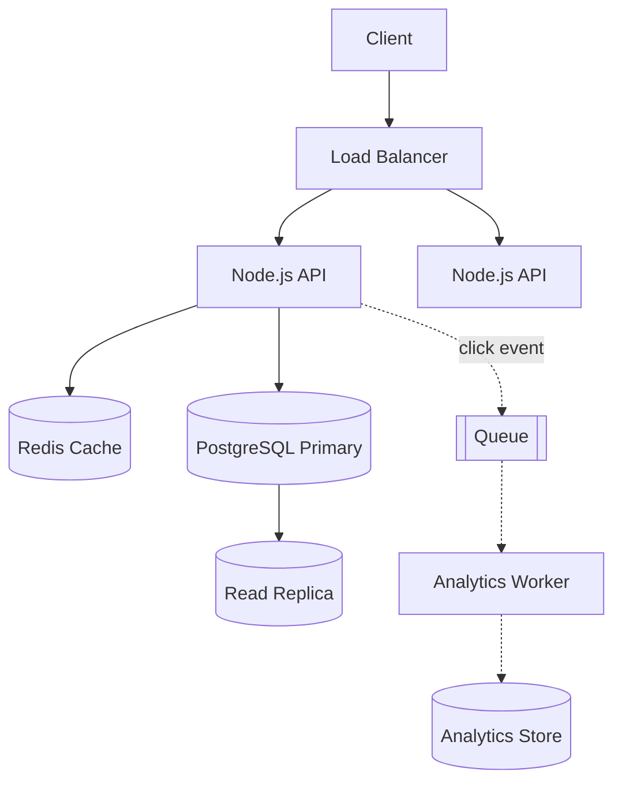

# URL Shortener -- HLD + LLD (Part 1: Basics -> Requirements -> Estimation -> HLD)

> Is file mein prompt ke **Parts 1-6** hain: problem basics, requirements, clarifying questions, capacity estimation, HLD, aur har component ka WHY.
> Next file (Parts 7-12): request flow, API design, database design, LLD, Node.js code line-by-line.

---

## PART 1 -- Problem ko bilkul basic se samjho

### Ye system actually karta kya hai?

Sabse pehle simple problem samjho. Hume ek aisa system banana hai jahan user ek **lamba URL** dega aur system usko ek **chhota URL** dega.

For example:

```
https://www.amazon.in/Apple-iPhone-15-128-GB/dp/B0CHX1W1XY?ref=sr_1_3&keywords=iphone&qid=1726640000
```

convert hoga:

```
https://sho.rt/aB92xK
```

Ab jab koi bhi user `https://sho.rt/aB92xK` open karega, hume database mein `aB92xK` dhundhna hai, original URL nikalna hai, aur browser ko us URL par **redirect** karna hai.

Bas. System ke sirf **2 main kaam** hain:

| Kaam | Naam | Kitni baar hota hai |
|---|---|---|
| Long URL -> short URL banana | **Write** (create) | Kam (ek baar banta hai) |
| Short URL -> original URL par bhejna | **Read** (redirect) | Bahut zyada (lakhon log click karte hain) |

> Ye table yaad rakhna. Pura design isi baat par tika hai ki **reads, writes se bahut zyada hain**.

### Real life mein iska example kya hai?

- **bit.ly, tinyurl.com** -- classic URL shorteners.
- **Twitter/X ka `t.co`** -- tweet mein har link automatically `t.co/...` ban jaata hai.
- **SMS marketing** -- Swiggy/Zomato/bank ke SMS mein `bit.ly/xyz` jaise links, kyunki SMS mein characters limited hote hain.
- **QR codes** -- chhota URL = simple QR code, jaldi scan hota hai.
- **Marketing analytics** -- company jaanna chahti hai ki campaign link par kitne clicks aaye.

### User kya request karega? System internally kya karega? Response kya milega?

**Flow 1 -- Short URL banana (write)**

```
User:     POST /api/v1/urls   { "longUrl": "https://amazon.in/...." }
System:   1. URL valid hai ya nahi check karo
          2. Ek unique short code banao   -> "aB92xK"
          3. DB mein save karo: aB92xK -> https://amazon.in/....
Response: 201 Created  { "shortUrl": "https://sho.rt/aB92xK" }
```

**Flow 2 -- Short URL open karna (read / redirect)**

```
User:     GET https://sho.rt/aB92xK      (browser mein click)
System:   1. "aB92xK" ko cache/DB mein dhundho
          2. Original URL mila
Response: 302 Found
          Location: https://amazon.in/....
Browser:  automatically Location wale URL par chala jaata hai
```

> **Redirect ka simple matlab:** server page nahi bhejta. Woh browser ko bolta hai "ye cheez us address par hai, wahan jao". Browser `Location` header padh ke khud naye URL par chala jaata hai.

### Ek simple real-world example

Priya ek Instagram influencer hai. Usko apni bio mein ek Amazon product ka link daalna hai, jo 180 characters lamba hai. Woh `sho.rt` par link paste karti hai aur `sho.rt/priya-deal` milta hai. Ab 5 lakh followers us link par click karte hain:

- Priya ne **1 baar** write kiya.
- System ne **5 lakh baar** read (redirect) kiya.

Isi wajah se hum redirect ko **super fast** banayenge (cache use karke), aur create ko thoda slow bhi chal jaayega.

### Interview mein 30 seconds mein kya bolun?

> "URL shortener ek service hai jo long URL leke ek chhota unique code generate karti hai, jaise `sho.rt/aB92xK`. Iske do main flows hain: create, jo write hai, aur redirect, jo read hai. Ye system heavily read-heavy hai, roughly 100 reads per write, isliye main redirect path ko Redis cache ke through fast rakhunga aur database ko source of truth rakhunga. Short code ke liye main ek unique ID generate karke usko Base62 mein encode karunga, taaki collision na ho. Redirect ke liye 302 dunga agar analytics chahiye, warna 301. Pehle main requirements aur scale clarify karunga, phir design detail mein bataunga."

---

## PART 2 -- Requirements

### Functional Requirements (system kya karega)

**Must-have (core):**

1. User ek long URL dega.
2. System ek unique short URL generate karega.
3. Short URL open karne par user original URL par redirect hoga.

**Nice-to-have (interviewer se confirm karo):**

4. **Custom alias** -- user khud code choose kare, jaise `sho.rt/priya-deal`.
5. **Expiry** -- URL ek date ke baad kaam karna band kar de.
6. **Analytics** -- kitne clicks, kis country se, kis device se.
7. **User accounts** -- user apne banaye hue links dekh/delete kar sake.

> Interview tip: core 3 pe design banao. Baaki features ko bolo "ye extension hai, time mila toh add karunga." Isse interviewer ko lagta hai tum scope control kar sakte ho.

### Non-Functional Requirements (system kaisa hona chahiye)

Sirf definition nahi -- har point pe dekho **is system mein ye important KYUN hai**.

| Requirement | Simple meaning | Is system mein KYUN important hai? |
|---|---|---|
| **Scalability** | Traffic badhe toh system bhi badh sake (zyada servers add karke) | Ek viral tweet mein link gaya aur ek minute mein lakhon clicks aa sakte hain. System ko bina redesign ke scale hona chahiye. |
| **Availability** | System hamesha chalu rahe (e.g. 99.99% uptime) | Agar redirect down hai, toh **har jagah** (SMS, QR codes, printed posters) wo link toot jaata hai. Ye links hum control nahi karte -- woh duniya mein already phaile hue hain. |
| **Reliability** | System sahi kaam kare, galat result na de | Galat redirect sabse bura hai: user ko kisi aur ki website par bhej diya = security issue + trust khatam. Error dena galat redirect se better hai. |
| **Low latency** | Response jaldi aaye (redirect < ~50-100 ms) | Redirect ek "extra hop" hai user aur actual website ke beech. Isme delay hua toh har click slow lagega. Isliye cache. |
| **Consistency** | Sab users ko same, sahi data dikhe | Short code ek baar ban gaya toh hamesha **same URL** par jaana chahiye. Lekin creation ke baad 1-2 second ka delay (replica tak pahunchne mein) usually acceptable hai. Analytics count thoda late ho, chalega. |
| **Durability** | Data save hua toh kabhi lost na ho | Ek baar short link print ho gaya poster par, toh 5 saal baad bhi kaam karna chahiye. Data lose hua = link permanently toot gaya. Isliye DB backups + replicas. |
| **Security** | Misuse aur attack se bachao | Log shorteners ka use **phishing/malware links chhupane** ke liye karte hain. Spam bots lakhon links bana sakte hain. Codes predictable hue toh koi saare private links scan kar sakta hai. |

> Interview line: "Is system mein mere liye sabse important NFRs hain **high availability aur low latency on the read path**, aur **durability** of mappings. Analytics mein eventual consistency chalegi."

---

## PART 3 -- Clarifying Questions

Architecture banane se pehle interviewer se ye poochho. Har question ka ek **reason** hai -- kyunki answer se design badalta hai.

| # | Question | Ye KYUN pooch raha hoon? | Answer design ko kaise badlega |
|---|---|---|---|
| 1 | Kitne users hain / kitne URLs per day banenge? | Scale decide karega ki ek DB kaafi hai ya sharding chahiye | 1 lakh URLs/day -> ek Postgres. 100M/day -> sharding + distributed ID |
| 2 | Read vs write ratio kya hai? | Read-heavy hai toh caching sabse bada lever hai | 100:1 -> Redis cache must. 1:1 -> cache ka fayda kam |
| 3 | URL kitne time tak valid rahega? Expiry chahiye? | Storage kitna chahiye + cleanup job chahiye ya nahi | Forever -> storage 5-10 saal ka plan. Expiry -> `expires_at` column + cleanup worker |
| 4 | Short URL kitna chhota hona chahiye? | Code length = kitne unique URLs bana sakte hain | 7 chars Base62 = ~3.5 trillion combinations |
| 5 | Custom aliases chahiye? | Custom alias user choose karta hai, collision possible hai | Unique constraint + "alias already taken" error handle karna padega |
| 6 | Analytics chahiye? | Ye decide karta hai 301 ya 302, aur queue chahiye ya nahi | Analytics yes -> 302 + click events queue mein. No -> 301 (browser cache karega, server load kam) |
| 7 | Authentication chahiye? | Anonymous users spam kar sakte hain | Anonymous -> strict IP rate limit. Logged-in -> per-user quota, "my links" feature |
| 8 | Same long URL do baar diya toh same short URL chahiye? | Dedup ke liye `long_url` par index + lookup chahiye | Yes -> extra index + read before write. No (default) -> simpler, faster writes |
| 9 | Links edit/delete ho sakte hain? | Edit hua toh cache invalidation ka problem aata hai | Editable -> cache delete on update + 302 only (301 browser mein chipak jaata hai) |
| 10 | Global users hain ya ek region? | Latency ke liye multi-region / CDN chahiye ya nahi | Global -> edge caching / multi-region reads |

### 301 vs 302 -- ye interview mein zaroor aata hai

- **301 Moved Permanently** -- browser isko **cache** kar leta hai. Agli baar browser seedha original site par jaata hai, **hamare server par aata hi nahi**. Server load kam, lekin clicks count nahi honge, aur link edit kiya toh purane users ko purana URL milta rahega.
- **302 Found (temporary)** -- browser har baar hamare server se poochta hai. Load zyada, lekin **har click count hota hai** aur link edit/disable kar sakte hain.

> "Analytics chahiye toh 302 (ya 307). Pure speed aur kam load chahiye toh 301. bit.ly jaisi companies analytics bechti hain, isliye 301 usually nahi use karti."

### Agar interviewer bole: "Assume 100 million users." -- kya badlega?

Pehle socho: 100M users ka matlab kya hai? Maan lo 10M naye URLs/day aur ~1B redirects/day (next part mein calculate karenge). Ab ye badlega:

| Area | Chhota scale (1 lakh users) | 100M users |
|---|---|---|
| Server | 1 Node.js server | Multiple Node.js instances + Load Balancer |
| Cache | Optional | **Must** -- Redis, kyunki ~12K reads/sec DB ko seedha nahi bhej sakte |
| DB | 1 Postgres | Postgres primary + read replicas; aage chal ke sharding by short_code |
| ID generation | DB auto-increment | Distributed ID (counter ranges / Snowflake) -- ek DB counter bottleneck ban jaata |
| Analytics | Seedha DB mein insert | Queue (Kafka/SQS) + workers -- har click par DB write nahi kar sakte |
| Abuse | Basic validation | Rate limiting, malicious URL scanning |

> Interview line: "100M users par main redirect path ko cache-first bana dunga, DB ko replicas ke saath scale karunga, aur analytics ko async queue par shift kar dunga taaki redirect latency affect na ho."

---

## PART 4 -- Capacity Estimation

Estimation ka goal **exact number nahi**, balki **order of magnitude** hai -- "hazaaron ya lakhon requests/sec?" Us se decide hota hai ki kaunsa component chahiye.

**Assume (interviewer se confirm karo):**

- 100M total users
- 10M naye URLs/day
- Read : Write = 100 : 1
- Har URL 5 saal store hoga
- 1 din = 86,400 sec, approx **~100,000 (10^5) sec** le lo -- math easy ho jaata hai

### Step 1 -- Requests per day

```
Writes/day = 10M
Reads/day  = 10M x 100 = 1,000M = 1 Billion redirects/day
```

**Kahan useful hai?** Ye confirm karta hai ki system **read-heavy** hai -> cache read path par lagao, write path simple rakh sakte ho.

### Step 2 -- Average RPS (requests per second)

```
Write RPS = 10,000,000 / 100,000  = ~100 writes/sec     (exact: 10M / 86400 = ~116)
Read RPS  = 1,000,000,000 / 100,000 = ~10,000 reads/sec (exact: ~11,600)
```

**Kahan useful hai?**

- 100 writes/sec -> ek Postgres primary aaram se handle kar leta hai (ek normal Postgres thousands of simple inserts/sec kar sakta hai). **Write ke liye sharding abhi zaruri nahi.**
- 10K reads/sec -> seedha DB par bhejna risky hai. **Yahi reason hai Redis cache ka.** Ek Redis node ~1 lakh ops/sec easily kar leta hai.

### Step 3 -- Peak RPS

Traffic poore din barabar nahi aata. Evening mein ya viral event par spike aata hai. Rule of thumb: **peak = 2x se 3x average** (viral case mein aur zyada).

```
Peak write RPS = 100 x 3    = ~300/sec
Peak read RPS  = 10,000 x 3 = ~30,000-35,000/sec
```

**Kahan useful hai?** System ko **peak ke liye** design karte hain, average ke liye nahi. 35K reads/sec -> multiple Node.js instances chahiye (maan lo ek instance ~3-5K simple req/sec) -> **~8-12 instances + load balancer**.

### Step 4 -- Read/Write ratio

```
100 : 1
```

**Kahan useful hai?**

- Cache hit rate high hoga (popular links baar baar click hote hain).
- Read replicas ka fayda hai.
- Write path ko over-engineer karne ki zarurat nahi.

### Step 5 -- Storage

Ek record kitna bada hai?

| Field | Approx size |
|---|---|
| id (bigint) | 8 bytes |
| short_code (7 chars) | ~8 bytes |
| long_url | ~200 bytes average (max 2048) |
| user_id | 8 bytes |
| created_at, expires_at | 16 bytes |
| Row overhead + index | ~250 bytes |
| **Total (round off)** | **~500 bytes** |

```
Per day    = 10M x 500 bytes          = 5 GB/day
Per year   = 5 GB x 365               = ~1.8 TB/year
5 years    = 1.8 TB x 5               = ~9-10 TB
Total URLs = 10M x 365 x 5            = ~18 Billion URLs
```

**Kahan useful hai?**

- ~10 TB ek single Postgres ke liye **possible but painful** (backups, index size, vacuum). Isliye 2-3 saal baad **sharding / partitioning** plan karni padegi -- ye bottleneck hai jo "1000x" mein aayega.
- **18 Billion URLs** -> code length decide hoti hai:

```
Base62, 6 chars = 62^6 = ~56.8 Billion   (18B ke liye kaafi, lekin margin kam)
Base62, 7 chars = 62^7 = ~3.5 Trillion   (bahut zyada margin)  <- choose 7
```

### Step 6 -- Bandwidth

```
Incoming (writes): 100 req/sec x 500 bytes    = ~50 KB/sec     (negligible)
Outgoing (reads):  10,000 req/sec x 500 bytes = ~5 MB/sec avg
Peak outgoing:     35,000 x 500 bytes         = ~17 MB/sec
```

Redirect response chhota hota hai (sirf headers + `Location`), isliye bandwidth **problem nahi hai**.

**Kahan useful hai?** Ye batata hai ki **CDN bandwidth ke liye zaruri nahi hai.** CDN agar lagayenge toh latency (global users) ke liye, bandwidth ke liye nahi.

### Step 7 (bonus) -- Cache memory

**80/20 rule:** 20% links se 80% traffic aata hai. Maan lo roz ke hot links = 20% of daily unique requested URLs.

```
Maan lo roz ~100M unique URLs click hote hain
20% hot = 20M URLs x 500 bytes = ~10 GB
```

**Kahan useful hai?** ~10 GB **ek Redis node** (with 1 replica) mein fit ho jaata hai. Matlab **Redis Cluster abhi zaruri nahi.** Ye bolna interviewer ko impress karta hai -- tum blindly cluster nahi laga rahe.

### Summary table

| Metric | Value | Design decision |
|---|---|---|
| Write RPS | ~100 avg / ~300 peak | Single DB primary kaafi |
| Read RPS | ~10K avg / ~35K peak | Redis cache + multiple Node.js instances |
| Ratio | 100:1 | Cache-first read path |
| Storage | ~5 GB/day, ~10 TB in 5 yrs | Future sharding plan |
| Total URLs | ~18B | 7-char Base62 code |
| Bandwidth | ~5-17 MB/s | Not a bottleneck |
| Cache | ~10 GB | Single Redis node + replica |

### Interview mein kaise bolun (short)

> "10M writes per day matlab roughly 100 writes per second, aur 100:1 ratio se around 10K reads per second, peak par 30-35K. Writes ke liye ek database primary kaafi hai, lekin reads ke liye mujhe cache chahiye. Storage around 5 GB per day, 5 saal mein ~10 TB aur ~18 billion URLs, isliye 7-character Base62 code lunga jo 3.5 trillion combinations deta hai. Hot data around 10 GB hai, jo ek Redis node mein fit ho jaata hai. Bandwidth koi issue nahi hai kyunki redirect response bahut chhota hai."

---

## PART 5 -- HLD (High-Level Design)

### Simple architecture diagram

```
                 Client (Browser / App)
                          |
                          v
                   DNS  (sho.rt -> LB IP)
                          |
                          v
                    Load Balancer
                          |
          +---------------+---------------+
          v               v               v
     Node.js API     Node.js API     Node.js API     (stateless, N instances)
          |
          +---------> Redis (cache: shortCode -> longUrl)
          |
          +---------> PostgreSQL (source of truth)
          |              primary + read replica
          |
          +---------> ID Generator (counter ranges)
          |
          +- - - - -> Queue (click events)  - - ->  Analytics Worker   (sirf agar analytics chahiye)
```



> Dotted lines = optional. Analytics ki requirement na ho toh queue aur worker diagram mein aate hi nahi.

### Har component ka kaam (Hinglish mein)

**1. Client**
Browser, mobile app, ya koi service jo API call kar rahi hai. Create ke liye `POST` bhejta hai, redirect ke liye sirf `GET /aB92xK`.

**2. DNS**
`sho.rt` ko IP address mein convert karta hai. Humare liye important baat: DNS load balancer ka IP deta hai, kisi ek server ka nahi.

**3. Load Balancer**
Load balancer ka kaam incoming traffic ko multiple Node.js servers mein distribute karna hai. Agar mere paas 1 server hai aur peak par 35K req/sec aa gaye, toh ek server bottleneck ban jaayega aur crash hua toh poora system down. Isliye hum multiple Node.js instances run karenge aur LB unke beech traffic baantega. LB **health checks** bhi karta hai -- koi server mar gaya toh usko traffic bhejna band.

**4. Node.js API servers**
Yahan business logic hai: URL validate karna, code generate karna, cache/DB se lookup karna, redirect response dena. Ye **stateless** hain -- koi user data server ki memory mein nahi rakha. Isliye koi bhi request kisi bhi server par jaa sakti hai, aur servers ko easily add/remove kar sakte hain.

**5. Redis (cache)**
`shortCode -> longUrl` ka mapping memory mein rakhta hai. Redirect ka 90%+ traffic yahin se serve hoga, DB tak jaayega hi nahi. Memory se read ~1 ms, DB se ~5-20 ms.

**6. PostgreSQL (database)**
**Source of truth.** Har mapping yahan permanently store hoti hai. Cache mein data jaaye ya na jaaye, DB mein hona zaruri hai. Primary par writes, read replica par cache-miss reads.

**7. ID Generator**
Har naye URL ke liye ek **unique number** deta hai, jisko Base62 mein convert karke short code banta hai (algorithm Part 13 mein detail mein). Simple version: DB sequence. Scale par: har Node.js instance ek baar mein 1000 IDs ki **range** le leta hai (e.g. 1,000,000-1,000,999), taaki har request par central counter ko hit na karna pade.

**8. Queue + Analytics Worker (optional)**
Agar analytics chahiye: har redirect par ek "click event" queue mein daalo aur turant user ko redirect kar do. Worker background mein events padh ke count karega. Isse **redirect latency analytics ki wajah se slow nahi hoti.**

---

## PART 6 -- Har Component ka WHY

> Rule: koi bhi component tabhi add karo jab uska reason bol sako. Kafka, Elasticsearch, S3 blindly mat lagao.

### Component: Load Balancer

- **Kya hai?** Ek traffic police jo aane waali requests ko multiple servers mein baantta hai (Nginx, AWS ALB, HAProxy).
- **Kyun use kar rahe hain?** Peak 35K req/sec ek Node.js process handle nahi karega. Aur ek server = **single point of failure**.
- **Agar hata dein toh?** Ek hi server par saara load. Woh crash hua ya deploy ke time restart hua toh poora redirect service down -- aur saare links toot gaye.
- **Kab zarurat nahi?** MVP / side project jahan 1 server kaafi hai aur thoda downtime chal jaata hai. (Waise cloud par managed LB sasta hai, toh production mein almost hamesha rakhte hain.)
- **Interview mein:** "Main Node.js API ko stateless rakhunga aur load balancer ke peeche horizontally scale karunga. LB health checks karega taaki crashed instance ko traffic na jaaye."

### Component: Node.js API (stateless)

- **Kya hai?** Hamara application server -- validation, code generation, lookup, redirect.
- **Kyun Node.js?** Ye workload **I/O-heavy** hai (Redis/DB se data laana), CPU-heavy nahi. Node.js ka event loop ek hi process mein hazaaron concurrent I/O requests handle kar leta hai bina har request ke liye thread banaye.
- **Stateless kyun?** Server memory mein kuch store nahi karte (na session, na mapping), toh koi bhi server kisi bhi request ko serve kar sakta hai. Scale karna = bas naya instance add karo.
- **Agar stateful bana diya toh?** Agar mapping sirf ek server ki memory mein hai, toh doosre server par gayi request ko woh URL milega hi nahi. Aur server restart = data gone.
- **Interview mein:** "Workload I/O bound hai, isliye Node.js ka non-blocking model yahan fit hai. Servers stateless hain, saara state Redis aur Postgres mein hai."

### Component: PostgreSQL (source of truth)

- **Kya hai?** Relational database jahan har `short_code -> long_url` mapping permanently store hoti hai.
- **Kyun use kar rahe hain?** Durability chahiye -- link 5 saal baad bhi kaam kare. Aur `short_code` par **UNIQUE constraint** chahiye taaki do URLs ko same code kabhi na mile. Postgres ye guarantee deta hai.
- **Agar hata dein toh (sirf Redis rakhein)?** Redis memory-based hai. Restart/crash par data lose ho sakta hai (persistence ke saath bhi kuch seconds ka loss possible). Aur 10 TB data memory mein rakhna bahut mehenga hai.
- **Kab alternative?** Jab data 10s of TB se aage jaaye aur sirf key-value lookup ho, toh **DynamoDB / Cassandra** jaisa key-value store better scale karta hai (sharding built-in). Comparison Part 9 mein.
- **Interview mein:** "Postgres source of truth hai, short_code par unique index ke saath. Access pattern simple key lookup hai, toh aage chalke key-value store par shift karna bhi easy hai."

### Component: Redis (cache)

- **Kya hai?** In-memory key-value store. Key = `url:aB92xK`, value = long URL.
- **Kyun use kar rahe hain?** 100:1 read ratio aur 35K peak reads/sec. Popular links baar baar click hote hain -- har baar DB se wahi row laana waste hai. Redis ~1 ms mein deta hai aur DB ka load 90%+ kam kar deta hai.
- **Agar Redis hata dein toh?** Saare 35K reads/sec seedhe Postgres par. Replicas ke saath chal toh sakta hai, lekin latency badhegi, zyada replicas lagenge (mehenga), aur viral link par DB ka CPU spike hoga.
- **Kab zarurat nahi?** Chhote scale par (e.g. 100 reads/sec). Postgres ki apni memory (shared buffers) mein hot rows already cache ho jaati hain. **MVP mein Redis mat lagao** -- pehle measure karo.
- **Important:** Redis **source of truth nahi** hai. Redis down = requests DB se serve hongi (slow but working).
- **Interview mein:** "Read-heavy system hai, toh main cache-aside pattern ke saath Redis use karunga. Redis sirf cache hai, source of truth Postgres hai, isliye Redis failure par system degrade hoga, down nahi."

### Component: ID Generator

- **Kya hai?** Har naye URL ko ek unique number dene wala mechanism.
- **Kyun?** Unique number ko Base62 mein encode karo toh unique short code guaranteed -- **collision check ki zarurat hi nahi**.
- **Agar random code banayein toh?** Random 7 chars mein collision possible hai. Har insert par "ye code already hai kya?" check karna padega aur retry karna padega. Jaise jaise DB bharta hai, collisions badhte hain.
- **Kab simple rakhein?** Ek DB ho toh Postgres ka `BIGSERIAL` / sequence hi ID generator hai. Alag service ki zarurat nahi.
- **Interview mein:** "Main counter-based ID lunga aur usko Base62 encode karunga. Multiple servers ke liye har server counter se IDs ki ek range reserve karega, taaki central counter bottleneck na bane." (Detail + trade-offs Part 13 mein.)

### Component: Queue (Kafka / SQS / RabbitMQ) -- sirf analytics ke liye

- **Kya hai?** Ek buffer jahan events daal do aur baad mein koi worker unhe process kare.
- **Kyun?** Har redirect par agar DB mein `click_count = click_count + 1` karein toh viral link ki ek hi row par 10K writes/sec -- row lock contention, aur redirect slow. Queue mein event daalo (~1 ms), user ko turant redirect karo, worker baad mein batch mein count kare.
- **Agar hata dein toh?** Analytics synchronous ho jaayega -> redirect slow. Ya analytics hi nahi hoga.
- **Kab zarurat nahi?** **Agar analytics requirement nahi hai, toh queue ki zarurat hi nahi.** Core URL shortener (create + redirect) mein koi async kaam nahi hai. "Yahan initially iski zarurat nahi hai."
- **Interview mein:** "Core flow ke liye queue nahi chahiye. Analytics add karna ho toh redirect path se click events ko async queue mein bhejunga, taaki analytics redirect latency ko affect na kare."

### Component: CDN

- **Kya hai?** Duniya bhar mein faile edge servers jo response user ke paas cache karte hain.
- **Kyun ho sakta hai?** Global users ke liye latency kam karna -- Mumbai ka user US server tak na jaaye.
- **Kyun abhi nahi?** Bandwidth ~17 MB/s peak hai -- koi problem nahi. Aur agar 302 + analytics hai toh CDN har click cache kar lega aur hum clicks count nahi kar paayenge.
- **Kab add karenge?** Multi-region/global latency requirement ho, ya 301 (no analytics) use kar rahe ho. **"Yahan initially iski zarurat nahi hai."**

### Component: Elasticsearch / S3 / MongoDB

- **Elasticsearch** -- full-text search ki zarurat nahi. Hum sirf exact key (`short_code`) se dhundhte hain. **Zarurat nahi.**
- **S3** -- koi files/images store nahi kar rahe. **Zarurat nahi.**
- **MongoDB** -- kaam kar sakta hai, lekin koi special fayda nahi (flexible schema chahiye hi nahi). Comparison Part 9 mein.

### Final component checklist

| Component | MVP mein? | Scale par? | Reason |
|---|---|---|---|
| Load Balancer | Optional | Yes | Multiple instances + failover |
| Node.js API | Yes | Yes (N instances) | Business logic, stateless |
| PostgreSQL | Yes | Yes (+ replicas, later shards) | Source of truth, unique constraint |
| Redis | No | Yes | 100:1 reads, low latency |
| ID Generator | DB sequence | Range-based | Unique codes without collision |
| Queue + Worker | No | Only if analytics | Async click tracking |
| CDN | No | Only if global / 301 | Latency, not bandwidth |
| Elasticsearch / S3 | No | No | No search, no files |

---

## Remember

> **URL shortener = "ek baar likho, lakhon baar padho."** Isliye read path ko cache se fast karo, DB ko source of truth rakho, aur sirf wahi component add karo jiska reason tum bol sako.

## Quick Self-Test (answers baad mein check karna)

1. Is system mein cache itna important kyun hai? Ek number ke saath answer do.
2. Analytics chahiye toh 301 kyun nahi use karenge?
3. 7 characters hi kyun, 6 kyun nahi? Calculation se batao.
4. Redis down ho jaaye toh redirect kaam karega? Kyun?
5. Interviewer bole "analytics nahi chahiye" -- tumhare diagram se kya hat jaayega?

---

**Next (Part 2):** Request Flow (step by step), API Design, Database Design + indexes, LLD folder structure, Node.js/TypeScript code with line-by-line explanation. "next" bolo.
