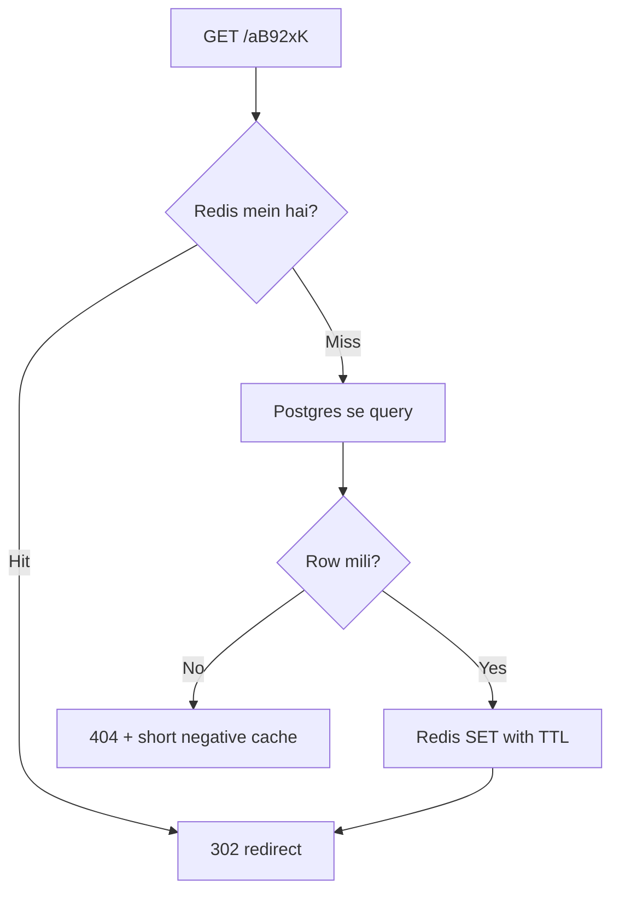

# URL Shortener -- HLD + LLD (Part 3: Algorithms -> Concurrency -> Caching)

> Is file mein prompt ke **Parts 13-15** hain: short code generation ke algorithms, concurrency (race conditions), aur caching ka deep dive.
> Part 2 recap: humne **block-based counter + Base62** use kiya, `short_code` par **UNIQUE index** lagaya, aur redirect ke liye **cache-aside** likha. Ab dekhenge ye choices **kyun** sahi hain, kab galat ho jaati hain, aur production mein cache kaise tootta hai.

---

## PART 13 -- Important Algorithms: short code kaise banayein?

### Problem kya hai?

Har naye URL ko ek aisa code chahiye jo:

1. **Unique** ho -- do URLs ka same code = kisi ko galat website par bhej diya.
2. **Chhota** ho -- 6-8 characters.
3. **Jaldi** bane -- har create par slow check nahi.
4. **Distributed** ho sake -- 12 Node.js servers ek saath codes banayein, phir bhi clash na ho.
5. (Kabhi kabhi) **Guess na ho sake** -- koi `aB92xK` se `aB92xL` try karke doosron ke links na dekh le.

Ek hi approach sab 5 perfectly nahi deta. Isliye options samjho aur trade-off bolo.

### Approach 1 -- Auto-increment ID (sabse simple)

Database har row ko number deta hai: 1, 2, 3, ... Wahi number short code:

```
sho.rt/1
sho.rt/2
...
sho.rt/1000000000      <- 1 billion par 10 characters!
```

- **Achha:** 100% unique (DB guarantee), bilkul simple.
- **Problem 1 -- lamba:** decimal mein sirf 10 digits (0-9) hain, toh number jaldi lamba ho jaata hai.
- **Problem 2 -- guessable:** `sho.rt/1000` ke baad `sho.rt/1001` hoga, koi bhi script saare links scan kar sakti hai.

Pehla problem **Base62** solve karta hai.

### Approach 2 -- Base62 encoding

**Base62 ka simple matlab:** number ko 10 symbols (0-9) ki jagah **62 symbols** mein likhna.

```
0-9   -> 10 symbols   (index 0-9)
a-z   -> 26 symbols   (index 10-35)
A-Z   -> 26 symbols   (index 36-61)
Total -> 62 symbols
```

Jaise decimal mein har position 10 guna badi hoti hai (1, 10, 100...), Base62 mein har position **62 guna** badi hoti hai (1, 62, 3844, ...). Zyada symbols = chhota code.

#### Actual calculation: 125 -> ?

Rule: baar baar **62 se divide karo**, **remainder** note karo, remainders ko **ulta** padho.

```
125 / 62 = 2   remainder 1   -> symbol[1] = '1'
  2 / 62 = 0   remainder 2   -> symbol[2] = '2'
Remainders ulta padho: "21"
```

**125 -> `21`** (check: 2 x 62 + 1 = 125).

> Note: prompt mein example `125 -> 21x` diya tha, lekin sahi answer `21` hai. 125 itna chhota hai ki 2 characters mein aa jaata hai.

#### Thoda bada example: 11157 -> ?

```
11157 / 62 = 179   remainder 59   -> symbol[59] = 'X'   (36 = 'A', toh 59 = 'X')
  179 / 62 = 2     remainder 55   -> symbol[55] = 'T'
    2 / 62 = 0     remainder 2    -> symbol[2]  = '2'
Ulta padho: "2TX"
```

**11157 -> `2TX`**. Check: 2 x 3844 + 55 x 62 + 59 = 7688 + 3410 + 59 = 11157.

#### Decode (code -> number)

Left se right chalo: `number = number x 62 + index(char)`.

```
"2TX":  0 x 62 + 2  = 2
        2 x 62 + 55 = 179
      179 x 62 + 59 = 11157
```

```ts
const ALPHABET = '0123456789abcdefghijklmnopqrstuvwxyzABCDEFGHIJKLMNOPQRSTUVWXYZ';

export function decodeBase62(code: string): bigint {
  let num = 0n;
  for (const ch of code) {
    const index = ALPHABET.indexOf(ch);
    if (index === -1) throw new Error(`Invalid Base62 character: ${ch}`);
    num = num * 62n + BigInt(index);
  }
  return num;
}
```

- `for (const ch of code)` -- left se right har character.
- `ALPHABET.indexOf(ch)` -- character ki value (0-61).
- `index === -1` -- galat character (`@`, `!`) -- bad input, throw.
- `num * 62n + BigInt(index)` -- pichla number ek position left shift (x 62), phir nayi value jodo. Bilkul waise jaise decimal mein "12" ke baad "3" aaye toh 12 x 10 + 3 = 123.

> Hume decode ki zarurat kab hai? Hamare design mein **nahi** -- hum `short_code` column se hi lookup karte hain. Lekin interviewer poochta hai "code se ID wapas nikaal sakte ho?", toh haan, ye function.

#### Kitne characters chahiye?

| Length | Combinations (62^n) | Kaafi hai? |
|---|---|---|
| 5 | ~916 million | 3 mahine mein khatam (10M/day) |
| 6 | ~56.8 billion | 5 saal (18B) ke liye chalega, margin kam |
| **7** | **~3.52 trillion** | **~960 saal** at 10M/day -- choose |
| 8 | ~218 trillion | Overkill for sequential, useful for random codes |

**Trick -- har code exactly 7 characters ka kaise ho?** Counter ko `62^6 = 56,800,235,584` se start karo. `Base62(62^6) = "1000000"` -- pehla hi code 7 characters ka. (Part 2 mein block = sequence value x 1000 hai, toh `CREATE SEQUENCE url_id_block_seq START WITH 56800236;` -> pehli ID 56,800,236,000, jo 62^6 se badi hai.)

### Approach 3 -- Random code

Har baar 7 random Base62 characters banao: `kP3xQ9a`.

```ts
import { randomInt } from 'node:crypto';

export function randomCode(length = 7): string {
  let code = '';
  for (let i = 0; i < length; i++) {
    code += ALPHABET[randomInt(62)];
  }
  return code;
}
```

- `randomInt(62)` -- **crypto** module se 0-61. `Math.random()` mat use karo -- woh predictable hai, attacker next values guess kar sakta hai.
- Loop 7 baar -> 7 characters.

**Collision ka problem:** random hai, toh same code dobara aa sakta hai. Kitna chance?

```
Chance (per insert) = already used codes / total combinations
1 billion used:   1,000,000,000 / 3.52 trillion   = ~0.03%
18 billion used: 18,000,000,000 / 3.52 trillion   = ~0.5%
```

Matlab 200 inserts mein ~1 baar collision (5 saal baad). **Solution:** UNIQUE index + retry (Part 2 ka retry loop exactly yahi karta hai). 2 retries mein fail hone ka chance ~0.0025% se bhi kam.

- **Achha:** guess nahi ho sakta, koi central counter nahi (har server khud bana leta hai).
- **Bura:** collision handling chahiye, aur jaise DB bharta hai retries badhte hain. 8 characters le lo toh ye problem almost khatam.

### Approach 4 -- Hash of long URL (MD5 / SHA-256)

`MD5(longUrl)` -> 128-bit hash -> Base62 -> pehle 7 characters.

- **Achha:** same long URL = hamesha same code (**dedup free mein** milta hai).
- **Bura:**
  - 7 characters mein truncate kiya, toh **do alag URLs ka same prefix** aa sakta hai -> collision handling (salt jodo, dobara hash karo) chahiye.
  - Do alag users same URL shorten karein aur ek ko analytics/expiry alag chahiye -- same code mein problem.
  - Hash compute karne ke baad bhi DB check karna padta hai -- random se koi fayda nahi.
- **Kab use karein:** jab "same URL -> same short URL" **explicit requirement** ho.

### Approach 5 -- UUID

UUID = 128-bit random ID, jaise `550e8400-e29b-41d4-a716-446655440000`.

- **Achha:** koi coordination nahi, practically kabhi collide nahi hota.
- **Bura:** Base62 mein bhi **22 characters** banta hai. `sho.rt/7N42dgm5tFLK9N8MT7fHC7` -- ye "short" URL nahi hai.
- **Kab use karein:** internal IDs ke liye (user ID, request ID), **short code ke liye nahi**.

### Approach 6 -- Snowflake ID (Twitter)

Ek **64-bit** number jo har server bina baat kiye unique bana sakta hai:

```
| 1 bit | 41 bits timestamp (ms) | 10 bits machine ID | 12 bits sequence |
   0      ~69 saal tak             1024 machines        har ms mein 4096 IDs
```

- **Timestamp** -- IDs time ke saath badhti hain (sortable).
- **Machine ID** -- har server ka apna number, toh do servers kabhi same ID nahi banayenge.
- **Sequence** -- same millisecond mein same machine par 4096 tak.

- **Achha:** koi central DB call nahi, time-sortable, bahut high throughput.
- **Bura:** Base62 mein **11 characters** (`aZl8N0y58M7`) -- 7 se lamba. Machine ID assign karna padta hai (config / ZooKeeper). **Clock peeche chali gayi** (NTP sync) toh duplicate ID ka risk -- code ko clock backward detect karke wait karna padta hai.
- **Kab useful:** jab hazaaron writes/sec, multi-region, aur central counter bottleneck ho. Hamare ~300 writes/sec par **overkill**.

### Distributed servers mein asli problem kya hai?

Maan lo 12 Node.js servers hain aur har server ka apna counter memory mein hai:

```
Server A: counter = 1, 2, 3 ...
Server B: counter = 1, 2, 3 ...   <- SAME codes!  "sho.rt/1" do URLs ka
```

**Solutions:**

| Solution | Kaise | Trade-off |
|---|---|---|
| Har ID ke liye DB sequence | `nextval()` har create par | Simple, lekin har write par ek DB round trip; DB = single point |
| **Block / range allocation** (hamara) | Server ek baar mein 1000 IDs reserve kare | 1000x kam DB calls; crash par kuch IDs waste (koi farak nahi) |
| Redis `INCR` | Redis atomic counter | Fast; lekin Redis persistence weak hui toh counter peeche ja sakta hai -> duplicate codes (unique index bachayega) |
| Snowflake | Machine ID + time | No coordination; lamba code, clock issues |
| Random + unique index | Coordination hi nahi | Retries; guess-proof |

### Predictable codes -- security angle

Counter + Base62 ka code **sequential** hai: `1000001, 1000002, 1000003`. Koi script sab try karke **doosron ke private links** (Google Docs share links, invoices) dekh sakti hai. Isko **enumeration attack** kehte hain.

- Public marketing links ke liye ye usually chalta hai.
- Private links ho sakte hain toh: **random 8-char codes** use karo (guess karna practically impossible), aur `GET /:code` par **rate limit** lagao taaki koi lakhon codes try na kar sake.
- Counter ko "scramble" karne ke tricks (multiply karke modulo, Hashids) sirf **obfuscation** hain, security nahi -- pattern reverse-engineer ho sakta hai.

### Custom alias vs generated code -- clash kaise rokein?

Part 2 mein ek edge case chhoda tha: user ne alias `100008H` le liya, aur baad mein counter ka Base62 bhi `100008H` aaya. Retry loop bacha leta hai, lekin **design se hi clash impossible** bana sakte hain:

- Generated codes **hamesha exactly 7 Base62 characters** hain (counter 62^6 se start, aur 62^7 tak pahunchne mein ~960 saal).
- Toh rule: **custom alias exactly 7 alphanumeric characters ka nahi ho sakta.** `priya-deal` (hyphen), `sale2026x` (9 chars) allowed; `100008H` rejected.

```ts
const GENERATED_SHAPE = /^[0-9a-zA-Z]{7}$/;

customAlias: z.string().regex(/^[a-zA-Z0-9_-]{4,30}$/)
  .refine((a) => !GENERATED_SHAPE.test(a), 'Alias cannot look like a generated code')
```

- `GENERATED_SHAPE` -- generated code ka exact shape: 7 characters, sirf 0-9 a-z A-Z.
- `.refine(...)` -- alias agar is shape ka hai toh 400. Ab dono "namespaces" alag hain -- ek doosre se kabhi takra hi nahi sakte.
- Retry loop phir bhi rakho -- defence in depth (koi purana alias pehle ka bana ho toh).

### Final decision table

| Approach | Unique? | Chhota? | Coordination | Guessable? | Kab choose karunga |
|---|---|---|---|---|---|
| Auto-increment | Yes | No | DB | Yes | Kabhi nahi (Base62 lagao) |
| **Counter + Base62** | Yes | **Yes (7)** | Block allocation | Yes | **Default** -- public links, simple, no collisions |
| **Random + retry** | Unique index se | Yes (7-8) | None | **No** | Private links / security zaruri |
| Hash (MD5) | Collision handle karo | Yes | None | No | Dedup requirement ho |
| UUID | Yes | No (22) | None | No | Internal IDs, short code nahi |
| Snowflake | Yes | Medium (11) | Machine IDs | Partly | Huge write scale, sortable IDs |

**Interview line:**

> "Main counter-based ID lunga aur Base62 encode karunga -- 7 characters mein 3.5 trillion codes, aur collision ka sawaal hi nahi. Distributed servers ke liye har server DB sequence se 1000 IDs ka block reserve karega. Agar links private hain aur guessability concern hai, toh main random 8-character codes pe switch karunga, unique constraint ke saath retry karke. UUID bahut lamba hai, aur Snowflake is write volume ke liye overkill hai."

---

## PART 14 -- Concurrency: ek saath bahut saari requests aayein toh?

### Pehle: Node.js mein concurrency kaise kaam karti hai?

Node.js ka **JavaScript code ek hi thread par** chalta hai (event loop). Lekin I/O (DB query, Redis call, network) background mein hota hai (OS / libuv), aur jab result aata hai toh callback queue mein aata hai.

```
Request A: validate -> await db.query(...)  --- (DB kaam kar raha hai) ---> resume A
Request B:            validate -> await redis.get(...) --> resume B
Request C:                        validate -> ...
           ^ ek thread, lekin await par doosri request chal jaati hai
```

Iske 2 important matlab:

1. **Do `await` ke beech wala code atomic hai.** `this.next++` ke beech koi doosri request nahi ghus sakti (Part 2 IdGenerator).
2. **`await` ke aar-paar koi guarantee nahi.** "Check karo -> await -> likho" ke beech doosri request wahi check kar chuki ho sakti hai. **Race condition yahin se aati hai** -- single thread hone ke bawajood.

Aur production mein toh **12 Node processes** hain -- ek process ki memory doosre ko dikhti hi nahi. Isliye in-memory locks/Sets se multi-server concurrency solve **nahi** hoti.

### Scenario 1 -- Do users ek saath same custom alias maangein

**Race condition ka simple matlab:** result is baat par depend kare ki kaunsi request pehle pahunchi -- aur galat order par data kharab ho jaaye.

**Galat approach (check-then-insert):**

```ts
// BUGGY -- mat karna
const existing = await repo.findByShortCode(alias);   // step 1: check
if (existing) throw AppError.conflict('Alias taken');
await repo.insert({ ...url, shortCode: alias });       // step 2: insert
```

```
Time   Server A (Priya)                 Server B (Rahul)
t1     SELECT 'sale' -> not found
t2                                      SELECT 'sale' -> not found
t3     INSERT 'sale' -> OK
t4                                      INSERT 'sale' -> OK ??  (bina unique index ke)
```

Dono ko "success" mila, ab `sho.rt/sale` kiska hai? Ek user ka link chupke se doosre ki website par jaa raha hai.

**Sahi approach -- database ko judge banao (UNIQUE constraint):**

```
t3     INSERT 'sale' -> OK
t4                                      INSERT 'sale' -> ERROR 23505 (unique violation) -> 409
```

**Unique constraint ka matlab:** DB khud guarantee karta hai ki column mein duplicate value kabhi nahi hogi, chahe kitne bhi servers ek saath insert karein. DB internally index par lock leke check + insert **ek atomic step** mein karta hai.

Isliye Part 2 mein humne pehle SELECT kiya hi nahi -- **seedha INSERT, aur error aaya toh 409.** Ek query kam, aur race condition impossible.

Postgres mein ek aur clean tareeka:

```sql
INSERT INTO urls (id, short_code, long_url)
VALUES ($1, $2, $3)
ON CONFLICT (short_code) DO NOTHING
RETURNING id;
```

- `ON CONFLICT (short_code) DO NOTHING` -- duplicate aaya toh error ki jagah kuch mat karo.
- `RETURNING id` -- insert hua toh id wapas aayegi; nahi hua toh **0 rows**. App check karti hai: 0 rows = alias taken.

### Scenario 2 -- 100 users ek saath short URL banayein

100 requests, 12 servers. Kya do ko same code mil sakta hai?

- **Ek server ke andar:** `this.next++` atomic hai (beech mein await nahi) -> har request ko alag ID.
- **Servers ke beech:** har server ka block alag hai, kyunki `nextval('url_id_block_seq')` Postgres mein **atomic** hai -- 12 servers ek saath maangein toh bhi 12 alag block numbers milte hain.
- **Block refill ke waqt 50 requests ek saath:** `this.refill ??= ...` -- sab ek hi refill promise ka wait karti hain, sirf 1 DB call.
- **Last line of defence:** agar kisi bug se phir bhi same code bana, UNIQUE index insert reject kar dega.

> Layered safety: design se uniqueness (counter blocks) + database se guarantee (unique index). Ek fail ho toh doosra bachata hai.

### Scenario 3 -- Click counter (analytics) -- "lost update"

Viral link par ek second mein 1000 clicks. Galat code:

```ts
// BUGGY
const row = await db.query('SELECT clicks FROM urls WHERE short_code = $1', [code]);
await db.query('UPDATE urls SET clicks = $1 WHERE short_code = $2', [row.clicks + 1, code]);
```

```
A reads clicks = 50
B reads clicks = 50
A writes 51
B writes 51      <- ek click gayab (lost update)
```

**Atomic operation ka matlab:** read + modify + write **ek hi indivisible step** mein -- beech mein koi nahi ghus sakta.

```sql
UPDATE urls SET clicks = clicks + 1 WHERE short_code = $1;   -- DB ke andar atomic
```

```ts
await redis.incr(`clicks:${code}`);                            // Redis INCR bhi atomic
```

Lekin viral link par **ek hi row par 10K updates/sec** = row lock contention, DB slow. Isliye production mein: Redis `INCR` ya queue mein events, aur worker har minute **batch** mein DB update kare (`clicks = clicks + 3472`).

### Scenario 4 -- Distributed lock: kab chahiye, kab nahi?

**Distributed lock ka matlab:** multiple servers ke beech ek "token" jo ek time par sirf ek ke paas ho -- jaise ek hi chaabi wala room.

Redis se basic lock:

```ts
import { randomUUID } from 'node:crypto';

const token = randomUUID();
const acquired = await redis.set('lock:cleanup-job', token, 'PX', 30_000, 'NX');
if (acquired !== 'OK') return;            // kisi aur server ke paas lock hai
try {
  await deleteExpiredUrls();
} finally {
  await redis.eval(
    "if redis.call('get', KEYS[1]) == ARGV[1] then return redis.call('del', KEYS[1]) else return 0 end",
    1, 'lock:cleanup-job', token,
  );
}
```

- `SET key token NX` -- **NX** = sirf tab set karo jab key exist na kare. Ek hi server jeetega.
- `PX 30_000` -- 30 sec mein lock khud expire -- server crash hua toh lock hamesha ke liye atka nahi rahega.
- `token = randomUUID()` -- har holder ka unique token.
- `finally` + Lua script -- lock **sirf tab delete karo jab woh abhi bhi mera ho**. Kyun? Mera kaam 30 sec se lamba chala, lock expire hua, doosre server ne le liya -- ab main `DEL` karunga toh **uska** lock uda dunga. Lua script check + delete atomic karti hai.

**Hamare system mein lock kahan chahiye?**

| Situation | Lock chahiye? | Kyun |
|---|---|---|
| Custom alias uniqueness | **Nahi** | UNIQUE constraint already atomic hai. Lock = extra complexity + extra failure point |
| ID generation | **Nahi** | DB sequence atomic hai |
| Click counting | **Nahi** | Atomic `INCR` / `clicks + 1` |
| Expired links cleanup cron (12 servers par chalta hai) | **Haan** (ya ek alag single worker) | Warna 12 servers ek saath same delete query chalayenge |
| Cache stampede (viral key rebuild) | **Optional** | Neeche Part 15 mein |

> Interview line: "Main distributed lock last option rakhta hoon. Pehle dekhta hoon kya database ka unique constraint ya atomic operation kaam kar sakta hai -- woh simple aur zyada reliable hai. Redis lock ek lease hai, guarantee nahi: GC pause ya network delay mein do holders ho sakte hain, isliye critical correctness ke liye DB constraint ya fencing token chahiye."

---

## PART 15 -- Caching deep dive

### Basic vocabulary (hamare system ke context mein)

| Term | Hamare system mein | Simple meaning |
|---|---|---|
| **Cache key** | `url:aB92xK` | Kis cheez ko dhundh rahe ho. Prefix (`url:`) se namespace |
| **Value** | `https://amazon.in/...` | Jo cheez chahiye. Sirf long URL -- poora row object nahi, memory bachao |
| **TTL** | 24 ghante | Itne time baad Redis key khud delete kar dega. Stale data ka safety net + memory free |
| **Cache hit** | Redis mein mila | DB nahi chhua, ~1 ms |
| **Cache miss** | Redis mein nahi | DB se laao, Redis mein daalo |
| **Hit ratio** | hits / (hits + misses) | 95% = 100 mein se sirf 5 requests DB tak. Ye number monitor karo |

### Cache-aside pattern (hamara pattern)

**Cache-aside ka matlab:** application khud cache sambhalti hai -- pehle cache dekho, miss par DB se laao aur cache bharo. Cache DB ke "side" mein baitha hai, DB ke saamne nahi.



**Alternatives kyun nahi?**

- **Write-through** (create par DB + cache dono mein likho) -- bahut saare links kabhi click hi nahi hote; unko cache mein rakhna memory waste. Lekin agar data kehta hai "90% links pehle 1 ghante mein click hote hain", toh create par cache warm karna sahi ho sakta hai. **Data se decide karo.**
- **Read-through** (cache library khud DB se laati hai) -- concept same, bas logic library mein. Node mein usually cache-aside hi likhte hain.

### Cache invalidation -- link delete/edit hua toh?

"There are only two hard things in computer science: cache invalidation and naming things." -- ye yahan dikhta hai.

User ne link delete kiya. DB mein `is_active = false`. Lekin Redis mein abhi bhi `url:aB92xK -> amazon.in` hai, **24 ghante tak**. Deleted link kaam karta rahega.

**Rule: pehle DB update, phir cache DELETE (update nahi).**

```ts
async deleteUrl(shortCode: string, userId: string): Promise<void> {
  const deleted = await this.repo.deactivate(shortCode, userId);
  if (!deleted) throw AppError.notFound();
  await this.cache.del(`url:${shortCode}`).catch((err) => {
    logger.warn({ err, shortCode }, 'cache invalidation failed; TTL will clean up');
  });
}
```

- `repo.deactivate(shortCode, userId)` -- `UPDATE ... SET is_active = false WHERE short_code = $1 AND user_id = $2`. `user_id` condition = **authorization** -- sirf owner delete kar sake.
- `if (!deleted)` -- row update nahi hui = link hai hi nahi ya kisi aur ka. Dono case mein 404 (doosre ka link exist karta hai ye bhi mat batao).
- **Pehle DB, phir cache kyun?** Ulta kiya (pehle cache delete, phir DB) toh beech mein koi reader aaya, cache miss hua, DB se **purana** data laaya aur cache mein daal diya -- ab 24 ghante stale.
- **`del` kyun, `set` nahi?** Delete simple aur safe hai -- agla reader DB se fresh laayega. Do concurrent updates mein `set` ka order ulta ho sakta hai.
- `.catch(... logger.warn ...)` -- Redis down hai toh delete fail hoga. Link DB mein deactivate ho chuka hai; TTL max 24 ghante mein clean karega. **Log karo** taaki pata rahe.

**Bacha hua race (interview mein bolne layak):** delete ke **turant baad** koi reader jo replica se purana data padh raha tha, cache mein stale value wapas daal sakta hai. Mitigation:

- **Delayed double delete** -- 1-2 sec baad dobara `DEL` (queue/setTimeout se).
- **TTL** -- worst case bhi bounded hai.
- Abuse/phishing jaise urgent block ke liye: **short TTL** ya `DEL` ke saath ek "blocked" marker set karo.

### Negative caching -- jo cheez nahi hai usko bhi cache karo

Bots aur scanners roz lakhon random codes try karte hain: `/aaaaaa1`, `/aaaaaa2`... Har ek cache miss -> DB query -> "not found". **Cache ka poora fayda khatam, DB par attack.**

**Solution:** "not found" ko bhi cache karo, lekin **chhote TTL** ke saath (e.g. 60 sec):

```
url:zzzzzz9 -> "__404__"   EX 60
```

**Trade-off:** kisi ne 404 dekha, aur usi minute koi usi code ka **custom alias** bana de, toh 60 sec tak 404 aayega. **Fix:** create ke baad `DEL url:<code>` -- sasta hai aur ye edge case khatam.

### Hot key -- ek link viral ho gaya

Ek celebrity ne tweet kiya: `sho.rt/iphone-sale`. Ab **50,000 requests/sec ek hi key** par.

- Redis Cluster mein ek key **ek hi node** par hoti hai -> woh node ka CPU/network full, baaki nodes free.
- Har request Node -> Redis network round trip.

**Solutions (simple se complex):**

1. **In-process (local) cache** -- har Node.js instance apni memory mein bhi hot keys rakhe, bahut chhote TTL (5 sec) ke saath. 12 instances x 1 Redis call per 5 sec = Redis par load almost zero. **Sabse effective, sabse simple.**
2. **Redis read replicas** -- reads ko replicas par baanto.
3. **Key splitting** -- `url:iphone-sale:1 ... :10` copies, random copy padho. Complex, rarely needed.
4. **CDN / edge caching** -- agar 301 ya short cache allowed hai.

**Local cache ka trade-off:** delete/edit ke baad har instance par max 5 sec tak purana data. URL shortener ke liye acceptable. (Phishing block ke liye? 5 sec bhi chalega usually.)

### Cache stampede (thundering herd)

Viral link ka Redis TTL **exactly abhi** expire hua. Agle 10 ms mein 500 requests aayin -- **sab ko miss**, sab 500 **ek saath DB** par same query bhejti hain. DB CPU spike, latency badhi, doosre queries bhi slow. Isko **cache stampede** kehte hain.

```
TTL expire -> 500 misses ek saath -> 500 same DB queries -> DB overloaded
```

**Solutions:**

| Solution | Kaise | Kab |
|---|---|---|
| **Request coalescing (single-flight)** | Ek process mein same key ki sirf 1 DB query; baaki usi promise ka wait | **Hamesha** -- sasta, simple. 500 requests / 12 instances = max 12 DB queries |
| **TTL jitter** | TTL = 24h minus random 0-10%, taaki bahut saari keys ek saath expire na hon | Hamesha -- ek line ka code |
| **Local cache** | Hot key Node memory mein bhi, toh Redis expire hone par bhi 5 sec cover | Hot keys ke liye |
| **Distributed lock** | Sirf lock jeetne wala DB jaaye, baaki thoda wait karke cache padhein | Jab 12 queries bhi zyada hain (very expensive query) |
| **Early refresh** | TTL khatam hone se pehle background mein refresh | Bahut hot keys, predictable traffic |

Hamare case mein DB query sirf ~2 ms ki simple index lookup hai, toh **single-flight + jitter + local cache kaafi hai**. Distributed lock overkill hai.

### Redis failure -- Redis hi gir gaya toh?

| Situation | Kya hoga | Humne kya kiya |
|---|---|---|
| Redis down | Har `get` fail | `.catch(() => null)` -> DB se serve. `enableOfflineQueue: false` -> fail fast, latke nahi |
| Redis slow (50ms+) | Redirect slow | `commandTimeout: 50` -> timeout = miss, DB se serve |
| Redis wapas aaya, **empty** (cold cache) | Saare misses DB par | Single-flight + DB replicas ko ye load uthane layak size karo |
| Redis memory full | Naye `SET` fail ya purani keys evict | `maxmemory-policy allkeys-lru` -- kam use hone wali keys automatically hatao |

**Sabse bada risk:** Redis 95% traffic sambhal raha tha. Redis gaya -> **20x traffic** DB par. Agar DB sirf 5% ke liye size kiya tha, toh DB bhi gir jaayega (**cascading failure**). Isliye:

- **Redis HA:** primary + replica, automatic failover (AWS ElastiCache / Redis Sentinel).
- **Circuit breaker:** Redis baar baar fail ho raha hai toh kuch seconds Redis ko call hi mat karo (timeout ka wait bhi bachao).
- **Local cache** hot keys ko bachata hai jab Redis gaya ho.
- **DB capacity plan:** replicas itne hon ki Redis-less mode mein kam se kam peak ka kuch hissa sambhal sakein; baaki ke liye rate limiting / load shedding.

### Final `resolve()` -- sab jod ke

Part 2 ka `resolve` ab production-ready version mein:

```ts
import { LRUCache } from 'lru-cache';

const CACHE_TTL_SEC = 24 * 60 * 60;
const NEGATIVE_TTL_SEC = 60;
const NOT_FOUND = '__404__';
const GONE = '__410__';

const local = new LRUCache<string, string>({ max: 10_000, ttl: 5_000 });
const inFlight = new Map<string, Promise<string>>();

function withJitter(ttlSec: number): number {
  return Math.max(1, Math.floor(ttlSec * (0.9 + Math.random() * 0.1)));
}

export class UrlService {
  // constructor + createShortUrl same as Part 2

  async resolve(shortCode: string): Promise<string> {
    const key = `url:${shortCode}`;

    const hot = local.get(key);
    if (hot) return this.unwrap(hot);

    const cached = await this.cache.get(key).catch(() => null);
    if (cached) {
      local.set(key, cached);
      return this.unwrap(cached);
    }

    let pending = inFlight.get(key);
    if (!pending) {
      pending = this.loadAndCache(shortCode, key).finally(() => inFlight.delete(key));
      inFlight.set(key, pending);
    }
    const value = await pending;
    local.set(key, value);
    return this.unwrap(value);
  }

  private async loadAndCache(shortCode: string, key: string): Promise<string> {
    const url = await this.repo.findByShortCode(shortCode);

    let value: string;
    let ttl: number;
    if (!url) {
      value = NOT_FOUND;
      ttl = NEGATIVE_TTL_SEC;
    } else if (url.expiresAt && url.expiresAt <= new Date()) {
      value = GONE;
      ttl = NEGATIVE_TTL_SEC;
    } else {
      value = url.longUrl;
      const secondsLeft = url.expiresAt
        ? Math.floor((url.expiresAt.getTime() - Date.now()) / 1000)
        : CACHE_TTL_SEC;
      ttl = Math.min(CACHE_TTL_SEC, secondsLeft);
    }

    this.cache.set(key, value, 'EX', withJitter(ttl)).catch(() => {});
    return value;
  }

  private unwrap(value: string): string {
    if (value === NOT_FOUND) throw AppError.notFound();
    if (value === GONE) throw AppError.gone();
    return value;
  }
}
```

**Code Explanation:**

- `NOT_FOUND = '__404__'`, `GONE = '__410__'` -- **sentinel values**: special strings jo batati hain "is code ka answer 404/410 hai". Negative caching ke liye. (Real URL kabhi `__404__` nahi ho sakta kyunki validation `http(s)://` maangti hai.)
- `new LRUCache({ max: 10_000, ttl: 5_000 })` -- har Node process mein max 10,000 keys, har key 5 sec. **LRU** = memory bhar gayi toh sabse purani use hui key hatao. 10K x ~200 bytes = ~2 MB -- negligible.
- `inFlight = new Map<string, Promise>()` -- abhi DB se load ho rahi keys ka record. **Single-flight** ka dil yahi hai.
- `withJitter(ttl)` -- TTL ko 90-100% ke beech random karo. Sirf **neeche** jitter, upar nahi -- warna expiring link ka cache expiry ke baad bhi chal jaata. `Math.max(1, ...)` -- Redis 0 TTL reject karta hai.
- `local.get(key)` -- **Layer 1:** process memory, ~microseconds, network call bhi nahi. Viral link yahin se serve.
- `this.cache.get(key).catch(() => null)` -- **Layer 2:** Redis. Down/slow = miss, crash nahi.
- `local.set(key, cached)` -- Redis se mila toh local mein bhi rakh lo, agle 5 sec ke liye.
- `let pending = inFlight.get(key)` -- kya koi aur request isi key ko DB se already la rahi hai?
- `if (!pending) { pending = this.loadAndCache(...) ... }` -- nahi, toh main laata hoon aur promise map mein daal deta hoon. Agli 499 requests yahi promise paayengi -- **500 requests, 1 DB query** (per process).
- `.finally(() => inFlight.delete(key))` -- load khatam (success/fail) toh map se hatao. Fail hua toh agli request dobara try karegi; map mein fail promise atka nahi rahega. Aur map kabhi bina limit badhega nahi.
- `const value = await pending;` -- sab usi result ka wait karte hain.
- `loadAndCache` -- DB se laao, decide karo value + TTL kya hoga.
- `if (!url) { value = NOT_FOUND; ttl = 60 }` -- negative cache, chhota TTL.
- `url.expiresAt <= new Date()` -> `GONE` -- expire ho chuka link bhi negative cache.
- `ttl = Math.min(CACHE_TTL_SEC, secondsLeft)` -- link jaldi expire hone wala hai toh cache bhi utna hi.
- `this.cache.set(...).catch(() => {})` -- fire-and-forget, Redis ki galti user tak nahi.
- `unwrap(value)` -- sentinel ko sahi error mein badlo, warna asli URL return. Teeno layers (local, Redis, DB) same unwrap use karti hain -- ek hi jagah logic.

**Aur create mein ek line jodo** (negative cache wale edge case ke liye):

```ts
await this.repo.insert({...});
this.cache.del(`url:${shortCode}`).catch(() => {});   // purana '__404__' ho toh hatao
local.delete(`url:${shortCode}`);
```

> Part 4 (Consistency) mein ek aur problem dekhenge: create ke turant baad replica lag ki wajah se `__404__` cache ho sakta hai. Wahan `DEL` ki jagah create par hi `SET` (write-through) karne ka fix hai.
>
> Note: `local.delete` sirf **isi** instance ki memory saaf karta hai. Baaki 11 instances par max 5 sec purana 404 reh sakta hai -- local TTL chhota isi liye rakha hai.
>
> Isi tarah local cache expiry time ko nahi jaanta: koi link `expiresAt` ke baad bhi max 5 sec tak redirect ho sakta hai. Zyadatar systems ke liye ye acceptable hai; exact expiry chahiye toh local cache mein value ke saath `expiresAt` bhi rakho aur `unwrap` mein check karo.

### Caching layers ka final picture

```
Request
  |
  v
[L1] Node.js in-process LRU   ~0.01 ms   5 sec TTL    hot/viral keys
  | miss
  v
[L2] Redis                     ~1 ms     24 h TTL     popular keys (~10 GB)
  | miss (single-flight: 1 query per key per process)
  v
[DB] Postgres replica          ~2-10 ms  source of truth
```

### Interview mein caching kaise explain karun

> "Read-heavy system hai, toh main cache-aside use karunga: key `url:<code>`, value long URL, 24 ghante TTL with jitter. Delete par pehle DB update, phir cache key delete. Not-found ko bhi 60 sec cache karunga taaki bots DB par attack na kar sakein. Viral links ke liye har Node instance mein 5-second ka local LRU cache, aur cache stampede se bachne ke liye request coalescing. Redis sirf cache hai -- down hone par hum DB se serve karenge, lekin tab DB par load 20x ho sakta hai, isliye Redis ko replica ke saath HA rakhunga aur circuit breaker lagaunga."

---

## Remember

> **Uniqueness database se lo, speed cache se lo, aur har race condition ko "check-then-act" ki jagah ek atomic step bana do.** Cache ek optimization hai -- uske girne, stale hone, aur ek saath expire hone ka plan pehle se rakho.

## Quick Self-Test

1. 11157 ko Base62 mein convert karo (bina dekhe). Phir `"2TX"` ko decode karo.
2. Counter + Base62 vs random codes -- private Google Docs jaise links ke liye kaunsa aur kyun?
3. Node.js single-threaded hai, phir bhi "check-then-insert" mein race condition kaise aati hai?
4. Delete par pehle cache delete karke phir DB update kiya toh kya bug aayega?
5. Cache stampede aur hot key mein kya farak hai? Dono ka ek-ek fix batao.

---

**Next (Part 4):** Scaling (1x -> 10x -> 100x -> 1000x), Failure scenarios (DB, Redis, server crash, queue, timeouts, duplicates), Consistency (strong / eventual / read-after-write), Security, Observability (metrics, logs, tracing). "next" bolo.
