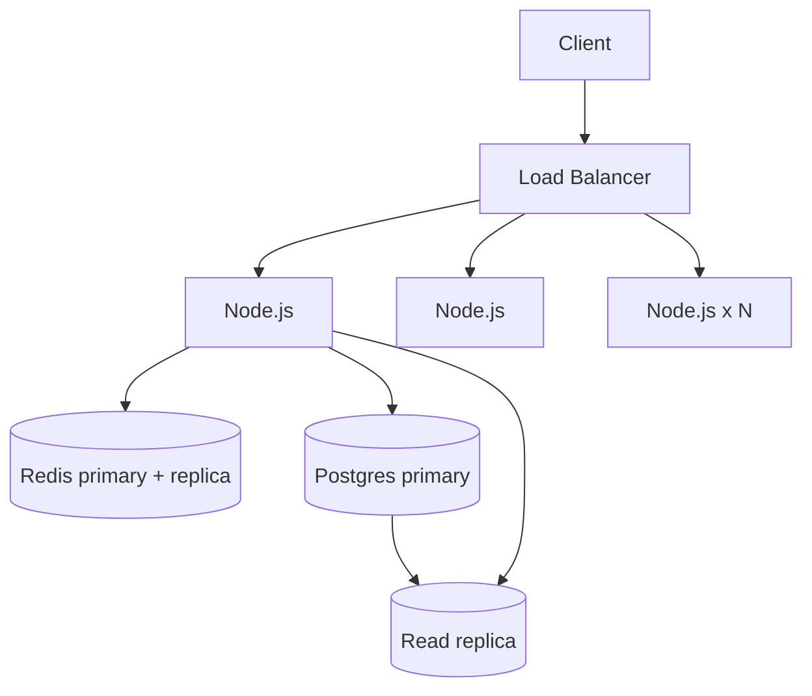
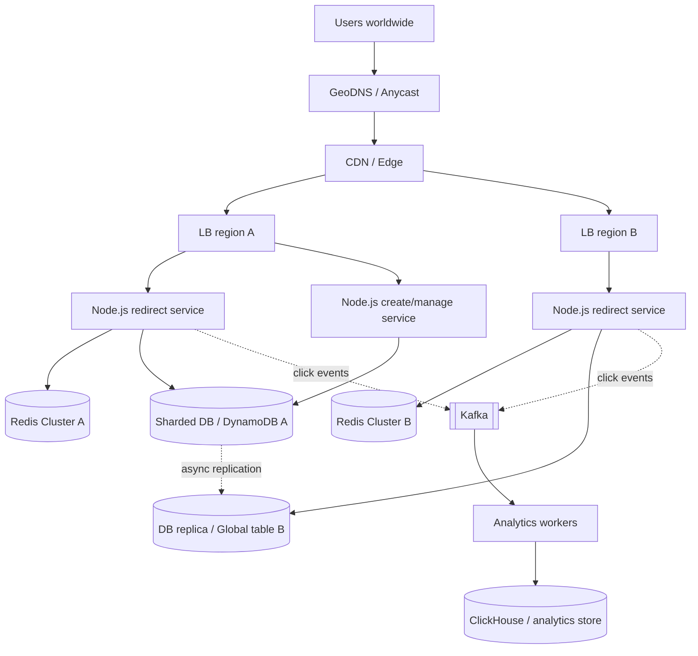

# URL Shortener -- HLD + LLD (Part 5: Trade-offs -> 3 Versions -> Follow-ups -> Node.js Questions)

> Is file mein prompt ke **Parts 21-25** hain: har major decision ka trade-off, MVP -> Scalable -> Highly Scalable versions, 18 interviewer follow-up questions, requirement change ("What if...") questions, aur Node.js specific interview questions.
> Part 4 recap: humne dekha ki 1x se 1000x tak kya tootta hai, Redis/DB/server fail hone par kya hota hai, kahan strong aur kahan eventual consistency chahiye, aur production mein kya monitor karna hai. Ab un sab decisions ko **"kyun ye, kyun woh nahi"** ki language mein bolna seekhenge -- interview yahin jeeta jaata hai.

---

## PART 21 -- Trade-offs: har decision ka "kyun ye, kyun woh nahi"

### Pehle rule samjho

Interviewer ko "X best hai" sunna pasand nahi. Woh ye sunna chahta hai:

```
Requirement kya hai  ->  Options kya hain  ->  Har option ki keemat kya hai  ->  Is requirement par kaunsi keemat chalegi
```

Har pair ke liye niche same format hai: **Pros / Cons / Kab use karunga**, aur end mein **hamare system ka decision**.

### 1. PostgreSQL vs MongoDB

| | PostgreSQL | MongoDB |
|---|---|---|
| **Pros** | UNIQUE constraint + ACID transactions; mature replication, backups, PITR; SQL se ad-hoc queries ("user ke links by date"); zyada tar teams jaanti hain | Flexible schema (har document alag fields rakh sakta hai); **sharding built-in**; nested metadata ek document mein |
| **Cons** | Built-in automatic sharding nahi (Citus / app-level sharding / partitioning chahiye); 10 TB+ par vacuum, backup, index rebuild painful | Sharded collection mein unique index tabhi enforce hota hai jab **shard key us index ka prefix** ho -- toh design usi hisaab se karna padta hai; schema discipline app ki zimmedari; multi-document transactions possible par mehenge |
| **Kab use karunga** | Schema fixed hai, uniqueness chahiye, scale single primary + replicas mein fit hai | Har link ke saath variable metadata (UTM tags, custom fields), team already Mongo par, ya shuru se hi horizontal sharding chahiye |

**Decision:** "Hamara schema fixed hai aur short_code uniqueness DB se chahiye, isliye Postgres. Mongo galat nahi hai -- agar team Mongo par hai toh `short_code` ko shard key banake bhi same design chal jaayega."

### 2. Redis vs DB (redirect lookup kahan se serve ho?)

| | Redis (cache) | Database (Postgres) |
|---|---|---|
| **Pros** | ~1 ms, memory se; ek node ~1 lakh ops/sec; DB ka 90%+ read load hata deta hai | Durable, source of truth, saara data (10 TB) rakh sakta hai, constraints + queries |
| **Cons** | Memory mehengi (10 TB RAM mein rakhna practical nahi); stale data ka risk (invalidation); ek aur component jo fail ho sakta hai | Disk + query planning, ~2-10 ms; 35K reads/sec ke liye bahut replicas chahiye |
| **Kab use karunga** | Read-heavy + repeated keys (hot links) | Har cheez ka permanent record; low traffic par akele hi kaafi |

**Decision:** "Dono. DB = truth, Redis = speed. Redis ko kabhi source of truth nahi banaunga -- Redis gaya toh system slow hoga, down nahi."

### 3. Kafka vs RabbitMQ (click analytics ke liye)

| | Kafka | RabbitMQ |
|---|---|---|
| **Pros** | **Log** hai: messages retention period tak rehte hain, **replay** kar sakte ho; bahut high throughput; ek hi stream ko multiple consumer groups alag alag padh sakte hain (analytics, fraud, billing) | Classic **queue**: per-message ack, retries, dead-letter queue, flexible routing; setup aur mental model simple |
| **Cons** | Operate karna heavy (partitions, brokers, rebalancing) -- usually managed (MSK / Confluent) lete hain; per-message delay/priority natively nahi; chhote scale par overkill | Ack ke baad message gone -- replay nahi (Streams feature alag cheez hai); bahut high volume par Kafka jitna throughput nahi; har naye consumer type ke liye alag queue bind karni padti hai |
| **Kab use karunga** | Clicks = "facts ka stream", ~35K events/sec peak, baad mein naye consumers aa sakte hain, replay chahiye | Task queue: "ye email bhejo", "ye QR generate karo" -- har message ek baar kisi worker ko, retries ke saath |

**Decision:** "Click events ek append-only stream hain aur mujhe replay chahiye (bug fix ke baad counts dobara compute karna), isliye Kafka. Agar sirf simple counter chahiye aur scale moderate hai, toh SQS ya Redis INCR + minute-wise flush bhi kaafi hai -- Kafka tab hi jab uski keemat justify ho."

> Numbers: peak 35K clicks/sec x ~200 bytes = ~7 MB/sec, ~200 GB/day raw events. Kafka ke liye ye comfortable hai; RabbitMQ bhi sambhal leta, lekin replay nahi milta.

### 4. REST vs WebSocket

| | REST (HTTP request/response) | WebSocket (persistent connection) |
|---|---|---|
| **Pros** | Stateless -> LB ke peeche easily scale; HTTP caching, status codes, tooling sab ready; har request independent | Server khud data push kar sakta hai; bahut low overhead per message; real-time |
| **Cons** | Server push nahi kar sakta; har call par headers ka overhead | **Stateful** connections -> scaling mushkil (sticky, fan-out ke liye Redis pub/sub), LB par long-lived connections, reconnect logic |
| **Kab use karunga** | Create, redirect, management APIs -- sab request/response hain | Chat, live collaboration, jahan har second updates aate hain |

**Decision:** "URL shortener ke saare APIs REST hain. Redirect toh browser ka simple GET hai -- WebSocket ka yahan koi role hi nahi."

### 5. SQL vs NoSQL (category level)

| | SQL (Postgres, MySQL) | NoSQL key-value / wide-column (DynamoDB, Cassandra) |
|---|---|---|
| **Pros** | Constraints, joins, transactions, flexible queries; ek node par bahut kuch kar leta hai | Automatic sharding, predictable latency at huge scale, multi-region replication built-in (Cassandra, DynamoDB Global Tables) |
| **Cons** | Horizontal write scaling khud design karna padta hai | Query pattern pehle se decide karna padta hai; "user ke links" jaisi query ke liye alag table/index (GSI); conditional writes se uniqueness milti hai lekin cross-item transactions limited; vendor lock-in (DynamoDB) |
| **Kab use karunga** | Default, jab tak data ~single-digit TB aur writes hazaaron/sec se kam hain | 100s of TB, 100K+ reads/sec, multi-region active writes |

**Decision:** "Access pattern pure key lookup hai, isliye NoSQL par migration natural hai -- lekin 10 TB aur 300 writes/sec par abhi zarurat nahi. Pehle Postgres, signal aaye tab shift."

### 6. Sync vs Async

| | Sync (request ke andar hi kaam) | Async (queue mein daalo, baad mein worker kare) |
|---|---|---|
| **Pros** | Simple; turant result; error seedha user ko | User ka response fast; spikes queue absorb karti hai; slow kaam (DB writes, 3rd-party calls) redirect ko slow nahi karte |
| **Cons** | Slow kaam user ki latency mein jud jaata hai; downstream down = request fail | Eventual consistency (count thoda late); duplicates handle karne padte hain; queue lag monitor karna padta hai; debugging mushkil |
| **Kab use karunga** | Short URL create (user ko code abhi chahiye), redirect lookup | Click counting, malware scan of long URL, emails, CSV exports |

**Decision:** "Jo user ko abhi chahiye woh sync, jo baad mein chal sakta hai woh async. Create sync hai -- code abhi dena hai. Click analytics async -- user ko redirect ka wait analytics ke liye nahi karna chahiye."

### 7. Polling vs WebSocket (live click dashboard ke liye)

| | Polling (har N sec GET) | WebSocket |
|---|---|---|
| **Pros** | Plain REST, stateless, cache ho sakta hai, zero naya infra | Instant updates, server push |
| **Cons** | Kuch requests bekaar (data badla hi nahi); update N sec late | Connection state, scaling, reconnect handling; clicks ka fan-out |
| **Kab use karunga** | Dashboard har 10-30 sec refresh -- user ko ye kaafi hai | Jab sach mein sub-second updates product requirement ho |

Beech ka option: **SSE (Server-Sent Events)** -- one-way server push, plain HTTP par, browser auto-reconnect karta hai.

**Decision:** "Analytics khud eventually consistent hai (worker har minute aggregate karta hai). Toh dashboard ko WebSocket se har millisecond push karne ka matlab nahi -- 30 sec polling kaafi hai."

### 8. UUID vs Snowflake

| | UUID (v4) | Snowflake (64-bit) |
|---|---|---|
| **Pros** | Zero coordination, collision practically impossible, har language mein library | Time-sortable, 64-bit (chhota), bahut high throughput, central DB call nahi |
| **Cons** | 128-bit -> Base62 mein **22 chars** (short URL ke liye bekaar); random -> B-tree index par inserts bikhre hue (page splits) | Machine ID assign karni padti hai; **clock peeche gayi toh duplicate risk**; Base62 mein **11 chars** |
| **Kab use karunga** | Internal IDs: request ID, event ID (Kafka click event ka `event_id`) | Bahut high write scale, multi-region, sortable IDs chahiye |

**Decision:** "Short code ke liye dono nahi -- counter blocks + Base62 se 7 chars milte hain. UUID main click events ke `event_id` ke liye use karunga (dedup ke liye). Snowflake tab jab central sequence bottleneck bane."

### 9. Cache vs No cache

| | Cache lagao | Cache mat lagao |
|---|---|---|
| **Pros** | Latency kam, DB load 90%+ kam, viral traffic absorb | Ek component kam; stale data ka koi risk nahi; simple debugging |
| **Cons** | Invalidation, stampede, hot key, Redis failure -- sab naye problems; cost | DB har read uthata hai; spike par DB gira toh sab gira |
| **Kab use karunga** | Read:write high (hamara 100:1), repeated keys, reads DB ki capacity ke kareeb | MVP, ~100 reads/sec -- Postgres ka shared buffer hi hot rows memory mein rakh leta hai |

**Decision:** "35K peak reads/sec par cache must hai. MVP mein nahi lagaunga -- pehle measure karunga."

### 10. 301 vs 302 (URL shortener specific)

| | 301 Moved Permanently | 302 Found |
|---|---|---|
| **Pros** | Browser (aur CDN) cache karta hai -> agli baar request hamare paas aati hi nahi -> server load aur latency kam | Har click hamare paas aata hai -> analytics, link edit/disable turant effective |
| **Cons** | Clicks count nahi honge; link edit/disable kiya toh purane browsers purani jagah jaate rahenge (cache kab tak rahega, hamare control mein nahi) | Har click server tak -> zyada load, thodi zyada latency |
| **Kab use karunga** | Analytics nahi, links immutable, cost kam rakhna hai | Analytics chahiye, links editable/blockable (phishing takedown) |

**Decision:** "302 + `Cache-Control: private, max-age=0`, kyunki analytics aur abuse takedown dono chahiye. Agar product bole analytics nahi chahiye aur links kabhi nahi badlenge, toh 301."

### 11. Counter + Base62 vs Random codes

| | Counter + Base62 | Random (7-8 chars) + retry |
|---|---|---|
| **Pros** | Collision impossible (by design); 7 chars mein 3.52 trillion; retry logic nahi | Guess nahi ho sakta (enumeration safe); koi central counter nahi |
| **Cons** | Sequential -> guessable -> private links scan ho sakte hain; sequence ek coordination point | Collision possible -> UNIQUE index + retry; DB bharne par retries badhte hain (7 chars par 18B URLs ke baad ~0.5% per insert) |
| **Kab use karunga** | Public marketing links | Private links (docs, invoices), security sensitive |

**Decision:** "Default counter + Base62. Private links hain toh random 8 chars -- 62^8 = ~218 trillion, 18B URLs par collision chance ~0.008% per insert, practically kabhi retry nahi."

### Summary: ek table mein saare decisions

| Decision | Humne kya chuna | Kab badlenge |
|---|---|---|
| Database | PostgreSQL | 100s of TB / multi-region writes -> DynamoDB/Cassandra ya sharded Postgres |
| Read path | Redis cache-aside + local LRU | Kabhi nahi hatayenge at scale; MVP mein nahi |
| Queue | Kafka (sirf analytics ke liye) | Analytics nahi -> queue hi nahi; chhota scale -> SQS |
| API style | REST | -- |
| Processing | Create sync, analytics async | -- |
| Dashboard | Polling | Sub-second requirement -> SSE/WebSocket |
| IDs | Counter blocks + Base62 | Central sequence bottleneck -> Snowflake / region-wise ranges |
| Redirect | 302 | No analytics + immutable -> 301 |
| Codes | Sequential | Private links -> random 8 chars |

> Interview line: "Har choice ek keemat ke saath aati hai. Main current requirements ke liye sabse simple option chunta hoon, aur bata deta hoon ki kaunsa metric dikhega jab mujhe switch karna padega."

---

## PART 22 -- Minimum -> Scalable -> Highly Scalable (3 versions)

Pehle socho: interviewer 3 versions kyun maangta hai? Woh dekhna chahta hai ki tum **Day 1 par Kafka + Kubernetes nahi laga doge**, aur tumhe pata hai ki **kaunsa signal** tumhe next version par le jaayega.

### Version 1 -- Simple MVP

```
Client
  |
  v
Node.js (1 instance, maybe 2 for safety)
  |
  v
PostgreSQL (1 instance + daily backups)
```

- **Kitna traffic?** Roughly ~1-2K redirects/sec tak comfortably (hardware aur query par depend). Startup ke pehle 6 mahine ke liye kaafi.
- **Components aur unka reason:**
  - **Node.js** -- business logic. Ek instance, kyunki traffic kam hai.
  - **PostgreSQL** -- source of truth + `short_code` UNIQUE index. Short codes seedha `BIGSERIAL` / sequence se -- block allocation ki zarurat bhi nahi (ek hi server hai).
  - **Backups** -- durability day 1 se chahiye; ye optional nahi hai.
- **Kya jaan-boojh ke NAHI hai:** Redis (Postgres ki memory hot rows cache kar leti hai), queue (analytics nahi hai), LB (managed platform ka built-in chal jaata hai).
- **Kamzori:** single point of failure; deploy par thoda downtime; server gira = saare links down.

**Next version par kab jaayenge? (signals)**

| Metric | Threshold (rough) | Matlab |
|---|---|---|
| Node CPU | > 70% sustained | Ek process kaafi nahi |
| p99 redirect latency | > 100 ms | Users ko slow lag raha hai |
| DB CPU / read QPS | > 60% | DB bottleneck ban raha hai |
| Uptime requirement | "Deploy par downtime nahi chalega" | HA chahiye -> multiple instances + LB |

### Version 2 -- Scalable (hamara current design)



- **Kitna traffic?** Hamara target: ~11.6K reads/sec avg, ~35K peak, ~300 writes/sec peak. Headroom roughly 2-3x (single Redis node ~1 lakh ops/sec; local LRU se aur zyada).
- **Har naya component -- "humne ye abhi kyun add kiya?"**
  - **Load Balancer** -- 35K req/sec ek process nahi sambhalega (~3-5K/instance), toh ~8-12 instances. LB traffic baantega aur health checks se mare hue instance ko hata dega. Deploy bhi rolling ho jaata hai, zero downtime.
  - **Multiple stateless Node.js** -- horizontal scaling. Stateless isliye ki koi bhi request kisi bhi instance par jaaye.
  - **ID blocks (1000 IDs per instance)** -- ab multiple servers hain, har create par `nextval()` ki jagah 1000 mein ek DB call.
  - **Redis (+ replica)** -- 100:1 read ratio; 35K reads ko DB se hataana. Replica isliye ki Redis gira toh DB par 20x load na aaye (failover).
  - **Local LRU (5 sec)** -- viral links ke liye, Redis ka hot key problem.
  - **Postgres read replica** -- cache-miss reads primary se hataana + standby for failover.
- **Kya abhi bhi NAHI hai:** CDN (bandwidth 17 MB/s, koi problem nahi), queue (analytics required nahi), sharding (10 TB 5 saal mein, single primary + partitioning se manage).

**Next version par kab jaayenge? (signals)**

| Metric | Threshold (rough) | Matlab |
|---|---|---|
| Redis ops/sec ya memory | > 60-70% of one node | Redis Cluster ka time |
| DB size / backup-restore time | Multi-TB, restore time > RTO target | Sharding / key-value store |
| Write RPS | Hazaaron/sec sustained | Single primary + central sequence bottleneck |
| Replica lag | Baar baar seconds mein | Read load replicas ki capacity se bahar |
| p95 latency far regions se | Target se upar (e.g. EU/US users ko 300+ ms) | Multi-region / edge |
| Product | "Analytics chahiye" | Queue + workers |

### Version 3 -- Highly Scalable (global, 100x+)



- **Kitna traffic?** Lakhon se millions redirects/sec (100x = ~1.16M avg, ~3.5M peak), writes ~12K avg / ~30K peak, storage ~500 GB/day.
- **Har naya component -- "humne ye abhi kyun add kiya?"**
  - **GeoDNS / Anycast + multi-region** -- user ko nearest region. Mumbai se US ka round trip hi ~200+ ms hai; server kitna bhi fast ho, distance ko cache nahi hara sakta.
  - **CDN / Edge** -- viral links edge par absorb. Lekin 302 + analytics ke saath careful: ya toh bahut chhota edge TTL (few seconds), ya edge function (Cloudflare Workers / Lambda@Edge) jo redirect bhi de aur click event bhi bheje, ya CDN access logs ko analytics source banao.
  - **Redirect service alag, create service alag** -- dono ka load profile alag hai (100:1). Redirect ko independently 100 instances tak scale karo, create ko 5 par rakho. Ek mein bug doosre ko nahi girata.
  - **Redis Cluster** -- ek node ki memory/ops limit cross. Keys hash slots se nodes mein bat jaati hain.
  - **Sharded DB ya DynamoDB/Cassandra** -- ~900 TB (100x) single primary mein nahi aayega. Shard key = `short_code` (hash) kyunki hot query `WHERE short_code = ?` hai -- ek hi shard par jaati hai.
  - **Kafka + workers + analytics store** -- ab analytics requirement hai aur 3.5M events/sec OLTP DB nahi le sakta. ClickHouse jaisa columnar store aggregates ke liye bana hai.
  - **ID generation** -- region-wise sequence ranges (region A ke blocks alag range se, region B alag) ya Snowflake (region + machine bits). Central sequence cross-region call nahi hona chahiye.
- **Keemat:** ops complexity bahut zyada, cross-region replication lag (EU mein bana link US mein 1-2 sec baad dikhega), cost, on-call load. **Isliye ye sirf tab jab signals bolein.**

### Teeno versions side by side

| | V1 MVP | V2 Scalable | V3 Highly Scalable |
|---|---|---|---|
| Traffic | ~1-2K req/s | ~35K peak | Millions/s |
| Node.js | 1-2 | 8-12 behind LB | 100s, redirect + write services alag |
| Cache | None | Redis + replica, local LRU | Redis Cluster per region + edge |
| DB | 1 Postgres | Primary + replica | Sharded / DynamoDB, multi-region |
| IDs | Sequence | Blocks of 1000 | Region ranges / Snowflake |
| Analytics | None | None (ya simple INCR) | Kafka -> workers -> ClickHouse |
| Team size to operate | 1 dev | Chhoti team | Platform team + on-call |

> Interview line: "Main V1 se start karunga, V2 hamare 100M users ke numbers ke liye target hai, aur V3 tab jab traffic 100x ho ya global latency requirement aaye. Har step par main batata hoon kaunsa metric mujhe next step par le jaayega."

---

## PART 23 -- Interview Follow-up Questions (18)

> Tip: har answer mein 3 cheezein -- **seedha answer, reason, trade-off**. Lamba lecture nahi.

### Scaling

**1. Interviewer:** "Traffic kal 10x ho gaya. Sabse pehle kya tootega?"

**My Answer:** "10x matlab ~350K peak reads/sec. Node instances stateless hain toh unhe autoscale kar dunga -- woh pehle nahi tootenge. Pehla bottleneck **single Redis node** hoga, kyunki woh roughly 1 lakh ops/sec tak hi comfortable hai. Local LRU viral keys ka bada hissa absorb karega, phir bhi main Redis Cluster ya read replicas laaunga. Doosra risk DB hai -- cache miss 5% bhi raha toh 17K+ queries/sec, toh replicas badhaunga. Writes 3K/sec tak jaayenge, jo ek Postgres primary abhi bhi le leta hai."

**2. Interviewer:** "Autoscaling kis metric par karoge?"

**My Answer:** "Node ke liye CPU (~60-70%) aur request rate per instance. Lekin sirf CPU par nahi -- event loop lag bhi dekhunga, kyunki Node CPU kam dikha ke bhi slow ho sakta hai agar kuch block kar raha ho. Aur ek catch: Node instances badhane se DB connections bhi badhte hain, toh autoscaling ka max limit connection budget se tay hoga."

### Database

**3. Interviewer:** "Postgres 10 TB ho gaya. Shard kaise karoge? Shard key kya hogi?"

**My Answer:** "Hot query `WHERE short_code = ?` hai, toh shard key `hash(short_code)` rakhunga -- har redirect exactly ek shard par jaata hai aur data barabar batta hai. Problem: 'user ke saare links' query ab saare shards par jaayegi (scatter-gather). Uske liye ek alag table `links_by_user` (shard key `user_id`) rakhunga, ya woh query analytics/search store se serve karunga. Pehle main time-based partitioning try karunga -- sharding tab jab ek machine ki capacity khatam ho. Alternative: DynamoDB par `short_code` partition key, sharding managed."

**4. Interviewer:** "Primary DB crash ho gaya create ke beech mein. Kya hoga?"

**My Answer:** "Redirects chalte rahenge -- zyada tar Redis se, baaki read replica se. Writes 20-60 second fail honge jab tak replica promote hota hai (managed RDS/Aurora automatic failover). Is dauraan create API 503 dega, retry-after ke saath. Client retry kare toh duplicate na bane, iske liye `Idempotency-Key` support rakhunga. Jo insert commit ho chuka tha lekin async replica tak nahi pahuncha, woh failover mein lose ho sakta hai -- isiliye critical setups mein synchronous replica ya Aurora jaisa storage-level replication."

### Redis

**5. Interviewer:** "Redis memory full ho gayi toh?"

**My Answer:** "`maxmemory-policy allkeys-lru` rakhunga, toh Redis kam use hone wali keys khud evict karega -- cache ke liye yahi sahi behaviour hai. Nuksaan sirf hit ratio thoda girna hai. Agar hit ratio alert ke neeche jaaye toh memory badhaunga ya cluster. `noeviction` (default) cache ke liye galat hai -- writes fail hone lagte hain."

**6. Interviewer:** "Redis down ho gaya, DB par 20x load aa gaya. Kaise bachoge?"

**My Answer:** "Pehle toh Redis replica + automatic failover, toh downtime seconds ka. Us dauraan: `enableOfflineQueue: false` aur 50 ms timeout se requests atkengi nahi, seedha DB. Circuit breaker Redis ko kuch seconds call hi nahi karega. Local LRU viral keys bachayega. Single-flight se same key ki ek hi DB query per instance. Aur agar DB phir bhi saturate ho, toh load shedding -- create API ko 503 karke redirects ko priority. Redirect business ka core hai."

### Concurrency

**7. Interviewer:** "Do users same millisecond par same custom alias maangein toh?"

**My Answer:** "Main 'check then insert' nahi karunga, woh race condition hai. Seedha INSERT karunga, `short_code` par UNIQUE index hai -- DB atomically ek ko jeetayega, doosre ko `23505` error, jisko main 409 'alias taken' mein badal dunga. Distributed lock ki zarurat nahi -- constraint zyada simple aur zyada reliable hai."

**8. Interviewer:** "Node server crash hua jab uske block mein 700 IDs bachi thi. Problem?"

**My Answer:** "Koi problem nahi. Woh 700 IDs kabhi use nahi hongi -- codes mein gap aayega, duplicate nahi. 3.52 trillion ke space mein 1000 IDs waste negligible hain. Sequence kabhi peeche nahi jaata, toh restart ke baad server naya block lega."

### Failure

**9. Interviewer:** "Deploy ke time in-flight requests ka kya? 502 aate hain."

**My Answer:** "Graceful shutdown. SIGTERM par pehle readiness check 503 karunga taaki LB naye requests bhejna band kare, thoda wait, phir `server.close()` se in-flight requests poori hone dunga, phir DB pool aur Redis band. Ek hard timeout bhi, taaki atka hua process forever na chale. Code Part 25 mein hai."

### Security

**10. Interviewer:** "Log phishing links shorten karenge. Kya karoge?"

**My Answer:** "Teen layer: create par long URL ko Google Safe Browsing jaisi blocklist se check -- ye 3rd party call hai toh timeout ke saath, aur agar slow ho toh link banao lekin async scan karo aur 'pending' rakh do. Doosra, abuse report aaye toh `is_active = false` + Redis `DEL` + local LRU 5 sec mein expire -- takedown turant. Teesra, anonymous users par strict rate limit aur new accounts ki quota kam. 302 use karne ka ek reason yahi hai -- 301 hota toh browsers cache kar chuke hote aur takedown kaam nahi karta."

**11. Interviewer:** "Koi script saare short codes enumerate kar raha hai. Kaise roko?"

**My Answer:** "Sequential codes guessable hain, toh private links ke liye random 8-char codes. Redirect par per-IP rate limit (Redis se, sliding window). 404 patterns monitor karunga -- ek IP se bahut saare 404 = scanner, usko block. Negative caching se DB bacha rehta hai. Aur sensitive links ke liye password-protected ya expiry wale links as a feature."

### Consistency

**12. Interviewer:** "User ne link banaya, turant click kiya, 404 aaya. Kyun, aur fix?"

**My Answer:** "Insert primary par gaya, lekin cache miss par read replica se padha jo abhi peeche tha -- replication lag. Ye read-after-write consistency ka problem hai. Fix options: replica par nahi mila toh ek baar primary par check (sirf not-found case mein, aur negative cache ke saath taaki bots primary ko na maarein); ya create ke time hi Redis mein key set kar do (write-through sirf naye link ke liye); ya short time ke liye 'recently created' links primary se padho. Main pehla + negative cache delete wala approach lunga -- simple hai."

### Cost

**13. Interviewer:** "Isko sasta kaise banaoge?"

**My Answer:** "Sabse bada cost DB storage aur compute hai. Ek, cache hit ratio high rakho -- har 1% hit ratio DB replicas bachata hai. Do, expired aur kabhi-na-click-hue links purge ya cold storage mein (product ke saath decide karke). Teen, analytics ka raw data 30-90 din baad sirf aggregates rakho -- raw clicks ~200 GB/day hain, woh asli storage cost hai. Chaar, Node instances autoscale -- raat ko kam. Aur Kafka/Redis Cluster jaise heavy components tab tak nahi jab tak zarurat na ho."

### Performance

**14. Interviewer:** "p99 latency achanak 300 ms ho gayi, p50 theek hai. Kaise debug karoge?"

**My Answer:** "p50 theek aur p99 kharab ka matlab kuch requests slow hain, sab nahi. Main dekhunga: cache miss wali requests (DB latency, slow query log), event loop lag (koi sync kaam block kar raha hai -- bada JSON, sync crypto), GC pauses, Redis timeouts, ya ek particular instance kharab. Distributed tracing se ek slow request ka breakdown milega -- kahan time gaya. Aur recent deploy check karunga -- aksar wahi culprit hota hai."

### Multi-region

**15. Interviewer:** "Users India, US aur EU mein hain. Multi-region kaise karoge?"

**My Answer:** "Reads 99% hain, toh har region mein redirect service + Redis + DB read replica, GeoDNS se nearest region. Writes sirf ~300/sec hain, toh ek home region ka primary kaafi hai -- doosre regions se create request home region jaayegi, thodi slow sahi. Ek link bana toh doosre region mein async replication se 1-2 sec mein pahuchega; us beech wahan miss hua toh fallback home region se padh lo. Agar sach mein har region mein local writes chahiye, toh har region ko alag ID range do taaki codes kabhi takrayein nahi, aur DynamoDB Global Tables ya Cassandra jaisa multi-master store lo."

### Disaster Recovery

**16. Interviewer:** "Poora region chala gaya, ya kisi ne galti se `DELETE FROM urls` chala diya. RPO/RTO kya hai?"

**My Answer:** "**RPO** matlab kitna data lose kar sakte hain (time mein), **RTO** matlab kitni der mein wapas chalu. Do alag scenario hain:
- **Region down:** doosre region mein cross-region replica hai -- usko promote karo, DNS switch. RTO ~15-30 min (practice ho toh kam), RPO = replication lag, usually seconds.
- **Galat DELETE / corruption:** replica bhi DELETE copy kar lega -- **replica backup nahi hai.** Iske liye daily base backup + continuous WAL archiving se **PITR (Point-In-Time Recovery)**: 'restore to 10:41:59', DELETE se ek second pehle. RPO minutes ya kam.
Ek catch: 10 TB restore ~200 MB/sec par ~14 ghante lagte hain, isliye region failure ke liye standby replica, aur backups corruption ke liye. Redis ka backup zaruri nahi -- woh DB se rebuild ho jaata hai. Aur backups ka restore har quarter actually test karunga -- untested backup ek umeed hai, backup nahi."

### Bonus (aksar poochte hain)

**17. Interviewer:** "Ek link viral ho gaya, 50K req/sec ek hi key par."

**My Answer:** "Redis Cluster mein woh key ek hi node par hai, toh woh node hot ho jaayega. Har Node instance ka 5-second local LRU isko solve karta hai -- 12 instances, har 5 sec mein 1 Redis call per instance. Stampede ke liye single-flight. Bahut extreme case mein CDN edge par short TTL."

**18. Interviewer:** "Click count exact chahiye ya approximate chalega?"

**My Answer:** "Product se poochunga. Usually approximate aur thoda late chalega -- dashboard minute-wise update. Tab Kafka + worker at-least-once processing ke saath, aur duplicates `event_id` se dedupe. Bots ke clicks filter karne padenge, warna numbers bekaar. Agar billing clicks par hai (pay-per-click), toh exact chahiye -- tab dedupe aur reconciliation strict karunga, aur raw events retain karunga taaki audit ho sake."

---

## PART 24 -- Requirement Change ("What if...") Questions

> Format har question ke liye: **Current Design -> New Problem -> Change -> Trade-off.** Interviewer ye dekhta hai ki tum design ko **modify** kar sakte ho, rata hua design repeat nahi karte.

### 1. What if traffic becomes 100x?

- **Current Design:** 8-12 Node instances, ek Redis node + replica, Postgres primary + replica, ~35K peak reads/sec.
- **New Problem:** ~3.5M peak reads/sec, ~30K peak writes/sec, ~500 GB/day storage (~900 TB in 5 years). Single Redis, single primary, central sequence -- teeno toot jaayenge.
- **Change:**
  - Redirect service alag karke ~hundreds of instances (3.5M / ~4K per instance = ~875 bina edge ke; CDN/edge ke saath kaafi kam).
  - CDN/edge caching for hot links, Redis Cluster.
  - DB: `short_code` hash se shard, ya DynamoDB/Cassandra.
  - IDs: bade blocks (10K) ya Snowflake -- central sequence par 30K writes/sec ka dabaav kam.
  - Analytics (agar hai) Kafka par, multiple partitions.
- **Trade-off:** ops complexity aur cost bahut badhegi; cross-shard queries ("user ke links") ke liye alag index table; consistency weaker (replication lag, edge TTL).

### 2. What if Redis is removed?

- **Current Design:** Redis 90%+ reads serve karta hai.
- **New Problem:** 35K reads/sec seedha Postgres par. p99 badhegi, viral link par DB CPU spike.
- **Change:** local in-process LRU cache ko bada karo (per-instance, e.g. 50-100K keys) -- Redis ka kaafi hissa yahi cover karega kyunki traffic skewed hai. Read replicas badhao (3-5). Single-flight must. Postgres `shared_buffers` bada taaki hot rows memory mein rahein.
- **Trade-off:** local cache har instance ka alag hai -> hit ratio Redis se kam (12 instances = 12 cold caches), invalidation cross-instance nahi hota (short TTL par depend). Zyada replicas = zyada cost. Latency ~1 ms se ~3-10 ms. Chhote scale par ye bilkul acceptable design hai.

### 3. What if database is down?

- **Current Design:** Postgres primary + replica, Redis cache.
- **New Problem:** creates fail; cache miss wale redirects fail.
- **Change:**
  - **Primary down:** replica automatic promote (managed failover, ~20-60 sec). Creates 503 + `Retry-After`.
  - **Poora DB layer down:** redirects jo Redis/local cache mein hain chalte rahenge (popular links = zyada tar traffic). Cache miss par 503, 404 nahi -- "link nahi hai" bolna galat hoga. Is dauraan Redis TTL extend karne ka option (stale data better than no data).
  - Circuit breaker taaki DB wapas aate hi thundering herd se phir na gire.
- **Trade-off:** degraded mode mein deleted/blocked link cache se serve ho sakta hai (stale). Async replica par failover = last few seconds ke writes lose (RPO > 0), jab tak synchronous replication na lo -- jo write latency badhata hai.

### 4. What if we need multi-region?

- **Current Design:** ek region.
- **New Problem:** far users ko latency; region down = global outage.
- **Change:** har region mein redirect stack (Node + Redis + DB read replica), GeoDNS. Writes ek home region (active-passive) -- 300 writes/sec ke liye kaafi. Doosre region mein standby jo promote ho sake.
- **Trade-off:** replication lag -- EU mein bana link US mein 1-2 sec baad; fallback-to-home-region read se fix. Active-active writes chahiye toh ID ranges per region + multi-master store (Cassandra / DynamoDB Global Tables) + conflict rules (custom alias do regions mein ek saath liya toh? last-writer-wins galat hai -- alias ko home region se hi allocate karo). Cost roughly 2x.

### 5. What if latency needs to be under 50 ms?

- **Current Design:** server-side ~2-3 ms (cache hit), ~5-15 ms (miss).
- **New Problem:** server already fast hai! Asli latency **network** hai -- DNS, TCP + TLS handshake, distance. Mumbai se US region ka ek round trip hi ~200+ ms.
- **Change:** pehle clarify: "50 ms p99 server-side ya user-perceived?" Server-side toh already mil raha hai. User-perceived ke liye: multi-region / edge redirects (Cloudflare Workers + edge KV), TLS session resumption, HTTP/2-3 keep-alive, anycast. Server side: cache miss kam (local LRU), DB queries index-only.
- **Trade-off:** edge par data = eventual consistency (delete/edit edge tak seconds mein pahuchega); edge platform lock-in; cost.

### 6. What if one user creates 10 million records?

- **Current Design:** per-IP/per-user rate limit on create.
- **New Problem:** 10M links x ~500 B = ~5 GB ek user ka. Spam/abuse ho sakta hai, ya genuine enterprise customer (bulk SMS campaign). "Mere links" page ki query heavy, export heavy. Agar user-based sharding hota toh ek shard hot ho jaata.
- **Change:**
  - Pehle poochho: abuse ya legit? Free tier par **quota** (e.g. 1000 links/day -- us rate par 10M links mein ~27 saal lagenge). Enterprise ke liye paid plan + **bulk API** (async job: CSV upload -> queue -> worker -> result file).
  - "Mere links" par **cursor pagination** (`WHERE user_id = $1 AND created_at < $cursor ORDER BY created_at DESC LIMIT 50`), OFFSET nahi.
  - Export via **streams** (Part 25).
  - Shard key `short_code` hai, `user_id` nahi -- toh ek user ka data khud hi saare shards mein bat jaata hai. Achha hai.
- **Trade-off:** quota legit users ko bhi rok sakta hai -> plan-based limits. Bulk async job = user ko result turant nahi milta.

### 7. What if requests are duplicated?

- **Current Design:** create par har request naya code banati hai.
- **New Problem:** mobile network timeout -> client retry -> ek hi long URL ke 2 short codes. Free product mein mostly harmless (do links, dono kaam karte hain), lekin quota galat kat-ta hai, aur paid features (custom alias purchase) mein double charge.
- **Change:** `Idempotency-Key` header. **Idempotency ka simple matlab:** same request accidentally 2 baar aaye, toh operation 2 baar nahi hona chahiye.

```ts
async function withIdempotency(key: string, userId: string, run: () => Promise<object>) {
  const redisKey = `idem:${userId}:${key}`;
  const claimed = await redis.set(redisKey, 'IN_PROGRESS', 'EX', 86_400, 'NX');
  if (claimed !== 'OK') {
    const saved = await redis.get(redisKey);
    if (saved === 'IN_PROGRESS') throw new AppError(409, 'REQUEST_IN_PROGRESS', 'Retry shortly');
    return JSON.parse(saved!);
  }
  try {
    const result = await run();
    await redis.set(redisKey, JSON.stringify(result), 'EX', 86_400);
    return result;
  } catch (err) {
    await redis.del(redisKey);
    throw err;
  }
}
```

**Code Explanation:**

- `idem:${userId}:${key}` -- key user ke saath scope ki, taaki do users ka same random key takra na jaaye.
- `SET ... NX EX 86400` -- **atomic claim**: pehli request jeetegi, 24 ghante ke liye. Do retries ek saath aayein toh bhi sirf ek aage badhegi.
- `saved === 'IN_PROGRESS'` -- pehli request abhi chal rahi hai -> 409, client thoda ruk ke retry kare.
- `return JSON.parse(saved!)` -- pehli request poori ho chuki -> **wahi response** dobara bhejo, naya code mat banao.
- `catch -> redis.del` -- pehli request fail hui toh claim hatao, taaki retry dobara try kar sake.
- **Honest caveat:** Redis mein claim hai, DB mein insert -- ye do alag systems hain. Redis key evict/lost ho gayi toh duplicate ban sakta hai. Free links ke liye ye chalega; paise wale kaam ke liye idempotency key **DB mein, same transaction mein** (What if #9).
- **Redirect (GET)** already idempotent hai -- do baar redirect se kuch nahi bigadta. Sirf click double count ho sakta hai -> analytics `event_id` se dedupe.
- **Trade-off:** ek Redis round trip extra per create; clients ko key bhejni padegi.

### 8. What if two servers generate the same ID?

- **Current Design:** Postgres sequence se blocks -- atomic, toh normal operation mein ye ho hi nahi sakta.
- **New Problem:** phir kab ho sakta hai?
  - Kisi ne IdGenerator bypass karke in-memory counter bana diya (bug).
  - Redis `INCR` counter use kiya aur Redis bina persistence restart hua -> counter peeche.
  - Snowflake mein clock peeche gayi, ya do machines ko same machine ID mila.
  - Multi-region mein dono regions ka apna sequence same range se.
  - **DB PITR restore:** sequence bhi purani value par wapas -> jo codes restore point ke baad users ko diye gaye the (aur ab lost hain), woh **naye links ko dobara mil jaayenge** -- purana printed poster naye URL par jaane lagega!
- **Change:** UNIQUE index last line of defence hai -- duplicate insert fail -> retry with next ID (Part 2 ka retry loop). Multi-region: har region ko alag range (e.g. region ID ko high bits mein). Snowflake: clock backward detect karke wait/refuse. **Restore ke baad sequence ko `setval` se bade gap ke saath aage badhao** (runbook ka hissa).
- **Trade-off:** layered safety thoda extra code/process hai, lekin galat redirect sabse bura failure hai -- iske liye ye keemat sasti hai.

### 9. What if we need exactly-once payment?

Pehle honest baat: **URL shortener payment system nahi hai** -- payments ka poora design (ledger, reconciliation, provider webhooks) is series ka alag system hai (Payment System / Idempotent API). Lekin interviewer ye dekhna chahta hai ki tum "exactly-once" ko samajhte ho.

- **Current Design:** koi payment nahi. Maan lo naya feature: **paid custom alias** -- `sho.rt/nike` ke liye Rs 499.
- **New Problem:** network par **exactly-once delivery possible nahi hai** -- request pahuchi ya response lost hua, client ko pata nahi. Client retry karega. Bina protection ke double charge ya paisa kata lekin alias nahi mila.
- **Change -- "effectively once" banao:**

```sql
CREATE TABLE alias_orders (
  id               BIGSERIAL PRIMARY KEY,
  user_id          BIGINT      NOT NULL,
  idempotency_key  TEXT        NOT NULL,
  alias            VARCHAR(30) NOT NULL,
  status           TEXT        NOT NULL,   -- PENDING -> PAID -> ALIAS_ASSIGNED / FAILED
  provider_ref     TEXT,
  UNIQUE (user_id, idempotency_key)
);
```

  1. Client ek `Idempotency-Key` bhejta hai. Server `alias_orders` mein row insert karta hai -- UNIQUE constraint ki wajah se retry ko **wahi order** milta hai, naya nahi.
  2. Payment provider (Stripe/Razorpay) ko call karte waqt **wahi idempotency key** provider ko bhi bhejo -- provider bhi dobara charge nahi karega.
  3. Provider ka webhook "paid" bolta hai -> ek transaction mein: order `PAID -> ALIAS_ASSIGNED` + `urls` mein alias insert. Webhook bhi duplicate aa sakta hai -> status check (`WHERE status = 'PAID'`) se dusri baar kuch nahi hoga.
  4. Alias beech mein kisi aur ne le liya (unique violation) -> order `FAILED` + refund.
  5. Daily **reconciliation job**: provider ke records vs hamare orders -- jo mismatch ho usko fix.
- **Trade-off:** state machine, webhooks, reconciliation -- bahut zyada complexity. Isliye ye sirf paise wale path par; free link creation ke liye Redis idempotency (What if #7) kaafi hai.

> Interview line: "Exactly-once delivery network par guarantee nahi hoti. Main at-least-once delivery + idempotent processing se effectively-once banata hoon: client idempotency key, DB unique constraint, provider ko bhi same key, aur reconciliation."

### 10. What if analytics becomes required later?

- **Current Design:** 302 already hai (achha decision tha -- 301 hota toh purane clicks browser cache se kabhi aate hi nahi). Koi queue nahi.
- **New Problem:** har click (~35K/sec peak) record karna, redirect slow kiye bina.
- **Change:** redirect handler response bhejne ke baad click event (`event_id` UUID, short_code, timestamp, country from IP, user-agent) Kafka producer ke in-memory batch mein daale -- fire-and-forget. Consumer workers batch mein ClickHouse / aggregates table mein likhein. Dashboard polling.
- **Trade-off:** counts eventually consistent (seconds-minutes late). Kafka producer down ho toh events drop ya local buffer -- product se poochho "kuch clicks lose ho gaye toh chalega?" Usually haan. Privacy: IP/user-agent personal data hai -> retention policy, IP ko hash/truncate karo.

### 11. What if links must be editable (destination change)?

- **Current Design:** mapping immutable maana tha; cache 24h TTL.
- **New Problem:** edit ke baad purana URL cache (Redis 24h, local 5s, browser) se serve hota rahega.
- **Change:** `PATCH /api/v1/urls/:code` -> pehle DB update, phir Redis `DEL` (+ delayed double delete). 302 **must** (301 browser mein chipak jaata hai). Local LRU 5 sec -- acceptable. Audit table (`url_history`) -- kisne kab kya badla, kyunki edit ka misuse ho sakta hai (safe link banao, viral hone ke baad phishing par point karo) -> edit par dobara Safe Browsing scan.
- **Trade-off:** ab strong-ish consistency chahiye edits ke liye -> invalidation path critical ho gaya. Edge caching ka TTL chhota rakhna padega.

### 12. What if same long URL must return the same short URL?

- **Current Design:** koi dedup nahi, har create naya code.
- **New Problem:** create par pehle dhundhna padega "ye URL already hai?" -- 2048-char TEXT par index mehenga.
- **Change:** `long_url_hash` (SHA-256, 32 bytes) column + UNIQUE index `(long_url_hash)` (ya `(user_id, long_url_hash)` agar per-user dedup chahiye). Insert `ON CONFLICT (long_url_hash) DO NOTHING RETURNING short_code`; kuch return nahi hua toh existing row padho. URL **normalize** pehle karo (host lowercase, default port hatao) warna `HTTP://A.com` aur `http://a.com` alag ginenge.
- **Trade-off:** extra index = write slow + storage (~18B x 32 bytes = sirf hash ~576 GB, index overhead alag). Global dedup mein ek user ki expiry/analytics doosre user ke saath share ho jaati hai -- isliye usually per-user dedup better. Hash collisions SHA-256 par practically nahi, lekin safe rehne ke liye match hone par `long_url` bhi compare karo.

---

## PART 25 -- Node.js Specific Interview Questions

### Q1. "Node.js single-threaded hai, toh high traffic kaise handle karega?"

**My Answer:** "Node ka **JavaScript execution** single-threaded hai, poora Node nahi. Hamare URL shortener mein ek request ka kaam hai: Redis se GET, miss par Postgres query, response. Ye sab **I/O** hai -- CPU us time kuch nahi karta, bas wait karta hai. Node I/O ko non-blocking tareeke se OS (epoll/kqueue) aur libuv ko de deta hai, aur jab tak Redis jawab de, event loop doosri hazaaron requests ka JS chala leta hai. Har request ka JS part microseconds ka hai, isliye ek process hazaaron requests/sec kar leta hai.

Iski limit: agar koi request **CPU-heavy** kaam kare (bada JSON parse, sync hashing, image generation), toh poora event loop ruk jaata hai aur saari requests slow. Isliye CPU work worker threads ya alag service mein.

Aur ek process ek CPU core use karta hai, toh production mein **multiple processes** chalata hoon -- containers (1 process per container) ya cluster module -- load balancer ke peeche. Hamare design mein 8-12 instances, har ek ~3-5K req/sec."

```
Thread (JS)     : [req1 JS][req2 JS][req3 JS][req1 resume][req4 JS]...
libuv / OS      :    |--- Redis GET req1 ---|
                          |--- DB query req2 ------------|
```

### Q2. "Event loop ke phases kya hain? `process.nextTick` aur Promise kab chalte hain?"

**My Answer:** "libuv ka loop phases mein ghoomta hai: **timers** (`setTimeout`/`setInterval` callbacks), pending callbacks, **poll** (naye I/O events -- yahin hamare Redis/DB responses aate hain), **check** (`setImmediate`), close callbacks. Har callback ke baad microtasks drain hote hain: pehle `process.nextTick` queue, phir Promise queue. Practical matlab: `await` ke baad ka code microtask hai, aur agar koi code infinite microtasks ya lamba sync loop banaye, toh I/O phase tak loop pahunchta hi nahi -- server 'hang' lagta hai jabki CPU 100% hai."

### Q3. "async/await actually kya karta hai? Koi common mistake?"

**My Answer:** "`async` function hamesha Promise return karta hai. `await` function ko wahi pause karta hai aur **thread ko free** kar deta hai -- thread block nahi hota. Common mistake: independent kaam ek ke baad ek await karna."

```ts
// Slow: 2 independent calls, ek ke baad ek  (~10 ms + ~10 ms)
const link = await repo.findOwned(code, userId);
const stats = await analytics.getStats(code);

// Fast: dono parallel (~10 ms)
const [link2, stats2] = await Promise.all([
  repo.findOwned(code, userId),
  analytics.getStats(code),
]);
```

**Code Explanation:**

- Pehle version mein `getStats` tabhi shuru hota hai jab `findOwned` khatam -- latency jud jaati hai.
- `Promise.all([...])` -- dono calls **ek saath start**, dono ka wait. Total time = sabse slow wala.
- Dhyan: parallel sirf tab jab calls ek doosre par depend na karein. Aur loop mein 10,000 calls parallel mat karo -- DB pool choke ho jaayega (bounded concurrency chahiye).

### Q4. "Promise.all vs Promise.allSettled -- kab kaunsa?"

**My Answer:** "`Promise.all` **fail-fast** hai: ek bhi reject hua toh poora reject. Jab saare results zaruri hon tab. `Promise.allSettled` sabka wait karta hai aur har result ka status deta hai -- jab kuch results optional hon. Hamare link details page par link row zaruri hai, lekin click stats optional -- analytics store down ho toh bhi link dikhao."

```ts
async getLinkDetails(code: string, userId: string) {
  const [linkRes, statsRes] = await Promise.allSettled([
    this.repo.findOwned(code, userId),
    this.analytics.getStats(code),
  ]);
  if (linkRes.status === 'rejected') throw linkRes.reason;
  if (!linkRes.value) throw AppError.notFound();
  return {
    ...linkRes.value,
    stats: statsRes.status === 'fulfilled' ? statsRes.value : null,
  };
}
```

**Code Explanation:**

- `Promise.allSettled([...])` -- dono parallel; koi fail ho toh bhi dono ka result milega.
- `linkRes.status === 'rejected'` -- link ka DB call fail = asli error, upar bhejo (500).
- `!linkRes.value` -- link nahi mila ya is user ka nahi -> 404.
- `stats: ... ? statsRes.value : null` -- stats fail hue toh `null`; UI "stats temporarily unavailable" dikhayega. **Graceful degradation.**
- Bonus: `Promise.race` / `AbortSignal.timeout(ms)` -- timeout ke liye; `Promise.any` -- pehla successful result (e.g. do replicas mein se jo pehle jawab de).

### Q5. "Worker threads kab use karoge is system mein?"

**My Answer:** "Worker threads CPU-heavy kaam ke liye hain, I/O ke liye nahi -- I/O ke liye event loop already best hai. Hamare system mein:
- **SHA-256 of a URL** (dedup) -- microseconds ka kaam, worker ki zarurat nahi. Worker ko message bhejna hi usse mehenga padega.
- **Password hashing** -- `bcrypt`/`crypto.scrypt` ka **async** version use karo; woh already libuv threadpool par chalta hai. Galti `scryptSync` hai.
- **QR code PNG generation** -- ms level CPU. Kam volume par main thread chal jaata hai. Zyada volume par worker pool (Piscina), ya better: QR deterministic hai, **ek baar generate karke S3/CDN par cache karo**.
- **Bulk CSV import (lakhon rows parse + validate)** -- worker thread ya alag worker service.
Rule: pehle event loop lag measure karo, phir worker lagao."

### Q6. "Cluster module vs multiple containers?"

**My Answer:** "Dono ka goal same hai -- har CPU core par ek Node process. **Cluster module** ek machine par primary process kuch workers fork karta hai jo same port share karte hain (Linux par primary round-robin karta hai). VM par PM2 cluster mode ke saath ye simple hai. **Kubernetes/ECS** mein main 1 process per container rakhta hoon aur replicas badhata hoon -- orchestrator restart, health checks, scaling, per-process metrics sambhal leta hai; cluster module ek extra layer ban jaata hai. Hamare design mein har process ka apna IdGenerator block aur apna local LRU hai -- dono models mein bina change ke kaam karta hai, kyunki har process independent hai."

### Q7. "Multiple Node instances behind LB -- kya kya stateless hona chahiye?"

**My Answer:** "Jo cheez **correctness** ke liye sab instances mein same honi chahiye, woh memory mein nahi rakh sakte:
- **Sessions/auth** -- JWT ya Redis session, memory nahi.
- **Rate limiter** -- in-memory counter galat hai: 12 instances = user ko 12x limit. Redis-based counter chahiye.
- **Cron jobs** -- har instance par chalega -> distributed lock ya alag worker.
Jo sirf **performance** ke liye hai woh per-instance chalega: local LRU (5 sec stale acceptable), IdGenerator block (har instance ki alag range -- uniqueness sequence se aati hai, memory se nahi)."

### Q8. "Connection pool size kaise decide karoge?"

**My Answer:** "Do constraints:
1. **Postgres side:** har connection Postgres mein ek process hai (kuch MB memory). Default `max_connections` 100 hai. Formula: `instances x pool.max <= max_connections - reserved (admin, replication)`. 12 instances x 20 = 240 -> 100 wale DB par 'too many connections'.
2. **Need side (Little's law):** busy connections = queries/sec x query time. Peak 35K reads, 5% miss = 1750 queries/sec / 12 instances = ~146/sec per instance x ~5 ms = **~0.7 connection** busy on average. Toh pool 10 bhi kaafi hai; 20 spikes ke liye.
Bada pool fayda nahi deta -- DB par contention badhta hai. Instances autoscale hote hain toh beech mein **PgBouncer** (transaction pooling): 500 client connections -> 50 real DB connections. Caveat: transaction mode mein session-level cheezein (`SET`, advisory locks, kuch prepared statement setups) carefully use karni padti hain."

```ts
const db = new Pool({
  connectionString: config.databaseUrl,
  max: 10,
  idleTimeoutMillis: 30_000,
  connectionTimeoutMillis: 2_000,
  statement_timeout: 1_000,
});
db.on('error', (err) => logger.error({ err }, 'idle pg client error'));
```

**Code Explanation:**

- `max: 10` -- per instance max 10 connections (upar ka math).
- `idleTimeoutMillis: 30_000` -- 30 sec idle connection band -> raat ko kam traffic par DB connections free.
- `connectionTimeoutMillis: 2_000` -- pool khaali hai toh 2 sec se zyada wait nahi, error do. Warna requests pool ke liye queue mein latak jaati hain aur timeout ka pata hi nahi chalta.
- `statement_timeout: 1_000` -- Postgres khud 1 sec se lambi query cancel karega. Redirect path par koi query 1 sec nahi leni chahiye; lambi query = bug, usko DB ko rokne mat do.
- `db.on('error', ...)` -- idle connection achanak toot jaaye (DB restart) toh pool `error` event deta hai; listener na ho toh **process crash**.

### Q9. "Graceful shutdown kaise karoge?"

**My Answer:** "Deploy ya scale-down par process ko SIGTERM milta hai. Agar turant exit kiya toh in-flight requests 502 ho jaati hain aur half-done kaam atak jaata hai. Steps: readiness fail -> LB ko time do -> naye connections band -> in-flight poori -> DB/Redis band -> exit, aur ek hard timeout."

```ts
// server.ts
import { buildApp } from './app';
import { lifecycle } from './infra/lifecycle';   // { draining: false }
import { config } from './config';
import { logger } from './infra/logger';

const { app, db, redis } = buildApp();          // /health: 503 jab lifecycle.draining
const server = app.listen(config.port);

async function shutdown(signal: string) {
  if (lifecycle.draining) return;
  lifecycle.draining = true;
  logger.info({ signal }, 'shutdown started');

  setTimeout(() => { logger.error('forced exit'); process.exit(1); }, 25_000).unref();

  await new Promise((r) => setTimeout(r, 5_000));
  await new Promise<void>((resolve) => server.close(() => resolve()));
  await Promise.allSettled([db.end(), redis.quit()]);
  logger.info('shutdown complete');
  process.exit(0);
}

process.on('SIGTERM', () => void shutdown('SIGTERM'));
process.on('SIGINT', () => void shutdown('SIGINT'));
```

**Code Explanation:**

- `lifecycle.draining` -- ek shared flag. `app.ts` ka `/health` isko padh ke `503` dega jab draining ho -- LB/Kubernetes readiness probe fail -> naya traffic is instance ko band.
- `if (lifecycle.draining) return;` -- SIGTERM do baar aaya toh shutdown do baar mat chalao.
- `setTimeout(... process.exit(1), 25_000).unref()` -- **hard deadline**: kuch atak gaya toh bhi 25 sec mein exit (Kubernetes default grace period 30 sec hai, uske andar). `unref()` -- ye timer akela process ko zinda na rakhe.
- `await ... setTimeout(r, 5_000)` -- LB ko health check fail notice karne mein kuch seconds lagte hain. Us beech aayi requests abhi bhi serve ho jaati hain.
- `server.close(...)` -- naye connections accept band, aur jab saari in-flight requests khatam, callback. (Node 19+ mein `close()` idle keep-alive connections bhi band karta hai; purane versions mein `server.closeIdleConnections()` call karo.)
- `Promise.allSettled([db.end(), redis.quit()])` -- pool ke connections aur Redis cleanly band. `allSettled` -- ek fail ho toh bhi doosra band ho.
- `process.exit(0)` -- clean exit.
- Worker (Kafka consumer) ke liye bhi same idea: `consumer.disconnect()` -- current batch poora, offsets commit, phir exit.

### Q10. "Streams aur backpressure -- is system mein kahan?"

**My Answer:** "User 'Export my links as CSV' dabata hai aur uske 1 million links hain. Naive tareeka: `SELECT *` -> 1M rows memory mein -> string banao -> bhejo. Memory 500 MB+, event loop block, doosri requests slow. **Stream** mein rows thodi thodi DB se aati hain aur thodi thodi client ko jaati hain. **Backpressure** ka matlab: client slow hai (mobile network) toh hum DB se padhna bhi slow kar dete hain, taaki memory mein data jama na ho."

```ts
import QueryStream from 'pg-query-stream';
import { Transform } from 'node:stream';
import { pipeline } from 'node:stream/promises';

exportCsv = async (req: Request, res: Response) => {
  const client = await this.replicaPool.connect();
  try {
    const rows = client.query(new QueryStream(
      'SELECT short_code, long_url, created_at FROM urls WHERE user_id = $1 ORDER BY created_at',
      [res.locals.userId],
      { batchSize: 1000 },
    ));
    const toCsv = new Transform({
      objectMode: true,
      transform(row, _enc, cb) {
        cb(null, `${row.short_code},${csvCell(row.long_url)},${row.created_at.toISOString()}\n`);
      },
    });
    res.setHeader('Content-Type', 'text/csv');
    res.setHeader('Content-Disposition', 'attachment; filename="links.csv"');
    res.write('short_code,long_url,created_at\n');
    await pipeline(rows, toCsv, res);
  } finally {
    client.release();
  }
};

function csvCell(v: string): string {
  const safe = /^[=+\-@]/.test(v) ? `'${v}` : v;
  return `"${safe.replace(/"/g, '""')}"`;
}
```

**Code Explanation:**

- `this.replicaPool.connect()` -- ek dedicated connection, kyunki cursor poore export tak khula rahega. **Replica** par, taaki lamba export primary ko na chhue.
- `new QueryStream(sql, params, { batchSize: 1000 })` -- Postgres **cursor**: ek baar mein 1000 rows fetch, saari nahi.
- `new Transform({ objectMode: true, ... })` -- har row object ko CSV line (string) mein badalta hai.
- `res.write(header)` -- pehli line: column names.
- `await pipeline(rows, toCsv, res)` -- **backpressure yahin handle hota hai.** `res` ka buffer bhar gaya (slow client) -> `toCsv` ruk jaata hai -> `rows` agla batch DB se fetch nahi karta. Memory flat rehti hai, chahe 1M rows hon. Client beech mein disconnect kare -> pipeline saare streams destroy karke reject karta hai, leak nahi.
- `finally { client.release() }` -- connection hamesha pool mein wapas, error ho ya nahi. Bhool gaye toh pool dheere dheere khaali -> saari requests `connectionTimeout`.
- `csvCell` -- value ko quotes mein, andar ke `"` double. `=`, `+`, `-`, `@` se shuru hone wali value ke aage `'` -- **CSV/formula injection** se bachao (Excel `=HYPERLINK(...)` ko formula samajh ke chala deta hai).
- Production: ek user ke ek saath max 1 export (rate limit), kyunki har export ek DB connection pakad ke rakhta hai. Bahut bade exports -> async job jo file S3 par likhe aur download link email kare.

### Q11. "Live click dashboard ke liye WebSockets lagaoge?"

**My Answer:** "Pehle poochunga: 'kitna live?' Hamara analytics pipeline khud minute-level aggregate karta hai, toh WebSocket se har second push karne ka fayda nahi -- data hi har minute badal raha hai. **Polling har 15-30 sec** kaafi hai -- stateless, cacheable, zero naya infra. Agar product sach mein live ticker chahta hai, toh pehle **SSE** (one-way push, plain HTTP). WebSocket tab jab two-way chahiye. WebSocket ki keemat: connections stateful hain, har instance ke paas alag users -> click events ko sahi instance tak pahunchane ke liye Redis pub/sub ya Kafka fan-out, LB par long-lived connections, deploy par saare connections reconnect (thundering herd), aur har connection memory leta hai."

### Q12. "Redis client -- kitne connections? Pipelining kya hai?"

**My Answer:** "ioredis mein **ek connection per process** kaafi hai, kyunki Redis single-threaded hai aur ek connection par multiple commands bina response ka wait kiye bheje ja sakte hain -- responses same order mein aate hain. Pool ki zarurat nahi (Postgres se ulta). Exceptions: blocking commands (`BLPOP`) aur **pub/sub subscriber** ko alag connection chahiye, kyunki woh connection 'busy' ho jaata hai."

```ts
const redis = new Redis(config.redisUrl, {
  enableOfflineQueue: false,
  commandTimeout: 50,
  maxRetriesPerRequest: 1,
  enableAutoPipelining: true,
});

// Bulk warm-up: 1000 keys, 1 round trip
const pipe = redis.pipeline();
for (const { code, url } of topLinks) pipe.set(`url:${code}`, url, 'EX', 86_400);
await pipe.exec();
```

**Code Explanation:**

- `enableOfflineQueue: false` -- disconnect hai toh command queue mein mat rakho, turant fail -> DB fallback (Part 2). Default `true` mein redirect Redis ke wapas aane tak latakta.
- `commandTimeout: 50` -- 50 ms mein jawab nahi toh error = cache miss.
- `maxRetriesPerRequest: 1` -- ek fail command ko baar baar retry mat karo.
- `enableAutoPipelining: true` -- ek event loop tick mein aaye saare commands ioredis khud ek batch mein bhejta hai -- 35K req/sec par network round trips kam.
- `redis.pipeline()` + `pipe.exec()` -- 1000 `SET` ek round trip mein. 1000 alag round trips x ~0.5 ms = 500 ms vs ek batch ~ kuch ms. Dhyan: pipeline **atomic nahi** hai (beech mein doosre clients ke commands aa sakte hain); atomic chahiye toh `MULTI` ya Lua.

### Q13. "DB connection handling mein kya galtiyan hoti hain?"

**My Answer:** "Teen common galtiyan:
1. **`pool.connect()` ke baad `release()` bhoolna** -- har leak ek connection kha jaata hai, kuch ghante baad pool khaali. Hamesha `try/finally`.
2. **Transaction `pool.query` se chalana** -- `pool.query('BEGIN')` aur agli `pool.query(...)` **alag connections** par ja sakti hain! Transaction ke liye ek client lo, uspe BEGIN/COMMIT/ROLLBACK.
3. **Har request par `new Pool()` / `new Client()`** -- har baar TCP + TLS + auth, aur connections ka flood. Pool ek baar app start par (composition root, Part 2)."

```ts
const client = await db.connect();
try {
  await client.query('BEGIN');
  await client.query('UPDATE alias_orders SET status = $1 WHERE id = $2 AND status = $3', ['ALIAS_ASSIGNED', orderId, 'PAID']);
  await client.query('INSERT INTO urls (id, short_code, long_url, user_id) VALUES ($1, $2, $3, $4)', [id, alias, longUrl, userId]);
  await client.query('COMMIT');
} catch (err) {
  await client.query('ROLLBACK');
  throw err;
} finally {
  client.release();
}
```

**Code Explanation:**

- `db.connect()` -- pool se **ek** client; transaction ki saari queries isi par.
- `BEGIN ... COMMIT` -- dono statements ek saath hon ya bilkul na hon (What if #9 wala paid alias).
- `AND status = $3` -- sirf `PAID` order hi assign ho; duplicate webhook par 0 rows update -> idempotent.
- `catch -> ROLLBACK` -- beech mein fail (e.g. alias unique violation) toh aadha kaam undo.
- `finally -> release()` -- connection wapas pool mein, har haal mein.

### Q14. "Kafka consumer Node.js mein kaise likhoge (click events)? At-least-once kya hai?"

**My Answer:** "**Consumer group** ka matlab: same `groupId` wale saare worker instances topic ki partitions aapas mein baant lete hain -- har partition ek time par group ke ek hi consumer ko. 12 partitions, 4 workers -> har worker 3 partitions. **Offset** = partition mein kahan tak padh liya. Main offset **DB write ke baad** commit karta hoon: crash hua toh last committed offset se dobara padhega -> kuch events do baar aayenge. Isko **at-least-once** kehte hain. Isliye processing **idempotent** honi chahiye -- har event ka `event_id` (UUID) aur DB mein `ON CONFLICT DO NOTHING`."

```ts
import { Kafka } from 'kafkajs';

const kafka = new Kafka({ clientId: 'click-worker', brokers: config.kafkaBrokers });
const consumer = kafka.consumer({ groupId: 'click-aggregator' });

await consumer.connect();
await consumer.subscribe({ topic: 'url-clicks', fromBeginning: false });

await consumer.run({
  eachBatchAutoResolve: false,
  eachBatch: async ({ batch, resolveOffset, heartbeat }) => {
    const events = batch.messages.map((m) => JSON.parse(m.value!.toString()) as ClickEvent);
    await db.query(
      `INSERT INTO click_events (event_id, short_code, clicked_at, country)
       SELECT * FROM unnest($1::uuid[], $2::text[], $3::timestamptz[], $4::text[])
       ON CONFLICT (event_id) DO NOTHING`,
      [events.map((e) => e.eventId), events.map((e) => e.shortCode),
       events.map((e) => e.clickedAt), events.map((e) => e.country)],
    );
    for (const m of batch.messages) resolveOffset(m.offset);
    await heartbeat();
  },
});
```

**Code Explanation:**

- `groupId: 'click-aggregator'` -- consumer group. Aur worker chalao -> Kafka partitions rebalance karke baant dega. Max parallelism = partitions ki sankhya.
- `fromBeginning: false` -- naya group latest se padhe. Replay chahiye (bug fix ke baad recompute) toh naya group ya offsets reset.
- `eachBatch` -- ek ek message ki jagah batch -> ek DB insert mein 500 events. 35K events/sec par per-message insert DB ko maar dega.
- `unnest($1::uuid[], ...)` -- arrays ko rows mein badal ke ek hi `INSERT` mein bulk insert.
- `ON CONFLICT (event_id) DO NOTHING` -- **idempotency.** Redelivery par same `event_id` dobara insert nahi hoga. Agar hum seedha `UPDATE counts SET clicks = clicks + n` karte, toh replay par count double ho jaata.
- `eachBatchAutoResolve: false` + `resolveOffset` **DB write ke baad** -- pehle DB, phir offset. Ulta kiya (pehle commit, phir crash) toh events **lose** ho jaate (at-most-once).
- `heartbeat()` -- Kafka ko batao "zinda hoon", warna lamba batch processing par group rebalance kar dega aur partitions kisi aur ko de dega.
- Partition key: counting mein order matter nahi karta, toh key random/event_id rakho -- warna viral link ki saari events ek partition par (hot partition).
- Poison message (invalid JSON) -- `JSON.parse` throw karega aur batch baar baar fail hoga. Production mein try/catch karke usko **dead-letter topic** mein bhejo aur aage badho.

### Q15. "Event loop block kaise hota hai? Is system mein kaunse pitfalls?"

**My Answer:** "Koi bhi lamba **synchronous** kaam poore process ki saari requests ko rok deta hai. Hamare system mein:
1. **Bada `JSON.parse`** -- koi 50 MB body bheje toh parse synchronous hai. Isliye `express.json({ limit: '10kb' })` (Part 2). Bulk import ke liye streaming parser ya worker.
2. **Sync crypto** -- `crypto.pbkdf2Sync`, `scryptSync` login par = har login par loop 100 ms ruk gaya. Async versions libuv threadpool par chalte hain.
3. **ReDoS (Regular expression Denial of Service)** -- kuch regex (nested quantifiers jaise `/^(a+)+$/`) specially crafted input par exponential time lete hain. Ek request = CPU 100% for seconds. Hamara alias regex `^[a-zA-Z0-9_-]{4,30}$` safe hai (koi nesting nahi, length bounded). URL validation ke liye internet ka 'perfect URL regex' copy mat karo -- `new URL()` use karo (Part 2 ne yahi kiya).
4. **Bade loops** -- 1 lakh items ka sync `for` + processing request ke andar.
Detect kaise: event loop delay metric."

```ts
import { monitorEventLoopDelay } from 'node:perf_hooks';

const loopDelay = monitorEventLoopDelay({ resolution: 20 });
loopDelay.enable();

setInterval(() => {
  const p99Ms = loopDelay.percentile(99) / 1e6;
  metrics.gauge('event_loop_delay_p99_ms', p99Ms);
  if (p99Ms > 100) logger.warn({ p99Ms }, 'event loop blocked');
  loopDelay.reset();
}, 10_000).unref();
```

**Code Explanation:**

- `monitorEventLoopDelay({ resolution: 20 })` -- Node har 20 ms par check karta hai ki timer kitna late chala. Late = loop kisi aur kaam mein busy tha.
- `percentile(99) / 1e6` -- histogram **nanoseconds** mein deta hai; ms mein badlo.
- `metrics.gauge(...)` -- dashboard aur alert ke liye (Part 4 observability). Healthy Node mein ye few ms rehta hai.
- `> 100` ms -- warning: kuch block kar raha hai. Autoscaling bhi is par ho sakti hai.
- `loopDelay.reset()` -- har 10 sec ka fresh window.
- `.unref()` -- ye interval shutdown ko roke nahi.

### Q16. "Unhandled promise rejection se kya hota hai? Fire-and-forget safe kaise?"

**My Answer:** "Node 15+ mein unhandled rejection by default **process crash** kar deta hai. Hamare code mein cache SET aur click event bhejna fire-and-forget hai (await nahi karte, taaki redirect fast rahe). Isliye har aise promise par `.catch(...)` zaruri hai -- `this.cache.set(...).catch(() => {})` (Part 2). Safety net ke liye `process.on('unhandledRejection', ...)` mein log + metric, lekin woh bug pakadne ke liye hai, normal flow ke liye nahi. Aur `uncaughtException` ke baad process ko graceful shutdown karke restart hone do -- state corrupt ho sakti hai, 'ignore karke chalte raho' galat hai."

### Node.js answers ka summary

| Topic | Hamare system mein ek line |
|---|---|
| Event loop | I/O-heavy redirect path ke liye perfect; CPU kaam loop ko rokta hai |
| async/await | Independent calls `Promise.all` se parallel |
| all vs allSettled | Zaruri data -> `all`; optional (stats) -> `allSettled` |
| Worker threads | QR / bulk import jaise CPU kaam; hashing ke liye async crypto kaafi |
| Cluster vs containers | K8s mein 1 process per container; VM par cluster/PM2 |
| Stateless | Rate limiter, sessions, cron memory mein nahi; local LRU chalta hai |
| Pool | `instances x max <= max_connections`; Little's law; PgBouncer |
| Graceful shutdown | Readiness 503 -> wait -> `server.close` -> `db.end` -> exit, hard timeout |
| Streams | CSV export cursor + `pipeline` = backpressure, flat memory |
| WebSockets | Dashboard ke liye polling/SSE kaafi |
| Redis client | Ek connection, auto-pipelining, offline queue off |
| Kafka consumer | Consumer group, offset DB write ke baad, `event_id` dedupe |
| Blocking | Body limit, async crypto, safe regex, event loop delay metric |

---

## Remember

> **Har design choice ek keemat hai -- sabse simple version se shuru karo, metric dekh ke agla version lao, aur Node.js mein event loop ko sirf I/O ka wait karne do, CPU ka kaam kabhi nahi.**

## Quick Self-Test

1. 302 se 301 par kab switch karoge, aur switch karne ke baad kaunse do features toot jaayenge?
2. V2 se V3 par jaane ke liye kaunse 3 metrics tumhe signal denge?
3. "Exactly-once payment" par interviewer ko kya honest answer doge, aur paid custom alias mein idempotency kaise lagaoge?
4. 12 Node instances, har ek `pool.max = 20`, Postgres `max_connections = 100` -- kya hoga aur kaise fix karoge?
5. Kafka consumer mein offset DB write se **pehle** commit kiya toh crash par kya hoga? Aur baad mein kiya toh kya naya problem aata hai, uska fix kya hai?

---

**Next (Part 6):** Implement it (TypeScript), 30-second answer, 5-minute answer, whiteboard drawing order, final cheat sheet. "next" bolo.
